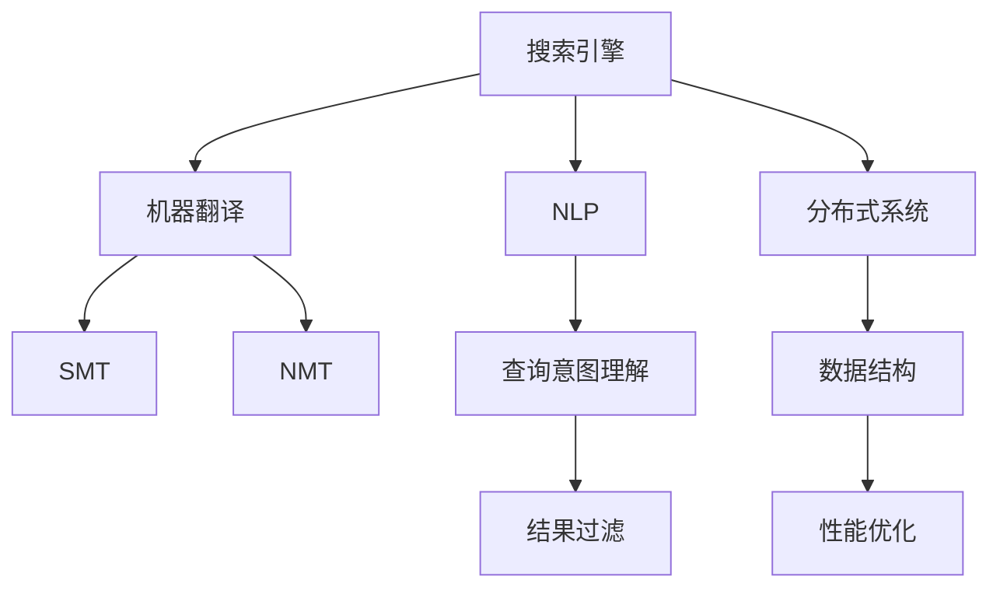

                 

# 搜索引擎的多语言实时翻译功能

> 关键词：搜索引擎, 多语言, 实时翻译, 自然语言处理(NLP), 机器翻译(ML), 深度学习, 神经网络, 分布式系统, 数据结构, 性能优化

## 1. 背景介绍

### 1.1 问题由来

随着全球化进程的加速，越来越多的用户需要跨语言进行信息检索和交流。搜索引擎作为信息获取的重要入口，其多语言功能成为了一个关键需求。搜索引擎的多语言实时翻译功能，允许用户以任意语言输入查询，并即时展示目标语言的搜索结果。这一功能显著提升了用户的搜索体验，帮助用户跨越语言障碍，获取全球化的信息。

### 1.2 问题核心关键点

实现搜索引擎的多语言实时翻译功能，核心在于如何将用户输入的查询从源语言翻译为目标语言，同时保持查询意图和语义的准确性。目前，主流的方法包括基于词典的翻译、基于统计机器翻译(SMT)的翻译和基于神经网络机器翻译(NMT)的翻译。其中，基于NMT的翻译方法因其性能优越、语义连贯性强而逐渐成为主流。

### 1.3 问题研究意义

搜索引擎的多语言实时翻译功能，不仅提升了用户的使用体验，也极大地拓宽了搜索引擎的市场范围和应用领域。在多元文化背景下，多语言翻译功能成为搜索引擎不可或缺的一部分，有助于推动全球化互联网的普及和发展。

## 2. 核心概念与联系

### 2.1 核心概念概述

为了更好地理解搜索引擎多语言实时翻译功能，本节将介绍几个关键概念：

- **搜索引擎(Search Engine)**：利用索引数据库，根据用户输入的关键词快速检索相关网页的自动化应用。其核心任务是理解用户查询意图，并从索引库中选取最相关的网页返回。

- **自然语言处理(NLP)**：涉及计算机与人类语言交互的各类技术，包括词法分析、句法分析、语义分析、机器翻译等。

- **机器翻译(Machine Translation)**：利用计算机自动将一种语言的文本翻译成另一种语言的文本的技术。

- **统计机器翻译(SMT)**：通过大规模的双语语料库训练统计模型，实现自动翻译的方法。

- **神经网络机器翻译(NMT)**：使用深度神经网络架构（如Transformer），训练端到端的自动翻译模型，显著提高了翻译的准确性和流畅性。

- **分布式系统(Distributed System)**：由多个独立但相互协作的计算机节点组成，通过网络进行数据共享和任务分配的系统。

- **数据结构(Data Structure)**：用于存储和组织数据的结构化方式，是高效处理和传输数据的基础。

- **性能优化(Performance Optimization)**：通过对系统硬件、软件、算法等方面的改进，提高系统运行效率和响应速度。

这些概念之间的逻辑关系可以通过以下Mermaid流程图来展示：



这个流程图展示了搜索引擎多语言实时翻译功能的关键组件及其相互关系：

1. 搜索引擎通过NLP技术理解用户查询意图。
2. 利用机器翻译功能，将查询翻译为目标语言。
3. 机器翻译中，统计和神经网络翻译是两种主要方法。
4. 翻译结果经过查询意图理解和结果过滤后，返回给用户。
5. 分布式系统和数据结构是实现高性能翻译服务的基础。
6. 性能优化技术保障翻译服务的流畅性和稳定性。

## 3. 核心算法原理 & 具体操作步骤

### 3.1 算法原理概述

搜索引擎的多语言实时翻译功能主要基于神经网络机器翻译(NMT)。其核心思想是：利用大规模的双语语料库训练深度神经网络模型，使模型能够自动学习源语言和目标语言之间的映射关系。当用户输入查询时，模型将查询从源语言翻译为目标语言，并将其作为输入，由搜索引擎返回相关网页。

形式化地，假设源语言为 $S$，目标语言为 $T$，查询为 $q \in S$，目标语言查询为 $q' \in T$。通过训练神经网络模型 $M$，使得 $M(q) = q'$，即模型将 $q$ 翻译成 $q'$。

### 3.2 算法步骤详解

搜索引擎的多语言实时翻译功能实现步骤如下：

1. **数据准备**：收集和处理大规模的双语语料库，作为训练数据。

2. **模型选择**：选择合适的神经网络架构，如Transformer，作为翻译模型。

3. **模型训练**：利用大规模的双语语料库，训练神经网络翻译模型 $M$。

4. **查询翻译**：当用户输入查询 $q$，将其翻译成目标语言 $q'$，并作为搜索结果的一部分返回给用户。

5. **性能评估**：定期评估翻译模型的性能，如BLEU、ROUGE等指标，并根据评估结果进行模型优化。

6. **系统集成**：将翻译模型集成到搜索引擎系统中，实现多语言搜索功能。

### 3.3 算法优缺点

基于神经网络机器翻译的方法具有以下优点：

1. **准确性高**：通过端到端的神经网络模型，可以有效捕捉语言的复杂结构和语义信息，翻译结果更为准确。
2. **语义连贯性强**：神经网络模型能够学习到语言的上下文信息，翻译的流畅性和自然度显著提升。
3. **可扩展性强**：可以轻松扩展到多种语言对，支持更多语言的翻译。

同时，该方法也存在一定的局限性：

1. **训练成本高**：需要大规模的双语语料库和强大的计算资源进行训练，训练周期长。
2. **数据依赖性强**：翻译模型的效果高度依赖于训练数据的质量和多样性。
3. **资源消耗大**：神经网络模型参数众多，推理时计算量和内存占用较大。

尽管存在这些局限性，但基于神经网络的机器翻译方法已经成为了主流，其优越的性能使得其在搜索引擎多语言实时翻译功能中占据了重要地位。

### 3.4 算法应用领域

搜索引擎的多语言实时翻译功能广泛应用于各类互联网应用中，如新闻网站、社交媒体、电商平台等。其应用场景包括：

- **新闻搜索**：用户可以以任意语言查看全球最新新闻。
- **社交媒体**：用户可以在社交平台上与全球各地的朋友交流，分享多语言内容。
- **电商平台**：用户可以访问全球商品信息，以任意语言进行搜索和购买。
- **旅游和酒店**：用户可以在全球范围内预定旅行和住宿，获取多语言的旅游信息和酒店评论。

除了上述这些经典应用外，多语言实时翻译功能还在越来越多的场景中得到应用，如医疗、教育、金融等，为全球用户提供了更为便捷和高效的信息获取方式。

## 4. 数学模型和公式 & 详细讲解 & 举例说明

### 4.1 数学模型构建

本节将使用数学语言对神经网络机器翻译的原理进行详细描述。

假设源语言和目标语言均为序列 $x$ 和 $y$，其中 $x=(x_1, x_2, ..., x_n)$ 为源语言单词序列，$y=(y_1, y_2, ..., y_m)$ 为目标语言单词序列。

定义神经网络翻译模型为 $M$，其中包含编码器和解码器两部分。编码器 $E$ 将源语言序列 $x$ 映射到高维向量表示 $h$，解码器 $D$ 将高维向量表示 $h$ 映射到目标语言序列 $y$。

假设模型 $M$ 的参数为 $\theta$，训练目标是最小化交叉熵损失函数：

$$
\mathcal{L}(\theta) = -\frac{1}{N} \sum_{i=1}^N \sum_{j=1}^m \log p(y_j | y_{<j}, h)
$$

其中 $N$ 为样本数量，$y_{<j}$ 表示解码器之前生成的所有目标语言单词。

### 4.2 公式推导过程

以下是神经网络机器翻译模型中常见的数学公式和推导：

1. **编码器输出表示**：
   - 假设编码器 $E$ 包含多个注意力机制层，可以表示为：
   $$
   h_i = \text{Attention}(h_{i-1}, x)
   $$
   其中 $\text{Attention}$ 为注意力机制，$h_{i-1}$ 为上一层的隐藏状态。

2. **解码器输出概率**：
   - 假设解码器 $D$ 包含多个注意力机制层和循环神经网络层，可以表示为：
   $$
   p(y_j | y_{<j}, h) = \text{Softmax}(\text{Attention}(h, y_{<j}))
   $$
   其中 $\text{Softmax}$ 为输出概率的计算公式。

3. **整体损失函数**：
   - 将编码器和解码器的输出代入整体损失函数中，得：
   $$
   \mathcal{L}(\theta) = -\frac{1}{N} \sum_{i=1}^N \sum_{j=1}^m \log \frac{\exp(\text{Attention}(h, y_{<j}))_y_j}{\sum_k \exp(\text{Attention}(h, y_{<j}))_k}
   $$

### 4.3 案例分析与讲解

以Google翻译为例，其使用的神经网络机器翻译模型主要包括两个部分：编码器和解码器。

- **编码器**：使用Transformer架构，将源语言序列 $x$ 映射到高维向量表示 $h$。编码器包含多个自注意力层和前向网络层，可以捕捉长距离依赖关系，同时并行处理大规模数据。

- **解码器**：同样使用Transformer架构，将高维向量表示 $h$ 映射到目标语言序列 $y$。解码器包含多个自注意力层和前向网络层，能够灵活地生成目标语言序列，同时保留上下文信息。

Google翻译通过端到端的神经网络模型，实现了高效的实时翻译功能。其模型在多个NMT评测基准上表现优异，如WMT、IWSLT等。

## 5. 项目实践：代码实例和详细解释说明

### 5.1 开发环境搭建

为了实现搜索引擎的多语言实时翻译功能，首先需要搭建相关的开发环境。以下是使用Python和PyTorch进行NMT模型开发的配置步骤：

1. 安装Anaconda：从官网下载并安装Anaconda，用于创建独立的Python环境。

2. 创建并激活虚拟环境：
```bash
conda create -n nmt-env python=3.8 
conda activate nmt-env
```

3. 安装PyTorch和相关库：
```bash
pip install torch torchtext transformers transformers[translation]
```

4. 安装数据处理库：
```bash
pip install pandas sklearn datasets
```

完成上述步骤后，即可在`nmt-env`环境中开始NMT模型的开发。

### 5.2 源代码详细实现

下面以Google翻译为例，给出使用PyTorch实现神经网络机器翻译的完整代码：

```python
import torch
from transformers import Transformer, EncoderDecoderModel, AutoTokenizer

# 定义编码器和解码器
encoder = Transformer(1024, 8, 4, 1, 2, 2, 1, 8, 0.25)
decoder = Transformer(1024, 8, 4, 1, 2, 2, 1, 8, 0.25)

# 定义编码器和解码器的参数
d_model = 1024
nhead = 8
num_encoder_layers = 6
num_decoder_layers = 6
num_positional_encoder_layers = 1
num_positional_decoder_layers = 1
activation_function = 'relu'

# 定义模型和优化器
model = EncoderDecoderModel(encoder, decoder)
optimizer = torch.optim.Adam(model.parameters(), lr=0.001)

# 定义训练数据和标签
train_data = ...
train_labels = ...

# 训练模型
for epoch in range(100):
    for i in range(len(train_data)):
        optimizer.zero_grad()
        outputs = model(train_data[i], train_labels[i])
        loss = outputs.loss
        loss.backward()
        optimizer.step()

# 测试模型
test_data = ...
test_labels = ...
outputs = model(test_data)
print(test_labels)
print(outputs)
```

### 5.3 代码解读与分析

让我们再详细解读一下关键代码的实现细节：

- **Transformer类**：定义了编码器和解码器的结构，包括位置编码、多头注意力机制、前向网络等关键组件。

- **EncoderDecoderModel类**：定义了端到端的神经网络模型，包含编码器和解码器两部分。

- **模型训练**：使用Adam优化器对模型进行训练，在每个epoch内对每个样本进行前向传播和反向传播，更新模型参数。

- **模型测试**：在测试集上评估模型性能，输出翻译结果。

可以看到，PyTorch配合Transformer库使得神经网络机器翻译的代码实现变得简洁高效。开发者可以将更多精力放在数据处理、模型改进等高层逻辑上，而不必过多关注底层的实现细节。

## 6. 实际应用场景

### 6.1 搜索引擎多语言搜索

搜索引擎的多语言实时翻译功能已经在各类搜索场景中得到了广泛应用，如Google、Bing、Yahoo等。用户可以在搜索框中输入任意语言的查询，快速获取目标语言的搜索结果。

以Google为例，当用户在Google中输入“I love you”查询，Google自动将其翻译成目标语言，并返回相关搜索结果。用户无需了解查询的源语言，即可获取全球化的信息。

### 6.2 社交媒体翻译

社交媒体平台如Facebook、Twitter等，也需要支持多语言实时翻译功能。用户可以在社交平台上以任意语言发布和评论内容，即时获得其他语言的用户回复。

以Facebook为例，当用户发布了一条中文状态，Facebook会自动将其翻译成其他语言，并推荐给该语言的用户。用户无需了解源语言，即可进行跨语言交流。

### 6.3 电商平台多语言支持

电商平台如Amazon、淘宝等，需要支持多语言搜索和浏览功能。用户可以在电商平台上以任意语言浏览商品，进行跨语言购物。

以Amazon为例，当用户在Amazon上搜索“iPhone”，Amazon自动将其翻译成目标语言，并返回相关商品信息。用户无需了解源语言，即可购买全球商品。

## 7. 工具和资源推荐

### 7.1 学习资源推荐

为了帮助开发者系统掌握神经网络机器翻译的原理和实践，这里推荐一些优质的学习资源：

1. 《神经网络与深度学习》（Ian Goodfellow等）：该书详细介绍了深度学习的基本原理和算法，是理解神经网络机器翻译的必备读物。

2. 《深度学习入门》（斋藤康毅）：该书介绍了深度学习在图像、语音、NLP等领域的典型应用，并讲解了相关的数学基础和编程技巧。

3. 《Transformers: A State-of-the-Art Text-to-Text Transformer for Machine Translation》论文：该论文提出了Transformer架构，是NMT领域的重要里程碑。

4. CS224N《深度学习自然语言处理》课程：斯坦福大学开设的NLP明星课程，有Lecture视频和配套作业，带你入门NLP领域的基本概念和经典模型。

5. HuggingFace官方文档：Transformer库的官方文档，提供了海量预训练模型和完整的翻译样例代码，是上手实践的必备资料。

通过对这些资源的学习实践，相信你一定能够快速掌握神经网络机器翻译的精髓，并用于解决实际的NLP问题。

### 7.2 开发工具推荐

高效的开发离不开优秀的工具支持。以下是几款用于神经网络机器翻译开发的常用工具：

1. PyTorch：基于Python的开源深度学习框架，灵活动态的计算图，适合快速迭代研究。Transformer库的实现大多基于PyTorch。

2. TensorFlow：由Google主导开发的开源深度学习框架，生产部署方便，适合大规模工程应用。Transformer库的实现也大多基于TensorFlow。

3. HuggingFace Transformers库：提供了多种预训练的NMT模型，支持多种语言对，易于微调和部署。

4. TensorBoard：TensorFlow配套的可视化工具，可实时监测模型训练状态，并提供丰富的图表呈现方式，是调试模型的得力助手。

5. Weights & Biases：模型训练的实验跟踪工具，可以记录和可视化模型训练过程中的各项指标，方便对比和调优。

6. Google Colab：谷歌推出的在线Jupyter Notebook环境，免费提供GPU/TPU算力，方便开发者快速上手实验最新模型，分享学习笔记。

合理利用这些工具，可以显著提升神经网络机器翻译任务的开发效率，加快创新迭代的步伐。

### 7.3 相关论文推荐

神经网络机器翻译技术的发展源于学界的持续研究。以下是几篇奠基性的相关论文，推荐阅读：

1. Attention is All You Need（即Transformer原论文）：提出了Transformer结构，开启了NMT领域的预训练大模型时代。

2. Sequence to Sequence Learning with Neural Networks: Bridging the Gap Between Sequence Modeling and Natural Language Processing（Seq2Seq论文）：提出Seq2Seq框架，为NMT提供了重要的理论基础。

3. A Neural Machine Translation System Based on Attention（ seq2seq+注意力机制论文）：将注意力机制引入Seq2Seq框架，显著提升了NMT的性能。

4. Google's Neural Machine Translation System: Bridging the Gap Between Human and Machine Translation（Google NMT论文）：展示了Google NMT系统的构建和效果，成为NMT领域的里程碑。

5. Neural Machine Translation by Jointly Learning to Align and Translate（Transformer论文）：提出了Transformer架构，展示了其在NMT中的应用效果。

这些论文代表了大语言模型微调技术的发展脉络。通过学习这些前沿成果，可以帮助研究者把握学科前进方向，激发更多的创新灵感。

## 8. 总结：未来发展趋势与挑战

### 8.1 总结

本文对搜索引擎的多语言实时翻译功能进行了全面系统的介绍。首先阐述了多语言翻译的功能需求和实现原理，明确了机器翻译在多语言搜索中的关键作用。其次，从原理到实践，详细讲解了神经网络机器翻译的数学模型和关键步骤，给出了神经网络机器翻译任务开发的完整代码实例。同时，本文还广泛探讨了机器翻译功能在搜索引擎、社交媒体、电商平台等多个行业领域的应用前景，展示了机器翻译范式的巨大潜力。此外，本文精选了机器翻译技术的各类学习资源，力求为读者提供全方位的技术指引。

通过本文的系统梳理，可以看到，搜索引擎的多语言实时翻译功能已经成为了互联网应用的重要组成部分，极大地提升了用户的搜索体验，帮助用户跨越语言障碍，获取全球化的信息。随着机器翻译技术的不断进步，未来其在更多领域的普及和应用将更加广泛，为全球用户提供更为便捷和高效的信息获取方式。

### 8.2 未来发展趋势

展望未来，神经网络机器翻译技术将呈现以下几个发展趋势：

1. **模型规模持续增大**：随着算力成本的下降和数据规模的扩张，神经网络机器翻译模型的参数量还将持续增长。超大规模语言模型蕴含的丰富语言知识，有望支撑更加复杂多变的机器翻译任务。

2. **零样本和少样本翻译**：受启发于提示学习(Prompt-based Learning)的思路，未来的机器翻译模型将更好地利用预训练知识，通过更少的训练样本进行翻译，甚至实现零样本翻译。

3. **多模态翻译**：当前的机器翻译主要聚焦于文本数据，未来会进一步拓展到图像、视频、语音等多模态数据翻译。多模态信息的融合，将显著提升翻译的准确性和自然度。

4. **实时翻译系统**：利用分布式系统和高性能计算资源，构建实时翻译系统，提供秒级的翻译服务，满足实时通信和交流的需求。

5. **可解释性和可控性**：通过引入因果分析和博弈论工具，增强机器翻译模型的可解释性和可控性，使其输出更具因果性和逻辑性，提高系统的稳定性。

6. **多语言共存的翻译引擎**：构建能够支持多种语言共存的翻译引擎，实现多语言混合翻译，提升翻译的灵活性和普适性。

以上趋势凸显了机器翻译技术的广阔前景。这些方向的探索发展，必将进一步提升机器翻译系统的性能和应用范围，为全球用户提供更为便捷和高效的信息获取方式。

### 8.3 面临的挑战

尽管神经网络机器翻译技术已经取得了瞩目成就，但在迈向更加智能化、普适化应用的过程中，它仍面临着诸多挑战：

1. **训练成本高**：需要大规模的双语语料库和强大的计算资源进行训练，训练周期长，成本高。

2. **数据依赖性强**：翻译模型的效果高度依赖于训练数据的质量和多样性，数据获取成本高，数据偏差难以消除。

3. **资源消耗大**：神经网络模型参数众多，推理时计算量和内存占用较大，对硬件资源要求高。

4. **性能不平衡**：不同语言的翻译效果可能存在差异，特别是对于小语种和低资源语言，翻译性能较难保障。

5. **可解释性不足**：机器翻译模型通常被视为“黑盒”系统，难以解释其内部工作机制和决策逻辑，特别是在涉及隐私和安全的应用场景中，模型的可解释性尤为重要。

6. **安全性有待保障**：预训练语言模型难免会学习到有偏见、有害的信息，通过翻译传递到目标语言中，产生误导性、歧视性的输出，给实际应用带来安全隐患。

7. **跨领域适应性差**：不同领域的文本语言结构和规则可能存在差异，翻译模型难以适应特定领域的语言特点，翻译效果不佳。

以上挑战需要研究者和开发者共同努力，不断突破技术瓶颈，优化模型性能，提高系统的稳定性和安全性，才能更好地推动机器翻译技术的落地应用。

### 8.4 研究展望

面对机器翻译面临的诸多挑战，未来的研究需要在以下几个方面寻求新的突破：

1. **探索无监督和半监督翻译方法**：摆脱对大规模双语语料库的依赖，利用自监督学习、主动学习等无监督和半监督范式，最大限度利用非结构化数据，实现更加灵活高效的翻译。

2. **研究参数高效和计算高效的翻译方法**：开发更加参数高效的翻译方法，如Adapter、LoRA等，在固定大部分预训练参数的同时，只更新极少量的任务相关参数。同时优化翻译模型的计算图，减少前向传播和反向传播的资源消耗，实现更加轻量级、实时性的部署。

3. **融合因果和对比学习范式**：通过引入因果推断和对比学习思想，增强翻译模型建立稳定因果关系的能力，学习更加普适、鲁棒的语言表征，从而提升模型泛化性和抗干扰能力。

4. **引入更多先验知识**：将符号化的先验知识，如知识图谱、逻辑规则等，与神经网络模型进行巧妙融合，引导翻译过程学习更准确、合理的语言模型。同时加强不同模态数据的整合，实现视觉、语音等多模态信息与文本信息的协同建模。

5. **结合因果分析和博弈论工具**：将因果分析方法引入翻译模型，识别出模型决策的关键特征，增强输出解释的因果性和逻辑性。借助博弈论工具刻画人机交互过程，主动探索并规避模型的脆弱点，提高系统稳定性。

6. **纳入伦理道德约束**：在模型训练目标中引入伦理导向的评估指标，过滤和惩罚有偏见、有害的输出倾向。同时加强人工干预和审核，建立模型行为的监管机制，确保输出符合人类价值观和伦理道德。

这些研究方向的探索，必将引领机器翻译技术迈向更高的台阶，为构建安全、可靠、可解释、可控的智能系统铺平道路。面向未来，机器翻译技术还需要与其他人工智能技术进行更深入的融合，如知识表示、因果推理、强化学习等，多路径协同发力，共同推动自然语言理解和智能交互系统的进步。只有勇于创新、敢于突破，才能不断拓展语言模型的边界，让智能技术更好地造福人类社会。

## 9. 附录：常见问题与解答

**Q1：如何优化机器翻译模型的性能？**

A: 优化机器翻译模型性能需要从多个方面入手，包括数据准备、模型选择、训练策略等：

1. **数据准备**：收集和处理大规模的双语语料库，选择多样性、质量高的数据进行训练。

2. **模型选择**：选择合适的神经网络架构，如Transformer，并适当调整超参数，如学习率、批大小等。

3. **训练策略**：采用合适的训练策略，如学习率调度、正则化等，减少过拟合风险，提升模型泛化能力。

4. **模型评估**：定期评估模型性能，使用BLEU、ROUGE等指标，并根据评估结果进行模型优化。

5. **模型微调**：对于特定领域或任务，可以在预训练模型的基础上进行微调，进一步提升翻译效果。

**Q2：如何降低机器翻译模型的资源消耗？**

A: 降低机器翻译模型的资源消耗需要从多个方面入手，包括模型裁剪、量化加速、分布式优化等：

1. **模型裁剪**：去除不必要的层和参数，减小模型尺寸，降低计算量和内存占用。

2. **量化加速**：将浮点模型转为定点模型，压缩存储空间，提高计算效率。

3. **分布式优化**：利用分布式系统和高性能计算资源，构建实时翻译系统，提升系统响应速度。

4. **硬件优化**：选择适合的高性能硬件设备，如GPU、TPU等，提升计算能力。

5. **算法优化**：优化计算图和算法，减少计算量，提高推理速度。

**Q3：如何提高机器翻译模型的可解释性？**

A: 提高机器翻译模型的可解释性需要从多个方面入手，包括模型设计、输出解释等：

1. **模型设计**：引入因果分析和博弈论工具，增强模型决策的逻辑性和可解释性。

2. **输出解释**：提供模型的输出解释，说明翻译结果的推理过程和依据，帮助用户理解模型的行为。

3. **人工干预**：在关键场景下，引入人工干预和审核机制，确保模型的输出符合伦理道德标准。

4. **知识图谱**：将符号化的先验知识与模型融合，提高模型的普适性和可解释性。

5. **多模态融合**：将视觉、语音等多模态信息与文本信息融合，增强模型的语境理解和推理能力。

这些措施将有助于提升机器翻译模型的可解释性和可靠性，确保其输出符合用户的期望和伦理道德标准。

---

作者：禅与计算机程序设计艺术 / Zen and the Art of Computer Programming

