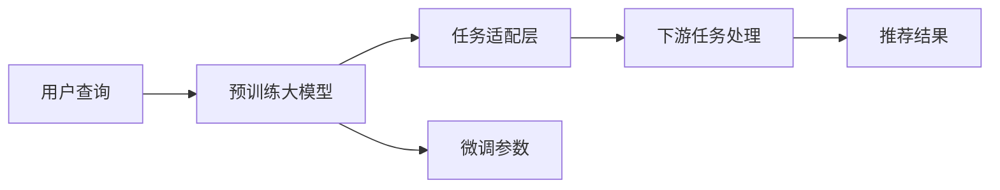

                 

## 1. 背景介绍

在互联网时代，个性化推荐系统成为提高用户体验、驱动电商增长、增强平台粘性的核心手段。然而，推荐系统面临着高延迟、冷启动、多样性等多个挑战，亟需新的技术突破。近年来，大语言模型（如GPT-3、MPLUGO等）的出现，带来了推荐系统新的解决方案。基于大模型的推荐系统能够在低延迟下实现个性化推荐，为电商、内容分发、社交网络等领域带来革命性的变化。

## 2. 核心概念与联系

### 2.1 核心概念概述

大语言模型是一种通过自监督学习从大规模无标签数据中训练得到的模型，可以用于多种自然语言处理任务，包括文本生成、文本分类、问答、对话等。在推荐系统中，大语言模型可以用于理解用户需求、生成推荐内容、优化推荐策略等环节。

推荐系统是通过对用户行为数据和物品属性数据的分析，利用机器学习算法预测用户对物品的兴趣，从而进行个性化推荐的系统。推荐系统可以分为基于协同过滤、基于内容的推荐、基于混合模型的推荐等不同类型，其中基于内容的推荐模型和基于协同过滤模型的实时性较差，难以应对用户的即时需求。

基于大语言模型的推荐系统通过微调大模型，使其在特定领域内获得优异的推荐效果。通过在大模型基础上进一步微调，模型能够即时响应用户的查询，输出个性化推荐结果，从而提升推荐系统的实时性。

### 2.2 核心概念原理和架构的 Mermaid 流程图



- A：用户查询
- B：预训练大模型，如GPT-3、MPLUGO等
- C：任务适配层，根据推荐任务类型，设计相应的输出层和损失函数
- D：下游任务处理，包括理解用户查询、生成推荐内容、优化推荐策略等
- E：推荐结果，根据用户的实时查询输出个性化推荐内容
- F：微调参数，根据推荐任务特点，调整预训练大模型的参数

## 3. 核心算法原理 & 具体操作步骤

### 3.1 算法原理概述

基于大模型的推荐系统通常包括以下几个步骤：

1. **预训练大模型**：使用大规模无标签数据对预训练大模型进行自监督学习，学习通用的语言表示和模式。
2. **任务适配**：根据推荐任务的特点，设计相应的任务适配层，将预训练大模型输出映射到推荐任务空间。
3. **微调参数**：利用推荐任务的数据，对预训练大模型的参数进行微调，优化模型在特定推荐任务上的表现。
4. **实时推理**：在用户查询到来时，将查询输入到微调后的模型中，输出推荐结果。

### 3.2 算法步骤详解

#### 步骤一：预训练大模型

预训练大模型的构建需要大规模无标签文本数据，通常使用大规模的维基百科、新闻、网页等数据集。预训练过程一般包括以下几个步骤：

1. 数据预处理：对数据进行去重、分词、清洗等预处理，确保数据的质量和一致性。
2. 构建训练集：将数据划分为训练集、验证集和测试集。训练集用于模型的预训练，验证集用于参数调整，测试集用于模型评估。
3. 模型构建：选择合适的深度学习框架，如TensorFlow、PyTorch等，构建预训练大模型。
4. 训练模型：使用大规模GPU集群，对预训练大模型进行训练，通常需要几千到几万个GPU进行训练。

#### 步骤二：任务适配

任务适配层的构建需要根据推荐任务的特点，设计相应的输出层和损失函数。常见的适配层包括：

1. **文本生成适配层**：用于生成推荐内容，如商品描述、文章摘要等。适配层通常包括生成模型和语言模型。
2. **文本分类适配层**：用于判断用户对物品的兴趣，适配层通常包括分类模型和回归模型。
3. **问答适配层**：用于回答用户查询，适配层通常包括问答模型和语义理解模型。

#### 步骤三：微调参数

微调参数的过程需要选择合适的优化算法，如Adam、SGD等，设置合适的学习率、批大小、迭代轮数等。微调过程通常包括以下几个步骤：

1. 模型加载：将预训练大模型的参数加载到微调模型中。
2. 数据加载：将推荐任务的数据集加载到模型中，进行数据增强、划分等操作。
3. 模型训练：在推荐数据集上进行微调训练，更新模型参数。
4. 模型评估：在验证集和测试集上评估模型性能，进行超参数调整。

#### 步骤四：实时推理

实时推理需要构建高效的模型推理引擎，通常包括以下几个步骤：

1. 模型加载：将微调后的模型加载到推理引擎中。
2. 数据预处理：对用户查询进行预处理，包括分词、清洗、编码等操作。
3. 推理计算：将用户查询输入到微调模型中，输出推荐结果。
4. 结果处理：对推荐结果进行后处理，如排序、去重、格式化等操作。

### 3.3 算法优缺点

#### 优点

1. **实时性强**：基于大模型的推荐系统能够在低延迟下进行实时推荐，满足用户即时需求。
2. **效果显著**：通过微调大模型，推荐系统能够针对特定任务进行优化，提升推荐效果。
3. **泛化能力强**：预训练大模型在广泛领域内具有强大的泛化能力，能够应对多种推荐任务。

#### 缺点

1. **资源消耗大**：预训练大模型的训练和推理需要大量计算资源，带来较高的成本。
2. **模型复杂度高**：大模型的结构复杂，微调过程中参数调整较为困难。
3. **模型解释性差**：基于大模型的推荐系统缺乏可解释性，难以理解模型的决策过程。

### 3.4 算法应用领域

基于大模型的推荐系统广泛应用于电商、内容分发、社交网络等多个领域。常见的应用场景包括：

1. **电商推荐**：通过理解用户的浏览记录和行为数据，生成个性化商品推荐，提升用户购买率。
2. **内容推荐**：通过分析用户的历史阅读记录和点击行为，生成个性化文章、视频等推荐内容，提升用户粘性。
3. **社交推荐**：通过分析用户的社交网络行为和兴趣偏好，推荐好友和相关内容，提升社交平台的用户活跃度。

## 4. 数学模型和公式 & 详细讲解 & 举例说明

### 4.1 数学模型构建

基于大模型的推荐系统通常使用文本生成模型进行任务适配。文本生成模型的目标是在给定上下文的情况下，生成下一个单词或字符的概率。设 $M$ 为预训练大模型，$S$ 为任务适配层，$T$ 为下游任务处理层。推荐系统的数学模型可以表示为：

$$ P(y|x) = P(y|M(x)) $$

其中，$x$ 为用户的查询，$y$ 为推荐结果。

### 4.2 公式推导过程

文本生成模型的目标函数通常为交叉熵损失函数，设 $\ell$ 为损失函数，推荐系统的优化目标为：

$$ \mathop{\arg\min}_{\theta} \sum_{i=1}^N \ell(y_i, M(x_i)) $$

其中，$\theta$ 为模型参数，$N$ 为数据集大小。

在训练过程中，使用梯度下降等优化算法，计算模型参数的梯度，并更新模型参数，最小化损失函数。具体推导过程如下：

1. **前向传播**：将用户查询 $x$ 输入到预训练大模型 $M$ 中，得到输出 $z$。
2. **损失计算**：将 $z$ 输入到任务适配层 $S$ 中，得到推荐结果 $y$。
3. **反向传播**：计算损失函数 $\ell(y_i, M(x_i))$ 对模型参数 $\theta$ 的梯度，使用优化算法更新模型参数。

### 4.3 案例分析与讲解

假设我们要构建一个基于大模型的电商推荐系统，其数据集包含用户的历史浏览记录和商品的属性信息。我们首先对数据进行预处理，构建预训练大模型，然后设计任务适配层，对模型进行微调，最后进行实时推理，生成个性化商品推荐。

具体步骤如下：

1. **预训练大模型**：我们使用GPT-3作为预训练大模型，使用大规模电商数据集对其进行预训练。
2. **任务适配层**：根据电商推荐任务的特点，设计文本生成适配层，包括生成模型和语言模型。
3. **微调参数**：利用电商数据集对微调后的模型进行训练，优化模型在特定电商推荐任务上的表现。
4. **实时推理**：在用户浏览商品时，将用户的浏览记录输入到微调后的模型中，生成个性化推荐商品。

## 5. 项目实践：代码实例和详细解释说明

### 5.1 开发环境搭建

开发环境搭建需要以下软件和工具：

1. **深度学习框架**：选择TensorFlow或PyTorch作为深度学习框架。
2. **大模型库**：选择MPLUGO、HuggingFace等大模型库。
3. **数据预处理工具**：选择Python内置工具或第三方库，如NLTK、SpaCy等。
4. **数据集**：收集电商、内容分发、社交网络等领域的推荐数据集，并进行预处理。
5. **计算资源**：选择GPU集群进行模型训练和推理，提升计算效率。

### 5.2 源代码详细实现

以下是一个基于TensorFlow的电商推荐系统代码实现，用于训练和推理微调后的模型：

```python
import tensorflow as tf
import numpy as np
from tensorflow.keras.layers import Input, Dense, Embedding, Dropout, LSTM
from tensorflow.keras.models import Model

# 定义模型参数
vocab_size = 10000  # 词汇表大小
embedding_dim = 128  # 嵌入维度
lstm_units = 128  # LSTM单元数
dropout_rate = 0.2  # 丢弃率

# 定义输入层
input_layer = Input(shape=(max_seq_length,))

# 定义嵌入层
embedding_layer = Embedding(vocab_size, embedding_dim, input_length=max_seq_length)(input_layer)

# 定义LSTM层
lstm_layer = LSTM(lstm_units, dropout=dropout_rate, recurrent_dropout=dropout_rate)(embedding_layer)

# 定义输出层
output_layer = Dense(num_classes, activation='softmax')(lstm_layer)

# 定义模型
model = Model(input_layer, output_layer)

# 定义损失函数
loss_fn = tf.keras.losses.SparseCategoricalCrossentropy()

# 定义优化器
optimizer = tf.keras.optimizers.Adam(learning_rate=0.001)

# 定义训练函数
def train_epoch(model, data, batch_size):
    total_loss = 0
    for i in range(0, data['train_data'].shape[0], batch_size):
        x = data['train_data'][i:i+batch_size]
        y = data['train_labels'][i:i+batch_size]
        with tf.GradientTape() as tape:
            logits = model(x, training=True)
            loss = loss_fn(y, logits)
        grads = tape.gradient(loss, model.trainable_variables)
        optimizer.apply_gradients(zip(grads, model.trainable_variables))
        total_loss += loss.numpy().sum()
    return total_loss / len(data['train_data'])

# 训练模型
epochs = 10
batch_size = 32
model.compile(optimizer=optimizer, loss=loss_fn, metrics=['accuracy'])

# 加载数据集
train_data, train_labels = load_data('train.csv', batch_size)
dev_data, dev_labels = load_data('dev.csv', batch_size)
test_data, test_labels = load_data('test.csv', batch_size)

# 训练模型
history = model.fit(train_data, train_labels, epochs=epochs, validation_data=(dev_data, dev_labels))

# 评估模型
dev_loss, dev_acc = model.evaluate(dev_data, dev_labels)
print('Dev loss:', dev_loss, 'Dev accuracy:', dev_acc)

# 推理模型
test_loss, test_acc = model.evaluate(test_data, test_labels)
print('Test loss:', test_loss, 'Test accuracy:', test_acc)

# 使用模型进行实时推理
def predict(user_query, max_seq_length):
    user_query = preprocess(user_query, max_seq_length)
    prediction = model.predict(user_query)
    return prediction
```

### 5.3 代码解读与分析

代码实现分为以下几个部分：

1. **模型构建**：定义输入层、嵌入层、LSTM层、输出层等组件，构建电商推荐系统的模型。
2. **损失函数**：使用交叉熵损失函数作为模型训练的目标函数。
3. **优化器**：选择Adam优化器，并设置合适的学习率。
4. **训练函数**：定义训练函数，计算损失和梯度，并更新模型参数。
5. **数据加载**：加载电商推荐系统的训练集、验证集和测试集。
6. **模型训练**：使用训练函数对模型进行训练，获取训练和验证结果。
7. **模型评估**：使用模型在测试集上评估模型的性能。
8. **实时推理**：定义推理函数，对用户查询进行预处理和预测。

代码实现中，我们使用了TensorFlow的Keras API，简化了模型的构建和训练过程。同时，我们使用了LSTM层作为推荐系统的核心组件，能够捕捉用户查询和商品属性之间的复杂关系。

## 6. 实际应用场景

基于大模型的推荐系统已经在电商、内容分发、社交网络等多个领域得到广泛应用，取得了显著的效果。

1. **电商推荐**：如亚马逊、淘宝等电商平台的个性化推荐系统，通过理解用户的浏览记录和购买历史，生成个性化商品推荐，提升用户购买率。
2. **内容推荐**：如Netflix、YouTube等流媒体平台的个性化推荐系统，通过分析用户的观看记录和点击行为，生成个性化视频、文章等推荐内容，提升用户粘性。
3. **社交推荐**：如Facebook、微信等社交平台的个性化推荐系统，通过分析用户的社交网络行为和兴趣偏好，推荐好友和相关内容，提升社交平台的用户活跃度。

## 7. 工具和资源推荐

### 7.1 学习资源推荐

1. **《深度学习与推荐系统》**：深入介绍推荐系统的基本概念和算法，推荐系统的发展历程，以及深度学习在推荐系统中的应用。
2. **《Python深度学习》**：介绍Python深度学习框架的使用方法，包括TensorFlow、Keras、PyTorch等。
3. **《自然语言处理综述》**：介绍自然语言处理的基本概念和算法，包括语言模型、词向量、序列标注等。
4. **《大模型技术白皮书》**：详细介绍大语言模型的原理、应用和挑战，以及相关技术和工具。
5. **《HuggingFace官方文档》**：提供大模型库的使用指南和示例代码，涵盖模型构建、微调、推理等多个环节。

### 7.2 开发工具推荐

1. **TensorFlow**：深度学习框架，支持分布式计算和GPU加速。
2. **PyTorch**：深度学习框架，支持动态图和自动微分。
3. **MPLUGO**：大模型库，提供丰富的预训练模型和微调工具。
4. **Weights & Biases**：模型实验跟踪工具，记录和可视化模型训练过程。
5. **TensorBoard**：模型可视化工具，实时监测模型训练状态。

### 7.3 相关论文推荐

1. **《Scalable Generative Conversational Agents》**：介绍基于大模型的对话生成系统，以及如何通过微调提升对话效果。
2. **《Masked Language Model Pre-training for Language Understanding and Generation》**：介绍BERT模型在自然语言处理中的应用，以及如何通过微调提升语言理解能力。
3. **《Self-Attention and Sequence Modeling for Graph Prediction》**：介绍GPT-3在图数据上的应用，以及如何通过微调提升图预测精度。
4. **《Attention Is All You Need》**：介绍Transformer模型在自然语言处理中的应用，以及如何通过微调提升模型效果。

## 8. 总结：未来发展趋势与挑战

### 8.1 研究成果总结

基于大模型的推荐系统在实时个性化推荐、低延迟处理、泛化能力等方面取得了显著的效果。通过微调大模型，推荐系统能够针对特定任务进行优化，提升推荐效果。未来，基于大模型的推荐系统将在更多领域得到应用，为电商、内容分发、社交网络等领域带来革命性的变化。

### 8.2 未来发展趋势

1. **实时性进一步提升**：未来的大模型推荐系统将进一步提升实时性，能够在毫秒级时间内完成推理和推荐。
2. **泛化能力增强**：通过更高效的微调方法，大模型推荐系统将能够处理更多领域、更多类型的数据，提升泛化能力。
3. **可解释性增强**：通过引入可解释性技术，如因果推断、对抗样本等，提升推荐系统的透明度和可信度。
4. **用户反馈优化**：通过收集用户反馈数据，优化推荐算法，提升推荐系统的个性化和多样性。
5. **多模态数据融合**：通过融合多模态数据，如文本、图片、视频等，提升推荐系统的效果和体验。

### 8.3 面临的挑战

1. **数据隐私问题**：推荐系统需要大量的用户行为数据进行训练和优化，如何保护用户隐私成为一大挑战。
2. **推荐公平性**：推荐系统可能存在性别、种族等偏见，如何保证推荐系统的公平性是一大难题。
3. **计算资源需求高**：大模型的训练和推理需要大量的计算资源，如何降低计算成本是一大挑战。
4. **模型复杂度高**：大模型的结构复杂，如何降低模型复杂度、提升推理速度是一大难题。
5. **模型解释性差**：基于大模型的推荐系统缺乏可解释性，难以理解模型的决策过程，如何提升模型的可解释性是一大挑战。

### 8.4 研究展望

未来，基于大模型的推荐系统需要在数据隐私、推荐公平性、计算资源需求、模型复杂度、模型解释性等方面进行持续优化，进一步提升推荐效果和用户体验。同时，大模型推荐系统需要与其他技术进行更深入的融合，如知识图谱、因果推理、强化学习等，多路径协同发力，共同推动推荐系统的进步。

## 9. 附录：常见问题与解答

**Q1: 大模型推荐系统是否适用于所有推荐任务？**

A: 大模型推荐系统适用于大多数推荐任务，但需要根据任务特点进行适当的调整和优化。对于某些特定领域的推荐任务，如医学、法律等，可能需要使用更专业领域的预训练模型。

**Q2: 如何选择合适的大模型？**

A: 选择合适的大模型需要根据推荐任务的特点和数据特征进行综合考虑。通常来说，大模型的规模越大，性能越好，但也需要更多的计算资源。因此，需要在模型性能和计算成本之间进行权衡。

**Q3: 如何缓解大模型推荐系统的冷启动问题？**

A: 缓解冷启动问题的方法包括：
1. 使用用户的基本属性信息进行初始化推荐。
2. 利用多模态数据进行融合，提升推荐效果。
3. 通过引入新数据逐步优化推荐算法。

**Q4: 如何提高大模型推荐系统的泛化能力？**

A: 提高大模型推荐系统的泛化能力的方法包括：
1. 使用更广泛的数据进行预训练。
2. 进行跨领域迁移学习，提升模型在不同领域的表现。
3. 引入对抗样本训练，提高模型的鲁棒性。

**Q5: 如何平衡大模型推荐系统的推荐多样性和精准度？**

A: 平衡推荐多样性和精准度的方法包括：
1. 引入多样性约束，控制推荐结果的多样性。
2. 使用多目标优化方法，同时优化推荐多样性和精准度。
3. 定期更新推荐算法，调整推荐策略。

**Q6: 如何提升大模型推荐系统的实时性？**

A: 提升大模型推荐系统的实时性的方法包括：
1. 使用分布式计算，加速模型训练和推理。
2. 优化模型结构和算法，减少计算量。
3. 引入缓存机制，加快推荐结果的缓存和复用。

---

作者：禅与计算机程序设计艺术 / Zen and the Art of Computer Programming

