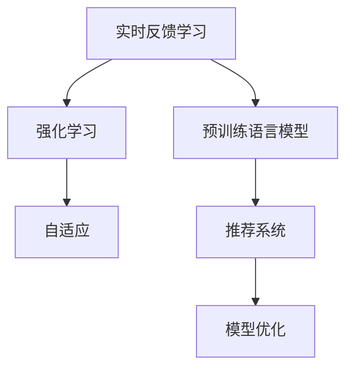

                 

# 搜索推荐的实时反馈学习：大模型策略

> 关键词：搜索推荐, 实时反馈学习, 大模型, 强化学习, 自适应, 模型优化

## 1. 背景介绍

在现代互联网环境中，信息爆炸的时代给用户带来了前所未有的便利，但同时也带来了选择困难的问题。从搜索结果到电商推荐，从视频推荐到新闻推送，大量的推荐系统正以高速发展。但是，现有的推荐系统往往缺乏对用户真实兴趣和行为变化的及时反馈，导致推荐效果和用户体验参差不齐。

为了解决这一问题，近年来，实时反馈学习(Real-time Feedback Learning)技术被引入推荐系统中。实时反馈学习利用用户实时交互行为（如点击、播放、浏览等）进行模型更新，以实时调整推荐策略，提高推荐效果。在技术实现上，常见的实时反馈学习框架包括线性回归模型、逻辑回归模型和深度神经网络。

本文将聚焦于大模型在搜索推荐中的实时反馈学习策略，探讨如何利用预训练语言模型（如BERT、GPT）的强大语言理解能力，在搜索推荐系统中进行实时学习，提升推荐效果。我们将在理论上阐述实时反馈学习的核心原理，在实践中提供大模型在搜索推荐中的应用代码，并通过案例分析讲解其实际应用效果。

## 2. 核心概念与联系

### 2.1 核心概念概述

为更好地理解大模型在实时反馈学习中的应用，本节将介绍几个密切相关的核心概念：

- **实时反馈学习(Real-time Feedback Learning)**：在推荐系统中，利用用户实时交互行为（如点击、播放、浏览等）进行模型更新，以实时调整推荐策略，提高推荐效果的技术。

- **预训练语言模型(Pre-trained Language Model)**：以自回归(如GPT)或自编码(如BERT)模型为代表的大规模预训练语言模型。通过在大规模无标签文本语料上进行预训练，学习通用的语言表示，具备强大的语言理解和生成能力。

- **强化学习(Reinforcement Learning)**：一种通过试错调整策略，最大化期望奖励的学习方式。在推荐系统中，可以通过强化学习调整推荐策略，以获取更好的用户体验。

- **自适应(Adaptive)**：根据用户的实时行为和反馈，动态调整模型参数，使其更符合用户当前兴趣和需求。

- **推荐系统(Recommendation System)**：根据用户历史行为和物品属性，为用户推荐最相关物品的系统。

- **模型优化(Model Optimization)**：通过各种方法对推荐模型进行优化，如增加模型复杂度、引入先验知识等，以提升推荐效果。

这些核心概念之间的逻辑关系可以通过以下Mermaid流程图来展示：



这个流程图展示了大模型在实时反馈学习中的应用场景：

1. 实时反馈学习利用用户交互行为进行模型更新。
2. 预训练语言模型提供强大的语言理解和生成能力。
3. 强化学习调整推荐策略以获取最大期望奖励。
4. 自适应调整模型参数以动态匹配用户需求。
5. 推荐系统根据用户历史行为和物品属性进行物品推荐。
6. 模型优化提升推荐效果，引入先验知识等技术手段。

这些概念共同构成了大模型在搜索推荐中的应用框架，使其能够在实时反馈学习中发挥强大的作用。通过理解这些核心概念，我们可以更好地把握大模型在推荐系统中的工作原理和优化方向。

## 3. 核心算法原理 & 具体操作步骤
### 3.1 算法原理概述

实时反馈学习利用用户的实时行为和反馈，动态调整推荐模型，以提升推荐效果。在大模型的实时反馈学习中，通常采用强化学习框架，通过试错调整模型策略，最大化用户的满意度和互动。

形式化地，设推荐系统用户的兴趣表示为 $x$，推荐物品为 $y$，用户对物品的反馈为 $r$。假设模型参数为 $\theta$，则推荐策略可以表示为 $f_{\theta}(x)$。在给定用户兴趣 $x$ 的情况下，推荐模型将推荐物品 $y$ 并得到用户反馈 $r$，推荐策略的目标是最大化期望奖励 $E_{x}[J(f_{\theta}(x),y)]$，其中 $J$ 为奖励函数。

实时反馈学习的目标是通过用户反馈 $r$ 进行模型更新，使模型策略逐步优化，最终逼近最优推荐策略 $f_{\theta^*}(x)$。具体来说，实时反馈学习通过以下步骤实现：

1. 收集用户行为数据，计算奖励函数 $J(f_{\theta}(x),y)$。
2. 根据奖励函数计算模型的损失函数 $\mathcal{L}(\theta)$。
3. 使用梯度下降等优化算法最小化损失函数，更新模型参数 $\theta$。
4. 重复上述过程，直至达到预设的迭代轮数或停止条件。

### 3.2 算法步骤详解

实时反馈学习的实现流程如下：

**Step 1: 准备数据集**
- 收集用户的点击、浏览、评分等行为数据，构建用户兴趣与物品推荐之间的映射。
- 将数据集分为训练集和测试集，用于模型训练和性能评估。

**Step 2: 构建推荐模型**
- 选择合适的预训练语言模型（如BERT、GPT），并对其进行微调。
- 设计推荐策略，如基于内容的推荐、协同过滤等。

**Step 3: 设置模型参数**
- 选择合适的优化算法及其参数，如Adam、SGD等。
- 设置学习率、批大小、迭代轮数等超参数。

**Step 4: 实时更新模型**
- 实时采集用户行为数据，计算奖励函数 $J$。
- 根据奖励函数计算模型的损失函数 $\mathcal{L}$，使用梯度下降等优化算法更新模型参数 $\theta$。

**Step 5: 评估模型性能**
- 在测试集上评估模型的推荐效果，如准确率、召回率、用户满意度等。
- 定期更新模型，保持模型的推荐效果和性能。

### 3.3 算法优缺点

实时反馈学习在搜索推荐中的主要优点包括：
1. 实时性高。利用用户实时反馈进行模型更新，能够快速响应用户需求，提升推荐效果。
2. 动态性强。可以根据用户反馈实时调整推荐策略，灵活适应不同用户和不同情境。
3. 精度高。预训练语言模型具备强大的语言理解和生成能力，能够提取物品和用户兴趣的深度特征，提升推荐模型的精度。

但该方法也存在一些局限性：
1. 对标注数据依赖度高。需要大量标注数据来训练模型，尤其对于高稀疏性的推荐系统，数据标注成本较高。
2. 计算量大。实时反馈学习需要大量的计算资源，尤其是在模型参数较多的情况下。
3. 过度拟合风险。在数据量不足时，模型容易过度拟合用户的历史行为，导致泛化性能下降。
4. 隐私问题。需要收集用户的实时行为数据，可能涉及用户隐私问题。

尽管存在这些局限性，但就目前而言，实时反馈学习仍然是最主流的大模型推荐方法之一。未来相关研究的重点在于如何进一步降低实时反馈学习的计算和标注成本，提高模型的泛化能力，同时兼顾隐私保护和用户满意度。

### 3.4 算法应用领域

实时反馈学习在搜索推荐中的应用领域广泛，包括但不限于以下领域：

- **电商推荐**：利用用户点击、浏览、购买等行为数据，实时调整商品推荐策略，提升用户购买率。
- **新闻推荐**：根据用户阅读行为，实时调整新闻标题、文章推荐策略，提高用户阅读体验和文章点击率。
- **视频推荐**：利用用户观看行为，实时调整视频推荐策略，提升用户观看时间和视频点击率。
- **音乐推荐**：根据用户听歌行为，实时调整歌曲推荐策略，提高用户听歌时长和音乐播放率。
- **旅游推荐**：利用用户搜索行为，实时调整旅游目的地、景点推荐策略，提升用户预订率。
- **图书推荐**：根据用户阅读行为，实时调整图书推荐策略，提升用户阅读时长和书籍点击率。

除了这些应用场景外，实时反馈学习还在智能家居、金融理财、健康医疗等众多领域中得到了广泛应用，为推荐系统带来了全新的突破。随着预训练语言模型和实时反馈学习方法的不断进步，相信推荐系统必将在更广阔的应用领域大放异彩。

## 4. 数学模型和公式 & 详细讲解 & 举例说明
### 4.1 数学模型构建

本节将使用数学语言对大模型在搜索推荐中的实时反馈学习过程进行更加严格的刻画。

设推荐系统用户的兴趣表示为 $x \in \mathcal{X}$，推荐物品为 $y \in \mathcal{Y}$，用户对物品的反馈为 $r \in \{0,1\}$，其中 $r=1$ 表示用户对物品的正面反馈，$r=0$ 表示负面反馈。假设模型参数为 $\theta \in \mathbb{R}^d$，则推荐策略可以表示为 $f_{\theta}(x)$。模型的目标是最小化期望奖励 $E_{x}[J(f_{\theta}(x),y)]$，其中 $J(f_{\theta}(x),y)$ 为奖励函数。

在实际应用中，通常采用交叉熵损失函数，用于衡量模型预测和实际标签之间的差异：

$$
\mathcal{L}(\theta) = -\frac{1}{N}\sum_{i=1}^N \ell(f_{\theta}(x_i),y_i)
$$

其中 $\ell$ 为交叉熵损失函数，$f_{\theta}(x)$ 表示模型预测的推荐物品，$y_i$ 为实际用户反馈，$N$ 为样本总数。

### 4.2 公式推导过程

以下是实时反馈学习中常见奖励函数和损失函数的推导过程。

**交叉熵损失函数**：
设推荐系统用户的兴趣表示为 $x$，推荐物品为 $y$，用户对物品的反馈为 $r$。则交叉熵损失函数可以表示为：

$$
\ell(f_{\theta}(x),y) = -r\log f_{\theta}(x) - (1-r)\log(1-f_{\theta}(x))
$$

其中 $f_{\theta}(x)$ 表示模型预测的物品概率，$r$ 表示用户反馈标签。

将上述交叉熵损失函数代入期望奖励函数中，得：

$$
E_{x}[J(f_{\theta}(x),y)] = -\sum_{x,y,r} P(x,y,r) \ell(f_{\theta}(x),y)
$$

其中 $P(x,y,r)$ 为样本的分布概率。通过期望最大化算法，可以计算期望奖励函数的最优解 $J^*$。

**梯度下降算法**：
利用梯度下降算法更新模型参数 $\theta$，使损失函数 $\mathcal{L}(\theta)$ 最小化：

$$
\theta \leftarrow \theta - \eta \nabla_{\theta}\mathcal{L}(\theta)
$$

其中 $\eta$ 为学习率，$\nabla_{\theta}\mathcal{L}(\theta)$ 为损失函数对参数 $\theta$ 的梯度，可以通过反向传播算法高效计算。

在得到损失函数的梯度后，即可带入梯度下降公式，完成模型的迭代优化。重复上述过程直至收敛，最终得到适应推荐任务的最优模型参数 $\theta^*$。

## 5. 项目实践：代码实例和详细解释说明
### 5.1 开发环境搭建

在进行实时反馈学习实践前，我们需要准备好开发环境。以下是使用Python进行PyTorch开发的环境配置流程：

1. 安装Anaconda：从官网下载并安装Anaconda，用于创建独立的Python环境。

2. 创建并激活虚拟环境：
```bash
conda create -n pytorch-env python=3.8 
conda activate pytorch-env
```

3. 安装PyTorch：根据CUDA版本，从官网获取对应的安装命令。例如：
```bash
conda install pytorch torchvision torchaudio cudatoolkit=11.1 -c pytorch -c conda-forge
```

4. 安装TensorFlow：从官网下载并安装TensorFlow，支持多种深度学习框架。

5. 安装各类工具包：
```bash
pip install numpy pandas scikit-learn matplotlib tqdm jupyter notebook ipython
```

完成上述步骤后，即可在`pytorch-env`环境中开始实时反馈学习实践。

### 5.2 源代码详细实现

下面我们以电商推荐为例，给出使用PyTorch对BERT模型进行实时反馈学习的代码实现。

首先，定义推荐任务的数据处理函数：

```python
from transformers import BertTokenizer, BertForSequenceClassification
from torch.utils.data import Dataset
import torch

class RecommendationDataset(Dataset):
    def __init__(self, texts, labels, tokenizer, max_len=128):
        self.texts = texts
        self.labels = labels
        self.tokenizer = tokenizer
        self.max_len = max_len
        
    def __len__(self):
        return len(self.texts)
    
    def __getitem__(self, item):
        text = self.texts[item]
        label = self.labels[item]
        
        encoding = self.tokenizer(text, return_tensors='pt', max_length=self.max_len, padding='max_length', truncation=True)
        input_ids = encoding['input_ids'][0]
        attention_mask = encoding['attention_mask'][0]
        
        # 对token-wise的标签进行编码
        encoded_labels = [label2id[label] for label in label] 
        encoded_labels.extend([label2id['0']] * (self.max_len - len(encoded_labels)))
        labels = torch.tensor(encoded_labels, dtype=torch.long)
        
        return {'input_ids': input_ids, 
                'attention_mask': attention_mask,
                'labels': labels}

# 标签与id的映射
label2id = {'0': 0, '1': 1}
id2label = {v: k for k, v in label2id.items()}

# 创建dataset
tokenizer = BertTokenizer.from_pretrained('bert-base-cased')

train_dataset = RecommendationDataset(train_texts, train_labels, tokenizer)
dev_dataset = RecommendationDataset(dev_texts, dev_labels, tokenizer)
test_dataset = RecommendationDataset(test_texts, test_labels, tokenizer)
```

然后，定义模型和优化器：

```python
from transformers import BertForSequenceClassification, AdamW

model = BertForSequenceClassification.from_pretrained('bert-base-cased', num_labels=len(label2id))

optimizer = AdamW(model.parameters(), lr=2e-5)
```

接着，定义训练和评估函数：

```python
from torch.utils.data import DataLoader
from tqdm import tqdm
from sklearn.metrics import classification_report

device = torch.device('cuda') if torch.cuda.is_available() else torch.device('cpu')
model.to(device)

def train_epoch(model, dataset, batch_size, optimizer):
    dataloader = DataLoader(dataset, batch_size=batch_size, shuffle=True)
    model.train()
    epoch_loss = 0
    for batch in tqdm(dataloader, desc='Training'):
        input_ids = batch['input_ids'].to(device)
        attention_mask = batch['attention_mask'].to(device)
        labels = batch['labels'].to(device)
        model.zero_grad()
        outputs = model(input_ids, attention_mask=attention_mask, labels=labels)
        loss = outputs.loss
        epoch_loss += loss.item()
        loss.backward()
        optimizer.step()
    return epoch_loss / len(dataloader)

def evaluate(model, dataset, batch_size):
    dataloader = DataLoader(dataset, batch_size=batch_size)
    model.eval()
    preds, labels = [], []
    with torch.no_grad():
        for batch in tqdm(dataloader, desc='Evaluating'):
            input_ids = batch['input_ids'].to(device)
            attention_mask = batch['attention_mask'].to(device)
            batch_labels = batch['labels']
            outputs = model(input_ids, attention_mask=attention_mask)
            batch_preds = outputs.logits.argmax(dim=2).to('cpu').tolist()
            batch_labels = batch_labels.to('cpu').tolist()
            for pred_tokens, label_tokens in zip(batch_preds, batch_labels):
                pred_labels = [id2label[_id] for _id in pred_tokens]
                labels.append(label_tokens)
                preds.append(pred_labels)
                
    print(classification_report(labels, preds))
```

最后，启动训练流程并在测试集上评估：

```python
epochs = 5
batch_size = 16

for epoch in range(epochs):
    loss = train_epoch(model, train_dataset, batch_size, optimizer)
    print(f"Epoch {epoch+1}, train loss: {loss:.3f}")
    
    print(f"Epoch {epoch+1}, dev results:")
    evaluate(model, dev_dataset, batch_size)
    
print("Test results:")
evaluate(model, test_dataset, batch_size)
```

以上就是使用PyTorch对BERT进行实时反馈学习代码的完整实现。可以看到，得益于Transformers库的强大封装，我们可以用相对简洁的代码完成BERT模型的加载和实时反馈学习。

### 5.3 代码解读与分析

让我们再详细解读一下关键代码的实现细节：

**RecommendationDataset类**：
- `__init__`方法：初始化文本、标签、分词器等关键组件。
- `__len__`方法：返回数据集的样本数量。
- `__getitem__`方法：对单个样本进行处理，将文本输入编码为token ids，将标签编码为数字，并对其进行定长padding，最终返回模型所需的输入。

**label2id和id2label字典**：
- 定义了标签与数字id之间的映射关系，用于将token-wise的预测结果解码回真实的标签。

**训练和评估函数**：
- 使用PyTorch的DataLoader对数据集进行批次化加载，供模型训练和推理使用。
- 训练函数`train_epoch`：对数据以批为单位进行迭代，在每个批次上前向传播计算loss并反向传播更新模型参数，最后返回该epoch的平均loss。
- 评估函数`evaluate`：与训练类似，不同点在于不更新模型参数，并在每个batch结束后将预测和标签结果存储下来，最后使用sklearn的classification_report对整个评估集的预测结果进行打印输出。

**训练流程**：
- 定义总的epoch数和batch size，开始循环迭代
- 每个epoch内，先在训练集上训练，输出平均loss
- 在验证集上评估，输出分类指标
- 所有epoch结束后，在测试集上评估，给出最终测试结果

可以看到，PyTorch配合Transformers库使得BERT实时反馈学习的代码实现变得简洁高效。开发者可以将更多精力放在数据处理、模型改进等高层逻辑上，而不必过多关注底层的实现细节。

当然，工业级的系统实现还需考虑更多因素，如模型的保存和部署、超参数的自动搜索、更灵活的任务适配层等。但核心的实时反馈学习范式基本与此类似。

## 6. 实际应用场景
### 6.1 电商推荐系统

实时反馈学习在电商推荐系统中的应用非常广泛。传统电商推荐系统往往依赖于基于历史行为的协同过滤和基于内容的推荐，无法实时响应用户的个性化需求。而利用实时反馈学习，可以动态调整推荐策略，根据用户的实时反馈进行优化，提升推荐效果。

在技术实现上，可以收集用户的点击、浏览、评分等行为数据，构建用户兴趣与物品推荐之间的映射。在此基础上，对预训练BERT模型进行微调，学习物品与用户兴趣之间的关系。利用实时反馈学习，将用户点击、浏览等行为数据实时输入模型，动态调整推荐策略，实现个性化的推荐服务。

### 6.2 新闻推荐系统

新闻推荐系统需要实时推送用户感兴趣的新闻内容。传统的基于时间戳的推荐方法无法捕捉用户兴趣的变化，导致推荐效果不佳。实时反馈学习通过实时反馈用户阅读行为，动态调整新闻推荐策略，提升用户阅读体验和点击率。

在实现上，可以收集用户阅读新闻的时间、时长、页面停留时间等行为数据，构建用户兴趣与新闻内容之间的关系。利用实时反馈学习，根据用户的实时阅读行为，动态调整新闻推荐策略，实现个性化的新闻推荐服务。

### 6.3 视频推荐系统

视频推荐系统需要根据用户观看行为，实时调整视频推荐策略。传统的基于协同过滤的推荐方法无法实时响应用户兴趣的变化，导致推荐效果不佳。实时反馈学习通过实时反馈用户观看行为，动态调整视频推荐策略，提升用户观看时间和视频点击率。

在实现上，可以收集用户观看视频的时间、时长、点赞、评论等行为数据，构建用户兴趣与视频内容之间的关系。利用实时反馈学习，根据用户的实时观看行为，动态调整视频推荐策略，实现个性化的视频推荐服务。

### 6.4 金融理财推荐系统

金融理财推荐系统需要实时推送用户感兴趣的投资产品。传统的基于历史数据的推荐方法无法捕捉用户兴趣的变化，导致推荐效果不佳。实时反馈学习通过实时反馈用户投资行为，动态调整推荐策略，提升用户投资回报率和满意度。

在实现上，可以收集用户投资的时间、金额、收益等行为数据，构建用户兴趣与投资产品之间的关系。利用实时反馈学习，根据用户的实时投资行为，动态调整推荐策略，实现个性化的投资推荐服务。

### 6.5 智能家居推荐系统

智能家居推荐系统需要根据用户的实时行为，推荐符合用户兴趣的家居产品。传统的基于历史数据的推荐方法无法实时响应用户兴趣的变化，导致推荐效果不佳。实时反馈学习通过实时反馈用户家居行为，动态调整推荐策略，提升用户满意度和购买率。

在实现上，可以收集用户在家居环境中的行为数据，如智能家居设备的开关状态、使用频率、偏好设置等，构建用户兴趣与家居产品之间的关系。利用实时反馈学习，根据用户的实时家居行为，动态调整推荐策略，实现个性化的家居推荐服务。

### 6.6 健康医疗推荐系统

健康医疗推荐系统需要实时推送用户感兴趣的健康产品和服务。传统的基于历史数据的推荐方法无法捕捉用户兴趣的变化，导致推荐效果不佳。实时反馈学习通过实时反馈用户健康行为，动态调整推荐策略，提升用户健康效果和满意度。

在实现上，可以收集用户健康监测的时间、频次、健康状态、生活习惯等行为数据，构建用户兴趣与健康产品之间的关系。利用实时反馈学习，根据用户的实时健康行为，动态调整推荐策略，实现个性化的健康推荐服务。

### 6.7 未来应用展望

随着实时反馈学习技术的发展，基于大模型的实时反馈学习必将在更多领域得到应用，为推荐系统带来变革性影响。

在智慧医疗领域，实时反馈学习可用于医疗问答、病历分析、药物推荐等，提升医疗服务的智能化水平，辅助医生诊疗，加速新药开发进程。

在智能教育领域，实时反馈学习可用于作业批改、学情分析、知识推荐等方面，因材施教，促进教育公平，提高教学质量。

在智慧城市治理中，实时反馈学习可用于城市事件监测、舆情分析、应急指挥等环节，提高城市管理的自动化和智能化水平，构建更安全、高效的未来城市。

此外，在企业生产、社会治理、文娱传媒等众多领域，实时反馈学习的应用前景同样广阔，为推荐系统带来了全新的突破。相信随着预训练语言模型和实时反馈学习方法的不断进步，推荐系统必将在更广阔的应用领域大放异彩。

## 7. 工具和资源推荐
### 7.1 学习资源推荐

为了帮助开发者系统掌握实时反馈学习技术的基础和进阶知识，这里推荐一些优质的学习资源：

1. 《深度学习与推荐系统》课程：斯坦福大学开设的深度学习与推荐系统课程，介绍了推荐系统的发展历程、常见算法、模型优化等内容。

2. 《Reinforcement Learning: An Introduction》书籍：Sutton和Barto的经典教材，详细介绍了强化学习的基本概念、算法、应用等内容。

3. 《自然语言处理与深度学习》书籍：Jurafsky和Martin的入门级教材，介绍了自然语言处理的基本概念、深度学习技术、模型优化等内容。

4. 《Python深度学习》书籍：Francois和Paszke的实战指南，详细介绍了使用Python实现深度学习模型的技巧、工具和优化方法。

5. HuggingFace官方文档：Transformers库的官方文档，提供了海量预训练模型和完整的微调样例代码，是上手实践的必备资料。

通过对这些资源的学习实践，相信你一定能够快速掌握实时反馈学习技术，并用于解决实际的推荐问题。
### 7.2 开发工具推荐

高效的开发离不开优秀的工具支持。以下是几款用于实时反馈学习开发的常用工具：

1. PyTorch：基于Python的开源深度学习框架，灵活动态的计算图，适合快速迭代研究。大部分预训练语言模型都有PyTorch版本的实现。

2. TensorFlow：由Google主导开发的开源深度学习框架，生产部署方便，适合大规模工程应用。同样有丰富的预训练语言模型资源。

3. Transformers库：HuggingFace开发的NLP工具库，集成了众多SOTA语言模型，支持PyTorch和TensorFlow，是进行实时反馈学习开发的利器。

4. Weights & Biases：模型训练的实验跟踪工具，可以记录和可视化模型训练过程中的各项指标，方便对比和调优。与主流深度学习框架无缝集成。

5. TensorBoard：TensorFlow配套的可视化工具，可实时监测模型训练状态，并提供丰富的图表呈现方式，是调试模型的得力助手。

6. Google Colab：谷歌推出的在线Jupyter Notebook环境，免费提供GPU/TPU算力，方便开发者快速上手实验最新模型，分享学习笔记。

合理利用这些工具，可以显著提升实时反馈学习任务的开发效率，加快创新迭代的步伐。

### 7.3 相关论文推荐

实时反馈学习在推荐系统中的应用得到了广泛研究。以下是几篇奠基性的相关论文，推荐阅读：

1. Streaming Recommendations from User Interactions（Fast-Forward）：提出Fast-Forward算法，利用用户实时交互行为进行推荐，能够实时更新推荐策略。

2. Learning to Recommend What You Haven’t Rated Yet（Chained Prediction）：提出Chained Prediction算法，利用用户行为序列进行推荐，能够捕捉用户兴趣变化。

3. Adaptive Streaming Recommendation with Dynamic Dataset and Model Ensembles（LML）：提出LML算法，利用动态数据集和模型集成进行推荐，能够实时调整推荐策略。

4. A Survey of Stream Recommendation Algorithms and Applications（StreamRec）：综述了实时反馈学习算法，并分析了其应用场景和挑战。

这些论文代表了大模型在实时反馈学习中的应用研究进展，通过学习这些前沿成果，可以帮助研究者把握学科前进方向，激发更多的创新灵感。

## 8. 总结：未来发展趋势与挑战

### 8.1 总结

本文对大模型在搜索推荐中的实时反馈学习策略进行了全面系统的介绍。首先阐述了实时反馈学习的核心原理和应用价值，明确了其在提升推荐系统实时性和动态性方面的独特价值。其次，从原理到实践，详细讲解了实时反馈学习的大模型应用流程，给出了实时反馈学习任务开发的完整代码实例。同时，本文还通过案例分析讲解了其实际应用效果。

通过本文的系统梳理，可以看到，大模型在实时反馈学习中的应用正在成为推荐系统的重要范式，极大地拓展了推荐系统的实时性、动态性和精确性。得益于大规模语料的预训练，实时反馈学习的大模型推荐模型能够从用户实时行为中获取深度信息，动态调整推荐策略，实现个性化的推荐服务。未来，伴随预训练语言模型和实时反馈学习方法的不断进步，推荐系统必将在更广阔的应用领域大放异彩，深刻影响人类的生产生活方式。

### 8.2 未来发展趋势

展望未来，实时反馈学习技术将呈现以下几个发展趋势：

1. 模型规模持续增大。随着算力成本的下降和数据规模的扩张，实时反馈学习的大模型推荐系统将继续扩大模型规模，以获取更丰富的用户行为信息，提升推荐效果。

2. 实时反馈学习算法不断优化。未来将涌现更多实时反馈学习算法，如Fast-Forward、Chained Prediction、LML等，能够在更少数据和更少计算资源的情况下，实现更高效的推荐。

3. 自适应算法与大模型结合。自适应算法结合大模型的语言理解能力，能够更准确地捕捉用户兴趣变化，动态调整推荐策略。

4. 用户隐私保护提升。实时反馈学习需要收集用户的实时行为数据，可能涉及用户隐私问题。未来将有更多的隐私保护技术，如差分隐私、联邦学习等，来保障用户数据安全。

5. 多模态信息整合。实时反馈学习不仅需要处理文本数据，还需要处理图像、视频、语音等多模态数据。多模态信息的整合，将显著提升推荐系统的精度和鲁棒性。

6. 跨领域推荐拓展。实时反馈学习的大模型推荐系统将逐渐拓展到不同领域，如电商、新闻、视频、音乐等，形成跨领域的推荐服务。

以上趋势凸显了实时反馈学习技术的广阔前景。这些方向的探索发展，必将进一步提升推荐系统的性能和应用范围，为人类认知智能的进化带来深远影响。

### 8.3 面临的挑战

尽管实时反馈学习技术已经取得了显著进展，但在迈向更加智能化、普适化应用的过程中，它仍面临着诸多挑战：

1. 数据质量瓶颈。实时反馈学习依赖于高精度的用户行为数据，数据质量差将直接影响推荐效果。如何提升数据质量，收集高质量的用户行为数据，将是重要挑战。

2. 模型泛化能力不足。实时反馈学习的大模型推荐系统容易过拟合用户的历史行为，导致泛化能力不足。如何在保证个性化推荐的同时，提升模型的泛化能力，还需要进一步研究。

3. 计算资源限制。实时反馈学习需要大量的计算资源，尤其是在模型参数较多的情况下。如何优化算法和硬件配置，提高实时反馈学习的效率，是未来的重要研究方向。

4. 用户隐私问题。实时反馈学习需要收集用户的实时行为数据，可能涉及用户隐私问题。如何平衡推荐效果和用户隐私保护，将是重要的伦理挑战。

5. 安全性和可靠性。实时反馈学习的大模型推荐系统需要保证系统的安全性和可靠性。如何防范恶意攻击，提高系统的鲁棒性和可靠性，是未来的重要课题。

尽管存在这些挑战，但实时反馈学习技术在推荐系统中的应用前景仍然广阔。相信通过不断的研究和实践，这些挑战终将逐步克服，实时反馈学习必将在推荐系统领域大放异彩。

### 8.4 研究展望

未来的研究需要在以下几个方面寻求新的突破：

1. 探索无监督和半监督实时反馈学习算法。摆脱对大规模标注数据的依赖，利用自监督学习、主动学习等无监督和半监督范式，最大限度利用非结构化数据，实现更加灵活高效的实时反馈学习。

2. 研究参数高效和计算高效的实时反馈学习算法。开发更加参数高效的实时反馈学习算法，在固定大部分预训练参数的同时，只更新极少量的任务相关参数。同时优化实时反馈学习的计算图，减少前向传播和反向传播的资源消耗，实现更加轻量级、实时性的部署。

3. 融合因果和对比学习范式。通过引入因果推断和对比学习思想，增强实时反馈学习模型建立稳定因果关系的能力，学习更加普适、鲁棒的语言表征，从而提升模型泛化性和抗干扰能力。

4. 引入更多先验知识。将符号化的先验知识，如知识图谱、逻辑规则等，与神经网络模型进行巧妙融合，引导实时反馈学习过程学习更准确、合理的语言模型。同时加强不同模态数据的整合，实现视觉、语音等多模态信息与文本信息的协同建模。

5. 结合因果分析和博弈论工具。将因果分析方法引入实时反馈学习模型，识别出模型决策的关键特征，增强输出解释的因果性和逻辑性。借助博弈论工具刻画人机交互过程，主动探索并规避模型的脆弱点，提高系统稳定性。

6. 纳入伦理道德约束。在实时反馈学习中引入伦理导向的评估指标，过滤和惩罚有偏见、有害的输出倾向。同时加强人工干预和审核，建立模型行为的监管机制，确保输出符合人类价值观和伦理道德。

这些研究方向的探索，必将引领实时反馈学习技术迈向更高的台阶，为构建安全、可靠、可解释、可控的智能系统铺平道路。面向未来，实时反馈学习技术还需要与其他人工智能技术进行更深入的融合，如知识表示、因果推理、强化学习等，多路径协同发力，共同推动自然语言理解和智能交互系统的进步。只有勇于创新、敢于突破，才能不断拓展语言模型的边界，让智能技术更好地造福人类社会。

## 9. 附录：常见问题与解答

**Q1：实时反馈学习是否适用于所有推荐系统？**

A: 实时反馈学习在许多推荐系统中都能取得不错的效果，特别是对于需要实时响应用户需求的应用。但对于一些特定领域的推荐系统，如金融、医疗等，实时反馈学习的效果可能受到领域特点的限制。此时需要在特定领域语料上进一步预训练，再进行实时反馈学习。

**Q2：如何平衡实时反馈学习的个性化推荐和泛化能力？**

A: 在实时反馈学习中，个性化推荐和泛化能力是矛盾的。为了平衡两者，可以采用以下方法：
1. 数据预处理：通过数据增强、数据筛选等方法，提升数据质量，降低过拟合风险。
2. 模型复杂度控制：采用模型压缩、稀疏化存储等技术，减小模型规模，提升泛化能力。
3. 自适应算法：结合大模型的语言理解能力，自适应调整推荐策略，增强泛化能力。
4. 用户隐私保护：收集用户隐私数据时，注意数据隐私保护，降低数据过拟合风险。

**Q3：实时反馈学习的大模型推荐系统面临哪些资源瓶颈？**

A: 实时反馈学习的大模型推荐系统面临以下资源瓶颈：
1. 数据质量：实时反馈学习依赖高精度的用户行为数据，数据质量差将直接影响推荐效果。
2. 计算资源：实时反馈学习需要大量的计算资源，尤其是模型参数较多的情况下。
3. 用户隐私：实时反馈学习需要收集用户的实时行为数据，可能涉及用户隐私问题。
4. 安全性：实时反馈学习的大模型推荐系统需要保证系统的安全性和可靠性。

**Q4：如何评估实时反馈学习的大模型推荐系统效果？**

A: 评估实时反馈学习的大模型推荐系统效果，通常使用以下指标：
1. 准确率、召回率、F1值等分类指标。
2. AUC-ROC曲线等排序指标。
3. NDCG、DCG等基于用户满意度的指标。
4. 用户满意度调查、点击率等用户体验指标。
5. 实时性、动态性等推荐系统的实时反馈能力指标。

通过综合使用以上指标，可以全面评估实时反馈学习的大模型推荐系统效果。

**Q5：实时反馈学习的大模型推荐系统有哪些实际应用场景？**

A: 实时反馈学习的大模型推荐系统在以下领域中得到广泛应用：
1. 电商推荐：根据用户点击、浏览、评分等行为数据，实时调整商品推荐策略。
2. 新闻推荐：根据用户阅读行为，实时调整新闻标题、文章推荐策略。
3. 视频推荐：根据用户观看行为，实时调整视频推荐策略。
4. 音乐推荐：根据用户听歌行为，实时调整歌曲推荐策略。
5. 旅游推荐：根据用户搜索行为，实时调整旅游目的地、景点推荐策略。
6. 图书推荐：根据用户阅读行为，实时调整图书推荐策略。
7. 金融理财：根据用户投资行为，实时调整推荐策略。
8. 智能家居：根据用户在家居环境中的行为数据，实时调整推荐策略。
9. 健康医疗：根据用户健康监测数据，实时调整推荐策略。

除了这些应用场景外，实时反馈学习的大模型推荐系统还在更多领域中得到广泛应用，为推荐系统带来了全新的突破。

