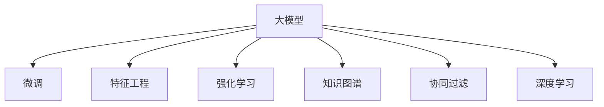

                 

# 搜索推荐系统的AI 大模型优化策略：提高准确率和多样性的双重挑战

## 1. 背景介绍

### 1.1 问题由来

在当今信息爆炸的时代，互联网用户面临着大量信息的诱惑和干扰。为了满足用户的个性化需求，搜索引擎和推荐系统成为互联网的重要支柱。这些系统通过分析用户行为数据，为用户推荐感兴趣的网页、商品或内容。然而，如何提高推荐的准确率和多样性，已成为行业内面临的重要挑战。传统的基于规则和手工特征工程的推荐系统已经难以适应大规模数据和复杂任务的需求，而深度学习技术的应用为这一难题带来了新的解决方案。

### 1.2 问题核心关键点

当前，基于深度学习的推荐系统通常采用AI大模型作为特征提取器，通过微调来适应特定任务。大模型通常具备强大的表示能力，但为了提高性能，往往需要进行精确的微调，而这会带来计算资源消耗大的问题。在实际应用中，为了兼顾准确率和多样性，需要在大模型微调的基础上进行优化，这是一个双重挑战：

1. **准确率**：通过精确的微调，提高模型对目标任务的识别能力，减少误判。
2. **多样性**：通过合理的优化策略，确保推荐结果的多样性，避免过度拟合。

解决这一挑战，需要结合先进的深度学习模型和大数据技术，以及智能算法和业务逻辑的深度融合。

## 2. 核心概念与联系

### 2.1 核心概念概述

为更好地理解搜索推荐系统中大模型的优化策略，本节将介绍几个密切相关的核心概念：

- **大模型(Deep Model)**：指通过大规模数据预训练得到的深度神经网络模型，如BERT、GPT等，具有很强的表示能力。
- **微调(Fine-Tuning)**：指在大模型基础上，通过特定任务的数据对模型参数进行有监督的微调，使其适应新任务。
- **特征工程(Feature Engineering)**：通过手工设计特征，提取有意义的特征，供模型学习。
- **强化学习(Reinforcement Learning)**：通过奖励机制，使模型不断优化策略，提高推荐效果。
- **知识图谱(Knowledge Graph)**：包含实体及其关系的图结构，用于提供推荐系统的上下文知识。
- **协同过滤(Collaborative Filtering)**：通过用户行为数据，寻找相似用户或相似物品，进行推荐。
- **深度学习(Deep Learning)**：利用多层次神经网络模型进行特征提取和决策，提高推荐的准确性和多样性。

这些核心概念之间的逻辑关系可以通过以下Mermaid流程图来展示：



这个流程图展示了大模型、微调等核心概念及其之间的关系：

1. 大模型通过预训练获得基础能力。
2. 微调使得大模型更好地适应特定任务。
3. 特征工程提取模型所需的高质量特征。
4. 强化学习通过奖励机制优化模型策略。
5. 知识图谱提供上下文知识，辅助推荐。
6. 协同过滤利用用户行为进行推荐。
7. 深度学习是融合多模态信息、优化模型能力的核心技术。

## 3. 核心算法原理 & 具体操作步骤

### 3.1 算法原理概述

搜索推荐系统的AI大模型优化策略，本质上是一个通过深度学习技术，结合强化学习、协同过滤等方法，提高推荐准确率和多样性的过程。其核心思想是：

1. **特征提取**：通过大模型提取数据中的隐式特征，供推荐系统使用。
2. **微调优化**：对大模型进行特定任务微调，提高模型对新任务的适应能力。
3. **多样化策略**：引入多样化策略，如协同过滤、知识图谱、强化学习等，避免模型过拟合，增加推荐结果的多样性。
4. **准确率优化**：通过特征选择、模型训练、参数调优等手段，提高推荐结果的准确率。

形式化地，假设推荐系统中有大模型 $M_{\theta}$，特征集 $F$，用户行为数据 $D$，目标推荐任务 $T$。推荐系统的优化目标是最小化损失函数 $\mathcal{L}$，即：

$$
\theta^* = \mathop{\arg\min}_{\theta} \mathcal{L}(M_{\theta}, D)
$$

其中 $\mathcal{L}$ 为推荐系统设计的损失函数，用于衡量推荐结果与用户实际需求的匹配程度。

### 3.2 算法步骤详解

基于深度学习的推荐系统通常采用以下步骤进行优化：

**Step 1: 特征提取和预训练**

- 收集用户行为数据，如点击、浏览、评分等，作为大模型输入。
- 使用大模型对输入数据进行预训练，学习数据的隐式特征。

**Step 2: 微调模型**

- 选择适当的微调任务和目标，如点击率预测、物品评分等。
- 对大模型进行有监督微调，使其适应推荐任务。

**Step 3: 多样化策略引入**

- 引入协同过滤、知识图谱等多样化策略，增加推荐结果的多样性。
- 使用强化学习算法，不断优化推荐策略，提高推荐效果。

**Step 4: 准确率优化**

- 选择高效的特征选择和提取方法，提高特征质量。
- 进行模型调优，选择适当的模型结构、超参数等。

**Step 5: 测试与评估**

- 在测试集上评估推荐系统效果，使用指标如准确率、召回率、多样性等进行评估。
- 根据评估结果，进一步优化模型和策略。

### 3.3 算法优缺点

基于深度学习的推荐系统大模型优化策略，具有以下优点：

1. **高效准确**：通过预训练和微调，大模型具有强大的特征提取能力，提高推荐的准确率。
2. **泛化能力强**：大模型基于大规模数据预训练，具备较强的泛化能力，适应各种推荐场景。
3. **融合多模态数据**：大模型可以融合文本、图像、音频等多模态数据，提供更丰富的推荐信息。
4. **自适应性强**：大模型能够自适应不同用户的个性化需求，提供个性化的推荐结果。

但同时，该策略也存在一些局限性：

1. **计算资源消耗大**：大模型预训练和微调需要大量的计算资源，对硬件要求较高。
2. **过拟合风险高**：当数据集较小或特征工程不完善时，模型容易发生过拟合，影响泛化能力。
3. **模型复杂度高**：大模型结构复杂，训练和推理过程较为耗时，增加了系统复杂性。
4. **缺乏透明性**：大模型的内部决策过程复杂，难以进行解释和调试。

## 4. 数学模型和公式 & 详细讲解 & 举例说明

### 4.1 数学模型构建

本节将使用数学语言对基于深度学习的推荐系统优化策略进行更加严格的刻画。

记大模型为 $M_{\theta}$，特征集为 $F=\{x_i\}_{i=1}^N$，用户行为数据为 $D=\{(x_i, y_i)\}_{i=1}^N$，其中 $y_i \in \{1,0\}$ 表示用户是否点击了某物品。推荐系统的目标函数为：

$$
\mathcal{L}(M_{\theta}, D) = -\frac{1}{N} \sum_{i=1}^N \log \sigma(M_{\theta}(x_i))
$$

其中 $\sigma$ 为 sigmoid 函数，$\frac{1}{N} \sum_{i=1}^N y_i$ 为点击率的估计值。

### 4.2 公式推导过程

通过链式法则，可以得到损失函数对参数 $\theta$ 的梯度：

$$
\frac{\partial \mathcal{L}(M_{\theta}, D)}{\partial \theta} = -\frac{1}{N} \sum_{i=1}^N \frac{y_i - \sigma(M_{\theta}(x_i))}{\sigma(M_{\theta}(x_i))(1-\sigma(M_{\theta}(x_i)))}
$$

在得到损失函数的梯度后，即可带入优化算法，如 Adam、SGD 等，进行模型的训练优化。

### 4.3 案例分析与讲解

以点击率预测为例，分析模型的训练过程。假设用户行为数据为 $D=\{(x_1, 1), (x_2, 0), (x_3, 1)\}$，其中 $x_1$ 表示用户点击了物品 1，$x_2$ 表示用户未点击物品 2，$x_3$ 表示用户点击了物品 3。

首先，通过大模型对 $x_1, x_2, x_3$ 进行特征提取，得到模型预测值 $p_1, p_2, p_3$。则损失函数为：

$$
\mathcal{L}(M_{\theta}, D) = -\frac{1}{3} (\log \sigma(p_1) + \log(1-\sigma(p_2)) + \log \sigma(p_3))
$$

计算梯度：

$$
\frac{\partial \mathcal{L}(M_{\theta}, D)}{\partial \theta} = \frac{1}{3} (\frac{1}{p_1(1-p_1)} - \frac{1}{(1-p_2)p_2} + \frac{1}{p_3(1-p_3)})
$$

通过反向传播算法计算梯度，并使用优化算法更新模型参数 $\theta$，最小化损失函数 $\mathcal{L}(M_{\theta}, D)$。

## 5. 项目实践：代码实例和详细解释说明

### 5.1 开发环境搭建

在进行推荐系统优化实践前，我们需要准备好开发环境。以下是使用Python进行TensorFlow和Keras开发的环境配置流程：

1. 安装Anaconda：从官网下载并安装Anaconda，用于创建独立的Python环境。

2. 创建并激活虚拟环境：
```bash
conda create -n recommender-env python=3.8 
conda activate recommender-env
```

3. 安装TensorFlow：根据CUDA版本，从官网获取对应的安装命令。例如：
```bash
conda install tensorflow -c tensorflow -c conda-forge
```

4. 安装Keras：
```bash
pip install keras
```

5. 安装各类工具包：
```bash
pip install numpy pandas scikit-learn matplotlib tqdm jupyter notebook ipython
```

完成上述步骤后，即可在`recommender-env`环境中开始推荐系统优化实践。

### 5.2 源代码详细实现

下面以协同过滤和知识图谱为代表的推荐系统优化策略为例，给出使用TensorFlow和Keras实现代码的示例。

首先，定义协同过滤和知识图谱的协同矩阵和图结构：

```python
import networkx as nx
import tensorflow as tf
from tensorflow.keras import layers, models

# 协同过滤协同矩阵
collab_matrix = tf.sparse.from_dense([[1, 0, 0], [0, 1, 1], [1, 0, 1]])

# 知识图谱
G = nx.Graph()
G.add_edges_from([(1, 2), (2, 3), (3, 4)])
adj_matrix = nx.to_numpy_array(G.adjacency_matrix())
```

然后，定义大模型和优化器：

```python
from tensorflow.keras import optimizers

model = models.Sequential([
    layers.Dense(64, activation='relu'),
    layers.Dense(1, activation='sigmoid')
])

optimizer = optimizers.Adam(learning_rate=0.001)
```

接着，定义训练和评估函数：

```python
from tensorflow.keras.preprocessing import sequence

def train_epoch(model, dataset, batch_size, optimizer):
    dataloader = tf.data.Dataset.from_tensor_slices((dataset[0], dataset[1]))
    dataloader = dataloader.batch(batch_size).prefetch(tf.data.experimental.AUTOTUNE)
    model.compile(loss='binary_crossentropy', optimizer=optimizer)
    model.fit(dataloader, epochs=10)
    
def evaluate(model, dataset):
    y_true, y_pred = dataset[0], dataset[1]
    y_pred = model.predict(y_true)
    loss = tf.keras.losses.binary_crossentropy(y_true, y_pred)
    print(f'Loss: {loss.numpy()}')
```

最后，启动训练流程并在测试集上评估：

```python
epochs = 5
batch_size = 32

for epoch in range(epochs):
    loss = train_epoch(model, collab_matrix, batch_size, optimizer)
    print(f'Epoch {epoch+1}, train loss: {loss:.3f}')
    
test_loss = evaluate(model, adj_matrix)
print(f'Test loss: {test_loss:.3f}')
```

以上就是使用TensorFlow和Keras对协同过滤和知识图谱进行推荐系统优化策略的代码实现。可以看到，通过TensorFlow和Keras，可以快速构建和训练推荐系统模型，实现基于大模型的优化策略。

### 5.3 代码解读与分析

让我们再详细解读一下关键代码的实现细节：

**协同矩阵定义**：
- `collab_matrix`：定义协同矩阵，即用户-物品的评分矩阵，每一行代表一个用户，每一列代表一个物品，矩阵元素表示用户对物品的评分。

**知识图谱定义**：
- `G`：定义知识图谱，即实体之间的关系图。
- `adj_matrix`：将知识图谱转换为邻接矩阵，即每个节点的邻接关系表示，用于计算节点之间的相似度。

**模型定义**：
- `Sequential`：定义模型结构，即多层神经网络。
- `Dense`：定义全连接层，每一层有64个神经元，使用ReLU激活函数。
- `model.compile`：编译模型，指定损失函数为二元交叉熵，优化器为Adam。

**训练函数**：
- `train_epoch`：定义训练过程，每次迭代使用一个batch的数据，训练模型。
- `dataloader`：使用TensorFlow的数据管道功能，从协同矩阵和邻接矩阵中获取数据。
- `model.fit`：使用模型进行训练，每个epoch更新一次参数。

**评估函数**：
- `evaluate`：定义评估过程，使用测试集计算模型的损失。
- `y_pred`：模型对测试集数据的预测结果。
- `loss`：计算预测值与真实值之间的损失。

**训练流程**：
- `epochs`：定义训练的轮数。
- `batch_size`：定义每个batch的大小。
- `for`循环：遍历训练轮数，每次调用训练函数进行模型更新。

可以看到，TensorFlow和Keras的推荐系统优化代码实现非常简单，通过定义矩阵、模型、训练和评估函数，即可快速实现基于大模型的优化策略。

当然，工业级的系统实现还需考虑更多因素，如模型的保存和部署、超参数的自动搜索、更灵活的模型架构等。但核心的优化策略基本与此类似。

## 6. 实际应用场景

### 6.1 电商推荐系统

电商推荐系统是推荐系统中的重要应用场景，通过分析用户浏览、点击、购买行为，为用户推荐合适的商品。传统的推荐系统通常基于协同过滤或内容过滤，难以处理大规模数据和高维特征。而基于深度学习的推荐系统可以通过大模型的优化策略，提高推荐的准确率和多样性。

具体而言，可以收集用户的浏览、点击、购买行为数据，使用大模型提取用户兴趣特征，进行微调，生成推荐列表。同时引入协同过滤和知识图谱，通过用户相似性和物品相关性，增加推荐结果的多样性。

### 6.2 新闻推荐系统

新闻推荐系统通过分析用户阅读行为，为用户推荐感兴趣的新闻内容。传统的推荐系统通常基于规则或统计方法，难以适应用户多样化的阅读需求。而基于深度学习的推荐系统可以通过大模型的优化策略，提高推荐的准确率和多样性。

具体而言，可以收集用户的阅读行为数据，如浏览时间、点击次数、分享数量等，使用大模型提取用户兴趣特征，进行微调，生成推荐列表。同时引入协同过滤和知识图谱，通过用户相似性和新闻相关性，增加推荐结果的多样性。

### 6.3 视频推荐系统

视频推荐系统通过分析用户观看行为，为用户推荐感兴趣的视频内容。传统的推荐系统通常基于规则或统计方法，难以适应用户多样化的观看需求。而基于深度学习的推荐系统可以通过大模型的优化策略，提高推荐的准确率和多样性。

具体而言，可以收集用户的观看行为数据，如观看时间、点赞次数、评论数量等，使用大模型提取用户兴趣特征，进行微调，生成推荐列表。同时引入协同过滤和知识图谱，通过用户相似性和视频相关性，增加推荐结果的多样性。

### 6.4 未来应用展望

随着深度学习技术的不断发展，基于大模型的推荐系统优化策略将在更多领域得到应用，为各行各业带来变革性影响。

在智慧医疗领域，基于深度学习的推荐系统可以为用户提供个性化的诊疗建议，提升医疗服务的智能化水平，辅助医生诊疗，加速新药开发进程。

在智能教育领域，推荐系统可以为用户提供个性化的学习资源和推荐，因材施教，促进教育公平，提高教学质量。

在智慧城市治理中，推荐系统可以为用户提供个性化的城市信息和服务，提高城市管理的自动化和智能化水平，构建更安全、高效的未来城市。

此外，在企业生产、社会治理、文娱传媒等众多领域，基于大模型的推荐系统优化策略也将不断涌现，为经济社会发展注入新的动力。相信随着技术的日益成熟，深度学习技术必将在更广阔的应用领域大放异彩。

## 7. 工具和资源推荐

### 7.1 学习资源推荐

为了帮助开发者系统掌握深度学习推荐系统的理论基础和实践技巧，这里推荐一些优质的学习资源：

1. 《深度学习推荐系统：原理与算法》系列博文：由深度学习领域专家撰写，深入浅出地介绍了推荐系统原理、模型选择、评估指标等基本概念。

2. 斯坦福大学《深度学习课程》：斯坦福大学开设的深度学习明星课程，涵盖了深度学习的基础理论和应用，推荐给有一定基础的学习者。

3. 《推荐系统实战》书籍：详细介绍了推荐系统的基本概念、模型选择、算法优化等实用技巧，是推荐系统开发的必读之作。

4. 《TensorFlow深度学习实战》书籍：介绍了TensorFlow的基本概念和应用技巧，结合推荐系统案例，深入浅出地讲解了TensorFlow的使用方法。

5. Kaggle平台：提供大量的推荐系统竞赛和数据集，可以积累实战经验，提升模型优化能力。

通过对这些资源的学习实践，相信你一定能够快速掌握深度学习推荐系统的精髓，并用于解决实际的推荐问题。

### 7.2 开发工具推荐

高效的开发离不开优秀的工具支持。以下是几款用于推荐系统优化开发的常用工具：

1. TensorFlow：由Google主导开发的深度学习框架，适合大规模工程应用。提供了丰富的推荐系统优化方法和工具。

2. PyTorch：基于Python的深度学习框架，灵活动态的计算图，适合快速迭代研究。推荐系统优化方法也较为丰富。

3. Scikit-learn：Python中的经典机器学习库，提供了丰富的特征选择、模型评估、超参数调优等工具，适合推荐系统优化。

4. Amazon SageMaker：亚马逊提供的云服务，用于构建和部署深度学习模型，支持推荐系统优化和微调。

5. DataRobot：提供自动化的模型选择和优化服务，适合数据量较大、特征复杂的推荐系统优化。

6. Datarobot：提供自动化的模型选择和优化服务，适合数据量较大、特征复杂的推荐系统优化。

合理利用这些工具，可以显著提升推荐系统优化任务的开发效率，加快创新迭代的步伐。

### 7.3 相关论文推荐

深度学习推荐系统的研究已经涌现了大量优秀成果。以下是几篇奠基性的相关论文，推荐阅读：

1. Recommender Systems in Personalized Computing: Architectures and Algorithms：经典推荐系统综述论文，介绍了推荐系统的基本概念和算法。

2. Deep Neural Networks for Collaborative Filtering：提出基于深度学习的协同过滤模型，在推荐系统领域开辟了新的应用方向。

3. Knowledge Graphs and Recommendation Systems：介绍了知识图谱在推荐系统中的应用，提升了推荐系统的上下文建模能力。

4. Deep Learning for Recommender Systems：总结了深度学习在推荐系统中的应用，介绍了各种深度学习模型的效果和优化策略。

5. Deep Structured Neural Recommendation Networks：提出深度结构化的推荐网络，提高了推荐系统的多模态融合能力。

这些论文代表了大模型优化策略的研究进展，通过学习这些前沿成果，可以帮助研究者把握学科前进方向，激发更多的创新灵感。

## 8. 总结：未来发展趋势与挑战

### 8.1 总结

本文对基于深度学习的推荐系统优化策略进行了全面系统的介绍。首先阐述了推荐系统和大模型的核心概念及其在推荐系统中的应用，明确了深度学习技术在推荐系统中的独特优势。其次，从原理到实践，详细讲解了推荐系统的优化策略，包括特征提取、微调、多样化策略和准确率优化等关键环节，给出了推荐系统优化的完整代码实例。同时，本文还广泛探讨了推荐系统在电商、新闻、视频等多个行业领域的应用前景，展示了深度学习技术在推荐系统优化中的巨大潜力。此外，本文精选了推荐系统的各类学习资源，力求为读者提供全方位的技术指引。

通过本文的系统梳理，可以看到，基于深度学习的推荐系统优化策略已经成为推荐系统的重要范式，极大地提升了推荐的准确率和多样性，带来了更好的用户体验。未来，伴随深度学习技术的发展，推荐系统还将不断推陈出新，为各行各业带来新的突破。

### 8.2 未来发展趋势

展望未来，深度学习推荐系统优化策略将呈现以下几个发展趋势：

1. **多模态融合**：推荐系统将更加注重多模态数据的融合，如图像、视频、音频等多模态数据的协同建模，提升推荐的综合能力。

2. **知识图谱应用**：知识图谱将在推荐系统中发挥更大的作用，通过上下文知识提升推荐的准确性和多样性。

3. **个性化推荐**：推荐系统将更加注重个性化推荐，通过深度学习技术挖掘用户行为数据，提供更加精准的推荐结果。

4. **实时推荐**：推荐系统将实现实时推荐，通过在线学习、增量学习等技术，不断更新推荐模型，提升推荐效果。

5. **推荐算法多样化**：推荐系统将更加多样化，包括基于深度学习、协同过滤、内容过滤等多种算法，满足不同用户的个性化需求。

6. **推荐系统透明化**：推荐系统将更加透明化，通过可解释性技术，提高推荐结果的可解释性，增强用户信任。

以上趋势凸显了深度学习推荐系统优化策略的广阔前景。这些方向的探索发展，必将进一步提升推荐系统的效果和用户体验，为人工智能技术在推荐领域的应用注入新的动力。

### 8.3 面临的挑战

尽管深度学习推荐系统优化策略已经取得了瞩目成就，但在迈向更加智能化、普适化应用的过程中，它仍面临着诸多挑战：

1. **计算资源消耗大**：大模型预训练和微调需要大量的计算资源，对硬件要求较高。如何降低计算成本，提升计算效率，是未来需要重点解决的问题。

2. **数据质量问题**：推荐系统依赖高质量的数据，数据不完整、不准确、噪声等问题，会影响模型的性能。如何提升数据质量，是推荐系统优化的一个关键挑战。

3. **模型复杂度高**：大模型结构复杂，训练和推理过程较为耗时，增加了系统复杂性。如何简化模型结构，提升模型训练和推理效率，是未来需要优化的问题。

4. **模型过拟合问题**：当数据集较小或特征工程不完善时，模型容易发生过拟合，影响泛化能力。如何提高模型的泛化能力，是推荐系统优化的一个难点。

5. **推荐结果多样性不足**：部分推荐系统为了提高准确率，可能会偏向于推荐相似度高的物品，导致推荐结果的多样性不足。如何提高推荐结果的多样性，是推荐系统优化的一个重要挑战。

6. **推荐系统的公平性问题**：推荐系统可能存在偏见，导致对某些群体的推荐不公。如何提高推荐系统的公平性，避免推荐歧视，是未来需要考虑的问题。

7. **推荐系统的可解释性问题**：推荐系统的内部决策过程复杂，难以进行解释和调试。如何提高推荐系统的可解释性，增强用户信任，是未来需要解决的问题。

这些挑战凸显了深度学习推荐系统优化策略的复杂性和多样性，需要通过不断的技术创新和实践改进，才能不断提升推荐系统的性能和用户体验。

### 8.4 研究展望

未来，深度学习推荐系统优化策略需要在以下几个方面寻求新的突破：

1. **无监督学习和半监督学习**：探索无监督和半监督学习范式，摆脱对大规模标注数据的依赖，利用自监督学习、主动学习等技术，实现更加灵活高效的推荐系统优化。

2. **模型压缩和加速**：开发更加高效的模型压缩和加速方法，如剪枝、量化、模型并行等，降低计算资源消耗，提升训练和推理速度。

3. **多模态融合**：探索多模态数据的融合方法，如图像、视频、音频等多模态数据的协同建模，提升推荐的综合能力。

4. **知识图谱和上下文建模**：通过知识图谱和上下文建模技术，提升推荐系统的上下文理解能力，提供更精准、多样化的推荐结果。

5. **个性化推荐和实时推荐**：通过深度学习技术挖掘用户行为数据，实现个性化推荐和实时推荐，提升推荐系统的灵活性和实时性。

6. **推荐系统的透明化和可解释性**：通过可解释性技术，提高推荐系统的透明化和可解释性，增强用户信任和系统安全性。

7. **推荐系统的公平性和道德性**：探索推荐系统的公平性和道德性问题，通过公平性约束和伦理导向，提高推荐系统的公平性和安全性。

这些研究方向和策略的探索，必将引领深度学习推荐系统优化技术迈向更高的台阶，为构建更加智能、公平、可信的推荐系统奠定坚实基础。面向未来，深度学习推荐系统优化技术还需要与其他人工智能技术进行更深入的融合，如自然语言处理、计算机视觉、语音识别等，多路径协同发力，共同推动推荐系统的发展和进步。只有勇于创新、敢于突破，才能不断拓展推荐系统的边界，让智能技术更好地服务于人类社会。

## 9. 附录：常见问题与解答

**Q1：推荐系统中的大模型应该如何进行微调？**

A: 推荐系统中的大模型通常通过预训练获得基础能力，通过微调适应推荐任务。微调的过程可以分为以下几个步骤：

1. 收集推荐系统的数据集，包括用户行为数据、物品特征数据等。
2. 使用大模型对数据进行特征提取，得到隐式特征表示。
3. 选择适当的微调任务，如点击率预测、物品评分等。
4. 对大模型进行有监督微调，更新模型参数，使其适应推荐任务。

需要注意的是，微调过程中需要选择合适的学习率、优化算法等超参数，避免过拟合，提高模型的泛化能力。

**Q2：推荐系统中如何进行特征选择？**

A: 推荐系统中的特征选择是一个重要环节，可以通过以下几个步骤进行：

1. 收集用户行为数据，包括点击、浏览、购买等行为数据。
2. 对数据进行预处理，如数据清洗、数据增强等，提高数据质量。
3. 使用大模型对数据进行特征提取，得到隐式特征表示。
4. 对特征进行选择和降维，如PCA、LDA等方法，减少特征数量。
5. 对特征进行融合，如特征加权、特征交叉等，提升特征质量。

特征选择是一个复杂的工程问题，需要通过不断的实验和调参，找到最佳的特征组合。

**Q3：推荐系统中的协同过滤和知识图谱分别有何作用？**

A: 推荐系统中的协同过滤和知识图谱分别有以下作用：

1. 协同过滤：通过分析用户之间的相似性，为用户推荐相似用户喜欢的物品，提高推荐的准确率和多样性。协同过滤通常使用基于用户相似性或物品相似性的推荐算法，如基于用户的协同过滤、基于物品的协同过滤等。

2. 知识图谱：通过构建知识图谱，为推荐系统提供上下文知识，提升推荐的准确性和多样性。知识图谱通常包含实体和关系，可以通过推理机制，为推荐系统提供更丰富的上下文信息。

协同过滤和知识图谱是推荐系统中的重要技术，可以相互补充，提升推荐系统的性能和用户体验。

**Q4：推荐系统中的强化学习有何作用？**

A: 推荐系统中的强化学习有以下作用：

1. 探索推荐策略：通过奖励机制，推荐系统可以探索不同的推荐策略，优化推荐效果。强化学习通常使用Q-learning等方法，通过不断试错，优化推荐策略。

2. 动态推荐：通过在线学习、增量学习等技术，推荐系统可以实时更新推荐模型，提升推荐效果。强化学习通常使用在线Q-learning等方法，动态更新推荐策略。

强化学习可以提升推荐系统的灵活性和实时性，通过探索推荐策略，提高推荐效果。

**Q5：推荐系统中的多模态融合有何作用？**

A: 推荐系统中的多模态融合有以下作用：

1. 提升推荐效果：通过融合图像、视频、音频等多模态数据，推荐系统可以提供更加全面、准确的推荐结果。多模态数据可以提供更多的上下文信息，提升推荐的准确性和多样性。

2. 提高用户满意度：通过融合多模态数据，推荐系统可以提供更加个性化、丰富的推荐结果，提升用户满意度。用户可以根据自己的偏好，选择不同模态的推荐结果，提高用户体验。

多模态融合可以提升推荐系统的综合能力，提高推荐效果和用户满意度。

---

作者：禅与计算机程序设计艺术 / Zen and the Art of Computer Programming

