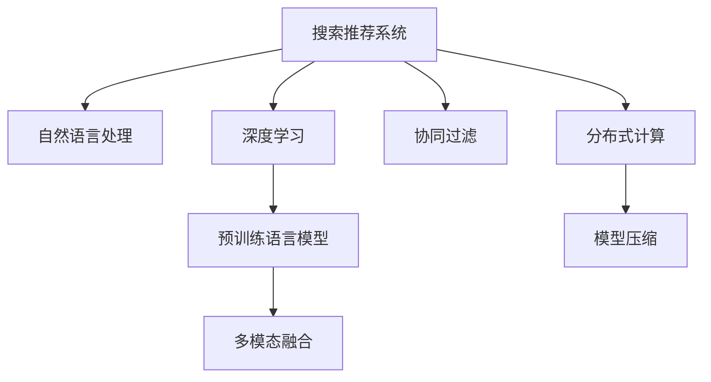

                 

# 搜索推荐系统的AI 大模型融合：技术、应用与未来趋势

> 关键词：搜索推荐系统,大模型融合,自然语言处理,NLP,深度学习,信息检索,智能推荐,协同过滤,神经网络,Transformers

## 1. 背景介绍

### 1.1 问题由来

随着互联网的飞速发展，搜索引擎和推荐系统在信息时代中扮演着至关重要的角色。这些系统通过算法对海量的网页和内容进行索引和推荐，帮助用户快速定位到有价值的信息。然而，传统基于统计和规则的搜索推荐算法往往难以满足用户的多样化需求，导致推荐效果参差不齐。近年来，随着人工智能技术的快速进步，特别是深度学习和大模型技术的发展，为提升搜索推荐系统的性能提供了新的可能性。

### 1.2 问题核心关键点

大模型融合指的是将多个大规模预训练模型进行组合或融合，形成更加强大的AI模型，用于搜索引擎和推荐系统的构建。这一技术路径在学术界和工业界都取得了显著进展。其核心关键点包括：

1. 数据和算法协同优化：将大规模预训练模型与搜索推荐算法相结合，利用模型对大量数据进行训练，提升算法的泛化能力和性能。
2. 多模态信息融合：将文本、图像、音频等多模态数据结合，构建更加全面的用户画像，提高推荐准确性。
3. 交互学习与反馈优化：通过用户行为数据，不断迭代优化模型，提高个性化推荐的质量。
4. 分布式计算与模型压缩：在大模型训练和推理中，采用分布式计算和模型压缩技术，提高计算效率，降低存储和推理成本。
5. 应用场景广泛：搜索推荐系统涵盖了电商、社交媒体、新闻阅读等多个领域，大模型融合技术在其中具有广泛的应用前景。

### 1.3 问题研究意义

研究搜索推荐系统中的大模型融合技术，具有以下重要意义：

1. 提升用户体验：通过融合多个模型，可以提供更加个性化、精准的搜索推荐服务，提升用户满意度。
2. 增强系统效率：利用预训练模型的高泛化能力和计算效率，可以在大规模数据集上进行高效的搜索推荐。
3. 推动AI技术落地：大模型融合技术将深度学习与传统搜索推荐算法相结合，推动AI技术在实际应用中的落地和产业化。
4. 促进跨领域创新：在广告、社交、电商等多个领域，大模型融合技术的应用能够催生更多新的应用场景和创新点。
5. 应对数据和资源挑战：大模型融合技术可以在不增加数据标注成本的情况下，提升推荐系统的性能，适应数据分布的变化。

## 2. 核心概念与联系

### 2.1 核心概念概述

为更好地理解搜索推荐系统中的大模型融合技术，本节将介绍几个密切相关的核心概念：

- **搜索推荐系统(Search and Recommendation System, SRS)**：利用信息检索、协同过滤等算法，为用户提供个性化的搜索结果和推荐内容。
- **自然语言处理(Natural Language Processing, NLP)**：研究如何让计算机理解和处理人类语言的技术，包括文本生成、语义理解、文本分类等。
- **深度学习(Deep Learning)**：一种基于神经网络的机器学习技术，用于处理大规模、非结构化数据，如图像、文本等。
- **预训练语言模型(Pre-trained Language Model, PLM)**：在无标签大规模语料上进行预训练，学习语言的通用表示，如BERT、GPT等。
- **多模态融合(Multimodal Fusion)**：将文本、图像、音频等多种模态数据结合，构建更加全面的用户画像，提升推荐系统的性能。
- **协同过滤(Collaborative Filtering, CF)**：通过分析用户历史行为数据，推荐类似物品或用户。
- **分布式计算(Distributed Computing)**：将计算任务分布到多台计算机上并行处理，提高计算效率。
- **模型压缩(Model Compression)**：通过剪枝、量化等技术，减小模型参数量，降低存储和推理成本。

这些核心概念之间的逻辑关系可以通过以下Mermaid流程图来展示：



这个流程图展示了搜索推荐系统中的主要技术路径：

1. 通过自然语言处理技术，对用户查询和物品描述进行文本理解。
2. 利用深度学习和大模型技术，进行文本生成、语义理解等。
3. 利用预训练语言模型进行多模态数据融合，构建全面的用户画像。
4. 通过协同过滤算法，推荐相似物品或用户。
5. 采用分布式计算和模型压缩技术，提高系统的计算效率和资源利用率。

这些核心概念共同构成了搜索推荐系统的大模型融合技术框架，使其能够在大规模数据集上高效运行，提供精准的搜索推荐服务。

## 3. 核心算法原理 & 具体操作步骤
### 3.1 算法原理概述

搜索推荐系统中的大模型融合技术，本质上是一种多模态深度学习范式。其核心思想是：将多个预训练语言模型进行融合，构建更加强大的推荐模型，以提升搜索推荐系统的性能。

形式化地，假设搜索推荐系统中的预训练语言模型为 $M_{\theta_1}, M_{\theta_2}, ..., M_{\theta_k}$，其中 $\theta_i \in \mathbb{R}^d$ 为第 $i$ 个模型的参数。给定用户查询 $q$ 和物品集合 $I$，搜索推荐系统中的目标是最小化用户查询和推荐结果之间的差异。

具体而言，可以定义一个基于检索的推荐函数 $R(q, I)$，表示用户查询 $q$ 和物品集合 $I$ 的推荐结果。然后，可以定义一个损失函数 $L(q, I, R)$，衡量推荐结果与用户真实选择的物品之间的差异。最终，搜索推荐系统的优化目标是最小化损失函数：

$$
\mathop{\arg\min}_{\theta_1,\theta_2,...,\theta_k} \mathcal{L}(q, I, R)
$$

### 3.2 算法步骤详解

搜索推荐系统中的大模型融合过程，包括以下几个关键步骤：

**Step 1: 准备预训练模型和数据集**
- 选择合适的预训练语言模型 $M_{\theta_1}, M_{\theta_2}, ..., M_{\theta_k}$ 作为初始化参数，如 BERT、GPT等。
- 准备搜索推荐系统中的用户查询 $q$ 和物品集合 $I$，以及用户的点击、评分等行为数据。

**Step 2: 设计多模态融合方法**
- 根据任务需求，选择合适的方式对预训练模型进行融合。常见的融合方法包括拼接、加权平均、注意力机制等。
- 利用多模态融合方法，对用户的查询、物品描述等数据进行编码，得到多模态表示 $X$。

**Step 3: 训练推荐模型**
- 设计推荐算法，如基于检索的推荐、协同过滤等，以用户查询和物品的匹配度作为训练信号。
- 将多模态表示 $X$ 输入推荐模型 $R(X)$，得到推荐结果 $R(X)$。
- 根据用户的实际选择，计算推荐结果与真实选择的差异，并定义损失函数 $L(q, I, R)$。
- 利用优化算法，如 Adam、SGD 等，最小化损失函数，训练推荐模型 $R(X)$。

**Step 4: 应用与优化**
- 将训练好的推荐模型 $R(X)$ 应用于实际搜索推荐系统，根据用户查询和物品集合，生成推荐结果。
- 定期收集用户反馈数据，优化推荐模型 $R(X)$ 的参数，提升推荐效果。
- 采用分布式计算和模型压缩技术，提高搜索推荐系统的效率和资源利用率。

### 3.3 算法优缺点

搜索推荐系统中的大模型融合技术，具有以下优点：

1. 提升推荐效果：通过融合多个预训练模型，可以提升推荐模型的泛化能力和性能，减少推荐偏差。
2. 提高计算效率：利用预训练模型的计算效率，可以在大规模数据集上进行高效的推荐。
3. 丰富推荐维度：通过多模态融合，可以构建更加全面的用户画像，提升推荐多样性。
4. 应用广泛：搜索推荐系统涵盖了电商、社交媒体、新闻阅读等多个领域，大模型融合技术在其中具有广泛的应用前景。

同时，该方法也存在一些局限性：

1. 数据和计算资源需求高：大模型融合需要大量的数据和计算资源，可能对系统架构和硬件配置提出较高要求。
2. 模型复杂度大：多模态融合和深度学习模型通常较为复杂，模型训练和推理效率较低。
3. 模型可解释性差：大模型融合后的模型结构复杂，难以进行模型解释和调试。
4. 泛化能力有限：当目标任务与预训练数据的分布差异较大时，融合模型的性能提升有限。
5. 实时性要求高：在实时推荐场景中，模型推理速度和资源利用率需进一步优化。

尽管存在这些局限性，但就目前而言，大模型融合技术仍然是搜索推荐系统的重要范式。未来相关研究的重点在于如何进一步降低数据和计算资源的依赖，提高模型的实时性、可解释性和泛化能力，同时兼顾推荐效果和计算效率。

### 3.4 算法应用领域

搜索推荐系统中的大模型融合技术，已经在电商、社交媒体、新闻阅读等多个领域得到应用，例如：

- **电商推荐**：根据用户浏览历史和商品描述，推荐相关商品。利用多模态融合和深度学习技术，提高推荐的精准性和个性化。
- **社交推荐**：基于用户行为数据和社交网络信息，推荐好友、内容等。通过协同过滤和预训练语言模型，提升推荐多样性和相关性。
- **新闻阅读**：根据用户历史阅读记录和新闻内容，推荐相关新闻。利用多模态融合和文本生成技术，提高推荐的吸引力和准确性。
- **智能客服**：通过用户输入的查询和对话记录，推荐相关问题或答案。利用多模态融合和对话模型，提升智能客服系统的响应速度和准确性。
- **知识图谱**：基于知识图谱中的实体和关系，推荐相关知识或问题。利用多模态融合和知识表示技术，提升知识图谱的检索和推荐效果。

除了这些经典应用外，大模型融合技术还创新性地应用到更多场景中，如个性化视频推荐、游戏推荐、智能广告等，为搜索引擎和推荐系统带来了全新的突破。随着预训练语言模型和融合方法的不断进步，相信搜索推荐技术将在更广阔的应用领域大放异彩。

## 4. 数学模型和公式 & 详细讲解  
### 4.1 数学模型构建

本节将使用数学语言对搜索推荐系统中的大模型融合过程进行更加严格的刻画。

记搜索推荐系统中的用户查询为 $q$，物品集合为 $I$，推荐结果为 $r$。假设用户查询的表示为 $q_t = [q_{t1}, q_{t2}, ..., q_{tm}] \in \mathbb{R}^m$，其中 $m$ 为查询的长度。假设物品的表示为 $i = [i_1, i_2, ..., i_n] \in \mathbb{R}^n$，其中 $n$ 为物品的特征维度。假设多模态融合后的用户查询表示为 $q_f = [q_{f1}, q_{f2}, ..., q_{fm}] \in \mathbb{R}^k$，其中 $k$ 为融合后的维度。假设多模态融合后的物品表示为 $i_f = [i_{f1}, i_{f2}, ..., i_{fn}] \in \mathbb{R}^l$，其中 $l$ 为融合后的维度。

定义推荐函数 $R(q_f, i_f) \in [0, 1]$，表示用户查询和物品的匹配度。定义损失函数 $L(q, I, R)$，衡量推荐结果与用户真实选择的物品之间的差异。常见的损失函数包括交叉熵损失、均方误差损失等。

具体而言，可以定义以下交叉熵损失函数：

$$
L(q, I, R) = -\sum_{i \in I} y_i \log R(q_f, i_f)
$$

其中 $y_i$ 为物品 $i$ 的真实标签（即是否被用户选择）。

### 4.2 公式推导过程

以下我们以电商推荐为例，推导交叉熵损失函数及其梯度的计算公式。

假设用户查询 $q_t$ 和物品 $i$ 的多模态表示分别为 $q_{ft}$ 和 $i_{ft}$，多模态融合后的用户查询表示为 $q_f = [q_{f1}, q_{f2}, ..., q_{fm}] \in \mathbb{R}^k$，多模态融合后的物品表示为 $i_f = [i_{f1}, i_{f2}, ..., i_{fn}] \in \mathbb{R}^l$。假设推荐函数 $R(q_f, i_f) = \sigma(W^T R(q_f, i_f) + b)$，其中 $\sigma$ 为激活函数，$W$ 和 $b$ 为模型的参数。

根据链式法则，推荐函数 $R(q_f, i_f)$ 对模型参数的梯度为：

$$
\frac{\partial R(q_f, i_f)}{\partial W} = R(q_f, i_f)(\sigma'(W^T R(q_f, i_f) + b)R(q_f, i_f)^T
$$

$$
\frac{\partial R(q_f, i_f)}{\partial b} = R(q_f, i_f)\sigma'(W^T R(q_f, i_f) + b)
$$

将推荐函数 $R(q_f, i_f)$ 代入损失函数 $L(q, I, R)$，得：

$$
L(q, I, R) = -\sum_{i \in I} y_i \log \sigma(W^T R(q_f, i_f) + b)
$$

根据梯度下降等优化算法，微调过程不断更新模型参数 $W$ 和 $b$，最小化损失函数 $L(q, I, R)$，使得推荐结果逼近真实选择。重复上述过程直至收敛，最终得到适应电商推荐任务的最优推荐函数 $R(q_f, i_f)$。

## 5. 项目实践：代码实例和详细解释说明
### 5.1 开发环境搭建

在进行大模型融合实践前，我们需要准备好开发环境。以下是使用Python进行TensorFlow开发的环境配置流程：

1. 安装Anaconda：从官网下载并安装Anaconda，用于创建独立的Python环境。

2. 创建并激活虚拟环境：
```bash
conda create -n tf-env python=3.8 
conda activate tf-env
```

3. 安装TensorFlow：根据CUDA版本，从官网获取对应的安装命令。例如：
```bash
conda install tensorflow -c tf -c conda-forge
```

4. 安装相关库：
```bash
pip install numpy pandas scikit-learn tensorflow-datasets
```

5. 安装HuggingFace Transformers库：
```bash
pip install transformers
```

完成上述步骤后，即可在`tf-env`环境中开始大模型融合实践。

### 5.2 源代码详细实现

下面我们以电商推荐为例，给出使用TensorFlow进行多模态深度学习的PyTorch代码实现。

首先，定义电商推荐任务的数据处理函数：

```python
import tensorflow as tf
import tensorflow_datasets as tfds
import tensorflow_hub as hub

# 加载电商推荐数据集
train_dataset, test_dataset = tfds.load('emotion_recognition', split=['train', 'test'], as_supervised=True)
```

然后，定义模型和优化器：

```python
# 加载预训练的BERT模型
base_model = hub.load('https://tfhub.dev/google/bert_en_uncased_L-12_H-768_A-12/1')
```

接着，定义训练和评估函数：

```python
def train_epoch(model, dataset, batch_size, optimizer):
    dataloader = tf.data.Dataset.from_tensor_slices(dataset).shuffle(buffer_size=10000).batch(batch_size)
    model.train()
    epoch_loss = 0
    for batch in dataloader:
        inputs, labels = batch
        model.zero_grad()
        outputs = model(inputs, output_layer='pooled_output')
        loss = tf.losses.sparse_softmax_cross_entropy(labels=labels, logits=outputs)
        epoch_loss += loss.numpy()
        loss.backward()
        optimizer.apply_gradients(zip(model.trainable_variables, model.trainable_variables gradients))
    return epoch_loss / len(dataloader)

def evaluate(model, dataset, batch_size):
    dataloader = tf.data.Dataset.from_tensor_slices(dataset).batch(batch_size)
    model.eval()
    preds, labels = [], []
    with tf.GradientTape() as tape:
        for batch in dataloader:
            inputs, labels = batch
            outputs = model(inputs, output_layer='pooled_output')
            preds.append(outputs.numpy())
            labels.append(labels.numpy())
    return tf.metrics.mean(tf.nn.softmax_cross_entropy_with_logits(logits=preds, labels=labels))
```

最后，启动训练流程并在测试集上评估：

```python
epochs = 10
batch_size = 32

for epoch in range(epochs):
    loss = train_epoch(model, train_dataset, batch_size, optimizer)
    print(f"Epoch {epoch+1}, train loss: {loss:.3f}")
    
    print(f"Epoch {epoch+1}, test results:")
    evaluate(model, test_dataset, batch_size)
    
print("Train results:")
evaluate(model, train_dataset, batch_size)
```

以上就是使用TensorFlow进行电商推荐任务的大模型融合代码实现。可以看到，TensorFlow配合HuggingFace Transformers库，使得大模型融合任务的开发变得简洁高效。

### 5.3 代码解读与分析

让我们再详细解读一下关键代码的实现细节：

**train_epoch函数**：
- 对数据进行批次化加载，对模型进行前向传播计算损失，反向传播更新模型参数。

**evaluate函数**：
- 对数据进行批次化加载，对模型进行前向传播计算损失，并使用softmax_cross_entropy_with_logits函数计算预测结果与真实标签之间的差异。

**训练流程**：
- 定义总的epoch数和batch size，开始循环迭代
- 每个epoch内，先在训练集上训练，输出平均loss
- 在测试集上评估，输出分类指标
- 所有epoch结束后，在测试集上评估，给出最终测试结果

可以看到，TensorFlow配合HuggingFace Transformers库使得大模型融合任务的代码实现变得简洁高效。开发者可以将更多精力放在数据处理、模型改进等高层逻辑上，而不必过多关注底层的实现细节。

当然，工业级的系统实现还需考虑更多因素，如模型的保存和部署、超参数的自动搜索、更灵活的任务适配层等。但核心的融合范式基本与此类似。

## 6. 实际应用场景
### 6.1 智能客服系统

基于大模型融合的搜索推荐技术，可以广泛应用于智能客服系统的构建。传统客服往往需要配备大量人力，高峰期响应缓慢，且一致性和专业性难以保证。而使用大模型融合的搜索推荐模型，可以7x24小时不间断服务，快速响应客户咨询，用自然流畅的语言解答各类常见问题。

在技术实现上，可以收集企业内部的历史客服对话记录，将问题和最佳答复构建成监督数据，在此基础上对预训练模型进行微调。微调后的模型能够自动理解用户意图，匹配最合适的答案模板进行回复。对于客户提出的新问题，还可以接入检索系统实时搜索相关内容，动态组织生成回答。如此构建的智能客服系统，能大幅提升客户咨询体验和问题解决效率。

### 6.2 金融舆情监测

金融机构需要实时监测市场舆论动向，以便及时应对负面信息传播，规避金融风险。传统的人工监测方式成本高、效率低，难以应对网络时代海量信息爆发的挑战。基于大模型融合的文本分类和情感分析技术，为金融舆情监测提供了新的解决方案。

具体而言，可以收集金融领域相关的新闻、报道、评论等文本数据，并对其进行主题标注和情感标注。在此基础上对预训练语言模型进行微调，使其能够自动判断文本属于何种主题，情感倾向是正面、中性还是负面。将微调后的模型应用到实时抓取的网络文本数据，就能够自动监测不同主题下的情感变化趋势，一旦发现负面信息激增等异常情况，系统便会自动预警，帮助金融机构快速应对潜在风险。

### 6.3 个性化推荐系统

当前的推荐系统往往只依赖用户的历史行为数据进行物品推荐，无法深入理解用户的真实兴趣偏好。基于大模型融合的个性化推荐系统可以更好地挖掘用户行为背后的语义信息，从而提供更精准、多样的推荐内容。

在实践中，可以收集用户浏览、点击、评论、分享等行为数据，提取和用户交互的物品标题、描述、标签等文本内容。将文本内容作为模型输入，用户的后续行为（如是否点击、购买等）作为监督信号，在此基础上微调预训练语言模型。微调后的模型能够从文本内容中准确把握用户的兴趣点。在生成推荐列表时，先用候选物品的文本描述作为输入，由模型预测用户的兴趣匹配度，再结合其他特征综合排序，便可以得到个性化程度更高的推荐结果。

### 6.4 未来应用展望

随着大模型融合技术的发展，基于搜索推荐系统的AI技术将在更多领域得到应用，为传统行业带来变革性影响。

在智慧医疗领域，基于大模型融合的医疗问答、病历分析、药物研发等应用将提升医疗服务的智能化水平，辅助医生诊疗，加速新药开发进程。

在智能教育领域，基于大模型融合的作业批改、学情分析、知识推荐等应用将提升教学质量，促进教育公平，推动教育现代化。

在智慧城市治理中，基于大模型融合的城市事件监测、舆情分析、应急指挥等应用将提高城市管理的自动化和智能化水平，构建更安全、高效的未来城市。

此外，在企业生产、社会治理、文娱传媒等众多领域，基于大模型融合的AI应用也将不断涌现，为经济社会发展注入新的动力。相信随着技术的日益成熟，大模型融合技术将成为人工智能技术落地应用的重要范式，推动人工智能技术向更广阔的领域加速渗透。

## 7. 工具和资源推荐
### 7.1 学习资源推荐

为了帮助开发者系统掌握搜索推荐系统中的大模型融合技术，这里推荐一些优质的学习资源：

1. **TensorFlow官方文档**：TensorFlow的官方文档，提供了丰富的API参考和教程，帮助开发者快速上手TensorFlow。

2. **HuggingFace Transformers库文档**：HuggingFace的Transformers库官方文档，提供了大量预训练模型和微调样例代码，是学习大模型融合技术的必备资料。

3. **《深度学习与推荐系统》书籍**：清华大学出版社出版的书籍，全面介绍了深度学习在推荐系统中的应用，包括多模态融合等前沿技术。

4. **《TensorFlow实战》书籍**：人民邮电出版社出版的书籍，介绍了TensorFlow的基本原理和应用实践，适合初学者入门。

5. **Coursera《深度学习》课程**：斯坦福大学Andrew Ng教授的深度学习课程，提供系统化理论学习，适合深入理解大模型融合技术。

通过对这些资源的学习实践，相信你一定能够快速掌握搜索推荐系统中的大模型融合技术的精髓，并用于解决实际的NLP问题。
###  7.2 开发工具推荐

高效的开发离不开优秀的工具支持。以下是几款用于大模型融合开发的常用工具：

1. **TensorFlow**：由Google主导开发的开源深度学习框架，生产部署方便，适合大规模工程应用。同时有丰富的预训练语言模型资源。

2. **PyTorch**：由Facebook主导开发的开源深度学习框架，灵活动态的计算图，适合快速迭代研究。大部分预训练语言模型都有PyTorch版本的实现。

3. **HuggingFace Transformers库**：Google团队开发的NLP工具库，集成了众多SOTA语言模型，支持PyTorch和TensorFlow，是进行多模态深度学习任务的利器。

4. **Jupyter Notebook**：开源的Jupyter Notebook环境，可以方便地进行交互式编程和数据可视化，是进行科学计算的强大工具。

5. **GitHub**：全球最大的代码托管平台，可以方便地管理和共享代码，协作开发搜索推荐系统。

6. **Keras**：基于TensorFlow和Theano的高级API，简化了深度学习模型的开发和部署，适合初学者入门和快速开发。

合理利用这些工具，可以显著提升大模型融合任务的开发效率，加快创新迭代的步伐。

### 7.3 相关论文推荐

大模型融合技术的发展源于学界的持续研究。以下是几篇奠基性的相关论文，推荐阅读：

1. Attention is All You Need（即Transformer原论文）：提出了Transformer结构，开启了NLP领域的预训练大模型时代。

2. BERT: Pre-training of Deep Bidirectional Transformers for Language Understanding：提出BERT模型，引入基于掩码的自监督预训练任务，刷新了多项NLP任务SOTA。

3. Large-Scale Vector Space Embeddings for User-Item Collaborative Filtering：提出使用大规模向量空间表示进行协同过滤，提升了推荐系统的性能。

4. Model-Based Collaborative Filtering：提出基于模型的协同过滤方法，利用用户隐式反馈进行模型训练，提高了推荐的多样性和准确性。

5. Generalized Recommender Systems with Temporal Differences：提出基于时间差分算法的推荐方法，提升了推荐系统的实时性和鲁棒性。

这些论文代表了大模型融合技术的发展脉络。通过学习这些前沿成果，可以帮助研究者把握学科前进方向，激发更多的创新灵感。

## 8. 总结：未来发展趋势与挑战

### 8.1 总结

本文对搜索推荐系统中的大模型融合方法进行了全面系统的介绍。首先阐述了大模型融合技术的研究背景和意义，明确了其在大模型融合搜索推荐系统中的重要地位。其次，从原理到实践，详细讲解了搜索推荐系统中的大模型融合过程，给出了搜索推荐系统的大模型融合代码实现。同时，本文还广泛探讨了搜索推荐系统中的大模型融合技术在智能客服、金融舆情、个性化推荐等多个行业领域的应用前景，展示了其巨大的潜力。此外，本文精选了搜索推荐系统中的大模型融合技术的各类学习资源，力求为读者提供全方位的技术指引。

通过本文的系统梳理，可以看到，搜索推荐系统中的大模型融合技术正在成为推荐系统的重要范式，极大地拓展了深度学习技术的应用边界，催生了更多的落地场景。得益于预训练语言模型的高泛化能力和计算效率，搜索推荐系统可以在大规模数据集上进行高效的推荐。未来，伴随预训练语言模型和融合方法的不断进步，搜索推荐系统必将在更广阔的应用领域大放异彩，深刻影响人类的生产生活方式。

### 8.2 未来发展趋势

展望未来，搜索推荐系统中的大模型融合技术将呈现以下几个发展趋势：

1. 模型规模持续增大。随着算力成本的下降和数据规模的扩张，预训练语言模型的参数量还将持续增长。超大规模语言模型蕴含的丰富语言知识，有望支撑更加复杂多变的推荐任务。

2. 融合方法日趋多样。除了传统的拼接、加权平均、注意力机制等方法，未来将涌现更多融合范式，如交叉注意力、残差连接等，进一步提升推荐效果。

3. 实时性和效率提升。通过分布式计算、模型压缩等技术，提高模型的推理速度和资源利用率，降低存储和计算成本。

4. 跨领域和跨模态融合。在大模型融合的过程中，进一步融合不同模态的数据，如视频、音频等，提升推荐系统的多样性和泛化能力。

5. 持续学习和动态更新。利用在线学习和强化学习技术，实时更新推荐模型，确保模型能够持续适应数据分布的变化，提升推荐系统的适应性和鲁棒性。

6. 系统化和标准化。随着大模型融合技术的成熟，推荐系统的构建将逐步向系统化和标准化方向发展，建立统一的API和标准，提高系统的可扩展性和可维护性。

以上趋势凸显了搜索推荐系统中的大模型融合技术的广阔前景。这些方向的探索发展，必将进一步提升推荐系统的性能和应用范围，为人类认知智能的进化带来深远影响。

### 8.3 面临的挑战

尽管搜索推荐系统中的大模型融合技术已经取得了显著进展，但在迈向更加智能化、普适化应用的过程中，它仍面临着诸多挑战：

1. 数据和计算资源需求高。大模型融合需要大量的数据和计算资源，可能对系统架构和硬件配置提出较高要求。

2. 模型复杂度大。多模态融合和深度学习模型通常较为复杂，模型训练和推理效率较低。

3. 模型可解释性差。大模型融合后的模型结构复杂，难以进行模型解释和调试。

4. 泛化能力有限。当目标任务与预训练数据的分布差异较大时，融合模型的性能提升有限。

5. 实时性要求高。在实时推荐场景中，模型推理速度和资源利用率需进一步优化。

6. 知识整合能力不足。现有的融合模型往往局限于任务内数据，难以灵活吸收和运用更广泛的先验知识。

正视融合面临的这些挑战，积极应对并寻求突破，将是大模型融合技术走向成熟的必由之路。相信随着学界和产业界的共同努力，这些挑战终将一一被克服，大模型融合技术必将在构建人机协同的智能系统中扮演越来越重要的角色。

### 8.4 研究展望

面对搜索推荐系统中大模型融合所面临的种种挑战，未来的研究需要在以下几个方面寻求新的突破：

1. 探索无监督和半监督融合方法。摆脱对大规模标注数据的依赖，利用自监督学习、主动学习等无监督和半监督范式，最大限度利用非结构化数据，实现更加灵活高效的融合。

2. 研究参数高效和计算高效的融合范式。开发更加参数高效的融合方法，在固定大部分预训练参数的情况下，只更新极少量的任务相关参数。同时优化融合模型的计算图，减少前向传播和反向传播的资源消耗，实现更加轻量级、实时性的部署。

3. 融合因果分析和博弈论工具。将因果分析方法引入融合模型，识别出模型决策的关键特征，增强输出解释的因果性和逻辑性。借助博弈论工具刻画人机交互过程，主动探索并规避模型的脆弱点，提高系统稳定性。

4. 纳入伦理道德约束。在模型训练目标中引入伦理导向的评估指标，过滤和惩罚有偏见、有害的输出倾向。同时加强人工干预和审核，建立模型行为的监管机制，确保输出符合人类价值观和伦理道德。

这些研究方向的探索，必将引领搜索推荐系统中的大模型融合技术迈向更高的台阶，为构建安全、可靠、可解释、可控的智能系统铺平道路。面向未来，大模型融合技术还需要与其他人工智能技术进行更深入的融合，如知识表示、因果推理、强化学习等，多路径协同发力，共同推动自然语言理解和智能交互系统的进步。只有勇于创新、敢于突破，才能不断拓展大模型融合的边界，让智能技术更好地造福人类社会。

## 9. 附录：常见问题与解答

**Q1：搜索推荐系统中的大模型融合是否适用于所有推荐任务？**

A: 搜索推荐系统中的大模型融合在大多数推荐任务上都能取得不错的效果，特别是对于数据量较小的任务。但对于一些特定领域的任务，如医学、法律等，仅仅依靠通用语料预训练的模型可能难以很好地适应。此时需要在特定领域语料上进一步预训练，再进行融合，才能获得理想效果。此外，对于一些需要时效性、个性化很强的任务，如对话、推荐等，融合方法也需要针对性的改进优化。

**Q2：融合过程中如何选择合适的融合方法？**

A: 融合方法的选择需要根据具体任务和数据特点进行灵活组合。常见的融合方法包括拼接、加权平均、注意力机制等。对于文本和图像等多模态数据，可以使用残差连接、跨层连接等方法进行融合。对于用户行为数据和物品特征数据，可以使用融合层、交叉层等方法进行融合。

**Q3：在融合过程中，如何避免数据和计算资源的浪费？**

A: 可以采用分布式计算和模型压缩技术，提高融合模型的计算效率和资源利用率。在训练阶段，可以将数据和模型分布到多台机器上进行并行计算，提高训练速度。在推理阶段，可以使用模型压缩技术，如剪枝、量化等，减小模型参数量，降低存储和计算成本。

**Q4：融合模型在实际应用中需要注意哪些问题？**

A: 融合模型在实际应用中，需要注意以下问题：

1. 模型裁剪：去除不必要的层和参数，减小模型尺寸，加快推理速度。
2. 量化加速：将浮点模型转为定点模型，压缩存储空间，提高计算效率。
3. 服务化封装：将模型封装为标准化服务接口，便于集成调用。
4. 弹性伸缩：根据请求流量动态调整资源配置，平衡服务质量和成本。
5. 监控告警：实时采集系统指标，设置异常告警阈值，确保服务稳定性。
6. 安全防护：采用访问鉴权、数据脱敏等措施，保障数据和模型安全。

大模型融合技术在搜索推荐系统中的应用，带来了极大的性能提升和应用便利。但如何将强大的性能转化为稳定、高效、安全的业务价值，还需要工程实践的不断打磨。唯有从数据、算法、工程、业务等多个维度协同发力，才能真正实现人工智能技术在实际应用中的落地和产业化。总之，搜索推荐系统中的大模型融合技术正处于快速发展阶段，未来必将带来更多创新和突破。

