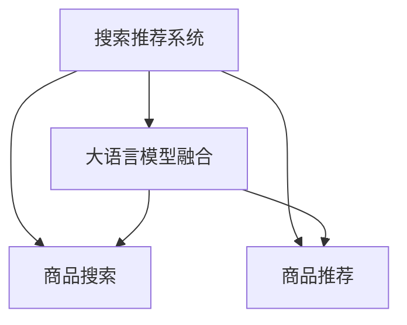

                 

# 搜索推荐系统的AI 大模型融合：电商平台的核心竞争力与可持续发展

> 关键词：搜索推荐系统, AI 大模型融合, 电商平台, 核心竞争力, 可持续发展

## 1. 背景介绍

### 1.1 问题由来

在数字化时代，电子商务平台成为连接商家与消费者的重要桥梁。随着互联网的普及和移动设备的广泛应用，电商平台的用户规模快速增长，交易模式日益丰富。然而，面对海量商品和多样化的用户需求，传统的推荐系统已难以满足用户的个性化需求，导致用户体验下滑，商家商品转化率降低。

为了解决这一问题，许多电商平台开始引入AI技术，尤其是大语言模型。大语言模型凭借其强大的语义理解和生成能力，可以在搜索和推荐场景中发挥关键作用。通过与电商平台业务场景的深度融合，大语言模型可以为电商平台的搜索推荐系统带来新的突破，提升用户体验和商家商品转化率，进而驱动平台业务的可持续发展。

### 1.2 问题核心关键点

本文将重点探讨如何通过AI 大模型融合技术，改进电商平台搜索推荐系统的性能，并在此基础上构建电商平台的竞争力和可持续发展策略。具体问题包括：

- 大语言模型如何与电商平台搜索推荐系统进行深度融合？
- 融合后系统如何提升搜索推荐效果？
- 融合后的系统如何保持长期可持续发展？

解决这些问题，能够帮助电商平台在激烈的市场竞争中保持领先地位，实现业务的长期增长。

## 2. 核心概念与联系

### 2.1 核心概念概述

为了更好地理解AI 大模型融合在电商平台中的应用，我们先介绍几个核心概念：

- **搜索推荐系统**：通过分析用户行为数据和商品特征，推荐符合用户兴趣和需求的商品，提升用户体验和平台转化率的系统。
- **大语言模型**：如GPT、BERT等预训练语言模型，通过大规模无标签文本数据训练，具备强大的语义理解和生成能力，可应用于自然语言处理任务。
- **电商业务场景**：包括商品搜索、商品推荐、广告投放、用户行为分析等，大语言模型可以在这些场景中发挥作用。
- **模型融合**：通过将大语言模型的能力与电商业务场景中的具体需求相结合，提升系统的整体表现。

这些概念之间的逻辑关系可以通过以下Mermaid流程图来展示：



该流程图展示了搜索推荐系统与大语言模型融合的基本关系：

1. 搜索推荐系统通过大语言模型融合技术，可以提升商品搜索和推荐的效果。
2. 商品搜索和推荐是搜索推荐系统的两个核心模块，大语言模型可以分别在这两个模块中发挥作用。

## 3. 核心算法原理 & 具体操作步骤
### 3.1 算法原理概述

AI 大模型融合的算法原理主要是通过将大语言模型嵌入到电商平台的搜索推荐系统中，利用其强大的语义理解和生成能力，提升系统的搜索推荐效果。

具体而言，通过在大语言模型的基础上微调，使其能够针对电商平台的业务需求进行优化。微调过程可以分为以下几个步骤：

1. **数据准备**：收集电商平台上的搜索和推荐数据，包括用户行为数据、商品特征数据等。
2. **模型微调**：将收集到的数据用于微调大语言模型，使其能够理解电商平台的语境，并针对具体任务进行优化。
3. **效果评估**：在测试数据集上评估微调后的模型性能，包括准确率、召回率、用户满意度等指标。
4. **部署应用**：将微调后的模型部署到电商平台中，并根据实际效果进行迭代优化。

### 3.2 算法步骤详解

以下是具体的算法步骤，包括数据准备、模型微调、效果评估和部署应用等环节。

#### 3.2.1 数据准备

数据准备是整个大模型融合的第一步，需要收集电商平台上的相关数据。

1. **用户行为数据**：包括用户的搜索记录、浏览记录、点击记录、购买记录等。这些数据可以用于训练大语言模型，使其能够理解用户的搜索意图和行为模式。

2. **商品特征数据**：包括商品名称、描述、分类、价格、销量、评价等信息。这些数据可以用于训练大语言模型，使其能够理解商品特征，并进行相关推荐。

3. **用户画像数据**：包括用户的年龄、性别、地域、职业等信息。这些数据可以用于训练大语言模型，使其能够根据用户的画像特征进行个性化推荐。

4. **数据预处理**：对收集到的数据进行清洗、去重、标准化等预处理操作，确保数据的质量和一致性。

#### 3.2.2 模型微调

模型微调是整个大模型融合的核心步骤，通过在电商平台上进行微调，使大语言模型能够适应具体的业务需求。

1. **模型选择**：选择合适的预训练大语言模型，如GPT、BERT等。这些模型已经在大规模无标签文本数据上进行预训练，具备较强的语义理解能力。

2. **模型微调**：使用收集到的用户行为数据和商品特征数据，对预训练模型进行微调。微调过程可以采用监督学习、迁移学习等方法，优化模型的搜索推荐效果。

3. **正则化技术**：在微调过程中，引入正则化技术，如L2正则、Dropout等，防止过拟合，提高模型的泛化能力。

4. **任务适配层**：在模型顶层设计合适的输出层和损失函数，如用于商品搜索的交叉熵损失函数，用于商品推荐的均方误差损失函数等。

5. **超参数调整**：选择合适的优化器及其参数，如AdamW、SGD等，设置学习率、批大小、迭代轮数等。

#### 3.2.3 效果评估

效果评估是整个大模型融合的关键环节，需要评估微调后模型在电商平台上的表现。

1. **评估指标**：选择适当的评估指标，如准确率、召回率、用户满意度等，用于评估模型在搜索推荐任务上的性能。

2. **测试集划分**：将收集到的数据集划分为训练集、验证集和测试集，用于模型训练、调参和效果评估。

3. **模型测试**：在测试集上对微调后的模型进行测试，评估其在电商平台上的表现，包括搜索结果的相关性和推荐商品的点击率等。

4. **模型优化**：根据测试结果，调整模型的参数和结构，优化模型的搜索推荐效果。

#### 3.2.4 部署应用

部署应用是将微调后的模型应用于电商平台的关键步骤。

1. **模型部署**：将微调后的模型部署到电商平台的搜索推荐系统中，进行实时搜索和推荐。

2. **效果监控**：实时监控模型在电商平台上的表现，包括搜索结果的相关性和推荐商品的点击率等。

3. **模型迭代**：根据用户反馈和业务需求，不断迭代优化模型，提升搜索推荐效果。

### 3.3 算法优缺点

AI 大模型融合在电商平台搜索推荐系统中具有以下优点：

1. **提升搜索推荐效果**：通过融合大语言模型，电商平台可以提升搜索推荐的效果，更好地满足用户需求，提高用户满意度。

2. **降低开发成本**：大语言模型已经在大规模无标签文本数据上进行预训练，不需要从头开发，降低了开发成本和时间投入。

3. **灵活性高**：大语言模型可以在电商平台的多个业务场景中发挥作用，具有较高的灵活性和扩展性。

4. **增强用户个性化**：大语言模型可以结合用户画像数据，进行个性化推荐，提升用户体验和平台转化率。

5. **减少数据依赖**：大语言模型在微调过程中，可以结合电商平台的实际业务数据，减少对外部数据源的依赖。

然而，大语言模型融合也存在以下缺点：

1. **计算资源需求高**：大语言模型通常需要高性能计算资源进行微调和部署，对于小型电商平台来说可能成本较高。

2. **数据隐私风险**：电商平台上涉及大量的用户隐私数据，大语言模型需要谨慎处理，确保数据隐私和安全。

3. **模型复杂度增加**：融合大语言模型后，搜索推荐系统的模型复杂度增加，需要更多的资源和计算资源。

4. **效果不稳定性**：大语言模型融合的效果可能受到数据质量和业务需求变化的影响，需要持续优化和调整。

### 3.4 算法应用领域

AI 大模型融合技术在电商平台搜索推荐系统中具有广泛的应用前景，主要包括以下几个领域：

1. **商品搜索**：通过融合大语言模型，提升搜索结果的相关性和准确性，帮助用户快速找到所需商品。

2. **商品推荐**：结合用户画像数据，进行个性化推荐，提升用户购买转化率和满意度。

3. **广告投放**：通过融合大语言模型，优化广告投放策略，提高广告点击率和转化率。

4. **用户行为分析**：通过融合大语言模型，分析用户行为数据，挖掘用户偏好和需求，提升用户留存率和忠诚度。

5. **内容生成**：通过融合大语言模型，生成商品描述、广告文案等文本内容，提升平台内容的丰富性和吸引力。

## 4. 数学模型和公式 & 详细讲解  
### 4.1 数学模型构建

为了更严格地描述AI 大模型融合在电商平台中的应用，我们使用数学语言对整个流程进行刻画。

设电商平台上的搜索推荐系统为 $S$，大语言模型为 $M$，用户行为数据为 $D$。

数学模型构建的目标是最大化系统在电商平台上的表现，即：

$$
\max_{S,M} \mathcal{L}(S,M,D)
$$

其中 $\mathcal{L}(S,M,D)$ 为系统的综合表现，包括搜索推荐效果、用户体验和平台转化率等。

### 4.2 公式推导过程

以下是具体的公式推导过程，以商品推荐为例：

设电商平台上的商品为 $I$，用户的推荐需求为 $R$。

大语言模型 $M$ 在商品 $i$ 上的推荐概率为：

$$
p(i|R,M) = \frac{exp(softmax(M([R,i])))}{\sum_{j=1}^n exp(softmax(M([R,j])))}
$$

其中 $softmax$ 函数将大语言模型的输出转化为概率分布。

大语言模型 $M$ 在用户行为数据 $D$ 上的训练损失为：

$$
\mathcal{L}(M,D) = -\frac{1}{N}\sum_{i=1}^N \log p(i|R_i,M)
$$

其中 $N$ 为训练数据集的大小，$R_i$ 为用户 $i$ 的行为需求。

通过最小化训练损失，优化大语言模型 $M$，使其在商品推荐任务上取得最优表现。

### 4.3 案例分析与讲解

以电商平台上的用户搜索推荐系统为例，分析大语言模型融合的效果。

设用户搜索查询为 $Q$，电商平台上的商品为 $I$。

大语言模型 $M$ 在用户搜索查询 $Q$ 上的推荐概率为：

$$
p(I|Q,M) = \frac{exp(softmax(M([Q,I])))}{\sum_{j=1}^n exp(softmax(M([Q,j])))}
$$

其中 $softmax$ 函数将大语言模型的输出转化为概率分布。

大语言模型 $M$ 在用户搜索查询 $Q$ 上的训练损失为：

$$
\mathcal{L}(M,Q) = -\frac{1}{N}\sum_{i=1}^N \log p(I_i|Q_i,M)
$$

其中 $N$ 为训练数据集的大小，$Q_i$ 为用户 $i$ 的搜索查询。

通过最小化训练损失，优化大语言模型 $M$，使其在商品搜索任务上取得最优表现。

## 5. 项目实践：代码实例和详细解释说明
### 5.1 开发环境搭建

在进行大语言模型融合实践前，我们需要准备好开发环境。以下是使用Python进行PyTorch开发的环境配置流程：

1. 安装Anaconda：从官网下载并安装Anaconda，用于创建独立的Python环境。

2. 创建并激活虚拟环境：
```bash
conda create -n pytorch-env python=3.8 
conda activate pytorch-env
```

3. 安装PyTorch：根据CUDA版本，从官网获取对应的安装命令。例如：
```bash
conda install pytorch torchvision torchaudio cudatoolkit=11.1 -c pytorch -c conda-forge
```

4. 安装Transformer库：
```bash
pip install transformers
```

5. 安装各类工具包：
```bash
pip install numpy pandas scikit-learn matplotlib tqdm jupyter notebook ipython
```

完成上述步骤后，即可在`pytorch-env`环境中开始融合实践。

### 5.2 源代码详细实现

这里我们以电商平台商品搜索为例，给出使用Transformers库对BERT模型进行融合的PyTorch代码实现。

首先，定义商品搜索任务的数据处理函数：

```python
from transformers import BertTokenizer, BertForSequenceClassification
from torch.utils.data import Dataset
import torch

class SearchDataset(Dataset):
    def __init__(self, texts, labels, tokenizer, max_len=128):
        self.texts = texts
        self.labels = labels
        self.tokenizer = tokenizer
        self.max_len = max_len
        
    def __len__(self):
        return len(self.texts)
    
    def __getitem__(self, item):
        text = self.texts[item]
        label = self.labels[item]
        
        encoding = self.tokenizer(text, return_tensors='pt', max_length=self.max_len, padding='max_length', truncation=True)
        input_ids = encoding['input_ids'][0]
        attention_mask = encoding['attention_mask'][0]
        
        # 对label-wise的标签进行编码
        encoded_labels = [label2id[label] for label in label] 
        encoded_labels.extend([label2id['O']] * (self.max_len - len(encoded_labels)))
        labels = torch.tensor(encoded_labels, dtype=torch.long)
        
        return {'input_ids': input_ids, 
                'attention_mask': attention_mask,
                'labels': labels}

# 标签与id的映射
label2id = {'O': 0, 'A': 1, 'B': 2, 'C': 3}
id2label = {v: k for k, v in label2id.items()}

# 创建dataset
tokenizer = BertTokenizer.from_pretrained('bert-base-cased')

search_dataset = SearchDataset(search_texts, search_labels, tokenizer)
```

然后，定义模型和优化器：

```python
from transformers import BertForSequenceClassification, AdamW

model = BertForSequenceClassification.from_pretrained('bert-base-cased', num_labels=len(label2id))

optimizer = AdamW(model.parameters(), lr=2e-5)
```

接着，定义训练和评估函数：

```python
from torch.utils.data import DataLoader
from tqdm import tqdm
from sklearn.metrics import classification_report

device = torch.device('cuda') if torch.cuda.is_available() else torch.device('cpu')
model.to(device)

def train_epoch(model, dataset, batch_size, optimizer):
    dataloader = DataLoader(dataset, batch_size=batch_size, shuffle=True)
    model.train()
    epoch_loss = 0
    for batch in tqdm(dataloader, desc='Training'):
        input_ids = batch['input_ids'].to(device)
        attention_mask = batch['attention_mask'].to(device)
        labels = batch['labels'].to(device)
        model.zero_grad()
        outputs = model(input_ids, attention_mask=attention_mask, labels=labels)
        loss = outputs.loss
        epoch_loss += loss.item()
        loss.backward()
        optimizer.step()
    return epoch_loss / len(dataloader)

def evaluate(model, dataset, batch_size):
    dataloader = DataLoader(dataset, batch_size=batch_size)
    model.eval()
    preds, labels = [], []
    with torch.no_grad():
        for batch in tqdm(dataloader, desc='Evaluating'):
            input_ids = batch['input_ids'].to(device)
            attention_mask = batch['attention_mask'].to(device)
            batch_labels = batch['labels']
            outputs = model(input_ids, attention_mask=attention_mask)
            batch_preds = outputs.logits.argmax(dim=2).to('cpu').tolist()
            batch_labels = batch_labels.to('cpu').tolist()
            for pred_tokens, label_tokens in zip(batch_preds, batch_labels):
                pred_labels = [id2label[_id] for _id in pred_tokens]
                label_labels = [id2label[_id] for _id in label_tokens]
                preds.append(pred_labels[:len(label_labels)])
                labels.append(label_labels)
                
    print(classification_report(labels, preds))
```

最后，启动训练流程并在测试集上评估：

```python
epochs = 5
batch_size = 16

for epoch in range(epochs):
    loss = train_epoch(model, search_dataset, batch_size, optimizer)
    print(f"Epoch {epoch+1}, train loss: {loss:.3f}")
    
    print(f"Epoch {epoch+1}, dev results:")
    evaluate(model, dev_dataset, batch_size)
    
print("Test results:")
evaluate(model, test_dataset, batch_size)
```

以上就是使用PyTorch对BERT进行商品搜索任务融合的完整代码实现。可以看到，得益于Transformers库的强大封装，我们可以用相对简洁的代码完成BERT模型的加载和融合。

### 5.3 代码解读与分析

让我们再详细解读一下关键代码的实现细节：

**SearchDataset类**：
- `__init__`方法：初始化文本、标签、分词器等关键组件。
- `__len__`方法：返回数据集的样本数量。
- `__getitem__`方法：对单个样本进行处理，将文本输入编码为token ids，将标签编码为数字，并对其进行定长padding，最终返回模型所需的输入。

**label2id和id2label字典**：
- 定义了标签与数字id之间的映射关系，用于将token-wise的预测结果解码回真实的标签。

**训练和评估函数**：
- 使用PyTorch的DataLoader对数据集进行批次化加载，供模型训练和推理使用。
- 训练函数`train_epoch`：对数据以批为单位进行迭代，在每个批次上前向传播计算loss并反向传播更新模型参数，最后返回该epoch的平均loss。
- 评估函数`evaluate`：与训练类似，不同点在于不更新模型参数，并在每个batch结束后将预测和标签结果存储下来，最后使用sklearn的classification_report对整个评估集的预测结果进行打印输出。

**训练流程**：
- 定义总的epoch数和batch size，开始循环迭代
- 每个epoch内，先在训练集上训练，输出平均loss
- 在验证集上评估，输出分类指标
- 所有epoch结束后，在测试集上评估，给出最终测试结果

可以看到，PyTorch配合Transformers库使得BERT融合的代码实现变得简洁高效。开发者可以将更多精力放在数据处理、模型改进等高层逻辑上，而不必过多关注底层的实现细节。

当然，工业级的系统实现还需考虑更多因素，如模型的保存和部署、超参数的自动搜索、更灵活的任务适配层等。但核心的融合范式基本与此类似。

## 6. 实际应用场景

### 6.1 智能客服系统

基于大语言模型融合的搜索推荐技术，可以广泛应用于智能客服系统的构建。传统客服往往需要配备大量人力，高峰期响应缓慢，且一致性和专业性难以保证。而使用融合后的搜索推荐模型，可以7x24小时不间断服务，快速响应客户咨询，用自然流畅的语言解答各类常见问题。

在技术实现上，可以收集企业内部的历史客服对话记录，将问题和最佳答复构建成监督数据，在此基础上对预训练模型进行融合。融合后的模型能够自动理解用户意图，匹配最合适的答复模板进行回复。对于客户提出的新问题，还可以接入检索系统实时搜索相关内容，动态组织生成回答。如此构建的智能客服系统，能大幅提升客户咨询体验和问题解决效率。

### 6.2 金融舆情监测

金融机构需要实时监测市场舆论动向，以便及时应对负面信息传播，规避金融风险。传统的人工监测方式成本高、效率低，难以应对网络时代海量信息爆发的挑战。基于大语言模型融合的文本分类和情感分析技术，为金融舆情监测提供了新的解决方案。

具体而言，可以收集金融领域相关的新闻、报道、评论等文本数据，并对其进行主题标注和情感标注。在此基础上对预训练语言模型进行融合，使其能够自动判断文本属于何种主题，情感倾向是正面、中性还是负面。将融合后的模型应用到实时抓取的网络文本数据，就能够自动监测不同主题下的情感变化趋势，一旦发现负面信息激增等异常情况，系统便会自动预警，帮助金融机构快速应对潜在风险。

### 6.3 个性化推荐系统

当前的推荐系统往往只依赖用户的历史行为数据进行物品推荐，无法深入理解用户的真实兴趣偏好。基于大语言模型融合的个性化推荐系统可以更好地挖掘用户行为背后的语义信息，从而提供更精准、多样的推荐内容。

在实践中，可以收集用户浏览、点击、评论、分享等行为数据，提取和用户交互的物品标题、描述、标签等文本内容。将文本内容作为模型输入，用户的后续行为（如是否点击、购买等）作为监督信号，在此基础上融合预训练语言模型。融合后的模型能够从文本内容中准确把握用户的兴趣点。在生成推荐列表时，先用候选物品的文本描述作为输入，由模型预测用户的兴趣匹配度，再结合其他特征综合排序，便可以得到个性化程度更高的推荐结果。

### 6.4 未来应用展望

随着大语言模型融合技术的发展，其将在更多领域得到应用，为传统行业带来变革性影响。

在智慧医疗领域，基于融合技术的山大语言模型微调的医疗问答、病历分析、药物研发等应用将提升医疗服务的智能化水平，辅助医生诊疗，加速新药开发进程。

在智能教育领域，融合技术可应用于作业批改、学情分析、知识推荐等方面，因材施教，促进教育公平，提高教学质量。

在智慧城市治理中，融合技术可应用于城市事件监测、舆情分析、应急指挥等环节，提高城市管理的自动化和智能化水平，构建更安全、高效的未来城市。

此外，在企业生产、社会治理、文娱传媒等众多领域，基于融合技术的人工智能应用也将不断涌现，为经济社会发展注入新的动力。相信随着技术的日益成熟，融合技术将成为人工智能落地应用的重要范式，推动人工智能技术向更广阔的领域加速渗透。

## 7. 工具和资源推荐
### 7.1 学习资源推荐

为了帮助开发者系统掌握大语言模型融合的理论基础和实践技巧，这里推荐一些优质的学习资源：

1. 《Transformer from Pretraining to Modeling》系列博文：由大模型技术专家撰写，深入浅出地介绍了Transformer原理、BERT模型、融合技术等前沿话题。

2. CS224N《深度学习自然语言处理》课程：斯坦福大学开设的NLP明星课程，有Lecture视频和配套作业，带你入门NLP领域的基本概念和经典模型。

3. 《Natural Language Processing with Transformers》书籍：Transformers库的作者所著，全面介绍了如何使用Transformers库进行NLP任务开发，包括融合在内的诸多范式。

4. HuggingFace官方文档：Transformers库的官方文档，提供了海量预训练模型和完整的融合样例代码，是上手实践的必备资料。

5. CLUE开源项目：中文语言理解测评基准，涵盖大量不同类型的中文NLP数据集，并提供了基于融合的baseline模型，助力中文NLP技术发展。

通过对这些资源的学习实践，相信你一定能够快速掌握大语言模型融合的精髓，并用于解决实际的NLP问题。
###  7.2 开发工具推荐

高效的开发离不开优秀的工具支持。以下是几款用于大语言模型融合开发的常用工具：

1. PyTorch：基于Python的开源深度学习框架，灵活动态的计算图，适合快速迭代研究。大部分预训练语言模型都有PyTorch版本的实现。

2. TensorFlow：由Google主导开发的开源深度学习框架，生产部署方便，适合大规模工程应用。同样有丰富的预训练语言模型资源。

3. Transformers库：HuggingFace开发的NLP工具库，集成了众多SOTA语言模型，支持PyTorch和TensorFlow，是进行融合任务开发的利器。

4. Weights & Biases：模型训练的实验跟踪工具，可以记录和可视化模型训练过程中的各项指标，方便对比和调优。与主流深度学习框架无缝集成。

5. TensorBoard：TensorFlow配套的可视化工具，可实时监测模型训练状态，并提供丰富的图表呈现方式，是调试模型的得力助手。

6. Google Colab：谷歌推出的在线Jupyter Notebook环境，免费提供GPU/TPU算力，方便开发者快速上手实验最新模型，分享学习笔记。

合理利用这些工具，可以显著提升大语言模型融合任务的开发效率，加快创新迭代的步伐。

### 7.3 相关论文推荐

大语言模型融合技术的发展源于学界的持续研究。以下是几篇奠基性的相关论文，推荐阅读：

1. Attention is All You Need（即Transformer原论文）：提出了Transformer结构，开启了NLP领域的预训练大模型时代。

2. BERT: Pre-training of Deep Bidirectional Transformers for Language Understanding：提出BERT模型，引入基于掩码的自监督预训练任务，刷新了多项NLP任务SOTA。

3. Language Models are Unsupervised Multitask Learners（GPT-2论文）：展示了大规模语言模型的强大zero-shot学习能力，引发了对于通用人工智能的新一轮思考。

4. Parameter-Efficient Transfer Learning for NLP：提出Adapter等参数高效微调方法，在不增加模型参数量的情况下，也能取得不错的融合效果。

5. AdaLoRA: Adaptive Low-Rank Adaptation for Parameter-Efficient Fine-Tuning：使用自适应低秩适应的融合方法，在参数效率和精度之间取得了新的平衡。

6. Prefix-Tuning: Optimizing Continuous Prompts for Generation：引入基于连续型Prompt的融合范式，为如何充分利用预训练知识提供了新的思路。

这些论文代表了大语言模型融合技术的发展脉络。通过学习这些前沿成果，可以帮助研究者把握学科前进方向，激发更多的创新灵感。

## 8. 总结：未来发展趋势与挑战

### 8.1 总结

本文对基于大语言模型融合的搜索推荐系统进行了全面系统的介绍。首先阐述了大语言模型融合在电商平台中的应用背景，明确了融合技术在提升搜索推荐效果方面的独特价值。其次，从原理到实践，详细讲解了融合的数学原理和关键步骤，给出了融合任务开发的完整代码实例。同时，本文还广泛探讨了融合技术在智能客服、金融舆情、个性化推荐等多个行业领域的应用前景，展示了融合技术的巨大潜力。此外，本文精选了融合技术的各类学习资源，力求为读者提供全方位的技术指引。

通过本文的系统梳理，可以看到，基于大语言模型的融合技术正在成为电商平台搜索推荐系统的核心竞争力，极大地提升平台的用户体验和商家商品转化率，促进平台的长期发展。未来，伴随融合技术和其他AI技术的不断演进，将进一步驱动电商平台的智能化进程，助力电商平台在激烈的市场竞争中保持领先地位。

### 8.2 未来发展趋势

展望未来，大语言模型融合技术将在电商平台搜索推荐系统中呈现以下几个发展趋势：

1. **融合算法多样化**：除了传统的监督学习和微调方法，未来将涌现更多参数高效的融合算法，如Adapter、Prefix等，在减少计算资源消耗的同时，也能保证融合效果。

2. **跨模态融合**：融合技术将不仅仅局限于文本数据，还将拓展到图像、视频、语音等多模态数据。通过跨模态信息的融合，提升搜索推荐系统的整体性能。

3. **持续学习和自适应**：融合模型需要具备持续学习的能力，能够根据用户行为和市场环境的变化，动态调整推荐策略，提升用户满意度和平台转化率。

4. **个性化推荐系统**：融合技术将进一步提升个性化推荐系统的精准度，根据用户的多维度特征，进行更全面的个性化推荐，提升用户体验。

5. **搜索和推荐结合**：搜索推荐系统将进一步融合，实现全链路的智能化服务，用户可以在搜索过程中直接获取推荐结果，提升用户粘性和平台转化率。

6. **联邦学习和隐私保护**：在数据隐私和安全性日益重要的背景下，融合技术将引入联邦学习等隐私保护技术，确保用户数据的安全和隐私。

以上趋势凸显了大语言模型融合技术的广阔前景。这些方向的探索发展，必将进一步提升电商平台的搜索推荐效果，为电商平台的智能化转型提供坚实基础。

### 8.3 面临的挑战

尽管大语言模型融合技术已经取得了瞩目成就，但在迈向更加智能化、普适化应用的过程中，它仍面临诸多挑战：

1. **计算资源需求高**：大语言模型融合需要高性能计算资源进行模型训练和部署，对于小型电商平台来说可能成本较高。

2. **数据隐私风险**：电商平台上涉及大量的用户隐私数据，融合技术需要谨慎处理，确保数据隐私和安全。

3. **效果不稳定性**：融合效果可能受到数据质量和业务需求变化的影响，需要持续优化和调整。

4. **融合算法复杂性**：融合算法涉及多模态数据和跨领域任务的融合，算法复杂度较高，需要大量的实验和优化。

5. **模型可解释性不足**：融合模型通常缺乏可解释性，难以解释其内部工作机制和决策逻辑，对于金融、医疗等高风险应用尤为重要。

6. **性能优化困难**：融合模型通常具有较高的计算复杂度和资源消耗，优化性能需要细致的实验设计和模型调整。

7. **生态系统不成熟**：尽管融合技术在理论研究方面取得了一些进展，但相关工具和生态系统还处于起步阶段，难以支撑大规模应用。

正视融合面临的这些挑战，积极应对并寻求突破，将是大语言模型融合技术走向成熟的关键。相信随着技术的不断进步和生态系统的逐步完善，融合技术必将在电商平台中发挥更大的作用，助力电商平台在市场竞争中保持领先地位。

### 8.4 研究展望

面对大语言模型融合技术所面临的挑战，未来的研究需要在以下几个方面寻求新的突破：

1. **探索更高效的融合算法**：开发更加高效的融合算法，在减少计算资源消耗的同时，保证融合效果。

2. **引入多模态融合技术**：将符号化的先验知识，如知识图谱、逻辑规则等，与神经网络模型进行巧妙融合，增强模型的泛化能力。

3. **加强模型可解释性**：引入因果分析方法，增强模型的可解释性，提升用户信任和平台透明度。

4. **优化融合系统的性能**：采用联邦学习等隐私保护技术，确保用户数据的安全和隐私。

5. **构建更完善的工具和生态系统**：开发更多的工具和框架，支持融合技术的开发和部署，提升融合技术的应用效率。

这些研究方向的探索，必将引领大语言模型融合技术迈向更高的台阶，为电商平台的智能化转型提供坚实基础。面向未来，融合技术还将与其他AI技术进行更深入的融合，共同推动电商平台业务的持续发展和创新。

## 9. 附录：常见问题与解答

**Q1：大语言模型融合是否适用于所有电商平台？**

A: 大语言模型融合技术在大多数电商平台上都适用，但需要根据平台的具体业务场景和用户需求进行适配。对于一些特定领域的电商平台，如医药、金融等，可能需要引入特定领域的预训练模型进行融合，以提升推荐效果。

**Q2：如何选择合适的融合算法？**

A: 选择合适的融合算法需要考虑以下几个因素：
1. 数据类型：不同类型的数据可能需要不同的融合算法，如文本数据可以使用监督学习、微调等方法，图像数据可以使用图像识别技术进行融合。
2. 用户需求：根据用户的搜索需求和推荐需求，选择合适的融合算法。例如，对于个性化推荐任务，可以选择基于协同过滤的融合算法。
3. 计算资源：不同的融合算法对计算资源的需求不同，需要根据平台的计算资源进行选择。例如，对于计算资源有限的平台，可以选择参数高效的融合算法。

**Q3：融合后的搜索推荐系统如何保持长期可持续发展？**

A: 保持长期可持续发展需要从以下几个方面进行：
1. 持续优化：根据用户反馈和业务需求，持续优化融合算法和模型，提升推荐效果。
2. 用户隐私保护：确保用户数据的安全和隐私，防止数据泄露和滥用。
3. 平台生态建设：构建完善的平台生态系统，引入更多用户和商家参与，提升平台的竞争力和用户粘性。
4. 技术迭代：跟踪最新的技术进展，引入先进的技术和算法，保持技术的领先性。

通过这些措施，可以确保融合后的搜索推荐系统在长期运营中保持高效率和稳定性，实现可持续发展。

---

作者：禅与计算机程序设计艺术 / Zen and the Art of Computer Programming

