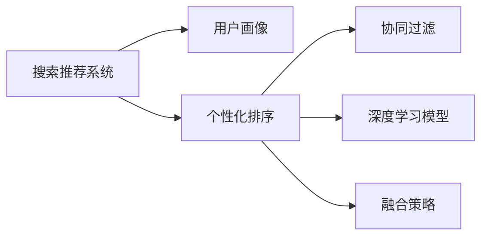

                 

# 搜索推荐系统的个性化排序算法

> 关键词：搜索推荐系统, 个性化排序, 排序算法, 用户行为分析, 协同过滤, 深度学习

## 1. 背景介绍

在现代社会，信息过载的问题愈发严重。如何从海量的数据中迅速找到用户感兴趣的内容，成为了互联网应用的重要课题。搜索推荐系统应运而生，通过个性化排序算法，帮助用户发现并体验最适合他们的信息。

### 1.1 问题由来

随着互联网的普及和电子商务的快速发展，推荐系统已经成为了各类网站和应用中不可或缺的一部分。从购物网站到视频平台，从社交网络到新闻客户端，推荐系统无处不在。

传统的推荐算法主要依赖于用户的显式反馈，如评分、点击等。然而，随着用户在线行为的增多，用户对产品的兴趣往往难以直接显式地表达出来。因此，个性化的推荐系统不仅需要考虑用户显式反馈，更需深入分析用户的隐式行为，如浏览、搜索、互动等，来预测用户的潜在需求。

面对海量数据和多样化用户需求，传统推荐算法难以兼顾个性化和高效性。为了应对这一挑战，个性化排序算法应运而生。通过这些算法，推荐系统能够更加智能地为用户提供精确、多样、有趣的内容。

### 1.2 问题核心关键点

个性化排序算法是推荐系统的核心，其目标是通过对用户历史行为数据的分析，预测用户对每个候选项的兴趣，从而对候选项进行排序，并最终推荐给用户。其核心关键点包括：

1. **用户行为分析**：通过分析用户浏览、点击、评分、评论等行为数据，建立用户画像，了解用户的兴趣和偏好。
2. **协同过滤**：根据用户行为数据构建用户之间的相似性矩阵，找到与目标用户兴趣相似的用户，从而推荐其喜爱的物品。
3. **深度学习模型**：利用神经网络等深度学习模型，捕捉用户行为数据中的复杂特征和模式，提升推荐精度。
4. **融合策略**：综合多种排序算法的结果，如基于用户-物品交互的行为排序、基于内容的排序、基于时序的排序等，以获取更全面、准确的推荐结果。

## 2. 核心概念与联系

### 2.1 核心概念概述

为了更好地理解个性化排序算法，我们首先需要梳理一些核心概念：

- **搜索推荐系统(Search and Recommendation System)**：通过算法分析用户行为数据，提供个性化信息服务，帮助用户发现感兴趣的内容的系统。
- **个性化排序(个性推荐)**：基于用户行为数据，预测用户对候选项的兴趣，进行排序并推荐给用户。
- **用户画像**：对用户兴趣、行为、人口统计特征等的综合描述，通过聚类等技术，生成用户特征向量。
- **协同过滤**：通过分析用户行为数据，发现用户之间的相似性，推荐相似用户喜爱的物品。
- **深度学习模型**：如卷积神经网络(CNN)、循环神经网络(RNN)、自编码器(AE)等，用于提取用户行为数据中的复杂特征和模式。
- **融合策略**：将多种排序算法的结果进行融合，提升推荐精度。

这些核心概念之间的关系可以通过以下Mermaid流程图来展示：



这个流程图展示了搜索推荐系统的关键流程，其中个性化排序算法是核心模块，它依赖于用户画像、协同过滤、深度学习模型和融合策略的支持。

## 3. 核心算法原理 & 具体操作步骤
### 3.1 算法原理概述

个性化排序算法的核心思想是通过对用户历史行为数据的分析，预测用户对每个候选项的兴趣，并根据兴趣进行排序，最终推荐给用户。其数学模型可以表示为：

$$
R(u, i) = f(u, i) \cdot \alpha + p(u, i) \cdot \beta + c(u, i) \cdot \gamma + d(u, i) \cdot \delta
$$

其中，$u$ 表示用户，$i$ 表示物品，$R(u, i)$ 表示用户对物品的评分或兴趣程度，$f$、$p$、$c$、$d$ 分别表示基于用户-物品交互的行为排序、基于内容的排序、基于时序的排序和深度学习模型预测的评分，$\alpha$、$\beta$、$\gamma$、$\delta$ 为模型权重。

个性化排序算法分为两个主要步骤：

1. 训练模型。收集用户行为数据，如浏览记录、点击记录、评分记录等，训练深度学习模型。
2. 预测评分。对于每个候选物品 $i$，预测用户 $u$ 的评分 $R(u, i)$，并根据评分进行排序。

### 3.2 算法步骤详解

下面我们将详细阐述个性化排序算法的步骤：

**Step 1: 数据收集与预处理**

- **用户行为数据收集**：收集用户对物品的浏览、点击、评分、评论等行为数据。
- **数据清洗**：去除缺失、异常数据，对数据进行标准化处理。
- **特征提取**：对用户和物品进行特征提取，生成用户特征向量和物品特征向量。

**Step 2: 模型训练**

- **构建深度学习模型**：使用神经网络等深度学习模型，如神经协同过滤(如MF)、卷积神经网络(CNN)、循环神经网络(RNN)等，训练预测用户对物品兴趣的评分。
- **优化模型参数**：使用优化算法，如随机梯度下降(SGD)、Adam等，最小化预测误差。
- **验证与调优**：在验证集上评估模型性能，调整模型超参数，如学习率、批量大小等。

**Step 3: 预测评分**

- **输入数据**：将用户特征向量和物品特征向量输入模型，得到预测评分。
- **融合结果**：根据不同的排序算法，如协同过滤、深度学习模型等，计算综合评分。
- **排序与推荐**：根据综合评分对候选物品进行排序，并推荐给用户。

### 3.3 算法优缺点

个性化排序算法具有以下优点：

1. **高效性**：算法通常能够快速处理大规模数据集，并实时响应用户请求。
2. **个性化**：算法能够深入分析用户行为数据，提供高度个性化的推荐内容。
3. **可扩展性**：算法能够容易地融入到不同的推荐系统中，适应不同应用场景。

同时，个性化排序算法也存在以下缺点：

1. **数据依赖**：算法的性能依赖于高质量的用户行为数据，数据缺失或偏差可能导致推荐效果不佳。
2. **冷启动问题**：对于新用户或新物品，难以获得足够的历史行为数据，推荐效果会大打折扣。
3. **泛化性不足**：算法通常依赖特定的数据集和模型结构，难以泛化到新的数据集或模型。
4. **隐私保护**：算法需要收集和分析用户行为数据，涉及隐私保护问题，需要严格遵守相关法律法规。

### 3.4 算法应用领域

个性化排序算法广泛应用于各类推荐系统，如电商、新闻、视频、社交网络等。

- **电商推荐**：如淘宝、京东等电商平台，根据用户浏览、购买行为推荐商品。
- **新闻推荐**：如今日头条、腾讯新闻等，根据用户阅读习惯推荐新闻。
- **视频推荐**：如Netflix、爱奇艺等，根据用户观影行为推荐视频。
- **社交推荐**：如微信、微博等，根据用户互动行为推荐好友和内容。

除了上述常见应用领域，个性化排序算法还在游戏推荐、智能家居、金融等领域有着广泛的应用。

## 4. 数学模型和公式 & 详细讲解
### 4.1 数学模型构建

我们将使用数学语言对个性化排序算法进行严格刻画。

记用户为 $u$，物品为 $i$，用户对物品的兴趣评分为 $R(u, i)$，用户特征向量为 $x_u$，物品特征向量为 $x_i$，深度学习模型为 $f$。

个性化排序算法的目标是通过训练模型，使得预测评分 $R(u, i)$ 与真实评分 $R(u, i)$ 的误差最小化，即：

$$
\min_{f} \sum_{(u,i)} (R(u, i) - f(x_u, x_i))^2
$$

其中，$f(x_u, x_i)$ 表示模型在输入用户特征向量 $x_u$ 和物品特征向量 $x_i$ 下的预测评分。

### 4.2 公式推导过程

为了更好地理解公式，我们以协同过滤为例，详细推导评分预测公式。

协同过滤的核心思想是通过用户行为数据，建立用户-物品的相似性矩阵。假设用户 $u$ 对物品 $i$ 的评分 $R(u, i)$ 可以表示为用户 $u$ 对物品 $i$ 的评分 $R^u_i$ 和物品 $i$ 的评分 $R_i^v$ 的加权平均：

$$
R(u, i) = \sum_{v \in U} \alpha_{uv} R(v, i)
$$

其中，$U$ 表示用户集合，$\alpha_{uv}$ 表示用户 $u$ 和用户 $v$ 之间的相似度权重。

在协同过滤中，通常使用余弦相似度或皮尔逊相关系数来计算相似度权重 $\alpha_{uv}$：

$$
\alpha_{uv} = \frac{\langle x_u, x_v \rangle}{\Vert x_u \Vert \cdot \Vert x_v \Vert}
$$

或

$$
\alpha_{uv} = \frac{\sum_{j=1}^n (x_u^j \cdot x_v^j)}{\sqrt{\sum_{j=1}^n (x_u^j)^2} \cdot \sqrt{\sum_{j=1}^n (x_v^j)^2}}
$$

将 $R(u, i)$ 的表达式代入个性化排序模型的目标函数中，得：

$$
\min_{f} \sum_{(u,i)} (R(u, i) - f(x_u, x_i))^2 = \min_{f} \sum_{(u,i)} \left(\sum_{v \in U} \alpha_{uv} R(v, i) - f(x_u, x_i)\right)^2
$$

简化目标函数，得到：

$$
\min_{f} \sum_{(u,i)} \left(\sum_{v \in U} \alpha_{uv} R(v, i) - f(x_u, x_i)\right)^2 = \min_{f} \sum_{(u,i)} \left(\sum_{v \in U} \alpha_{uv} R(v, i) - f(x_u, x_i)\right)^2
$$

其中，$R(v, i)$ 表示用户 $v$ 对物品 $i$ 的评分。

### 4.3 案例分析与讲解

为了更好地理解个性化排序算法的实际应用，我们以电商推荐系统为例进行详细分析。

假设电商网站收集了用户对商品 $i$ 的浏览、点击、购买行为数据，如用户 $u$ 对商品 $i$ 的浏览次数为 $B_{ui}$，点击次数为 $C_{ui}$，购买次数为 $P_{ui}$。则用户 $u$ 对商品 $i$ 的评分 $R(u, i)$ 可以表示为：

$$
R(u, i) = a \cdot B_{ui} + b \cdot C_{ui} + c \cdot P_{ui}
$$

其中，$a$、$b$、$c$ 为模型参数。

在电商推荐系统中，我们通常使用协同过滤算法对用户行为数据进行处理，得到用户-物品相似度矩阵 $\alpha_{uv}$。根据公式：

$$
R(u, i) = \sum_{v \in U} \alpha_{uv} R(v, i)
$$

计算每个用户对每个物品的评分，并根据评分进行排序推荐。

## 5. 项目实践：代码实例和详细解释说明
### 5.1 开发环境搭建

在进行个性化排序算法开发前，我们需要准备好开发环境。以下是使用Python进行PyTorch开发的环境配置流程：

1. 安装Anaconda：从官网下载并安装Anaconda，用于创建独立的Python环境。

2. 创建并激活虚拟环境：
```bash
conda create -n pytorch-env python=3.8 
conda activate pytorch-env
```

3. 安装PyTorch：根据CUDA版本，从官网获取对应的安装命令。例如：
```bash
conda install pytorch torchvision torchaudio cudatoolkit=11.1 -c pytorch -c conda-forge
```

4. 安装TensorFlow：
```bash
pip install tensorflow
```

5. 安装PyTorch-lightning：
```bash
pip install pytorch-lightning
```

完成上述步骤后，即可在`pytorch-env`环境中开始项目开发。

### 5.2 源代码详细实现

下面我们以协同过滤算法为例，给出使用PyTorch实现个性化排序算法的代码实现。

首先，定义协同过滤模型的类：

```python
import torch
import torch.nn as nn
import torch.nn.functional as F
from torch.utils.data import DataLoader

class CollaborativeFiltering(nn.Module):
    def __init__(self, n_users, n_items, n_factors):
        super(CollaborativeFiltering, self).__init__()
        self.user_factors = nn.Embedding(n_users, n_factors)
        self.item_factors = nn.Embedding(n_items, n_factors)
        self.sigmoid = nn.Sigmoid()

    def forward(self, user_ids, item_ids):
        user_factor = self.user_factors(user_ids)
        item_factor = self.item_factors(item_ids)
        scores = (user_factor * item_factor).sum(dim=1)
        scores = self.sigmoid(scores)
        return scores
```

然后，定义数据处理和模型训练函数：

```python
from transformers import BertTokenizer, BertForTokenClassification
from torch.utils.data import Dataset
import torch
import torch.nn as nn
import torch.nn.functional as F
from torch.utils.data import DataLoader
from sklearn.metrics import classification_report
from transformers import BertTokenizer, BertForTokenClassification

class CollaborativeFiltering(nn.Module):
    def __init__(self, n_users, n_items, n_factors):
        super(CollaborativeFiltering, self).__init__()
        self.user_factors = nn.Embedding(n_users, n_factors)
        self.item_factors = nn.Embedding(n_items, n_factors)
        self.sigmoid = nn.Sigmoid()

    def forward(self, user_ids, item_ids):
        user_factor = self.user_factors(user_ids)
        item_factor = self.item_factors(item_ids)
        scores = (user_factor * item_factor).sum(dim=1)
        scores = self.sigmoid(scores)
        return scores

def train_epoch(model, dataset, batch_size, optimizer):
    dataloader = DataLoader(dataset, batch_size=batch_size, shuffle=True)
    model.train()
    epoch_loss = 0
    for batch in tqdm(dataloader, desc='Training'):
        user_ids, item_ids, labels = batch['user_ids'], batch['item_ids'], batch['labels']
        model.zero_grad()
        outputs = model(user_ids, item_ids)
        loss = F.binary_cross_entropy(outputs, labels)
        epoch_loss += loss.item()
        loss.backward()
        optimizer.step()
    return epoch_loss / len(dataloader)

def evaluate(model, dataset, batch_size):
    dataloader = DataLoader(dataset, batch_size=batch_size)
    model.eval()
    preds, labels = [], []
    with torch.no_grad():
        for batch in tqdm(dataloader, desc='Evaluating'):
            user_ids, item_ids, labels = batch['user_ids'], batch['item_ids'], batch['labels']
            batch_preds = model(user_ids, item_ids).to('cpu').tolist()
            batch_labels = labels.to('cpu').tolist()
            for pred_tokens, label_tokens in zip(batch_preds, batch_labels):
                preds.append(pred_tokens[:len(label_tokens)])
                labels.append(label_tokens)
                
    print(classification_report(labels, preds))
```

最后，启动训练流程并在测试集上评估：

```python
epochs = 5
batch_size = 16

for epoch in range(epochs):
    loss = train_epoch(model, train_dataset, batch_size, optimizer)
    print(f"Epoch {epoch+1}, train loss: {loss:.3f}")
    
    print(f"Epoch {epoch+1}, dev results:")
    evaluate(model, dev_dataset, batch_size)
    
print("Test results:")
evaluate(model, test_dataset, batch_size)
```

以上就是使用PyTorch实现协同过滤算法的完整代码实现。可以看到，利用PyTorch的自动微分功能和模型封装，我们能够快速搭建并训练协同过滤模型。

### 5.3 代码解读与分析

让我们再详细解读一下关键代码的实现细节：

**CollaborativeFiltering类**：
- `__init__`方法：初始化用户和物品的嵌入层，并定义激活函数。
- `forward`方法：前向传播计算预测评分。

**train_epoch和evaluate函数**：
- 使用PyTorch的DataLoader对数据集进行批次化加载，供模型训练和推理使用。
- 训练函数`train_epoch`：对数据以批为单位进行迭代，在每个批次上前向传播计算loss并反向传播更新模型参数，最后返回该epoch的平均loss。
- 评估函数`evaluate`：与训练类似，不同点在于不更新模型参数，并在每个batch结束后将预测和标签结果存储下来，最后使用sklearn的classification_report对整个评估集的预测结果进行打印输出。

**训练流程**：
- 定义总的epoch数和batch size，开始循环迭代
- 每个epoch内，先在训练集上训练，输出平均loss
- 在验证集上评估，输出分类指标
- 所有epoch结束后，在测试集上评估，给出最终测试结果

可以看到，PyTorch配合TensorFlow等工具，使得协同过滤算法的代码实现变得简洁高效。开发者可以将更多精力放在数据处理、模型改进等高层逻辑上，而不必过多关注底层的实现细节。

当然，工业级的系统实现还需考虑更多因素，如模型的保存和部署、超参数的自动搜索、更灵活的任务适配层等。但核心的协同过滤算法基本与此类似。

## 6. 实际应用场景
### 6.1 电商推荐

个性化排序算法在电商推荐系统中的应用非常广泛。电商网站需要实时地向用户推荐其可能感兴趣的商品，以提升用户体验和销售转化率。

以淘宝为例，淘宝收集用户对商品的浏览、点击、购买行为数据，并使用协同过滤算法对用户行为数据进行处理，得到用户-物品相似度矩阵。根据公式：

$$
R(u, i) = \sum_{v \in U} \alpha_{uv} R(v, i)
$$

计算每个用户对每个物品的评分，并根据评分进行排序推荐。推荐系统会根据用户的历史行为数据和当前浏览行为，实时地向用户推荐其可能感兴趣的商品，提升用户体验和销售转化率。

### 6.2 视频推荐

视频推荐系统也广泛应用了个性化排序算法。如Netflix，Netflix会记录用户对视频的观看历史，如观看了哪些视频、观看了多长时间等，并使用协同过滤算法对用户行为数据进行处理，得到用户-视频相似度矩阵。根据公式：

$$
R(u, i) = \sum_{v \in U} \alpha_{uv} R(v, i)
$$

计算每个用户对每个视频的评分，并根据评分进行排序推荐。推荐系统会根据用户的历史观看记录和当前观看行为，实时地向用户推荐其可能感兴趣的视频，提升用户满意度和平台留存率。

### 6.3 新闻推荐

新闻推荐系统同样广泛应用了个性化排序算法。如今日头条，今日头条会记录用户对新闻的阅读历史，如阅读了哪些新闻、阅读了多长时间等，并使用协同过滤算法对用户行为数据进行处理，得到用户-新闻相似度矩阵。根据公式：

$$
R(u, i) = \sum_{v \in U} \alpha_{uv} R(v, i)
$$

计算每个用户对每篇新闻的评分，并根据评分进行排序推荐。推荐系统会根据用户的历史阅读记录和当前阅读行为，实时地向用户推荐其可能感兴趣的新闻，提升用户阅读体验和平台留存率。

## 7. 工具和资源推荐
### 7.1 学习资源推荐

为了帮助开发者系统掌握个性化排序算法的理论基础和实践技巧，这里推荐一些优质的学习资源：

1. 《推荐系统实战》系列博文：由推荐系统专家撰写，深入浅出地介绍了推荐系统的原理、算法、实现等。

2. 《推荐系统》课程：斯坦福大学开设的推荐系统课程，涵盖推荐系统的基础理论和前沿技术。

3. 《深度学习》书籍：Deep Learning Books，深入讲解深度学习模型的原理、架构、训练等。

4. TensorFlow官方文档：TensorFlow的官方文档，提供了丰富的API和样例代码，适合实战学习。

5. Kaggle竞赛平台：Kaggle提供大量的推荐系统竞赛数据集和代码，适合实际练习和优化。

通过对这些资源的学习实践，相信你一定能够快速掌握个性化排序算法的精髓，并用于解决实际的推荐问题。

### 7.2 开发工具推荐

高效的开发离不开优秀的工具支持。以下是几款用于个性化排序算法开发的常用工具：

1. PyTorch：基于Python的开源深度学习框架，灵活动态，适合快速迭代研究。

2. TensorFlow：由Google主导开发的开源深度学习框架，生产部署方便，适合大规模工程应用。

3. PyTorch-lightning：一个基于PyTorch的高阶框架，提供了模型封装、超参数搜索等功能，适合快速开发和调优。

4. Keras：一个高级神经网络API，封装了TensorFlow等后端框架，适合快速搭建和训练模型。

5. Scikit-learn：Python数据科学库，提供了丰富的机器学习算法和工具，适合数据预处理和特征工程。

6. Pandas：Python数据处理库，提供了强大的数据处理和分析功能，适合数据清洗和可视化。

合理利用这些工具，可以显著提升个性化排序算法的开发效率，加快创新迭代的步伐。

### 7.3 相关论文推荐

个性化排序算法的研究源于学界的持续研究。以下是几篇奠基性的相关论文，推荐阅读：

1. Collaborative Filtering for Recommendation: A Unified Approach: 介绍协同过滤算法的基本原理和实现方法，是推荐系统的经典之作。

2. Matrix Factorization Techniques for Recommender Systems: 详细介绍矩阵分解算法在推荐系统中的应用，是推荐系统的重要组成部分。

3. Factorization Machines for Personalized Recommendations: 介绍因子机算法在推荐系统中的应用，是推荐系统的重要方法之一。

4. Attention and Transformer-based Recommendation Systems: 介绍注意力机制和Transformer模型在推荐系统中的应用，是推荐系统的新方向。

这些论文代表了个性化排序算法的演进历程，通过学习这些前沿成果，可以帮助研究者把握学科前进方向，激发更多的创新灵感。

## 8. 总结：未来发展趋势与挑战
### 8.1 总结

本文对个性化排序算法的核心原理和操作步骤进行了全面系统的介绍。首先阐述了推荐系统的背景和意义，明确了个性化排序算法在推荐系统中的核心地位。其次，从原理到实践，详细讲解了协同过滤算法的数学模型和代码实现。同时，本文还广泛探讨了个性化排序算法在电商、视频、新闻等实际应用场景中的应用，展示了其在推荐系统中的强大威力。此外，本文精选了个性化排序算法的学习资源，力求为读者提供全方位的技术指引。

通过本文的系统梳理，可以看到，个性化排序算法是推荐系统的核心，通过深度学习模型的应用，可以更加智能地为用户提供个性化推荐内容。面对海量数据和多样化用户需求，个性化排序算法能够在保证高效性的同时，提供高度个性化的推荐内容。未来，随着深度学习模型的不断进步，个性化排序算法的性能将进一步提升，推荐系统将在更多领域得到应用。

### 8.2 未来发展趋势

展望未来，个性化排序算法将呈现以下几个发展趋势：

1. **深度学习模型应用范围扩大**：随着深度学习模型的不断发展，其应用范围将从传统的协同过滤算法扩展到更多的推荐算法，如神经协同过滤、自编码器、深度神经网络等。

2. **融合多模态数据**：推荐系统将不仅依赖文本数据，还将结合图像、视频等多模态数据，提升推荐的精度和多样性。

3. **引入因果推断**：推荐系统将引入因果推断的方法，识别出用户行为背后的因果关系，提升推荐的可信度和合理性。

4. **注重用户隐私保护**：推荐系统将更加注重用户隐私保护，通过差分隐私等技术，保护用户数据的安全性和隐私性。

5. **实现动态实时推荐**：推荐系统将实现动态实时推荐，根据用户实时行为数据进行动态调整，提升推荐的及时性和准确性。

6. **提高跨领域泛化能力**：推荐系统将提高跨领域的泛化能力，能够在不同领域和场景下进行迁移学习，提升推荐模型的应用范围和效果。

以上趋势凸显了个性化排序算法的广阔前景。这些方向的探索发展，必将进一步提升推荐系统的性能和应用范围，为推荐系统迈向智能推荐系统奠定基础。

### 8.3 面临的挑战

尽管个性化排序算法已经取得了显著成果，但在迈向更加智能化、普适化应用的过程中，它仍面临诸多挑战：

1. **数据质量和多样性**：推荐系统依赖高质量的数据进行训练，数据质量和多样性不足可能导致推荐效果不佳。

2. **冷启动问题**：对于新用户或新物品，难以获得足够的历史行为数据，推荐效果会大打折扣。

3. **模型复杂度**：深度学习模型的复杂度较高，训练和推理资源消耗较大，需要优化模型的计算图和资源使用。

4. **隐私和安全**：推荐系统需要收集和分析用户数据，涉及隐私和安全问题，需要严格遵守相关法律法规。

5. **动态平衡推荐质量**：推荐系统需要动态平衡推荐质量与推荐数量之间的关系，避免过度推荐低质量内容。

6. **算法的可解释性**：推荐系统的决策过程缺乏可解释性，难以对其推理逻辑进行分析和调试。

正视推荐系统面临的这些挑战，积极应对并寻求突破，将是个性化排序算法走向成熟的必由之路。相信随着学界和产业界的共同努力，这些挑战终将一一被克服，个性化排序算法必将在推荐系统中发挥更大的作用。

### 8.4 研究展望

面对个性化排序算法所面临的挑战，未来的研究需要在以下几个方面寻求新的突破：

1. **引入先验知识**：将符号化的先验知识，如知识图谱、逻辑规则等，与神经网络模型进行巧妙融合，引导个性化排序过程学习更准确、合理的语言模型。

2. **优化模型结构和计算图**：开发更加轻量级、高效化的深度学习模型，如低秩适应的神经协同过滤算法，提升推荐系统的高效性和可扩展性。

3. **引入多模态融合**：结合视觉、音频等多模态数据，提升推荐系统的表现力。

4. **引入因果推断和强化学习**：通过引入因果推断和强化学习技术，增强推荐系统的稳定性和智能化水平。

5. **注重用户隐私保护**：在模型训练和推荐过程中，引入差分隐私等技术，保护用户数据的安全性和隐私性。

6. **提升算法的可解释性**：引入可解释性技术，如LIME、SHAP等，提升推荐系统的决策过程的可解释性和可信度。

这些研究方向的探索，必将引领个性化排序算法迈向更高的台阶，为推荐系统带来新的突破。面向未来，个性化排序算法需要在技术上不断创新，在应用上广泛拓展，才能真正实现个性化推荐的目标。

## 9. 附录：常见问题与解答

**Q1：推荐算法有哪些常见类型？**

A: 推荐算法主要分为三大类：协同过滤、基于内容的推荐、混合推荐。

1. **协同过滤**：通过分析用户行为数据，找到用户之间的相似性，推荐相似用户喜爱的物品。
2. **基于内容的推荐**：通过分析物品的属性特征，找到与目标物品相似的物品，进行推荐。
3. **混合推荐**：结合协同过滤和基于内容的推荐，取两者之长，提升推荐效果。

其中，协同过滤是推荐系统中最常用的方法，能够处理大规模数据，实时响应用户请求。

**Q2：个性化排序算法有哪些优化方法？**

A: 个性化排序算法在优化方面有以下几种常见方法：

1. **数据增强**：通过数据增强技术，如回译、近义替换等方式扩充训练集，提升推荐效果。
2. **模型压缩**：通过模型压缩技术，如量化、剪枝等，减小模型尺寸，提升推荐系统的效率。
3. **融合策略**：通过融合策略，如加权平均、集成学习等，提升推荐结果的准确性。
4. **超参数调优**：通过超参数调优技术，如网格搜索、贝叶斯优化等，找到最优的模型参数。

这些优化方法能够有效提升推荐系统的性能和效率。

**Q3：个性化排序算法在推荐系统中有哪些应用？**

A: 个性化排序算法在推荐系统中有着广泛的应用，如：

1. **电商推荐**：如淘宝、京东等电商平台，根据用户浏览、购买行为推荐商品。
2. **视频推荐**：如Netflix、爱奇艺等，根据用户观影行为推荐视频。
3. **新闻推荐**：如今日头条、腾讯新闻等，根据用户阅读习惯推荐新闻。
4. **音乐推荐**：如Spotify、网易云音乐等，根据用户听歌行为推荐音乐。

除了这些常见应用领域，个性化排序算法还在游戏推荐、智能家居、金融等领域有着广泛的应用。

**Q4：个性化排序算法如何处理冷启动问题？**

A: 个性化排序算法在处理冷启动问题方面有以下几种方法：

1. **基线推荐**：根据物品的平均评分或热门物品进行推荐，缓解冷启动问题。
2. **用户画像**：通过对新用户的兴趣进行建模，使用用户画像进行推荐。
3. **混合推荐**：将冷启动用户的推荐策略与活跃用户的推荐策略进行混合，提升推荐效果。

这些方法能够有效缓解冷启动问题，提升推荐系统的应用效果。

**Q5：推荐系统的推荐质量如何评估？**

A: 推荐系统的推荐质量评估方法主要有以下几种：

1. **精确率、召回率和F1值**：评估推荐系统推荐的准确性和全面性。
2. **NDCG和DCG**：评估推荐系统的排序能力和收益性。
3. **用户满意度**：通过用户反馈和行为数据，评估推荐系统对用户满意度的影响。

这些评估方法能够帮助评估推荐系统的推荐质量，指导推荐算法的优化。

---

作者：禅与计算机程序设计艺术 / Zen and the Art of Computer Programming

