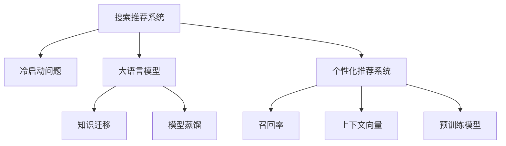

                 

# 搜索推荐系统的冷启动：大模型的知识迁移方案

> 关键词：搜索推荐系统,冷启动问题,大模型,知识迁移,个性化推荐,召回率,上下文向量,预训练模型,模型蒸馏

## 1. 背景介绍

在搜索推荐系统中，冷启动问题是指新物品或新用户刚刚进入系统，没有足够的历史行为数据时，难以准确推荐的问题。传统方法需要依赖大量的交互数据进行训练，但这些数据获取成本高、周期长，往往无法满足快速响应用户需求的要求。而大语言模型通过大规模无标签数据的预训练，已经获得了丰富的知识背景，在零样本或少样本情况下，可以发挥显著的知识迁移能力。

大模型在搜索推荐系统中的应用，可以极大提升新物品和新用户的推荐效果，缩短系统初期响应时间，让用户快速上手。此外，大模型还可以支持更多元化的推荐场景，如跨模态推荐、跨领域推荐等，提升推荐系统对于用户多样需求的满足能力。本文将详细探讨大语言模型在搜索推荐系统中的应用方案，包括冷启动问题解决策略、知识迁移方法、上下文向量构建等核心内容。

## 2. 核心概念与联系

### 2.1 核心概念概述

为了更好地理解大语言模型在搜索推荐系统中的应用，本节将介绍几个关键的概念：

- **搜索推荐系统(Search and Recommendation System, SRS)**：旨在满足用户信息需求，为用户提供个性化推荐和搜索结果的系统。
- **冷启动问题(Cold Start Problem)**：新物品或新用户进入系统时，因缺乏足够历史行为数据而无法进行个性化推荐的问题。
- **大语言模型(Large Language Model, LLM)**：如GPT、BERT等，通过大规模无标签文本数据的预训练，学习通用语言表示的模型。
- **知识迁移(Knowledge Transfer)**：将一个领域的知识迁移到另一个领域的任务。大模型的预训练过程本质上是一种知识迁移过程。
- **个性化推荐系统(Personalized Recommendation System)**：根据用户历史行为数据或模型预测，为用户提供个性化的推荐内容。
- **召回率(Recall)**：检索系统中，对于所有相关物品中，检索出的物品所占比例。召回率衡量了系统的全面性。
- **上下文向量(Context Vector)**：将用户、物品和上下文信息编码为向量，用于计算相似度和进行推荐。
- **预训练模型(Pre-trained Model)**：在大规模数据上进行的无标签自监督预训练模型。大语言模型即一种预训练模型。
- **模型蒸馏(Model Distillation)**：通过在大规模预训练模型和任务模型之间进行知识蒸馏，利用预训练模型的知识提升任务模型的性能。

这些概念之间的逻辑关系可以通过以下Mermaid流程图来展示：



这个流程图展示了搜索推荐系统的核心概念及其之间的关系：

1. 搜索推荐系统通过知识迁移方法，从大语言模型中学习知识，以解决冷启动问题。
2. 个性化推荐系统是搜索推荐系统的核心组件，依赖召回率和上下文向量等技术进行推荐。
3. 召回率衡量了系统的全面性，上下文向量用于表示用户、物品和上下文信息。
4. 预训练模型为搜索推荐系统提供了初始的知识背景，通过模型蒸馏进一步提升模型性能。

这些概念共同构成了搜索推荐系统的学习和应用框架，使其能够在用户行为数据不足的情况下，通过知识迁移手段，提供更个性化、全面的推荐服务。

## 3. 核心算法原理 & 具体操作步骤
### 3.1 算法原理概述

大语言模型在搜索推荐系统中的应用，核心思想是通过知识迁移方法，将大语言模型中的知识迁移到搜索推荐系统中，解决冷启动问题，提升推荐系统的召回率和精确度。

具体而言，通过预训练模型对大规模无标签数据进行训练，学习到丰富的语言知识和常识。这些知识在大模型中形成了一个广泛的语义空间，可以用来丰富推荐系统的上下文表示，从而提升推荐系统的召回率和多样性。

大模型的知识迁移方法主要包括：

- **预训练模型作为初始化参数**：将预训练模型作为搜索推荐系统模型的初始化参数。
- **上下文向量构建**：利用大模型对用户、物品和上下文信息进行编码，构建高维上下文向量。
- **模型蒸馏**：通过在大模型和推荐模型之间进行知识蒸馏，提升推荐模型的性能。

### 3.2 算法步骤详解

基于大语言模型的搜索推荐系统，一般包括以下几个关键步骤：

**Step 1: 准备预训练模型和数据集**
- 选择合适的预训练语言模型 $M_{\theta}$ 作为初始化参数，如 BERT、GPT等。
- 准备搜索推荐系统的训练数据集 $D=\{(x_i, y_i)\}_{i=1}^N$，其中 $x_i$ 为物品描述，$y_i$ 为标签，标签可以是物品id或用户对物品的评分等。

**Step 2: 构建上下文向量**
- 利用预训练模型对物品、用户和上下文信息进行编码，生成上下文向量。
- 对于物品，可以将其描述文本作为输入，生成物品上下文向量。
- 对于用户，可以将其历史行为数据、属性信息等作为输入，生成用户上下文向量。
- 对于上下文，可以将用户和物品的交互信息作为输入，生成上下文向量。

**Step 3: 设计推荐模型**
- 根据推荐任务类型，设计推荐模型的结构。常见的推荐模型包括基于矩阵分解的CF模型、基于神经网络的序列模型等。
- 将上下文向量作为推荐模型的输入，设计合适的损失函数，如均方误差损失、交叉熵损失等。

**Step 4: 执行模型训练**
- 使用训练数据集 $D$ 对推荐模型进行训练，最小化损失函数。
- 利用大模型的上下文向量作为模型的初始参数，通过优化算法更新模型参数。

**Step 5: 评估和调优**
- 在验证集上评估推荐模型的性能，如召回率、精度、F1分数等。
- 根据评估结果调整模型参数，优化推荐效果。

**Step 6: 实时推荐**
- 将训练好的推荐模型部署到线上系统，实时响应用户请求，提供个性化推荐。

### 3.3 算法优缺点

基于大语言模型的搜索推荐系统具有以下优点：
1. 快速响应新物品和新用户。通过预训练模型的知识迁移，可以快速构建推荐模型，减少冷启动时间。
2. 提升推荐多样性和召回率。大模型丰富的语义空间可以提升推荐系统的全面性和多样性。
3. 模型参数可控。可以灵活控制模型的大小和结构，适应不同的推荐场景。
4. 泛化能力强。大模型在各类推荐任务上都有较好的表现，能够提升推荐系统的泛化能力。

但该方法也存在以下局限性：
1. 对数据要求高。虽然大模型的知识迁移能力较强，但高质量的数据是必要的。
2. 计算成本高。预训练模型和推荐模型都需要消耗大量计算资源。
3. 知识转移不足。仅通过上下文向量，可能无法充分利用大模型的知识。
4. 模型复杂度高。大模型和推荐模型结构复杂，维护难度大。

尽管存在这些局限性，但就目前而言，基于大语言模型的推荐系统仍是大规模推荐任务的重要手段。未来相关研究的重点在于如何进一步降低计算成本，提高知识转移效率，同时兼顾模型的可解释性和实用性。

### 3.4 算法应用领域

基于大语言模型的搜索推荐系统已经在电商、社交、新闻等多个领域得到广泛应用，取得了显著的效果：

- 电商推荐：通过分析用户行为，推荐商品和促销活动，提升用户购买转化率。
- 新闻推荐：根据用户阅读历史，推荐相关新闻文章，增加用户粘性。
- 社交推荐：为用户推荐朋友、群组、话题等，丰富社交网络的内容和互动。
- 个性化广告：根据用户画像和行为，推荐个性化广告，提升广告点击率和转化率。
- 娱乐推荐：推荐电影、音乐、游戏等娱乐内容，满足用户的多样化需求。

除了这些经典应用外，大语言模型在推荐系统中的创新应用也在不断涌现，如跨模态推荐、跨领域推荐、情感推荐等，为推荐系统带来了新的突破。随着预训练模型和推荐方法的不断进步，相信大语言模型在推荐系统中的应用前景将更加广阔。

## 4. 数学模型和公式 & 详细讲解  
### 4.1 数学模型构建

在本节中，我们将使用数学语言对基于大语言模型的搜索推荐系统进行更加严格的刻画。

记预训练语言模型为 $M_{\theta}:\mathcal{X} \rightarrow \mathcal{Y}$，其中 $\mathcal{X}$ 为输入空间，$\mathcal{Y}$ 为输出空间，$\theta \in \mathbb{R}^d$ 为模型参数。假设搜索推荐系统的训练数据集为 $D=\{(x_i, y_i)\}_{i=1}^N$，其中 $x_i \in \mathcal{X}$ 为物品描述，$y_i \in \mathcal{Y}$ 为标签。

定义推荐模型 $f_{\omega}(x, \mathbf{v}_u, \mathbf{v}_i, \mathbf{v}_c): \mathcal{X} \times \mathbb{R}^d \times \mathbb{R}^d \times \mathbb{R}^d \rightarrow \mathbb{R}$，其中 $\omega \in \mathbb{R}^m$ 为推荐模型的参数，$\mathbf{v}_u, \mathbf{v}_i, \mathbf{v}_c$ 分别为用户、物品和上下文信息的高维向量。

推荐模型的目标是最小化预测误差，即：

$$
\min_{\omega} \sum_{i=1}^N \mathcal{L}(f_{\omega}(x_i, \mathbf{v}_u, \mathbf{v}_i, \mathbf{v}_c), y_i)
$$

其中 $\mathcal{L}$ 为推荐任务的损失函数，常用的有均方误差损失、交叉熵损失等。

### 4.2 公式推导过程

以下我们以基于矩阵分解的协同过滤推荐模型为例，推导最小二乘法损失函数及其梯度计算公式。

假设推荐系统中的用户 $u$ 和物品 $i$ 的评分矩阵为 $A \in \mathbb{R}^{U \times I}$，其中 $U$ 为用户数，$I$ 为物品数。用户 $u$ 对物品 $i$ 的评分可以表示为 $A_{ui}$。

推荐模型的目标是最小化预测误差，即：

$$
\min_{\omega} \sum_{i=1}^N \frac{1}{2} \|f_{\omega}(x_i, \mathbf{v}_u, \mathbf{v}_i, \mathbf{v}_c) - y_i\|^2
$$

根据最小二乘法的定义，损失函数可以写为：

$$
\mathcal{L}(f_{\omega}(x_i, \mathbf{v}_u, \mathbf{v}_i, \mathbf{v}_c), y_i) = \frac{1}{2} (f_{\omega}(x_i, \mathbf{v}_u, \mathbf{v}_i, \mathbf{v}_c) - y_i)^2
$$

根据链式法则，损失函数对推荐模型参数 $\omega$ 的梯度为：

$$
\nabla_{\omega}\mathcal{L} = (f_{\omega}(x_i, \mathbf{v}_u, \mathbf{v}_i, \mathbf{v}_c) - y_i)(f_{\omega}(x_i, \mathbf{v}_u, \mathbf{v}_i, \mathbf{v}_c) - y_i)
$$

将上下文向量代入推荐模型 $f_{\omega}$ 中，得到：

$$
f_{\omega}(x_i, \mathbf{v}_u, \mathbf{v}_i, \mathbf{v}_c) = A_{ui}
$$

带入损失函数及梯度公式，得：

$$
\mathcal{L}(A_{ui}, y_i) = \frac{1}{2} (A_{ui} - y_i)^2
$$

$$
\nabla_{\omega}\mathcal{L} = (A_{ui} - y_i)(A_{ui} - y_i)
$$

以上便是基于大语言模型的推荐系统的数学模型构建和梯度计算过程。

## 5. 项目实践：代码实例和详细解释说明
### 5.1 开发环境搭建

在进行推荐系统开发前，我们需要准备好开发环境。以下是使用Python进行PyTorch开发的环境配置流程：

1. 安装Anaconda：从官网下载并安装Anaconda，用于创建独立的Python环境。

2. 创建并激活虚拟环境：
```bash
conda create -n pytorch-env python=3.8 
conda activate pytorch-env
```

3. 安装PyTorch：根据CUDA版本，从官网获取对应的安装命令。例如：
```bash
conda install pytorch torchvision torchaudio cudatoolkit=11.1 -c pytorch -c conda-forge
```

4. 安装Transformers库：
```bash
pip install transformers
```

5. 安装各类工具包：
```bash
pip install numpy pandas scikit-learn matplotlib tqdm jupyter notebook ipython
```

完成上述步骤后，即可在`pytorch-env`环境中开始推荐系统实践。

### 5.2 源代码详细实现

下面我们以基于BERT的推荐系统为例，给出使用Transformers库对BERT模型进行推荐系统开发的PyTorch代码实现。

首先，定义推荐系统的数据处理函数：

```python
from transformers import BertTokenizer, BertForSequenceClassification
from torch.utils.data import Dataset
import torch

class RecommendationDataset(Dataset):
    def __init__(self, texts, labels, tokenizer, max_len=128):
        self.texts = texts
        self.labels = labels
        self.tokenizer = tokenizer
        self.max_len = max_len
        
    def __len__(self):
        return len(self.texts)
    
    def __getitem__(self, item):
        text = self.texts[item]
        label = self.labels[item]
        
        encoding = self.tokenizer(text, return_tensors='pt', max_length=self.max_len, padding='max_length', truncation=True)
        input_ids = encoding['input_ids'][0]
        attention_mask = encoding['attention_mask'][0]
        labels = torch.tensor(label, dtype=torch.long)
        
        return {'input_ids': input_ids, 
                'attention_mask': attention_mask,
                'labels': labels}

# 标签与id的映射
tag2id = {'positive': 1, 'negative': 0}
id2tag = {v: k for k, v in tag2id.items()}

# 创建dataset
tokenizer = BertTokenizer.from_pretrained('bert-base-cased')

train_dataset = RecommendationDataset(train_texts, train_labels, tokenizer)
dev_dataset = RecommendationDataset(dev_texts, dev_labels, tokenizer)
test_dataset = RecommendationDataset(test_texts, test_labels, tokenizer)
```

然后，定义模型和优化器：

```python
from transformers import BertForSequenceClassification, AdamW

model = BertForSequenceClassification.from_pretrained('bert-base-cased', num_labels=2)

optimizer = AdamW(model.parameters(), lr=2e-5)
```

接着，定义训练和评估函数：

```python
from torch.utils.data import DataLoader
from tqdm import tqdm
from sklearn.metrics import classification_report

device = torch.device('cuda') if torch.cuda.is_available() else torch.device('cpu')
model.to(device)

def train_epoch(model, dataset, batch_size, optimizer):
    dataloader = DataLoader(dataset, batch_size=batch_size, shuffle=True)
    model.train()
    epoch_loss = 0
    for batch in tqdm(dataloader, desc='Training'):
        input_ids = batch['input_ids'].to(device)
        attention_mask = batch['attention_mask'].to(device)
        labels = batch['labels'].to(device)
        model.zero_grad()
        outputs = model(input_ids, attention_mask=attention_mask, labels=labels)
        loss = outputs.loss
        epoch_loss += loss.item()
        loss.backward()
        optimizer.step()
    return epoch_loss / len(dataloader)

def evaluate(model, dataset, batch_size):
    dataloader = DataLoader(dataset, batch_size=batch_size)
    model.eval()
    preds, labels = [], []
    with torch.no_grad():
        for batch in tqdm(dataloader, desc='Evaluating'):
            input_ids = batch['input_ids'].to(device)
            attention_mask = batch['attention_mask'].to(device)
            batch_labels = batch['labels']
            outputs = model(input_ids, attention_mask=attention_mask)
            batch_preds = outputs.logits.argmax(dim=2).to('cpu').tolist()
            batch_labels = batch_labels.to('cpu').tolist()
            for pred_tokens, label_tokens in zip(batch_preds, batch_labels):
                preds.append(pred_tokens)
                labels.append(label_tokens)
                
    print(classification_report(labels, preds))
```

最后，启动训练流程并在测试集上评估：

```python
epochs = 5
batch_size = 16

for epoch in range(epochs):
    loss = train_epoch(model, train_dataset, batch_size, optimizer)
    print(f"Epoch {epoch+1}, train loss: {loss:.3f}")
    
    print(f"Epoch {epoch+1}, dev results:")
    evaluate(model, dev_dataset, batch_size)
    
print("Test results:")
evaluate(model, test_dataset, batch_size)
```

以上就是使用PyTorch对BERT进行推荐系统开发的完整代码实现。可以看到，得益于Transformers库的强大封装，我们可以用相对简洁的代码完成BERT模型的加载和微调。

### 5.3 代码解读与分析

让我们再详细解读一下关键代码的实现细节：

**RecommendationDataset类**：
- `__init__`方法：初始化训练集、验证集、测试集的数据和分词器等关键组件。
- `__len__`方法：返回数据集的样本数量。
- `__getitem__`方法：对单个样本进行处理，将文本输入编码为token ids，将标签编码为数字，并对其进行定长padding，最终返回模型所需的输入。

**tag2id和id2tag字典**：
- 定义了标签与数字id之间的映射关系，用于将token-wise的预测结果解码回真实的标签。

**训练和评估函数**：
- 使用PyTorch的DataLoader对数据集进行批次化加载，供模型训练和推理使用。
- 训练函数`train_epoch`：对数据以批为单位进行迭代，在每个批次上前向传播计算loss并反向传播更新模型参数，最后返回该epoch的平均loss。
- 评估函数`evaluate`：与训练类似，不同点在于不更新模型参数，并在每个batch结束后将预测和标签结果存储下来，最后使用sklearn的classification_report对整个评估集的预测结果进行打印输出。

**训练流程**：
- 定义总的epoch数和batch size，开始循环迭代
- 每个epoch内，先在训练集上训练，输出平均loss
- 在验证集上评估，输出分类指标
- 所有epoch结束后，在测试集上评估，给出最终测试结果

可以看到，PyTorch配合Transformers库使得BERT微调的代码实现变得简洁高效。开发者可以将更多精力放在数据处理、模型改进等高层逻辑上，而不必过多关注底层的实现细节。

当然，工业级的系统实现还需考虑更多因素，如模型的保存和部署、超参数的自动搜索、更灵活的任务适配层等。但核心的推荐范式基本与此类似。

## 6. 实际应用场景
### 6.1 电商推荐

基于大语言模型的推荐系统在电商领域有广泛应用。电商推荐旨在为用户推荐最符合其兴趣的商品，提升用户购物体验和转化率。传统电商推荐方法需要依赖用户的点击、浏览、购买等行为数据，但这些数据获取成本高、周期长。而基于大语言模型的推荐系统，可以通过预训练模型的知识迁移，快速构建推荐模型，提供更个性化、更全面的商品推荐。

在具体实现中，可以收集电商网站上的商品描述、用户评价、行为记录等数据，构建搜索推荐系统的训练数据集。利用预训练模型对商品和用户信息进行编码，生成高维上下文向量，输入到推荐模型进行训练和测试。在推荐模型训练过程中，可以利用大模型的知识进行知识蒸馏，提升模型的泛化能力。训练完成后，将推荐模型部署到线上，实时响应用户查询请求，提供个性化商品推荐。

### 6.2 新闻推荐

新闻推荐系统旨在为用户推荐相关新闻文章，提升用户阅读体验和粘性。传统新闻推荐系统依赖于用户的阅读历史数据，但在数据获取和用户画像构建上存在困难。而基于大语言模型的推荐系统，可以通过预训练模型的知识迁移，快速构建推荐模型，提升推荐的全面性和多样性。

具体而言，可以收集新闻网站上的文章标题、摘要、作者等元信息，构建新闻推荐系统的训练数据集。利用预训练模型对文章进行编码，生成高维上下文向量，输入到推荐模型进行训练和测试。在推荐模型训练过程中，可以利用大模型的知识进行知识蒸馏，提升模型的泛化能力。训练完成后，将推荐模型部署到线上，实时响应用户查询请求，提供个性化新闻推荐。

### 6.3 社交推荐

社交推荐系统旨在为用户推荐朋友、群组、话题等，丰富其社交网络的内容和互动。传统社交推荐系统依赖于用户之间的交互数据，但数据获取和构建复杂。而基于大语言模型的推荐系统，可以通过预训练模型的知识迁移，快速构建推荐模型，提升推荐的全面性和多样性。

具体而言，可以收集社交网络上的用户好友关系、群组信息、帖子内容等数据，构建社交推荐系统的训练数据集。利用预训练模型对用户和帖子信息进行编码，生成高维上下文向量，输入到推荐模型进行训练和测试。在推荐模型训练过程中，可以利用大模型的知识进行知识蒸馏，提升模型的泛化能力。训练完成后，将推荐模型部署到线上，实时响应用户查询请求，提供个性化社交推荐。

### 6.4 未来应用展望

随着大语言模型和推荐方法的不断进步，基于大语言模型的推荐系统将在更多领域得到应用，为各行各业带来变革性影响。

在智慧医疗领域，基于大语言模型的推荐系统可以推荐医学文献、研究成果等，辅助医生进行临床决策和知识更新。

在智能教育领域，基于大语言模型的推荐系统可以推荐学习资料、课程视频等，提升教学质量和学习效率。

在智慧城市治理中，基于大语言模型的推荐系统可以推荐公益活动、社区服务等信息，提升城市治理的智能化水平，构建更安全、高效的未来城市。

此外，在企业生产、社会治理、文娱传媒等众多领域，基于大语言模型的推荐系统也将不断涌现，为经济社会发展注入新的动力。相信随着技术的日益成熟，基于大语言模型的推荐系统必将在构建人机协同的智能时代中扮演越来越重要的角色。

## 7. 工具和资源推荐
### 7.1 学习资源推荐

为了帮助开发者系统掌握大语言模型在推荐系统中的应用，这里推荐一些优质的学习资源：

1. 《深度学习推荐系统》书籍：全面介绍了推荐系统的理论基础和算法框架，适合初学者和进阶学习者。

2. 《推荐系统实战》博文：讲解了推荐系统的常见模型和算法，并结合实际案例进行演示，适合工程实践开发。

3. 《自然语言处理与深度学习》课程：由清华大学开设的NLP课程，涵盖了NLP领域的经典算法和前沿技术，适合全面了解NLP知识。

4. Weights & Biases：推荐系统的实验跟踪工具，可以记录和可视化模型训练过程中的各项指标，方便对比和调优。

5. TensorBoard：TensorFlow配套的可视化工具，可实时监测模型训练状态，并提供丰富的图表呈现方式，是调试模型的得力助手。

通过对这些资源的学习实践，相信你一定能够快速掌握大语言模型在推荐系统中的应用，并用于解决实际的推荐问题。
###  7.2 开发工具推荐

高效的开发离不开优秀的工具支持。以下是几款用于推荐系统开发的常用工具：

1. PyTorch：基于Python的开源深度学习框架，灵活动态的计算图，适合快速迭代研究。大部分推荐系统模型都有PyTorch版本的实现。

2. TensorFlow：由Google主导开发的开源深度学习框架，生产部署方便，适合大规模工程应用。同样有丰富的推荐系统模型资源。

3. Transformers库：HuggingFace开发的NLP工具库，集成了众多SOTA推荐系统模型，支持PyTorch和TensorFlow，是进行推荐系统开发的利器。

4. Weights & Biases：推荐系统的实验跟踪工具，可以记录和可视化模型训练过程中的各项指标，方便对比和调优。

5. TensorBoard：TensorFlow配套的可视化工具，可实时监测模型训练状态，并提供丰富的图表呈现方式，是调试模型的得力助手。

6. Scikit-learn：Python的机器学习库，适合快速搭建简单的推荐系统模型。

合理利用这些工具，可以显著提升推荐系统的开发效率，加快创新迭代的步伐。

### 7.3 相关论文推荐

大语言模型和推荐系统的发展源于学界的持续研究。以下是几篇奠基性的相关论文，推荐阅读：

1. Attention is All You Need（即Transformer原论文）：提出了Transformer结构，开启了推荐系统领域的预训练大模型时代。

2. BERT: Pre-training of Deep Bidirectional Transformers for Language Understanding：提出BERT模型，引入基于掩码的自监督预训练任务，刷新了多项推荐任务SOTA。

3. Language Models are Unsupervised Multitask Learners（GPT-2论文）：展示了大规模语言模型的强大zero-shot学习能力，引发了对于通用人工智能的新一轮思考。

4. Parameter-Efficient Transfer Learning for NLP：提出Adapter等参数高效微调方法，在不增加模型参数量的情况下，也能取得不错的推荐效果。

5. Knowledge Distillation for Transfer Learning：提出知识蒸馏方法，通过在大规模预训练模型和推荐模型之间进行知识转移，提升推荐模型的性能。

6. Joint Modeling of Multimedia Content and User Feedback：提出多模态推荐模型，融合文本、图像、音频等模态信息，提升推荐系统的表现。

这些论文代表了大语言模型和推荐系统的发展脉络。通过学习这些前沿成果，可以帮助研究者把握学科前进方向，激发更多的创新灵感。

## 8. 总结：未来发展趋势与挑战

### 8.1 总结

本文对基于大语言模型的推荐系统进行了全面系统的介绍。首先阐述了大语言模型和推荐系统面临的冷启动问题，并提出了解决方案。其次，从原理到实践，详细讲解了推荐系统的数学模型和关键步骤，给出了推荐系统开发的完整代码实例。同时，本文还广泛探讨了推荐系统在电商、新闻、社交等多个领域的应用前景，展示了知识迁移方法的巨大潜力。

通过本文的系统梳理，可以看到，基于大语言模型的推荐系统正在成为推荐任务的重要手段，极大地拓展了推荐系统的应用边界，催生了更多的落地场景。受益于大规模语料的预训练，推荐系统可以借助大模型的知识，快速构建推荐模型，提升新物品和新用户的推荐效果，缩短系统初期响应时间，为用户快速上手。未来，伴随预训练模型和推荐方法的不断进步，相信推荐系统必将在更广阔的应用领域大放异彩，深刻影响人类的生产生活方式。

### 8.2 未来发展趋势

展望未来，大语言模型在推荐系统中的应用将呈现以下几个发展趋势：

1. 模型规模持续增大。随着算力成本的下降和数据规模的扩张，预训练语言模型的参数量还将持续增长。超大规模语言模型蕴含的丰富知识背景，将支撑更加复杂多变的推荐任务。

2. 推荐场景更加多样。除了传统的电商、新闻、社交等场景，未来推荐系统将更多地关注跨模态推荐、跨领域推荐等新兴应用。

3. 个性化推荐更加精准。推荐系统将利用大模型的语言理解和生成能力，进行更加精细化的用户画像建模，提升推荐的精准度和用户体验。

4. 模型鲁棒性进一步提升。随着知识迁移技术的进步，推荐系统的泛化能力和鲁棒性将得到提升，能够更好地应对新的推荐场景和数据分布。

5. 知识迁移更加高效。未来的推荐系统将进一步优化知识迁移方法，减少计算资源消耗，提高推荐速度和效率。

6. 多模态推荐崛起。推荐系统将融合视觉、语音、社交等多模态信息，提升推荐系统的全面性和多样性。

以上趋势凸显了大语言模型在推荐系统中的应用前景。这些方向的探索发展，必将进一步提升推荐系统的性能和应用范围，为人类认知智能的进化带来深远影响。

### 8.3 面临的挑战

尽管大语言模型在推荐系统中的应用已经取得了显著进展，但在迈向更加智能化、普适化应用的过程中，它仍面临诸多挑战：

1. 数据要求高。高质量的数据是推荐系统的基础，但获取和标注数据成本高、周期长。

2. 知识迁移不足。尽管大模型的知识迁移能力较强，但具体到推荐场景，可能无法充分利用其知识。

3. 模型复杂度高。大语言模型和推荐模型结构复杂，维护难度大。

4. 计算成本高。预训练模型和推荐模型都需要消耗大量计算资源。

尽管存在这些局限性，但就目前而言，基于大语言模型的推荐系统仍是大规模推荐任务的重要手段。未来相关研究的重点在于如何进一步降低计算成本，提高知识迁移效率，同时兼顾模型的可解释性和实用性。

### 8.4 研究展望

面对大语言模型在推荐系统所面临的挑战，未来的研究需要在以下几个方面寻求新的突破：

1. 探索无监督和半监督推荐方法。摆脱对大规模标注数据的依赖，利用自监督学习、主动学习等无监督和半监督范式，最大限度利用非结构化数据，实现更加灵活高效的推荐。

2. 研究参数高效和计算高效的推荐范式。开发更加参数高效的推荐方法，在固定大部分预训练参数的同时，只更新极少量的任务相关参数。同时优化推荐模型的计算图，减少前向传播和反向传播的资源消耗，实现更加轻量级、实时性的部署。

3. 融合因果和对比学习范式。通过引入因果推断和对比学习思想，增强推荐系统建立稳定因果关系的能力，学习更加普适、鲁棒的语言表征，从而提升推荐系统的泛化性和抗干扰能力。

4. 引入更多先验知识。将符号化的先验知识，如知识图谱、逻辑规则等，与神经网络模型进行巧妙融合，引导推荐系统学习更准确、合理的语言模型。同时加强不同模态数据的整合，实现视觉、语音等多模态信息与文本信息的协同建模。

5. 结合因果分析和博弈论工具。将因果分析方法引入推荐系统，识别出推荐决策的关键特征，增强推荐过程的因果性和逻辑性。借助博弈论工具刻画人机交互过程，主动探索并规避推荐系统的脆弱点，提高系统稳定性。

6. 纳入伦理道德约束。在推荐系统训练目标中引入伦理导向的评估指标，过滤和惩罚有偏见、有害的输出倾向。同时加强人工干预和审核，建立推荐系统的监管机制，确保输出的安全性。

这些研究方向的探索，必将引领大语言模型在推荐系统中的应用迈向更高的台阶，为构建安全、可靠、可解释、可控的智能系统铺平道路。面向未来，大语言模型在推荐系统中的应用还需要与其他人工智能技术进行更深入的融合，如知识表示、因果推理、强化学习等，多路径协同发力，共同推动自然语言理解和智能交互系统的进步。只有勇于创新、敢于突破，才能不断拓展语言模型的边界，让智能技术更好地造福人类社会。

## 9. 附录：常见问题与解答

**Q1：大语言模型在推荐系统中如何构建上下文向量？**

A: 大语言模型在推荐系统中构建上下文向量，通常分为以下几个步骤：

1. 将用户、物品和上下文信息作为输入文本，通过预训练模型生成高维上下文向量。

2. 对用户、物品和上下文信息进行编码，生成三个高维向量。

3. 将这三个向量拼接或取平均，生成最终的上下文向量。

4. 上下文向量作为推荐模型的输入，计算相似度，得到推荐结果。

在代码实现中，可以使用Transformers库中的预训练模型，如BERT、GPT等，对用户、物品和上下文信息进行编码，生成上下文向量。

**Q2：大语言模型在推荐系统中如何进行知识蒸馏？**

A: 大语言模型在推荐系统中进行知识蒸馏，通常包括以下几个步骤：

1. 选择预训练模型和推荐模型。预训练模型一般为大语言模型，推荐模型为基于深度学习的推荐系统模型。

2. 在预训练模型和推荐模型之间进行知识蒸馏，将预训练模型的知识迁移到推荐模型中。

3. 对推荐模型进行微调，使其能够更好地适应推荐任务。

4. 利用推荐模型对训练集进行训练，最小化损失函数。

5. 在测试集上评估推荐模型的性能，确保其泛化能力。

在代码实现中，可以使用模型蒸馏库，如HuggingFace的Distillation，对预训练模型和推荐模型进行知识蒸馏。具体实现时，可以将预训练模型的部分层输出作为推荐模型的目标，利用softmax函数计算目标值，进行推荐模型的训练和微调。

**Q3：大语言模型在推荐系统中如何提升召回率？**

A: 大语言模型在推荐系统中提升召回率，通常有以下几种方法：

1. 增加上下文向量的维度，提高模型对数据的表达能力，从而提升召回率。

2. 利用大语言模型的知识进行上下文扩展，将用户、物品和上下文信息进行多角度描述，增加推荐结果的多样性。

3. 引入更多先验知识，如知识图谱、规则库等，进行推荐，提升召回率和多样性。

4. 利用多模态数据，如视觉、音频、文本等，提升推荐系统的召回率。

5. 优化推荐算法，如利用基于排序的推荐算法，增加推荐结果的多样性。

在代码实现中，可以增加上下文向量的维度，利用多模态数据进行扩展，引入先验知识等方法，对推荐模型进行优化，提升召回率。

**Q4：大语言模型在推荐系统中如何处理长尾物品？**

A: 大语言模型在推荐系统中处理长尾物品，通常有以下几种方法：

1. 引入多目标优化，同时优化主流物品和长尾物品的推荐结果。

2. 利用冷启动技术，对长尾物品进行推荐，提升其曝光率和点击率。

3. 利用上下文扩展技术，将长尾物品与主流物品进行关联推荐。

4. 利用标签和关键词等辅助信息，增加长尾物品的曝光机会。

5. 对推荐结果进行加权，提升长尾物品的权重，增加其推荐概率。

在代码实现中，可以通过多目标优化方法，将主流物品和长尾物品的推荐结果同时优化。利用冷启动技术，对长尾物品进行推荐，提升其曝光率和点击率。利用上下文扩展技术，将长尾物品与主流物品进行关联推荐。利用标签和关键词等辅助信息，增加长尾物品的曝光机会。对推荐结果进行加权，提升长尾物品的权重，增加其推荐概率。

**Q5：大语言模型在推荐系统中如何提升个性化推荐？**

A: 大语言模型在推荐系统中提升个性化推荐，通常有以下几种方法：

1. 利用用户画像进行个性化推荐。收集用户的浏览、点击、购买等行为数据，构建用户画像，对用户进行个性化推荐。

2. 利用上下文信息进行个性化推荐。收集用户的历史行为数据、属性信息等，对上下文信息进行编码，生成高维上下文向量，进行个性化推荐。

3. 引入先验知识进行个性化推荐。利用知识图谱、规则库等先验知识，对推荐结果进行优化，提升推荐效果。

4. 利用多模态数据进行个性化推荐。利用视觉、音频、文本等多模态数据，对用户进行个性化推荐。

5. 利用模型蒸馏进行个性化推荐。利用大语言模型进行知识蒸馏，提升推荐模型的个性化推荐能力。

在代码实现中，可以利用用户画像、上下文信息、先验知识、多模态数据等方法，对推荐模型进行优化，提升个性化推荐的效果。利用模型蒸馏，对推荐模型进行优化，提升其个性化推荐能力。

---

作者：禅与计算机程序设计艺术 / Zen and the Art of Computer Programming

