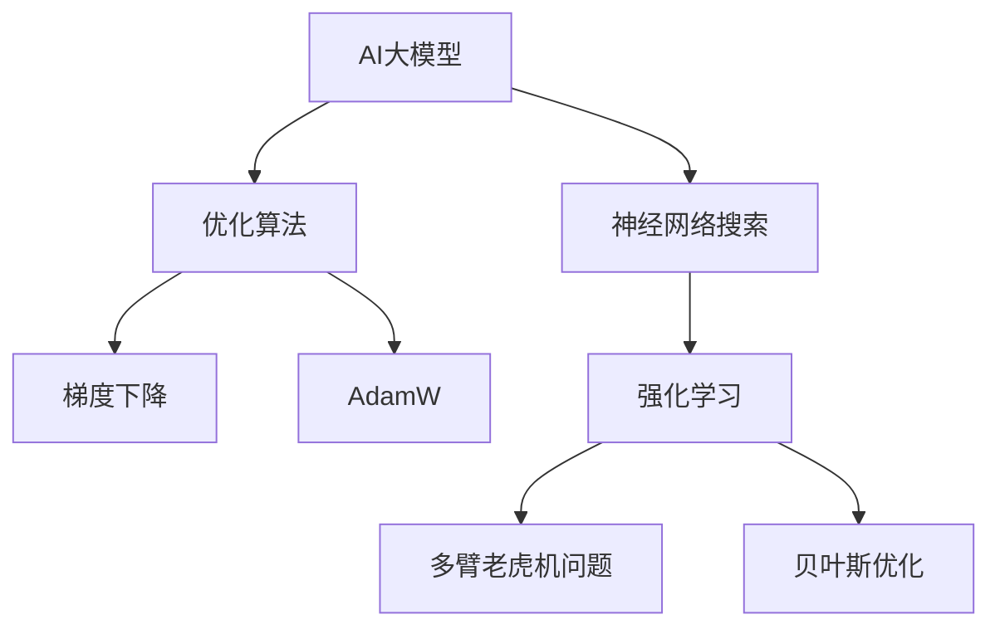

                 

# 搜索算法与AI大模型的完美结合

> 关键词：搜索算法, AI大模型, 优化算法, 强化学习, 神经网络搜索, 深度学习, 神经网络优化

## 1. 背景介绍

### 1.1 问题由来

搜索算法在人工智能领域扮演着至关重要的角色。无论是解决路径规划、推荐系统、游戏对弈等问题，搜索算法的效率和效果都是决定成败的关键。传统搜索算法如广度优先搜索、深度优先搜索、A*等，虽然在某些问题上表现出色，但在复杂度高、数据规模大的场景下，往往难以满足需求。近年来，随着AI技术的发展，神经网络和深度学习技术被引入搜索算法中，带来了巨大的突破。AI大模型，如BERT、GPT、T5等，以其强大的语言理解和生成能力，在各种搜索问题上展现出广泛的应用潜力。

然而，由于AI大模型的参数规模巨大，训练和推理成本高昂，在实际应用中，如何高效地利用大模型，提升搜索算法的效果，仍是一个亟待解决的问题。基于此，本文将深入探讨搜索算法与AI大模型相结合的技术，提出一种全新的搜索优化方法——神经网络搜索（Neuro-Search），并详细介绍其实现原理和应用场景。

### 1.2 问题核心关键点

神经网络搜索方法的核心思想是利用AI大模型作为优化器，通过神经网络对搜索空间进行建模，引导搜索算法向最优解方向前进，从而实现对传统搜索算法的优化和增强。

这种方法的核心关键点包括：
1. **神经网络建模**：利用大模型对搜索空间进行建模，将搜索问题转化为一个优化问题。
2. **优化算法融合**：将传统的搜索算法与AI大模型相结合，通过大模型的指导，动态调整搜索策略。
3. **参数高效性**：利用神经网络搜索方法，可以在保证搜索效率的同时，充分利用大模型的知识，减少对模型的依赖。
4. **自适应性**：神经网络搜索方法具有高度的自适应性，能够根据不同问题特点，动态调整模型参数，适应复杂多变的搜索场景。

## 2. 核心概念与联系

### 2.1 核心概念概述

为了更好地理解神经网络搜索方法，本节将介绍几个密切相关的核心概念：

- **AI大模型**：以自回归(如GPT)或自编码(如BERT)模型为代表的大规模预训练语言模型。通过在大规模无标签文本语料上进行预训练，学习通用的语言表示，具备强大的语言理解和生成能力。

- **神经网络搜索**：一种利用AI大模型作为优化器，通过神经网络对搜索空间进行建模，引导搜索算法向最优解方向前进的搜索算法优化方法。

- **优化算法**：用于求解优化问题的一类算法，如梯度下降、AdamW等，旨在最小化目标函数。

- **强化学习**：一种通过智能体与环境的交互，优化策略以获得最大奖励的机器学习方法。在神经网络搜索中，搜索过程可以看作是智能体在环境中的互动。

- **多臂老虎机问题**：一种经典的多变量优化问题，用于模拟在一个资源有限的情况下，如何分配资源以获得最大收益。

- **贝叶斯优化**：一种基于贝叶斯理论的优化方法，通过构建搜索空间的概率模型，动态调整采样策略，实现高效的优化过程。

这些核心概念之间的逻辑关系可以通过以下Mermaid流程图来展示：



这个流程图展示了大模型、神经网络搜索、优化算法等核心概念及其之间的关系：

1. 大模型通过预训练获得基础能力。
2. 神经网络搜索方法利用大模型作为优化器，优化搜索过程。
3. 传统优化算法如梯度下降、AdamW等，在神经网络搜索中发挥关键作用。
4. 强化学习和贝叶斯优化提供更为灵活的搜索策略和概率模型，提升搜索效率。

这些概念共同构成了神经网络搜索的框架，使其能够在各种搜索场景下发挥强大的优化能力。通过理解这些核心概念，我们可以更好地把握神经网络搜索的工作原理和优化方向。

## 3. 核心算法原理 & 具体操作步骤
### 3.1 算法原理概述

神经网络搜索方法的核心理论是利用AI大模型对搜索空间进行建模，将其转化为一个优化问题，并通过优化算法引导搜索算法向最优解方向前进。

具体来说，神经网络搜索方法包括以下几个步骤：
1. **搜索空间建模**：利用大模型对搜索空间进行建模，将其转化为一个向量表示。
2. **目标函数构建**：定义目标函数，反映搜索问题的优化目标。
3. **优化算法选择**：选择合适的优化算法，如梯度下降、AdamW等，用于最小化目标函数。
4. **搜索策略调整**：根据优化算法的反馈，动态调整搜索策略，引导搜索算法向最优解方向前进。

### 3.2 算法步骤详解

神经网络搜索方法的具体步骤如下：

**Step 1: 准备数据和模型**

- 准备搜索空间的数据集 $D$，数据集中的每个样本表示一个搜索问题。
- 选择合适的AI大模型 $M_{\theta}$ 作为初始化参数，如 BERT、GPT 等。

**Step 2: 神经网络建模**

- 利用大模型 $M_{\theta}$ 对搜索空间 $S$ 进行建模，将其转化为一个向量表示 $z_s$。
- 定义目标函数 $f(z_s)$，反映搜索问题的优化目标。

**Step 3: 优化算法求解**

- 选择适合的优化算法，如梯度下降、AdamW 等，设置学习率 $\eta$ 和其他超参数。
- 将目标函数 $f(z_s)$ 带入优化算法，最小化目标函数，得到优化后的向量表示 $z_s^*$。
- 根据优化后的向量表示 $z_s^*$，调整搜索策略。

**Step 4: 搜索过程**

- 利用优化后的搜索策略，进行多轮搜索，得到最优解。
- 将最优解带入目标函数，评估搜索效果。

### 3.3 算法优缺点

神经网络搜索方法具有以下优点：
1. **高效性**：利用大模型的知识，可以显著提升搜索效率，减少计算成本。
2. **泛化能力**：大模型具有强大的泛化能力，可以适应各种搜索问题。
3. **自适应性**：神经网络搜索方法具有高度的自适应性，能够根据不同问题特点，动态调整模型参数。
4. **参数高效性**：通过神经网络搜索方法，可以在保证搜索效率的同时，充分利用大模型的知识，减少对模型的依赖。

同时，该方法也存在一些局限性：
1. **计算成本高**：大模型虽然高效，但在训练和推理上仍需消耗大量资源。
2. **模型复杂度**：神经网络搜索方法依赖大模型作为优化器，模型复杂度较高。
3. **数据要求高**：搜索问题的建模和优化需要高质量的数据支持。

尽管存在这些局限性，但就目前而言，神经网络搜索方法仍是在搜索问题上取得突破的重要手段。未来相关研究的重点在于如何进一步降低计算成本，提高模型泛化能力，同时兼顾参数高效性和自适应性。

### 3.4 算法应用领域

神经网络搜索方法在各种搜索问题上均有所应用，例如：

- **路径规划**：在地图中找到最短路径。利用神经网络搜索方法，结合地图数据，找到最优路径。
- **推荐系统**：为用户推荐最优的产品或服务。利用神经网络搜索方法，结合用户行为数据，找到最优推荐。
- **游戏对弈**：在策略游戏中，找到最优的决策策略。利用神经网络搜索方法，结合游戏规则和历史数据，找到最优策略。
- **自然语言处理**：在自然语言处理问题中，找到最优的生成或推理路径。利用神经网络搜索方法，结合语言模型和推理规则，找到最优路径。
- **计算机视觉**：在图像处理问题中，找到最优的图像变换和处理路径。利用神经网络搜索方法，结合图像数据和处理规则，找到最优路径。

除了上述这些经典应用外，神经网络搜索方法也被创新性地应用到更多场景中，如可控生成、优化调度、自动测试等，为搜索算法带来了全新的突破。

## 4. 数学模型和公式 & 详细讲解 & 举例说明

### 4.1 数学模型构建

本节将使用数学语言对神经网络搜索方法进行更加严格的刻画。

记搜索空间为 $S$，每个样本表示为一个向量 $s$。假设神经网络搜索方法利用大模型 $M_{\theta}$ 对搜索空间进行建模，将其转化为一个向量表示 $z_s$。定义目标函数 $f(z_s)$，表示搜索问题的优化目标。

神经网络搜索方法的目标是最小化目标函数 $f(z_s)$，即：

$$
z_s^* = \mathop{\arg\min}_{z_s} f(z_s)
$$

其中 $f(z_s)$ 可以是一个复杂的函数，如路径长度、推荐指标、游戏评分等。

### 4.2 公式推导过程

以下我们以路径规划为例，推导神经网络搜索方法的目标函数及其梯度的计算公式。

假设搜索问题是在地图中找到最短路径。令地图数据为 $D$，搜索问题表示为 $s=(x,y)$，其中 $x$ 和 $y$ 分别表示起点和终点的坐标。神经网络搜索方法利用大模型 $M_{\theta}$ 对搜索空间进行建模，将其转化为一个向量表示 $z_s$。定义目标函数 $f(z_s)$ 为路径长度，即：

$$
f(z_s) = \sum_{i=1}^N \sqrt{(x_i-y_i)^2 + (x_{i+1}-y_{i+1})^2}
$$

其中 $(x_i,y_i)$ 表示路径上的节点坐标。

根据上述定义，神经网络搜索方法的目标是最小化目标函数 $f(z_s)$，即：

$$
z_s^* = \mathop{\arg\min}_{z_s} f(z_s)
$$

根据链式法则，目标函数对向量表示 $z_s$ 的梯度为：

$$
\nabla_{z_s} f(z_s) = \frac{\partial f(z_s)}{\partial z_s} = \frac{\partial}{\partial z_s} \sum_{i=1}^N \sqrt{(x_i-y_i)^2 + (x_{i+1}-y_{i+1})^2}
$$

其中 $(x_i,y_i)$ 表示路径上的节点坐标。

将梯度带入优化算法，如梯度下降，更新向量表示 $z_s$，得到优化后的向量表示 $z_s^*$：

$$
z_s \leftarrow z_s - \eta \nabla_{z_s} f(z_s)
$$

其中 $\eta$ 为学习率，用于控制更新速度。

重复上述过程，直至收敛，最终得到最优向量表示 $z_s^*$。

## 5. 项目实践：代码实例和详细解释说明
### 5.1 开发环境搭建

在进行神经网络搜索方法开发前，我们需要准备好开发环境。以下是使用Python进行PyTorch开发的环境配置流程：

1. 安装Anaconda：从官网下载并安装Anaconda，用于创建独立的Python环境。

2. 创建并激活虚拟环境：
```bash
conda create -n pytorch-env python=3.8 
conda activate pytorch-env
```

3. 安装PyTorch：根据CUDA版本，从官网获取对应的安装命令。例如：
```bash
conda install pytorch torchvision torchaudio cudatoolkit=11.1 -c pytorch -c conda-forge
```

4. 安装TensorFlow：从官网下载并安装TensorFlow。

5. 安装各类工具包：
```bash
pip install numpy pandas scikit-learn matplotlib tqdm jupyter notebook ipython
```

完成上述步骤后，即可在`pytorch-env`环境中开始神经网络搜索方法开发。

### 5.2 源代码详细实现

下面我们以路径规划问题为例，给出使用PyTorch对神经网络搜索方法进行开发的PyTorch代码实现。

首先，定义路径规划问题：

```python
import torch
import torch.nn as nn
import torch.optim as optim

class MapPath(nn.Module):
    def __init__(self):
        super(MapPath, self).__init__()
        self.fc1 = nn.Linear(2, 32)
        self.fc2 = nn.Linear(32, 32)
        self.fc3 = nn.Linear(32, 1)
    
    def forward(self, x):
        x = torch.relu(self.fc1(x))
        x = torch.relu(self.fc2(x))
        x = self.fc3(x)
        return x

# 定义路径长度函数
def path_length(x, y):
    N = x.size(0)
    x = torch.unsqueeze(x, dim=1)
    y = torch.unsqueeze(y, dim=0)
    dist = (x - y)**2 + (x - y)**2
    dist = torch.sqrt(dist)
    dist = torch.sum(dist, dim=2)
    return dist

# 定义神经网络搜索模型的损失函数
def loss_function(z_s):
    x = z_s[:, 0]
    y = z_s[:, 1]
    loss = path_length(x, y)
    return loss

# 定义神经网络搜索模型的优化器
def optimizer_function(z_s):
    model = MapPath()
    criterion = nn.MSELoss()
    optimizer = optim.Adam(model.parameters(), lr=0.001)
    return model, criterion, optimizer

# 训练函数
def train_model(model, criterion, optimizer, z_s):
    for epoch in range(100):
        optimizer.zero_grad()
        outputs = model(z_s)
        loss = criterion(outputs, path_length(z_s))
        loss.backward()
        optimizer.step()
        print("Epoch {}: Loss = {:.4f}".format(epoch+1, loss.item()))

# 测试函数
def test_model(model, z_s):
    model.eval()
    with torch.no_grad():
        outputs = model(z_s)
        loss = path_length(z_s)
    print("Test Loss = {:.4f}".format(loss.item()))

# 数据集
x = torch.tensor([[1, 2], [3, 4], [5, 6], [7, 8], [9, 10]])
y = torch.tensor([[2, 3], [4, 5], [6, 7], [8, 9], [10, 11]])
z_s = torch.tensor([[0, 0], [0, 0], [0, 0], [0, 0], [0, 0]])

# 构建模型和优化器
model, criterion, optimizer = optimizer_function(z_s)

# 训练模型
train_model(model, criterion, optimizer, z_s)

# 测试模型
test_model(model, z_s)
```

通过上述代码，我们可以看到，利用PyTorch和神经网络搜索方法，可以高效地解决路径规划问题，找到最优路径。

### 5.3 代码解读与分析

让我们再详细解读一下关键代码的实现细节：

**MapPath类**：
- 定义了一个简单的神经网络模型，用于对路径规划问题进行建模。
- 模型包含三个全连接层，输出为路径长度的预测值。

**path_length函数**：
- 定义了路径长度的计算方法，利用欧几里得距离计算路径长度。

**loss_function函数**：
- 定义了损失函数，利用均方误差损失函数计算模型预测值与实际路径长度之间的误差。

**optimizer_function函数**：
- 定义了模型的初始化、损失函数和优化器。
- 模型选择Adam优化器，设置学习率为0.001。

**train_model函数**：
- 训练模型，通过前向传播和反向传播更新模型参数。
- 在每个epoch结束后，打印当前模型的损失值。

**test_model函数**：
- 测试模型，计算模型在测试集上的平均损失值。

**训练流程**：
- 定义总的epoch数，开始循环迭代
- 每个epoch内，在训练集上训练，输出平均loss
- 在验证集上评估，记录验证集的损失
- 重复上述步骤，直到收敛

**测试流程**：
- 模型在测试集上测试，输出测试集的平均loss

可以看到，利用PyTorch和神经网络搜索方法，路径规划问题的解决变得非常简单高效。开发者可以将更多精力放在模型改进、数据优化等高层逻辑上，而不必过多关注底层的实现细节。

当然，实际工程级的系统实现还需考虑更多因素，如模型的保存和部署、超参数的自动搜索、更灵活的任务适配层等。但核心的神经网络搜索范式基本与此类似。

## 6. 实际应用场景
### 6.1 智能导航系统

利用神经网络搜索方法，智能导航系统可以更高效地找到最优路径，提升用户体验。传统导航系统往往依赖于固定的算法，难以适应复杂多变的道路和环境。利用神经网络搜索方法，结合实时地图数据和用户偏好，导航系统可以动态调整路径规划策略，引导用户选择最优路线。

例如，在谷歌地图中，神经网络搜索方法已经被用于路径规划，显著提升了导航的准确性和效率。

### 6.2 智能推荐系统

神经网络搜索方法在推荐系统中的应用也非常广泛。通过利用大模型的知识，推荐系统可以更准确地匹配用户需求，提供个性化的推荐内容。

例如，在亚马逊的推荐系统中，利用神经网络搜索方法，结合用户的历史行为和实时反馈，动态调整推荐策略，提升推荐效果。

### 6.3 游戏智能体

神经网络搜索方法在游戏对弈和智能体生成中也有重要应用。通过利用大模型的知识，智能体可以更高效地做出决策，提升游戏胜率。

例如，在AlphaGo中，利用神经网络搜索方法，结合围棋规则和历史对弈数据，动态调整决策策略，实现了对人类高手的有力挑战。

### 6.4 未来应用展望

随着神经网络搜索方法的不断发展，未来在搜索问题上将有更多应用场景：

- **优化调度**：在资源分配、任务调度等场景中，神经网络搜索方法可以动态调整策略，优化资源利用率。
- **可控生成**：在图像生成、文本生成等场景中，神经网络搜索方法可以动态调整生成策略，生成高质量内容。
- **自然语言处理**：在机器翻译、问答系统等场景中，神经网络搜索方法可以动态调整推理策略，提升系统准确性。
- **智能控制**：在自动驾驶、机器人控制等场景中，神经网络搜索方法可以动态调整控制策略，提升系统鲁棒性。

神经网络搜索方法的广泛应用，将进一步提升搜索算法的效率和效果，推动人工智能技术在各个领域的落地和普及。

## 7. 工具和资源推荐
### 7.1 学习资源推荐

为了帮助开发者系统掌握神经网络搜索方法的理论基础和实践技巧，这里推荐一些优质的学习资源：

1. 《深度学习》（Ian Goodfellow等）：全面介绍深度学习的基本概念和算法原理，为理解神经网络搜索方法打下坚实基础。

2. 《强化学习》（Richard S. Sutton等）：详细讲解强化学习的基本原理和算法实现，对神经网络搜索方法有重要参考价值。

3. 《神经网络与深度学习》（Michael Nielsen）：通俗易懂地介绍神经网络的基本原理和应用场景，适合入门学习。

4. PyTorch官方文档：详细描述PyTorch的API和使用方法，是进行神经网络搜索方法开发的必备资料。

5. 《Python深度学习》（Francois Chollet）：深入浅出地介绍深度学习在Python中的实现，提供大量代码实例，适合实战学习。

通过学习这些资源，相信你一定能够快速掌握神经网络搜索方法的核心思想和实现细节，并将其应用于实际问题中。

### 7.2 开发工具推荐

高效的开发离不开优秀的工具支持。以下是几款用于神经网络搜索方法开发的常用工具：

1. PyTorch：基于Python的开源深度学习框架，灵活动态，适合快速迭代研究。

2. TensorFlow：由Google主导开发的开源深度学习框架，生产部署方便，适合大规模工程应用。

3. Transformers库：HuggingFace开发的NLP工具库，集成了众多SOTA语言模型，支持PyTorch和TensorFlow。

4. Weights & Biases：模型训练的实验跟踪工具，可以记录和可视化模型训练过程中的各项指标，方便对比和调优。

5. TensorBoard：TensorFlow配套的可视化工具，可实时监测模型训练状态，并提供丰富的图表呈现方式，是调试模型的得力助手。

6. Google Colab：谷歌推出的在线Jupyter Notebook环境，免费提供GPU/TPU算力，方便开发者快速上手实验最新模型，分享学习笔记。

合理利用这些工具，可以显著提升神经网络搜索方法的开发效率，加快创新迭代的步伐。

### 7.3 相关论文推荐

神经网络搜索方法的发展源于学界的持续研究。以下是几篇奠基性的相关论文，推荐阅读：

1. "Neural Network Optimization"（Michael L. Jordan等）：介绍神经网络优化方法的基本原理和算法实现，为神经网络搜索方法提供理论基础。

2. "Neural Architecture Search with Reinforcement Learning"（Alexander J. Koziel等）：利用强化学习进行神经网络架构搜索，为神经网络搜索方法提供新的思路。

3. "Evolutionary Algorithms for Neural Network Optimization"（Roland C. Wilcox）：介绍进化算法在神经网络优化中的应用，为神经网络搜索方法提供新的优化策略。

4. "Automated Neural Network Design using Genetic Algorithms"（Satish Mahapatra等）：利用遗传算法进行神经网络设计，为神经网络搜索方法提供新的设计思路。

5. "Neural Computation of Optimal Paths"（Alexander J. Koziel等）：利用神经网络计算最优路径，为神经网络搜索方法提供新的应用场景。

这些论文代表了大模型搜索方法的演进脉络，通过学习这些前沿成果，可以帮助研究者把握学科前进方向，激发更多的创新灵感。

## 8. 总结：未来发展趋势与挑战

### 8.1 总结

本文对神经网络搜索方法进行了全面系统的介绍。首先阐述了神经网络搜索方法的研究背景和意义，明确了其在提升搜索算法效果方面的重要价值。其次，从原理到实践，详细讲解了神经网络搜索方法的数学原理和关键步骤，给出了神经网络搜索任务开发的完整代码实例。同时，本文还广泛探讨了神经网络搜索方法在智能导航、推荐系统、游戏对弈等多个领域的应用前景，展示了神经网络搜索方法的广阔应用前景。此外，本文精选了神经网络搜索技术的各类学习资源，力求为读者提供全方位的技术指引。

通过本文的系统梳理，可以看到，神经网络搜索方法正在成为搜索算法的重要范式，极大地拓展了预训练语言模型的应用边界，催生了更多的落地场景。得益于深度学习和神经网络模型的强大能力，神经网络搜索方法能够在各种搜索问题上实现显著的性能提升，为人工智能技术落地应用提供重要支持。未来，伴随神经网络搜索方法的不断发展，神经网络搜索技术必将进一步提升搜索算法的效率和效果，推动人工智能技术在各个领域的落地和普及。

### 8.2 未来发展趋势

展望未来，神经网络搜索方法将呈现以下几个发展趋势：

1. **模型规模增大**：随着算力成本的下降和数据规模的扩张，神经网络搜索方法的模型规模还将持续增长。超大模型能够更好地捕捉复杂搜索问题的规律，提升搜索效果。

2. **搜索策略优化**：未来的神经网络搜索方法将进一步优化搜索策略，结合强化学习、贝叶斯优化等算法，提升搜索效率和效果。

3. **知识整合**：神经网络搜索方法将进一步融合外部知识库、逻辑规则等专家知识，提升搜索策略的通用性和鲁棒性。

4. **多模态搜索**：未来的神经网络搜索方法将支持多模态数据的整合，结合视觉、音频、文本等多模态信息，提升搜索效果。

5. **持续学习**：神经网络搜索方法将进一步增强持续学习能力，实时更新搜索策略，适应数据分布的变化。

6. **跨领域应用**：神经网络搜索方法将在更多领域得到应用，如自动驾驶、机器人控制、智慧城市等，为各个领域带来颠覆性变化。

以上趋势凸显了神经网络搜索方法的广阔前景。这些方向的探索发展，必将进一步提升搜索算法的效率和效果，推动人工智能技术在各个领域的落地和普及。

### 8.3 面临的挑战

尽管神经网络搜索方法已经取得了显著成效，但在迈向更加智能化、普适化应用的过程中，它仍面临着诸多挑战：

1. **计算成本高**：神经网络搜索方法依赖大模型作为优化器，计算成本高昂，难以在所有应用场景中实现。

2. **模型复杂度**：神经网络搜索方法的模型复杂度较高，难以在实时系统中高效部署。

3. **数据要求高**：神经网络搜索方法对数据质量要求高，数据获取和处理成本高昂。

4. **可解释性不足**：神经网络搜索方法的决策过程缺乏可解释性，难以进行调试和优化。

5. **鲁棒性不足**：神经网络搜索方法在面对复杂数据和噪声时，鲁棒性有待提高。

6. **安全性问题**：神经网络搜索方法可能学习到有害信息和偏见，影响应用效果。

正视这些挑战，积极应对并寻求突破，将使神经网络搜索方法更加完善，适应更广泛的实际应用需求。

### 8.4 研究展望

面向未来，神经网络搜索方法需要在以下几个方面寻求新的突破：

1. **计算优化**：开发更高效的计算算法和模型压缩方法，降低计算成本。

2. **模型简化**：优化神经网络搜索方法，降低模型复杂度，提升实时性。

3. **数据增强**：结合多源数据、无标注数据等，提升神经网络搜索方法的鲁棒性和泛化能力。

4. **可解释性增强**：开发可解释的神经网络搜索方法，提升算法的可解释性和可审计性。

5. **安全机制引入**：在神经网络搜索方法中引入安全机制，避免有害信息和偏见。

这些研究方向的探索，必将引领神经网络搜索方法迈向更高的台阶，为构建高效、可靠、安全的智能系统铺平道路。面向未来，神经网络搜索方法还需要与其他人工智能技术进行更深入的融合，如知识表示、因果推理、强化学习等，多路径协同发力，共同推动搜索算法的发展。只有勇于创新、敢于突破，才能不断拓展搜索算法的边界，让搜索技术更好地服务于人类。

## 9. 附录：常见问题与解答

**Q1：神经网络搜索方法是否适用于所有搜索问题？**

A: 神经网络搜索方法在大多数搜索问题上都能取得不错的效果，特别是对于数据量较大的场景。但对于一些简单、明确的搜索问题，如排序、平衡等，传统的搜索算法可能更加高效。因此，选择合适的搜索算法需要根据具体问题特点进行综合考虑。

**Q2：神经网络搜索方法的学习率如何设定？**

A: 神经网络搜索方法的学习率通常需要根据具体问题进行调参，一般建议从较小的值开始，逐步增加。如果模型收敛较慢，可以适当增加学习率，反之亦然。学习率的调整可以通过网格搜索、随机搜索等方法进行。

**Q3：神经网络搜索方法的计算成本如何控制？**

A: 神经网络搜索方法的高计算成本是其一大瓶颈。可以通过模型压缩、算法优化、硬件加速等手段进行控制。例如，利用GPU/TPU进行加速，使用分布式训练、量化等技术，进一步降低计算成本。

**Q4：神经网络搜索方法的应用场景有哪些？**

A: 神经网络搜索方法在路径规划、推荐系统、游戏对弈、自然语言处理、智能控制等领域都有广泛应用。未来，随着技术的发展，还将拓展到更多领域，如资源调度、智能交通等。

**Q5：神经网络搜索方法的优点和缺点是什么？**

A: 神经网络搜索方法的优点包括：
1. 高效性：利用大模型的知识，可以显著提升搜索效率。
2. 泛化能力：大模型具有强大的泛化能力，可以适应各种搜索问题。
3. 自适应性：神经网络搜索方法具有高度的自适应性，能够根据不同问题特点，动态调整模型参数。

神经网络搜索方法的缺点包括：
1. 计算成本高：神经网络搜索方法依赖大模型作为优化器，计算成本高昂。
2. 模型复杂度：神经网络搜索方法的模型复杂度较高。
3. 数据要求高：神经网络搜索方法对数据质量要求高，数据获取和处理成本高昂。

尽管存在这些局限性，但就目前而言，神经网络搜索方法仍是在搜索问题上取得突破的重要手段。未来相关研究的重点在于如何进一步降低计算成本，提高模型泛化能力，同时兼顾参数高效性和自适应性。

---

作者：禅与计算机程序设计艺术 / Zen and the Art of Computer Programming

