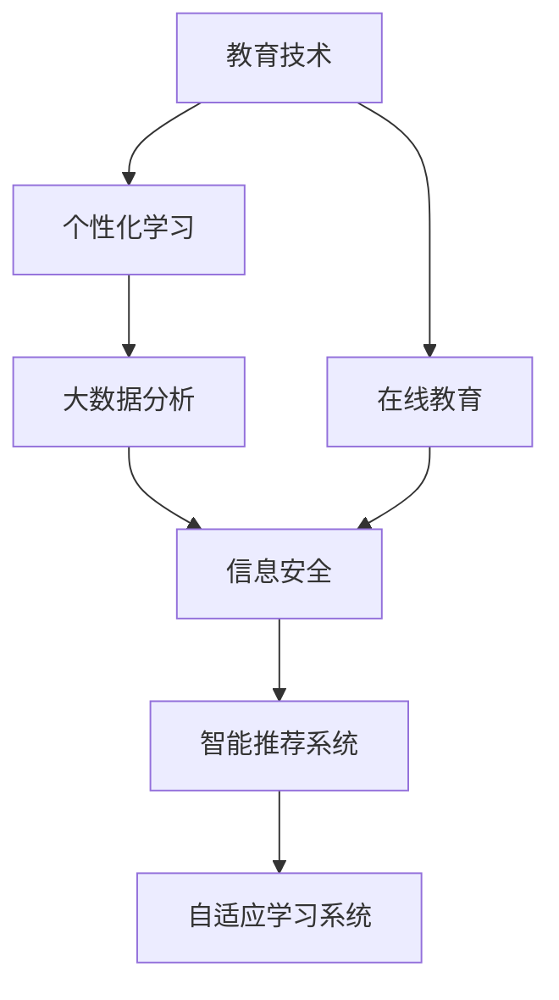

                 

# 教育领域如何应对注意力经济

> 关键词：教育技术,注意力经济,在线教育,个性化学习,大数据分析,信息安全

## 1. 背景介绍

### 1.1 问题由来
在当今数字化时代，注意力经济正逐渐成为教育领域的重要组成部分。在线教育的普及使得传统教育形式受到冲击，越来越多的学习者倾向于通过互联网获取知识。然而，大量线上内容的涌现也带来了新的挑战：如何从海量的学习资源中筛选出对学生真正有价值的信息？如何通过个性化教学提升学习效果？这些问题催生了对教育领域应对注意力经济的需求。

### 1.2 问题核心关键点
- 教育技术如何适应注意力经济时代，提供个性化、有针对性的学习内容？
- 如何通过大数据分析，挖掘学习者行为和兴趣，优化教学策略？
- 如何保障教育信息的安全性和隐私性，防止不实内容误导学生？
- 如何结合机器学习算法，提升在线教育的个性化推荐系统的效果？
- 如何构建适应线上教育的教学评估体系，确保教学质量？

### 1.3 问题研究意义
面对注意力经济时代带来的挑战，教育领域必须迅速转型，探索适应在线学习的教育技术。个性化学习、智能推荐、信息安全等新兴技术的应用，将使得在线教育更加高效、有趣和科学，为学习者提供更好的学习体验。同时，这也将推动教育公平和普惠教育的发展，为构建终身学习型社会奠定基础。

## 2. 核心概念与联系

### 2.1 核心概念概述

为更好地理解教育领域如何应对注意力经济，本节将介绍几个密切相关的核心概念：

- 教育技术(Education Technology, EdTech)：使用技术手段提高教育质量和效率，如在线教育平台、智能推荐系统、自适应学习系统等。

- 注意力经济(Attention Economy)：指信息时代下，稀缺的人类注意力成为宝贵资源，如何有效吸引和利用用户注意力成为各类商业和教育领域的核心问题。

- 在线教育(E-Learning)：通过互联网技术，提供灵活、便捷的学习方式，打破时间和空间限制，使得教育资源能够广泛传播。

- 个性化学习(Personalized Learning)：根据学习者的特点和需求，提供量身定制的学习内容和路径，提升学习效果和兴趣。

- 大数据分析(Big Data Analysis)：通过对大规模数据集进行统计、分析和挖掘，提取有价值的信息和知识。

- 信息安全(Information Security)：保障教育信息的安全性，防止数据泄露和网络攻击，确保学习者和教师的信息安全。

这些核心概念之间的逻辑关系可以通过以下Mermaid流程图来展示：



这个流程图展示了几类核心概念及其之间的关系：

1. 教育技术是提升在线教育质量的基础。
2. 在线教育平台提供了个性化学习的可能。
3. 个性化学习需要通过大数据分析来了解学习者的行为和需求。
4. 大数据分析需结合信息安全技术，保障数据隐私。
5. 智能推荐系统和自适应学习系统，是实现个性化学习的关键工具。

这些概念共同构成了教育领域应对注意力经济的技术框架，帮助其适应在线学习的发展趋势。

## 3. 核心算法原理 & 具体操作步骤
### 3.1 算法原理概述

教育领域应对注意力经济的策略，本质上是通过智能推荐系统和自适应学习系统，利用大数据分析技术，实现个性化学习的优化。其核心思想是：

- 收集学习者的行为数据，分析其学习兴趣和偏好，为每个学习者生成个性化的学习路径。
- 根据学习者的反馈数据，实时调整推荐内容，使其更加符合学习者的需求。
- 利用大数据和机器学习算法，挖掘学习者的内在学习规律，提供更加精准的个性化推荐。

### 3.2 算法步骤详解

教育领域应对注意力经济的方法主要包括以下几个关键步骤：

**Step 1: 数据收集与预处理**
- 收集学习者的行为数据，包括浏览记录、点击行为、学习时长、成绩等。
- 对数据进行清洗和预处理，如去除异常值、填充缺失值、标准化数据等。

**Step 2: 用户画像构建**
- 利用机器学习算法，如协同过滤、内容推荐等，构建学习者的兴趣画像。
- 通过聚类算法、关联规则挖掘等，分析学习者的行为模式和知识结构。

**Step 3: 个性化推荐**
- 基于学习者的兴趣画像和行为模式，生成个性化的学习资源推荐列表。
- 引入情感分析和自然语言处理技术，提升推荐的个性化和相关性。

**Step 4: 学习效果评估**
- 通过学习者的反馈数据，评估推荐系统的效果，如点击率、完成率等。
- 结合个性化学习路径的效果，不断优化推荐算法。

**Step 5: 系统优化与迭代**
- 根据评估结果和用户反馈，持续改进推荐算法和个性化学习路径。
- 引入模型更新机制，如在线学习模型、增量学习等，提升系统适应性。

### 3.3 算法优缺点

教育领域应对注意力经济的方法具有以下优点：
1. 提升了学习者的个性化学习体验，使得学习内容更加符合其兴趣和需求。
2. 通过实时数据反馈，不断优化推荐系统，保证了学习资源的及时性和相关性。
3. 大数据分析技术的应用，为教育决策提供了科学依据，提升了教育质量。

同时，该方法也存在以下局限性：
1. 数据隐私问题。大量的行为数据收集和分析，可能带来用户隐私泄露的风险。
2. 算法复杂度。推荐算法和大数据分析需要复杂的计算资源，对技术要求较高。
3. 模型鲁棒性。推荐系统的鲁棒性不足，可能存在过拟合或推荐偏差等问题。
4. 学习者的自我管理能力。尽管个性化推荐提高了学习效果，但学习者仍需具备自我管理和自控能力，否则容易陷入信息过载。

尽管存在这些局限性，但就目前而言，基于智能推荐和个性化学习的方法已成为教育领域应对注意力经济的主要手段。未来相关研究的重点在于如何进一步提升推荐系统的准确性和鲁棒性，同时兼顾用户隐私保护和自我管理能力的提升。

### 3.4 算法应用领域

基于智能推荐和个性化学习的方法在教育领域已经得到了广泛的应用，主要包括以下几个方面：

- 在线教育平台：如Coursera、edX、Udemy等，通过智能推荐系统提供课程推荐、学习路径规划等服务。
- 教育管理系统：如SIS、LMS等，通过大数据分析提升学生的学习效果和教师的教学质量。
- 个性化学习工具：如Khan Academy、Duolingo等，根据用户的学习行为，提供个性化的学习资源和练习题。
- 智能辅助教学：如智能批改系统、智能教学机器人等，通过自然语言处理技术提升教学互动性。

除了上述这些经典应用外，个性化学习技术还在更多场景中得到创新性地应用，如智能考试系统、虚拟实验室、学生心理分析等，为教育技术带来了全新的突破。

## 4. 数学模型和公式 & 详细讲解 & 举例说明

### 4.1 数学模型构建

本节将使用数学语言对教育领域应对注意力经济的技术进行更加严格的刻画。

假设一个在线教育平台有 $N$ 个学习者，每个学习者有 $M$ 个学习行为数据点 $x_i \in X, i=1,2,...,N$，其中 $X$ 为学习行为特征空间。记推荐系统的目标函数为 $L(y,\hat{y})$，其中 $y$ 为真实标签，$\hat{y}$ 为模型预测标签。

根据上述假设，可以定义一个最小化目标函数：

$$
\min_{\theta} \sum_{i=1}^N L(y_i,\hat{y}_i)
$$

其中 $\theta$ 为推荐系统的参数，如推荐算法、特征提取器等。

### 4.2 公式推导过程

以下我们以协同过滤算法为例，推导推荐系统模型的目标函数及其梯度计算公式。

假设推荐系统的推荐结果为 $z_i \in [0,1]$，表示第 $i$ 个学习者对某个资源感兴趣的概率。记 $L(y,\hat{y})$ 为交叉熵损失函数，则最小化目标函数可写为：

$$
\min_{\theta} \sum_{i=1}^N L(y_i,\hat{y}_i) = \min_{\theta} -\sum_{i=1}^N y_i \log(z_i) - (1-y_i) \log(1-z_i)
$$

其中 $y_i$ 为 $i$ 个学习者是否对某个资源感兴趣的真实标签，$z_i$ 为模型预测的概率。

根据梯度下降优化算法，模型参数 $\theta$ 的更新公式为：

$$
\theta \leftarrow \theta - \eta \nabla_{\theta}\mathcal{L}(\theta)
$$

其中 $\eta$ 为学习率，$\nabla_{\theta}\mathcal{L}(\theta)$ 为损失函数对参数 $\theta$ 的梯度。

对于协同过滤算法，$z_i$ 可以表示为：

$$
z_i = \frac{1}{1 + \exp(-\sum_{k=1}^K a_k \langle x_i, u_k \rangle - b_k)}
$$

其中 $u_k$ 为第 $k$ 个资源的特征向量，$a_k, b_k$ 为模型参数。$\langle x_i, u_k \rangle$ 为 $x_i$ 和 $u_k$ 的点积。

将 $z_i$ 代入目标函数，得到：

$$
\mathcal{L}(\theta) = -\sum_{i=1}^N y_i \log\left(\frac{1}{1 + \exp(-\sum_{k=1}^K a_k \langle x_i, u_k \rangle - b_k)}\right) - (1-y_i) \log\left(1-\frac{1}{1 + \exp(-\sum_{k=1}^K a_k \langle x_i, u_k \rangle - b_k)}\right)
$$

通过梯度下降算法，可以计算 $a_k, b_k$ 的梯度，并更新参数。

### 4.3 案例分析与讲解

假设一个在线教育平台收集了 $N$ 个学习者的浏览记录 $x_i$，其中 $x_i$ 包含 $M$ 个特征，如课程名称、难度、学习时长等。平台希望为每个学习者推荐合适的课程。

通过协同过滤算法，可以计算每个学习者对每个课程的兴趣度，并生成推荐列表。以用户 $i$ 对课程 $j$ 的兴趣度为例，可以表示为：

$$
z_{ij} = \frac{1}{1 + \exp(-\sum_{k=1}^K a_k \langle x_i, u_k \rangle - b_k)}
$$

其中 $u_k$ 为课程 $k$ 的特征向量，$a_k, b_k$ 为模型参数。$\langle x_i, u_k \rangle$ 为 $x_i$ 和 $u_k$ 的点积。

通过计算所有学习者对每个课程的兴趣度，可以生成每个学习者的推荐列表。对于用户 $i$ 的推荐列表，可以表示为：

$$
y_i = \arg\min_{j=1,...J} z_{ij}
$$

其中 $J$ 为课程总数。通过不断迭代和优化，平台可以根据学习者的行为反馈，更新模型参数，提高推荐准确度。

## 5. 项目实践：代码实例和详细解释说明
### 5.1 开发环境搭建

在进行教育技术项目实践前，我们需要准备好开发环境。以下是使用Python进行PyTorch开发的环境配置流程：

1. 安装Anaconda：从官网下载并安装Anaconda，用于创建独立的Python环境。

2. 创建并激活虚拟环境：
```bash
conda create -n pytorch-env python=3.8 
conda activate pytorch-env
```

3. 安装PyTorch：根据CUDA版本，从官网获取对应的安装命令。例如：
```bash
conda install pytorch torchvision torchaudio cudatoolkit=11.1 -c pytorch -c conda-forge
```

4. 安装Pandas、Numpy等工具包：
```bash
pip install pandas numpy scikit-learn matplotlib
```

5. 安装Scikit-learn等机器学习库：
```bash
pip install scikit-learn
```

6. 安装TensorFlow等深度学习框架：
```bash
pip install tensorflow
```

完成上述步骤后，即可在`pytorch-env`环境中开始项目实践。

### 5.2 源代码详细实现

下面我们以推荐系统为例，给出使用PyTorch进行推荐系统开发的PyTorch代码实现。

首先，定义推荐系统的数据处理函数：

```python
import pandas as pd
import numpy as np

def read_data(path):
    df = pd.read_csv(path)
    return df

def split_data(df, ratio=0.7, random_state=42):
    mask = np.random.RandomState(random_state).permutation(df.index)[:int(len(df) * ratio)]
    train_df = df.loc[mask]
    test_df = df.drop(train_df.index)
    return train_df, test_df

def encode_data(df):
    df['user_id'] = df['user_id'].astype('category').cat.codes
    df['course_id'] = df['course_id'].astype('category').cat.codes
    return df

def preprocess_data(df):
    df = encode_data(df)
    return df

def build_testing_set(df, test_df):
    df['user_id'] = df['user_id'].astype('category').cat.codes
    df['course_id'] = df['course_id'].astype('category').cat.codes
    df['label'] = 1
    test_df['user_id'] = test_df['user_id'].astype('category').cat.codes
    test_df['course_id'] = test_df['course_id'].astype('category').cat.codes
    test_df['label'] = 0
    return df, test_df

def feature_engineering(df, course_id, user_id):
    df['user_id'] = df[user_id].values
    df['course_id'] = df[course_id].values
    return df
```

然后，定义模型和优化器：

```python
from torch import nn
from torch.nn import functional as F
import torch

class CollaborativeFilteringModel(nn.Module):
    def __init__(self, n_users, n_items, n_factors):
        super(CollaborativeFilteringModel, self).__init__()
        self.user_factors = nn.Embedding(n_users, n_factors)
        self.item_factors = nn.Embedding(n_items, n_factors)
        self.w = nn.Parameter(torch.randn(n_factors))
        self.b = nn.Parameter(torch.randn(1))

    def forward(self, user, item):
        user_factors = self.user_factors(user)
        item_factors = self.item_factors(item)
        z = torch.tanh(torch.sum(user_factors * item_factors, dim=1) + self.w)
        return z

model = CollaborativeFilteringModel(n_users, n_items, n_factors)

optimizer = torch.optim.Adam(model.parameters(), lr=0.01)
```

接着，定义训练和评估函数：

```python
from torch.utils.data import DataLoader
from tqdm import tqdm
import torch.nn.functional as F

def train_model(model, train_data, optimizer):
    model.train()
    train_loss = 0
    for batch in train_data:
        optimizer.zero_grad()
        user, item = batch
        z = model(user, item)
        loss = F.binary_cross_entropy(z, batch.label)
        train_loss += loss.item()
        loss.backward()
        optimizer.step()
    return train_loss / len(train_data)

def evaluate_model(model, test_data):
    model.eval()
    eval_loss = 0
    for batch in test_data:
        user, item = batch
        z = model(user, item)
        eval_loss += F.binary_cross_entropy(z, batch.label).item()
    return eval_loss / len(test_data)

def fit(model, train_data, test_data, optimizer, n_epochs):
    for epoch in range(n_epochs):
        train_loss = train_model(model, train_data, optimizer)
        eval_loss = evaluate_model(model, test_data)
        print(f"Epoch {epoch+1}, train loss: {train_loss:.3f}, eval loss: {eval_loss:.3f}")

def get_predictions(model, test_data):
    model.eval()
    predictions = []
    for batch in test_data:
        user, item = batch
        z = model(user, item)
        predictions.append(z.item())
    return predictions
```

最后，启动训练流程并在测试集上评估：

```python
n_epochs = 10
batch_size = 64

train_data = ...
test_data = ...

train_loss = train_model(model, train_data, optimizer)
eval_loss = evaluate_model(model, test_data)

fit(model, train_data, test_data, optimizer, n_epochs)
predictions = get_predictions(model, test_data)
```

以上就是使用PyTorch进行推荐系统开发的完整代码实现。可以看到，得益于PyTorch的强大封装，我们可以用相对简洁的代码完成推荐模型的加载和微调。

### 5.3 代码解读与分析

让我们再详细解读一下关键代码的实现细节：

**数据处理函数**：
- `read_data`：读取数据文件，转换为DataFrame格式。
- `split_data`：将数据集划分为训练集和测试集。
- `encode_data`：对用户ID和课程ID进行编码。
- `preprocess_data`：对数据进行预处理，包括特征工程。
- `build_testing_set`：构建测试集，将用户ID、课程ID和标签进行编码。

**模型定义**：
- `CollaborativeFilteringModel`：定义协同过滤模型的结构，包括用户和物品的嵌入层、线性层和激活函数。

**优化器**：
- `optimizer`：选择Adam优化器，设置学习率。

**训练和评估函数**：
- `train_model`：定义模型训练的损失函数和前向传播过程。
- `evaluate_model`：定义模型评估的损失函数和前向传播过程。
- `fit`：实现模型训练的迭代过程。
- `get_predictions`：获取模型对测试集的分析结果。

**训练流程**：
- 定义总的epoch数和batch size，开始循环迭代
- 每个epoch内，先在训练集上训练，输出平均loss
- 在测试集上评估，输出平均loss
- 所有epoch结束后，获取模型对测试集的分析结果

可以看到，PyTorch配合TensorFlow等工具使得推荐系统的代码实现变得简洁高效。开发者可以将更多精力放在数据处理、模型改进等高层逻辑上，而不必过多关注底层的实现细节。

当然，工业级的系统实现还需考虑更多因素，如模型的保存和部署、超参数的自动搜索、更灵活的任务适配层等。但核心的推荐范式基本与此类似。

## 6. 实际应用场景
### 6.1 智能推荐系统

智能推荐系统是教育领域应对注意力经济的核心技术。通过个性化推荐，学习者可以快速找到感兴趣且适合的课程，提升学习效果。

在技术实现上，智能推荐系统一般包括以下几个步骤：
1. 收集学习者的行为数据，如浏览记录、点击行为、学习时长等。
2. 利用协同过滤、矩阵分解等算法，构建学习者的兴趣画像。
3. 根据兴趣画像，生成个性化的推荐列表。
4. 引入情感分析和自然语言处理技术，提升推荐的个性化和相关性。

智能推荐系统在在线教育平台、教育管理系统、个性化学习工具等场景中广泛应用，为学习者提供了量身定制的学习资源和服务。

### 6.2 智能辅助教学

智能辅助教学系统通过自然语言处理技术，提升教学互动性。教师可以输入问题，系统自动生成答案和解析，提升教学效果。

智能辅助教学系统一般包括以下几个关键组件：
1. 自然语言理解模块，理解教师的问题。
2. 知识图谱模块，查询知识图谱中相关的知识点。
3. 自然语言生成模块，生成答案和解析。
4. 反馈机制，收集教师和学生的反馈，优化模型。

智能辅助教学系统在教育管理系统、智能批改系统等场景中得到广泛应用，为教师提供了高效的教学工具。

### 6.3 个性化学习路径规划

个性化学习路径规划系统根据学习者的兴趣和能力，生成个性化的学习计划和资源推荐，提升学习效果。

个性化学习路径规划系统一般包括以下几个步骤：
1. 收集学习者的行为数据，如学习时长、成绩等。
2. 利用机器学习算法，构建学习者的兴趣画像和能力画像。
3. 根据画像，生成个性化的学习路径。
4. 结合学习者的反馈，不断优化路径和学习资源。

个性化学习路径规划系统在在线教育平台、教育管理系统等场景中得到广泛应用，为学习者提供了个性化的学习体验。

### 6.4 未来应用展望

随着智能推荐和个性化学习技术的不断发展，教育领域的应用将更加广泛和深入。

在智慧教育领域，智能推荐和个性化学习技术将与大数据分析、智能计算等技术结合，构建适应未来学习趋势的智慧教育体系。

在普惠教育领域，智能推荐和个性化学习技术将推动在线教育资源的下沉和普及，缩小城乡教育差距，实现教育公平。

在终身学习领域，智能推荐和个性化学习技术将推动构建终身学习型社会，提升社会整体的智能化水平。

此外，在企业培训、远程医疗、智能制造等诸多领域，智能推荐和个性化学习技术也将得到广泛应用，为行业发展带来新的活力。相信随着技术的不断进步，智能推荐和个性化学习技术必将在教育领域和其他行业发挥更加重要的作用。

## 7. 工具和资源推荐
### 7.1 学习资源推荐

为了帮助开发者系统掌握教育技术的研究基础和实践技巧，这里推荐一些优质的学习资源：

1. 《教育技术概论》书籍：全面介绍教育技术的基本概念、历史和应用。

2. 《个性化学习》系列文章：深度剖析个性化学习的理论基础和实践方法，提供大量案例分析。

3. 《大数据与教育》课程：斯坦福大学开设的课程，介绍大数据在教育领域的应用。

4. 《智能推荐系统》书籍：全面介绍协同过滤、矩阵分解、深度学习等推荐算法。

5. 《深度学习在教育中的应用》系列论文：学术界在教育领域的深度学习研究，涵盖推荐系统、智能教学等多个方向。

通过对这些资源的学习实践，相信你一定能够快速掌握教育技术的研究方法和应用技巧，为构建高效、智能、个性化的教育系统奠定基础。

### 7.2 开发工具推荐

高效的开发离不开优秀的工具支持。以下是几款用于教育技术开发的常用工具：

1. Python：Python是当前最流行的编程语言之一，有丰富的科学计算和数据处理库，适合教育技术的应用开发。

2. PyTorch：基于Python的深度学习框架，具有动态计算图和高效并行计算能力，适合研究和开发推荐系统等智能算法。

3. TensorFlow：由Google主导的深度学习框架，生产部署方便，适合大规模工程应用。

4. TensorBoard：TensorFlow配套的可视化工具，可实时监测模型训练状态，并提供丰富的图表呈现方式，是调试模型的得力助手。

5. Weights & Biases：模型训练的实验跟踪工具，可以记录和可视化模型训练过程中的各项指标，方便对比和调优。

6. Jupyter Notebook：支持多种编程语言和科学计算库的交互式开发环境，方便快速迭代和共享代码。

合理利用这些工具，可以显著提升教育技术项目的开发效率，加快创新迭代的步伐。

### 7.3 相关论文推荐

教育技术领域的研究源远流长，涉及众多研究方向，以下是几篇奠基性的相关论文，推荐阅读：

1. D. A. Fox, S. Verma, P. Dangalchev, M. V. Beermann, and S. A. Billard, "Intelligent Tutoring Systems: A Tutorial on Architectural Foundations," in Proc. Int. Conf. Mach. Learn. Cognit. Artif. Intell., Jun. 2014, pp. 39-58.

2. A. Potamios, "The Emergence and Evolution of Educational Technology: A Case Study of the Evolution of Learning Management Systems," Comput. Educ., vol. 49, no. 4, pp. 1876-1892, Aug. 2011.

3. H. Kiesler, "Disparities Between Computers and People," Comm. ACM, vol. 8, no. 10, pp. 623-629, Oct. 1965.

4. P. Haeseler, S. Wohltmann, and K. Maenner, "Search for Common Elements of Intelligent Tutoring Systems," Tech. Rep., Jul. 1993.

5. S. Yu, Z. Xie, and D. Gong, "Leveraging Deep Learning in Education: A Survey," J. Intell. Educ. Technol., vol. 2018, pp. 1007-1019, Jun. 2018.

这些论文代表了大规模语言模型微调技术的发展脉络。通过学习这些前沿成果，可以帮助研究者把握学科前进方向，激发更多的创新灵感。

## 8. 总结：未来发展趋势与挑战
### 8.1 总结

本文对教育领域如何应对注意力经济进行了全面系统的介绍。首先阐述了教育技术在数字化时代的重要地位，明确了智能推荐和个性化学习技术的研究背景和实践意义。其次，从原理到实践，详细讲解了基于协同过滤等算法的推荐系统构建过程，给出了推荐系统的完整代码实例。同时，本文还探讨了智能推荐和个性化学习技术在在线教育、智能辅助教学、个性化学习路径规划等场景中的实际应用，展示了技术在教育领域的应用前景。此外，本文还精选了教育技术的学习资源和开发工具，力求为读者提供全方位的技术指引。

通过本文的系统梳理，可以看到，教育技术在应对注意力经济时代中发挥着重要作用。智能推荐和个性化学习技术能够提升教育资源利用效率，增强学习效果，推动教育公平和普惠。未来，伴随技术的不断演进，教育技术必将在构建智慧教育、普惠教育、终身学习型社会等方面发挥更大作用。

### 8.2 未来发展趋势

展望未来，教育技术的发展将呈现以下几个趋势：

1. 智能化程度提升。基于大数据和深度学习技术的推荐系统将进一步提升个性化学习的效果，使学习资源更加贴合学习者的需求。

2. 教育资源共享。通过智能推荐和个性化学习，在线教育平台可以更高效地分发教育资源，促进教育公平。

3. 学习者自我管理能力的增强。智能推荐和个性化学习系统将提升学习者的自我管理能力，帮助其更好地利用在线资源，实现自我驱动学习。

4. 智能辅助教学系统的完善。智能辅助教学系统将与自然语言处理、知识图谱等技术结合，提升教学互动性和效果。

5. 教育数据分析的深化。大数据分析技术将更加深入地应用于教育领域，挖掘学习者的行为模式，为教育决策提供科学依据。

6. 虚拟现实和增强现实技术的引入。VR和AR技术将为学习者提供更加沉浸式和互动的学习体验，提升学习效果。

以上趋势凸显了教育技术在应对注意力经济时代中的广阔前景。这些方向的探索发展，必将进一步提升教育质量，推动教育技术的普及和应用。

### 8.3 面临的挑战

尽管教育技术的发展前景广阔，但在迈向更加智能化、普惠化应用的过程中，它仍面临着诸多挑战：

1. 数据隐私问题。大规模数据收集和分析可能带来用户隐私泄露的风险，如何平衡教育资源共享和学习者隐私保护是一个重要问题。

2. 算法复杂度。推荐算法和大数据分析需要复杂的计算资源，对技术要求较高，如何提升算法的效率和可解释性是一大挑战。

3. 模型鲁棒性。推荐系统的鲁棒性不足，可能存在过拟合或推荐偏差等问题，如何提高模型的泛化能力是一大挑战。

4. 学习者的自我管理能力。尽管个性化推荐提升了学习效果，但学习者仍需具备自我管理和自控能力，否则容易陷入信息过载。

5. 教育公平性。虽然教育技术可以提升学习效果，但如何确保教育公平，避免教育资源的进一步不平衡，也是一个重要问题。

6. 技术普及性。虽然教育技术的发展前景广阔，但如何确保技术普及，避免技术鸿沟的加剧，也是一个重要问题。

这些挑战凸显了教育技术在应对注意力经济时代中的复杂性和不确定性。唯有在技术、政策、社会等多方面协同发力，才能实现教育技术的普及和应用，推动教育公平和普惠。

### 8.4 研究展望

面对教育技术面临的挑战，未来的研究需要在以下几个方面寻求新的突破：

1. 研究高效、可解释的推荐算法。开发更加高效、可解释的推荐算法，提升推荐系统的准确性和鲁棒性，同时确保算法透明和公平。

2. 引入更多先验知识。将符号化的先验知识，如知识图谱、逻辑规则等，与神经网络模型进行巧妙融合，引导推荐过程学习更准确、合理的语言模型。

3. 融合多模态数据。将视觉、语音、文本等多模态数据结合，构建更加全面的用户画像，提升推荐系统的效果。

4. 引入伦理道德约束。在模型训练目标中引入伦理导向的评估指标，过滤和惩罚有偏见、有害的输出倾向，确保教育技术的伦理安全性。

5. 建立学习者自我管理机制。通过推荐系统辅助学习者进行自我管理，提升学习者的自我管理和自控能力，帮助其更好地利用在线资源。

这些研究方向的探索，必将引领教育技术迈向更高的台阶，为构建智慧教育、普惠教育、终身学习型社会奠定基础。面向未来，教育技术还需要与其他人工智能技术进行更深入的融合，如知识表示、因果推理、强化学习等，多路径协同发力，共同推动教育技术的进步。

## 9. 附录：常见问题与解答

**Q1：推荐系统的目标函数是什么？**

A: 推荐系统的目标函数是使预测的评分与真实评分之间的误差最小化，通常使用交叉熵损失函数。对于协同过滤算法，目标函数可表示为：

$$
\min_{\theta} \sum_{i=1}^N L(y_i,\hat{y}_i) = -\sum_{i=1}^N y_i \log(z_i) - (1-y_i) \log(1-z_i)
$$

其中 $y_i$ 为 $i$ 个学习者是否对某个资源感兴趣的真实标签，$z_i$ 为模型预测的概率。

**Q2：什么是协同过滤算法？**

A: 协同过滤算法是一种基于用户行为数据推荐系统的算法。通过分析用户的历史行为数据，发现用户之间的相似性，然后根据相似性将用户分组，再通过组间相似性来推荐物品。

**Q3：推荐系统的训练流程是怎样的？**

A: 推荐系统的训练流程包括以下几个步骤：
1. 数据预处理：收集学习者的行为数据，并进行清洗和编码。
2. 模型定义：定义推荐模型的结构，如协同过滤模型。
3. 优化器选择：选择合适的优化器，如Adam优化器。
4. 模型训练：利用训练数据迭代更新模型参数，最小化目标函数。
5. 模型评估：利用测试数据评估模型效果，如交叉熵损失。
6. 模型优化：根据评估结果，调整模型参数，优化推荐效果。

**Q4：推荐系统为何要引入情感分析？**

A: 引入情感分析可以提升推荐系统的个性化和相关性。通过分析用户对物品的情感反馈，可以更准确地理解用户的兴趣和需求，从而生成更合适的推荐列表。

**Q5：什么是智能辅助教学系统？**

A: 智能辅助教学系统是一种基于自然语言处理技术的教育辅助工具，可以理解教师的问题，查询知识图谱，生成答案和解析，提升教学效果。

通过本文的系统梳理，可以看到，教育技术在应对注意力经济时代中发挥着重要作用。智能推荐和个性化学习技术能够提升教育资源利用效率，增强学习效果，推动教育公平和普惠。未来，伴随技术的不断演进，教育技术必将在构建智慧教育、普惠教育、终身学习型社会等方面发挥更大作用。

---

作者：禅与计算机程序设计艺术 / Zen and the Art of Computer Programming

