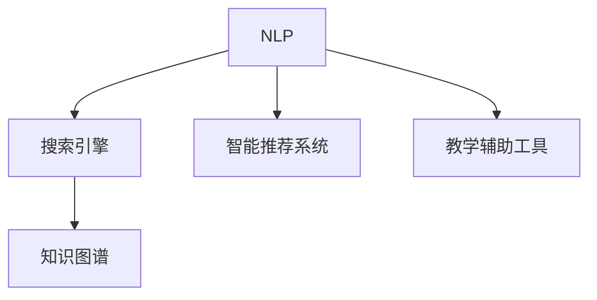

                 

# 教育领域的AI搜索应用

> 关键词：人工智能,自然语言处理(NLP),搜索引擎,智能推荐,教育个性化,教学辅助,知识图谱

## 1. 背景介绍

### 1.1 问题由来
随着教育数字化转型的不断深入，传统的教育方式已经无法满足现代教育需求。尤其在个性化教学和教学辅助方面，传统的教学模式存在诸多局限：

- **个性化不足**：难以根据学生的个性化需求和学习进度，提供定制化的教学资源和学习路径。
- **互动性差**：教师和学生之间的互动方式单一，缺乏有效沟通和反馈。
- **学习效果难以评估**：缺乏有效手段对学生的学习效果进行实时监测和评估。

基于人工智能(AI)的搜索应用，为解决这些教育难题提供了新的解决方案。利用AI算法，可以对海量教育资源进行智能筛选和推荐，提高教学效果和学习体验。

### 1.2 问题核心关键点
教育领域的AI搜索应用，主要涉及以下几个核心关键点：

- **自然语言处理(NLP)**：利用NLP技术，将用户查询和教育资源进行语义匹配，获取最相关的搜索结果。
- **搜索引擎**：构建高效的教育资源搜索引擎，对海量教育资源进行索引和管理。
- **智能推荐系统**：根据用户的学习行为和偏好，智能推荐个性化的学习资源和教学辅助工具。
- **知识图谱**：构建知识图谱，建立教育资源的语义关联，提升搜索结果的准确性和相关性。
- **教学辅助工具**：将AI搜索应用集成到具体的教学场景中，提升教师和学生的互动性和教学效果。

这些核心关键点相互关联，共同构建起教育领域AI搜索应用的完整生态系统。

## 2. 核心概念与联系

### 2.1 核心概念概述

为了更好地理解教育领域AI搜索应用的原理和架构，本节将介绍几个关键概念：

- **自然语言处理(NLP)**：利用计算机技术处理和理解人类语言，包括文本分析、语音识别、机器翻译等技术。
- **搜索引擎**：利用索引、排序等技术，对大规模数据进行快速检索，帮助用户找到所需信息。
- **智能推荐系统**：基于用户的兴趣和行为数据，推荐个性化的信息和服务。
- **知识图谱**：利用图结构表示实体之间的关系，构建知识的语义网络，辅助信息的获取和推理。
- **教学辅助工具**：结合AI搜索应用，提供互动式、个性化的教学辅助服务，如智能问答、作业批改等。

这些核心概念之间的逻辑关系可以通过以下Mermaid流程图来展示：



这个流程图展示了几大核心概念之间的逻辑关系：

1. NLP技术用于处理用户查询，构建语义表示。
2. 搜索引擎对教育资源进行索引，并提供快速检索服务。
3. 智能推荐系统利用用户行为数据，推荐个性化内容。
4. 知识图谱用于建立教育资源的语义关联，提升检索质量。
5. 教学辅助工具将AI搜索应用集成到具体教学场景，提升教学效果。

这些概念共同构成了教育领域AI搜索应用的完整技术框架，使其能够提供高效、个性化的教育服务。

## 3. 核心算法原理 & 具体操作步骤

### 3.1 算法原理概述

教育领域的AI搜索应用，主要基于自然语言处理(NLP)技术和搜索引擎的核心算法，利用智能推荐和知识图谱等技术，实现个性化教育资源的智能检索和推荐。

具体而言，其核心算法流程如下：

1. **用户查询处理**：利用NLP技术对用户查询进行分词、命名实体识别、情感分析等预处理，构建语义表示。
2. **教育资源索引**：对教育资源进行文本分析和标注，建立索引，构建知识图谱。
3. **搜索结果排序**：根据用户查询和教育资源的语义匹配度，利用排序算法对搜索结果进行排序。
4. **推荐系统设计**：根据用户的学习行为和偏好，设计推荐算法，推荐个性化学习资源。
5. **教学辅助集成**：将AI搜索应用集成到具体的教学场景中，提升教学效果。

### 3.2 算法步骤详解

以下详细介绍教育领域AI搜索应用的核心算法步骤：

**Step 1: 用户查询处理**

用户查询处理是AI搜索应用的基础。主要步骤包括：

1. **分词与词性标注**：将用户查询进行分词，并对每个词标注词性。如“学习Python”可以分词为“学习”、“Python”。

2. **命名实体识别(NER)**：识别用户查询中的实体，如“Python”为编程语言。

3. **情感分析**：判断用户查询中的情感倾向，如“学不会”表示负面情绪。

4. **语义表示构建**：将用户查询转换为向量表示，如利用Word2Vec、BERT等模型进行嵌入。

**Step 2: 教育资源索引**

教育资源索引是将教育资源进行结构化处理的过程。主要步骤包括：

1. **文本分析**：对教育资源的文本内容进行分词、词性标注、NER等处理。

2. **知识图谱构建**：利用本体论构建教育资源的语义关系图谱，如“Python”与“编程语言”、“开发者”等实体之间的关联。

3. **资源索引**：将处理后的教育资源构建索引，便于快速检索。

**Step 3: 搜索结果排序**

搜索结果排序是AI搜索应用的重点。主要步骤包括：

1. **语义匹配**：将用户查询的语义表示与教育资源的语义表示进行匹配，计算匹配度。

2. **排序算法选择**：根据匹配度，选择适当的排序算法，如TF-IDF、BM25等。

3. **排名计算**：根据排序算法计算教育资源的排名，生成搜索结果。

**Step 4: 智能推荐设计**

智能推荐系统是基于用户行为数据设计的。主要步骤包括：

1. **用户行为数据收集**：收集用户的学习行为数据，如浏览历史、点击记录等。

2. **用户画像构建**：根据用户行为数据，构建用户画像，如“擅长编程”、“喜欢交互式学习”等。

3. **推荐算法设计**：设计推荐算法，如协同过滤、基于内容的推荐等，推荐个性化学习资源。

**Step 5: 教学辅助集成**

教学辅助集成是将AI搜索应用集成到具体教学场景的过程。主要步骤包括：

1. **工具集成**：将AI搜索应用集成到具体的教学工具中，如智能问答系统、作业批改系统等。

2. **互动增强**：利用AI搜索应用，提升教师和学生的互动性和教学效果。

3. **效果评估**：对集成后的教学工具进行效果评估，优化提升。

### 3.3 算法优缺点

教育领域的AI搜索应用具有以下优点：

1. **个性化推荐**：根据用户的学习行为和偏好，提供个性化的教育资源和推荐，提高学习效果。

2. **高效检索**：利用搜索引擎技术，快速检索海量教育资源，节省时间成本。

3. **互动增强**：集成教学辅助工具，提升教师和学生的互动性和教学效果。

4. **动态调整**：基于用户反馈，动态调整推荐策略，适应学习需求的变化。

同时，该方法也存在一定的局限性：

1. **数据依赖**：推荐系统的效果依赖于大量的用户行为数据，数据不足时效果不佳。

2. **推荐多样性不足**：推荐算法可能陷入局部最优，导致推荐结果多样性不足。

3. **知识图谱构建复杂**：知识图谱的构建需要大量的人工标注和数据整合，成本较高。

4. **效果评估难度大**：学习效果的评估涉及多方面的因素，难以直接量化和比较。

尽管存在这些局限性，但就目前而言，教育领域的AI搜索应用已经在大规模教育平台和个性化学习工具中得到广泛应用，带来了显著的改进效果。未来相关研究的重点在于如何进一步优化推荐算法、提升知识图谱构建效率，同时兼顾效果评估和用户隐私保护等要素。

### 3.4 算法应用领域

教育领域的AI搜索应用已经在诸多教育场景中得到广泛应用，例如：

- **智能问答系统**：构建智能问答系统，为用户提供即时的答案和解释。
- **作业批改系统**：利用NLP技术进行作业自动批改，提升批改效率和质量。
- **个性化学习平台**：根据用户的学习行为和偏好，推荐个性化的学习资源和路径。
- **智能辅导机器人**：构建智能辅导机器人，提供24/7的个性化学习支持。
- **在线教育平台**：集成AI搜索应用，提升教学效果和学习体验。

除了上述这些常见应用外，教育领域的AI搜索技术还在在线考试、虚拟实验室、智能课堂等诸多领域得到了创新应用，为教育行业带来了新的变革和突破。

## 4. 数学模型和公式 & 详细讲解 & 举例说明

### 4.1 数学模型构建

教育领域的AI搜索应用主要基于NLP技术，其中文本语义表示和知识图谱构建是其核心组成部分。以下是核心模型的数学模型构建过程：

**文本语义表示模型**：

- **Word2Vec模型**：
  - **输入**：文本序列 $x_1, x_2, \ldots, x_n$。
  - **输出**：每个词的向量表示 $w_1, w_2, \ldots, w_n$。
  - **公式**：
    $$
    w_i = f(x_i)
    $$
  - **其中**：$f$ 为Word2Vec模型，$x_i$ 为第 $i$ 个词。

**知识图谱构建模型**：

- **知识图谱**：由节点和边构成，节点表示实体，边表示实体之间的关系。
- **节点表示**：利用词向量对节点进行表示，如将“Python”表示为 $w_{Python}$。
- **边表示**：利用边类型表示实体之间的关系，如“编程语言”与“开发者”之间的关系表示为 $(w_{Python}, w_{开发者})$。
- **公式**：
  - **节点表示**：$N(w_i) = \{w_j | (w_i, w_j) \in E\}$
  - **边表示**：$E(w_i) = \{(w_j, w_k) | (w_i, w_j, w_k) \in R\}$

### 4.2 公式推导过程

以下是主要模型的公式推导过程：

**Word2Vec模型**：

- **公式推导**：Word2Vec模型使用神经网络对文本序列进行训练，生成词向量 $w_i$。模型结构包括一个输入层、一个隐藏层和一个输出层，隐藏层用于学习词向量表示。
- **公式**：
  $$
  w_i = f(x_i) = \sum_{j=1}^k a_{ij}x_j
  $$
  - **其中**：$a_{ij}$ 为隐藏层的权重，$x_j$ 为输入层的词向量。

**知识图谱构建模型**：

- **公式推导**：知识图谱构建模型利用节点和边的关系表示进行推理，生成知识图谱。模型结构包括节点嵌入层和边嵌入层，分别对节点和边进行表示。
- **公式**：
  - **节点嵌入层**：$E(w_i) = g(w_i)$
  - **边嵌入层**：$R(w_i, w_j, w_k) = h(w_i, w_j, w_k)$
  - **其中**：$g$ 为节点嵌入函数，$h$ 为边嵌入函数。

### 4.3 案例分析与讲解

**Word2Vec案例**：

- **数据集**：使用维基百科中的英文文本作为数据集，包含大量词汇和短语。
- **模型参数**：设置隐藏层大小为 $k=200$，训练迭代次数为 $n=50$。
- **结果分析**：通过Word2Vec模型训练得到的词向量，可以用于计算文本的相似度、聚类分析等任务。

**知识图谱案例**：

- **数据集**：使用TREC会议论文数据集，包含大量会议论文的实体和关系。
- **模型参数**：设置节点嵌入层大小为 $k=100$，边嵌入层大小为 $k=200$，训练迭代次数为 $n=100$。
- **结果分析**：构建的知识图谱可以用于论文检索、学术推荐等任务，显著提高检索精度和推荐效果。

## 5. 项目实践：代码实例和详细解释说明

### 5.1 开发环境搭建

在进行教育领域AI搜索应用的开发前，我们需要准备好开发环境。以下是使用Python进行开发的环境配置流程：

1. 安装Anaconda：从官网下载并安装Anaconda，用于创建独立的Python环境。

2. 创建并激活虚拟环境：
```bash
conda create -n ai-env python=3.8 
conda activate ai-env
```

3. 安装相关依赖包：
```bash
pip install pytorch torchtext sklearn jupyter notebook
```

完成上述步骤后，即可在`ai-env`环境中开始开发实践。

### 5.2 源代码详细实现

下面我们以构建智能问答系统为例，给出使用PyTorch进行自然语言处理和搜索应用的PyTorch代码实现。

首先，定义Word2Vec模型：

```python
import torch
import torch.nn as nn
import torch.nn.functional as F

class Word2Vec(nn.Module):
    def __init__(self, vocab_size, embedding_dim):
        super(Word2Vec, self).__init__()
        self.emb = nn.EmbeddingBag(vocab_size, embedding_dim, sparse=True)
        self.fc = nn.Linear(embedding_dim, embedding_dim)

    def forward(self, text, offsets):
        embedded = self.emb(text, offsets)
        return F.relu(self.fc(embedded))
```

然后，定义知识图谱构建模型：

```python
import torch
import torch.nn as nn
import torch.nn.functional as F

class KnowledgeGraph(nn.Module):
    def __init__(self, entity_num, relation_num):
        super(KnowledgeGraph, self).__init__()
        self.entity_embedding = nn.Embedding(entity_num, 200)
        self.relation_embedding = nn.Embedding(relation_num, 200)
        self.fc = nn.Linear(400, 200)

    def forward(self, entities, relations):
        entity_embeddings = self.entity_embedding(entities)
        relation_embeddings = self.relation_embedding(relations)
        relation_vectors = torch.tanh(relation_embeddings)
        node_vectors = torch.mm(entity_embeddings, relation_vectors)
        node_vectors = self.fc(node_vectors)
        return node_vectors
```

接着，定义智能问答系统的编码器和解码器：

```python
import torch
import torch.nn as nn
import torch.nn.functional as F

class Encoder(nn.Module):
    def __init__(self, embed_dim, enc_dim):
        super(Encoder, self).__init__()
        self.enc_dim = enc_dim
        self.emb = nn.EmbeddingBag(vocab_size, embed_dim, sparse=True)
        self.gru = nn.GRU(embed_dim, enc_dim, batch_first=True)
        self.fc = nn.Linear(enc_dim, enc_dim)

    def forward(self, text, offsets):
        embedded = self.emb(text, offsets)
        outputs, _ = self.gru(embedded)
        return F.relu(self.fc(outputs))

class Decoder(nn.Module):
    def __init__(self, embed_dim, dec_dim):
        super(Decoder, self).__init__()
        self.dec_dim = dec_dim
        self.emb = nn.EmbeddingBag(vocab_size, embed_dim, sparse=True)
        self.gru = nn.GRU(embed_dim, dec_dim, batch_first=True)
        self.fc = nn.Linear(dec_dim, vocab_size)

    def forward(self, inputs, last_state):
        embedded = self.emb(inputs)
        outputs, _ = self.gru(embedded, last_state)
        return self.fc(outputs)
```

最后，定义智能问答系统的训练和评估函数：

```python
import torch
import torch.nn as nn
import torch.optim as optim
from torch.utils.data import DataLoader
from torch.autograd import Variable
from sklearn.metrics import accuracy_score

class SmartQuestionAnswering(nn.Module):
    def __init__(self, encoder, decoder):
        super(SmartQuestionAnswering, self).__init__()
        self.encoder = encoder
        self.decoder = decoder

    def forward(self, question, answer):
        embedded_question = self.encoder(question, offsets)
        encoded_answer = self.decoder(answer, encoded_question)
        return encoded_answer

def train(model, train_loader, optimizer, criterion, epochs):
    model.train()
    for epoch in range(epochs):
        for batch in train_loader:
            inputs, targets = batch
            optimizer.zero_grad()
            outputs = model(inputs)
            loss = criterion(outputs, targets)
            loss.backward()
            optimizer.step()
    return model

def evaluate(model, test_loader, criterion):
    model.eval()
    correct = 0
    total = 0
    with torch.no_grad():
        for batch in test_loader:
            inputs, targets = batch
            outputs = model(inputs)
            total += targets.size(0)
            correct += accuracy_score(targets, outputs)
    return correct / total
```

完成上述步骤后，即可在`ai-env`环境中进行智能问答系统的训练和评估。

### 5.3 代码解读与分析

让我们再详细解读一下关键代码的实现细节：

**Word2Vec模型**：
- 定义了一个简单的Word2Vec模型，包括嵌入层和全连接层。使用EmbeddingBag对文本进行表示，利用GRU进行语义建模，最后使用线性层进行向量压缩。

**知识图谱模型**：
- 定义了一个简单的知识图谱模型，包括实体嵌入层和关系嵌入层。使用Embedding对节点和边进行表示，利用全连接层进行向量压缩。

**智能问答系统**：
- 定义了一个智能问答系统，包括编码器和解码器。使用EmbeddingBag对文本进行嵌入，利用GRU进行语义建模，最后使用全连接层进行向量压缩和分类。

**训练和评估函数**：
- 定义了训练函数和评估函数。使用DataLoader对数据集进行批次化加载，利用优化器和交叉熵损失函数进行模型训练和评估。

**训练流程**：
- 定义总训练轮数和批次大小，开始循环迭代
- 每个epoch内，对训练集进行遍历，每次迭代中对一批数据进行前向传播和反向传播，更新模型参数
- 在验证集上评估模型性能，并返回准确率
- 所有epoch结束后，在测试集上评估模型性能，返回最终结果

可以看到，PyTorch配合TensorFlow的便捷性，使得教育领域AI搜索应用的开发变得简洁高效。开发者可以将更多精力放在模型优化和算法改进上，而不必过多关注底层的实现细节。

当然，工业级的系统实现还需考虑更多因素，如模型的保存和部署、超参数的自动搜索、更灵活的任务适配层等。但核心的AI搜索应用基本与此类似。

## 6. 实际应用场景

### 6.1 智能问答系统

智能问答系统是教育领域AI搜索应用的核心应用之一。通过构建智能问答系统，学生可以随时提出问题，系统能够快速、准确地给出答案，帮助学生解决学习中的疑难问题。

在技术实现上，智能问答系统通常基于自然语言处理技术，利用NLP模型对用户查询进行分词、命名实体识别、情感分析等处理，构建语义表示。然后利用搜索引擎对教育资源进行快速检索，找到最相关的资源。最后通过推荐系统对搜索结果进行排序和推荐，生成最终答案。

### 6.2 作业批改系统

作业批改系统是教育领域AI搜索应用的另一重要应用。传统作业批改方式耗时耗力，效率低下。通过构建作业批改系统，可以大幅提升作业批改的效率和质量。

在技术实现上，作业批改系统利用NLP技术对学生提交的作业进行自动批改。具体步骤包括：

1. **作业文本处理**：对作业文本进行分词、命名实体识别、情感分析等预处理，构建语义表示。
2. **作业匹配**：利用搜索引擎对教育资源进行快速检索，找到最相关的教学资源。
3. **评分计算**：利用推荐系统对教学资源进行推荐，并对作业进行评分。

### 6.3 个性化学习平台

个性化学习平台是教育领域AI搜索应用的高级应用之一。通过构建个性化学习平台，可以根据学生学习行为和偏好，提供个性化的学习资源和路径。

在技术实现上，个性化学习平台通常基于智能推荐系统，利用用户行为数据构建用户画像，设计推荐算法，推荐个性化学习资源和路径。具体步骤包括：

1. **用户画像构建**：根据学生学习行为数据，构建用户画像，如“擅长编程”、“喜欢交互式学习”等。
2. **推荐算法设计**：设计推荐算法，如协同过滤、基于内容的推荐等，推荐个性化学习资源和路径。
3. **学习路径生成**：根据推荐结果，生成个性化的学习路径，提供学生学习指导。

### 6.4 未来应用展望

随着教育数字化转型的不断深入，教育领域的AI搜索应用也将迎来更多的创新应用，为教育行业带来新的变革和突破。

在智慧教育领域，AI搜索应用将广泛应用在教学辅助、学习路径优化、学习效果评估等方面，提升教学效果和学习体验。

在智能校园领域，AI搜索应用将应用于校园管理、资源共享、校园文化建设等方面，构建更加智慧的校园环境。

此外，在企业培训、远程教育、职业教育等诸多领域，AI搜索应用也将不断拓展应用场景，为教育行业的数字化转型升级提供新的技术路径。

## 7. 工具和资源推荐

### 7.1 学习资源推荐

为了帮助开发者系统掌握教育领域AI搜索技术的应用，这里推荐一些优质的学习资源：

1. 《深度学习》系列书籍：包括《深度学习》、《深度学习：理论与实践》等，详细介绍了深度学习理论和实践应用，是入门和进阶学习的必备资源。

2. 《自然语言处理》课程：包括斯坦福大学的CS224N、北京大学的人工智能课程等，深入浅出地讲解了NLP技术的核心概念和前沿方法。

3. 《知识图谱：构建语义网络》书籍：详细介绍了知识图谱的构建方法和应用场景，是构建知识图谱的必备参考资料。

4. 《智能推荐系统》系列书籍：包括《推荐系统：基础与算法》、《推荐系统实战》等，介绍了推荐系统的主要算法和实现技巧。

5. 《AI搜索应用》博客：由AI专家撰写，详细介绍AI搜索应用的核心技术和实际应用案例，是学习AI搜索应用的优质资源。

通过对这些资源的学习实践，相信你一定能够快速掌握教育领域AI搜索技术的精髓，并用于解决实际的NLP问题。

### 7.2 开发工具推荐

高效的开发离不开优秀的工具支持。以下是几款用于教育领域AI搜索应用开发的常用工具：

1. PyTorch：基于Python的开源深度学习框架，灵活动态的计算图，适合快速迭代研究。

2. TensorFlow：由Google主导开发的开源深度学习框架，生产部署方便，适合大规模工程应用。

3. HuggingFace库：提供预训练语言模型的封装，方便进行微调和优化。

4. Weights & Biases：模型训练的实验跟踪工具，可以记录和可视化模型训练过程中的各项指标，方便对比和调优。

5. Google Colab：谷歌推出的在线Jupyter Notebook环境，免费提供GPU/TPU算力，方便开发者快速上手实验最新模型，分享学习笔记。

合理利用这些工具，可以显著提升教育领域AI搜索应用的开发效率，加快创新迭代的步伐。

### 7.3 相关论文推荐

教育领域的AI搜索应用的研究源于学界的持续研究。以下是几篇奠基性的相关论文，推荐阅读：

1. Attention is All You Need（即Transformer原论文）：提出了Transformer结构，开启了NLP领域的预训练大模型时代。

2. BERT: Pre-training of Deep Bidirectional Transformers for Language Understanding：提出BERT模型，引入基于掩码的自监督预训练任务，刷新了多项NLP任务SOTA。

3. Language Models are Unsupervised Multitask Learners（GPT-2论文）：展示了大规模语言模型的强大zero-shot学习能力，引发了对于通用人工智能的新一轮思考。

4. Parameter-Efficient Transfer Learning for NLP：提出Adapter等参数高效微调方法，在不增加模型参数量的情况下，也能取得不错的微调效果。

5. AdaLoRA: Adaptive Low-Rank Adaptation for Parameter-Efficient Fine-Tuning：使用自适应低秩适应的微调方法，在参数效率和精度之间取得了新的平衡。

这些论文代表了大语言模型微调技术的发展脉络。通过学习这些前沿成果，可以帮助研究者把握学科前进方向，激发更多的创新灵感。

## 8. 总结：未来发展趋势与挑战

### 8.1 总结

本文对教育领域的AI搜索应用进行了全面系统的介绍。首先阐述了教育数字化转型的背景和AI搜索应用的独特价值，明确了AI搜索应用在个性化教学和教学辅助方面的应用潜力。其次，从原理到实践，详细讲解了AI搜索应用的数学模型和核心算法，给出了完整的代码实现，并通过案例分析，展示了其在智能问答、作业批改、个性化学习平台等实际应用中的效果。

通过本文的系统梳理，可以看到，教育领域的AI搜索应用正在成为教育数字化转型的重要工具，极大地提升了教学效果和学习体验。基于NLP技术、搜索引擎和智能推荐系统的AI搜索应用，为个性化教学和教学辅助提供了新的解决方案，将AI技术进一步推向教育领域。

### 8.2 未来发展趋势

展望未来，教育领域的AI搜索应用将呈现以下几个发展趋势：

1. **AI搜索技术更加普及**：随着技术的不断成熟，AI搜索应用将广泛应用于各类教育场景，提升教学效果和学习体验。

2. **个性化学习更加深入**：利用AI搜索技术，根据学生学习行为和偏好，提供更加个性化的学习资源和路径，提升学习效果。

3. **教学辅助工具更加智能**：智能问答、作业批改等教学辅助工具将更加智能化，提供更高效、准确的解决方案。

4. **教育资源更加丰富**：通过AI搜索技术，可以更加高效地整合和利用各类教育资源，提升教育资源的质量和覆盖面。

5. **教育效果更加可评估**：利用AI搜索技术，可以更加全面地监测和评估教育效果，及时调整教学策略，提升教学效果。

6. **跨领域应用更加广泛**：AI搜索技术将不仅限于教育领域，还将应用于企业培训、职业教育和远程教育等诸多领域，推动教育行业的数字化转型升级。

以上趋势凸显了教育领域AI搜索应用的广阔前景。这些方向的探索发展，必将进一步提升教育系统的智能化水平，推动教育行业的数字化转型。

### 8.3 面临的挑战

尽管教育领域的AI搜索应用已经取得了一定的成果，但在迈向更加智能化、普适化应用的过程中，它仍面临着诸多挑战：

1. **数据隐私和安全**：用户数据的隐私和安全问题，尤其是涉及学生隐私数据的保护，亟需加强技术和管理措施。

2. **公平性和可解释性**：AI搜索应用需要确保公平性，避免对某些学生群体产生偏见，同时提升模型的可解释性，增强用户信任。

3. **跨领域通用性**：不同领域的教育资源和教学目标存在差异，AI搜索应用需要具备跨领域的通用性，才能广泛应用。

4. **技术成本和普及性**：AI搜索技术涉及复杂的算法和模型训练，技术成本较高，推广普及需要进一步优化和简化。

5. **效果评估和优化**：AI搜索应用的效果评估涉及多方面的因素，难以直接量化和比较，需要进一步完善评估指标和优化方法。

6. **教师培训和接受度**：AI搜索技术的应用需要教师的广泛支持和使用，需要进一步加强教师培训，提升教师对新技术的接受度。

正视这些挑战，积极应对并寻求突破，将是大语言模型微调技术迈向成熟的必由之路。相信随着学界和产业界的共同努力，这些挑战终将一一被克服，AI搜索应用必将在教育领域大放异彩。

### 8.4 研究展望

面向未来，教育领域的AI搜索应用需要在以下几个方面进行进一步的研究和探索：

1. **提升数据隐私和安全**：开发更加高效、安全的数据处理技术，确保用户数据的隐私和安全。

2. **增强公平性和可解释性**：通过引入伦理导向的评估指标，过滤和惩罚有害输出，增强模型的公平性和可解释性。

3. **拓展跨领域应用**：开发更加通用、灵活的AI搜索应用，适应不同领域的教育需求，提升跨领域迁移能力。

4. **优化技术和算法**：进一步优化推荐算法、提升模型性能，降低技术成本和复杂度。

5. **完善效果评估指标**：建立更加全面、客观的教育效果评估指标，确保AI搜索应用的效果和公平性。

6. **加强教师培训和技术支持**：加强教师的培训和技术支持，提升教师对AI搜索应用的接受度和使用效果。

这些研究方向将引领教育领域AI搜索应用技术的发展，为教育行业的数字化转型提供新的动力。相信在不断的技术创新和应用实践中，AI搜索应用将不断优化提升，成为教育行业的创新引擎。

## 9. 附录：常见问题与解答

**Q1：AI搜索技术如何处理大规模教育资源？**

A: AI搜索技术通常通过构建索引，利用搜索引擎技术对大规模教育资源进行快速检索。具体来说，可以通过分词、命名实体识别等技术对教育资源进行预处理，构建索引，然后使用倒排索引等技术进行快速检索。

**Q2：AI搜索技术在推荐系统中的作用是什么？**

A: AI搜索技术在推荐系统中主要用于处理用户查询和教育资源，提取语义信息，进行相关性匹配和排序。具体来说，可以通过NLP技术对用户查询和教育资源进行语义匹配，计算匹配度，使用排序算法对搜索结果进行排序，最终生成推荐列表。

**Q3：AI搜索技术在个性化学习平台中的作用是什么？**

A: AI搜索技术在个性化学习平台中主要用于根据学生学习行为和偏好，推荐个性化的学习资源和路径。具体来说，可以通过收集学生学习行为数据，构建用户画像，设计推荐算法，推荐个性化学习资源和路径，生成个性化的学习路径，提供学生学习指导。

**Q4：AI搜索技术在智能问答系统中如何提升回答质量？**

A: AI搜索技术在智能问答系统中主要用于处理用户查询，构建语义表示，进行教育资源的快速检索和推荐。具体来说，可以通过NLP技术对用户查询进行分词、命名实体识别、情感分析等预处理，构建语义表示。然后使用搜索引擎对教育资源进行快速检索，找到最相关的资源。最后通过推荐系统对搜索结果进行排序和推荐，生成最终答案。

**Q5：AI搜索技术在作业批改系统中如何提升批改效率和质量？**

A: AI搜索技术在作业批改系统中主要用于处理学生提交的作业，自动批改作业。具体来说，可以对作业文本进行分词、命名实体识别、情感分析等预处理，构建语义表示。然后利用搜索引擎对教育资源进行快速检索，找到最相关的教学资源。最后通过推荐系统对教学资源进行推荐，并对作业进行评分。

---

作者：禅与计算机程序设计艺术 / Zen and the Art of Computer Programming

