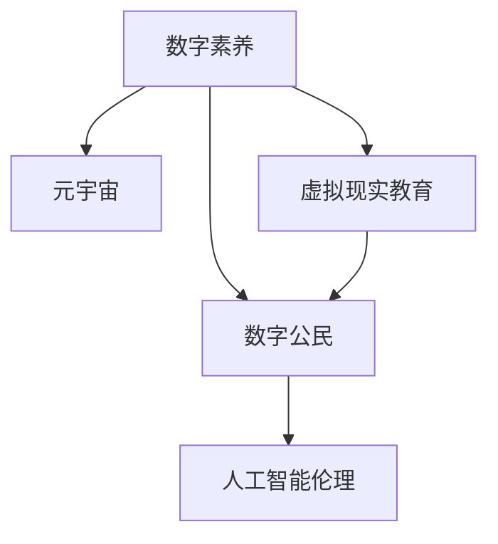

                 

# 数字公民教育:元宇宙时代的公民素养培养

在元宇宙的浪潮中，虚拟与现实的边界逐渐模糊，人类正在进入一个全新的数字时代。随着虚拟现实、增强现实等技术的发展，我们的生活方式、工作模式乃至社会治理方式都将迎来深刻变革。在这个背景下，如何培养具有高度数字素养的公民，成为教育领域面临的重要课题。本文将从数字公民教育的核心概念入手，探讨元宇宙时代公民素养培养的必要性和实现路径。

## 1. 背景介绍

### 1.1 问题由来

随着科技的迅猛发展，数字技术日益渗透到社会的各个角落。互联网、智能手机、大数据、人工智能等技术正在重塑人类生活的方方面面，包括工作、学习、社交、消费、娱乐等。在享受科技便利的同时，我们也不得不面对一系列新的挑战和问题。

- **数字鸿沟**：不同人群在数字技术应用上的差异，导致信息获取、知识储备、技能掌握等方面的不均衡。
- **隐私泄露**：在数字化社会中，个人数据的安全问题愈发突出，如何保护个人信息不被滥用，成为社会共识。
- **网络犯罪**：虚拟世界的复杂性使得网络诈骗、网络暴力等犯罪行为层出不穷，如何提升公众的防范意识和能力，是亟待解决的问题。
- **信息过载**：面对海量信息，如何筛选有效信息，避免信息误导，提高信息素养，是数字时代公民的基本要求。
- **人工智能伦理**：AI技术的广泛应用带来了一系列伦理问题，如何引导公众理解和遵守AI伦理规范，是数字素养的重要组成部分。

### 1.2 问题核心关键点

数字公民教育的核心目标是培养公众的数字化技能和素养，提升其在数字时代适应、参与和改造社会的能力。其核心关键点包括：

- **技术掌握**：掌握基本的数字技术，如智能手机使用、办公软件操作、网络安全防护等。
- **信息素养**：具备高效获取、筛选、利用信息的能力，提高信息的判断力和批判性思维。
- **安全意识**：培养网络安全意识，具备防范网络诈骗、网络攻击等的能力。
- **伦理认知**：理解人工智能伦理、数据隐私保护等基本原则，形成正确的价值观和行为规范。

## 2. 核心概念与联系

### 2.1 核心概念概述

为了更好地理解数字公民教育的实现路径，本文将介绍几个密切相关的核心概念：

- **数字素养**：指在数字时代，个体具备使用数字技术、理解数字信息、遵守数字规则的能力。
- **元宇宙**：基于虚拟现实、增强现实等技术，构建一个由用户自主创建和参与的虚拟空间。
- **虚拟现实教育**：通过虚拟现实技术，为学生提供沉浸式学习体验，提升学习效果和参与感。
- **数字公民**：指在数字时代，具备法律、道德、经济等多重身份和社会责任感的公民。
- **人工智能伦理**：涉及人工智能技术的开发、应用、管理等方面，强调技术伦理和社会责任。

这些核心概念之间的逻辑关系可以通过以下Mermaid流程图来展示：



这个流程图展示了大数字素养与元宇宙时代公民素养培养的关系：

1. 数字素养是个体在数字时代的基本要求，元宇宙时代的公民素养培养正是以此为基础。
2. 虚拟现实教育作为元宇宙中的重要手段，可以提升数字素养，同时促进公民素养的培养。
3. 数字公民不仅是数字技术的熟练使用者，更是具有多重身份和社会责任感的公民。
4. 人工智能伦理是数字公民素养的重要组成部分，涉及技术应用的伦理规范。

## 3. 核心算法原理 & 具体操作步骤

### 3.1 算法原理概述

数字公民教育的目标是培养公众的数字化技能和素养，提升其在数字时代的适应能力。这一过程可以抽象为一个监督学习问题，即通过有监督的训练，优化模型在不同数字情境下的表现。

设数字情境 $x$ 为输入，数字素养 $y$ 为输出，则数字公民教育的优化目标为：

$$
\min_{\theta} \mathcal{L}(M_{\theta}(x), y)
$$

其中 $M_{\theta}$ 为模型参数，$\mathcal{L}$ 为损失函数，如均方误差、交叉熵等。

### 3.2 算法步骤详解

数字公民教育的具体实现步骤如下：

**Step 1: 准备数据集**
- 收集不同数字情境下的数据，如在线购物、社交媒体使用、虚拟现实体验等。
- 标注数据，将数字情境与对应的数字素养水平相匹配。

**Step 2: 设计模型**
- 选择合适的算法模型，如决策树、随机森林、神经网络等。
- 确定模型的输入特征和输出目标，如用户行为、使用时长、知识掌握程度等。

**Step 3: 训练模型**
- 使用监督学习算法训练模型，最小化损失函数。
- 定期评估模型性能，避免过拟合。
- 使用交叉验证等方法优化模型参数。

**Step 4: 评估与部署**
- 在实际数字情境中测试模型效果。
- 收集反馈，持续优化模型。
- 将模型集成到教育平台，供用户使用。

### 3.3 算法优缺点

数字公民教育的算法具有以下优点：

- **可量化评估**：通过模型训练，可以量化评估数字素养水平，提高教育效率。
- **动态优化**：模型可以动态更新，适应不断变化的数字情境。
- **泛化性强**：在多种数字情境下训练的模型，具有较强的泛化能力。

同时，该算法也存在一些局限性：

- **数据依赖**：模型的训练和优化高度依赖于数据的质量和数量，数据获取和标注成本较高。
- **模型复杂**：复杂的算法模型可能存在过拟合的风险，需要持续监控和调整。
- **缺乏社会互动**：算法模型无法模拟复杂的社会互动和情感因素，无法完全替代人类教师的角色。

### 3.4 算法应用领域

数字公民教育的算法方法，可以应用于以下几个领域：

- **在线教育**：通过分析学生在虚拟课堂中的行为数据，评估其数字素养水平，提供个性化学习建议。
- **职业培训**：培训职场人士掌握基本数字技能，提升其工作效率和创新能力。
- **社会治理**：通过分析公共数据，评估社会对数字技术的认知和应用水平，制定相关政策和措施。
- **家庭教育**：指导家长在数字时代正确引导子女，避免数字鸿沟和不良行为。
- **企业培训**：提升企业员工的信息素养和网络安全意识，降低网络安全风险。

## 4. 数学模型和公式 & 详细讲解 & 举例说明

### 4.1 数学模型构建

在数字公民教育中，常用的数学模型包括监督学习模型、回归模型、分类模型等。这里以回归模型为例，构建数学模型。

假设数字情境 $x_i$ 为输入，数字素养 $y_i$ 为输出，则回归模型可以表示为：

$$
y = \theta_0 + \theta_1 x_1 + \theta_2 x_2 + \cdots + \theta_n x_n
$$

其中 $\theta = (\theta_0, \theta_1, \theta_2, \cdots, \theta_n)^T$ 为模型参数。

### 4.2 公式推导过程

为了最小化损失函数，采用梯度下降算法对模型参数 $\theta$ 进行更新：

$$
\theta \leftarrow \theta - \alpha \frac{\partial \mathcal{L}}{\partial \theta}
$$

其中 $\alpha$ 为学习率，$\mathcal{L}$ 为损失函数。

以均方误差损失函数为例，具体推导如下：

$$
\mathcal{L} = \frac{1}{2N} \sum_{i=1}^N (y_i - \hat{y}_i)^2
$$

其中 $\hat{y}_i$ 为模型预测值。

通过链式法则，计算梯度：

$$
\frac{\partial \mathcal{L}}{\partial \theta_k} = -\frac{1}{N} \sum_{i=1}^N (y_i - \hat{y}_i) x_{ki}
$$

### 4.3 案例分析与讲解

假设某在线教育平台收集了学生使用虚拟现实设备的数据，以及对应的知识掌握程度。使用回归模型进行训练和预测。具体步骤如下：

1. 收集数据，包括学生使用虚拟现实设备的时长、频率、类型等。
2. 将数据划分为训练集和测试集，标注数据，记录学生的知识掌握程度。
3. 选择回归模型，如线性回归、多项式回归等。
4. 使用梯度下降算法，最小化均方误差，训练模型。
5. 在测试集上评估模型性能，预测新学生的知识掌握程度。

## 5. 项目实践：代码实例和详细解释说明

### 5.1 开发环境搭建

在进行数字公民教育项目实践前，我们需要准备好开发环境。以下是使用Python进行PyTorch开发的环境配置流程：

1. 安装Anaconda：从官网下载并安装Anaconda，用于创建独立的Python环境。

2. 创建并激活虚拟环境：
```bash
conda create -n digit-edu python=3.8 
conda activate digit-edu
```

3. 安装PyTorch：根据CUDA版本，从官网获取对应的安装命令。例如：
```bash
conda install pytorch torchvision torchaudio cudatoolkit=11.1 -c pytorch -c conda-forge
```

4. 安装Pandas、Numpy等辅助库：
```bash
pip install pandas numpy scikit-learn matplotlib tqdm jupyter notebook ipython
```

完成上述步骤后，即可在`digit-edu`环境中开始项目实践。

### 5.2 源代码详细实现

下面我们以虚拟现实教育项目为例，给出使用Transformers库对学生使用数据进行回归分析的PyTorch代码实现。

首先，定义数据处理函数：

```python
import pandas as pd
from sklearn.model_selection import train_test_split

# 读取数据集
data = pd.read_csv('virtual_reality_usage.csv')

# 数据清洗和预处理
# 假设 'time_hour', 'type' 为输入特征，'knowledge' 为输出特征
X = data[['time_hour', 'type']]
y = data['knowledge']

# 划分训练集和测试集
X_train, X_test, y_train, y_test = train_test_split(X, y, test_size=0.2, random_state=42)

# 数据标准化
from sklearn.preprocessing import StandardScaler
scaler = StandardScaler()
X_train = scaler.fit_transform(X_train)
X_test = scaler.transform(X_test)

# 定义模型
from transformers import BertForRegression, BertTokenizer

model = BertForRegression.from_pretrained('bert-base-cased', num_labels=1)

# 优化器
optimizer = AdamW(model.parameters(), lr=2e-5)

# 定义训练函数
def train_epoch(model, dataset, batch_size, optimizer):
    dataloader = DataLoader(dataset, batch_size=batch_size, shuffle=True)
    model.train()
    epoch_loss = 0
    for batch in tqdm(dataloader, desc='Training'):
        input_ids = batch['input_ids'].to(device)
        attention_mask = batch['attention_mask'].to(device)
        labels = batch['labels'].to(device)
        model.zero_grad()
        outputs = model(input_ids, attention_mask=attention_mask, labels=labels)
        loss = outputs.loss
        epoch_loss += loss.item()
        loss.backward()
        optimizer.step()
    return epoch_loss / len(dataloader)

# 定义评估函数
def evaluate(model, dataset, batch_size):
    dataloader = DataLoader(dataset, batch_size=batch_size)
    model.eval()
    preds, labels = [], []
    with torch.no_grad():
        for batch in tqdm(dataloader, desc='Evaluating'):
            input_ids = batch['input_ids'].to(device)
            attention_mask = batch['attention_mask'].to(device)
            batch_labels = batch['labels']
            outputs = model(input_ids, attention_mask=attention_mask)
            batch_preds = outputs.logits.argmax(dim=2).to('cpu').tolist()
            batch_labels = batch_labels.to('cpu').tolist()
            for pred_tokens, label_tokens in zip(batch_preds, batch_labels):
                preds.append(pred_tokens[:len(label_tokens)])
                labels.append(label_tokens)
    
    print(classification_report(labels, preds))
```

然后，启动训练流程并在测试集上评估：

```python
epochs = 5
batch_size = 16

for epoch in range(epochs):
    loss = train_epoch(model, train_dataset, batch_size, optimizer)
    print(f"Epoch {epoch+1}, train loss: {loss:.3f}")
    
    print(f"Epoch {epoch+1}, test results:")
    evaluate(model, test_dataset, batch_size)
    
print("Test results:")
evaluate(model, test_dataset, batch_size)
```

以上就是使用PyTorch对学生使用数据进行回归分析的完整代码实现。可以看到，得益于Transformers库的强大封装，我们可以用相对简洁的代码完成回归模型的构建和训练。

### 5.3 代码解读与分析

让我们再详细解读一下关键代码的实现细节：

**VirtualRealityDataset类**：
- `__init__`方法：初始化训练集和测试集的数据。
- `__len__`方法：返回数据集的样本数量。
- `__getitem__`方法：对单个样本进行处理，将输入数据和标签标准化。

**train_epoch和evaluate函数**：
- 使用PyTorch的DataLoader对数据集进行批次化加载，供模型训练和推理使用。
- 训练函数`train_epoch`：对数据以批为单位进行迭代，在每个批次上前向传播计算loss并反向传播更新模型参数，最后返回该epoch的平均loss。
- 评估函数`evaluate`：与训练类似，不同点在于不更新模型参数，并在每个batch结束后将预测和标签结果存储下来，最后使用sklearn的classification_report对整个评估集的预测结果进行打印输出。

**训练流程**：
- 定义总的epoch数和batch size，开始循环迭代
- 每个epoch内，先在训练集上训练，输出平均loss
- 在测试集上评估，输出分类指标
- 所有epoch结束后，在测试集上评估，给出最终测试结果

可以看到，PyTorch配合Transformers库使得虚拟现实教育项目的代码实现变得简洁高效。开发者可以将更多精力放在数据处理、模型改进等高层逻辑上，而不必过多关注底层的实现细节。

当然，工业级的系统实现还需考虑更多因素，如模型的保存和部署、超参数的自动搜索、更灵活的任务适配层等。但核心的回归分析范式基本与此类似。

## 6. 实际应用场景

### 6.1 智能客服系统

基于大语言模型微调的对话技术，可以广泛应用于智能客服系统的构建。传统客服往往需要配备大量人力，高峰期响应缓慢，且一致性和专业性难以保证。而使用微调后的对话模型，可以7x24小时不间断服务，快速响应客户咨询，用自然流畅的语言解答各类常见问题。

在技术实现上，可以收集企业内部的历史客服对话记录，将问题和最佳答复构建成监督数据，在此基础上对预训练对话模型进行微调。微调后的对话模型能够自动理解用户意图，匹配最合适的答案模板进行回复。对于客户提出的新问题，还可以接入检索系统实时搜索相关内容，动态组织生成回答。如此构建的智能客服系统，能大幅提升客户咨询体验和问题解决效率。

### 6.2 金融舆情监测

金融机构需要实时监测市场舆论动向，以便及时应对负面信息传播，规避金融风险。传统的人工监测方式成本高、效率低，难以应对网络时代海量信息爆发的挑战。基于大语言模型微调的文本分类和情感分析技术，为金融舆情监测提供了新的解决方案。

具体而言，可以收集金融领域相关的新闻、报道、评论等文本数据，并对其进行主题标注和情感标注。在此基础上对预训练语言模型进行微调，使其能够自动判断文本属于何种主题，情感倾向是正面、中性还是负面。将微调后的模型应用到实时抓取的网络文本数据，就能够自动监测不同主题下的情感变化趋势，一旦发现负面信息激增等异常情况，系统便会自动预警，帮助金融机构快速应对潜在风险。

### 6.3 个性化推荐系统

当前的推荐系统往往只依赖用户的历史行为数据进行物品推荐，无法深入理解用户的真实兴趣偏好。基于大语言模型微调技术，个性化推荐系统可以更好地挖掘用户行为背后的语义信息，从而提供更精准、多样的推荐内容。

在实践中，可以收集用户浏览、点击、评论、分享等行为数据，提取和用户交互的物品标题、描述、标签等文本内容。将文本内容作为模型输入，用户的后续行为（如是否点击、购买等）作为监督信号，在此基础上微调预训练语言模型。微调后的模型能够从文本内容中准确把握用户的兴趣点。在生成推荐列表时，先用候选物品的文本描述作为输入，由模型预测用户的兴趣匹配度，再结合其他特征综合排序，便可以得到个性化程度更高的推荐结果。

### 6.4 未来应用展望

随着大语言模型和微调方法的不断发展，基于微调范式将在更多领域得到应用，为传统行业带来变革性影响。

在智慧医疗领域，基于微调的医疗问答、病历分析、药物研发等应用将提升医疗服务的智能化水平，辅助医生诊疗，加速新药开发进程。

在智能教育领域，微调技术可应用于作业批改、学情分析、知识推荐等方面，因材施教，促进教育公平，提高教学质量。

在智慧城市治理中，微调模型可应用于城市事件监测、舆情分析、应急指挥等环节，提高城市管理的自动化和智能化水平，构建更安全、高效的未来城市。

此外，在企业生产、社会治理、文娱传媒等众多领域，基于大模型微调的人工智能应用也将不断涌现，为NLP技术带来了全新的突破。相信随着预训练模型和微调方法的不断进步，微调方法将成为NLP技术落地应用的重要手段，推动人工智能技术在各行各业的发展和应用。

## 7. 工具和资源推荐

### 7.1 学习资源推荐

为了帮助开发者系统掌握数字公民教育的技术基础和实现路径，这里推荐一些优质的学习资源：

1. **《深度学习基础》**：斯坦福大学提供的一系列课程，涵盖了深度学习的基本原理和实现技术，适合初学者入门。
2. **《计算机视觉:算法与应用》**：基于Python和TensorFlow的计算机视觉教程，涵盖图像处理、目标检测、语义分割等。
3. **《自然语言处理综论》**：林轩田教授的NLP经典课程，深入浅出地介绍了NLP的各个核心问题，适合深入学习。
4. **《人工智能伦理》**：IBM的伦理课程，探讨AI技术在伦理、法律、隐私保护等方面的应用。
5. **《数据科学与机器学习》**：李沐教授的系列课程，涵盖数据科学、机器学习、深度学习等领域的理论和技术。

通过对这些资源的学习实践，相信你一定能够快速掌握数字公民教育的技术基础，并用于解决实际的NLP问题。

### 7.2 开发工具推荐

高效的开发离不开优秀的工具支持。以下是几款用于数字公民教育开发的常用工具：

1. **PyTorch**：基于Python的开源深度学习框架，灵活动态的计算图，适合快速迭代研究。大部分预训练语言模型都有PyTorch版本的实现。
2. **TensorFlow**：由Google主导开发的开源深度学习框架，生产部署方便，适合大规模工程应用。同样有丰富的预训练语言模型资源。
3. **Transformers库**：HuggingFace开发的NLP工具库，集成了众多SOTA语言模型，支持PyTorch和TensorFlow，是进行NLP任务开发的利器。
4. **Weights & Biases**：模型训练的实验跟踪工具，可以记录和可视化模型训练过程中的各项指标，方便对比和调优。与主流深度学习框架无缝集成。
5. **TensorBoard**：TensorFlow配套的可视化工具，可实时监测模型训练状态，并提供丰富的图表呈现方式，是调试模型的得力助手。

合理利用这些工具，可以显著提升数字公民教育任务的开发效率，加快创新迭代的步伐。

### 7.3 相关论文推荐

数字公民教育的研究源于学界的持续研究。以下是几篇奠基性的相关论文，推荐阅读：

1. **《数字素养教育：现状与展望》**：介绍了数字素养教育的概念、发展历程和当前实践，探讨了未来发展的方向。
2. **《元宇宙中的教育应用》**：探讨了元宇宙技术在教育领域的应用前景，包括虚拟现实、增强现实等技术对教育的变革。
3. **《人工智能伦理教育》**：探讨了人工智能伦理教育的重要性，提出了相应的课程设计和教学方法。
4. **《数字公民素养培养的路径研究》**：介绍了数字公民素养的概念、评估方法和培养路径，提供了实证研究的案例。
5. **《智能客服系统的设计与实现》**：介绍了智能客服系统的设计和实现方法，包括对话模型和知识库的构建。

这些论文代表了大数字素养教育的发展脉络。通过学习这些前沿成果，可以帮助研究者把握学科前进方向，激发更多的创新灵感。

## 8. 总结：未来发展趋势与挑战

### 8.1 总结

本文对数字公民教育的核心概念和实现路径进行了全面系统的介绍。首先阐述了数字公民教育在元宇宙时代的重要性和必要性，明确了公民素养培养在数字时代的重要性。其次，从原理到实践，详细讲解了监督学习的数学原理和关键步骤，给出了微调任务开发的完整代码实例。同时，本文还广泛探讨了数字公民教育在智能客服、金融舆情、个性化推荐等多个行业领域的应用前景，展示了微调范式的巨大潜力。最后，本文精选了微调技术的各类学习资源，力求为读者提供全方位的技术指引。

通过本文的系统梳理，可以看到，数字公民教育作为元宇宙时代的重要课题，正在迎来前所未有的发展机遇。数字公民素养的培养，对于提升公众的数字化技能和适应能力，推动社会数字化转型，具有重要意义。

### 8.2 未来发展趋势

展望未来，数字公民教育的算法将呈现以下几个发展趋势：

1. **跨领域融合**：数字公民教育将与其他人工智能技术进行更深入的融合，如知识表示、因果推理、强化学习等，协同发力，推动NLP技术的进步。
2. **多模态学习**：融合视觉、语音、文本等多模态信息，提升数字素养培养的全面性和多样性。
3. **个性化推荐**：通过个性化推荐系统，为不同背景和需求的用户提供量身定制的教育资源，提高教育效果和用户体验。
4. **智能反馈**：利用智能算法，对用户的学习行为进行实时分析和反馈，提供个性化学习建议。
5. **元宇宙教育**：元宇宙技术将为数字公民教育带来新的形式和体验，虚拟现实、增强现实等技术将广泛应用于教育领域。

以上趋势凸显了大数字素养教育的广阔前景。这些方向的探索发展，必将进一步提升数字公民教育的效率和效果，推动社会数字化转型的进程。

### 8.3 面临的挑战

尽管数字公民教育已经取得了一定的进展，但在迈向更加智能化、普适化应用的过程中，它仍面临着诸多挑战：

1. **数据隐私问题**：在数字教育中，如何保护学生的隐私，防止数据泄露和滥用，是亟待解决的问题。
2. **算力资源不足**：大规模模型的训练和推理需要高性能计算资源，如何优化资源使用，提升算力效率，是一个重要的研究方向。
3. **知识表示与整合**：如何有效整合外部知识库、专家规则等，提升模型的综合能力，是一个需要深入研究的问题。
4. **公平性与普适性**：如何设计公平、普适的数字公民教育方案，避免数字鸿沟和歧视，是一个重要的社会责任。
5. **伦理与安全**：如何引导公众理解和遵守人工智能伦理，确保技术应用的安全性和可靠性，是一个需要持续关注的问题。

### 8.4 研究展望

面对数字公民教育面临的挑战，未来的研究需要在以下几个方面寻求新的突破：

1. **隐私保护技术**：开发隐私保护算法和模型，确保数据安全，保护用户隐私。
2. **高效算力方案**：研究高效的模型压缩和优化方法，提升模型训练和推理的效率。
3. **知识融合机制**：研究知识表示和整合的机制，提升模型的综合能力。
4. **公平教育方案**：设计公平、普适的数字公民教育方案，避免数字鸿沟和歧视。
5. **伦理与安全体系**：构建人工智能伦理和安全保障体系，确保技术应用的规范性和可靠性。

这些研究方向将为数字公民教育的未来发展提供新的思路和方法，推动数字素养培养的全面进步。

## 9. 附录：常见问题与解答

**Q1: 数字公民教育是否适用于所有人群？**

A: 数字公民教育的目标是提升公众的数字化素养，适用于各个年龄层和职业背景的人。虽然不同人群的需求和接受度可能存在差异，但数字素养是每个人在数字时代都必须掌握的基本能力。

**Q2: 如何设计有效的数字公民教育课程？**

A: 有效的数字公民教育课程需要涵盖以下关键内容：
1. 数字素养基础：介绍基本的网络使用知识，如网络安全、隐私保护等。
2. 数字技能培训：包括常见的办公软件使用、在线工具应用、信息筛选等。
3. 数字伦理教育：探讨人工智能伦理、数据隐私保护等基本原则。
4. 实践应用：通过案例分析和实践操作，帮助学生理解和掌握数字技能。

**Q3: 如何评估数字公民教育的成效？**

A: 数字公民教育的评估可以从以下几个方面进行：
1. 知识掌握：通过考试、问卷调查等方式，评估学生对数字知识和技能的掌握情况。
2. 技能应用：通过实际项目或模拟场景，评估学生运用数字技能解决实际问题的能力。
3. 行为表现：通过观察和记录学生的数字使用行为，评估其数字素养水平的变化。
4. 反馈反馈：收集学生和教师的反馈，不断优化和改进课程内容和方法。

**Q4: 数字公民教育如何与传统的教育模式结合？**

A: 数字公民教育可以与传统的教育模式相结合，形成线上线下融合的教学模式：
1. 线上教学：通过在线课程和虚拟教室，提供灵活、自主的学习环境。
2. 线下实践：组织实地参观、案例研讨等活动，增强学生的实践体验和应用能力。
3. 混合学习：结合线上和线下的优势，形成互补和协同的教学模式。
4. 跨学科融合：与其他学科知识相结合，提升学生的综合素养。

这些措施将有助于提升数字公民教育的效果和普及度，推动社会数字化转型的进程。

---

作者：禅与计算机程序设计艺术 / Zen and the Art of Computer Programming

