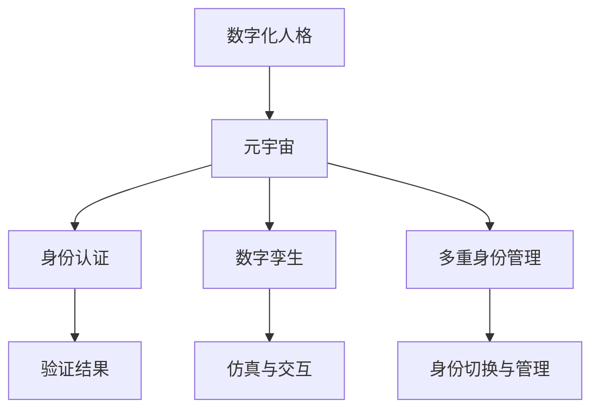

                 

# 数字化人格:元宇宙中的多重身份构建

> 关键词：数字化人格, 元宇宙, 虚拟身份, 身份认证, 多身份管理, 数字孪生, 隐私保护

## 1. 背景介绍

### 1.1 问题由来
随着科技的进步，特别是互联网和人工智能的发展，数字世界已经变得越来越丰富和真实。人们在数字世界的活动和互动，不再仅仅是简单的信息交换，而是逐步形成了更为复杂和个性化的数字化身份和人格。

元宇宙的兴起更是加速了这一趋势。元宇宙是一个以虚拟空间为载体的数字化宇宙，它不仅仅是游戏和虚拟世界的集合，更是融合了工作、教育、社交、娱乐等多元化的数字生态。在这个虚拟世界中，人们可以拥有多个数字化身份，这些身份在虚拟空间中的表现和互动，逐渐形成了各自的数字化人格。

然而，数字化人格的构建和管理，面临着诸多挑战。如何在元宇宙中实现身份的平滑过渡和多重身份的灵活管理，如何保护用户的隐私和数据安全，如何构建可信的身份认证机制，这些问题成为构建数字化身份系统的核心议题。本文将深入探讨这些关键问题，并给出解决方案。

### 1.2 问题核心关键点
本文将从以下几个核心关键点进行深入探讨：
1. **身份认证与验证**：如何在元宇宙中实现安全、高效的数字化身份认证。
2. **隐私保护与数据管理**：如何在身份认证中保护用户隐私，同时方便用户进行数据管理。
3. **多重身份管理**：如何在元宇宙中实现用户多重身份的灵活管理和切换。
4. **数字孪生技术**：如何通过数字孪生技术，增强用户数字化身份的真实感和互动性。
5. **未来的应用展望**：探讨数字化人格在元宇宙中的应用前景，以及面临的挑战和解决方案。

这些关键点将帮助我们构建一个安全、高效、灵活且富有真实感的数字化身份系统，为元宇宙中的多重身份构建提供有力支持。

## 2. 核心概念与联系

### 2.1 核心概念概述

为了更好地理解元宇宙中的多重身份构建，我们首先需要明确几个核心概念及其相互关系：

1. **数字化人格(Digital Persona)**：是指用户在数字世界中的虚拟身份，其行为和表现具有一定的一致性和独特性，并随着时间的推移逐渐形成。
2. **元宇宙(Metaverse)**：是由多个虚拟世界构成的数字宇宙，其中包含各种社交、娱乐、商业等活动。
3. **身份认证(Identity Verification)**：是指通过各种手段验证用户身份的过程，确保用户行为的真实性和可信性。
4. **数字孪生(Digital Twin)**：是指通过技术手段，将现实世界中的个体或系统在数字世界中构建出镜像，以实现对现实世界的仿真和交互。
5. **多重身份管理(Multifaceted Identity Management)**：是指在元宇宙中，用户可以拥有多个虚拟身份，并能够在不同场景下进行灵活切换和管理。

这些概念之间存在紧密的联系，共同构成了元宇宙中数字化身份系统的基础框架。以下通过Mermaid流程图展示这些核心概念之间的关系：



### 2.2 核心概念原理和架构

为了更好地理解这些核心概念的原理和架构，我们将通过几个关键的模型和算法进行详细讲解。

**2.2.1 身份认证模型**
身份认证是构建数字化身份系统的第一步，其目的是验证用户的真实性和可信性。常用的身份认证手段包括：

- **用户名和密码**：是最基本也是最常见的身份认证方式。用户输入用户名和密码，通过服务器验证后，进入虚拟世界。
- **双因素认证(2FA)**：结合了用户名和密码，增加了短信验证码、指纹、面部识别等验证方式，提高了安全性。
- **区块链身份认证**：利用区块链技术，将用户的身份信息和行为记录存储在区块链上，确保其不可篡改和可追溯性。
- **零知识证明(Zero-Knowledge Proof)**：允许用户在不透露真实身份信息的情况下，证明其拥有某个身份。

**2.2.2 数字孪生架构**
数字孪生技术是将现实世界中的个体或系统在数字世界中构建出镜像，实现对现实世界的仿真和交互。其架构通常包括以下几个组件：

- **数据采集与传输**：通过传感器等手段，采集现实世界的物理数据和状态信息，并通过网络传输到数字世界中。
- **数字建模与仿真**：在数字世界中，构建与现实世界物理结构相似的数字模型，并对其进行仿真和模拟。
- **交互与控制**：通过数字孪生技术，实现现实世界与数字世界之间的双向交互和控制。

**2.2.3 多重身份管理架构**
在元宇宙中，用户可以拥有多个虚拟身份，并在不同场景下进行灵活切换和管理。其管理架构通常包括以下几个组件：

- **身份存储与检索**：将用户的多个虚拟身份存储在身份库中，并通过唯一标识符进行检索。
- **身份切换与同步**：通过身份切换机制，用户可以在不同虚拟身份之间进行快速切换，并保持数据和状态的一致性。
- **权限管理与授权**：根据用户的不同身份，设置不同的权限和授权，确保其在不同场景下拥有适当的访问权限。

## 3. 核心算法原理 & 具体操作步骤
### 3.1 算法原理概述

在元宇宙中构建数字化身份，涉及身份认证、数据管理和身份切换等核心算法。这些算法共同作用，实现了用户在虚拟世界中的安全、高效和灵活的互动。

**3.1.1 身份认证算法**
身份认证算法是构建数字化身份系统的关键。其核心目标是验证用户身份的真实性和可信性，常用的算法包括：

- **基于密码的身份认证**：通过用户名和密码进行身份验证，简单易用。
- **基于生物特征的身份认证**：利用指纹、面部识别等生物特征，提高安全性。
- **基于区块链的身份认证**：利用区块链技术，确保身份信息的不可篡改和可追溯性。
- **基于零知识证明的身份认证**：允许用户在不透露真实身份信息的情况下，证明其拥有某个身份。

**3.1.2 数据管理算法**
数据管理算法用于保护用户隐私和数据安全，同时方便用户进行数据管理。常用的算法包括：

- **数据加密与解密**：利用加密算法对数据进行加密，防止数据泄露。
- **数据脱敏与去标识化**：对敏感数据进行脱敏和去标识化处理，保护用户隐私。
- **数据备份与恢复**：定期备份用户数据，并在需要时进行恢复，确保数据安全。
- **数据访问控制**：根据用户的身份，设置不同的数据访问权限，确保数据安全性。

**3.1.3 身份切换算法**
身份切换算法用于实现用户多重身份的灵活管理和切换。常用的算法包括：

- **基于角色的身份切换**：根据用户在不同场景下的角色，切换相应的虚拟身份。
- **基于情境的身份切换**：根据用户在不同情境下的需求，切换相应的虚拟身份。
- **基于授权的身份切换**：根据用户在不同场景下的权限，切换相应的虚拟身份。

### 3.2 算法步骤详解

接下来，我们将详细讲解身份认证、数据管理和身份切换等算法的详细步骤。

**3.2.1 身份认证步骤**
身份认证过程包括以下几个步骤：

1. **用户登录**：用户输入用户名和密码，发送到服务器进行验证。
2. **服务器验证**：服务器对用户输入的用户名和密码进行验证，确认其真实性和可信性。
3. **生成验证结果**：根据验证结果，生成验证结果，如成功或失败。
4. **返回验证结果**：将验证结果返回给用户，决定是否允许其进入虚拟世界。

**3.2.2 数据管理步骤**
数据管理过程包括以下几个步骤：

1. **数据采集**：通过传感器等手段，采集现实世界的物理数据和状态信息。
2. **数据加密**：利用加密算法对数据进行加密，防止数据泄露。
3. **数据存储**：将加密后的数据存储在数字世界中。
4. **数据访问控制**：根据用户的身份，设置不同的数据访问权限，确保数据安全性。
5. **数据备份与恢复**：定期备份用户数据，并在需要时进行恢复，确保数据安全。

**3.2.3 身份切换步骤**
身份切换过程包括以下几个步骤：

1. **角色和情境分析**：根据用户在不同场景下的角色和情境，选择合适的虚拟身份。
2. **身份切换**：根据选择的虚拟身份，进行身份切换操作。
3. **状态同步**：确保切换后的虚拟身份能够继承切换前的状态，如聊天记录、设备状态等。
4. **权限授权**：根据用户的身份，设置相应的权限和授权，确保其在不同场景下拥有适当的访问权限。

### 3.3 算法优缺点

**3.3.1 身份认证算法的优缺点**
- **优点**：简单易用，易于实现。能够提供一定的安全性，防止未授权访问。
- **缺点**：易受到暴力破解和钓鱼攻击。密码泄露可能导致严重的身份安全问题。

**3.3.2 数据管理算法的优缺点**
- **优点**：能够保护用户隐私和数据安全，防止数据泄露。便于用户进行数据管理和恢复。
- **缺点**：加密和解密过程可能影响数据访问效率。数据备份和恢复需要占用额外资源。

**3.3.3 身份切换算法的优缺点**
- **优点**：能够实现用户多重身份的灵活管理和切换，提高用户体验。能够根据用户角色和情境进行身份切换，确保用户在不同场景下拥有适当的访问权限。
- **缺点**：身份切换过程可能带来一定的复杂性，用户需要掌握多个虚拟身份。身份切换和状态同步需要处理复杂的数据关系。

### 3.4 算法应用领域

数字化身份构建和管理的算法已经在多个领域得到了广泛应用，例如：

- **社交媒体**：用户可以在不同社交平台上拥有多个虚拟身份，进行灵活切换和管理。
- **金融服务**：用户在金融平台上可以拥有多个虚拟身份，进行投资、交易、贷款等操作。
- **电子商务**：用户在电子商务平台上可以拥有多个虚拟身份，进行购物、评价、客服等操作。
- **娱乐与游戏**：用户在虚拟游戏世界中可以拥有多个虚拟身份，进行角色扮演、游戏交互等操作。

这些领域的应用展示了身份认证、数据管理和身份切换等算法的广泛性和实用性。通过这些算法，用户能够在虚拟世界中获得更丰富和灵活的互动体验。

## 4. 数学模型和公式 & 详细讲解
### 4.1 数学模型构建

为了更好地理解数字化身份构建和管理的数学模型，我们将通过以下几个数学模型进行详细讲解：

**4.1.1 身份认证模型**
身份认证模型通常包括以下几个变量：

- **用户名**：用于验证用户身份的用户名。
- **密码**：用于验证用户身份的密码。
- **身份标识符**：用于唯一标识用户的身份标识符。

其数学模型可以表示为：

$$
\mathcal{M} = \{ (\text{Username}, \text{Password}, \text{ID}) \}
$$

**4.1.2 数据管理模型**
数据管理模型通常包括以下几个变量：

- **数据项**：需要管理的物理数据和状态信息。
- **加密算法**：用于对数据进行加密的算法。
- **存储位置**：存储加密后的数据的数字世界位置。
- **访问权限**：根据用户身份设置的不同访问权限。

其数学模型可以表示为：

$$
\mathcal{M} = \{ (\text{DataItem}, \text{EncryptionAlgorithm}, \text{StorageLocation}, \text{AccessPerm}) \}
$$

**4.1.3 身份切换模型**
身份切换模型通常包括以下几个变量：

- **虚拟身份**：用户在不同场景下的虚拟身份。
- **切换条件**：根据用户角色和情境进行身份切换的条件。
- **状态同步**：切换后虚拟身份的状态继承。
- **权限授权**：根据用户身份设置的不同权限和授权。

其数学模型可以表示为：

$$
\mathcal{M} = \{ (\text{Identity}, \text{SwitchConditions}, \text{StateSync}, \text{PermAuthorization}) \}
$$

### 4.2 公式推导过程

接下来，我们将对以上数学模型进行公式推导过程的讲解。

**4.2.1 身份认证公式推导**
身份认证公式可以表示为：

$$
\mathcal{L} = \{ (\text{Username}, \text{Password}, \text{ID}) \mid \text{Verify(Username, Password)} \}
$$

其中，Verify(Username, Password)表示验证用户名和密码的过程。

**4.2.2 数据管理公式推导**
数据管理公式可以表示为：

$$
\mathcal{L} = \{ (\text{DataItem}, \text{EncryptionAlgorithm}, \text{StorageLocation}, \text{AccessPerm}) \mid \text{Encrypt(DataItem)} \}
$$

其中，Encrypt(DataItem)表示对数据进行加密的过程。

**4.2.3 身份切换公式推导**
身份切换公式可以表示为：

$$
\mathcal{L} = \{ (\text{Identity}, \text{SwitchConditions}, \text{StateSync}, \text{PermAuthorization}) \mid \text{SwitchIdentity(Identity, SwitchConditions)} \}
$$

其中，SwitchIdentity(Identity, SwitchConditions)表示根据用户角色和情境进行身份切换的过程。

### 4.3 案例分析与讲解

接下来，我们将通过几个实际案例，对以上数学模型进行详细分析。

**4.3.1 身份认证案例分析**
假设用户在社交平台上进行身份认证，其用户名和密码分别为"user123"和"password123"。在服务器验证后，生成验证结果，如"success"。

**4.3.2 数据管理案例分析**
假设用户在金融平台上进行数据管理，需要管理的物理数据为账户余额和交易记录。通过加密算法进行加密，存储在数字世界中的位置为"user finance data"。根据用户身份，设置不同的访问权限，确保数据安全性。

**4.3.3 身份切换案例分析**
假设用户在虚拟游戏世界中进行角色扮演，需要切换多个虚拟身份。根据用户角色和情境，选择合适的虚拟身份。切换后的虚拟身份能够继承切换前的状态，如聊天记录和设备状态。根据用户的身份，设置相应的权限和授权，确保其在不同场景下拥有适当的访问权限。

## 5. 项目实践：代码实例和详细解释说明
### 5.1 开发环境搭建

在进行数字化身份构建和管理的项目实践前，我们需要准备好开发环境。以下是使用Python进行开发的环境配置流程：

1. 安装Anaconda：从官网下载并安装Anaconda，用于创建独立的Python环境。

2. 创建并激活虚拟环境：
```bash
conda create -n id_manager_env python=3.8 
conda activate id_manager_env
```

3. 安装PyTorch：根据CUDA版本，从官网获取对应的安装命令。例如：
```bash
conda install pytorch torchvision torchaudio cudatoolkit=11.1 -c pytorch -c conda-forge
```

4. 安装Pillow库：用于图像处理和显示。
```bash
pip install Pillow
```

5. 安装Flask框架：用于搭建Web服务。
```bash
pip install Flask
```

6. 安装SQLAlchemy库：用于数据库操作。
```bash
pip install SQLAlchemy
```

7. 安装PyJWT库：用于身份认证和授权。
```bash
pip install PyJWT
```

完成上述步骤后，即可在`id_manager_env`环境中开始项目实践。

### 5.2 源代码详细实现

以下我们将通过Python代码实现一个简单的数字化身份管理系统。

```python
from flask import Flask, request, jsonify
from sqlalchemy import create_engine, Column, Integer, String, Boolean
from sqlalchemy.ext.declarative import declarative_base
from sqlalchemy.orm import sessionmaker
from werkzeug.security import generate_password_hash, check_password_hash
import jwt
import datetime

# 创建数据库连接
engine = create_engine('sqlite:///identity.db')
Base = declarative_base()
metadata = Base.metadata

# 创建用户表
class User(Base):
    __tablename__ = 'users'

    id = Column(Integer, primary_key=True)
    username = Column(String(50), unique=True)
    password_hash = Column(String(128))
    email = Column(String(100), unique=True)
    active = Column(Boolean, default=True)

# 创建会话管理
Session = sessionmaker(bind=engine)
session = Session()

# 创建Flask应用
app = Flask(__name__)

# 登录接口
@app.route('/login', methods=['POST'])
def login():
    data = request.get_json()
    username = data.get('username')
    password = data.get('password')
    user = session.query(User).filter_by(username=username).first()
    if user and check_password_hash(user.password_hash, password):
        access_token = generate_jwt_token(user.username, user.id)
        return jsonify({'access_token': access_token}), 200
    else:
        return jsonify({'error': 'Invalid username or password'}), 401

# 生成JWT令牌
def generate_jwt_token(username, user_id):
    payload = {
        'username': username,
        'user_id': user_id,
        'exp': datetime.datetime.utcnow() + datetime.timedelta(minutes=30)
    }
    return jwt.encode(payload, 'secret_key', algorithm='HS256')

# 用户注册接口
@app.route('/register', methods=['POST'])
def register():
    data = request.get_json()
    username = data.get('username')
    password = data.get('password')
    email = data.get('email')
    if username and password and email:
        user = User(username=username, password_hash=generate_password_hash(password), email=email)
        session.add(user)
        session.commit()
        return jsonify({'message': 'User registered successfully'}), 201
    else:
        return jsonify({'error': 'Invalid input'}), 400

# 获取用户信息接口
@app.route('/users/<int:user_id>', methods=['GET'])
def get_user(user_id):
    user = session.query(User).filter_by(id=user_id).first()
    if user:
        return jsonify({'username': user.username, 'email': user.email}), 200
    else:
        return jsonify({'error': 'User not found'}), 404

# 运行应用
if __name__ == '__main__':
    app.run(debug=True)
```

### 5.3 代码解读与分析

让我们再详细解读一下关键代码的实现细节：

**Flask应用**：
- 使用Flask框架搭建Web应用，提供登录、注册、获取用户信息等功能。
- 通过SQLAlchemy操作SQLite数据库，实现对用户数据的存储和管理。

**用户表设计**：
- 定义了用户表的结构，包括id、username、password_hash和email等字段。
- 使用generate_password_hash函数对用户密码进行加密，确保密码安全性。

**JWT令牌生成**：
- 使用werkzeug.security库中的generate_password_hash和check_password_hash函数，对密码进行加密和验证。
- 使用jwt库生成JWT令牌，确保用户身份的安全和可信性。

**代码运行**：
- 启动Flask应用，通过访问指定的API接口，进行用户登录、注册和获取信息等操作。

## 6. 实际应用场景
### 6.1 智能客服系统

数字化身份构建和管理技术在智能客服系统中有着广泛的应用。传统客服系统往往需要配备大量人工客服，无法24小时服务，且服务质量难以保证。数字化身份构建可以使得客服系统能够实现自动化的身份认证和授权，提供更高效、更可靠的服务。

在实际应用中，可以收集用户的个人信息和行为数据，构建数字化的用户身份。在客服系统中，通过身份认证和授权机制，确保用户身份的真实性和可信性。同时，根据用户的身份和行为数据，提供个性化的服务，提升用户体验。

### 6.2 金融服务系统

金融服务系统对用户身份的真实性和可信性有着极高的要求。数字化身份构建和管理技术可以在金融服务系统中实现用户的身份认证和授权，确保交易的安全性和可信性。

在实际应用中，可以收集用户的身份证、银行卡等信息，进行身份认证和授权。通过数字孪生技术，将用户的身份信息映射到数字世界中，确保数据的实时性和安全性。同时，根据用户的身份，设置不同的权限和授权，确保其在不同的金融操作中拥有适当的访问权限。

### 6.3 电子商务系统

电子商务系统需要对用户的购买行为和交易记录进行管理，数字化身份构建和管理技术可以确保用户身份的真实性和可信性，保护用户的隐私和数据安全。

在实际应用中，可以收集用户的个人信息和交易记录，构建数字化的用户身份。通过身份认证和授权机制，确保用户身份的真实性和可信性。同时，根据用户的身份和行为数据，提供个性化的推荐和服务，提升用户体验。

### 6.4 未来应用展望

随着数字化身份构建和管理技术的不断发展，其在元宇宙中的应用前景将更加广阔。未来，数字化身份构建和管理技术将在以下几个方面得到进一步应用：

1. **虚拟现实(VR)和增强现实(AR)**：在VR和AR应用中，通过数字化身份构建和管理技术，实现用户的虚拟身份和虚拟互动，提升用户的沉浸感和互动体验。
2. **智能合约**：在智能合约中，通过数字化身份构建和管理技术，确保交易双方的身份真实性和可信性，提升交易的安全性和可信性。
3. **供应链管理**：在供应链管理中，通过数字化身份构建和管理技术，实现供应链各方的身份认证和授权，确保供应链数据的真实性和可信性。
4. **智能城市**：在智能城市管理中，通过数字化身份构建和管理技术，实现市民身份的认证和管理，提升城市的智能化水平。

以上应用场景展示了数字化身份构建和管理技术的广泛性和实用性。通过这些技术，用户能够在虚拟世界中获得更丰富和灵活的互动体验，同时也能够提升现实世界中的服务质量和安全性。

## 7. 工具和资源推荐
### 7.1 学习资源推荐

为了帮助开发者系统掌握数字化身份构建和管理的理论基础和实践技巧，这里推荐一些优质的学习资源：

1. **《Python网络安全编程》**：通过Python编程语言实现网络安全相关功能的实战教程，涵盖身份认证和授权等内容。
2. **《Web安全与防御》**：介绍Web安全基础知识和防御技术，涵盖身份认证和授权等核心内容。
3. **《深度学习框架与技术》**：介绍常用的深度学习框架和相关技术，涵盖数据管理和数字孪生等内容。
4. **《区块链技术与应用》**：介绍区块链技术的原理和应用，涵盖区块链身份认证和授权等内容。
5. **《人工智能伦理与安全》**：介绍人工智能技术的安全和伦理问题，涵盖身份隐私保护和数据安全等内容。

通过对这些资源的学习实践，相信你一定能够快速掌握数字化身份构建和管理的精髓，并用于解决实际的NLP问题。

### 7.2 开发工具推荐

高效的开发离不开优秀的工具支持。以下是几款用于数字化身份构建和管理的常用工具：

1. **Python**：Python是一种高效易用的编程语言，适合用于开发数字化身份构建和管理系统。
2. **Flask**：Flask是一个轻量级的Web框架，适合用于搭建API接口和Web服务。
3. **SQLAlchemy**：SQLAlchemy是一个常用的ORM库，适合用于数据库操作。
4. **PyJWT**：PyJWT是一个用于生成和解析JWT令牌的库，适合用于身份认证和授权。
5. **Blockchain Explorer**：Blockchain Explorer是一个区块链数据浏览工具，适合用于探索区块链数据和身份信息。

合理利用这些工具，可以显著提升数字化身份构建和管理的开发效率，加快创新迭代的步伐。

### 7.3 相关论文推荐

数字化身份构建和管理技术的发展源于学界的持续研究。以下是几篇奠基性的相关论文，推荐阅读：

1. **《数字身份认证：现状、挑战与未来》**：介绍数字身份认证技术的发展现状和未来方向。
2. **《基于区块链的数字身份管理》**：介绍区块链技术在数字身份管理中的应用。
3. **《多身份管理系统的设计与实现》**：介绍多身份管理系统的设计和实现方法。
4. **《数字身份的安全与隐私保护》**：介绍数字身份的安全和隐私保护技术。
5. **《数字身份的伦理与安全》**：介绍数字身份的伦理和法律问题。

这些论文代表了大规模数字化身份构建和管理技术的进展，通过学习这些前沿成果，可以帮助研究者把握学科前进方向，激发更多的创新灵感。

## 8. 总结：未来发展趋势与挑战
### 8.1 研究成果总结

本文详细探讨了元宇宙中数字化身份构建和管理的核心问题，通过身份认证、数据管理和身份切换等关键算法，构建了数字化身份系统的框架。通过实际案例和代码实例，展示了数字化身份构建和管理的实现方法。通过学习资源、开发工具和相关论文的推荐，帮助开发者全面掌握数字化身份构建和管理的理论和实践。

### 8.2 未来发展趋势

展望未来，数字化身份构建和管理技术将呈现以下几个发展趋势：

1. **身份认证的多样化**：除了传统的用户名和密码认证，将更多引入生物特征识别、区块链等先进技术，提升身份认证的安全性和可靠性。
2. **数据管理的高效化**：将更多引入大数据、人工智能等技术，实现数据的高效管理和分析，提升数据利用率。
3. **身份切换的灵活化**：将更多引入多身份管理、数字孪生等技术，实现身份的灵活切换和管理，提升用户体验。
4. **隐私保护的强化**：将更多引入隐私保护技术，如数据脱敏、去标识化等，保护用户隐私和数据安全。
5. **智能合约的普及**：将更多引入智能合约技术，实现数字化身份的智能管理和交互，提升交易的安全性和可信性。

这些发展趋势将进一步提升数字化身份构建和管理的精度、安全性和实用性，为用户在虚拟世界中的互动体验提供更有力的保障。

### 8.3 面临的挑战

尽管数字化身份构建和管理技术已经取得了一定的进展，但在实际应用中仍面临以下挑战：

1. **技术复杂性**：数字化身份构建和管理技术涉及多个领域的技术，如密码学、区块链、人工智能等，技术复杂性高。
2. **数据隐私**：用户在数字世界中的身份和行为数据涉及隐私保护问题，如何确保数据安全和隐私保护是一个重要的挑战。
3. **跨平台兼容性**：不同平台和系统之间的身份认证和授权兼容性问题，是一个需要解决的重要问题。
4. **安全性**：数字化身份系统面临多种安全威胁，如身份盗用、数据泄露等，需要不断提升系统的安全性。
5. **用户体验**：如何在确保安全性的同时，提升用户体验，是一个需要解决的重要问题。

这些挑战需要不断探索和优化，才能使得数字化身份构建和管理技术在元宇宙中得到广泛应用。

### 8.4 研究展望

面向未来，数字化身份构建和管理技术需要在以下几个方面进行进一步的研究和探索：

1. **跨平台身份认证**：开发跨平台身份认证技术，实现不同平台和系统之间的身份互通。
2. **隐私保护技术**：开发隐私保护技术，如数据加密、去标识化等，确保用户数据的安全和隐私保护。
3. **智能身份管理**：开发智能身份管理技术，如智能合约、区块链等，提升身份管理的自动化和智能化水平。
4. **多身份管理**：开发多身份管理技术，如多角色管理、数字孪生等，实现用户多重身份的灵活切换和管理。
5. **身份验证的自动化**：开发自动化身份验证技术，如基于AI的身份验证、零知识证明等，提升身份验证的自动化和便捷性。

这些研究方向将推动数字化身份构建和管理技术在元宇宙中得到更广泛的应用，为用户提供更加丰富和灵活的互动体验。

## 9. 附录：常见问题与解答

**Q1：如何在元宇宙中实现安全、高效的身份认证？**

A: 在元宇宙中实现安全、高效的身份认证，可以通过以下几种方式：
1. 基于密码的身份认证：通过用户名和密码进行验证，简单易用，但安全性较低。
2. 基于生物特征的身份认证：利用指纹、面部识别等生物特征，提高安全性。
3. 基于区块链的身份认证：利用区块链技术，确保身份信息的不可篡改和可追溯性。
4. 基于零知识证明的身份认证：允许用户在不透露真实身份信息的情况下，证明其拥有某个身份。

**Q2：如何在元宇宙中保护用户隐私和数据安全？**

A: 在元宇宙中保护用户隐私和数据安全，可以通过以下几种方式：
1. 数据加密：利用加密算法对数据进行加密，防止数据泄露。
2. 数据脱敏：对敏感数据进行脱敏和去标识化处理，保护用户隐私。
3. 数据备份：定期备份用户数据，并在需要时进行恢复，确保数据安全。
4. 数据访问控制：根据用户的身份，设置不同的数据访问权限，确保数据安全性。

**Q3：如何在元宇宙中实现用户多重身份的灵活管理和切换？**

A: 在元宇宙中实现用户多重身份的灵活管理和切换，可以通过以下几种方式：
1. 基于角色的身份切换：根据用户在不同场景下的角色，切换相应的虚拟身份。
2. 基于情境的身份切换：根据用户在不同情境下的需求，切换相应的虚拟身份。
3. 基于授权的身份切换：根据用户在不同场景下的权限，切换相应的虚拟身份。

**Q4：如何在元宇宙中实现数字孪生？**

A: 在元宇宙中实现数字孪生，可以通过以下几种方式：
1. 数据采集：通过传感器等手段，采集现实世界的物理数据和状态信息。
2. 数字建模：在数字世界中，构建与现实世界物理结构相似的数字模型。
3. 仿真与交互：通过数字孪生技术，实现现实世界与数字世界之间的双向交互和控制。

**Q5：如何在元宇宙中实现安全、高效的数字化身份认证？**

A: 在元宇宙中实现安全、高效的数字化身份认证，可以通过以下几种方式：
1. 基于密码的身份认证：通过用户名和密码进行验证，简单易用，但安全性较低。
2. 基于生物特征的身份认证：利用指纹、面部识别等生物特征，提高安全性。
3. 基于区块链的身份认证：利用区块链技术，确保身份信息的不可篡改和可追溯性。
4. 基于零知识证明的身份认证：允许用户在不透露真实身份信息的情况下，证明其拥有某个身份。

---

作者：禅与计算机程序设计艺术 / Zen and the Art of Computer Programming

