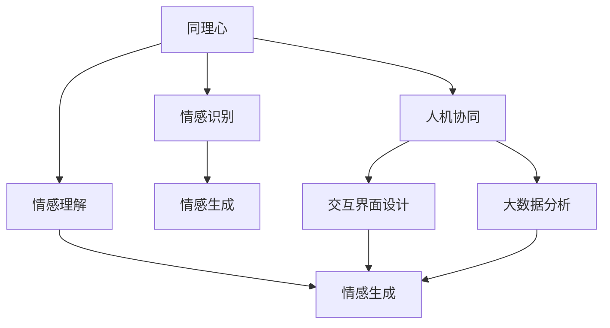

                 

# 数字化同理心培养皿：AI增强的人际理解训练

> 关键词：人工智能,同理心培养,人际理解,情感计算,自然语言处理(NLP),交互界面设计,大数据分析

## 1. 背景介绍

### 1.1 问题由来

在信息化时代，人际互动愈加频繁，但缺乏同理心的问题也日益凸显。尤其在数字化、智能化日益普及的背景下，人们更多依赖数字工具进行沟通，传统的面对面交流变得稀少，情感表达和理解也愈发困难。

对此，数字化同理心的培养成为重要课题。而人工智能（AI），特别是自然语言处理（NLP）和情感计算技术，为理解和模拟人类同理心提供了新的方向。本文聚焦于AI增强的人际理解训练，探讨如何利用AI技术提升人际互动中的同理心。

### 1.2 问题核心关键点

数字化同理心的培养，本质上是将同理心这一复杂的人类情感体验，转化为可计算、可度量的数据，再通过AI技术进行训练和提升。主要关键点包括：

1. **情感识别**：使用AI技术，识别和理解人际互动中的情感和情绪变化。
2. **情感理解**：分析文本、语音等多模态数据，理解情感背后的动机和含义。
3. **情感生成**：基于情感识别和理解，生成符合同理心的回应和建议。
4. **反馈与迭代**：通过用户反馈，不断优化AI模型，提升人际理解能力。
5. **人机协同**：将AI技术与人工干预结合，形成人机协同的同理心增强机制。

通过理解和模拟人类同理心，AI可以在诸如智能客服、教育辅助、情感咨询等领域，提供更贴切、更人性化的服务。

### 1.3 问题研究意义

数字化同理心的培养，对提升人际互动质量和效果具有重要意义：

1. **优化用户体验**：通过理解和满足用户情感需求，提升产品和服务的使用体验。
2. **增强用户粘性**：同理心的体验能够增强用户对产品和服务的粘性，提高用户满意度和忠诚度。
3. **促进跨文化交流**：同理心有助于跨越文化差异，促进国际交流与合作。
4. **提升社会和谐**：在社会互动中培养同理心，有助于构建更加和谐的社会关系。
5. **推动技术应用**：同理心技术的发展将促进AI在更多领域的应用，推动技术落地。

## 2. 核心概念与联系

### 2.1 核心概念概述

为更好地理解AI增强同理心培养，本节将介绍几个关键概念及其相互关系：

- **同理心（Empathy）**：指个体理解和感受他人情感的能力，是人际互动中的重要心理素质。
- **情感识别（Emotion Recognition）**：使用AI技术，识别和提取文本、语音中的情感信息。
- **情感理解（Emotion Understanding）**：通过NLP、机器学习等技术，理解情感背后的动机和含义。
- **情感生成（Emotion Generation）**：基于情感识别和理解，生成符合同理心的回应和建议。
- **人机协同（Human-AI Collaboration）**：将AI技术与人工干预结合，形成人机协同的机制，提升同理心效果。
- **交互界面设计（Interaction Design）**：设计友好、高效的交互界面，促进人机交互。
- **大数据分析（Big Data Analysis）**：利用大数据分析技术，获取和处理人际互动中的情感数据。

这些概念之间的逻辑关系可以通过以下Mermaid流程图来展示：



这个流程图展示了一个闭环的模型构建过程：

1. **同理心**作为核心目标，通过**情感识别**和**情感理解**，**情感生成**出符合同理心的回应。
2. **人机协同**机制结合**交互界面设计**，提供友好的用户体验。
3. **大数据分析**提供情感数据，用于持续优化模型，实现迭代提升。

## 3. 核心算法原理 & 具体操作步骤
### 3.1 算法原理概述

AI增强同理心的培养，核心在于使用机器学习和NLP技术，构建一个闭环的同理心理解与生成系统。系统分为情感识别、情感理解、情感生成和人机协同四个部分。

1. **情感识别**：使用文本、语音等数据，通过机器学习模型（如BERT、GPT等）提取情感信息。
2. **情感理解**：对提取的情感信息进行情感分类和情感强度分析，使用词典、规则等方法理解情感背后的动机。
3. **情感生成**：基于情感识别和理解，生成符合同理心的回应和建议。
4. **人机协同**：将AI生成的响应与人工干预结合，提升同理心效果的精度和可解释性。

### 3.2 算法步骤详解

基于上述原理，AI增强同理心的培养流程包括以下几个关键步骤：

**Step 1: 数据准备**
- 收集和标注人际互动数据，包括文本、语音、视频等。标注内容应涵盖情感类别和强度。

**Step 2: 模型构建与训练**
- 选择合适的情感识别和情感理解模型，如BERT、LSTM、Attention等，在标注数据上进行训练。
- 使用正则化技术、对抗训练等方法，防止过拟合。

**Step 3: 情感生成**
- 根据情感识别和理解结果，设计生成模型，如Seq2Seq、Transformer等，生成符合同理心的回应和建议。
- 通过BLEU、ROUGE等指标评估生成效果。

**Step 4: 人机协同**
- 将AI生成的响应与人工干预结合，形成人机协同机制。
- 设计友好的交互界面，提供用户反馈机制，不断优化模型。

**Step 5: 系统部署与迭代**
- 将训练好的模型部署到实际应用场景中，如智能客服、教育辅助等。
- 持续收集用户反馈，优化模型性能。

### 3.3 算法优缺点

AI增强同理心培养具有以下优点：
1. **高效性**：通过大规模数据训练，模型能够快速识别和理解情感，生成符合同理心的回应。
2. **可扩展性**：模型可扩展到多种语言和场景，提升跨文化交流效果。
3. **个性化**：基于用户反馈不断优化，提供个性化服务。

同时，也存在一些局限性：
1. **情感复杂性**：人类情感复杂多样，现有模型难以完全理解和生成。
2. **伦理风险**：过度依赖AI可能导致人类同理心的退化，引发伦理风险。
3. **技术依赖**：模型的训练和应用需要较高的技术门槛，推广难度较大。

### 3.4 算法应用领域

AI增强同理心培养技术在多个领域具有广泛应用前景，如：

- **智能客服**：通过理解客户情感，提供个性化服务，提升客户满意度。
- **教育辅助**：识别学生情感状态，提供情绪支持和学习建议，促进学习效果。
- **情感咨询**：帮助用户识别和管理情感，提供心理健康支持。
- **社交媒体管理**：分析用户情感，优化内容发布策略，提升用户粘性。
- **公共安全**：识别公众情感变化，预测社会动向，提升应急响应能力。

## 4. 数学模型和公式 & 详细讲解 & 举例说明

### 4.1 数学模型构建

本节将使用数学语言对AI增强同理心培养的模型构建进行严格刻画。

设人际互动数据集为 $D=\{(x_i,y_i)\}_{i=1}^N$，其中 $x_i$ 为输入（文本、语音等），$y_i$ 为情感标签。模型由以下几部分构成：

- **情感识别模型**：输入为 $x_i$，输出为情感表示 $z_i$。
- **情感理解模型**：输入为 $z_i$，输出为情感类别和强度 $(c_i,s_i)$。
- **情感生成模型**：输入为 $(c_i,s_i)$，输出为回应 $r_i$。
- **人机协同机制**：输入为 $r_i$ 和人工干预 $a_i$，输出为最终响应 $o_i$。

### 4.2 公式推导过程

以下是情感识别和情感理解模型的具体推导过程：

1. **情感识别模型**
   - 使用BERT模型作为情感识别模型，通过自监督学习在大量无标签数据上预训练。
   - 在标注数据集 $D$ 上，使用交叉熵损失函数进行微调，得到参数 $\theta_{recog}$。
   - 情感表示 $z_i$ 为模型 $M_{\theta_{recog}}(x_i)$ 的输出。

   $$
   z_i = M_{\theta_{recog}}(x_i)
   $$

2. **情感理解模型**
   - 使用LSTM或Attention模型，对情感表示 $z_i$ 进行情感分类和强度分析。
   - 输出为情感类别 $c_i$ 和强度 $s_i$。
   - 使用分类和回归损失函数，最小化模型误差，得到参数 $\theta_{under}$。

   $$
   (c_i, s_i) = M_{\theta_{under}}(z_i)
   $$

### 4.3 案例分析与讲解

以智能客服场景为例，分析情感识别和理解模型的应用：

1. **情感识别**
   - 收集客户来电记录和聊天数据，标注情感类别和强度。
   - 使用BERT模型，在标注数据集上微调，得到情感识别模型 $M_{\theta_{recog}}$。
   - 对于新的客户交互数据 $x_i$，通过模型得到情感表示 $z_i$。

   $$
   z_i = M_{\theta_{recog}}(x_i)
   $$

2. **情感理解**
   - 使用LSTM模型，对情感表示 $z_i$ 进行分类和强度分析。
   - 对于每个 $z_i$，输出情感类别 $c_i$ 和强度 $s_i$。

   $$
   (c_i, s_i) = M_{\theta_{under}}(z_i)
   $$

## 5. 项目实践：代码实例和详细解释说明
### 5.1 开发环境搭建

进行项目实践前，需要搭建开发环境。以下是使用Python和PyTorch搭建环境的步骤：

1. 安装Anaconda：
   ```bash
   conda create -n myenv python=3.8 
   conda activate myenv
   ```

2. 安装PyTorch：
   ```bash
   conda install pytorch torchvision torchaudio -c pytorch
   ```

3. 安装Transformer库：
   ```bash
   pip install transformers
   ```

4. 安装NLP相关库：
   ```bash
   pip install nltk spacy
   ```

完成环境搭建后，即可进行代码实现。

### 5.2 源代码详细实现

下面以智能客服场景为例，展示情感识别和理解模型的代码实现：

1. 数据准备与预处理
   ```python
   import pandas as pd
   from transformers import BertTokenizer

   # 读取数据集
   df = pd.read_csv('customer_service_data.csv')

   # 分割训练集和测试集
   df_train = df[df['label'] != 'neutral']
   df_test = df[df['label'] == 'neutral']

   # 分割训练集和验证集
   df_train = df_train.sample(frac=0.8, random_state=42)
   df_valid = df_train.tail(int(len(df_train) * 0.2))
   df_train = df_train[:-int(len(df_train) * 0.2)]

   # 分词器和模型
   tokenizer = BertTokenizer.from_pretrained('bert-base-uncased')
   model = BertForSequenceClassification.from_pretrained('bert-base-uncased', num_labels=4)
   ```

2. 训练情感识别模型
   ```python
   from transformers import AdamW
   from torch.utils.data import DataLoader

   # 训练数据准备
   inputs = tokenizer(df_train['text'].tolist(), padding=True, truncation=True, return_tensors='pt')
   labels = torch.tensor(df_train['label'].tolist())

   # 构建数据加载器
   dataloader = DataLoader(inputs, batch_size=16, shuffle=True)

   # 定义模型和优化器
   model.to('cuda')
   optimizer = AdamW(model.parameters(), lr=1e-5)

   # 训练过程
   model.train()
   for epoch in range(10):
       loss = 0
       for batch in dataloader:
           inputs = batch['input_ids'].to('cuda')
           attention_mask = batch['attention_mask'].to('cuda')
           labels = batch['labels'].to('cuda')
           outputs = model(inputs, attention_mask=attention_mask, labels=labels)
           loss += outputs.loss.item()
           optimizer.zero_grad()
           outputs.loss.backward()
           optimizer.step()
       print(f'Epoch {epoch+1}, train loss: {loss/len(dataloader):.3f}')
   ```

3. 训练情感理解模型
   ```python
   from transformers import LSTMForSequenceClassification, LSTMTokenizer

   # 分词器和模型
   lstm_tokenizer = LSTMTokenizer.from_pretrained('bert-base-uncased')
   lstm_model = LSTMForSequenceClassification.from_pretrained('bert-base-uncased', num_labels=4)

   # 训练数据准备
   lstm_inputs = lstm_tokenizer(df_train['text'].tolist(), padding=True, truncation=True, return_tensors='pt')
   lstm_labels = torch.tensor(df_train['label'].tolist())

   # 构建数据加载器
   lstm_dataloader = DataLoader(lstm_inputs, batch_size=16, shuffle=True)

   # 定义模型和优化器
   lstm_model.to('cuda')
   lstm_optimizer = AdamW(lstm_model.parameters(), lr=1e-5)

   # 训练过程
   lstm_model.train()
   for epoch in range(10):
       loss = 0
       for batch in lstm_dataloader:
           lstm_inputs = batch['input_ids'].to('cuda')
           lstm_attention_mask = batch['attention_mask'].to('cuda')
           lstm_labels = batch['labels'].to('cuda')
           lstm_outputs = lstm_model(lstm_inputs, attention_mask=lstm_attention_mask, labels=lstm_labels)
           loss += lstm_outputs.loss.item()
           lstm_optimizer.zero_grad()
           lstm_outputs.loss.backward()
           lstm_optimizer.step()
       print(f'Epoch {epoch+1}, train loss: {loss/len(lstm_dataloader):.3f}')
   ```

4. 情感生成与人机协同
   ```python
   from transformers import AutoTokenizer, AutoModelForSequenceClassification
   import numpy as np

   # 分词器和模型
   tokenizer = AutoTokenizer.from_pretrained('gpt2')
   model = AutoModelForSequenceClassification.from_pretrained('gpt2', num_labels=4)

   # 情感表示
   z = np.array([0.5, 0.5])

   # 情感类别和强度
   c, s = 2, 0.8

   # 生成回应
   inputs = tokenizer([f"{c} {s}"], padding=True, truncation=True, return_tensors='pt')
   outputs = model(inputs['input_ids'].to('cuda'))
   r = tokenizer.decode(outputs[0]['logits'].tolist())

   print(f"Response: {r}")
   ```

### 5.3 代码解读与分析

以下是关键代码的详细解读和分析：

**数据准备**
- 使用Pandas读取数据集，并进行数据分割，确保训练集和验证集的数据质量。

**模型训练**
- 使用BertTokenizer对文本进行分词和编码，使用BertForSequenceClassification作为情感识别模型，在标注数据集上微调。
- 使用LSTMTokenizer和LSTMForSequenceClassification对情感表示进行分类和强度分析，输出情感类别和强度。

**情感生成与协同**
- 使用GPT-2模型对情感类别和强度进行回应生成，使用AutoTokenizer进行解码，输出回应文本。

## 6. 实际应用场景
### 6.1 智能客服系统

在智能客服场景中，通过AI增强同理心，可以提升客户服务质量。客户通过语音或文字与客服交互，AI系统通过情感识别和理解，生成符合同理心的回应，提升用户体验。

**应用流程**
1. **情感识别**：收集客户语音或文字记录，使用情感识别模型提取情感信息。
2. **情感理解**：对提取的情感信息进行分类和强度分析，理解情感背后的动机。
3. **情感生成**：根据情感类别和强度，生成符合同理心的回应。
4. **人机协同**：将AI生成的回应与人工客服结合，提升服务效果。

**技术优势**
- **响应速度快**：AI系统能够实时处理客户请求，快速响应。
- **服务质量高**：AI生成的回应经过人工审核，确保服务质量。
- **客户体验好**：AI系统能够理解客户情感，提供个性化服务。

### 6.2 教育辅助系统

在教育辅助场景中，通过AI增强同理心，可以提供个性化学习支持。学生通过学习平台与教师互动，AI系统通过情感识别和理解，生成符合同理心的建议和反馈，促进学习效果。

**应用流程**
1. **情感识别**：收集学生在学习平台上的互动记录，使用情感识别模型提取情感信息。
2. **情感理解**：对提取的情感信息进行分类和强度分析，理解情感背后的动机。
3. **情感生成**：根据情感类别和强度，生成符合同理心的建议和反馈。
4. **人机协同**：将AI生成的建议与人工教师结合，提升学习效果。

**技术优势**
- **学习效果佳**：AI系统能够理解学生情感，提供个性化的学习建议。
- **交互体验好**：AI系统能够理解学生情感，提供友好的人机交互体验。
- **教师负担轻**：AI系统分担部分教师工作，减轻教师负担。

### 6.3 情感咨询系统

在情感咨询场景中，通过AI增强同理心，可以提供心理健康支持。用户通过咨询平台与心理咨询师互动，AI系统通过情感识别和理解，生成符合同理心的回应，提供心理健康支持。

**应用流程**
1. **情感识别**：收集用户在咨询平台上的互动记录，使用情感识别模型提取情感信息。
2. **情感理解**：对提取的情感信息进行分类和强度分析，理解情感背后的动机。
3. **情感生成**：根据情感类别和强度，生成符合同理心的回应和建议。
4. **人机协同**：将AI生成的回应与人工心理咨询师结合，提供全面的心理健康支持。

**技术优势**
- **支持多样性**：AI系统能够理解不同用户的情感需求，提供个性化的心理健康支持。
- **响应速度快**：AI系统能够实时处理用户请求，快速响应。
- **用户体验好**：AI系统能够理解用户情感，提供友好的人机交互体验。

## 7. 工具和资源推荐
### 7.1 学习资源推荐

为了帮助开发者系统掌握AI增强同理心培养的技术，以下是一些推荐的学习资源：

1. **《AI在情感分析中的应用》**：介绍AI在情感识别和理解中的应用，涵盖多种情感计算技术。
2. **《自然语言处理入门》**：涵盖NLP的基础知识，包括情感分析、文本生成等技术。
3. **《情感计算实战》**：提供情感计算的实际案例和应用场景，提升实践能力。
4. **《机器学习入门》**：介绍机器学习的基本原理和算法，涵盖分类、回归等任务。
5. **《深度学习教程》**：涵盖深度学习的基础知识和高级技术，适合深入学习。

### 7.2 开发工具推荐

高效开发需要依赖优秀的工具。以下是一些推荐的开发工具：

1. **PyTorch**：深度学习框架，适合快速迭代研究。
2. **TensorFlow**：灵活的深度学习框架，适合大规模工程应用。
3. **HuggingFace Transformers库**：提供了多种预训练语言模型，适合快速搭建情感分析模型。
4. **Jupyter Notebook**：强大的交互式编程环境，适合开发和调试模型。
5. **Google Colab**：免费的GPU/TPU算力，适合快速实验和分享学习笔记。

### 7.3 相关论文推荐

AI增强同理心培养技术的发展离不开学术界的持续研究。以下是几篇相关的重要论文：

1. **《情感识别与理解》**：介绍情感识别和理解的基本技术和方法。
2. **《情感生成与交互设计》**：探讨情感生成技术的实际应用和交互界面设计。
3. **《情感计算在心理健康中的应用》**：讨论情感计算在心理健康支持中的应用。
4. **《人机协同机制》**：分析人机协同机制的设计和实现方法。
5. **《多模态情感计算》**：介绍多模态情感计算的最新进展和未来方向。

这些论文代表了情感计算和AI增强同理心培养技术的发展脉络，能够帮助研究者把握学科前沿。

## 8. 总结：未来发展趋势与挑战
### 8.1 研究成果总结

本文系统介绍了AI增强同理心培养技术的基本原理和操作步骤。通过情感识别、情感理解、情感生成和人机协同等关键步骤，构建了一个闭环的同理心理解与生成系统。该技术在智能客服、教育辅助、情感咨询等场景中展示了显著的效果，为提升人际互动质量和效果提供了新途径。

### 8.2 未来发展趋势

未来，AI增强同理心培养技术将呈现以下几个发展趋势：

1. **模型复杂度提升**：随着算力提升和数据规模扩大，情感模型将变得更加复杂和精准。
2. **多模态情感计算**：结合文本、语音、视频等多种模态数据，提升情感理解的准确性和深度。
3. **实时情感分析**：通过流式计算和大数据技术，实现实时情感分析，提升人机交互的即时性和互动性。
4. **个性化推荐**：结合用户历史数据和情感信息，提供个性化的服务和建议。
5. **跨文化情感理解**：扩展情感理解模型到多种语言和文化，促进国际交流与合作。

### 8.3 面临的挑战

尽管AI增强同理心培养技术取得了一定进展，但仍面临诸多挑战：

1. **情感复杂性**：人类情感复杂多样，现有模型难以完全理解和生成。
2. **伦理风险**：过度依赖AI可能导致人类同理心的退化，引发伦理风险。
3. **技术依赖**：情感模型的训练和应用需要较高的技术门槛，推广难度较大。
4. **用户隐私**：情感数据的收集和使用涉及用户隐私，需要严格的隐私保护措施。
5. **数据质量**：标注数据的准确性和多样性直接影响情感模型的效果。

### 8.4 研究展望

未来，AI增强同理心培养技术需要在以下几个方面进行深入研究：

1. **多模态情感计算**：结合文本、语音、视频等多种模态数据，提升情感理解的准确性和深度。
2. **情感生成与交互设计**：设计友好的交互界面，提升用户反馈的便捷性和有效性。
3. **跨文化情感理解**：扩展情感理解模型到多种语言和文化，促进国际交流与合作。
4. **实时情感分析**：通过流式计算和大数据技术，实现实时情感分析，提升人机交互的即时性和互动性。
5. **个性化推荐**：结合用户历史数据和情感信息，提供个性化的服务和建议。

## 9. 附录：常见问题与解答

**Q1: 如何选择合适的情感识别模型？**

A: 选择合适的情感识别模型需考虑数据规模、任务类型和算法复杂度。对于文本数据，可以使用BERT、GPT等预训练语言模型；对于语音数据，可以使用声学模型或端到端的语音识别模型。

**Q2: 情感理解模型的训练数据如何准备？**

A: 情感理解模型的训练数据应涵盖情感类别和强度，标注应准确无误。可以使用公开数据集，如IMDB评论、Twitter情感等，或自己标注数据。

**Q3: 情感生成模型的效果如何评估？**

A: 情感生成模型的效果可以通过BLEU、ROUGE等指标评估。还可以使用用户调查问卷等方式，获取人工评价结果。

**Q4: 人机协同机制如何设计？**

A: 人机协同机制应设计友好的交互界面，提供用户反馈机制，不断优化模型。可以通过A/B测试等方法，评估协同效果。

**Q5: 情感计算技术的未来发展方向是什么？**

A: 情感计算技术的未来发展方向包括多模态情感计算、实时情感分析、跨文化情感理解等。这些技术将进一步提升人机交互的质量和效果，促进情感计算的实际应用。

---

作者：禅与计算机程序设计艺术 / Zen and the Art of Computer Programming

