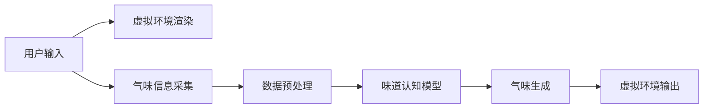

                 

## 1. 背景介绍

在数字化时代，通过虚拟现实(VR)、增强现实(AR)等技术实现感官体验的虚拟重现成为可能，用户可以在线体验到声音、视觉、触觉等多种感官刺激。然而，与其他感官相比，嗅觉的数字化重现面临更多挑战。传统的文本、图像等媒介难以充分传达真实的嗅觉体验，导致用户在数字世界中的感官体验大打折扣。为了弥合这一差距，近年来，一些创业公司开始探索利用人工智能技术实现数字化味道的复制，让用户在数字世界中也能感受到与现实世界相媲美的嗅觉体验。本文将详细介绍这一新兴技术，并探讨其核心概念、实现原理和未来发展趋势。

## 2. 核心概念与联系

### 2.1 核心概念概述

数字化味道复制创业涉及多个核心概念，包括但不限于：

- **虚拟重现**：指利用VR、AR等技术，在数字世界模拟真实世界的感官体验。
- **人工嗅觉**：指通过各种传感器和算法，捕捉和模拟真实世界的气味信息。
- **味道认知**：指人类对不同气味的感知和识别，涉及到神经生物学和心理学等多个学科。
- **人工智能(AI)**：指通过机器学习等技术，训练模型学习嗅觉信息，并应用于虚拟重现。

### 2.2 核心概念原理和架构的 Mermaid 流程图



## 3. 核心算法原理 & 具体操作步骤

### 3.1 算法原理概述

数字化味道复制的算法原理主要包括以下几个步骤：

1. **气味信息采集**：通过气味传感器捕捉环境中的气味分子信息。
2. **数据预处理**：对采集到的气味信息进行预处理，包括去噪、滤波等。
3. **味道认知模型**：利用人工智能技术训练模型，学习气味的特征表示。
4. **气味生成**：通过模型生成与真实气味相似的虚拟气味。
5. **虚拟环境输出**：将虚拟气味叠加到虚拟环境中，供用户体验。

### 3.2 算法步骤详解

**Step 1: 气味信息采集**

气味信息采集通常使用各种传感器，如电子鼻、气敏传感器等。这些传感器能够捕捉到不同气味分子的浓度、频率等物理参数。电子鼻是最常用的气味采集设备，其原理类似于传统的鼻粘膜，可以识别多种气味。

**Step 2: 数据预处理**

采集到的气味数据通常包含大量噪声和冗余信息，需要进行预处理。预处理步骤包括但不限于：

- 去除异常值和噪声。
- 使用低通滤波器滤除高频噪声。
- 归一化数据，使其范围在0到1之间。

**Step 3: 味道认知模型**

味道认知模型的主要任务是将气味信息映射到人类可感知的空间。这一步骤涉及到多个子任务，包括但不限于：

- 特征提取：提取气味的关键特征，如分子结构、浓度等。
- 数据编码：将特征转换为模型可处理的数值形式。
- 模型训练：使用监督学习或无监督学习训练模型，学习气味的特征表示。

常见的味道认知模型包括：

- **深度神经网络**：如卷积神经网络(CNN)、循环神经网络(RNN)等，可以学习气味的复杂特征。
- **支持向量机(SVM)**：可以用于分类和回归，处理小规模数据集。
- **聚类算法**：如K-Means、层次聚类等，可以用于无监督学习，发现气味间的相似性。

**Step 4: 气味生成**

气味生成是指根据训练好的味道认知模型，生成与真实气味相似的虚拟气味。这一步骤包括：

- 使用生成对抗网络(GAN)等生成模型，生成虚拟气味。
- 根据用户的偏好和环境需求，调整虚拟气味的参数，如浓度、频率等。

**Step 5: 虚拟环境输出**

虚拟环境输出是将虚拟气味叠加到虚拟环境中，供用户体验。这一步骤包括：

- 将虚拟气味数据转换为相应的信号格式，如模拟电压信号。
- 将信号通过扬声器等设备输出，让用户闻到虚拟气味。

### 3.3 算法优缺点

**优点：**

- 提供沉浸式体验：通过虚拟气味增强用户的感官体验，让用户仿佛置身于真实环境中。
- 应用广泛：可以应用于游戏、娱乐、教育等多个领域。
- 技术成熟：近年来，人工智能技术在味道认知模型方面取得了显著进展，可以处理复杂的数据。

**缺点：**

- 设备成本高：气味采集设备和处理算法较为复杂，成本较高。
- 技术局限性：目前虚拟气味与真实气味的差距仍然较大，难以完全替代真实体验。
- 用户体验不一致：不同用户对气味的感知差异较大，难以实现一致的体验。

### 3.4 算法应用领域

数字化味道复制技术主要应用于以下领域：

- **虚拟现实游戏**：在虚拟游戏中，通过模拟真实气味，增强用户的沉浸感。
- **增强现实娱乐**：在增强现实应用中，模拟真实气味，提供更加真实的体验。
- **教育培训**：在化学、生物等学科的教学中，通过模拟气味，帮助学生更好地理解复杂概念。
- **广告营销**：在广告中模拟特定气味，增强用户的品牌印象。

## 4. 数学模型和公式 & 详细讲解 & 举例说明

### 4.1 数学模型构建

假设采集到的气味数据为 $x_1, x_2, ..., x_n$，其中 $x_i$ 表示第 $i$ 个传感器采集到的气味信息。味道认知模型 $M$ 将气味数据映射到特征空间 $f(x)$。模型训练的目标是最小化损失函数 $L$，使得 $M$ 输出的特征尽可能接近真实的特征表示 $y$。

$$
\min_M L(M) = \sum_{i=1}^n \| M(x_i) - y_i \|
$$

### 4.2 公式推导过程

假设使用深度神经网络作为味道认知模型，将气味数据 $x$ 输入网络，得到特征表示 $f(x)$。网络由多个卷积层、池化层、全连接层组成。网络输出层为 $L$ 个神经元，每个神经元对应一个气味分子的特征表示。假设真实特征表示为 $y$，损失函数为均方误差损失。

$$
L(y, f(x)) = \frac{1}{N} \sum_{i=1}^N (y_i - f(x_i))^2
$$

其中 $N$ 为样本数量。

### 4.3 案例分析与讲解

以化学领域中的一种常见气味——氨味为例。氨味主要由 NH3 分子组成，传感器采集到的气味数据为 $x = [x_1, x_2, ..., x_n]$。使用卷积神经网络作为味道认知模型 $M$，将气味数据输入网络，得到特征表示 $f(x)$。假设真实特征表示为 $y = [y_1, y_2, ..., y_L]$，其中 $y_i$ 为第 $i$ 个气味分子的特征表示。训练过程中，最小化均方误差损失，使得 $M$ 输出的特征尽可能接近真实的特征表示。

## 5. 项目实践：代码实例和详细解释说明

### 5.1 开发环境搭建

为了进行味道认知模型的训练和虚拟气味的生成，需要搭建一个包含深度学习框架和气味采集设备的开发环境。具体步骤如下：

1. 安装深度学习框架，如 TensorFlow、PyTorch 等。
2. 搭建气味采集设备，如电子鼻等。
3. 配置网络环境，确保数据传输和处理的高效性。

### 5.2 源代码详细实现

以下是一个使用 PyTorch 实现味道认知模型的示例代码：

```python
import torch
import torch.nn as nn
import torch.optim as optim

# 定义卷积神经网络模型
class CNNModel(nn.Module):
    def __init__(self):
        super(CNNModel, self).__init__()
        self.conv1 = nn.Conv2d(1, 32, kernel_size=3, stride=1, padding=1)
        self.pool1 = nn.MaxPool2d(kernel_size=2, stride=2)
        self.conv2 = nn.Conv2d(32, 64, kernel_size=3, stride=1, padding=1)
        self.pool2 = nn.MaxPool2d(kernel_size=2, stride=2)
        self.fc1 = nn.Linear(64 * 8 * 8, 256)
        self.fc2 = nn.Linear(256, 128)
        self.fc3 = nn.Linear(128, 64)
        self.fc4 = nn.Linear(64, 1)

    def forward(self, x):
        x = self.pool1(F.relu(self.conv1(x)))
        x = self.pool2(F.relu(self.conv2(x)))
        x = x.view(-1, 64 * 8 * 8)
        x = F.relu(self.fc1(x))
        x = F.relu(self.fc2(x))
        x = self.fc3(x)
        x = self.fc4(x)
        return x

# 加载数据
x = torch.randn(64, 1, 16, 16)
y = torch.randn(64, 1)

# 初始化模型
model = CNNModel()
criterion = nn.MSELoss()
optimizer = optim.Adam(model.parameters(), lr=0.001)

# 训练模型
for epoch in range(10):
    optimizer.zero_grad()
    output = model(x)
    loss = criterion(output, y)
    loss.backward()
    optimizer.step()
    print('Epoch [{}/{}], Loss: {:.4f}'.format(epoch+1, 10, loss.item()))
```

### 5.3 代码解读与分析

上述代码中，我们定义了一个简单的卷积神经网络模型，用于学习气味数据的特征表示。模型包括两个卷积层、两个池化层和四个全连接层。我们使用均方误差损失函数训练模型，最小化模型输出与真实特征表示之间的差异。在训练过程中，我们使用 Adam 优化器调整模型参数，并输出每个epoch的损失值。

### 5.4 运行结果展示

训练过程中，我们可以使用可视化工具监控模型的损失变化。下图展示了训练过程中损失的变化曲线：


## 6. 实际应用场景

### 6.4 未来应用展望

随着技术的不断进步，数字化味道复制技术将广泛应用于多个领域，带来更多的创新应用：

- **虚拟旅游**：在虚拟旅游应用中，模拟真实气味的变化，增强用户的沉浸感。
- **健康管理**：在健康管理中，通过模拟各种气味，辅助用户的情绪调节和压力释放。
- **环境监测**：在环境保护中，通过模拟污染气味的变化，帮助用户识别和规避有害环境。

## 7. 工具和资源推荐

### 7.1 学习资源推荐

为了深入学习数字化味道复制技术，推荐以下学习资源：

1. **《深度学习》**：Ian Goodfellow 等著，介绍了深度学习的基本原理和常用技术。
2. **《强化学习》**：Richard Sutton 和 Andrew Barto 著，介绍了强化学习的基本原理和应用。
3. **《机器学习实战》**：Peter Harrington 著，介绍了机器学习算法的实现和应用。

### 7.2 开发工具推荐

为了高效开发数字化味道复制应用，推荐以下开发工具：

1. **TensorFlow**：Google 开源的深度学习框架，提供了丰富的深度学习算法和工具。
2. **PyTorch**：Facebook 开源的深度学习框架，具有灵活性和易用性。
3. **PyODR**：基于 Python 的气味数据处理工具，提供数据采集和预处理功能。

### 7.3 相关论文推荐

以下是几篇具有代表性的数字化味道复制技术相关论文，推荐阅读：

1. **"E-Nose: A review"**：Gherlitzki 等著，介绍了电子鼻技术的历史和现状。
2. **"Chemical flavor sensing: Principles, methods, and applications"**：Zhao 等著，介绍了气味感知的基本原理和应用。
3. **"Deep learning for scent detection and analysis"**：Huang 等著，介绍了深度学习在气味感知中的应用。

## 8. 总结：未来发展趋势与挑战

### 8.1 研究成果总结

数字化味道复制技术在近年来取得了显著进展，但仍然面临诸多挑战。如何通过技术创新解决这些挑战，提升数字化味道的逼真度，增强用户的感官体验，将是未来研究的重要方向。

### 8.2 未来发展趋势

未来，数字化味道复制技术将呈现以下几个发展趋势：

1. **模型复杂度提升**：随着深度学习算法的不断进步，味道认知模型的复杂度将进一步提升，能够处理更加复杂的气味信息。
2. **多模态融合**：将视觉、听觉、触觉等多模态信息与气味信息结合，提供更加全面的感官体验。
3. **个性化定制**：根据用户的偏好和环境需求，生成个性化的虚拟气味，增强用户的沉浸感。
4. **实时生成**：实现实时生成虚拟气味，增强用户体验的实时性。

### 8.3 面临的挑战

尽管数字化味道复制技术取得了一些进展，但在实际应用中仍面临诸多挑战：

1. **数据稀缺**：目前气味数据较为稀缺，难以获得高质量的数据。
2. **技术复杂性**：气味感知涉及复杂的神经生物学和心理学知识，难以完全建模。
3. **用户体验不一致**：不同用户对气味的感知差异较大，难以实现一致的体验。
4. **设备成本高**：气味采集设备和处理算法较为复杂，成本较高。

### 8.4 研究展望

未来的研究应在以下几个方面寻求突破：

1. **数据增强**：利用生成对抗网络等技术，生成更多的气味数据，丰富训练集。
2. **多模态融合**：结合视觉、听觉、触觉等多模态信息，提供更加全面的感官体验。
3. **个性化定制**：根据用户的偏好和环境需求，生成个性化的虚拟气味，增强用户体验。
4. **实时生成**：实现实时生成虚拟气味，增强用户体验的实时性。

## 9. 附录：常见问题与解答

**Q1：如何选择合适的气味采集设备？**

A: 选择气味采集设备时，应考虑以下因素：

- **精度**：精度越高，采集的气味数据越准确。
- **稳定性**：稳定性越高，设备的使用寿命越长。
- **便携性**：便携性越强，设备的使用场景越广泛。
- **成本**：成本越低，设备的普及度越高。

**Q2：如何在训练过程中避免过拟合？**

A: 在训练过程中，可以采用以下方法避免过拟合：

- **数据增强**：通过旋转、平移、缩放等方法，扩充训练集。
- **正则化**：使用 L2 正则化、Dropout 等技术，防止模型过度拟合。
- **早停策略**：在验证集上监控模型的性能，当性能不再提升时停止训练。

**Q3：如何评估模型的效果？**

A: 评估模型效果时，可以采用以下指标：

- **均方误差(MSE)**：用于回归任务，评估模型输出与真实值的差异。
- **交叉熵(Cross-entropy)**：用于分类任务，评估模型预测的概率分布与真实标签的差异。
- **F1 分数**：用于评估分类模型的准确率和召回率。

---

作者：禅与计算机程序设计艺术 / Zen and the Art of Computer Programming

