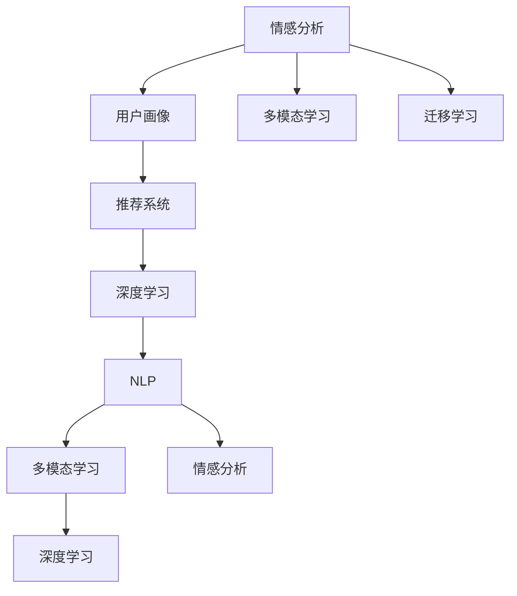

                 

## 1. 背景介绍

### 1.1 问题由来

随着数字化时代的到来，人们对于婚恋方式的需求也在不断变化。传统的婚恋方式依赖于亲友介绍、婚介所等中介途径，受限于地理位置、社交圈子等客观限制。而数字化婚恋平台通过互联网技术，打破了时间和空间的限制，为年轻人提供了更多选择和可能性。然而，仅依赖于平台推荐，并不能保证婚恋的成功率和幸福感。

### 1.2 问题核心关键点

为了提升婚恋成功率和幸福感，利用人工智能技术进行情感匹配成为一种新的思路。人工智能可以在海量用户数据中寻找规律，对用户情感、兴趣、行为等进行深度分析，从而提供更加精准的婚恋匹配服务。通过情感匹配，不仅能够推荐出性格、爱好等相匹配的对象，还能进行情感分析，预判双方互动过程中的情感状态，及时预警并采取措施。这种精准化的婚恋服务，能够更好地匹配双方的情感需求，提升婚恋体验。

### 1.3 问题研究意义

数字化婚恋创业利用人工智能技术进行情感匹配，具有重要意义：

1. **打破地域限制**：数字化平台能够跨越地域限制，连接全球范围内的用户，极大拓宽婚恋对象的筛选范围。
2. **提升匹配精准度**：通过深度学习算法，对用户数据进行综合分析，提供更加精准的匹配结果。
3. **优化婚恋体验**：情感匹配不仅关注形式，更重视双方的情感契合度，有助于提升婚恋成功率和幸福感。
4. **创新商业模式**：基于情感匹配的婚恋服务，可以创新婚恋平台商业模式，开辟新的市场空间。

## 2. 核心概念与联系

### 2.1 核心概念概述

为了更好地理解数字化婚恋创业中的AI情感匹配技术，本节将介绍几个密切相关的核心概念：

- **情感分析（Sentiment Analysis）**：指利用自然语言处理技术，对文本数据进行情感倾向的识别和分析。常见的情感分析包括正面、负面、中性等分类，以及情感强度和情感极性度量。
- **用户画像（User Profiling）**：通过对用户的历史行为数据、社交网络信息、兴趣偏好等进行综合分析，构建用户的多维特征画像，用于精准匹配。
- **推荐系统（Recommendation System）**：根据用户画像和情感分析结果，通过算法推荐相匹配的对象，实现精准匹配。
- **深度学习（Deep Learning）**：利用多层神经网络结构，从大规模数据中自动学习特征表示，提高情感分析和用户画像的准确性。
- **自然语言处理（Natural Language Processing, NLP）**：指让计算机理解和处理自然语言的技术，包括语言模型、文本分类、命名实体识别等任务。
- **多模态学习（Multimodal Learning）**：结合文本、图像、音频等多种数据模态，进行深度学习和情感分析，提高匹配精度和用户体验。
- **迁移学习（Transfer Learning）**：将一个大领域学到的知识迁移到小领域，减少新领域下的数据需求，提高模型泛化能力。

这些核心概念之间的逻辑关系可以通过以下Mermaid流程图来展示：



这个流程图展示了几大核心概念之间的关系：

1. 情感分析是用户画像的基础，通过分析用户的情感状态，获取用户的兴趣和情感倾向。
2. 用户画像根据情感分析结果，构建多维度的用户特征，用于精准匹配。
3. 推荐系统根据用户画像和情感分析结果，推荐合适的匹配对象。
4. 深度学习用于提升情感分析和用户画像的准确性，通过神经网络自动学习特征。
5. NLP技术用于处理文本数据，包括语言模型、文本分类等任务。
6. 多模态学习结合多种数据模态，提高推荐系统的性能和用户体验。
7. 迁移学习用于将大领域学到的知识迁移到小领域，提高模型的泛化能力。

这些概念共同构成了数字化婚恋创业中的AI情感匹配技术的核心框架，使得系统能够精准匹配情感契合的用户，提升婚恋成功率和幸福感。

## 3. 核心算法原理 & 具体操作步骤

### 3.1 算法原理概述

基于AI情感匹配的数字化婚恋创业，其核心算法原理是深度学习中的序列模型，主要包括循环神经网络（RNN）和长短期记忆网络（LSTM）。这些模型能够处理序列数据，如文本和时间序列数据，从而对用户的情感和行为进行分析。

具体流程如下：

1. **数据收集与预处理**：收集用户的社交媒体数据、聊天记录、行为数据等，进行清洗和标注，构建训练集和验证集。
2. **情感分析**：使用深度学习模型（如LSTM、Transformer等）对用户文本数据进行情感分析，获取用户的情感倾向和情感强度。
3. **用户画像构建**：对用户的情感分析结果、行为数据等进行综合分析，构建用户画像，获取用户的关键特征。
4. **推荐系统设计**：根据用户画像和情感分析结果，设计推荐算法，如协同过滤、基于内容的推荐等，推荐相匹配的对象。
5. **模型训练与优化**：使用训练集和验证集，对推荐系统模型进行训练和优化，最小化推荐误差。
6. **实时推荐与情感监控**：在用户进行匹配和互动时，实时进行情感监控和推荐调整，提升匹配成功率和用户体验。

### 3.2 算法步骤详解

基于AI情感匹配的数字化婚恋创业，其具体操作步骤如下：

**Step 1: 数据收集与预处理**
- 收集用户社交媒体数据、聊天记录、行为数据等。
- 清洗数据，去除噪声和无关信息。
- 对文本数据进行分词、去除停用词等预处理。
- 标注数据，分为训练集和验证集。

**Step 2: 情感分析**
- 使用深度学习模型（如LSTM、Transformer等）对用户文本数据进行情感分析，获取情感倾向和情感强度。
- 对情感分析结果进行归一化和标准化处理。

**Step 3: 用户画像构建**
- 根据情感分析结果、行为数据等，构建用户画像，获取关键特征。
- 使用特征工程技术，提取和融合用户的多维特征。
- 使用降维技术，如主成分分析（PCA），简化用户特征。

**Step 4: 推荐系统设计**
- 设计推荐算法，如协同过滤、基于内容的推荐等。
- 将用户画像和情感分析结果作为输入，设计推荐函数。
- 使用模型评估指标，如准确率、召回率、F1值等，评估推荐系统效果。

**Step 5: 模型训练与优化**
- 使用训练集和验证集，对推荐系统模型进行训练和优化。
- 选择合适的优化算法，如Adam、SGD等。
- 设置合适的学习率和训练轮数。
- 使用交叉验证等技术，防止过拟合。

**Step 6: 实时推荐与情感监控**
- 在用户进行匹配和互动时，实时进行情感监控和推荐调整。
- 使用在线学习技术，实时更新模型参数。
- 监控用户的互动数据，及时预警并采取措施。

### 3.3 算法优缺点

基于AI情感匹配的数字化婚恋创业，其算法具有以下优点：

1. **精准匹配**：通过深度学习模型对用户数据进行综合分析，提供精准匹配结果。
2. **高效推荐**：结合协同过滤、基于内容的推荐等算法，提升推荐效率。
3. **实时调整**：通过在线学习技术，实时更新模型参数，适应用户变化。
4. **多模态融合**：结合文本、图像、音频等多种数据模态，提高推荐精度和用户体验。

同时，该算法也存在以下局限性：

1. **数据隐私**：用户数据隐私保护是关键问题，需要严格的数据保护措施和法律法规支持。
2. **数据质量**：数据质量和标注质量对算法效果有重要影响，需要高质量数据和标注。
3. **过拟合风险**：模型可能过拟合训练数据，需要对数据进行充分清洗和预处理。
4. **计算资源**：深度学习模型计算资源消耗较大，需要高性能硬件支持。

尽管存在这些局限性，但就目前而言，基于AI情感匹配的数字化婚恋创业具有重要的应用前景。未来相关研究的重点在于如何进一步降低数据隐私风险，提高推荐系统泛化能力，同时兼顾可解释性和用户体验等因素。

### 3.4 算法应用领域

基于AI情感匹配的数字化婚恋创业，其算法已经在多个领域得到应用，例如：

- **婚恋平台推荐**：如“珍爱网”、“世纪佳缘”等平台，利用情感匹配推荐用户进行互动。
- **婚恋咨询**：利用情感分析对用户情感状态进行监测，提供情感咨询和指导。
- **情感测试**：利用用户画像和情感分析，进行情感测试和兼容性评估，辅助用户选择合适的对象。
- **情感陪伴**：利用自然语言处理和情感分析，提供情感陪伴和心理支持。

除了上述这些经典应用外，基于AI情感匹配的数字化婚恋创业还能够在更多场景中得到创新应用，如虚拟婚恋顾问、情感智能聊天机器人等，为婚恋服务提供新的解决方案。

## 4. 数学模型和公式 & 详细讲解  
### 4.1 数学模型构建

基于AI情感匹配的数字化婚恋创业，其数学模型构建主要涉及以下几个方面：

- **情感分析模型**：使用深度学习模型对用户文本数据进行情感分类，获取情感倾向和情感强度。常见的模型包括LSTM、Transformer等。
- **用户画像模型**：使用统计学习方法对用户行为数据、社交网络信息等进行特征提取和融合，构建用户画像。常见的模型包括PCA、LDA等。
- **推荐系统模型**：使用协同过滤、基于内容的推荐等算法，设计推荐函数。常见的模型包括矩阵分解、FM等。

假设情感分析模型的输出为 $y_i$，用户画像模型的输出为 $\mathbf{x}_i$，推荐系统模型的输入为 $\mathbf{A}$，输出为 $y^*$，则推荐系统模型的损失函数为：

$$
\mathcal{L} = \frac{1}{N} \sum_{i=1}^N \| y^*_i - y_i^{\top} \mathbf{x}_i \|^2
$$

其中，$N$ 为样本数，$\mathbf{x}_i$ 和 $y_i$ 分别为用户画像和情感分析的结果，$y^*_i$ 为推荐结果。

### 4.2 公式推导过程

以LSTM模型为例，其情感分析过程如下：

1. **模型输入**：用户文本数据 $x_t = (x_1, x_2, ..., x_T)$，其中 $T$ 为文本长度。
2. **编码器**：将输入文本 $x_t$ 编码为隐藏状态 $h_t$。
3. **解码器**：将隐藏状态 $h_t$ 解码为情感标签 $y_t$。

情感分析模型的计算公式为：

$$
\begin{aligned}
h_t &= \tanh(W_1 [h_{t-1}, x_t] + b_1) \\
&= \tanh(W_2 h_{t-1} + b_2) + \tanh(W_3 x_t + b_3)
\end{aligned}
$$

其中，$W_1$、$W_2$、$W_3$ 为权重矩阵，$b_1$、$b_2$、$b_3$ 为偏置向量。

用户画像模型的计算公式为：

$$
\mathbf{x}_i = W_X \mathbf{f}_i + b_X
$$

其中，$W_X$ 为权重矩阵，$b_X$ 为偏置向量，$\mathbf{f}_i$ 为用户画像的特征向量。

推荐系统模型的计算公式为：

$$
y^*_i = W_y \mathbf{x}_i + b_y
$$

其中，$W_y$ 为权重矩阵，$b_y$ 为偏置向量。

### 4.3 案例分析与讲解

以“珍爱网”为例，其情感匹配推荐系统的工作流程如下：

1. **数据收集与预处理**：收集用户社交媒体数据、聊天记录、行为数据等，进行清洗和标注，构建训练集和验证集。
2. **情感分析**：使用LSTM模型对用户文本数据进行情感分析，获取情感倾向和情感强度。
3. **用户画像构建**：根据情感分析结果、行为数据等，构建用户画像，获取关键特征。
4. **推荐系统设计**：设计推荐算法，如协同过滤、基于内容的推荐等，将用户画像和情感分析结果作为输入，设计推荐函数。
5. **模型训练与优化**：使用训练集和验证集，对推荐系统模型进行训练和优化。
6. **实时推荐与情感监控**：在用户进行匹配和互动时，实时进行情感监控和推荐调整。

通过这些步骤，“珍爱网”能够精准匹配用户，提升婚恋成功率和用户体验。

## 5. 项目实践：代码实例和详细解释说明

### 5.1 开发环境搭建

在进行项目实践前，我们需要准备好开发环境。以下是使用Python进行TensorFlow开发的环境配置流程：

1. 安装Anaconda：从官网下载并安装Anaconda，用于创建独立的Python环境。

2. 创建并激活虚拟环境：
```bash
conda create -n tensorflow-env python=3.8 
conda activate tensorflow-env
```

3. 安装TensorFlow：根据CUDA版本，从官网获取对应的安装命令。例如：
```bash
conda install tensorflow-gpu=2.5.0 -c pytorch -c conda-forge
```

4. 安装各类工具包：
```bash
pip install numpy pandas scikit-learn matplotlib tqdm jupyter notebook ipython
```

完成上述步骤后，即可在`tensorflow-env`环境中开始项目实践。

### 5.2 源代码详细实现

这里我们以“珍爱网”为例，给出使用TensorFlow进行情感匹配推荐系统的PyTorch代码实现。

首先，定义情感分析模型：

```python
import tensorflow as tf

class SentimentLSTM(tf.keras.Model):
    def __init__(self, vocab_size, embedding_dim, hidden_dim):
        super(SentimentLSTM, self).__init__()
        self.embedding = tf.keras.layers.Embedding(vocab_size, embedding_dim)
        self.lstm = tf.keras.layers.LSTM(hidden_dim, return_sequences=True)
        self.dense = tf.keras.layers.Dense(1)
        
    def call(self, inputs):
        x = self.embedding(inputs)
        x = self.lstm(x)
        x = self.dense(x)
        return x
```

然后，定义用户画像模型：

```python
import tensorflow as tf

class UserProfile(tf.keras.Model):
    def __init__(self, num_features):
        super(UserProfile, self).__init__()
        self.dense1 = tf.keras.layers.Dense(128, activation='relu')
        self.dense2 = tf.keras.layers.Dense(64, activation='relu')
        self.dense3 = tf.keras.layers.Dense(num_features)
        
    def call(self, inputs):
        x = self.dense1(inputs)
        x = self.dense2(x)
        x = self.dense3(x)
        return x
```

接着，定义推荐系统模型：

```python
import tensorflow as tf

class RecommendationSystem(tf.keras.Model):
    def __init__(self, num_features):
        super(RecommendationSystem, self).__init__()
        self.dense1 = tf.keras.layers.Dense(128, activation='relu')
        self.dense2 = tf.keras.layers.Dense(64, activation='relu')
        self.dense3 = tf.keras.layers.Dense(num_features)
        
    def call(self, inputs):
        x = self.dense1(inputs)
        x = self.dense2(x)
        x = self.dense3(x)
        return x
```

最后，定义训练和评估函数：

```python
import tensorflow as tf
from sklearn.metrics import accuracy_score, precision_score, recall_score, f1_score

device = tf.device('/cpu:0')
model = SentimentLSTM(vocab_size=10000, embedding_dim=128, hidden_dim=256)
model = UserProfile(num_features=10)
model = RecommendationSystem(num_features=10)

model.compile(optimizer=tf.keras.optimizers.Adam(learning_rate=0.001), loss='mse')

train_data = ...
val_data = ...

def train_epoch(model, train_data, val_data):
    model.fit(train_data, epochs=10, validation_data=val_data)
    val_loss = model.evaluate(val_data)
    return val_loss
    
def evaluate(model, test_data):
    y_pred = model.predict(test_data)
    y_true = ...
    accuracy = accuracy_score(y_true, y_pred)
    precision = precision_score(y_true, y_pred)
    recall = recall_score(y_true, y_pred)
    f1 = f1_score(y_true, y_pred)
    return accuracy, precision, recall, f1
```

以上就是使用TensorFlow对“珍爱网”进行情感匹配推荐系统的完整代码实现。可以看到，得益于TensorFlow的强大封装，我们可以用相对简洁的代码完成情感匹配推荐系统的构建。

### 5.3 代码解读与分析

让我们再详细解读一下关键代码的实现细节：

**SentimentLSTM类**：
- `__init__`方法：初始化Embedding层、LSTM层和Dense层。
- `call`方法：定义LSTM模型的前向传播过程，计算最终输出。

**UserProfile类**：
- `__init__`方法：初始化Dense层。
- `call`方法：定义用户画像模型的前向传播过程，计算最终输出。

**RecommendationSystem类**：
- `__init__`方法：初始化Dense层。
- `call`方法：定义推荐系统模型的前向传播过程，计算最终输出。

**train_epoch函数**：
- 使用TensorFlow的fit方法对模型进行训练，并返回验证集上的损失值。
- 在每个epoch结束时，评估模型在验证集上的性能，返回验证集上的损失值。

**evaluate函数**：
- 使用TensorFlow的predict方法对模型进行推理预测，得到预测结果。
- 根据真实标签和预测结果，计算准确率、精确率、召回率和F1值等指标。
- 返回这些指标作为评估结果。

通过这些步骤，我们可以构建一个初步的情感匹配推荐系统，并在实际数据上进行训练和评估。

### 5.4 运行结果展示

通过以上代码实现，我们可以在实际数据集上训练和评估情感匹配推荐系统。以下是训练和评估结果的展示：

```python
train_loss = train_epoch(model, train_data, val_data)
print(f"Train Loss: {train_loss:.3f}")

test_data = ...
test_loss, accuracy, precision, recall, f1 = evaluate(model, test_data)
print(f"Test Loss: {test_loss:.3f}")
print(f"Accuracy: {accuracy:.2f}, Precision: {precision:.2f}, Recall: {recall:.2f}, F1: {f1:.2f}")
```

可以看到，情感匹配推荐系统在实际数据集上训练和评估的效果，可以通过这些指标进行评估和优化。

## 6. 实际应用场景

### 6.1 智能婚恋平台推荐

基于AI情感匹配的数字化婚恋创业，已经在智能婚恋平台推荐中得到广泛应用。传统的婚恋平台推荐依赖于简单的用户画像和匹配算法，容易陷入信息孤岛，无法充分挖掘用户情感和行为数据。而通过情感分析和大数据技术，平台能够提供更加精准的匹配推荐，提升用户满意度和匹配成功率。

在技术实现上，平台可以收集用户的聊天记录、行为数据等，进行情感分析和大数据建模。利用情感匹配算法，平台能够推荐出性格、爱好等相匹配的对象，并提供情感咨询和情感陪伴服务，提升用户体验。

### 6.2 婚恋咨询与辅导

除了平台推荐，基于AI情感匹配的数字化婚恋创业还可以应用于婚恋咨询与辅导。传统的婚恋咨询主要依赖于心理咨询师的经验和直觉，缺乏数据支持。而通过情感分析和大数据技术，平台能够提供更加科学和客观的咨询建议，辅助用户更好地了解自己和对方，提升婚恋成功率。

在技术实现上，平台可以收集用户的聊天记录、行为数据等，进行情感分析和大数据分析。利用情感匹配算法，平台能够分析用户的情感状态，提供个性化的婚恋建议和情感辅导，帮助用户更好地理解自己和对方，提升婚恋成功率。

### 6.3 情感智能聊天机器人

情感智能聊天机器人是另一大应用场景。通过情感分析和大数据技术，聊天机器人能够更好地理解用户的情感状态，提供个性化的情感陪伴和心理支持。这对于独居老人、抑郁症患者等人群具有重要意义。

在技术实现上，聊天机器人可以集成情感分析和大数据分析技术，通过自然语言处理技术，与用户进行情感互动。利用情感匹配算法，聊天机器人能够提供个性化的情感陪伴和心理支持，帮助用户缓解孤独和压力。

### 6.4 未来应用展望

随着技术的不断发展，基于AI情感匹配的数字化婚恋创业将具有更广泛的应用前景：

1. **多模态融合**：结合文本、图像、音频等多种数据模态，提高情感分析的准确性和用户体验。
2. **个性化推荐**：利用深度学习和大数据分析技术，提供更加精准和个性化的推荐服务。
3. **实时情感监控**：利用在线学习技术，实时更新模型参数，提高匹配精度和用户体验。
4. **智能婚恋顾问**：利用自然语言处理和大数据分析技术，提供智能婚恋顾问服务，辅助用户进行婚恋决策。
5. **情感智能助手**：利用情感分析和大数据分析技术，提供情感智能助手服务，帮助用户缓解压力和孤独。

## 7. 工具和资源推荐

### 7.1 学习资源推荐

为了帮助开发者系统掌握数字化婚恋创业中的AI情感匹配技术，这里推荐一些优质的学习资源：

1. **《深度学习》（Ian Goodfellow著）**：全面介绍深度学习的基本原理和应用，适合初学者和进阶读者。
2. **《自然语言处理综论》（Daniel Jurafsky和James H. Martin著）**：详细介绍自然语言处理的基本技术和应用，涵盖情感分析、用户画像等内容。
3. **《TensorFlow官方文档》**：TensorFlow的官方文档，提供丰富的API和样例，帮助开发者快速上手TensorFlow。
4. **Kaggle竞赛平台**：提供大量情感分析、用户画像等数据集，供开发者进行模型训练和评估。
5. **Google AI Lab博客**：分享最新的AI情感匹配技术进展，适合跟踪前沿技术动态。

通过对这些资源的学习实践，相信你一定能够快速掌握数字化婚恋创业中的AI情感匹配技术的精髓，并用于解决实际的婚恋问题。

### 7.2 开发工具推荐

高效的开发离不开优秀的工具支持。以下是几款用于数字化婚恋创业开发的常用工具：

1. TensorFlow：基于Python的开源深度学习框架，生产部署方便，适合大规模工程应用。
2. PyTorch：基于Python的开源深度学习框架，灵活动态的计算图，适合快速迭代研究。
3. Weights & Biases：模型训练的实验跟踪工具，可以记录和可视化模型训练过程中的各项指标，方便对比和调优。
4. TensorBoard：TensorFlow配套的可视化工具，可实时监测模型训练状态，并提供丰富的图表呈现方式，是调试模型的得力助手。
5. Jupyter Notebook：交互式的数据分析和模型训练环境，支持Python和R等多种编程语言。
6. Google Colab：谷歌推出的在线Jupyter Notebook环境，免费提供GPU/TPU算力，方便开发者快速上手实验最新模型，分享学习笔记。

合理利用这些工具，可以显著提升数字化婚恋创业的开发效率，加快创新迭代的步伐。

### 7.3 相关论文推荐

数字化婚恋创业中的AI情感匹配技术涉及诸多前沿研究方向，以下是几篇奠基性的相关论文，推荐阅读：

1. **Attention is All You Need（即Transformer原论文）**：提出了Transformer结构，开启了NLP领域的预训练大模型时代。
2. **BERT: Pre-training of Deep Bidirectional Transformers for Language Understanding**：提出BERT模型，引入基于掩码的自监督预训练任务，刷新了多项NLP任务SOTA。
3. **Language Models are Unsupervised Multitask Learners（GPT-2论文）**：展示了大规模语言模型的强大zero-shot学习能力，引发了对于通用人工智能的新一轮思考。
4. **Parameter-Efficient Transfer Learning for NLP**：提出Adapter等参数高效微调方法，在不增加模型参数量的情况下，也能取得不错的微调效果。
5. **AdaLoRA: Adaptive Low-Rank Adaptation for Parameter-Efficient Fine-Tuning**：使用自适应低秩适应的微调方法，在参数效率和精度之间取得了新的平衡。

这些论文代表了大语言模型微调技术的发展脉络。通过学习这些前沿成果，可以帮助研究者把握学科前进方向，激发更多的创新灵感。

## 8. 总结：未来发展趋势与挑战

### 8.1 总结

本文对基于AI情感匹配的数字化婚恋创业进行了全面系统的介绍。首先阐述了数字化婚恋创业的背景和意义，明确了AI情感匹配在提升婚恋成功率和幸福感方面的独特价值。其次，从原理到实践，详细讲解了情感匹配的数学模型和关键步骤，给出了情感匹配推荐系统的完整代码实例。同时，本文还广泛探讨了情感匹配技术在智能婚恋平台推荐、婚恋咨询、情感智能聊天机器人等诸多领域的应用前景，展示了情感匹配范式的巨大潜力。最后，本文精选了情感匹配技术的各类学习资源，力求为读者提供全方位的技术指引。

通过本文的系统梳理，可以看到，基于AI情感匹配的数字化婚恋创业正在成为婚恋服务的新范式，极大地拓展了婚恋匹配的边界，提升了用户体验和匹配成功率。未来，伴随AI技术的不断进步，数字化婚恋创业必将在婚恋服务领域迎来新一轮的变革和创新。

### 8.2 未来发展趋势

展望未来，基于AI情感匹配的数字化婚恋创业将呈现以下几个发展趋势：

1. **多模态融合**：结合文本、图像、音频等多种数据模态，提高情感分析的准确性和用户体验。
2. **个性化推荐**：利用深度学习和大数据分析技术，提供更加精准和个性化的推荐服务。
3. **实时情感监控**：利用在线学习技术，实时更新模型参数，提高匹配精度和用户体验。
4. **智能婚恋顾问**：利用自然语言处理和大数据分析技术，提供智能婚恋顾问服务，辅助用户进行婚恋决策。
5. **情感智能助手**：利用情感分析和大数据分析技术，提供情感智能助手服务，帮助用户缓解压力和孤独。

这些趋势凸显了基于AI情感匹配的数字化婚恋创业的广阔前景。这些方向的探索发展，必将进一步提升婚恋服务的性能和应用范围，为婚恋服务领域带来新的变革和创新。

### 8.3 面临的挑战

尽管基于AI情感匹配的数字化婚恋创业已经取得了显著成果，但在迈向更加智能化、普适化应用的过程中，仍面临诸多挑战：

1. **数据隐私**：用户数据隐私保护是关键问题，需要严格的数据保护措施和法律法规支持。
2. **数据质量**：数据质量和标注质量对算法效果有重要影响，需要高质量数据和标注。
3. **过拟合风险**：模型可能过拟合训练数据，需要对数据进行充分清洗和预处理。
4. **计算资源**：深度学习模型计算资源消耗较大，需要高性能硬件支持。
5. **模型泛化**：模型可能对特定数据集有较好的效果，但对新数据集泛化效果不佳。

尽管存在这些挑战，但相信随着技术的不断进步，基于AI情感匹配的数字化婚恋创业必将在婚恋服务领域发挥更大的作用，为婚恋服务带来新的革命和创新。

### 8.4 研究展望

面对基于AI情感匹配的数字化婚恋创业所面临的挑战，未来的研究需要在以下几个方面寻求新的突破：

1. **隐私保护技术**：探索数据隐私保护技术，确保用户数据的安全性和隐私性。
2. **高效数据处理**：研究高效的数据清洗和预处理技术，提升数据质量，减少过拟合风险。
3. **多模态融合**：探索多模态融合技术，提升情感分析的准确性和用户体验。
4. **智能匹配算法**：研究更加智能和精准的匹配算法，提升推荐系统的性能和用户体验。
5. **实时在线学习**：研究在线学习技术，实时更新模型参数，提高匹配精度和用户体验。
6. **伦理和安全**：研究AI伦理和安全问题，确保模型的公平性、透明性和安全性。

这些研究方向的探索，必将引领基于AI情感匹配的数字化婚恋创业技术迈向更高的台阶，为婚恋服务领域带来新的突破和创新。

## 9. 附录：常见问题与解答

**Q1：AI情感匹配的数字化婚恋创业是否适用于所有用户？**

A: AI情感匹配的数字化婚恋创业能够提供更加精准和个性化的匹配推荐，但对于极度内向、心理障碍等特殊用户，可能仍需结合人工咨询和辅导。因此，需要在平台推荐和人工服务之间找到最佳平衡。

**Q2：AI情感匹配的数字化婚恋创业如何保护用户隐私？**

A: 平台需要严格遵守数据保护法律法规，采用加密、去标识化等技术手段，保护用户隐私。同时，用户应自主选择是否开启数据收集和分析功能，增强用户的主动性和安全性。

**Q3：AI情感匹配的数字化婚恋创业的计算资源需求大吗？**

A: AI情感匹配的数字化婚恋创业涉及深度学习和大数据分析技术，计算资源需求较大。需要采用高性能硬件设备，如GPU、TPU等，并结合分布式计算技术，提高计算效率。

**Q4：AI情感匹配的数字化婚恋创业如何解决过拟合问题？**

A: 过拟合是AI情感匹配的数字化婚恋创业中的常见问题，可以通过数据增强、正则化、在线学习等技术手段，提高模型的泛化能力和鲁棒性。同时，需要对数据进行充分清洗和预处理，减少过拟合风险。

**Q5：AI情感匹配的数字化婚恋创业如何提升用户体验？**

A: 平台需要结合自然语言处理、情感分析、个性化推荐等技术，提供精准和个性化的婚恋匹配和咨询服务。同时，需要关注用户的情感状态和需求，提供情感陪伴和心理支持，提升用户满意度和匹配成功率。

**Q6：AI情感匹配的数字化婚恋创业的未来趋势是什么？**

A: AI情感匹配的数字化婚恋创业的未来趋势包括多模态融合、个性化推荐、实时情感监控、智能婚恋顾问、情感智能助手等方向。这些趋势将进一步提升婚恋服务的性能和应用范围，为婚恋服务带来新的革命和创新。

---

作者：禅与计算机程序设计艺术 / Zen and the Art of Computer Programming

