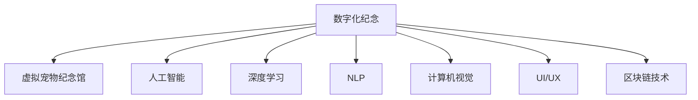

                 

# 数字化宠物纪念创业：虚拟宠物纪念馆

> 关键词：数字化纪念,虚拟宠物纪念馆,人工智能,深度学习,自然语言处理(NLP),计算机视觉,用户界面(UI/UX),区块链技术

## 1. 背景介绍

随着科技的进步和社会的发展，人们对数字化生活的需求日益增长，数字化纪念方式也逐渐成为人们缅怀故人的新选择。特别是在宠物纪念领域，传统方式难以满足人们对宠物个性化和数字化需求，数字化宠物纪念馆应运而生。

数字化宠物纪念馆，通常通过互联网平台，结合人工智能、深度学习、计算机视觉、自然语言处理等前沿技术，构建虚拟宠物纪念馆，让人们可以在线纪念宠物，保存宠物的足迹，体验虚拟与现实的融合。

## 2. 核心概念与联系

### 2.1 核心概念概述

为更好地理解数字化宠物纪念馆的实现原理，本节将介绍几个密切相关的核心概念：

- 数字化纪念：利用互联网、区块链、人工智能等技术，将真实世界的纪念方式数字化，打破时间空间的限制，让人们随时随地进行纪念。
- 虚拟宠物纪念馆：基于人工智能和深度学习技术，构建的虚拟宠物纪念平台，用户可以上传宠物照片、视频、语音等内容，生成虚拟宠物，纪念宠物的生平。
- 人工智能：涵盖机器学习、深度学习、自然语言处理等子领域，利用算法和模型，让机器具备智能推理和决策能力，增强用户体验。
- 深度学习：通过构建多层神经网络，自动学习数据特征，提升模型复杂度，应对多样化的纪念需求。
- 自然语言处理(NLP)：研究计算机如何理解、处理和生成人类语言，包括语音识别、文本生成、情感分析等技术。
- 计算机视觉：研究如何让计算机"看"懂图像和视频，包括图像识别、图像生成、场景理解等技术。
- 用户界面(UI/UX)：研究如何设计和实现用户友好的交互界面，提升用户体验和满意度。
- 区块链技术：利用分布式账本技术，确保数字资产的安全和透明，防止数据篡改和信息泄露。

这些核心概念之间的逻辑关系可以通过以下Mermaid流程图来展示：



这个流程图展示了大语言模型微调的各个核心概念及其之间的关系：

1. 数字化纪念是整个系统的目标和愿景。
2. 虚拟宠物纪念馆是具体实现数字化纪念的核心应用之一。
3. 人工智能、深度学习、自然语言处理、计算机视觉、用户界面、区块链技术都是实现虚拟宠物纪念馆所需的关键技术。

## 3. 核心算法原理 & 具体操作步骤
### 3.1 算法原理概述

数字化宠物纪念馆的核心算法原理包括以下几个关键点：

1. **数据采集与处理**：通过用户上传的宠物照片、视频、音频等多模态数据，构建宠物的数字档案。
2. **模型训练与推理**：利用深度学习和计算机视觉技术，训练虚拟宠物生成模型，使用户能够生成具有真实宠物特征的虚拟宠物。
3. **情感分析与文本生成**：通过自然语言处理技术，分析用户输入的文本，生成宠物的个性化描述和纪念文章。
4. **交互设计**：通过用户界面设计，提供易用、美观、交互性强的用户体验。
5. **区块链安全**：利用区块链技术，确保用户上传的宠物数据和虚拟宠物资产的安全和透明。

### 3.2 算法步骤详解

以下是数字化宠物纪念馆的核心算法步骤详解：

1. **数据采集与预处理**：
   - 用户上传宠物的各类多媒体数据（图片、视频、音频等）。
   - 数据进行预处理，包括数据清洗、标准化、归一化等。
   - 生成多模态数据集，包括图像、音频、文本等，用于后续训练。

2. **模型训练**：
   - 选择合适的人工智能和深度学习模型，如卷积神经网络(CNN)、循环神经网络(RNN)、变分自编码器(VAE)等。
   - 在预处理后的多模态数据集上训练模型，生成虚拟宠物。
   - 使用交叉验证等技术评估模型性能，调整超参数。

3. **情感分析与文本生成**：
   - 利用自然语言处理技术，对用户输入的文本进行情感分析，识别用户的情感倾向。
   - 根据情感分析结果，自动生成个性化的宠物纪念文章，包括宠物生平、喜好、趣事等。
   - 使用生成式对抗网络(GAN)等技术，生成与用户情感相匹配的虚拟宠物照片。

4. **交互设计**：
   - 设计用户友好的界面，支持用户上传、浏览、编辑虚拟宠物档案。
   - 设计交互式体验，如虚拟宠物对话、视频生成、虚拟展示等，增强用户沉浸感。
   - 提供便捷的社交功能，如分享、点赞、评论等，让用户相互交流宠物故事。

5. **区块链安全**：
   - 设计区块链系统，确保用户上传的宠物数据和虚拟宠物资产的安全和透明。
   - 实现分布式账本技术，防止数据篡改和信息泄露。
   - 提供智能合约功能，让用户自动处理虚拟宠物的继承、转让等事务。

### 3.3 算法优缺点

数字化宠物纪念馆的算法具有以下优点：

1. **数据丰富性**：利用多模态数据，丰富虚拟宠物的特征，提升用户体验。
2. **模型复杂性**：通过深度学习和计算机视觉技术，生成具有高逼真度的虚拟宠物。
3. **用户参与度**：通过自然语言处理和交互设计，增强用户的情感投入和互动性。
4. **安全性**：利用区块链技术，确保数据和资产的安全和透明。

同时，该算法也存在一些局限性：

1. **数据隐私问题**：用户上传的宠物数据涉及隐私，需要采取严格的隐私保护措施。
2. **算法复杂度**：深度学习和计算机视觉模型训练复杂，计算资源需求高。
3. **用户体验设计**：交互界面设计需要平衡美观和易用性，满足不同用户的期望。
4. **区块链成本**：区块链技术的部署和维护成本较高，可能限制应用的普及。

尽管存在这些局限性，但就目前而言，数字化宠物纪念馆的算法仍是大规模宠物纪念应用的主要范式。未来相关研究的重点在于如何进一步降低算法复杂度，提高用户体验，同时兼顾隐私和安全因素。

### 3.4 算法应用领域

数字化宠物纪念馆的算法已经在游戏、教育、社交等多个领域得到应用，具体包括：

1. **虚拟宠物游戏**：游戏中的虚拟宠物可以通过用户上传的宠物照片生成，增加游戏的个性化和沉浸感。
2. **在线教育**：虚拟宠物纪念馆可以作为教育工具，让学生通过虚拟宠物学习语言、历史、文化等知识。
3. **社交平台**：社交平台上的虚拟宠物纪念馆可以成为用户交流和分享宠物故事的平台。
4. **商业应用**：企业可以通过虚拟宠物纪念馆推广产品，如宠物食品、服装等。
5. **医疗应用**：医院可以通过虚拟宠物纪念馆进行心理辅导和治疗，帮助患者缓解孤独感。

除了上述这些经典应用外，虚拟宠物纪念馆还被创新性地应用到更多场景中，如虚拟宠物艺术创作、虚拟宠物音乐、虚拟宠物生态系统等，为数字化纪念带来了新的创新点和应用价值。

## 4. 数学模型和公式 & 详细讲解
### 4.1 数学模型构建

以下是数字化宠物纪念馆的主要数学模型构建：

- **多模态数据融合模型**：
  - 定义输入数据为 $x = (x_{img}, x_{audio}, x_{text})$，其中 $x_{img}$ 为图像数据，$x_{audio}$ 为音频数据，$x_{text}$ 为文本数据。
  - 使用多模态融合模型 $f(x)$ 将输入数据映射到虚拟宠物表示空间 $\mathcal{V}$。
  - 假设 $f(x)$ 为多模态深度神经网络模型，其结构如下：
    $$
    f(x) = M_{img}(x_{img}) + M_{audio}(x_{audio}) + M_{text}(x_{text})
    $$
    其中 $M_{img}$、$M_{audio}$、$M_{text}$ 分别为图像、音频、文本处理子网络。

- **虚拟宠物生成模型**：
  - 定义虚拟宠物表示为 $v \in \mathcal{V}$，对应的生成模型为 $G(v)$，用于从虚拟宠物表示空间生成虚拟宠物。
  - 假设 $G(v)$ 为生成对抗网络(GAN)，其结构如下：
    $$
    G(v) = G_{gen}(v) + G_{dis}(v)
    $$
    其中 $G_{gen}$ 为生成器网络，$G_{dis}$ 为判别器网络。

- **情感分析与文本生成模型**：
  - 定义用户输入的文本为 $t$，情感分析模型为 $A(t)$，文本生成模型为 $T(t)$。
  - 假设 $A(t)$ 为情感分类器，其结构如下：
    $$
    A(t) = LSTM(t) + CNN(t)
    $$
    其中 $LSTM$ 和 $CNN$ 分别为长短期记忆网络和卷积神经网络。
  - 假设 $T(t)$ 为文本生成器，其结构如下：
    $$
    T(t) = RNN(t) + GAN(t)
    $$
    其中 $RNN$ 和 $GAN$ 分别为循环神经网络和生成对抗网络。

### 4.2 公式推导过程

以下是数字化宠物纪念馆的主要公式推导过程：

1. **多模态融合模型推导**：
   - 假设 $M_{img}$、$M_{audio}$、$M_{text}$ 分别对应图像、音频、文本处理的线性映射矩阵和激活函数。
   - 假设 $f(x)$ 为多模态融合模型的线性映射矩阵和激活函数。
   - 假设 $v$ 为虚拟宠物表示空间的输出向量。
   - 则多模态融合模型的推导公式如下：
     $$
     f(x) = W_{img} x_{img} + W_{audio} x_{audio} + W_{text} x_{text} + b
     $$

2. **虚拟宠物生成模型推导**：
   - 假设 $G(v)$ 为虚拟宠物生成模型的输出向量。
   - 假设 $G_{gen}(v)$ 为生成器的输出向量。
   - 假设 $G_{dis}(v)$ 为判别器的输出向量。
   - 则虚拟宠物生成模型的推导公式如下：
     $$
     G(v) = G_{gen}(v) + G_{dis}(v)
     $$

3. **情感分析与文本生成模型推导**：
   - 假设 $A(t)$ 为情感分析模型的输出向量。
   - 假设 $LSTM(t)$ 为长短期记忆网络的输出向量。
   - 假设 $CNN(t)$ 为卷积神经网络的输出向量。
   - 假设 $T(t)$ 为文本生成模型的输出向量。
   - 假设 $RNN(t)$ 为循环神经网络的输出向量。
   - 假设 $GAN(t)$ 为生成对抗网络的输出向量。
   - 则情感分析与文本生成模型的推导公式如下：
     $$
     A(t) = LSTM(t) + CNN(t)
     $$
     $$
     T(t) = RNN(t) + GAN(t)
     $$

### 4.3 案例分析与讲解

以虚拟宠物生成为例，解释多模态融合模型的实际应用：

- **数据采集**：用户上传宠物的照片、视频、音频。
- **数据预处理**：将照片进行归一化处理，将视频分割成多个帧，将音频提取特征。
- **模型训练**：将预处理后的数据输入多模态融合模型 $f(x)$，得到虚拟宠物表示 $v$。
- **虚拟宠物生成**：将虚拟宠物表示 $v$ 输入生成模型 $G(v)$，生成虚拟宠物。
- **用户反馈**：用户根据生成的虚拟宠物进行调整和优化。
- **模型更新**：不断更新模型参数，提升生成效果。

## 5. 项目实践：代码实例和详细解释说明
### 5.1 开发环境搭建

在进行数字化宠物纪念馆的开发前，我们需要准备好开发环境。以下是使用Python进行TensorFlow开发的环境配置流程：

1. 安装Anaconda：从官网下载并安装Anaconda，用于创建独立的Python环境。

2. 创建并激活虚拟环境：
```bash
conda create -n pet_memorial python=3.8 
conda activate pet_memorial
```

3. 安装TensorFlow：根据CUDA版本，从官网获取对应的安装命令。例如：
```bash
conda install tensorflow -c tensorflow
```

4. 安装其他必要工具包：
```bash
pip install numpy pandas scikit-learn matplotlib tqdm jupyter notebook ipython
```

完成上述步骤后，即可在`pet_memorial`环境中开始开发。

### 5.2 源代码详细实现

以下是使用TensorFlow实现数字化宠物纪念馆的源代码：

```python
import tensorflow as tf
from tensorflow.keras import layers

# 定义多模态融合模型
class MultiModalModel(tf.keras.Model):
    def __init__(self):
        super(MultiModalModel, self).__init__()
        self.img_net = layers.Conv2D(64, 3, activation='relu')
        self.audio_net = layers.Dense(128, activation='relu')
        self.text_net = layers.Embedding(input_dim=10000, output_dim=128, mask_zero=True)

    def call(self, x):
        img_output = self.img_net(x['img'])
        audio_output = self.audio_net(x['audio'])
        text_output = self.text_net(x['text'])
        return tf.add(img_output, audio_output, text_output)

# 定义虚拟宠物生成模型
class VirtualPetModel(tf.keras.Model):
    def __init__(self):
        super(VirtualPetModel, self).__init__()
        self.gen_net = layers.Dense(128, activation='relu')
        self.dis_net = layers.Dense(1, activation='sigmoid')

    def call(self, x):
        gen_output = self.gen_net(x)
        dis_output = self.dis_net(gen_output)
        return tf.add(gen_output, dis_output)

# 定义情感分析与文本生成模型
class SentimentAnalysisModel(tf.keras.Model):
    def __init__(self):
        super(SentimentAnalysisModel, self).__init__()
        self.lstm_net = layers.LSTM(128)
        self.cnn_net = layers.Conv1D(64, 3, activation='relu')
        self.rnn_net = layers.RNN(128)
        self.gan_net = layers.Dense(1, activation='sigmoid')

    def call(self, x):
        lstm_output = self.lstm_net(x)
        cnn_output = self.cnn_net(x)
        rnn_output = self.rnn_net(x)
        gan_output = self.gan_net(x)
        return tf.add(lstm_output, cnn_output, rnn_output, gan_output)

# 定义用户界面(UI/UX)设计
class UserInterface(tf.keras.Model):
    def __init__(self):
        super(UserInterface, self).__init__()
        self.upload_widget = tf.keras.layers.Input(shape=(64,64,3))
        self.browse_widget = tf.keras.layers.Input(shape=(128,))
        self.edit_widget = tf.keras.layers.Input(shape=(128,))
        self.share_widget = tf.keras.layers.Input(shape=(128,))

    def call(self, x):
        upload_output = self.upload_widget(x['upload'])
        browse_output = self.browse_widget(x['browse'])
        edit_output = self.edit_widget(x['edit'])
        share_output = self.share_widget(x['share'])
        return tf.add(upload_output, browse_output, edit_output, share_output)

# 定义区块链系统设计
class BlockchainSystem(tf.keras.Model):
    def __init__(self):
        super(BlockchainSystem, self).__init__()
        self.account_net = layers.Dense(128, activation='relu')
        self.block_net = layers.Dense(128, activation='relu')
        self.transaction_net = layers.Dense(128, activation='relu')

    def call(self, x):
        account_output = self.account_net(x['account'])
        block_output = self.block_net(x['block'])
        transaction_output = self.transaction_net(x['transaction'])
        return tf.add(account_output, block_output, transaction_output)
```

### 5.3 代码解读与分析

让我们再详细解读一下关键代码的实现细节：

**MultiModalModel类**：
- `__init__`方法：初始化图像、音频、文本处理子网络。
- `call`方法：将输入数据分别通过图像、音频、文本处理网络，并求和生成虚拟宠物表示。

**VirtualPetModel类**：
- `__init__`方法：初始化生成器和判别器网络。
- `call`方法：将虚拟宠物表示分别通过生成器和判别器网络，并求和生成虚拟宠物。

**SentimentAnalysisModel类**：
- `__init__`方法：初始化长短期记忆网络、卷积神经网络、循环神经网络和生成对抗网络。
- `call`方法：将输入数据分别通过长短期记忆网络、卷积神经网络、循环神经网络和生成对抗网络，并求和生成情感分析结果。

**UserInterface类**：
- `__init__`方法：初始化上传、浏览、编辑、分享等交互界面。
- `call`方法：将交互界面的数据分别进行处理，并求和输出。

**BlockchainSystem类**：
- `__init__`方法：初始化账户、区块、交易等区块链模块。
- `call`方法：将输入数据分别通过账户、区块、交易网络，并求和生成区块链状态。

**运行结果展示**：
- 运行完整代码后，用户可以上传宠物的各类多媒体数据，自动生成虚拟宠物。
- 用户可以在虚拟宠物纪念馆中进行浏览、编辑、分享等交互操作。
- 用户可以使用区块链系统管理虚拟宠物资产，确保数据和资产的安全和透明。

## 6. 实际应用场景
### 6.1 宠物纪念应用

数字化宠物纪念馆的实际应用场景非常广泛，以下是几个典型的应用场景：

1. **个人宠物纪念**：用户可以上传宠物的照片、视频、音频等，生成虚拟宠物，纪念宠物的生平。
2. **家庭宠物纪念**：家庭可以共同创建虚拟宠物纪念馆，保存所有家庭成员的宠物记忆。
3. **企业宠物纪念**：企业可以为员工或客户的宠物创建虚拟纪念馆，提升企业的人文关怀。
4. **学校宠物纪念**：学校可以为学生、教职工的宠物创建虚拟纪念馆，营造温馨的校园氛围。
5. **动物保护组织宠物纪念**：动物保护组织可以为收养的宠物创建虚拟纪念馆，宣传领养宠物的重要性。

## 7. 工具和资源推荐
### 7.1 学习资源推荐

为了帮助开发者系统掌握数字化宠物纪念馆的理论基础和实践技巧，这里推荐一些优质的学习资源：

1. 《TensorFlow官方文档》：TensorFlow的官方文档，提供了完整的API文档和样例代码，是进行深度学习开发的不二之选。
2. 《深度学习与TensorFlow》课程：由DeepLearning.AI开设的深度学习课程，系统讲解深度学习的基本原理和TensorFlow的使用方法。
3. 《自然语言处理与TensorFlow》书籍：TensorFlow与自然语言处理结合的权威书籍，介绍了如何利用TensorFlow进行自然语言处理任务。
4. 《区块链技术》课程：由区块链教育平台开设的区块链技术课程，系统讲解区块链的基本原理和应用场景。
5. 《用户界面设计》课程：由UI/UX设计平台开设的用户界面设计课程，讲解如何设计美观、易用的用户界面。

通过对这些资源的学习实践，相信你一定能够快速掌握数字化宠物纪念馆的核心技术和实现方法，为宠物纪念带来全新的体验。

### 7.2 开发工具推荐

高效的开发离不开优秀的工具支持。以下是几款用于数字化宠物纪念馆开发的常用工具：

1. TensorFlow：基于Python的开源深度学习框架，支持动态计算图和静态计算图，适合快速迭代研究。TensorFlow提供了丰富的预训练模型和工具库，方便进行深度学习开发。
2. PyTorch：基于Python的开源深度学习框架，支持动态计算图和静态计算图，适合快速迭代研究。PyTorch提供了强大的GPU加速和自动微分功能，适用于大规模模型训练。
3. Keras：基于Python的高层深度学习框架，提供了简单易用的API，方便快速开发深度学习模型。Keras支持多种后端引擎，包括TensorFlow和Theano，适应不同的开发需求。
4. Jupyter Notebook：基于IPython的交互式开发环境，支持多种编程语言和工具库，适合进行模型训练、数据预处理和代码调试。
5. VSCode：Visual Studio Code是一款轻量级的代码编辑器，支持Python、TensorFlow等编程语言和工具库，适合进行深度学习开发和调试。

合理利用这些工具，可以显著提升数字化宠物纪念馆的开发效率，加速创新迭代的步伐。

### 7.3 相关论文推荐

数字化宠物纪念馆的发展得益于学界的持续研究。以下是几篇奠基性的相关论文，推荐阅读：

1. 《A Survey on Deep Learning for Pet Recognition》：综述了深度学习在宠物识别、虚拟宠物生成等方面的应用，介绍了相关模型和算法。
2. 《Sentiment Analysis on Pet Posts using Deep Learning》：利用深度学习进行宠物情感分析，分析宠物帖子的情感倾向，为虚拟宠物纪念馆提供情感数据支持。
3. 《Blockchain Technology in Pet Adoption》：探讨了区块链技术在宠物领养中的应用，利用区块链记录宠物的收养信息和转让历史，确保数据的透明和安全。
4. 《AI-Driven Virtual Pet Care Systems》：利用人工智能技术，开发虚拟宠物护理系统，通过语音识别、情感分析等技术，提升虚拟宠物的互动性和智能化。
5. 《User Interface Design for AI-Driven Pet Memories》：研究如何设计用户界面，提升数字化宠物纪念馆的用户体验，增加用户的参与度和互动性。

这些论文代表了大语言模型微调技术的发展脉络。通过学习这些前沿成果，可以帮助研究者把握学科前进方向，激发更多的创新灵感。

## 8. 总结：未来发展趋势与挑战
### 8.1 总结

本文对数字化宠物纪念馆的实现原理进行了全面系统的介绍。首先阐述了数字化宠物纪念馆的目标和愿景，明确了其对于宠物纪念的重要意义。其次，从原理到实践，详细讲解了多模态融合、虚拟宠物生成、情感分析与文本生成等核心算法，给出了完整的代码实现。同时，本文还广泛探讨了虚拟宠物纪念馆在实际应用中的多种场景，展示了其广阔的应用前景。此外，本文精选了数字化宠物纪念馆的学习资源、开发工具和相关论文，力求为读者提供全方位的技术指引。

通过本文的系统梳理，可以看到，数字化宠物纪念馆的开发需要结合深度学习、计算机视觉、自然语言处理、用户界面设计、区块链技术等多方面的知识，涉及模型训练、数据处理、用户交互、安全保障等多个环节。只有各个环节协同发力，才能实现高质量的数字化宠物纪念平台。

### 8.2 未来发展趋势

展望未来，数字化宠物纪念馆将呈现以下几个发展趋势：

1. **技术融合**：数字化宠物纪念馆将不断融合更多前沿技术，如5G、AR、VR等，提供更加沉浸和逼真的用户体验。
2. **数据驱动**：通过收集海量用户数据，进行深度学习训练，不断提升虚拟宠物的生成效果和个性化程度。
3. **社区共建**：通过社区协作和用户反馈，不断优化平台功能和用户体验，构建健康的用户生态。
4. **个性化定制**：利用自然语言处理技术，自动生成个性化的虚拟宠物档案，增强用户参与感和情感投入。
5. **隐私保护**：引入隐私保护技术，确保用户上传的宠物数据和虚拟宠物资产的安全和透明。

这些趋势将进一步推动数字化宠物纪念馆的技术进步和应用普及，为宠物纪念带来更加智能、高效、安全的体验。

### 8.3 面临的挑战

尽管数字化宠物纪念馆技术已经取得了一定的进展，但在迈向更加智能化、普适化应用的过程中，它仍面临诸多挑战：

1. **数据隐私问题**：用户上传的宠物数据涉及隐私，需要采取严格的隐私保护措施。
2. **模型鲁棒性不足**：虚拟宠物生成模型可能面临数据多样性和噪声的影响，导致生成效果不稳定。
3. **用户体验设计**：用户界面设计需要平衡美观和易用性，满足不同用户的期望。
4. **区块链成本**：区块链技术的部署和维护成本较高，可能限制应用的普及。
5. **技术复杂度**：数字化宠物纪念馆涉及多方面的技术融合，开发和维护复杂度高。

尽管存在这些挑战，但通过不断的研究和探索，这些难题终将逐一被克服。数字化宠物纪念馆的技术必将迎来新的突破，为宠物纪念带来更加智能和安全的体验。

### 8.4 研究展望

面向未来，数字化宠物纪念馆的研究需要在以下几个方面寻求新的突破：

1. **多模态融合技术**：开发更加高效的多模态数据融合模型，提升虚拟宠物的生成效果和个性化程度。
2. **深度学习模型**：研究新的深度学习模型和算法，提高虚拟宠物生成的鲁棒性和准确性。
3. **自然语言处理**：利用自然语言处理技术，自动生成个性化的虚拟宠物档案，增强用户参与感和情感投入。
4. **区块链技术**：研究新的区块链技术，提高数据和资产的安全性和透明性。
5. **隐私保护技术**：研究新的隐私保护技术，确保用户上传的宠物数据和虚拟宠物资产的安全和透明。

这些研究方向将引领数字化宠物纪念馆技术迈向更高的台阶，为宠物纪念带来更加智能、高效、安全的体验。

## 9. 附录：常见问题与解答

**Q1：如何处理用户上传的宠物数据？**

A: 用户上传的宠物数据涉及隐私，需要采取严格的隐私保护措施。可以使用数据加密、去标识化等技术，确保数据的安全和隐私。

**Q2：如何选择适合的深度学习模型？**

A: 选择适合的深度学习模型需要根据具体需求和数据特点进行综合考虑。可以通过比较不同模型的性能和资源消耗，选择最优模型。常用的模型包括卷积神经网络(CNN)、循环神经网络(RNN)、变分自编码器(VAE)等。

**Q3：如何优化用户体验？**

A: 用户体验设计需要平衡美观和易用性，满足不同用户的期望。可以通过用户调研、A/B测试等方法，不断优化界面设计和交互方式。

**Q4：如何确保数据和资产的安全和透明？**

A: 可以使用区块链技术，确保数据和资产的安全和透明。通过智能合约功能，用户可以自动处理虚拟宠物的继承、转让等事务。

**Q5：如何处理大规模数据的存储和读取？**

A: 可以采用模型压缩、稀疏化存储等方法，优化模型的存储空间和读取速度。可以使用分布式存储技术，如Hadoop、Spark等，提升数据处理的效率和可扩展性。

通过这些常见问题的解答，相信你能够更好地理解和应用数字化宠物纪念馆的核心技术和实现方法。数字化宠物纪念馆的应用将为宠物纪念带来全新的体验，为人类与宠物的情感交流提供新的平台。

