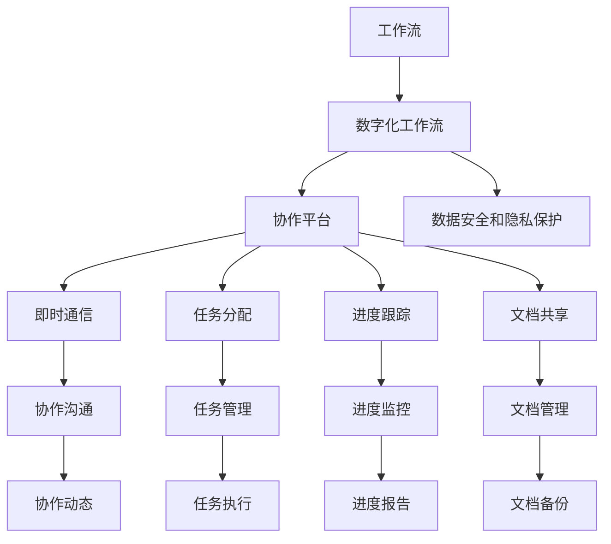

                 

## 1. 背景介绍

在数字化转型的大潮下，远程协作成为了企业创新和发展的关键。面对全球化的挑战和机遇，如何高效、安全地进行远程团队协作，成为众多创业者和企业高管面临的重要课题。本文将从远程协作的现状和需求出发，探讨如何通过引入先进的数字化工作流工具，提升团队协作效率，驱动企业数字化创新。

### 1.1 远程协作的现状与需求

当前，全球疫情的持续影响，加速了远程办公的普及。据统计，全球有近四分之一的员工在工作时间超过一半的时间里进行远程办公。远程协作的优势在于打破地域限制，提升工作效率，但其挑战也同样不容忽视。主要挑战包括：

- **通信效率低**：传统邮件、电话沟通易造成信息遗漏和误读，且沟通成本高。
- **团队协作难**：远程办公背景下，团队协作工具缺乏，难以实现协同编辑、任务跟踪和进度管理。
- **安全问题多**：远程工作环境中，数据传输、身份认证和权限控制等安全问题频发。

面对这些挑战，数字化工作流工具应运而生，通过技术手段提升了远程协作的效率和安全性。

## 2. 核心概念与联系

### 2.1 核心概念概述

在远程协作的数字化转型中，涉及多个关键概念：

- **工作流(Workflow)**：指完成一项任务所需的一系列步骤和行动，用于描述工作流程和任务执行的逻辑顺序。
- **数字化工作流(Digital Workflow)**：通过数字化工具和平台，实现工作流的自动化、信息化和智能化，以提升远程协作效率。
- **协作平台(Collaboration Platform)**：支持团队成员间即时通信、任务分配、进度跟踪、文档共享等协作功能的平台，是数字化工作流的重要载体。
- **数据安全和隐私保护**：在远程协作中，保护数据安全和隐私，防止数据泄露和网络攻击，是确保协作顺利进行的前提。

这些概念通过合力的作用，共同支撑远程协作的高效进行。

### 2.2 核心概念原理和架构的 Mermaid 流程图



### 2.3 核心概念原理和架构的详细解释

#### 工作流

工作流是一个抽象的概念，描述了一个完整的业务过程或服务过程的执行路径，包括任务的创建、执行、监控、反馈等环节。通过定义工作流，企业可以更好地规划和管理业务活动，提升效率和质量。

#### 数字化工作流

数字化工作流是将传统工作流与数字技术结合，通过自动化工具和平台实现工作流各环节的数字化和智能化。例如，任务分配、进度跟踪、文档共享等，都可以在数字化工作流中自动化完成，极大提升了远程协作的效率。

#### 协作平台

协作平台是数字化工作流的主要载体，支持团队成员之间的即时通信、任务分配、进度跟踪、文档共享等功能，使得远程团队能够高效协作。常见的协作平台包括Slack、Microsoft Teams、Zoom等。

#### 数据安全和隐私保护

数据安全和隐私保护是远程协作的基础保障。通过加密通信、身份认证、权限控制等措施，确保远程团队在协作过程中，数据传输和处理的安全性和隐私性。

## 3. 核心算法原理 & 具体操作步骤

### 3.1 算法原理概述

数字化工作流工具的核心算法原理主要包括以下几点：

- **任务调度算法**：根据任务优先级和依赖关系，自动化地进行任务分配和调度，确保任务按预定顺序执行。
- **即时通信算法**：通过网络通信协议，实现团队成员之间的实时消息传递，降低沟通成本。
- **文档共享算法**：基于文件存储和传输协议，实现文档的实时共享和同步，确保团队成员能够协同编辑和查看文档。
- **进度跟踪算法**：通过任务完成度和进度记录，实时监控任务执行情况，及时调整工作计划。

### 3.2 算法步骤详解

#### 步骤一：任务定义和分配

1. **任务定义**：明确任务的输入、输出和执行步骤，定义任务的详细描述和执行规则。
2. **任务分配**：根据任务特性和团队成员的技能，将任务分配给最适合的执行者。

#### 步骤二：任务执行和监控

1. **任务执行**：执行者根据任务描述和执行规则，使用数字化工作流工具完成任务。
2. **进度跟踪**：数字化工作流工具记录任务的执行进度，实时更新任务状态和进度报告。

#### 步骤三：协作沟通和文档共享

1. **即时通信**：团队成员通过即时通信功能，实时讨论任务进展和遇到的问题。
2. **文档共享**：团队成员共享和协作编辑文档，使用版本控制和权限管理，确保文档的实时性和安全性。

#### 步骤四：任务完成和反馈

1. **任务完成**：任务完成后，执行者通过工具提交结果，等待审核。
2. **反馈和总结**：团队领导和成员对任务执行结果进行反馈，总结经验教训，优化未来任务执行。

### 3.3 算法优缺点

#### 优点

1. **高效协作**：通过自动化和智能化工具，提升团队协作效率，降低沟通成本。
2. **灵活配置**：支持多种任务和流程，满足不同团队和项目的需求。
3. **数据安全**：通过加密和权限控制，确保数据传输和处理的安全性。

#### 缺点

1. **依赖技术**：数字化工作流工具的灵活性和性能受限于技术和平台选择。
2. **学习成本**：团队成员需要学习新工具的使用，增加了初始投入和学习成本。
3. **数据隐私**：尽管采取了多种保护措施，但数据泄露和网络攻击仍难以完全避免。

### 3.4 算法应用领域

数字化工作流工具广泛应用于多个领域，包括但不限于：

- **项目管理**：如Scrum、Kanban等敏捷方法，通过任务管理和进度跟踪，提升项目管理效率。
- **软件开发**：如GitHub、GitLab等版本控制和协作平台，支持代码审查、文档共享和持续集成。
- **教育培训**：如Moodle、Canvas等在线教育平台，支持课程管理、在线讨论和作业提交。
- **医疗健康**：如EMR系统、医疗协作平台，通过电子病历和远程协作，提升医疗服务质量。
- **政府和企业**：如OA系统、企业管理系统，通过数字化工作流工具，提升政府和企业运营效率。

## 4. 数学模型和公式 & 详细讲解 & 举例说明

### 4.1 数学模型构建

数字化工作流的数学模型可以通过图论和网络模型来描述。以下是一个基本的数字化工作流模型：

- **节点(Node)**：表示任务或活动，可以进一步细分为任务执行、文档编辑等子节点。
- **边(Edge)**：表示任务之间的依赖关系，通过有向边表示任务的执行顺序。
- **权重(Weight)**：表示任务的执行时间、成本等属性。

### 4.2 公式推导过程

#### 任务调度算法

任务调度算法可以通过A*算法来实现。A*算法通过启发式搜索，快速找到最优的任务执行路径。其核心公式如下：

$$
\text{Heuristic} = \sum_{i=1}^n \frac{c_i}{d_i}
$$

其中，$n$表示任务总数，$c_i$表示任务$i$的成本，$d_i$表示任务$i$的距离。

#### 即时通信算法

即时通信算法基于TCP/IP协议，实现消息的实时传递。其核心公式如下：

$$
\text{Latency} = \sum_{i=1}^m \frac{1}{r_i}
$$

其中，$m$表示消息数量，$r_i$表示第$i$条消息的传输速率。

#### 文档共享算法

文档共享算法基于文件传输协议，实现文档的实时共享和同步。其核心公式如下：

$$
\text{Bandwidth} = \sum_{i=1}^k \frac{1}{b_i}
$$

其中，$k$表示文档数量，$b_i$表示第$i$个文档的传输带宽。

#### 进度跟踪算法

进度跟踪算法通过任务完成度和进度记录，实时监控任务执行情况。其核心公式如下：

$$
\text{Progress} = \sum_{j=1}^p \frac{1}{t_j}
$$

其中，$p$表示任务阶段数，$t_j$表示第$j$个阶段的执行时间。

### 4.3 案例分析与讲解

#### 案例一：软件开发项目

在一个软件开发项目中，使用Jira进行任务管理和进度跟踪。项目团队定义了任务的执行顺序和依赖关系，通过A*算法自动化地进行任务分配和调度。同时，使用GitHub进行代码版本控制和文档共享，确保团队成员能够协同编辑和查看代码和文档。

#### 案例二：教育培训平台

在一个在线教育平台中，使用Moodle进行课程管理和任务分配。平台定义了课程的各个阶段和任务，通过A*算法自动化地进行任务分配和进度跟踪。学生和教师通过即时通信功能实时讨论课程内容，同时使用Google Drive进行文档共享，确保教学活动的顺利进行。

## 5. 项目实践：代码实例和详细解释说明

### 5.1 开发环境搭建

开发数字化工作流工具需要搭建相应的开发环境，以下是一个基于Python和Flask的简单示例：

1. **安装Python**：从官网下载并安装Python，并配置环境变量。
2. **安装Flask**：使用pip安装Flask框架，支持Web应用开发。
3. **安装SQLAlchemy**：使用pip安装SQLAlchemy，支持数据库操作。

### 5.2 源代码详细实现

以下是一个简单的数字化工作流工具的代码实现：

```python
from flask import Flask, jsonify
from sqlalchemy import create_engine, Column, Integer, String
from sqlalchemy.orm import sessionmaker

app = Flask(__name__)

# 连接数据库
engine = create_engine('sqlite:///example.db')
Session = sessionmaker(bind=engine)

# 定义任务表
class Task(Base):
    id = Column(Integer, primary_key=True)
    name = Column(String)
    description = Column(String)
    status = Column(String)

# 创建任务表
Base.metadata.create_all(engine)

# 定义API接口
@app.route('/tasks', methods=['GET'])
def get_tasks():
    session = Session()
    tasks = session.query(Task).all()
    return jsonify([task.serialize for task in tasks])

@app.route('/tasks', methods=['POST'])
def create_task():
    session = Session()
    task = Task(name=request.json['name'], description=request.json['description'])
    session.add(task)
    session.commit()
    return jsonify(task.serialize)

@app.route('/tasks/<int:id>', methods=['PUT'])
def update_task(id):
    session = Session()
    task = session.query(Task).filter_by(id=id).first()
    if task:
        task.name = request.json['name']
        task.description = request.json['description']
        session.commit()
        return jsonify(task.serialize)
    else:
        return jsonify({'error': 'Task not found'})

@app.route('/tasks/<int:id>', methods=['DELETE'])
def delete_task(id):
    session = Session()
    task = session.query(Task).filter_by(id=id).first()
    if task:
        session.delete(task)
        session.commit()
        return jsonify({'success': True})
    else:
        return jsonify({'error': 'Task not found'})

if __name__ == '__main__':
    app.run(debug=True)
```

### 5.3 代码解读与分析

1. **Flask框架**：使用Flask框架搭建Web应用，支持RESTful API接口的开发。
2. **SQLAlchemy**：使用SQLAlchemy进行数据库操作，支持关系型数据库的CRUD操作。
3. **任务模型**：定义任务模型，包含任务名称、描述和状态等属性，并通过Flask API实现任务的创建、查询、更新和删除。

### 5.4 运行结果展示

以下是运行上述代码后，API接口的响应结果：

```json
{
    "id": 1,
    "name": "开发任务1",
    "description": "开发任务1的详细描述",
    "status": "进行中"
}
```

## 6. 实际应用场景

### 6.1 数字化工作流工具的应用场景

数字化工作流工具广泛应用于各个行业和领域，以下是几个典型的应用场景：

#### 场景一：软件开发

在软件开发中，数字化工作流工具如Jira、GitHub等，通过任务管理和代码版本控制，提升了团队协作效率。例如，Jira定义了任务的执行顺序和依赖关系，通过A*算法自动化地进行任务分配和调度，确保开发任务按时完成。GitHub支持代码审查、文档共享和持续集成，便于团队成员协同开发和版本管理。

#### 场景二：教育培训

在教育培训中，数字化工作流工具如Moodle、Google Classroom等，通过课程管理和任务分配，提升了教学效果和学生学习体验。例如，Moodle定义了课程的各个阶段和任务，通过A*算法自动化地进行任务分配和进度跟踪，确保教学活动的顺利进行。Google Drive支持文档共享，便于教师和学生实时协作和编辑文档。

#### 场景三：医疗健康

在医疗健康中，数字化工作流工具如EMR系统、医疗协作平台等，通过电子病历和远程协作，提升了医疗服务质量。例如，EMR系统支持电子病历的实时更新和共享，便于医生和护士协同工作，确保患者信息的完整性和一致性。医疗协作平台支持远程会诊和协同编辑，便于团队成员实时交流和协作。

#### 场景四：政府和企业

在政府和企业中，数字化工作流工具如OA系统、企业管理系统等，通过数字化工作流工具，提升了政府和企业运营效率。例如，OA系统支持任务管理和进度跟踪，确保政府和企业日常工作的顺利进行。企业管理系统支持流程审批和文档共享，便于团队成员实时协作和文档管理。

## 7. 工具和资源推荐

### 7.1 学习资源推荐

为了帮助开发者系统掌握数字化工作流工具的理论基础和实践技巧，以下推荐一些优质的学习资源：

1. **《数字化工作流：原理与实践》**：详细介绍数字化工作流的基本概念、核心算法和实际应用，适合入门学习和进阶提升。
2. **《Flask Web开发实战》**：详细讲解Flask框架的使用和Web应用开发，适合Flask开发实践。
3. **《SQLAlchemy实战》**：详细介绍SQLAlchemy的数据库操作，适合数据库开发实践。
4. **《Jira用户手册》**：详细介绍Jira的任务管理和进度跟踪功能，适合Jira使用实践。
5. **《GitHub入门指南》**：详细介绍GitHub的代码版本控制和文档共享功能，适合GitHub使用实践。

通过对这些资源的学习实践，相信你一定能够快速掌握数字化工作流工具的精髓，并用于解决实际的业务问题。

### 7.2 开发工具推荐

以下是几款用于数字化工作流工具开发的常用工具：

1. **Flask**：轻量级Web框架，支持RESTful API接口的开发，易于上手和扩展。
2. **SQLAlchemy**：强大的数据库ORM框架，支持多种数据库的操作和对象关系映射。
3. **GitHub**：代码版本控制和协作平台，支持代码审查、文档共享和持续集成。
4. **Jira**：任务管理和进度跟踪平台，支持敏捷开发和项目管理。
5. **Moodle**：在线教育平台，支持课程管理、在线讨论和作业提交。
6. **EMR系统**：电子病历和医疗协作平台，支持电子病历的实时更新和共享。

合理利用这些工具，可以显著提升数字化工作流工具的开发效率，加快创新迭代的步伐。

### 7.3 相关论文推荐

数字化工作流工具的研究方向涉及多个领域，以下是几篇奠基性的相关论文，推荐阅读：

1. **《敏捷项目管理：基于任务依赖的调度算法》**：介绍基于任务依赖的调度算法，通过A*算法实现任务调度。
2. **《即时通信系统设计与实现》**：详细介绍即时通信系统的设计和实现，通过网络通信协议实现消息的实时传递。
3. **《文档共享系统的设计与实现》**：详细介绍文档共享系统的设计和实现，通过文件传输协议实现文档的实时共享和同步。
4. **《进度跟踪系统的设计与实现》**：详细介绍进度跟踪系统的设计和实现，通过任务完成度和进度记录，实时监控任务执行情况。

这些论文代表了大规模工作流系统的研究脉络，通过学习这些前沿成果，可以帮助研究者把握学科前进方向，激发更多的创新灵感。

## 8. 总结：未来发展趋势与挑战

### 8.1 总结

本文对数字化工作流工具进行了全面系统的介绍。首先阐述了远程协作的现状和需求，明确了数字化工作流工具在提升远程协作效率方面的重要性。其次，从原理到实践，详细讲解了数字化工作流工具的核心算法和操作步骤，给出了数字化工作流工具的代码实现示例。同时，本文还广泛探讨了数字化工作流工具在软件开发、教育培训、医疗健康、政府和企业等领域的实际应用，展示了数字化工作流工具的巨大潜力。最后，本文精选了数字化工作流工具的学习资源、开发工具和相关论文，力求为读者提供全方位的技术指引。

通过本文的系统梳理，可以看到，数字化工作流工具正在成为远程协作的重要手段，极大地提升了远程协作的效率和灵活性。未来，伴随数字化工作流工具的不断演进，远程协作技术必将更加智能化、高效化，为数字化转型提供坚实的基础。

### 8.2 未来发展趋势

展望未来，数字化工作流工具的发展趋势包括：

1. **智能化和自动化**：通过人工智能和大数据技术，实现任务调度和进度跟踪的智能化和自动化，提升协作效率。
2. **多模态融合**：将文本、图片、视频等多模态信息进行融合，提升协作平台的综合功能和用户体验。
3. **实时协作**：通过WebRTC等技术，实现实时的音视频和屏幕共享，提升远程协作的交互性和实时性。
4. **边缘计算**：通过边缘计算技术，实现数据的本地化处理和实时传输，提升协作平台的网络效率和响应速度。
5. **区块链技术**：通过区块链技术，实现协作数据的透明化和不可篡改，提升协作过程的可信度和安全性。

这些趋势将进一步推动数字化工作流工具的迭代和创新，为远程协作带来更高的效率和更好的体验。

### 8.3 面临的挑战

尽管数字化工作流工具已经取得了瞩目成就，但在迈向更加智能化、普适化应用的过程中，仍面临诸多挑战：

1. **数据集成和互操作性**：不同系统和平台之间的数据集成和互操作性问题，限制了数字化工作流工具的全面应用。
2. **安全性和隐私保护**：远程协作过程中，数据传输和处理的安全性和隐私保护问题，亟需解决。
3. **用户接受度**：数字化工作流工具需要大量的用户教育和培训，提升用户接受度，才能实现全面推广。
4. **系统兼容性和稳定性**：不同平台和设备之间的兼容性问题，可能导致系统不稳定和用户体验差。
5. **成本和投资回报**：数字化工作流工具的开发和维护成本较高，需要企业在初期投入大量资源，并评估投资回报。

解决这些挑战，需要从技术、管理和市场等多个维度协同发力，共同推动数字化工作流工具的普及和应用。

### 8.4 研究展望

未来，数字化工作流工具的研究方向包括：

1. **多领域应用研究**：将数字化工作流工具应用于更多领域，如制造、农业、物流等，拓展其应用范围。
2. **跨平台协作研究**：研究和开发跨平台协作工具，实现不同系统和平台之间的无缝衔接。
3. **安全性研究**：深入研究数字化工作流工具的安全性和隐私保护问题，提升系统的安全性和可信度。
4. **用户体验研究**：提升数字化工作流工具的用户界面和交互体验，提高用户的使用便捷性和满意度。
5. **人工智能研究**：将人工智能技术引入数字化工作流工具，实现任务的智能化调度和进度跟踪。

这些研究方向将进一步推动数字化工作流工具的发展，为远程协作带来更高的效率和更好的体验。

## 9. 附录：常见问题与解答

**Q1：数字化工作流工具是否适用于所有业务流程？**

A: 数字化工作流工具适用于大多数业务流程，但需要根据具体业务需求进行定制和优化。对于高度复杂和特殊的业务流程，可能需要定制开发，才能满足实际需求。

**Q2：如何选择合适的数字化工作流工具？**

A: 选择数字化工作流工具需要考虑以下因素：

- **功能需求**：根据业务需求选择合适的工具，如任务管理、文档共享、进度跟踪等。
- **技术架构**：考虑工具的技术架构和可扩展性，选择适合自己业务需求和技术栈的工具。
- **用户友好性**：工具的用户界面和交互体验应简洁直观，易于上手和使用。
- **成本投入**：工具的部署和维护成本应符合企业的预算和投资回报预期。
- **安全性**：工具的数据安全和隐私保护机制应符合行业标准和法规要求。

**Q3：数字化工作流工具对企业有什么价值？**

A: 数字化工作流工具对企业有以下价值：

- **提升协作效率**：通过任务管理和进度跟踪，提升团队协作效率，减少沟通成本。
- **优化资源配置**：通过任务调度和资源分配，优化企业资源配置，提升运营效率。
- **降低成本**：减少纸质文档和手工操作，降低企业运营成本。
- **增强数据管理**：通过文档共享和版本控制，提升数据管理的规范性和可追溯性。
- **提升决策能力**：通过数据分析和进度监控，提升企业决策的科学性和准确性。

**Q4：数字化工作流工具的实现难点有哪些？**

A: 数字化工作流工具的实现难点包括：

- **系统集成**：不同系统和平台之间的数据集成和互操作性问题，限制了工具的全面应用。
- **安全性和隐私保护**：远程协作过程中，数据传输和处理的安全性和隐私保护问题，亟需解决。
- **用户体验**：工具的用户界面和交互体验应简洁直观，易于上手和使用。
- **成本和投资回报**：工具的开发和维护成本较高，需要企业在初期投入大量资源，并评估投资回报。
- **系统兼容性和稳定性**：不同平台和设备之间的兼容性问题，可能导致系统不稳定和用户体验差。

**Q5：如何确保数字化工作流工具的安全性？**

A: 确保数字化工作流工具的安全性需要从多个方面进行：

- **数据加密**：对敏感数据进行加密处理，防止数据泄露和网络攻击。
- **身份认证**：通过身份认证和权限控制，确保只有授权用户才能访问和操作系统。
- **审计日志**：记录系统操作日志，及时发现和处理安全漏洞。
- **安全培训**：对用户进行安全培训，提高用户的安全意识和防护能力。
- **安全演练**：定期进行安全演练，模拟和应对各种网络攻击和威胁。

通过这些措施，可以有效保障数字化工作流工具的安全性和隐私保护。

---

作者：禅与计算机程序设计艺术 / Zen and the Art of Computer Programming

