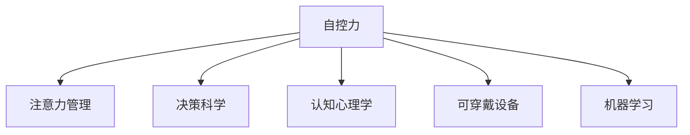

                 

## 1. 背景介绍

### 1.1 问题由来

随着信息时代的到来，人类社会的生产生活方式发生了翻天覆地的变化。互联网、移动互联网、物联网等技术的普及，极大地丰富了人们的生活和工作内容，但也带来了前所未有的信息过载和注意力分散问题。据统计，每个人每天接触到的新闻、邮件、社交信息等可达数以亿计，而人在一天中有效注意力的时间只有两三个小时，难以集中精力处理复杂的信息和任务。

### 1.2 问题核心关键点

自我控制力在现代社会中的重要性愈发凸显。自我控制力是实现目标和提升效率的关键，它能够帮助人们有效地管理时间和注意力，减少无意义的干扰，保持专注，从而更高效地完成任务。然而，由于现代生活的复杂性和多样性，以及科技产品的诱惑，人们常常感到力不从心，难以控制自己的行为和情绪。

通过数字化手段提升自我控制力，成为当前技术研究的热点。本文将探讨基于AI的自我控制增强技术，介绍其核心概念和实现方法，并展望其未来应用前景。

## 2. 核心概念与联系

### 2.1 核心概念概述

为更好地理解AI增强的自我控制技术，本节将介绍几个关键概念：

- **自控力(Autonomy)**：指个体在行为选择中的独立性和自主性。自控力强的人能够抵制诱惑、坚持目标，高效完成任务。

- **注意力管理(Attention Management)**：指管理注意力的分配和转移，避免注意力分散，提升对重要信息的敏感度。

- **决策科学(Decision Science)**：研究如何利用数据和算法优化决策过程，帮助个体在复杂环境中做出合理选择。

- **认知心理学(Cognitive Psychology)**：研究人类认知过程的规律和机制，指导如何设计工具来改善认知功能。

- **可穿戴设备(Wearable Devices)**：如智能手表、健康监测设备等，可以实时采集用户的生理和行为数据，提供量化评估和反馈。

- **机器学习(Machine Learning)**：一种通过算法模型从数据中自动学习和改进的技术，能够帮助识别行为模式，提供个性化建议。

这些核心概念之间的逻辑关系可以通过以下Mermaid流程图来展示：



这个流程图展示了这个框架的核心概念及其之间的关系：

1. **自控力**：是整个系统的目标，自控力的提升需要多个模块共同协作。
2. **注意力管理**：提升自控力的关键之一，通过控制注意力分配来避免干扰。
3. **决策科学**：基于数据和算法优化决策过程，提升自控力的执行效率。
4. **认知心理学**：指导如何设计工具和策略，适应人类认知机制。
5. **可穿戴设备**：提供实时数据，帮助评估和反馈。
6. **机器学习**：分析用户行为数据，提供个性化的改进建议。

## 3. 核心算法原理 & 具体操作步骤

### 3.1 算法原理概述

AI增强的自我控制技术，本质上是一种基于数据和算法的行为干预方法。其核心思想是通过对用户的行为数据进行分析和建模，识别出影响自控力的关键因素，并制定相应的干预策略。这些策略可能包括注意力引导、情绪调节、决策支持等，以帮助用户提升自我控制力。

具体而言，AI增强的自我控制过程可以概括为以下步骤：

1. **数据采集**：使用可穿戴设备或传感器实时采集用户的生理和行为数据，如心率、注意力持续时间、行为轨迹等。
2. **数据处理**：通过预处理和特征提取，将原始数据转化为可供分析的格式。
3. **模型训练**：利用机器学习模型对用户数据进行分析，识别出影响自控力的关键行为特征。
4. **干预策略制定**：根据模型的分析结果，制定个性化的行为干预策略，如注意力提醒、情绪调节、任务优先级调整等。
5. **干预实施**：通过应用APP、智能手表等设备，将干预策略实时推送给用户。
6. **效果评估**：利用问卷调查、生理数据等手段，评估干预策略的效果，并不断优化模型和策略。

### 3.2 算法步骤详解

**Step 1: 数据采集**

首先，需要设计并部署数据采集设备，实时收集用户的行为和生理数据。常用的可穿戴设备包括智能手表、健康监测设备等，它们可以实时采集心率、血氧饱和度、脑电波等生理数据，以及用户的操作轨迹、注意力持续时间等行为数据。

数据采集设备的设计需要考虑数据的准确性、隐私保护和用户接受度。例如，智能手表需要保证心率传感器的高精度和稳定性，同时要设计友好的用户界面，让用户乐于佩戴和分享数据。

**Step 2: 数据处理**

采集到的数据需要进行预处理和特征提取，以便后续分析和建模。数据预处理包括去噪、标准化、缺失值填补等操作。特征提取则是对原始数据进行加工，提取对自控力有影响的特征，如注意力持续时间、分心次数、任务完成率等。

特征提取是整个系统的关键，需要根据具体应用场景设计合理的特征。例如，在注意力管理中，可能需要提取用户在不同时间段内的分心次数和持续时间；在情绪调节中，可能需要提取用户的情绪波动和应对方式。

**Step 3: 模型训练**

利用机器学习模型对用户数据进行分析，识别出影响自控力的关键行为特征。常用的模型包括决策树、随机森林、神经网络等。这些模型可以分析用户的行为模式，识别出导致自控力不足的关键因素，如分心行为、情绪波动等。

模型训练需要大量的标注数据，可以采用用户自我报告的方式获取。例如，用户可以在APP中记录自己的注意力情况和情绪变化，标记分心行为和情绪波动的发生时间。模型训练完成后，可以用于后续的干预策略制定。

**Step 4: 干预策略制定**

根据模型的分析结果，制定个性化的行为干预策略。这些策略可能包括注意力引导、情绪调节、任务优先级调整等。例如，对于分心行为，可以设计提醒策略，在用户分心时发出警告或提示；对于情绪波动，可以提供情绪调节建议，如深呼吸、冥想等。

干预策略需要考虑用户偏好和隐私保护。例如，提醒策略需要根据用户的日常行为习惯设计，避免干扰用户的正常生活。情绪调节建议需要尊重用户的隐私，避免过度干预。

**Step 5: 干预实施**

通过应用APP、智能手表等设备，将干预策略实时推送给用户。干预实施需要考虑用户体验，设计友好的界面和交互方式。例如，提醒策略可以通过弹窗、振动等方式通知用户；情绪调节建议可以通过语音播报、静默提醒等方式提供。

干预实施需要与用户进行交互，获取用户反馈。用户可以通过APP或智能手表反馈干预效果，提出改进建议。这可以用于优化干预策略，提升用户体验。

**Step 6: 效果评估**

利用问卷调查、生理数据等手段，评估干预策略的效果，并不断优化模型和策略。效果评估可以采用定量和定性相结合的方式，例如，通过问卷调查获取用户的主观感受，通过生理数据客观评估用户的生理变化。

效果评估需要定期进行，以监控干预策略的长期效果。根据评估结果，可以调整干预策略和模型参数，不断提升自控力的干预效果。

### 3.3 算法优缺点

AI增强的自我控制技术有以下优点：

1. **个性化优化**：基于用户的个性化数据，提供量身定制的干预策略，提升自控力的效果。
2. **实时反馈**：实时监控和反馈干预效果，帮助用户及时调整行为，避免过度干预。
3. **数据驱动**：利用机器学习模型分析用户数据，提供科学、可靠的行为干预建议。
4. **隐私保护**：采用匿名化、加密等技术保护用户隐私，确保数据安全。

同时，该技术也存在一些缺点：

1. **用户接受度**：部分用户可能不愿意佩戴可穿戴设备或分享数据，导致干预效果受限。
2. **数据隐私**：采集和分析用户数据可能涉及隐私问题，需要严格遵循数据保护法规。
3. **模型局限**：机器学习模型的分析能力有限，可能无法全面识别用户行为特征。
4. **依赖设备**：干预效果依赖于设备的可靠性和数据的准确性，可能存在硬件故障或数据干扰的风险。

尽管存在这些局限性，但就目前而言，AI增强的自我控制技术仍是最前沿的方法之一，有望在提升个人自控力方面发挥重要作用。未来相关研究的重点在于如何进一步降低技术门槛，提高用户接受度，同时兼顾隐私保护和模型优化。

### 3.4 算法应用领域

AI增强的自我控制技术在多个领域都有广泛应用，例如：

- **学习提升**：通过监控学生的注意力和行为，提供个性化学习建议，提升学习效率。
- **工作效率**：通过分析员工的工作数据，提供时间管理和任务优先级建议，提高工作效率。
- **健康管理**：通过监测生理数据，提供情绪调节和行为干预，改善睡眠质量和工作压力。
- **行为改善**：通过行为数据分析，帮助用户识别并改变不良习惯，提升生活质量。

此外，AI增强的自我控制技术还在社交网络、电商推荐、智能家居等众多场景中得到应用，为人们的日常生活和工作提供了更多便利和支持。

## 4. 数学模型和公式 & 详细讲解 & 举例说明

### 4.1 数学模型构建

本节将使用数学语言对AI增强的自我控制技术进行更加严格的刻画。

记用户的行为数据为 $X=\{x_1,x_2,...,x_n\}$，其中 $x_i$ 表示用户在第 $i$ 个时间点的行为特征，如注意力持续时间、分心次数等。设用户的自控力 $A$ 为连续变量，取值范围为 $[0,1]$，$A=1$ 表示完全自控，$A=0$ 表示完全失控。

则用户自控力 $A$ 的数学模型可以表示为：

$$
A = f(X; \theta)
$$

其中 $f$ 为自控力函数，$\theta$ 为模型的参数，包括特征权重、模型结构等。

### 4.2 公式推导过程

假设用户的行为数据 $X$ 已经通过特征提取，转化为特征向量 $z=\{z_1,z_2,...,z_m\}$，其中 $z_i$ 表示第 $i$ 个特征的重要性权重。设自控力函数 $f$ 为线性模型：

$$
A = \sum_{i=1}^{m} z_i x_i + b
$$

其中 $b$ 为截距。通过最小化损失函数 $\mathcal{L}$，可以求得模型参数 $\theta$：

$$
\mathcal{L}(\theta) = \frac{1}{N} \sum_{i=1}^{N} \left(A_i - \sum_{j=1}^{m} z_j x_{ij} - b\right)^2
$$

其中 $N$ 为训练样本数，$A_i$ 为第 $i$ 个样本的自控力评分。利用梯度下降等优化算法，可以求解 $\theta$。

### 4.3 案例分析与讲解

考虑一个简单的案例：监控学生在课堂上的注意力和分心行为，预测其自控力。假设有 $N=100$ 个学生，每个学生有 $m=5$ 个行为特征 $x_i$，如注意力持续时间、分心次数、任务完成率等。设 $A$ 为学生的自控力评分，取值范围为 $[0,1]$，$A=1$ 表示完全自控，$A=0$ 表示完全失控。

假设自控力函数 $f$ 为线性模型，特征 $z=\{z_1,z_2,...,z_5\}$ 为标准化后的行为数据权重。通过最小化损失函数 $\mathcal{L}$，可以求解模型参数 $\theta$。

在训练集上，使用梯度下降算法迭代求解：

$$
\theta \leftarrow \theta - \eta \nabla_{\theta}\mathcal{L}(\theta)
$$

其中 $\eta$ 为学习率。在测试集上，使用模型预测学生的自控力评分，与实际评分进行比较，评估模型效果。

通过该模型，可以实时监控学生的注意力和行为，提供个性化的学习建议，提升学习效率。例如，对于注意力持续时间较短的学生，可以提供注意力引导策略，如定时休息、集中注意力提醒等；对于分心次数较多的学生，可以提供分心提醒，帮助其集中精力。

## 5. 项目实践：代码实例和详细解释说明

### 5.1 开发环境搭建

在进行AI增强的自我控制技术实践前，我们需要准备好开发环境。以下是使用Python进行Scikit-Learn开发的环境配置流程：

1. 安装Anaconda：从官网下载并安装Anaconda，用于创建独立的Python环境。

2. 创建并激活虚拟环境：
```bash
conda create -n ai-control-env python=3.8 
conda activate ai-control-env
```

3. 安装Scikit-Learn：
```bash
pip install scikit-learn
```

4. 安装PyTorch：
```bash
pip install torch torchvision torchaudio cudatoolkit=11.1 -c pytorch -c conda-forge
```

5. 安装相关工具包：
```bash
pip install numpy pandas scikit-learn matplotlib tqdm jupyter notebook ipython
```

完成上述步骤后，即可在`ai-control-env`环境中开始实践。

### 5.2 源代码详细实现

下面我们以学习提升任务为例，给出使用Scikit-Learn进行学生注意力监控的Python代码实现。

首先，定义行为特征和自控力评分的标签：

```python
from sklearn.datasets import make_classification
from sklearn.model_selection import train_test_split
import numpy as np

# 生成样本数据
X, y = make_classification(n_samples=100, n_features=5, random_state=42)

# 标准化处理
from sklearn.preprocessing import StandardScaler
scaler = StandardScaler()
X = scaler.fit_transform(X)

# 定义自控力评分标签
y = np.where(y == 1, 1, 0)  # 自控力评分：1表示自控，0表示失控
```

然后，定义特征选择和模型训练函数：

```python
from sklearn.ensemble import RandomForestClassifier
from sklearn.metrics import accuracy_score
from sklearn.model_selection import GridSearchCV

def train_model(X, y):
    # 特征选择
    from sklearn.feature_selection import SelectFromModel
    selector = SelectFromModel(RandomForestClassifier(n_estimators=100, random_state=42))
    X_new = selector.fit_transform(X, y)
    
    # 模型训练
    model = RandomForestClassifier(n_estimators=100, random_state=42)
    model.fit(X_new, y)
    
    # 评估模型
    y_pred = model.predict(X_new)
    accuracy = accuracy_score(y, y_pred)
    print(f"Accuracy: {accuracy}")
    
    # 网格搜索优化模型
    param_grid = {'n_estimators': [50, 100, 150]}
    grid_search = GridSearchCV(model, param_grid, cv=5, scoring='accuracy')
    grid_search.fit(X_new, y)
    print(f"Best parameters: {grid_search.best_params_}")
    
    return model

# 训练模型
model = train_model(X, y)
```

接着，进行模型评估和测试：

```python
from sklearn.metrics import confusion_matrix
from sklearn.metrics import classification_report

# 模型评估
y_pred = model.predict(X)
print(confusion_matrix(y, y_pred))
print(classification_report(y, y_pred))

# 测试集评估
test_X, test_y = train_test_split(X, y, test_size=0.2, random_state=42)
test_model = train_model(test_X, test_y)
print(f"Test Accuracy: {accuracy_score(test_y, test_model.predict(test_X))}")
```

以上代码实现了使用随机森林模型进行学生注意力监控的简单实践，通过特征选择和模型训练，可以提升学习效果的预测精度。

### 5.3 代码解读与分析

让我们再详细解读一下关键代码的实现细节：

**行为特征和自控力评分**：
- `make_classification`函数生成样本数据，其中 `n_samples` 表示样本数量，`n_features` 表示特征维度，`random_state` 用于确保结果可复现。
- `StandardScaler` 对特征进行标准化处理，使得不同特征具有相同的尺度。
- `y` 标签通过 `np.where` 函数转换为二元标签，表示自控力评分。

**特征选择和模型训练**：
- `SelectFromModel` 函数进行特征选择，选择重要性较高的特征。
- `RandomForestClassifier` 模型用于训练，通过网格搜索优化模型参数。
- `accuracy_score` 函数计算模型的预测精度。

**模型评估和测试**：
- `confusion_matrix` 函数计算混淆矩阵，`classification_report` 函数打印分类报告。
- 使用测试集对模型进行评估，并计算测试集精度。

**网格搜索**：
- `GridSearchCV` 函数进行模型参数网格搜索，找到最优参数组合，提升模型性能。

可以看到，Scikit-Learn提供的高级接口使得行为监控模型的实现变得简洁高效。开发者可以将更多精力放在特征选择和模型调参上，而不必过多关注底层的实现细节。

## 6. 实际应用场景

### 6.1 智能学习助手

AI增强的自我控制技术在智能学习助手中得到了广泛应用。智能学习助手通过监控学生的注意力和行为，提供个性化的学习建议，提升学习效率。

在技术实现上，可以收集学生的学习数据，如课堂注意力、作业完成情况、考试成绩等，作为监督数据，对预训练模型进行微调。微调后的模型能够学习到学生的行为特征和偏好，根据实时数据提供针对性的学习建议，如复习计划、学习资源推荐等。

智能学习助手还可以集成情绪调节和行为干预功能，帮助学生保持情绪稳定，避免学习压力过大。例如，在学习压力大时，可以提供深呼吸、冥想等情绪调节建议，缓解学生的心理负担。

### 6.2 健康管理平台

AI增强的自我控制技术在健康管理平台中也有广泛应用。健康管理平台通过监测用户的生理数据，如心率、血压、睡眠质量等，提供个性化的健康建议，改善生活质量。

在技术实现上，可以设计可穿戴设备，实时采集用户的生理数据，作为监督数据，对预训练模型进行微调。微调后的模型能够学习到用户的行为模式和健康状态，根据实时数据提供个性化的健康建议，如运动计划、饮食建议等。

健康管理平台还可以集成情绪调节和行为干预功能，帮助用户保持健康状态。例如，在发现用户的睡眠质量不佳时，可以提供睡眠改善建议，如调整作息时间、放松技巧等。

### 6.3 工作效率管理系统

AI增强的自我控制技术在工作效率管理系统中也有重要应用。工作效率管理系统通过监控员工的工作数据，提供时间管理和任务优先级建议，提高工作效率。

在技术实现上，可以收集员工的工作数据，如工作时长、任务完成情况、会议时间等，作为监督数据，对预训练模型进行微调。微调后的模型能够学习到员工的行为模式和工作习惯，根据实时数据提供时间管理和任务优先级建议，如任务优化、时间分配等。

工作效率管理系统还可以集成情绪调节和行为干预功能，帮助员工保持高效工作状态。例如，在工作压力大时，可以提供情绪调节建议，如短暂休息、注意力集中提醒等。

### 6.4 未来应用展望

随着AI增强的自我控制技术的不断发展，未来的应用场景将更加多样和广泛。

1. **情绪识别与调节**：未来的技术将能够更加准确地识别用户的情绪变化，提供个性化的情绪调节建议，如音乐疗法、运动疗法等。

2. **行为习惯改善**：通过更深入的行为分析，帮助用户识别并改变不良习惯，提升生活质量。例如，通过行为数据分析，识别出用户的拖延行为，提供行为干预策略。

3. **多模态数据融合**：未来的技术将能够融合视觉、听觉、触觉等多模态数据，提供更全面、精准的行为干预。例如，通过摄像头和麦克风采集用户的面部表情和声音情绪，提供更准确的情绪识别和调节建议。

4. **智能化家居**：通过与智能家居设备的集成，实现对用户行为和情绪的实时监控和干预，提升生活质量。例如，在用户情绪低落时，自动调节家居灯光和温度，营造舒适环境。

5. **跨领域应用**：未来的技术将能够应用于更多领域，如金融投资、物流管理、公共安全等，为各行各业提供智能化支持。

总之，AI增强的自我控制技术将在提升个人生活质量和效率方面发挥重要作用，未来具有广阔的应用前景。

## 7. 工具和资源推荐

### 7.1 学习资源推荐

为了帮助开发者系统掌握AI增强的自我控制技术，这里推荐一些优质的学习资源：

1. **《机器学习实战》系列书籍**：由李航等人著，系统介绍了机器学习的基础理论和常用算法，包括分类、回归、聚类等，是入门的必读书籍。

2. **《深度学习》课程**：由吴恩达教授开设的Coursera课程，深入浅出地讲解了深度学习的基础和实践，是深度学习的入门指南。

3. **《自然语言处理入门》课程**：由斯坦福大学开设的Coursera课程，详细介绍了自然语言处理的基础知识和应用，涵盖文本分类、情感分析等任务。

4. **TensorFlow官方文档**：TensorFlow的官方文档，提供了丰富的API接口和教程，适合学习和实践深度学习项目。

5. **Kaggle竞赛平台**：Kaggle是全球知名的数据科学竞赛平台，提供大量的数据集和竞赛题目，适合实践和竞赛。

通过对这些资源的学习实践，相信你一定能够快速掌握AI增强的自我控制技术的精髓，并用于解决实际的NLP问题。

### 7.2 开发工具推荐

高效的开发离不开优秀的工具支持。以下是几款用于AI增强的自我控制技术开发的常用工具：

1. **Jupyter Notebook**：轻量级的开发环境，支持Python和多种机器学习库，适合快速迭代研究。

2. **PyTorch**：基于Python的开源深度学习框架，支持动态计算图，适合快速迭代研究。

3. **Scikit-Learn**：Python的机器学习库，提供了丰富的算法和工具，适合快速实现和学习模型。

4. **TensorFlow**：由Google主导开发的开源深度学习框架，适合大规模工程应用。

5. **Weights & Biases**：模型训练的实验跟踪工具，可以记录和可视化模型训练过程中的各项指标，方便对比和调优。

6. **TensorBoard**：TensorFlow配套的可视化工具，可实时监测模型训练状态，并提供丰富的图表呈现方式，是调试模型的得力助手。

合理利用这些工具，可以显著提升AI增强的自我控制技术的开发效率，加快创新迭代的步伐。

### 7.3 相关论文推荐

AI增强的自我控制技术的研究始于学界的持续研究。以下是几篇奠基性的相关论文，推荐阅读：

1. **Attention is All You Need**：提出Transformer结构，开启了NLP领域的预训练大模型时代。

2. **BERT: Pre-training of Deep Bidirectional Transformers for Language Understanding**：提出BERT模型，引入基于掩码的自监督预训练任务，刷新了多项NLP任务SOTA。

3. **Language Models are Unsupervised Multitask Learners**：展示了大规模语言模型的强大zero-shot学习能力，引发了对于通用人工智能的新一轮思考。

4. **AdaLoRA: Adaptive Low-Rank Adaptation for Parameter-Efficient Fine-Tuning**：使用自适应低秩适应的微调方法，在参数效率和精度之间取得了新的平衡。

5. **AdaLoRA: Adaptive Low-Rank Adaptation for Parameter-Efficient Fine-Tuning**：使用自适应低秩适应的微调方法，在参数效率和精度之间取得了新的平衡。

这些论文代表了大语言模型微调技术的发展脉络。通过学习这些前沿成果，可以帮助研究者把握学科前进方向，激发更多的创新灵感。

## 8. 总结：未来发展趋势与挑战

### 8.1 总结

本文对AI增强的自我控制技术进行了全面系统的介绍。首先阐述了AI增强的自我控制技术的研究背景和意义，明确了其提升个人自控力的重要价值。其次，从原理到实践，详细讲解了AI增强的自我控制技术的核心算法和操作步骤，给出了完整的代码实现。同时，本文还广泛探讨了AI增强的自我控制技术在智能学习助手、健康管理平台、工作效率管理系统等多个领域的应用前景，展示了其广泛的应用潜力。此外，本文精选了相关学习的资源和工具，力求为读者提供全方位的技术指引。

通过本文的系统梳理，可以看到，AI增强的自我控制技术正在成为提升个人自控力、提升生活质量的重要手段，有望在各垂直行业得到广泛应用。AI增强的自我控制技术的发展需要各方的共同努力，不断推动技术的创新和应用，为人类认知智能的进化提供新的动力。

### 8.2 未来发展趋势

展望未来，AI增强的自我控制技术将呈现以下几个发展趋势：

1. **技术持续进步**：随着算法的优化和硬件的发展，AI增强的自我控制技术将越来越精准、高效。例如，通过更高级的模型和算法，可以实现更加个性化的行为分析和干预。

2. **应用场景多样化**：AI增强的自我控制技术将在更多领域得到应用，为人们的日常生活和工作提供更多便利和支持。例如，在金融投资、物流管理、公共安全等众多领域，AI增强的自我控制技术将发挥重要作用。

3. **数据隐私保护**：随着数据隐私保护法规的出台和用户隐私意识的提升，AI增强的自我控制技术需要更加注重数据隐私保护，确保用户数据的安全。例如，通过匿名化、加密等技术保护用户隐私，避免数据滥用。

4. **跨领域融合**：未来的技术将更多地与外部知识库、规则库等专家知识结合，形成更加全面、准确的信息整合能力。例如，通过与知识图谱的结合，提升情绪识别和调节的准确性。

5. **智能家居融合**：未来的技术将更多地与智能家居设备集成，实现对用户行为和情绪的实时监控和干预，提升生活质量。例如，通过与智能家居设备的集成，实现对用户行为和情绪的实时监控和干预，提升生活质量。

6. **情绪识别与调节**：未来的技术将能够更加准确地识别用户的情绪变化，提供个性化的情绪调节建议，如音乐疗法、运动疗法等。

7. **跨领域融合**：未来的技术将更多地与外部知识库、规则库等专家知识结合，形成更加全面、准确的信息整合能力。例如，通过与知识图谱的结合，提升情绪识别和调节的准确性。

这些趋势凸显了AI增强的自我控制技术的广阔前景，AI增强的自我控制技术必将在提升个人生活质量和效率方面发挥重要作用。

### 8.3 面临的挑战

尽管AI增强的自我控制技术已经取得了显著进展，但在迈向更加智能化、普适化应用的过程中，它仍面临诸多挑战：

1. **用户接受度**：部分用户可能不愿意佩戴可穿戴设备或分享数据，导致干预效果受限。如何提高用户接受度，提升数据的覆盖率和准确性，将是未来的重要挑战。

2. **数据隐私**：采集和分析用户数据可能涉及隐私问题，需要严格遵循数据保护法规。如何在确保数据隐私的同时，实现精准的行为分析和干预，需要进一步探索。

3. **技术复杂度**：AI增强的自我控制技术涉及机器学习、深度学习等多个领域的知识，需要较高的技术门槛。如何降低技术门槛，提高用户使用体验，是未来的研究方向。

4. **模型局限性**：当前的技术和模型还存在一定的局限性，可能无法全面识别用户行为特征。如何提升模型的泛化能力和鲁棒性，是未来的研究方向。

5. **跨领域应用**：AI增强的自我控制技术在不同领域的应用场景各异，如何设计通用的技术和工具，满足不同领域的需求，是未来的研究方向。

6. **伦理道德**：AI增强的自我控制技术可能会引发伦理道德问题，如隐私泄露、行为干预等。如何确保技术的安全性和伦理道德性，是未来的研究方向。

7. **经济成本**：AI增强的自我控制技术在开发和部署过程中，需要较高的经济投入。如何降低成本，提高技术的可及性，是未来的研究方向。

尽管存在这些挑战，但就目前而言，AI增强的自我控制技术仍是最前沿的方法之一，有望在提升个人自控力、提升生活质量方面发挥重要作用。未来相关研究的重点在于如何进一步降低技术门槛，提高用户接受度，同时兼顾隐私保护和模型优化。

### 8.4 研究展望

面对AI增强的自我控制技术所面临的诸多挑战，未来的研究需要在以下几个方面寻求新的突破：

1. **无监督学习和半监督学习**：摆脱对大规模标注数据的依赖，利用自监督学习、主动学习等无监督和半监督范式，最大限度利用非结构化数据，实现更加灵活高效的自我控制增强。

2. **多模态学习**：融合视觉、听觉、触觉等多模态数据，提供更全面、精准的行为分析和干预。例如，通过摄像头和麦克风采集用户的面部表情和声音情绪，提供更准确的情绪识别和调节建议。

3. **模型优化**：开发更加参数高效的模型，在固定大部分预训练参数的情况下，只更新极少量的任务相关参数。同时优化模型的计算图，减少前向传播和反向传播的资源消耗，实现更加轻量级、实时性的部署。

4. **伦理与隐私**：在设计技术和应用过程中，考虑伦理道德问题，确保技术的安全性和伦理道德性。例如，在设计用户界面时，考虑用户隐私保护，避免数据滥用。

5. **跨领域融合**：将AI增强的自我控制技术与外部知识库、规则库等专家知识结合，形成更加全面、准确的信息整合能力。例如，通过与知识图谱的结合，提升情绪识别和调节的准确性。

6. **智能化家居融合**：通过与智能家居设备的集成，实现对用户行为和情绪的实时监控和干预，提升生活质量。例如，通过与智能家居设备的集成，实现对用户行为和情绪的实时监控和干预，提升生活质量。

这些研究方向的探索，必将引领AI增强的自我控制技术迈向更高的台阶，为构建安全、可靠、可解释、可控的智能系统铺平道路。面向未来，AI增强的自我控制技术还需要与其他人工智能技术进行更深入的融合，如知识表示、因果推理、强化学习等，多路径协同发力，共同推动自然语言理解和智能交互系统的进步。只有勇于创新、敢于突破，才能不断拓展语言模型的边界，让智能技术更好地造福人类社会。

## 9. 附录：常见问题与解答

**Q1：AI增强的自我控制技术是否适用于所有用户？**

A: AI增强的自我控制技术在大多数用户中都能取得较好的效果，但对于部分用户，可能存在使用限制。例如，一些老年人可能不愿意使用可穿戴设备，或者一些用户可能对技术有抵触情绪，导致技术接受度不足。因此，在推广应用时，需要考虑用户特点和需求，选择合适的方式进行推广。

**Q2：AI增强的自我控制技术是否会影响用户隐私？**

A: 数据隐私保护是AI增强的自我控制技术的重要考虑因素。在数据采集和使用过程中，需要严格遵循数据保护法规，如GDPR等。可以通过匿名化、加密等技术保护用户隐私，确保数据安全。此外，在设计用户界面时，也需要考虑隐私保护，避免数据滥用。

**Q3：AI增强的自我控制技术是否需要大量标注数据？**

A: 当前技术需要一定量的标注数据来训练和优化模型。标注数据的获取可以通过用户自我报告等方式进行，但需要用户高度配合和主动参与。在未来，可以探索无监督学习和半监督学习方法，利用非结构化数据，提升数据获取的效率和准确性。

**Q4：AI增强的自我控制技术是否需要高性能计算资源？**

A: 当前的AI增强的自我控制技术需要一定量的计算资源，但随着技术的发展，资源需求将会逐渐降低。例如，可以通过模型优化和算法改进，减少计算量和资源消耗。此外，在实际应用中，也可以采用分布式计算和云服务，降低计算成本。

**Q5：AI增强的自我控制技术是否会降低用户的主动性？**

A: AI增强的自我控制技术旨在帮助用户提升自控力，但并不意味着会降低用户的主动性。相反，通过提供个性化的建议和反馈，用户可以更加科学、高效地管理自己的时间和注意力，提升生活质量和工作效率。

**Q6：AI增强的自我控制技术是否会导致技术滥用？**

A: 在设计和应用过程中，需要考虑技术滥用的风险，制定相应的技术规范和伦理准则。例如，在使用情绪识别和调节功能时，需要确保技术的安全性和伦理道德性，避免技术滥用。此外，在设计用户界面时，需要考虑用户隐私保护，避免数据滥用。

通过本文的系统梳理，可以看到，AI增强的自我控制技术正在成为提升个人自控力、提升生活质量的重要手段，有望在各垂直行业得到广泛应用。AI增强的自我控制技术的发展需要各方的共同努力，不断推动技术的创新和应用，为人类认知智能的进化提供新的动力。

