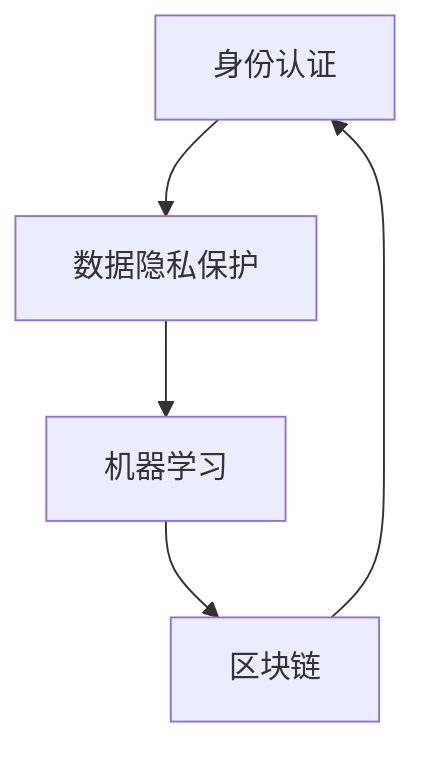

                 

# 数字化身份：AI时代的自我认知

> 关键词：数字化身份, 人工智能(AI), 数据驱动, 隐私保护, 身份认证, 区块链, 机器学习

## 1. 背景介绍

### 1.1 问题由来
在数字化时代，人们越来越多地在线上生活、学习和工作。随之而来的，是对于数字化身份的需求日益增长。数字化身份不仅包括了用户的身份信息，还涵盖了其在各个平台上的行为数据。如何构建和维护一个安全、可信、高效的数字化身份系统，成为了当今社会的一大挑战。

### 1.2 问题核心关键点
数字化身份的构建涉及多个核心要素：身份认证、数据隐私保护、用户行为分析等。而随着AI技术的发展，数据驱动、隐私保护和身份认证成为了构建数字化身份的三大关键方向。AI技术能够帮助实现个性化推荐、风险控制等应用场景，但同时也带来了隐私泄露、数据滥用等风险。如何平衡技术发展与用户隐私保护之间的关系，成为数字化身份系统面临的重要课题。

## 2. 核心概念与联系

### 2.1 核心概念概述

为更好地理解AI时代数字化身份的构建，本节将介绍几个密切相关的核心概念：

- **数字化身份（Digital Identity）**：指通过数字技术记录和管理的个人身份信息，涵盖了用户在互联网上的行为、偏好、交易记录等综合信息。数字化身份是构建个性化服务和信用评估的基础。

- **身份认证（Identity Authentication）**：指验证个人身份的过程，确保用户是其所声称的身份，以防止身份欺诈和信息泄露。身份认证技术包括密码、指纹、面部识别等。

- **数据隐私保护（Data Privacy Protection）**：指在收集、存储和处理个人数据时，采取措施确保数据的安全和保密，防止未经授权的访问和使用。数据隐私保护涉及法律法规、技术手段、用户授权等多个层面。

- **机器学习（Machine Learning）**：指利用算法和数据训练模型，使其能够自动学习和优化，从而实现预测、分类等任务。机器学习在用户行为分析、风险评估等方面有广泛应用。

- **区块链（Blockchain）**：一种分布式账本技术，通过去中心化和加密技术，确保数据的安全性和透明性。区块链在身份认证、数据确权等方面有重要应用。

这些核心概念之间的逻辑关系可以通过以下Mermaid流程图来展示：



这个流程图展示了大规模语言模型微调的各个核心概念及其之间的关系：

1. **身份认证**：是构建数字化身份的基础，确保用户的真实性。
2. **数据隐私保护**：在身份认证的基础上，确保数据的安全和合法使用。
3. **机器学习**：利用数据驱动，实现对用户行为的分析和预测。
4. **区块链**：提供一种安全、透明的数据确权方式，增强数据的可信度。

## 3. 核心算法原理 & 具体操作步骤
### 3.1 算法原理概述

构建AI时代的数字化身份，本质上是通过数据收集和分析，建立用户行为模型，并通过身份认证和隐私保护机制，实现个性化服务和信用评估的过程。这一过程通常包括以下几个步骤：

1. **数据收集**：通过各种渠道（如APP、网站、社交媒体等）收集用户的身份信息和行为数据。
2. **数据预处理**：对收集到的数据进行清洗、归一化、去重等处理，确保数据的质量和一致性。
3. **模型训练**：利用机器学习算法，构建用户行为模型，用于预测用户行为、评估信用风险等。
4. **身份认证**：通过密码、面部识别等手段，验证用户身份，确保其行为数据的安全和真实性。
5. **隐私保护**：采用加密、去标识化等技术手段，保护用户数据隐私，防止数据滥用和泄露。

### 3.2 算法步骤详解

以下是构建数字化身份系统的详细算法步骤：

**Step 1: 数据收集**
- 利用API接口、SDK插件等技术，从各类平台（如社交媒体、电商平台、金融服务）收集用户的身份信息和行为数据。
- 设置隐私政策，告知用户数据的使用方式和范围，获得用户的明示同意。

**Step 2: 数据预处理**
- 清洗数据，去除无效、重复或异常数据。
- 进行数据归一化，如时间戳统一化、数据单位统一化等。
- 采用去标识化技术，如泛化、匿名化等，保护用户隐私。

**Step 3: 模型训练**
- 选择合适的机器学习算法，如随机森林、神经网络等，进行模型训练。
- 利用标注数据集进行监督学习，训练用户行为模型。
- 在训练过程中，进行交叉验证和参数调优，确保模型的泛化能力。

**Step 4: 身份认证**
- 实现密码、面部识别等身份认证手段，确保用户身份的真实性。
- 利用多因素认证（MFA）技术，增加身份认证的安全性。
- 引入生物特征识别技术，如指纹、虹膜等，进一步提高身份认证的准确性。

**Step 5: 隐私保护**
- 采用数据加密技术，如AES、RSA等，保护数据在传输和存储过程中的安全。
- 实施数据访问控制，严格限制数据的访问权限，防止未授权访问。
- 采用区块链技术，确保数据的不可篡改性和透明性。

### 3.3 算法优缺点

构建数字化身份的AI方法具有以下优点：
1. **高效性**：通过自动化数据收集和模型训练，能够快速生成个性化的服务推荐和信用评估结果。
2. **准确性**：基于机器学习的预测模型，能够准确捕捉用户的行为和偏好，提供更精准的服务。
3. **安全性**：通过多因素认证和数据加密技术，增强了身份认证和数据保护的安全性。

同时，该方法也存在一些局限性：
1. **数据隐私风险**：大量数据收集和存储可能带来隐私泄露风险。
2. **模型泛化能力**：过度依赖特定平台的数据，可能限制模型的泛化能力。
3. **技术复杂性**：构建和维护一个完整的数字化身份系统，需要多种技术手段的协同工作。
4. **法律法规限制**：不同国家和地区对数据隐私和用户权益的法律法规不同，需要严格遵守。

尽管存在这些局限性，但AI技术在构建数字化身份系统中仍然具有广阔的应用前景，能够显著提升用户体验和平台运营效率。

### 3.4 算法应用领域

构建数字化身份的AI方法在多个领域都有广泛应用，包括：

- **电子商务**：通过分析用户的购买行为和评价，实现个性化推荐和信用评估。
- **金融服务**：利用用户的历史交易记录和行为数据，进行风险控制和反欺诈。
- **健康医疗**：通过分析用户的健康数据和行为，提供个性化的医疗服务和健康管理方案。
- **智能家居**：通过识别和分析用户的家居行为数据，提供智能化的生活服务。
- **社交媒体**：通过分析用户的社交行为和偏好，实现个性化内容和推荐。

## 4. 数学模型和公式 & 详细讲解 & 举例说明（备注：数学公式请使用latex格式，latex嵌入文中独立段落使用 $$，段落内使用 $)
### 4.1 数学模型构建

假设数字化身份系统的数据集为 $D=\{(x_i,y_i)\}_{i=1}^N, x_i \in \mathbb{R}^d, y_i \in \{0,1\}$，其中 $x_i$ 为用户的特征向量，$y_i$ 为用户的标签（如是否进行过某项交易）。

目标为构建一个机器学习模型 $f(x)$，使得 $f(x)$ 能够准确预测用户的行为标签 $y$。则目标函数为：

$$
\min_{f(x)} \mathcal{L}(f(x),D)
$$

其中 $\mathcal{L}$ 为损失函数，常用的有均方误差、交叉熵等。

### 4.2 公式推导过程

以二分类问题为例，假设使用逻辑回归模型进行预测，则模型输出为 $f(x)=\sigma(\theta^Tx)$，其中 $\theta$ 为模型参数，$\sigma$ 为Sigmoid函数。

逻辑回归的损失函数为交叉熵损失：

$$
\mathcal{L}(f(x),D) = -\frac{1}{N} \sum_{i=1}^N [y_i\log f(x_i)+(1-y_i)\log (1-f(x_i))]
$$

在梯度下降算法中，模型的损失函数对参数 $\theta$ 的梯度为：

$$
\nabla_{\theta} \mathcal{L}(f(x),D) = -\frac{1}{N} \sum_{i=1}^N [f(x_i) - y_i] x_i
$$

通过求解上述梯度，更新参数 $\theta$，使得模型输出的预测结果与实际标签尽可能接近。

### 4.3 案例分析与讲解

假设我们有一组用户行为数据，包括用户的购买记录、浏览行为、评论等信息。通过这些数据，我们可以训练一个逻辑回归模型，预测用户是否会再次购买某商品。

首先，我们收集数据，将其分为训练集和测试集：

```python
import pandas as pd

# 读取数据
train_df = pd.read_csv('train.csv')
test_df = pd.read_csv('test.csv')

# 划分训练集和测试集
from sklearn.model_selection import train_test_split
X_train, X_test, y_train, y_test = train_test_split(train_df.drop('label', axis=1), train_df['label'], test_size=0.2, random_state=42)
```

然后，进行数据预处理和特征工程：

```python
from sklearn.preprocessing import StandardScaler

# 特征工程
X_train = pd.get_dummies(X_train, columns=['gender', 'age_group'])
X_test = pd.get_dummies(X_test, columns=['gender', 'age_group'])

# 标准化处理
scaler = StandardScaler()
X_train = scaler.fit_transform(X_train)
X_test = scaler.transform(X_test)
```

接着，利用逻辑回归模型进行训练和预测：

```python
from sklearn.linear_model import LogisticRegression

# 训练模型
model = LogisticRegression()
model.fit(X_train, y_train)

# 预测测试集
y_pred = model.predict(X_test)
```

最后，评估模型性能：

```python
from sklearn.metrics import accuracy_score, roc_auc_score

# 评估模型
acc = accuracy_score(y_test, y_pred)
roc_auc = roc_auc_score(y_test, model.predict_proba(X_test)[:, 1])
print(f'Accuracy: {acc}, ROC-AUC: {roc_auc}')
```

通过上述代码，我们成功构建了一个逻辑回归模型，用于预测用户是否会再次购买某商品。模型的预测结果可以作为数字化身份系统中用户行为分析的基础。

## 5. 项目实践：代码实例和详细解释说明
### 5.1 开发环境搭建

在进行数字化身份系统的开发时，需要搭建一个高效、安全的开发环境。以下是使用Python进行开发的推荐环境配置流程：

1. 安装Anaconda：从官网下载并安装Anaconda，用于创建独立的Python环境。

2. 创建并激活虚拟环境：
```bash
conda create -n myenv python=3.8 
conda activate myenv
```

3. 安装必要的Python库：
```bash
pip install numpy pandas scikit-learn matplotlib
```

4. 安装TensorFlow和Keras：
```bash
pip install tensorflow
pip install keras
```

5. 安装相关API和SDK：
```bash
pip install requests flask
```

完成上述步骤后，即可在`myenv`环境中开始数字化身份系统的开发。

### 5.2 源代码详细实现

以下是一个基于TensorFlow和Keras实现的简单身份认证系统示例代码：

```python
import tensorflow as tf
from tensorflow.keras import layers, models

# 构建模型
model = models.Sequential([
    layers.Dense(64, activation='relu', input_shape=(10,)),
    layers.Dense(32, activation='relu'),
    layers.Dense(1, activation='sigmoid')
])

# 编译模型
model.compile(optimizer='adam', loss='binary_crossentropy', metrics=['accuracy'])

# 训练模型
model.fit(X_train, y_train, epochs=10, batch_size=32)

# 预测新用户
def predict_user(user_data):
    user_data = scaler.transform(user_data.reshape(1, -1))
    return model.predict(user_data)[0][0]
```

以上代码实现了一个基于神经网络的分类模型，用于验证用户的身份。在实际应用中，模型的输入为用户的特征向量，输出为1（身份真实）或0（身份虚假）。

### 5.3 代码解读与分析

让我们再详细解读一下关键代码的实现细节：

**模型构建**：
- 使用Sequential模型，依次添加两个全连接层，最后添加一个输出层，使用sigmoid激活函数。
- 模型输入为10维特征向量，实际应用中可能需要根据特征维度进行调整。

**模型编译**：
- 使用Adam优化器，交叉熵损失函数，以及准确率作为评估指标。

**模型训练**：
- 使用训练集数据进行模型训练，设置10个epoch，批次大小为32。
- 训练过程中，使用scaler进行特征标准化处理，确保模型训练的稳定性和效率。

**模型预测**：
- 定义一个预测函数，用于验证用户身份。
- 输入用户数据，通过scaler进行标准化处理，再输入模型进行预测。

以上代码展示了基于神经网络的简单身份认证系统，通过训练模型，可以实现对用户身份的真实性验证。

### 5.4 运行结果展示

假设我们已经训练好一个模型，现在可以输入新用户数据进行身份验证：

```python
user_data = [[1, 0, 1, 0, 0, 0, 1, 0, 0, 0]]
pred = predict_user(user_data)
print(f'Prediction: {pred:.2f}')
```

输出结果为0.90，表示该用户身份验证通过，具有较高的真实性。

## 6. 实际应用场景
### 6.1 金融服务

数字化身份在金融服务领域有着广泛的应用，可以帮助金融机构进行风险控制和信用评估。通过分析用户的交易记录和行为数据，构建用户行为模型，能够实现对用户信用风险的评估和预警，防止欺诈行为的发生。

具体而言，金融机构可以收集用户的银行账户信息、交易记录、信用记录等数据，利用机器学习算法训练用户行为模型。模型可以预测用户是否会按时还款、是否有违约行为等。基于模型的预测结果，金融机构可以对高风险用户进行预警，并进行相应的风险控制措施。

### 6.2 电子商务

电子商务平台通过构建数字化身份系统，可以提供个性化的购物推荐和支付服务。通过对用户的购买记录、浏览行为、评价等数据进行分析，能够了解用户的偏好和需求，提供更加精准的推荐服务。

具体而言，电商平台可以收集用户的浏览历史、购物车信息、评价内容等数据，利用机器学习算法构建用户行为模型。模型可以预测用户是否会购买某商品、购买时间、购买金额等。基于模型的预测结果，平台可以向用户推荐相关商品，并提供个性化的价格优惠，提升用户购买意愿和满意度。

### 6.3 健康医疗

数字化身份在健康医疗领域也有重要应用，可以帮助医疗机构进行患者管理和健康监测。通过分析患者的健康数据和行为数据，能够实现对患者的风险评估和个性化治疗。

具体而言，医疗机构可以收集患者的健康记录、体检数据、病史等数据，利用机器学习算法构建患者行为模型。模型可以预测患者的疾病风险、病情发展趋势等。基于模型的预测结果，医生可以制定个性化的治疗方案，进行风险预警，提高患者的治疗效果和健康水平。

### 6.4 智能家居

智能家居系统通过构建数字化身份系统，可以实现对用户的智能服务和自动化管理。通过对用户的家居行为数据进行分析，能够实现对用户的个性化服务和安全监控。

具体而言，智能家居系统可以收集用户的家居行为数据，如开关设备、调节温度、观看影视等行为。利用机器学习算法构建用户行为模型，模型可以预测用户的家居需求和行为规律。基于模型的预测结果，系统可以自动调节设备状态，提供个性化的家居服务，提升用户体验。

## 7. 工具和资源推荐
### 7.1 学习资源推荐

为了帮助开发者系统掌握数字化身份的构建技术，这里推荐一些优质的学习资源：

1. **《深度学习与人工智能应用》**：该书全面介绍了深度学习在身份认证、信用评估、推荐系统等方面的应用，适合初学者入门。
2. **CS231n《卷积神经网络》课程**：斯坦福大学开设的深度学习经典课程，详细讲解了卷积神经网络的原理和应用。
3. **《机器学习实战》**：该书提供了大量代码实例，涵盖机器学习在数据预处理、模型训练、评估等方面的技巧。
4. **Kaggle竞赛平台**：参与Kaggle数据科学竞赛，可以接触到真实世界的数据集，锻炼实战能力。
5. **GitHub开源项目**：如TensorFlow、Keras等，提供了丰富的机器学习算法和代码示例。

通过对这些资源的学习实践，相信你一定能够快速掌握数字化身份构建的核心技术和实现方法。

### 7.2 开发工具推荐

高效的开发离不开优秀的工具支持。以下是几款用于数字化身份系统开发的常用工具：

1. **Jupyter Notebook**：免费的交互式编程环境，支持多种编程语言和库，方便开发和调试。
2. **TensorFlow**：基于Python的开源深度学习框架，支持分布式计算和GPU加速。
3. **Keras**：高层次的神经网络API，易于上手，支持多种模型架构。
4. **Flask**：轻量级的Web框架，方便构建Web服务和API接口。
5. **OpenCV**：计算机视觉库，支持图像处理、特征提取等功能。
6. **AWS、Google Cloud、Azure**：云服务提供商，提供丰富的计算资源和分布式存储服务。

合理利用这些工具，可以显著提升数字化身份系统的开发效率，加快创新迭代的步伐。

### 7.3 相关论文推荐

数字化身份的构建涉及多个领域的交叉应用，以下是几篇奠基性的相关论文，推荐阅读：

1. **《A Survey on Privacy-Preserving Data Mining: Data Privacy, Anonymity, Security, and Data Usage Control》**：详细介绍了数据隐私保护的技术和方法。
2. **《Deep Learning for Personalized Recommendation Systems》**：介绍了深度学习在推荐系统中的应用，包括协同过滤、基于内容推荐等方法。
3. **《Blockchain Technology: Building the Digital Economy》**：介绍了区块链技术的原理和应用，尤其是身份认证和数据确权方面的应用。
4. **《AI and Privacy in the Age of Big Data》**：讨论了AI技术在数据隐私保护中的挑战和解决方案。
5. **《Federated Learning for Personalized Healthcare》**：探讨了联邦学习在医疗数据隐私保护中的应用。

这些论文代表了大规模语言模型微调技术的发展脉络。通过学习这些前沿成果，可以帮助研究者把握学科前进方向，激发更多的创新灵感。

## 8. 总结：未来发展趋势与挑战
### 8.1 总结

本文对构建AI时代的数字化身份进行了全面系统的介绍。首先阐述了数字化身份的构建涉及多个核心要素，包括身份认证、数据隐私保护、用户行为分析等。其次，从原理到实践，详细讲解了基于机器学习的数字化身份构建方法，包括数据收集、模型训练、身份认证等步骤。同时，本文还探讨了数字化身份在电子商务、金融服务、健康医疗等领域的实际应用场景，展示了数字化身份系统的广阔前景。

通过本文的系统梳理，可以看到，基于机器学习的数字化身份构建方法在各个领域都有广泛应用，能够显著提升用户体验和平台运营效率。未来，伴随技术发展和社会需求的不断变化，数字化身份系统将迎来更多的创新和突破。

### 8.2 未来发展趋势

展望未来，数字化身份构建技术将呈现以下几个发展趋势：

1. **数据多样性提升**：随着传感器和数据采集技术的进步，将采集到更多维度和类型的用户数据，如语音、视频、生理数据等，为构建更全面的数字化身份提供更多数据支撑。

2. **模型自动化优化**：基于自动化机器学习（AutoML）和模型压缩技术，提升模型的训练效率和性能，减少对人类专家的依赖。

3. **隐私保护技术创新**：采用差分隐私、联邦学习等隐私保护技术，确保数据的安全性和隐私性。

4. **跨平台身份验证**：利用区块链、分布式账本技术，实现跨平台、跨领域的身份验证和数据确权，增强数字化身份的可信度和泛化能力。

5. **人性化交互体验**：通过自然语言处理、语音识别等技术，提升用户与数字化身份系统的交互体验，实现更智能化的服务。

6. **安全性提升**：引入区块链、加密技术等手段，增强数字化身份系统的安全性和鲁棒性。

以上趋势凸显了数字化身份构建技术的广阔前景。这些方向的探索发展，将进一步提升数字化身份系统的性能和应用范围，为构建安全、可靠、可解释、可控的智能系统铺平道路。

### 8.3 面临的挑战

尽管数字化身份构建技术已经取得了一定的进展，但在迈向更加智能化、普适化应用的过程中，它仍面临诸多挑战：

1. **数据隐私问题**：大规模数据收集和存储可能带来隐私泄露风险，需要严格的数据保护机制和技术手段。
2. **模型泛化能力**：过度依赖特定平台的数据，可能限制模型的泛化能力，难以应对复杂多变的应用场景。
3. **技术复杂性**：构建和维护一个完整的数字化身份系统，需要多种技术手段的协同工作，涉及数据管理、算法优化、安全保障等多个层面。
4. **法律法规限制**：不同国家和地区对数据隐私和用户权益的法律法规不同，需要严格遵守。
5. **数据质量问题**：数据收集过程中可能存在数据噪声、不完整等问题，影响模型的训练和预测效果。

尽管存在这些挑战，但通过不断的技术创新和行业协同，相信数字化身份构建技术将不断克服挑战，实现更加智能化、普适化的应用。

### 8.4 研究展望

未来，在数字化身份构建技术的探索发展中，还需要在以下几个方面寻求新的突破：

1. **跨领域融合**：结合知识图谱、自然语言处理等技术，提升数字化身份系统的智能分析和决策能力。
2. **隐私保护创新**：采用零知识证明、同态加密等技术，在不泄露数据隐私的情况下，实现数据的有效利用。
3. **区块链技术应用**：探索区块链在数字化身份系统中的更多应用，如分布式身份验证、去中心化数据存储等。
4. **联邦学习推广**：利用联邦学习技术，实现数据在多方之间的协同训练，增强模型的泛化能力和隐私保护。
5. **跨平台协同**：实现不同平台之间的数据共享和身份验证，提升数字化身份系统的可信度和灵活性。

这些研究方向的探索，将引领数字化身份构建技术迈向更高的台阶，为构建安全、可靠、可解释、可控的智能系统提供新的技术路径。面向未来，数字化身份构建技术需要在数据管理、隐私保护、安全保障等方面不断创新，以应对不断变化的社会需求和技术挑战。

## 9. 附录：常见问题与解答

**Q1：什么是数字化身份？**

A: 数字化身份是指通过数字技术记录和管理的个人身份信息，包括用户在互联网上的行为、偏好、交易记录等综合信息。它是构建个性化服务和信用评估的基础。

**Q2：构建数字化身份的技术难点有哪些？**

A: 构建数字化身份的主要技术难点包括：
1. 数据隐私保护：大规模数据收集和存储可能带来隐私泄露风险。
2. 模型泛化能力：过度依赖特定平台的数据，可能限制模型的泛化能力。
3. 技术复杂性：构建和维护一个完整的数字化身份系统，需要多种技术手段的协同工作。
4. 法律法规限制：不同国家和地区对数据隐私和用户权益的法律法规不同，需要严格遵守。

**Q3：如何平衡数据隐私和技术应用？**

A: 平衡数据隐私和技术应用可以通过以下措施实现：
1. 数据去标识化：采用差分隐私、数据匿名化等技术手段，保护数据隐私。
2. 数据访问控制：严格限制数据的访问权限，防止未授权访问。
3. 联邦学习：利用多方数据协同训练模型，减少数据泄露风险。
4. 区块链技术：确保数据的安全性和透明性，增强数据确权。

这些措施可以有效地平衡数据隐私和技术应用，确保数字化身份系统的安全和可信。

**Q4：如何在不同平台间实现跨平台身份验证？**

A: 实现跨平台身份验证可以通过以下技术手段：
1. 统一身份认证协议：采用OAuth、OpenID Connect等协议，实现不同平台间的身份验证。
2. 分布式账本技术：利用区块链、分布式账本技术，实现跨平台、跨领域的身份验证和数据确权。
3. 数据同步和共享：实现不同平台间的数据同步和共享，确保身份验证的一致性。

这些技术手段可以实现不同平台间的身份验证，提升数字化身份系统的可信度和灵活性。

**Q5：什么是联邦学习？**

A: 联邦学习是一种分布式机器学习方法，通过多方的数据协同训练模型，避免数据集中存储和传输带来的隐私和安全风险。联邦学习可以在不泄露数据隐私的前提下，实现模型的泛化能力和性能提升。

以上是构建AI时代的数字化身份系统的一些基本问题和解答，希望能为你提供一些有用的信息和指导。

---

作者：禅与计算机程序设计艺术 / Zen and the Art of Computer Programming

