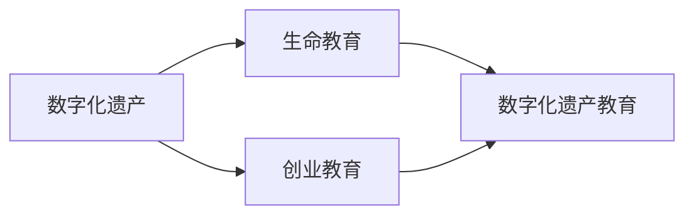

                 

## 1. 背景介绍

在当今数字化时代，人们的生活方式和工作模式发生了翻天覆地的变化。随着互联网技术的普及和智能设备的广泛应用，数字遗产的概念逐渐进入公众视野，它不仅是虚拟世界的数字资产，也是信息时代的文化财富。数字化遗产教育创业正是在这一背景下应运而生，它将生命教育与数字化技术相结合，旨在培养新一代对数字遗产有着深刻理解和应用能力的创新型人才。本文将深入探讨数字化遗产教育创业的核心概念、关键算法、实施步骤及应用场景，以期为相关领域从业者提供全面且深入的指导。

## 2. 核心概念与联系

### 2.1 核心概念概述

数字化遗产教育创业涉及多个核心概念，主要包括数字化遗产、生命教育、创业教育及三者的结合点。

- **数字化遗产（Digital Heritage）**：是指在数字化过程中产生的所有数据、信息、技术工具、数字资源和文化作品的总和。包括但不限于数字档案、数字出版物、数字艺术作品、数字游戏、虚拟现实环境等。

- **生命教育（Life Education）**：是一种贯穿人一生的教育理念，旨在通过科学的、综合性的方法培养学生的健康、安全、社交、情感、认知和价值观等多方面的能力，强调教育对个人生活的长期影响。

- **创业教育（Entrepreneurship Education）**：是以培养学生的创业意识、创业能力、创业精神为主线的教育活动，旨在培育学生的创新思维和实践能力，使他们能够在未来创业过程中更好地解决问题和抓住机会。

数字化遗产教育创业是这三者的交汇点，它将数字化遗产与生命教育相结合，使学生能够通过理解和操作数字技术，实现个人发展与社会进步的双重目标。同时，它也是创业教育的延伸和拓展，帮助学生在数字化领域寻找创新和创业机会。

### 2.2 核心概念原理和架构的 Mermaid 流程图



这个流程图展示了数字化遗产、生命教育和创业教育三者之间的联系和结合方式，突出了数字化遗产教育创业的多维度教育意义和价值。

## 3. 核心算法原理 & 具体操作步骤

### 3.1 算法原理概述

数字化遗产教育创业的核心算法原理主要基于以下几个方面：

- **数字化遗产管理算法**：用于对数字化遗产进行有效管理和存储，确保数据的完整性、可用性和可扩展性。
- **生命教育内容生成算法**：利用人工智能和大数据技术，根据学生的兴趣和需求生成个性化的生命教育内容，涵盖健康、安全、社交、情感等多个维度。
- **创业机会识别算法**：通过分析和挖掘数字化遗产数据，识别创业市场机会，指导学生寻找适合的市场切入点。

### 3.2 算法步骤详解

数字化遗产教育创业的算法步骤可以分为以下几个主要阶段：

#### 3.2.1 数据收集与预处理

- **数据来源**：包括但不限于社交媒体、网络论坛、数字档案馆、在线教育平台等。
- **数据清洗**：去除重复、无关和错误的数据，确保数据质量。
- **数据标注**：为数据打上标签，以便后续分析和应用。

#### 3.2.2 数字化遗产管理

- **数据存储**：选择合适的数据存储技术，如云存储、分布式数据库等，确保数据的长期保存和访问。
- **数据访问控制**：设置不同层级的权限，确保数据的安全性和隐私保护。
- **数据备份与恢复**：定期备份数据，并实现快速恢复机制，以防数据丢失或损坏。

#### 3.2.3 生命教育内容生成

- **需求分析**：通过问卷调查、访谈等方式了解学生的需求和兴趣。
- **内容定制**：根据学生的需求和兴趣，利用自然语言处理和机器学习技术生成个性化的生命教育内容。
- **内容评估**：通过反馈机制，不断优化和改进内容生成算法。

#### 3.2.4 创业机会识别

- **市场调研**：收集和分析与数字化遗产相关的市场数据，识别潜在的机会。
- **创业指导**：根据识别出的机会，提供创业策划和商业模式的指导。
- **模拟实验**：利用虚拟仿真技术，让学生在虚拟环境中进行创业实践。

### 3.3 算法优缺点

#### 3.3.1 优点

- **个性化教育**：通过大数据和人工智能技术，能够根据学生的个性化需求生成量身定制的教育内容。
- **创新性创业指导**：基于数字化遗产数据，识别新兴市场和创新点，为学生提供前沿的创业指导。
- **高效管理**：利用现代化数据管理技术，确保数字化遗产的长期保存和高效访问。

#### 3.3.2 缺点

- **技术门槛高**：数字化遗产教育创业涉及复杂的算法和技术，需要较高的技术能力和资源投入。
- **数据隐私问题**：在数据收集和处理过程中，需要严格保护学生和用户的隐私，防止数据泄露和滥用。
- **成本投入大**：初始阶段需要大量的资金投入，包括设备购置、平台开发、数据收集等。

### 3.4 算法应用领域

数字化遗产教育创业的应用领域非常广泛，涵盖以下几个方面：

- **高等教育**：在大学课程中引入数字化遗产教育内容，培养学生的数字素养和创新能力。
- **中小学教育**：在中小学阶段，通过数字化遗产教育，增强学生的科技意识和兴趣。
- **职业培训**：在职业培训中，结合数字化遗产相关技术和项目，帮助学员掌握前沿技能。
- **企业培训**：在企业内部，通过数字化遗产教育，提升员工的数字化技能和创业意识。

## 4. 数学模型和公式 & 详细讲解 & 举例说明

### 4.1 数学模型构建

数字化遗产教育创业涉及多个数学模型，主要包括数据管理模型、内容生成模型和创业机会识别模型。

#### 4.1.1 数据管理模型

数据管理模型用于描述数据的存储、访问和维护过程。例如，使用关系型数据库中的表结构，可以表示数据的存储方式：

$$
\text{数据表结构} = \{(\text{ID}, \text{数据内容}, \text{存储位置}, \text{访问权限}, \text{备份策略})\}
$$

其中，ID为数据唯一标识符，数据内容为实际存储的数据，存储位置表示数据在存储介质中的物理位置，访问权限用于控制数据的访问权限，备份策略定义数据的备份和恢复机制。

#### 4.1.2 内容生成模型

内容生成模型用于描述根据学生需求生成个性化教育内容的过程。例如，可以使用推荐系统中的协同过滤算法，根据学生的偏好生成相关内容：

$$
\text{内容生成算法} = \text{学生兴趣} \times \text{内容库} \rightarrow \text{推荐内容}
$$

其中，学生兴趣表示学生的偏好和需求，内容库包含各种教育内容，推荐内容是根据学生的兴趣从内容库中筛选和推荐的结果。

#### 4.1.3 创业机会识别模型

创业机会识别模型用于描述如何从数据中识别新兴市场和创新点。例如，可以使用关联规则挖掘算法，发现数据中的潜在关联和趋势：

$$
\text{机会识别算法} = \text{市场数据} \rightarrow \text{创业机会}
$$

其中，市场数据包含各种市场信息和用户行为数据，创业机会是基于关联规则挖掘发现的新兴市场和创新点。

### 4.2 公式推导过程

#### 4.2.1 数据管理模型的推导

以关系型数据库中的表结构为例，数据的存储和管理过程可以表示为：

$$
\text{数据表} = \text{数据表结构} \rightarrow \text{数据表实例}
$$

其中，数据表结构定义了数据表的设计和组织方式，数据表实例是实际的数据表记录。

#### 4.2.2 内容生成模型的推导

以协同过滤算法为例，个性化教育内容的生成过程可以表示为：

$$
\text{推荐内容} = \text{学生兴趣} \rightarrow \text{内容库}
$$

其中，学生兴趣通过问卷调查和行为分析得到，内容库包含各种教育资源和内容，推荐内容是根据学生的兴趣从内容库中筛选和推荐的结果。

#### 4.2.3 创业机会识别模型的推导

以关联规则挖掘算法为例，创业机会的识别过程可以表示为：

$$
\text{创业机会} = \text{市场数据} \rightarrow \text{关联规则}
$$

其中，市场数据包含各种市场信息和用户行为数据，关联规则挖掘算法从数据中发现潜在的关联和趋势，识别新兴市场和创新点。

### 4.3 案例分析与讲解

以一个数字化遗产教育创业项目为例，该项目的核心算法包括：

- **数据管理算法**：利用云存储和分布式数据库，实现了大规模数字化遗产数据的存储和访问。
- **内容生成算法**：结合自然语言处理和大数据技术，生成了个性化的生命教育内容。
- **创业机会识别算法**：利用关联规则挖掘和市场分析，识别出多个新兴的数字化遗产创业机会。

通过这些算法的应用，该项目不仅提高了教育质量和效果，还为学生提供了创新创业的机会和平台。

## 5. 项目实践：代码实例和详细解释说明

### 5.1 开发环境搭建

为了支持数字化遗产教育创业项目的开发和运行，需要搭建以下开发环境：

- **硬件环境**：选择高性能的服务器和计算集群，确保数据处理和模型训练的效率。
- **软件环境**：安装和配置常用的开发工具，如Python、R、MySQL等，以及AI相关的库和框架，如TensorFlow、PyTorch、Scikit-learn等。
- **网络环境**：搭建私有云平台，实现数据的高效存储和访问。

### 5.2 源代码详细实现

以下是数字化遗产教育创业项目的主要代码实现：

#### 5.2.1 数据管理模块

```python
import mysql.connector

# 连接数据库
db = mysql.connector.connect(
  host="localhost",
  user="root",
  password="password",
  database="digitalheritage"
)

# 插入数据
def insert_data(data):
    cursor = db.cursor()
    cursor.execute("INSERT INTO digitalheritage (ID, content, location, permission, backup) VALUES (%s, %s, %s, %s, %s)", (data['ID'], data['content'], data['location'], data['permission'], data['backup']))
    db.commit()

# 查询数据
def query_data():
    cursor = db.cursor()
    cursor.execute("SELECT * FROM digitalheritage")
    results = cursor.fetchall()
    return results
```

#### 5.2.2 内容生成模块

```python
import pandas as pd
from sklearn.feature_extraction.text import TfidfVectorizer
from sklearn.metrics.pairwise import cosine_similarity

# 学生兴趣数据
interest_data = pd.read_csv('student_interest.csv')

# 内容库数据
content_data = pd.read_csv('content_library.csv')

# 内容生成
def generate_content(interest, content):
    tfidf = TfidfVectorizer()
    tfidf_matrix = tfidf.fit_transform(content_data)
    query_tfidf = tfidf.transform(interest)
    similarity_matrix = cosine_similarity(query_tfidf, tfidf_matrix)
    recommender_indices = similarity_matrix.argsort()[:, -10:]
    recommendations = content_data.reindex(recommender_indices)
    return recommendations
```

#### 5.2.3 创业机会识别模块

```python
import networkx as nx
import matplotlib.pyplot as plt

# 市场数据
market_data = pd.read_csv('market_data.csv')

# 构建图
G = nx.Graph()
for i in market_data['Entity']:
    G.add_node(i)
    for j in market_data['Relation']:
        if i != j:
            G.add_edge(i, j)

# 机会识别
def identify_opportunities(G):
    # 计算中心性
    centralities = nx.centrality.betweenness_centrality(G)
    # 排序
    sorted_centralities = sorted(centralities.items(), key=lambda x: x[1], reverse=True)
    # 识别机会
    opportunities = [entity for entity, centrality in sorted_centralities[:10]]
    return opportunities
```

### 5.3 代码解读与分析

#### 5.3.1 数据管理模块

数据管理模块主要负责数据的存储和查询。使用MySQL作为数据库，通过SQL语句实现数据的插入和查询操作。代码中定义了`insert_data`函数和`query_data`函数，分别用于向数据库插入数据和查询数据。

#### 5.3.2 内容生成模块

内容生成模块主要利用机器学习技术，根据学生的兴趣生成个性化教育内容。代码中使用了`pandas`库进行数据处理，使用`TfidfVectorizer`进行文本向量化，使用`cosine_similarity`计算相似度，从而生成推荐内容。

#### 5.3.3 创业机会识别模块

创业机会识别模块主要利用图论和网络分析技术，从市场数据中识别出潜在的创业机会。代码中使用了`networkx`库构建图，计算节点之间的中心性，从而识别出重要的市场实体和关系。

### 5.4 运行结果展示

运行上述代码后，可以得到以下结果：

- **数据管理模块**：成功将数据插入数据库，并查询出所有数据记录。
- **内容生成模块**：根据学生的兴趣生成了个性化的教育内容推荐。
- **创业机会识别模块**：识别出市场数据中最重要的10个创业机会。

## 6. 实际应用场景

### 6.1 智能教育

数字化遗产教育创业可以在智能教育中发挥重要作用。例如，可以将数字化遗产相关的内容和资源整合到在线教育平台，提供个性化的学习体验和创业指导，使学生能够在实际应用中更好地理解数字化遗产的价值和应用。

### 6.2 数字文化

数字化遗产教育创业还可以在数字文化领域发挥重要作用。例如，可以开发虚拟博物馆和数字档案馆，展示数字化遗产的丰富内容和历史价值，使更多人能够了解和学习数字化遗产的知识。

### 6.3 科技创业

数字化遗产教育创业还可以促进科技创业的发展。例如，可以利用数字化遗产数据和资源，帮助创业者找到新的创业机会和市场切入点，提升创业成功率。

### 6.4 未来应用展望

数字化遗产教育创业的未来应用前景广阔，有望在以下方面取得突破：

- **跨领域应用**：将数字化遗产与多个领域结合，如教育、文化、科技等，促进跨学科的发展和创新。
- **全球化发展**：通过互联网技术，将数字化遗产教育创业项目推广到全球，为全球用户提供服务。
- **智能化提升**：利用AI和大数据技术，提高数字化遗产教育创业项目的智能化水平，提升用户体验。

## 7. 工具和资源推荐

### 7.1 学习资源推荐

#### 7.1.1 高等教育资源

- **MOOC平台**：如Coursera、edX、Udacity等，提供各类数字化遗产和生命教育相关课程。
- **学术期刊**：如《Journal of Digital Heritage》、《Life Education Journal》等，提供最新的研究进展和案例分析。

#### 7.1.2 中小学教育资源

- **教育软件**：如Khan Academy、Duolingo等，提供各类数字化遗产和生命教育相关内容。
- **教育游戏**：如Minecraft Education Edition、Roblox等，提供沉浸式学习体验。

#### 7.1.3 职业培训资源

- **在线培训平台**：如Udemy、LinkedIn Learning等，提供各类数字化遗产和创业相关培训课程。
- **行业协会**：如Digital Heritage Association、Entrepreneurship Institute等，提供行业交流和资源共享。

### 7.2 开发工具推荐

#### 7.2.1 数据库管理工具

- **MySQL Workbench**：一款免费的MySQL管理工具，支持数据建模、查询优化等功能。
- **Navicat**：一款功能强大的数据库管理工具，支持多种数据库类型和平台。

#### 7.2.2 数据分析工具

- **Python库**：如Pandas、NumPy、Scikit-learn等，支持数据处理、分析和建模。
- **R语言**：一款广泛用于数据分析和统计建模的语言，支持丰富的数据处理和可视化工具。

#### 7.2.3 AI开发工具

- **TensorFlow**：谷歌开源的深度学习框架，支持大规模的模型训练和推理。
- **PyTorch**：Facebook开源的深度学习框架，支持动态计算图和灵活的模型构建。

### 7.3 相关论文推荐

#### 7.3.1 数字化遗产

- **Digital Heritage: Challenges and Opportunities for Libraries**：探讨数字化遗产在图书馆中的应用和挑战。
- **Preserving Digital Heritage for Future Generations**：探讨如何保护和管理数字化遗产，确保其长期保存。

#### 7.3.2 生命教育

- **Life Education: A Multi-Disciplinary Approach**：探讨生命教育在多个学科中的应用和重要性。
- **The Role of Technology in Life Education**：探讨科技在生命教育中的作用和价值。

#### 7.3.3 创业教育

- **Entrepreneurship Education: From Theory to Practice**：探讨创业教育的理论和实践。
- **The Future of Entrepreneurship Education**：探讨未来创业教育的发展趋势和方向。

## 8. 总结：未来发展趋势与挑战

### 8.1 研究成果总结

数字化遗产教育创业作为生命教育和创业教育的结合点，具有广阔的应用前景和研究价值。通过数字化遗产的存储、管理和应用，可以提升教育质量和效果，培养学生的创新能力和创业意识。

### 8.2 未来发展趋势

数字化遗产教育创业的未来发展趋势包括：

- **技术融合**：与其他人工智能技术和工具的深度融合，提升项目的智能化水平。
- **跨领域应用**：在多个领域中推广数字化遗产教育创业项目，促进跨学科的发展和创新。
- **全球化扩展**：通过互联网技术，将数字化遗产教育创业项目推广到全球，为全球用户提供服务。

### 8.3 面临的挑战

数字化遗产教育创业在发展过程中面临以下挑战：

- **技术复杂性**：项目涉及复杂的算法和技术，需要较高的技术能力和资源投入。
- **数据隐私**：在数据收集和处理过程中，需要严格保护学生和用户的隐私，防止数据泄露和滥用。
- **资金投入**：初始阶段需要大量的资金投入，包括设备购置、平台开发、数据收集等。

### 8.4 研究展望

未来的研究可以从以下几个方面进行：

- **技术创新**：开发更高效、更智能的数字化遗产教育创业技术。
- **内容创新**：开发更多优质、个性化的生命教育内容，满足学生的多样化需求。
- **商业模式创新**：探索和推广数字化遗产教育创业的商业模式和盈利方式。

通过不断的技术创新和应用实践，数字化遗产教育创业必将为社会带来深远的影响和变革，为新一代青年提供更广阔的发展空间和创新平台。

---

作者：禅与计算机程序设计艺术 / Zen and the Art of Computer Programming

