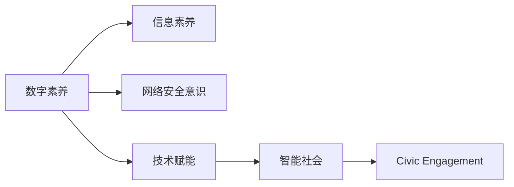

                 

## 1. 背景介绍

在数字化浪潮席卷全球的今天，数字素养成为了公民参与现代社会生活的重要基石。数字素养不仅关乎个人在数字化环境中的生存和发展，更关乎国家的长远发展和社会的整体进步。本文旨在探讨数字素养的重要性，以及如何通过技术手段提升公民的数字素养，使其能够更好地适应和融入数字化的未来。

## 2. 核心概念与联系

### 2.1 核心概念概述

- **数字素养(Digital Literacy)**：指个体在数字化环境中获取、处理、评价和使用数字信息的能力，包括基本的操作技能、信息素养、网络安全意识等。
- **公民参与(Civic Engagement)**：指个体积极参与社会公共事务和政治过程的行为，包括投票、参与公共讨论、志愿服务等。
- **技术赋能(Technological Empowerment)**：指通过技术手段提升个人能力，使其能够更有效地参与社会活动。
- **数据素养(Data Literacy)**：指个体在处理和分析数据方面的能力，包括数据的获取、处理、分析和可视化等。
- **智能社会(Smart Society)**：指通过数字化技术构建的智能、高效、包容的社会，实现资源优化配置和社会治理现代化。

### 2.2 核心概念原理和架构的 Mermaid 流程图



## 3. 核心算法原理 & 具体操作步骤

### 3.1 算法原理概述

提升数字素养的关键在于使个体能够掌握必要的技术手段，并在日常行为中主动应用。这涉及到多方面的能力提升，包括操作技能、信息获取、数据处理、网络安全意识等。

- **操作技能**：掌握基本的操作工具，如电脑、智能手机、平板电脑等，能够流畅使用各类应用和软件。
- **信息素养**：能够识别和评估信息的可靠性，正确使用搜索引擎、社交媒体等获取有用信息，避免虚假信息的影响。
- **数据素养**：理解数据的价值和重要性，能够使用工具对数据进行收集、整理和分析，得出有意义的结论。
- **网络安全意识**：了解网络安全的基本知识，能够识别和防范网络攻击，保护个人隐私和数据安全。

### 3.2 算法步骤详解

#### 3.2.1 数字素养培训

1. **基础培训**：对个体进行基础的数字素养培训，包括计算机基础知识、操作技能、基本的网络使用等。
2. **高级培训**：提供高级的培训课程，如数据分析、编程基础、信息安全等，帮助个体掌握更高级的技能。
3. **实践操作**：通过模拟环境或真实环境中的实践操作，使个体能够在实际情境中应用所学知识。

#### 3.2.2 数字素养评估

1. **自我评估**：个体根据自己的学习进度和掌握程度进行自我评估，明确自己需要进一步提升的方面。
2. **专业评估**：通过专业的评估工具和标准，客观地评估个体的数字素养水平。
3. **持续改进**：根据评估结果，制定个性化提升计划，持续改进个体的数字素养。

#### 3.2.3 数字素养社区

1. **社区构建**：建立数字素养学习社区，提供交流和学习的平台，促进知识共享。
2. **活动组织**：定期组织线上线下活动，如讲座、工作坊、竞赛等，提升个体和社区的互动和学习效果。
3. **资源共享**：分享和学习数字素养相关的资源，如教程、工具、课程等，提高社区的学习效率。

### 3.3 算法优缺点

#### 3.3.1 优点

- **提升个体能力**：通过系统化的培训和实践，提升个体的数字素养，使其能够更好地适应数字化环境。
- **促进社会包容**：通过提升数字素养，减少数字鸿沟，促进社会的包容性和平等。
- **增强参与意识**：提升数字素养有助于个体更好地理解和参与社会公共事务，增强公民意识和责任感。

#### 3.3.2 缺点

- **资源需求大**：系统化培训需要大量的资源，包括师资、设备和课程等，成本较高。
- **个性化不足**：培训课程难以完全满足个体的个性化需求，部分个体可能感到课程内容单一或枯燥。
- **长期效果待观察**：数字素养的提升需要时间，效果可能不会立刻显现，需要持续的努力和跟进。

### 3.4 算法应用领域

- **教育领域**：在学校教育中加入数字素养课程，提升学生的信息获取、数据处理和网络安全意识。
- **企业培训**：在企业内部开展数字素养培训，提升员工的技能和效率，增强企业的数字化竞争力。
- **政府公共服务**：通过数字素养培训，提高公民的参与度，促进政府公共服务的有效性和透明度。
- **社区建设**：在社区内建立数字素养学习中心，提供培训和资源，促进社区的数字化发展。
- **公益项目**：在社区和学校开展公益性的数字素养提升项目，帮助弱势群体提升数字素养，缩小数字鸿沟。

## 4. 数学模型和公式 & 详细讲解

### 4.1 数学模型构建

在数字素养培训过程中，可以构建如下数学模型：

$$
\text{数字素养提升} = \text{基础培训} + \text{高级培训} + \text{实践操作}
$$

其中，基础培训和高级培训分别用于提升个体的基本操作技能和高级技能，实践操作用于检验和巩固所学知识。

### 4.2 公式推导过程

为了更好地评估个体的数字素养提升效果，可以构建如下公式：

$$
\text{数字素养评估} = \text{自我评估} + \text{专业评估} + \text{持续改进}
$$

其中，自我评估和专业评估用于客观评估个体的数字素养水平，持续改进用于根据评估结果制定个性化提升计划。

### 4.3 案例分析与讲解

以某社区的数字素养提升项目为例，该项目包括以下几个步骤：

1. **基础培训**：社区邀请技术专家进行基本操作技能的培训，如电脑基本操作、办公软件使用等。
2. **高级培训**：社区开设编程和数据分析课程，帮助个体掌握高级技能，如Python编程、数据分析工具使用等。
3. **实践操作**：社区组织线上编程比赛和数据分析竞赛，鼓励个体在实际情境中应用所学知识，提升实践能力。
4. **自我评估**：个体在社区内进行自我评估，记录学习进度和存在的问题。
5. **专业评估**：社区邀请专业评估机构进行综合评估，提供个性化的提升建议。
6. **持续改进**：社区根据评估结果，制定个性化的提升计划，定期跟踪和改进个体的数字素养。

## 5. 项目实践：代码实例和详细解释说明

### 5.1 开发环境搭建

在开发数字素养提升项目时，需要搭建一个包含基础培训课程、高级培训课程、实践操作平台、自我评估工具和专业评估系统的环境。以下是一些常用工具和框架：

- **前端开发**：使用React或Vue框架进行用户界面开发，提供丰富的交互功能和可视化效果。
- **后端开发**：使用Node.js或Django框架，实现课程管理、用户管理和评估系统等后端功能。
- **数据库**：使用MySQL或MongoDB进行用户数据和课程数据的存储和管理。
- **评估工具**：使用Python和Scikit-learn等工具，提供自我评估和专业评估的功能。

### 5.2 源代码详细实现

以下是一个简单的数字素养培训项目的前端页面示例：

```html
<!DOCTYPE html>
<html>
<head>
    <title>数字素养培训</title>
    <meta charset="utf-8">
    <meta name="viewport" content="width=device-width, initial-scale=1.0">
    <script src="https://cdn.jsdelivr.net/npm/react@16.8.6/umd/react.production.min.js"></script>
    <script src="https://cdn.jsdelivr.net/npm/react-dom@16.8.6/umd/react-dom.production.min.js"></script>
    <script src="https://unpkg.com/babel-standalone@6.26.0/umd/babel.min.js"></script>
</head>
<body>
    <h1>数字素养培训</h1>
    <div id="app"></div>
    <script type="text/babel">
        class App extends React.Component {
            constructor(props) {
                super(props);
                this.state = {
                    user: {
                        name: '',
                        email: '',
                        courses: []
                    }
                };
            }
            
            componentDidMount() {
                fetch('/api/user', {
                    method: 'GET',
                    headers: {
                        'Content-Type': 'application/json'
                    }
                })
                .then(response => response.json())
                .then(data => this.setState({ user: data }))
                .catch(error => console.error(error));
            }
            
            render() {
                return (
                    <div>
                        <h2>{this.state.user.name} 的数字素养培训</h2>
                        <ul>
                            {this.state.user.courses.map((course, index) => (
                                <li key={index}>{course.name}</li>
                            ))}
                        </ul>
                    </div>
                );
            }
        }
        
        ReactDOM.render(<App />, document.getElementById('app'));
    </script>
</body>
</html>
```

### 5.3 代码解读与分析

在上述代码中，我们使用了React框架进行页面开发，通过Fetch API从后端获取用户信息，并在页面上展示用户已完成的培训课程。这个示例展示了基本的用户管理和课程管理功能，是数字素养培训系统的基础架构之一。

## 6. 实际应用场景

### 6.1 智能社区

智能社区通过数字化手段，提升居民的数字素养，促进社区的和谐发展。智能社区可以提供多种培训课程，如智能家居使用、数字化技能提升、社区活动组织等，帮助居民掌握数字化技能，增强社区的凝聚力和活力。

### 6.2 智慧城市

智慧城市通过数字化手段，提升市民的数字素养，促进城市的智能化发展。智慧城市可以提供在线教育平台、数字文化体验、智慧医疗服务等，帮助市民提升数字素养，增强市民的参与度和满意度。

### 6.3 数字化企业

数字化企业通过提升员工的数字素养，增强企业的数字化竞争力。数字化企业可以提供多种培训课程，如数字工具使用、数据分析技能、网络安全意识等，帮助员工掌握数字化技能，提高企业的运营效率和市场竞争力。

### 6.4 未来应用展望

随着数字化技术的发展，未来的数字素养提升将更加个性化、智能化和普及化。未来的数字素养提升将通过人工智能和大数据技术，实现以下目标：

- **个性化培训**：通过数据分析，根据个体的学习进度和需求，定制个性化的培训课程，提高学习效果。
- **智能化评估**：利用AI技术，自动评估个体的数字素养水平，提供个性化的改进建议。
- **普及化推广**：通过数字媒体和社交平台，广泛推广数字素养提升项目，覆盖更多的群体，缩小数字鸿沟。
- **智能化管理**：通过数字化手段，实现培训和评估系统的智能化管理，提升系统的效率和效果。

## 7. 工具和资源推荐

### 7.1 学习资源推荐

为了帮助学习者掌握数字素养提升的知识，以下是一些推荐的学习资源：

- **数字素养培训课程**：Coursera、edX等在线学习平台上提供了丰富的数字素养培训课程，涵盖基础知识和高级技能。
- **数字素养评估工具**：Nesta、OECD等组织开发了多种数字素养评估工具，帮助学习者客观评估自己的数字素养水平。
- **数字素养案例研究**：The Journal of Digital Literacy和Journal of Computer Education等期刊，提供了大量的数字素养案例研究，帮助学习者了解最佳实践和创新方法。

### 7.2 开发工具推荐

在开发数字素养提升项目时，以下是一些推荐的开发工具：

- **前端开发**：React、Vue等框架提供了丰富的组件和工具，支持高效的前端开发。
- **后端开发**：Node.js、Django等框架提供了强大的后端开发能力，支持丰富的业务逻辑和数据管理。
- **数据库**：MySQL、MongoDB等数据库提供了高效的数据存储和管理功能。
- **评估工具**：Python、Scikit-learn等工具提供了丰富的评估和分析功能，支持数字素养评估。

### 7.3 相关论文推荐

以下是一些与数字素养提升相关的经典论文，推荐阅读：

- "Digital Literacy: Towards a Framework for Information and Communication Technology Education"（《数字化素养：信息与通信技术教育的框架》）
- "Digital Literacy Skills Needed for Future Citizenship"（《未来公民数字素养技能需求》）
- "Digital Literacy in the Age of Artificial Intelligence"（《人工智能时代数字化素养》）

## 8. 总结：未来发展趋势与挑战

### 8.1 研究成果总结

通过多年的研究和实践，数字素养提升已经取得了显著的成果。数字素养的提升不仅提升了个人的生活质量和社会参与度，还推动了社会的数字化转型和智能化发展。

### 8.2 未来发展趋势

未来，数字素养提升将继续朝着智能化、个性化和普及化的方向发展：

- **智能化提升**：利用AI和大数据技术，实现数字素养的智能化评估和个性化培训。
- **个性化提升**：通过数据分析和机器学习，定制个性化的数字素养提升方案，满足个体的需求。
- **普及化推广**：通过数字化手段，广泛推广数字素养提升项目，覆盖更多的群体，缩小数字鸿沟。

### 8.3 面临的挑战

尽管数字素养提升取得了显著成果，但仍面临以下挑战：

- **资源分配不均**：不同地区和群体的数字素养提升资源分配不均，影响了数字素养的普及。
- **个体差异显著**：不同个体的数字素养起点和需求差异较大，需要因材施教。
- **技术发展迅速**：数字化技术日新月异，数字素养提升的内容和方法需要不断更新。

### 8.4 研究展望

未来，数字素养提升需要在以下几个方面进行深入研究：

- **跨学科研究**：结合教育学、心理学和社会学等学科，研究数字素养提升的最佳方法和效果。
- **技术创新**：利用AI、大数据等新兴技术，开发新的数字素养评估和培训工具。
- **政策支持**：政府和组织应提供政策支持和资源投入，推动数字素养提升项目的实施和普及。

## 9. 附录：常见问题与解答

**Q1: 什么是数字素养？**

A: 数字素养指个体在数字化环境中获取、处理、评价和使用数字信息的能力，包括基本的操作技能、信息素养、网络安全意识等。

**Q2: 数字素养提升有哪些步骤？**

A: 数字素养提升的步骤包括基础培训、高级培训、实践操作、自我评估、专业评估和持续改进。

**Q3: 如何评估数字素养水平？**

A: 数字素养的评估可以通过自我评估和专业评估两种方式进行。自我评估通过问卷和测试，专业评估通过专业机构进行客观评估。

**Q4: 数字素养提升的资源有哪些？**

A: 数字素养提升的资源包括培训课程、评估工具、学习平台、技术工具等。

**Q5: 数字素养提升的未来趋势是什么？**

A: 数字素养提升的未来趋势包括智能化、个性化和普及化。利用AI和大数据技术，实现数字素养的智能化评估和个性化培训。通过数字化手段，广泛推广数字素养提升项目，覆盖更多的群体，缩小数字鸿沟。

---

作者：禅与计算机程序设计艺术 / Zen and the Art of Computer Programming

