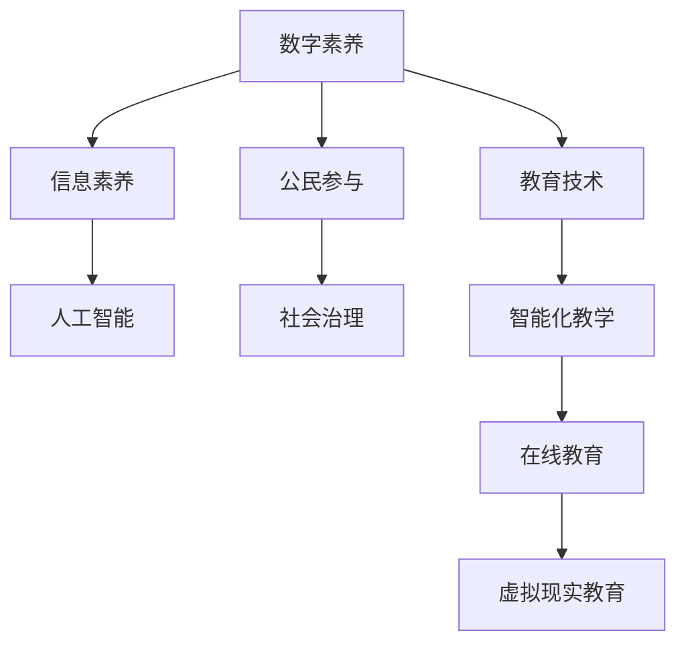

                 

# 数字素养：公民参与的基石

> 关键词：数字素养, 信息素养, 人工智能, 公民参与, 社会治理, 教育技术, 数据安全

## 1. 背景介绍

### 1.1 问题由来
随着数字化时代的到来，信息技术渗透到社会生活的各个角落，数字素养已成为现代社会公民必备的生存技能之一。然而，尽管数字化浪潮席卷全球，不同国家和地区在数字素养教育上的投入和水平仍存在显著差异。这不仅导致了数字鸿沟的产生，也加剧了社会不平等问题。

数字素养不仅关乎个人在数字世界中的生存和竞争能力，更是推动社会治理、经济发展以及国际竞争力的重要基石。本博客将探讨数字素养的基本概念及其与公民参与、社会治理、教育技术等领域的联系，分析当前数字素养教育面临的挑战，并提供一系列解决方案和未来发展方向。

### 1.2 问题核心关键点
数字素养是一个多维度的概念，涵盖了信息获取、处理、分析和应用等方面的知识和技能。其中，信息素养（Information Literacy）是数字素养的重要组成部分，强调个体在信息时代识别、评估、使用信息的能力。而人工智能（AI）的发展则进一步提升了数字素养的内涵，要求公民不仅具备信息处理能力，还需要具备与AI互动、理解和应用AI的能力。

AI技术的迅猛发展使得公民参与社会治理的方式更加多样化和智能化，同时也带来了数据安全、隐私保护等新的挑战。如何平衡技术发展和数字素养教育，成为当前亟待解决的问题。

### 1.3 问题研究意义
提升数字素养，不仅能提升个体在数字环境中的生存和发展能力，还能促进社会的整体和谐与进步。具体而言：

1. **增强个人竞争力**：在数字经济中，拥有高水平数字素养的人能够更好地适应职业变化，抓住新的机遇。
2. **促进社会公平**：数字素养教育可以缩小数字鸿沟，提供平等的学习和发展机会，促进社会公平。
3. **推动社会治理现代化**：通过提高公民的数字素养，政府部门可以更有效地进行信息公开、政策宣传、公共服务等方面的工作，提高社会治理效能。
4. **支持教育技术发展**：数字素养教育有助于推动教育技术的创新应用，如在线学习、虚拟现实教育等，提升教育质量和效率。
5. **加强数据安全保护**：高水平的数字素养能够增强公众对数据安全、隐私保护的意识，减少网络犯罪行为。

## 2. 核心概念与联系

### 2.1 核心概念概述

为更好地理解数字素养及其与公民参与、社会治理、教育技术等领域的联系，本节将介绍几个关键概念：

- **数字素养（Digital Literacy）**：指个体在数字环境中的信息获取、处理、分析和应用能力，包括对信息技术工具的使用、对网络信息的评估、以及对数字技术的批判性思考。
- **信息素养（Information Literacy）**：强调信息资源的识别、评估、获取、使用和管理，是数字素养的重要组成部分。
- **人工智能（AI）**：以机器学习和深度学习为核心的智能技术，能够自动处理大量数据，提供智能化的决策和建议，已成为数字素养的重要内容之一。
- **公民参与（Civic Engagement）**：指公民通过信息技术工具参与公共事务、表达意见和诉求，对社会治理和公共决策产生影响。
- **社会治理（Social Governance）**：指通过信息技术和公民参与，提高政府透明度、公信力和社会效率的过程。
- **教育技术（Educational Technology）**：指利用信息技术手段提升教育质量和学习效率的实践，包括在线教育、虚拟现实教育、智能化教学等。

这些核心概念之间存在紧密的联系，共同构成了数字素养教育的基础框架。以下通过Mermaid流程图展示这些概念之间的关系：



这个流程图展示了数字素养在公民参与、社会治理、教育技术等多个领域的体现和应用，以及AI技术在这些领域中的重要地位。

## 3. 核心算法原理 & 具体操作步骤
### 3.1 算法原理概述

数字素养的提升，涉及到多方面的技术和教育手段。基于信息素养和AI技术的数字素养教育，一般包括以下几个关键步骤：

1. **信息识别与评估**：个体需要能够识别和评估网络信息的可靠性和相关性。
2. **数据处理与分析**：能够对数据进行清洗、处理和分析，提取有用信息。
3. **AI技术应用**：掌握AI技术的基本原理，能够应用AI工具进行信息获取、处理和分析。
4. **公民参与与表达**：通过信息技术工具，参与公共事务和表达意见。
5. **社会治理与反馈**：利用信息技术手段，提升社会治理效能，并参与政策反馈和决策过程。

这些步骤不仅涉及技术知识，还需要相应的批判性思维和伦理道德观念。以下详细介绍算法步骤。

### 3.2 算法步骤详解

数字素养教育的具体操作包括以下几个关键步骤：

**Step 1: 制定教育标准**

首先需要制定数字素养教育的标准，明确公民在不同年龄段应具备的数字素养水平。例如，美国国家教育技术标准协会（ISTE）和欧盟数字素养框架等，都提供了详细的指导和标准。

**Step 2: 设计课程内容**

根据教育标准，设计系统的课程内容，涵盖信息识别、数据处理、AI应用、公民参与和社交治理等方面的知识。例如，课程可以包括信息筛选、数据分析、机器学习基础、在线表达、智能决策等主题。

**Step 3: 选择教学工具**

选择合适的教学工具和平台，如在线学习平台、虚拟实验室、AI工具包等，支持学生进行实际操作和练习。例如，Google Classroom、Kaggle、OpenAI等平台，都提供了丰富的教育资源和工具。

**Step 4: 实施教学过程**

通过线上线下结合的方式，实施数字素养教育。例如，线上通过视频课程、在线讨论等形式，线下进行实验、项目等实践活动。

**Step 5: 评估和反馈**

定期进行评估，了解学生的学习情况和进度，并根据评估结果进行调整和反馈。例如，使用测验、项目展示、作业等方式进行评估。

**Step 6: 持续改进**

根据评估结果和反馈信息，持续改进教学内容和方式，确保学生能够达到预期的数字素养水平。例如，通过课程改进、教学方法创新等方式，提升教育效果。

### 3.3 算法优缺点

数字素养教育的优势主要体现在以下几个方面：

- **提高个体竞争力**：通过数字素养教育，提升个体在信息时代中的生存和发展能力，增加就业机会。
- **促进社会公平**：数字素养教育有助于缩小数字鸿沟，提供平等的学习和发展机会，促进社会公平。
- **推动社会治理现代化**：通过数字素养教育，提升公民参与社会治理的能力，提高政府透明度和公信力。
- **支持教育技术发展**：数字素养教育有助于推动教育技术的创新应用，提升教育质量和效率。

然而，数字素养教育也面临一些挑战：

- **资源不均衡**：不同地区和学校的数字素养教育资源不均衡，影响了教育效果。
- **师资缺乏**：具备数字素养教育能力的教师缺乏，难以满足大规模教育需求。
- **技术壁垒**：部分学生和教师对新技术掌握不足，影响了教学效果。
- **信息过载**：数字素养教育需要处理大量信息，信息过载问题难以避免。
- **伦理道德问题**：数字素养教育需要培养学生的信息伦理和道德观念，这一方面还需要进一步探索。

### 3.4 算法应用领域

数字素养教育在多个领域得到了广泛应用，包括：

- **教育领域**：通过数字素养教育，提升学生的信息处理能力，支持在线学习和远程教育。
- **社会治理**：提升公民的在线参与和信息素养，推动政府透明和公信力建设。
- **企业培训**：企业通过数字素养培训，提升员工的信息处理能力和工作效率。
- **公共健康**：通过数字素养教育，提升公众的健康信息素养，支持在线健康咨询和公共卫生宣传。
- **智能城市**：通过数字素养教育，提升公众对智能技术的理解和使用能力，支持智慧城市建设。

## 4. 数学模型和公式 & 详细讲解 & 举例说明

### 4.1 数学模型构建

数字素养教育的目标是培养具备高水平信息素养和AI应用能力的公民。以下以信息素养的评估为例，构建数学模型：

设某学生的信息素养水平为 $P$，包括信息识别、信息评估、信息应用三个维度，每个维度都有若干个指标，如信息识别的准确率、评估的可靠性等。

设 $x_i$ 为第 $i$ 个指标的评分，$w_i$ 为该指标的权重。则学生的信息素养水平 $P$ 可以表示为：

$$
P = \sum_{i=1}^n w_i x_i
$$

其中 $w_i$ 表示第 $i$ 个指标的权重，可以通过专家调查或统计分析得到。

### 4.2 公式推导过程

设信息识别的准确率为 $x_1$，信息评估的可靠性为 $x_2$，信息应用的有效性为 $x_3$，则学生的信息素养水平 $P$ 可以表示为：

$$
P = w_1 x_1 + w_2 x_2 + w_3 x_3
$$

对于 $x_i$ 的评估，可以采用标准化的评分系统，如百分制评分，或等级评分（如优、良、中、差）。例如，某学生的信息识别准确率为 $90\%$，信息评估的可靠性为 $80\%$，信息应用的有效性为 $85\%$，设其信息识别、评估和应用的权重分别为 $0.3$、$0.2$ 和 $0.5$，则其信息素养水平为：

$$
P = 0.3 \times 0.9 + 0.2 \times 0.8 + 0.5 \times 0.85 = 0.947
$$

### 4.3 案例分析与讲解

以下通过一个具体的案例，展示数字素养教育在实际应用中的操作和效果。

**案例背景**：某社区正在开展数字素养教育项目，目标是将数字素养水平提升至90%以上。该项目主要面向社区居民，包括学生、家长和老年人。

**评估模型**：
- 信息识别：准确率评分
- 信息评估：可靠性评分
- 信息应用：有效性评分

**评估指标**：
- 信息识别：识别信息的准确率
- 信息评估：评估信息的可靠性
- 信息应用：应用信息的有效性

**权重分配**：
- 信息识别：0.3
- 信息评估：0.2
- 信息应用：0.5

**评估结果**：某社区居民的信息素养水平为 $P = 0.947$，达到项目目标。

## 5. 项目实践：代码实例和详细解释说明
### 5.1 开发环境搭建

在进行数字素养教育实践前，我们需要准备好开发环境。以下是使用Python进行数字素养评估系统开发的配置流程：

1. 安装Python：下载并安装Python，适用于Windows、Linux等操作系统。

2. 安装相关库：安装Pandas、NumPy、SciPy等常用库，用于数据处理和计算。

3. 搭建评估系统：使用Flask等Web框架，搭建数字素养评估系统的后端服务。

4. 部署前端界面：使用HTML、CSS、JavaScript等技术，开发数字素养评估系统的Web界面。

5. 数据导入和处理：从学校、社区等渠道导入学生和居民的数字素养数据，进行清洗和处理。

### 5.2 源代码详细实现

以下是使用Flask搭建数字素养评估系统的Python代码实现：

```python
from flask import Flask, request, render_template
import pandas as pd

app = Flask(__name__)

@app.route('/')
def index():
    return render_template('index.html')

@app.route('/submit', methods=['POST'])
def submit():
    data = request.form
    # 将数据保存到数据库或进行初步处理
    # 返回结果页面
    return render_template('result.html', result='数据已提交')

if __name__ == '__main__':
    app.run(debug=True)
```

该代码实现了Flask框架的基本功能，包括路由和表单提交处理。完整的数字素养评估系统包括数据导入、处理、评估和结果展示等模块，需要根据实际需求进行进一步开发。

### 5.3 代码解读与分析

让我们再详细解读一下关键代码的实现细节：

**Flask框架**：
- `Flask` 是Python中常用的Web框架，通过装饰器定义路由和处理函数。
- `request` 对象用于处理HTTP请求，获取表单数据。
- `render_template` 方法用于渲染HTML模板，展示数据处理结果。

**数据处理**：
- 使用 `Pandas` 库进行数据导入、清洗和处理。例如，可以通过 `pd.read_csv()` 方法读取CSV文件，使用 `pd.dropna()` 方法删除缺失数据，使用 `pd.groupby()` 方法进行分组统计等。
- 使用 `NumPy` 库进行数值计算和统计分析。例如，可以通过 `np.mean()` 方法计算平均值，使用 `np.std()` 方法计算标准差等。

**评估模型**：
- 通过构建数学模型，计算信息素养水平 $P$。例如，使用 `np.dot()` 方法计算向量点积，使用 `np.sum()` 方法计算向量求和等。
- 根据评估结果，生成可视化图表，展示信息素养的分布和提升趋势。例如，使用 `matplotlib` 库绘制柱状图、饼图等。

**结果展示**：
- 通过 `Flask` 框架，展示数字素养评估系统的Web界面，包括数据输入、结果展示等功能。

通过以上代码实现，数字素养评估系统可以方便地进行数据导入、处理和评估，为教育者提供便捷的数字素养评估工具。

## 6. 实际应用场景
### 6.1 政府数字化转型

数字素养在政府数字化转型中扮演重要角色。通过提升公务员和公众的数字素养，政府部门可以更好地进行信息公开、政策宣传、公共服务等方面的工作，提高社会治理效能。例如，中国政府通过数字化转型计划，推动“互联网+政务服务”，提升政务服务的效率和透明度。

**具体应用**：
- 政府网站和App：通过数字化素养培训，提升公务员和公众的信息素养，使用政府网站和App进行政策查询、办事服务等功能。
- 电子政务系统：通过数字素养教育，提升公务员的数字处理能力和信息评估能力，支持电子政务系统的运行和管理。
- 社会治理平台：通过数字素养教育，提升公民的在线参与和信息素养，推动社会治理平台的建设和发展。

### 6.2 企业数字化转型

企业数字化转型过程中，数字素养是员工必备的技能之一。通过数字素养教育，企业可以提高员工的信息处理能力和工作效率，增强企业的竞争力。

**具体应用**：
- 在线培训平台：企业通过数字素养培训平台，对员工进行信息素养和AI技术培训，提高员工的技能水平。
- 数字化工具应用：企业通过数字素养教育，提升员工对数字化工具的应用能力，支持企业的数字化转型。
- 数据驱动决策：企业通过数字素养教育，提升员工的数据分析能力和决策能力，支持企业的数据驱动决策。

### 6.3 公共健康

数字素养在公共健康领域的应用，有助于提升公众的健康信息素养，支持在线健康咨询和公共卫生宣传。

**具体应用**：
- 健康教育App：通过数字素养教育，提升公众的健康信息素养，使用健康教育App进行健康知识学习。
- 在线咨询平台：通过数字素养教育，提升公众的健康信息素养，使用在线咨询平台进行健康咨询。
- 公共卫生宣传：通过数字素养教育，提升公众的健康信息素养，支持公共卫生宣传和健康教育活动。

### 6.4 智能城市

数字素养在智能城市建设中具有重要作用。通过数字素养教育，提升公众对智能技术的理解和使用能力，支持智慧城市的建设和发展。

**具体应用**：
- 智能家居：通过数字素养教育，提升公众对智能家居设备的理解和使用能力，支持智能家居的普及和应用。
- 智慧交通：通过数字素养教育，提升公众对智慧交通系统的理解和使用能力，支持智慧交通的发展。
- 城市安全：通过数字素养教育，提升公众对城市安全系统的理解和使用能力，支持城市安全保障。

## 7. 工具和资源推荐
### 7.1 学习资源推荐

为了帮助开发者系统掌握数字素养教育的技术基础和实践技巧，这里推荐一些优质的学习资源：

1. 《信息素养教育基础》书籍：介绍信息素养的基本概念、教学方法和实践案例，适合教育者和学生阅读。
2. Coursera《数字素养与信息素养》课程：由全球知名大学和机构提供的在线课程，涵盖数字素养和信息素养的基础知识和技能。
3. Udacity《AI基础》课程：通过AI技术的教学，提升学生的信息处理能力和应用能力。
4. Khan Academy《信息素养与批判性思维》课程：提供全面的信息素养和批判性思维教育，适合各个年龄段的学习者。
5. OECD《数字素养框架》报告：介绍全球各国的数字素养教育标准和实施情况，提供参考和借鉴。

通过对这些资源的学习实践，相信你一定能够快速掌握数字素养教育的技术精髓，并用于解决实际的数字素养问题。

### 7.2 开发工具推荐

高效的开发离不开优秀的工具支持。以下是几款用于数字素养教育开发的常用工具：

1. Python：Python是一种简单易学的编程语言，支持数据处理和计算，是数字素养教育开发的首选工具。
2. Jupyter Notebook：Jupyter Notebook是一种交互式的编程环境，支持Python代码的编写和运行，方便进行数据分析和展示。
3. Flask：Flask是一种轻量级的Web框架，支持Web应用的快速开发，适合数字素养评估系统的后端开发。
4. HTML、CSS、JavaScript：HTML、CSS、JavaScript是Web开发中的三大核心技术，支持Web应用的搭建和设计。
5. Microsoft Excel：Microsoft Excel是一种常用的数据处理工具，支持数据的导入、处理和可视化展示。

合理利用这些工具，可以显著提升数字素养教育开发的效率，加快创新迭代的步伐。

### 7.3 相关论文推荐

数字素养教育的发展离不开学界的持续研究。以下是几篇奠基性的相关论文，推荐阅读：

1. Mcanally, P. D., & Baird, M. (2012). Information Literacy: An Examination of its Academic and Professional Framing. College & Research Libraries, 73(5), 492-505.
2. NCoren-Baker, L., & Pruitt, L. (2020). Information Literacy as Lifelong Learning. Public Library Quarterly, 39(2), 24-30.
3. Healy, C., & Blythe, M. (2019). Information Literacy in Higher Education: Towards a Global Strategy for Policy and Practice. International Journal of Educational Technology in Higher Education, 16(1), 1-17.
4. Jensen, M. (2011). Teaching Computer Literacy in New Media: Critical, Creative, and Functional. Journal of Science Education and Technology, 20(6), 695-705.
5. Beek, L. E., Grompone von Gimborn, J., & Vossen, G. F. (2014). An Overview of the Development and Evaluation of Digital Literacy Competences. Computers & Education, 71, 52-65.

这些论文代表了大数字素养教育的发展脉络。通过学习这些前沿成果，可以帮助研究者把握学科前进方向，激发更多的创新灵感。

## 8. 总结：未来发展趋势与挑战
### 8.1 研究成果总结

数字素养教育在提升个体竞争力、促进社会公平、推动社会治理现代化等方面具有重要作用。通过系统的数字素养教育，提升公民的信息素养和AI应用能力，可以更好地应对数字时代的挑战。

### 8.2 未来发展趋势

展望未来，数字素养教育将呈现以下几个发展趋势：

1. **跨学科整合**：数字素养教育将与信息技术、教育技术、公共卫生、智能城市等领域的知识进行整合，提供更加全面的教育内容。
2. **个性化教育**：通过数据分析和AI技术，实现个性化的数字素养教育，满足不同年龄段和需求的学习者。
3. **全球化教育**：数字素养教育将打破地域限制，通过在线教育平台和数字资源，实现全球范围内的知识共享和学习。
4. **技术融合**：数字素养教育将与VR、AR、物联网等新兴技术进行融合，提升教育效果和体验。
5. **伦理教育**：数字素养教育将注重伦理和道德教育，引导学生在使用数字技术时遵循规范和道德标准。

### 8.3 面临的挑战

尽管数字素养教育在多个领域取得了显著进展，但仍面临一些挑战：

1. **教育资源不均衡**：不同地区和学校的数字素养教育资源不均衡，影响了教育效果。
2. **师资力量不足**：具备数字素养教育能力的教师缺乏，难以满足大规模教育需求。
3. **技术壁垒**：部分学生和教师对新技术掌握不足，影响了教学效果。
4. **信息过载**：数字素养教育需要处理大量信息，信息过载问题难以避免。
5. **伦理道德问题**：数字素养教育需要培养学生的信息伦理和道德观念，这一方面还需要进一步探索。

### 8.4 研究展望

未来的数字素养教育需要在以下几个方面寻求新的突破：

1. **资源均衡化**：通过政策支持和资源共享，缩小数字素养教育资源的不均衡。
2. **师资专业化**：加强数字素养教育师资力量的培训和专业化建设，提升教师的教学能力和素养。
3. **技术创新**：开发更多技术工具和平台，支持数字素养教育的创新应用。
4. **伦理教育**：在数字素养教育中融入伦理和道德教育，引导学生在使用数字技术时遵循规范和道德标准。
5. **全球合作**：加强国际合作和知识共享，推动全球范围内的数字素养教育发展。

## 9. 附录：常见问题与解答

**Q1：数字素养教育对个体有哪些益处？**

A: 数字素养教育对个体有以下益处：
1. **提升就业竞争力**：通过数字素养教育，提升个体在数字时代中的生存和发展能力，增加就业机会。
2. **促进个人成长**：数字素养教育有助于提升个体的信息处理能力、批判性思维能力和问题解决能力。
3. **支持终身学习**：数字素养教育是一种终身学习的方式，可以不断提升个体在数字环境中的适应能力。

**Q2：如何选择合适的数字素养教育内容？**

A: 选择合适的数字素养教育内容需要考虑以下因素：
1. **目标群体**：根据不同年龄段和需求，选择适合的内容。例如，学生需要更多基础知识和技能，成人需要更多实用技能和应用案例。
2. **教育标准**：根据各国和地区的教育标准，选择符合标准的教育内容。例如，美国国家教育技术标准协会（ISTE）和欧盟数字素养框架等，都提供了详细的指导和标准。
3. **技术发展**：根据最新的技术发展和应用趋势，选择符合实际应用需求的内容。例如，AI技术在数字素养教育中的应用，需要结合最新的AI技术和工具。

**Q3：如何评估数字素养教育的效果？**

A: 数字素养教育的效果评估需要综合考虑以下几个方面：
1. **知识掌握**：通过测验、考试等方式，评估学生对数字素养知识的掌握程度。
2. **技能应用**：通过项目、作业等方式，评估学生对数字素养的实际应用能力。
3. **行为改变**：通过观察和访谈等方式，评估学生在使用数字技术时的行为和态度变化。
4. **反馈和改进**：通过学生、教师和家长的反馈，持续改进数字素养教育内容和方式，确保教育效果。

通过以上方法，可以全面评估数字素养教育的效果，不断优化教育内容和方式，提升教育效果。

---

作者：禅与计算机程序设计艺术 / Zen and the Art of Computer Programming

