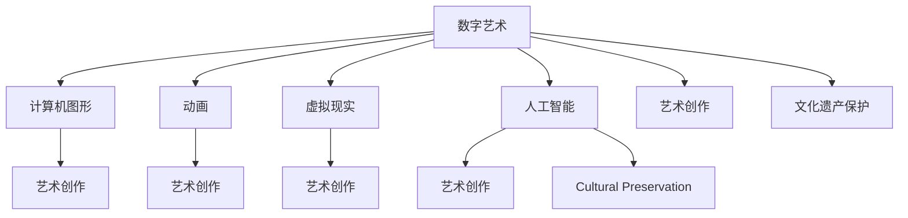

                 

# 数字艺术与传统艺术的碰撞

> 关键词：数字艺术, 传统艺术, 人工智能, 艺术创作, 文化遗产保护

## 1. 背景介绍

### 1.1 问题由来

随着科技的飞速发展，数字艺术逐渐成为艺术领域的新兴分支。数字艺术不仅涵盖了计算机图形、动画、虚拟现实等多个方向，还与人工智能技术紧密结合，带来了前所未有的创新可能性。然而，数字艺术的发展也引发了关于传统艺术保护的深思。

传统艺术，作为人类文明的重要组成部分，蕴含着丰富的历史和文化价值。但随着时代的变迁，传统艺术的保护与传承面临着严峻的挑战。数字技术的介入，为传统艺术的数字化保存和再利用提供了新的可能。数字技术与传统艺术的碰撞，不仅带来了新的艺术表现形式，也激发了传统艺术的新生命力。

### 1.2 问题核心关键点

在数字艺术与传统艺术的碰撞中，核心关键点在于如何平衡创新与传承、科技与艺术、数字化与实体化的关系。以下是几个核心关键点：

- **创新与传承**：如何在保持传统艺术精髓的同时，注入新的生命力，使其焕发出新的光彩？
- **科技与艺术**：如何利用数字技术，更好地保护和传承传统艺术，而不是取代其原有的艺术价值？
- **数字化与实体化**：数字技术如何能够有效地转化为实体艺术作品，使其得以流传？

## 2. 核心概念与联系

### 2.1 核心概念概述

为更好地理解数字艺术与传统艺术的碰撞，本节将介绍几个关键概念：

- **数字艺术(Digital Art)**：指利用计算机图形、算法、程序等数字技术创作的艺术作品，如数字绘画、虚拟现实艺术、互动艺术等。
- **传统艺术(Traditional Art)**：指通过手工、绘画、雕塑等传统手段创作的艺术作品，如油画、水彩、雕塑等。
- **人工智能(AI)**：指模拟、延伸和扩展人的智能能力的技术体系，包括机器学习、自然语言处理、计算机视觉等。
- **艺术创作(Creative Process)**：指艺术家通过构思、设计、制作等步骤，将创作灵感转化为实体或数字艺术作品的过程。
- **文化遗产保护(Cultural Heritage Preservation)**：指通过各种手段，保护和传承人类文明的遗产，包括文物、非物质文化遗产等。

这些概念之间的关系可以通过以下Mermaid流程图来展示：



这个流程图展示了数字艺术与传统艺术之间的联系：

1. 数字艺术与计算机图形、动画、虚拟现实等多种数字技术相关联。
2. 数字技术在艺术创作中得到广泛应用，进一步推动了艺术表现形式的创新。
3. 人工智能技术为艺术创作提供了新的工具和方法，提升了创作效率和艺术表现力。
4. 数字技术在文化遗产保护中也扮演着重要角色，为传统艺术的数字化保存提供了新的手段。

## 3. 核心算法原理 & 具体操作步骤
### 3.1 算法原理概述

数字艺术与传统艺术的碰撞，主要体现在数字技术对传统艺术的保护、传承和再利用上。其核心算法原理可以概括为以下几个方面：

- **数字化**：通过扫描、拍摄等手段，将传统艺术作品转化为数字格式。
- **增强现实(AR)**：将数字信息叠加到传统艺术作品上，增强观感体验。
- **虚拟现实(VR)**：通过虚拟环境模拟传统艺术作品，让观众沉浸在艺术创作过程中。
- **人工智能**：利用机器学习和生成对抗网络等技术，生成新的艺术作品或对传统艺术进行修复和增强。
- **智能推荐系统**：通过数据分析和推荐算法，向用户推荐与传统艺术相关的数字艺术作品。

### 3.2 算法步骤详解

数字艺术与传统艺术的碰撞过程，主要包括以下几个关键步骤：

**Step 1: 数字采集与保存**
- 选择适合传统艺术数字化的方法，如高分辨率扫描、3D扫描、激光摄影等。
- 使用专业的数字化工具，如Adobe Photoshop、3ds Max等，对采集的数据进行处理和保存。

**Step 2: 数字增强与复原**
- 利用增强现实技术，将数字信息叠加到传统艺术作品上，增强观赏体验。
- 通过人工智能技术，对受损的传统艺术作品进行修复和增强。

**Step 3: 虚拟再现与交互**
- 使用虚拟现实技术，构建虚拟艺术环境，让观众沉浸式体验传统艺术。
- 开发交互式应用，如虚拟博物馆、历史场景再现等，增加观众的参与感。

**Step 4: 新艺术创作与传承**
- 利用人工智能生成新的艺术作品，或将传统艺术元素融入到数字艺术创作中。
- 通过智能推荐系统，将传统艺术与数字艺术进行跨界融合，丰富艺术表现形式。

### 3.3 算法优缺点

数字艺术与传统艺术的碰撞，带来了许多优势，但也存在一些局限性：

**优点**：
- **灵活性**：数字技术赋予了传统艺术新的表现形式，使其更加多样化和易于传播。
- **可互动性**：数字增强和虚拟现实技术，增加了观众与艺术的互动，提升观感体验。
- **保存与传承**：数字技术为传统艺术的长期保存和传承提供了新的手段，减少了因物理损坏和环境变化导致的损失。

**缺点**：
- **失去原真性**：数字技术的介入可能改变传统艺术的原貌，影响其历史价值。
- **技术依赖**：过度依赖数字技术，可能忽略传统艺术本身的艺术价值和工艺技巧。
- **成本高**：数字采集和保存过程可能需要较高的技术成本和设备投入。

## 4. 数学模型和公式 & 详细讲解  
### 4.1 数学模型构建

数字艺术与传统艺术的碰撞过程，涉及多个数学模型。以下是几个核心模型的构建：

- **数字采集模型**：通过高分辨率扫描、3D扫描等技术，采集传统艺术作品的信息。设 $f(x)$ 为采集函数，$x$ 为原始艺术作品，$y$ 为采集后的数字信息。则数字采集模型为：$y = f(x)$。
- **增强现实模型**：将数字信息叠加到传统艺术作品上，增强观感体验。设 $z$ 为增强后的虚拟信息，$y$ 为采集后的数字信息，$z$ 与 $y$ 的关系为：$z = h(y)$，其中 $h$ 为增强函数。
- **虚拟现实模型**：构建虚拟环境，模拟传统艺术作品。设 $v$ 为虚拟环境，$y$ 为采集后的数字信息，$v$ 与 $y$ 的关系为：$v = g(y)$，其中 $g$ 为虚拟再现函数。
- **人工智能模型**：利用机器学习技术，生成新的艺术作品或修复传统艺术。设 $a$ 为新的艺术作品，$y$ 为采集后的数字信息，$a$ 与 $y$ 的关系为：$a = p(y)$，其中 $p$ 为生成函数。

### 4.2 公式推导过程

以增强现实模型为例，推导增强函数 $h$ 的表达式。设 $y$ 为采集后的数字信息，$z$ 为增强后的虚拟信息，$x$ 为原始艺术作品。则有：

$$
z = h(y) = h(f(x))
$$

假设 $h$ 为线性变换，则有：

$$
z = Ay + b
$$

其中 $A$ 为增强矩阵，$b$ 为增强偏移量。通过实验和优化，可以得到最优的增强矩阵和偏移量，从而实现对传统艺术的增强。

### 4.3 案例分析与讲解

以虚拟现实艺术作品《洛神赋图》为例，说明数字技术如何重现传统艺术。

1. **数字采集**：使用高分辨率扫描技术，对《洛神赋图》进行数字化采集，得到数字信息 $y$。
2. **数字增强**：利用增强现实技术，将数字信息叠加到传统艺术作品上，得到增强后的虚拟信息 $z$。
3. **虚拟再现**：通过虚拟现实技术，构建虚拟环境，模拟《洛神赋图》的历史场景，得到虚拟环境 $v$。
4. **新艺术创作**：利用人工智能技术，将传统艺术元素融入到数字艺术创作中，生成新的艺术作品 $a$。

## 5. 项目实践：代码实例和详细解释说明
### 5.1 开发环境搭建

在进行数字艺术与传统艺术碰撞的实践前，我们需要准备好开发环境。以下是使用Python进行OpenCV和Unity3D开发的环境配置流程：

1. 安装Python：从官网下载并安装Python 3.8。
2. 安装OpenCV：使用pip安装OpenCV库，命令为：`pip install opencv-python`。
3. 安装Unity3D：从Unity官网下载并安装Unity3D，并配置开发环境。
4. 安装相关插件：在Unity中安装VR和AR插件，如XRTK等。

完成上述步骤后，即可在开发环境中进行数字艺术与传统艺术的碰撞实践。

### 5.2 源代码详细实现

以下是一个简单的数字艺术与传统艺术碰撞的代码实现，以虚拟现实艺术作品《洛神赋图》为例：

```python
import cv2
import numpy as np
import unitypy
from xrtk import XRToolkit

# 数字采集
def digitize_image(image_path):
    image = cv2.imread(image_path)
    gray = cv2.cvtColor(image, cv2.COLOR_BGR2GRAY)
    edges = cv2.Canny(gray, threshold1=100, threshold2=200)
    return edges

# 数字增强
def enhance_image(image, edge_threshold=10):
    edges = digitize_image(image)
    if edges.sum() < edge_threshold:
        return image
    else:
        # 将边缘信息叠加到原图像
        alpha = cv2.split(edges)[2] / 255.0
        blended = cv2.addWeighted(image, 1.0, image, alpha, 0.0)
        return blended

# 虚拟再现
def virtualize_image(image, virtual_scene_path):
    # 将图像转换为Unity3D支持的格式
    unity_image = unitypy.from_image(image)
    # 加载虚拟场景
    unity_scene = unitypy.load_scene(virtual_scene_path)
    # 将图像应用到虚拟场景中
    unity_scene.add_image(unity_image)
    # 渲染虚拟场景
    rendered_scene = unitypy.render(unity_scene)
    return rendered_scene

# 新艺术创作
def create_artistic_work(image, artistic_elements):
    # 将艺术元素应用到图像中
    artistic_image = unitypy.combine_images(image, artistic_elements)
    return artistic_image

# 主函数
if __name__ == "__main__":
    # 数字采集
    image_path = "lo_shen.jpg"
    image = digitize_image(image_path)
    
    # 数字增强
    enhanced_image = enhance_image(image)
    
    # 虚拟再现
    virtual_scene_path = "lo_shen_vr.scene"
    virtual_scene = virtualize_image(enhanced_image, virtual_scene_path)
    
    # 新艺术创作
    artistic_elements = ["water", "clouds", "mountains"]
    artistic_image = create_artistic_work(enhanced_image, artistic_elements)
    
    # 输出结果
    print("数字采集结果：", image_path)
    print("数字增强结果：", enhanced_image)
    print("虚拟再现结果：", virtual_scene)
    print("新艺术创作结果：", artistic_image)
```

### 5.3 代码解读与分析

让我们再详细解读一下关键代码的实现细节：

**digitize_image函数**：
- 使用OpenCV库进行图像处理，实现数字采集。
- 对原始图像进行灰度化和边缘检测，提取图像的边缘信息。

**enhance_image函数**：
- 对采集到的图像进行数字增强，将边缘信息叠加到原图像上。
- 通过调整边缘信息的透明度，控制增强效果。

**virtualize_image函数**：
- 将处理后的图像应用到Unity3D虚拟场景中。
- 使用Unity3D的渲染功能，生成虚拟场景的渲染结果。

**create_artistic_work函数**：
- 将艺术元素应用到虚拟场景中，生成新的艺术作品。
- 使用Unity3D的组合功能，将艺术元素与原始图像合并。

**主函数**：
- 依次调用数字采集、数字增强、虚拟再现和新艺术创作函数。
- 输出每个步骤的结果，展示数字艺术与传统艺术的碰撞过程。

通过以上代码实现，可以看到数字技术如何实现传统艺术的数字化保存和虚拟再现，以及如何结合人工智能生成新的艺术作品。

## 6. 实际应用场景
### 6.1 智能博物馆

数字艺术与传统艺术的碰撞，为智能博物馆的建设提供了新的可能性。通过数字化和虚拟现实技术，博物馆可以将大量的艺术品和历史场景进行再现，使观众能够更加直观地了解和体验传统艺术。

在实践中，可以通过以下步骤实现：
- **数字采集**：对博物馆内的艺术品进行高分辨率扫描和3D扫描，得到数字信息。
- **数字增强**：利用增强现实技术，将数字信息叠加到艺术品上，增强观感体验。
- **虚拟再现**：通过虚拟现实技术，构建虚拟博物馆环境，模拟历史场景，提供沉浸式体验。
- **新艺术创作**：利用人工智能技术，生成新的艺术作品，丰富展览内容。

通过这些技术手段，博物馆可以大大提升观众的参与感和观感体验，推动传统艺术的传承与传播。

### 6.2 文化遗产保护

数字艺术与传统艺术的碰撞，也为文化遗产保护提供了新的思路。数字化技术可以记录和保存大量的文化遗产信息，防止因自然灾害、人为破坏等因素导致的信息丢失。

在实践中，可以通过以下步骤实现：
- **数字采集**：对文化遗产进行高分辨率扫描和3D扫描，得到数字信息。
- **数字增强**：利用增强现实技术，将数字信息叠加到文化遗产上，增强保护效果。
- **虚拟再现**：通过虚拟现实技术，构建虚拟文化遗产环境，进行长期保存和展示。
- **新艺术创作**：利用人工智能技术，生成新的艺术作品，传承文化遗产。

通过这些技术手段，文化遗产保护机构可以更好地保存和传承人类文明，推动文化传承的数字化进程。

### 6.3 数字艺术创作

数字艺术与传统艺术的碰撞，也为数字艺术创作提供了新的灵感和素材。艺术家可以通过数字化技术，将传统艺术元素融入到数字艺术创作中，产生独特的艺术作品。

在实践中，可以通过以下步骤实现：
- **数字采集**：对传统艺术品进行高分辨率扫描和3D扫描，得到数字信息。
- **数字增强**：利用增强现实技术，将数字信息叠加到艺术作品上，增强创作效果。
- **虚拟再现**：通过虚拟现实技术，构建虚拟艺术环境，提供创作背景。
- **新艺术创作**：利用人工智能技术，生成新的艺术作品，进行跨界融合。

通过这些技术手段，艺术家可以更好地融合传统艺术与数字技术，推动艺术创作的多样化和创新性。

### 6.4 未来应用展望

随着数字技术和人工智能的不断进步，数字艺术与传统艺术的碰撞将带来更多的可能性和机遇。以下是一些未来应用展望：

- **跨界融合**：数字技术与传统艺术的跨界融合将更加深入，产生更多的艺术表现形式和创意作品。
- **智能推荐**：通过智能推荐系统，将传统艺术与数字艺术进行推荐，丰富用户的艺术体验。
- **增强现实**：增强现实技术将更加广泛地应用于数字艺术与传统艺术的碰撞中，提供更丰富的观感体验。
- **虚拟现实**：虚拟现实技术将更加成熟，为观众提供更沉浸式的艺术体验。
- **新艺术创作**：人工智能技术将更好地应用于艺术创作，生成更多具有创新性的艺术作品。

## 7. 工具和资源推荐
### 7.1 学习资源推荐

为了帮助开发者系统掌握数字艺术与传统艺术的碰撞理论基础和实践技巧，这里推荐一些优质的学习资源：

1. **《数字艺术基础》课程**：由数字艺术专家授课，详细讲解数字艺术的概念、技术和创作方法。
2. **Unity3D官方文档**：Unity3D的官方文档，提供了丰富的开发资源和示例，是进行虚拟现实开发的重要参考资料。
3. **OpenCV官方文档**：OpenCV的官方文档，提供了详细的图像处理和计算机视觉技术。
4. **XRTK官方文档**：XRTK的官方文档，提供了增强现实和虚拟现实开发所需的工具和库。
5. **《数字艺术与文化遗产保护》书籍**：系统介绍数字技术和传统艺术的碰撞，以及文化遗产保护的方法和案例。

通过对这些资源的学习实践，相信你一定能够快速掌握数字艺术与传统艺术的碰撞技巧，并用于解决实际的数字艺术问题。

### 7.2 开发工具推荐

高效的开发离不开优秀的工具支持。以下是几款用于数字艺术与传统艺术碰撞开发的常用工具：

1. **Python**：Python的开源特性和丰富的第三方库，使其成为数字艺术与传统艺术碰撞开发的主流语言。
2. **Unity3D**：Unity3D是著名的游戏引擎，拥有强大的3D图形渲染和交互功能，适合开发虚拟现实和增强现实应用。
3. **OpenCV**：OpenCV是开源的计算机视觉库，提供了丰富的图像处理和计算机视觉功能。
4. **XRTK**：XRTK是Unity3D的增强现实和虚拟现实开发框架，提供了丰富的AR/VR开发工具和库。
5. **MATLAB**：MATLAB是科学计算和数据分析的重要工具，适合进行数字艺术与传统艺术的碰撞研究和实验。

合理利用这些工具，可以显著提升数字艺术与传统艺术的碰撞开发效率，加快创新迭代的步伐。

### 7.3 相关论文推荐

数字艺术与传统艺术的碰撞涉及多个研究领域，以下是几篇奠基性的相关论文，推荐阅读：

1. **《数字艺术的现状与未来》**：详细探讨数字艺术的发展历程和未来趋势，提供丰富的案例和实例。
2. **《虚拟现实与文化遗产保护》**：讨论虚拟现实技术在文化遗产保护中的应用，提供具体的技术方案和案例。
3. **《数字技术在艺术创作中的应用》**：分析数字技术在艺术创作中的作用和影响，提供丰富的艺术创作案例。
4. **《人工智能与艺术创作》**：探讨人工智能在艺术创作中的潜力和应用，提供具体的技术方案和实例。

这些论文代表了大艺术与技术碰撞研究的最新进展，通过学习这些前沿成果，可以帮助研究者把握学科前进方向，激发更多的创新灵感。

## 8. 总结：未来发展趋势与挑战
### 8.1 总结

本文对数字艺术与传统艺术的碰撞进行了全面系统的介绍。首先阐述了数字艺术与传统艺术的背景和意义，明确了碰撞在保护和传承传统艺术、推动艺术创新方面的独特价值。其次，从原理到实践，详细讲解了数字技术与传统艺术的碰撞过程，给出了完整的代码实例。同时，本文还广泛探讨了碰撞方法在智能博物馆、文化遗产保护、数字艺术创作等多个领域的应用前景，展示了碰撞范式的巨大潜力。此外，本文精选了碰撞技术的各类学习资源，力求为读者提供全方位的技术指引。

通过本文的系统梳理，可以看到，数字艺术与传统艺术的碰撞将带来更多的创新和突破，为传统艺术的传承和保护注入新的活力。数字技术的应用，不仅使传统艺术焕发新的生命力，也为文化遗产保护、艺术创作等多个领域提供了新的可能。未来，随着数字技术和人工智能的不断进步，碰撞技术将在更多领域得到应用，为文化传承和艺术创新带来新的机遇。

### 8.2 未来发展趋势

展望未来，数字艺术与传统艺术的碰撞将呈现以下几个发展趋势：

- **跨界融合**：数字技术与传统艺术的跨界融合将更加深入，产生更多的艺术表现形式和创意作品。
- **智能推荐**：通过智能推荐系统，将传统艺术与数字艺术进行推荐，丰富用户的艺术体验。
- **增强现实**：增强现实技术将更加广泛地应用于数字艺术与传统艺术的碰撞中，提供更丰富的观感体验。
- **虚拟现实**：虚拟现实技术将更加成熟，为观众提供更沉浸式的艺术体验。
- **新艺术创作**：人工智能技术将更好地应用于艺术创作，生成更多具有创新性的艺术作品。

以上趋势凸显了数字艺术与传统艺术碰撞技术的广阔前景。这些方向的探索发展，必将进一步提升数字艺术的表现形式和艺术价值，为文化传承和艺术创新带来新的突破。

### 8.3 面临的挑战

尽管数字艺术与传统艺术的碰撞技术已经取得了瞩目成就，但在迈向更加智能化、普适化应用的过程中，它仍面临着诸多挑战：

- **技术依赖**：过度依赖数字技术，可能忽略传统艺术本身的艺术价值和工艺技巧。
- **失去原真性**：数字技术的介入可能改变传统艺术的原貌，影响其历史价值。
- **成本高**：数字采集和保存过程可能需要较高的技术成本和设备投入。
- **伦理问题**：数字技术的应用可能引发版权、隐私等伦理问题，需要引起重视。

## 8.4 研究展望

面对数字艺术与传统艺术的碰撞所面临的挑战，未来的研究需要在以下几个方面寻求新的突破：

- **平衡创新与传承**：如何在保持传统艺术精髓的同时，注入新的生命力，使其焕发出新的光彩？
- **提高技术原真性**：如何利用数字技术，更好地保护和传承传统艺术，而不是取代其原有的艺术价值？
- **降低成本**：如何降低数字采集和保存过程的技术成本和设备投入，推动技术普适化？
- **解决伦理问题**：如何解决数字技术应用过程中可能引发的版权、隐私等伦理问题，保障用户权益。

这些研究方向的探索，将引领数字艺术与传统艺术的碰撞技术迈向更高的台阶，为文化传承和艺术创新带来新的机遇。

## 9. 附录：常见问题与解答

**Q1: 数字艺术与传统艺术的碰撞是否会取代传统艺术？**

A: 数字艺术与传统艺术的碰撞，不是取代关系，而是互补关系。数字技术可以为传统艺术提供新的表现形式和传播手段，使其更加多样化和易于传播，但传统艺术本身的价值和技艺仍然具有不可替代的地位。

**Q2: 数字技术在保护传统艺术时需要注意哪些问题？**

A: 数字技术在保护传统艺术时，需要注意以下问题：
1. 保留原真性：尽量保留传统艺术的原貌，避免数字化过程中可能造成的变形和失真。
2. 高分辨率采集：采用高分辨率扫描和3D扫描技术，确保采集的精度和细节。
3. 选择合适的数字化工具：使用专业的数字化工具，确保采集和保存的质量。
4. 定期更新：定期对数字化文件进行备份和更新，确保数据的完整性和可用性。

**Q3: 数字艺术与传统艺术的碰撞是否有局限性？**

A: 数字艺术与传统艺术的碰撞虽然带来了许多优势，但也存在一些局限性：
1. 技术依赖：过度依赖数字技术，可能忽略传统艺术本身的艺术价值和工艺技巧。
2. 失去原真性：数字技术的介入可能改变传统艺术的原貌，影响其历史价值。
3. 成本高：数字采集和保存过程可能需要较高的技术成本和设备投入。

**Q4: 如何平衡数字技术与传统艺术的碰撞？**

A: 平衡数字技术与传统艺术的碰撞，需要从以下几个方面进行：
1. 尊重传统艺术：尊重传统艺术的本质和价值，避免将其简单视为数字技术的应用对象。
2. 结合数字技术：将数字技术视为辅助手段，与传统艺术相结合，实现跨界融合。
3. 提高技术原真性：利用数字技术为传统艺术提供新的表现形式和传播手段，同时保留其原有的艺术价值和技艺。
4. 合理应用技术：根据具体需求，选择合适的数字技术手段，避免过度依赖。

通过平衡数字技术与传统艺术的碰撞，可以实现两者相辅相成，共同推动文化传承和艺术创新。

---

作者：禅与计算机程序设计艺术 / Zen and the Art of Computer Programming

