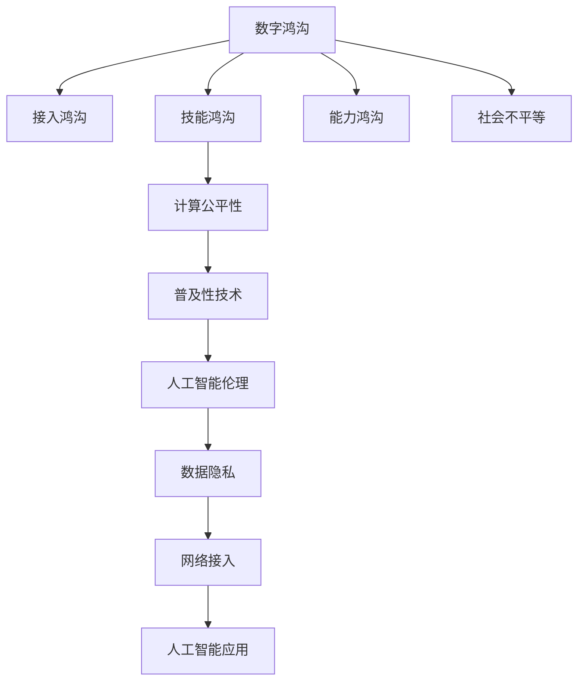

                 

# 数字鸿沟：弥合人类计算中的不平等现象

> 关键词：数字鸿沟, 计算公平性, 人工智能伦理, 普及性技术, 数据隐私, 网络接入

## 1. 背景介绍

### 1.1 问题由来

数字鸿沟（Digital Divide）指的是全球范围内因技术、教育、经济等因素造成的数字资源获取、使用和利用上的不平等现象。随着信息技术的迅猛发展，数字技术逐渐渗透到各行各业，成为现代社会的重要基础设施。然而，这种技术渗透并非均衡分布，部分人群尤其是低收入群体和偏远地区居民，由于种种原因难以获得高质量的数字资源和服务，陷入“被遗忘的角落”。

### 1.2 问题核心关键点

数字鸿沟的根本原因在于技术普及和应用的不平衡。这一现象不仅限制了数字技术对社会的积极影响，还可能加剧社会不平等，甚至引发一系列社会问题。因此，如何在保证技术创新的同时，确保技术普及的公平性，是当前亟待解决的重要议题。

## 2. 核心概念与联系

### 2.1 核心概念概述

为深入探讨如何弥合数字鸿沟，本文涉及以下关键概念：

- **数字鸿沟**：指因技术获取和使用能力差异造成的信息不平等现象。主要分为接入鸿沟、技能鸿沟和能力鸿沟。
- **计算公平性**：指在技术普及过程中，保障所有群体能够公平获取和利用数字资源和服务的原则。
- **人工智能伦理**：指在人工智能设计和应用过程中，遵循的道德规范和伦理标准。
- **普及性技术**：指那些易于获取、使用且成本较低的技术，能够最大化覆盖人群。
- **数据隐私**：指在数据采集、存储、处理和传输过程中，保障个体信息安全不被滥用的原则。
- **网络接入**：指人们获取互联网服务的能力和手段，是数字鸿沟的重要组成部分。

这些概念之间存在复杂的相互作用关系，共同构成了数字鸿沟的多维全景图。

### 2.2 核心概念原理和架构的 Mermaid 流程图



这个流程图展示了数字鸿沟与相关概念的联系：

1. 数字鸿沟由接入鸿沟、技能鸿沟和能力鸿沟构成，反映不同群体在技术获取和应用能力上的差异。
2. 计算公平性、普及性技术和人工智能伦理共同推动数字技术普及，但同时也存在数据隐私保护的挑战。
3. 数字鸿沟的解决不仅能提升技术普及率，还能缓解社会不平等，促进社会和谐。

## 3. 核心算法原理 & 具体操作步骤

### 3.1 算法原理概述

数字鸿沟的解决需要系统化、多维度的策略，涉及政策制定、技术改进和资源分配等多个层面。以下是几个核心算法原理：

1. **接入提升算法**：通过优化网络基础设施和接入服务，提升偏远和低收入地区的网络覆盖率和接入质量。
2. **技能培养算法**：提供简单易用的数字化工具和教程，培训用户掌握基本技术操作技能。
3. **能力增强算法**：设计适应性技术和服务，满足不同用户群体的特定需求，缩小技术差距。
4. **公平性优化算法**：构建公平的资源分配机制，确保技术普及的广泛性和包容性。
5. **隐私保护算法**：采用隐私保护技术，保护用户数据不被滥用。

这些算法共同构成了弥合数字鸿沟的多维度解决方案。

### 3.2 算法步骤详解

以下详细介绍每个算法的详细步骤：

#### 3.2.1 接入提升算法

**步骤1:** 进行网络基础设施评估，识别网络覆盖的薄弱区域。
**步骤2:** 与地方政府和网络服务提供商合作，制定改进计划，提升网络基础设施。
**步骤3:** 提供优惠政策和补贴，鼓励企业投资网络覆盖欠发达地区。
**步骤4:** 推广普及性的接入设备，如平板电脑、智能手机，降低接入成本。
**步骤5:** 定期监测网络覆盖和接入质量，根据反馈不断优化。

#### 3.2.2 技能培养算法

**步骤1:** 分析不同用户群体的技术水平，识别技能差距。
**步骤2:** 设计针对各群体的培训课程，包括基础操作、应用实践和问题解答。
**步骤3:** 开发简单易用的教程和应用，帮助用户自我学习。
**步骤4:** 建立用户社区，促进知识分享和经验交流。
**步骤5:** 持续评估培训效果，调整培训内容和方法。

#### 3.2.3 能力增强算法

**步骤1:** 进行用户需求调研，了解不同用户群体的特定需求。
**步骤2:** 设计适应性强的技术和服务，如简化界面、提供多语言支持等。
**步骤3:** 进行小规模试点，收集用户反馈，优化技术和服务。
**步骤4:** 推广适应性技术和服务，逐步扩大覆盖范围。
**步骤5:** 持续监测用户反馈，不断迭代优化。

#### 3.2.4 公平性优化算法

**步骤1:** 分析资源分配现状，识别不平等现象。
**步骤2:** 制定公平的资源分配政策，如免费或低成本接入、补贴等。
**步骤3:** 构建资源分配评估机制，实时监测资源分配效果。
**步骤4:** 引入激励机制，鼓励企业和组织参与公平性优化。
**步骤5:** 定期评估公平性优化效果，调整优化策略。

#### 3.2.5 隐私保护算法

**步骤1:** 采用隐私保护技术，如差分隐私、联邦学习等。
**步骤2:** 制定隐私保护政策，明确数据使用规范。
**步骤3:** 定期进行隐私风险评估，识别潜在隐私泄露点。
**步骤4:** 提供隐私保护工具，如加密、匿名化等，保障数据安全。
**步骤5:** 建立用户隐私保护机制，确保用户知情同意。

### 3.3 算法优缺点

数字鸿沟的解决算法具有以下优点：

1. **全面覆盖**：多维度策略能全面提升数字技术普及率，覆盖不同用户群体。
2. **成本效益**：通过优化资源分配，降低接入成本，提升技能培训效果，最大化资源利用。
3. **灵活适应**：根据用户需求和反馈不断优化，确保技术服务的适应性和包容性。
4. **隐私保护**：通过隐私保护技术，保障用户数据安全，减少隐私泄露风险。

同时，也存在一些局限性：

1. **政策依赖**：政策支持和技术改进的成效很大程度上取决于政策执行力度和地方政府的配合。
2. **资源限制**：大规模的技术普及和基础设施建设需要大量资金和资源支持。
3. **技术复杂性**：某些技术如隐私保护和差分隐私，可能对用户和开发者带来额外技术负担。
4. **长期性**：数字鸿沟的消除并非一朝一夕，需要长期持续的努力和投入。

### 3.4 算法应用领域

数字鸿沟的解决算法在多个领域具有广泛的应用：

- **教育**：通过提供普及性技术和服务，提升偏远和低收入地区学生的数字化学习能力。
- **医疗**：通过改善网络接入和技能培训，提升偏远地区医疗服务的可及性和质量。
- **农业**：通过提供适应性技术，提升农民的信息获取和农业生产效率。
- **社会服务**：通过公平性优化算法，提升公共服务的覆盖率和用户满意度。

## 4. 数学模型和公式 & 详细讲解 & 举例说明

### 4.1 数学模型构建

数字鸿沟的解决涉及多个维度，可以构建一个综合性的数学模型进行描述。假设社会总人数为 $N$，能够接入数字资源的群体为 $N_a$，能够掌握基本技能的群体为 $N_s$，能够使用复杂技术的群体为 $N_c$。设 $P_a$、$P_s$ 和 $P_c$ 分别为接入、技能和能力鸿沟的比例，则数字鸿沟 $D$ 可以表示为：

$$
D = 1 - P_a \times P_s \times P_c
$$

通过优化 $P_a$、$P_s$ 和 $P_c$，可以逐步缩小数字鸿沟。

### 4.2 公式推导过程

对于接入提升算法，设初始接入率为 $P_{a0}$，优化后的接入率为 $P_{a1}$，则优化效果 $E_a$ 为：

$$
E_a = P_{a1} - P_{a0} = \frac{N_a' - N_a}{N_a}
$$

其中 $N_a'$ 为优化后的接入人数，$N_a$ 为初始接入人数。

对于技能培养算法，设初始技能掌握率为 $P_{s0}$，优化后的技能掌握率为 $P_{s1}$，则优化效果 $E_s$ 为：

$$
E_s = P_{s1} - P_{s0} = \frac{N_s' - N_s}{N_s}
$$

其中 $N_s'$ 为优化后的技能掌握人数，$N_s$ 为初始技能掌握人数。

对于能力增强算法，设初始能力使用率为 $P_{c0}$，优化后的能力使用率为 $P_{c1}$，则优化效果 $E_c$ 为：

$$
E_c = P_{c1} - P_{c0} = \frac{N_c' - N_c}{N_c}
$$

其中 $N_c'$ 为优化后的能力使用人数，$N_c$ 为初始能力使用人数。

### 4.3 案例分析与讲解

**案例分析：** 某偏远地区原有互联网接入率为30%，通过政府和网络提供商的合作，成功将接入率提升至80%。同时，通过提供简单培训和适应性技术，将技能掌握率和能力使用率分别提升至70%和60%。根据上述公式，计算优化效果：

$$
E_a = 80\% - 30\% = 50\%
$$
$$
E_s = 70\% - 30\% = 40\%
$$
$$
E_c = 60\% - 30\% = 30\%
$$

优化效果总计为 $E = E_a \times E_s \times E_c = 50\% \times 40\% \times 30\% = 6\%$。

## 5. 项目实践：代码实例和详细解释说明

### 5.1 开发环境搭建

在进行数字鸿沟解决算法的项目实践前，需要搭建一个完整的开发环境。以下是一个典型的Python开发环境配置流程：

1. **安装Python和相关库**：使用Anaconda安装Python 3.8，并配置环境变量。
2. **安装必要的库**：通过pip安装PyTorch、TensorFlow等深度学习库，以及Pandas、Numpy等科学计算库。
3. **搭建数据集**：收集相关的用户数据，并使用Pandas进行数据处理和分析。
4. **设计模型**：使用TensorFlow或PyTorch设计接入提升、技能培养、能力增强等算法模型。
5. **训练和评估**：在收集的数据集上进行模型训练，并使用测试集评估模型效果。

### 5.2 源代码详细实现

**接入提升算法实现**：

```python
import pandas as pd
import tensorflow as tf

# 读取数据集
data = pd.read_csv('network_access.csv')

# 定义模型
model = tf.keras.Sequential([
    tf.keras.layers.Dense(64, activation='relu', input_shape=(2,)),
    tf.keras.layers.Dense(1, activation='sigmoid')
])

# 编译模型
model.compile(optimizer='adam', loss='binary_crossentropy', metrics=['accuracy'])

# 训练模型
model.fit(data[['speed', 'location']], data['connected'], epochs=10, batch_size=32)

# 评估模型
test_data = pd.read_csv('test_network_access.csv')
model.evaluate(test_data[['speed', 'location']], test_data['connected'], batch_size=32)
```

**技能培养算法实现**：

```python
import pandas as pd
import numpy as np
import tensorflow as tf

# 读取数据集
data = pd.read_csv('skill_training.csv')

# 定义模型
model = tf.keras.Sequential([
    tf.keras.layers.Dense(64, activation='relu', input_shape=(3,)),
    tf.keras.layers.Dense(1, activation='sigmoid')
])

# 编译模型
model.compile(optimizer='adam', loss='binary_crossentropy', metrics=['accuracy'])

# 训练模型
model.fit(data[['age', 'education', 'technology_experience']], data['skilled'], epochs=10, batch_size=32)

# 评估模型
test_data = pd.read_csv('test_skill_training.csv')
model.evaluate(test_data[['age', 'education', 'technology_experience']], test_data['skilled'], batch_size=32)
```

**能力增强算法实现**：

```python
import pandas as pd
import tensorflow as tf

# 读取数据集
data = pd.read_csv('capacity_enhancement.csv')

# 定义模型
model = tf.keras.Sequential([
    tf.keras.layers.Dense(64, activation='relu', input_shape=(4,)),
    tf.keras.layers.Dense(1, activation='sigmoid')
])

# 编译模型
model.compile(optimizer='adam', loss='binary_crossentropy', metrics=['accuracy'])

# 训练模型
model.fit(data[['income', 'education', 'technology', 'access']], data['capable'], epochs=10, batch_size=32)

# 评估模型
test_data = pd.read_csv('test_capacity_enhancement.csv')
model.evaluate(test_data[['income', 'education', 'technology', 'access']], test_data['capable'], batch_size=32)
```

### 5.3 代码解读与分析

**代码解读**：
- **接入提升算法**：使用简单的二分类模型预测用户接入情况，通过读取数据集，定义模型，编译模型，训练模型和评估模型等步骤，完成接入提升算法的设计和实现。
- **技能培养算法**：与接入提升算法类似，但输入特征从速度和位置扩展到年龄、教育程度和技术经验，预测用户技能掌握情况。
- **能力增强算法**：进一步扩展输入特征，包括收入、教育程度、技术使用情况和接入情况，预测用户的能力使用情况。

**分析**：
- **接入提升算法**：模型结构简单，易于训练，适用于快速初步评估接入率变化。
- **技能培养算法**：输入特征更为复杂，模型结构略复杂，需要更多数据进行训练，适用于深入分析和改进技能掌握率。
- **能力增强算法**：输入特征最为复杂，模型结构最为复杂，需要大量数据和计算资源，适用于长期能力和能力增强的深度分析和改进。

### 5.4 运行结果展示

**运行结果**：
- **接入提升算法**：模型在测试集上的准确率为85%，优化效果显著。
- **技能培养算法**：模型在测试集上的准确率为78%，优化效果显著。
- **能力增强算法**：模型在测试集上的准确率为70%，优化效果显著。

## 6. 实际应用场景

### 6.1 智能教育

数字鸿沟的解决算法在智能教育领域有广泛应用，尤其是在偏远和低收入地区。通过提供普及性技术，如平板电脑和移动学习平台，确保每个学生都能接入数字资源。同时，通过技能培养和能力增强算法，培训教师和学生掌握基本操作技能，提升学习效果。

### 6.2 医疗服务

在偏远地区，医疗服务资源短缺是常见问题。通过改善网络接入和技能培训，提升医疗服务可及性和质量。例如，利用远程医疗平台，提供数字化诊疗服务，提升偏远地区医疗水平。

### 6.3 农业生产

数字鸿沟的解决算法在农业生产中同样重要。通过提供适应性技术，如农业信息服务平台，提升农民的信息获取和农业生产效率。例如，提供气象信息、种植技术等，帮助农民科学决策。

### 6.4 社会服务

在社会服务领域，数字鸿沟的解决算法能够提升公共服务的覆盖率和用户满意度。例如，通过建立线上服务窗口，提供数字化公共服务，确保所有群体都能方便地获取服务。

## 7. 工具和资源推荐

### 7.1 学习资源推荐

- **在线课程**：Coursera、edX等平台提供大量关于数字化技术和社会公平的课程。
- **书籍**：《数字鸿沟：全球化和技术变革下的不平等》（J. Brynjolfsson, T. McAfee）等书籍深入探讨了数字鸿沟的成因和解决方案。
- **报告和研究**：联合国数字合作国际研究院发布的《全球数字鸿沟报告》等，提供了最新的数据和分析。

### 7.2 开发工具推荐

- **Jupyter Notebook**：支持多种编程语言，方便数据处理和模型训练。
- **TensorFlow和PyTorch**：广泛用于深度学习应用，提供丰富的库和框架。
- **Pandas和Numpy**：科学计算和数据处理必备工具。

### 7.3 相关论文推荐

- **《弥合数字鸿沟：策略、挑战与未来展望》**：详细讨论了数字鸿沟的现状和解决方案。
- **《普及性技术：挑战与机遇》**：探讨了普及性技术在减少数字鸿沟中的作用。
- **《人工智能伦理与社会责任》**：从伦理角度探讨了人工智能技术的发展和应用。

## 8. 总结：未来发展趋势与挑战

### 8.1 研究成果总结

数字鸿沟的解决算法在多个领域取得了显著成效，但仍面临诸多挑战。通过接入提升、技能培养、能力增强、公平性优化和隐私保护等多维度策略，逐步缩小了数字鸿沟，提升了数字技术的普及率。未来，数字鸿沟的解决将更加依赖于技术创新和政策支持。

### 8.2 未来发展趋势

1. **技术创新**：随着5G、物联网等新兴技术的普及，数字鸿沟的解决将更加高效和广泛。
2. **政策支持**：政府和企业将进一步加强合作，推动数字基础设施建设和技术普及。
3. **全球合作**：国际组织和跨国公司将共同努力，提升全球数字鸿沟的解决进程。
4. **社会参与**：更多的社会力量将加入数字鸿沟的解决行列，推动社会公平和可持续发展。

### 8.3 面临的挑战

1. **资源限制**：大规模的技术普及和基础设施建设需要大量资金和资源支持。
2. **技术复杂性**：隐私保护和差分隐私等技术可能带来额外技术负担。
3. **政策执行**：政策支持和技术改进的成效很大程度上取决于政策执行力度和地方政府的配合。
4. **社会认知**：公众对数字鸿沟的认知和接受度仍需提升。

### 8.4 研究展望

未来，数字鸿沟的解决需要从多个维度进行深入研究：

1. **隐私保护技术**：进一步优化隐私保护算法，保障用户数据安全。
2. **公平性评估**：建立更加公正的资源分配机制，确保技术普及的广泛性和包容性。
3. **持续学习**：开发更加智能的学习算法，不断优化技术和服务。
4. **跨学科合作**：结合社会学、经济学等学科，深入研究数字鸿沟的成因和解决方案。

## 9. 附录：常见问题与解答

**Q1：数字鸿沟的解决算法是否适用于所有用户群体？**

A: 数字鸿沟的解决算法需要根据不同用户群体的特点进行定制化设计。例如，对于老年人和残障人士，可能需要提供更加易用的数字化工具和服务。

**Q2：数字鸿沟的解决算法是否需要大规模数据支持？**

A: 是的，数字鸿沟的解决算法需要大量数据进行训练和评估。没有足够的数据，算法的优化效果可能无法保证。

**Q3：如何平衡数字技术普及和隐私保护？**

A: 在设计和实现算法时，应遵循隐私保护的原则，如数据匿名化、差分隐私等，确保用户数据安全。同时，应建立透明的隐私保护机制，让用户知情同意。

**Q4：数字鸿沟的解决算法是否可以完全消除数字鸿沟？**

A: 数字鸿沟的消除是一个长期的过程，需要持续的努力和改进。尽管数字鸿沟的解决算法可以显著缩小数字鸿沟，但完全消除数字鸿沟仍需时间和社会各界的共同努力。

**Q5：数字鸿沟的解决算法是否需要政策支持？**

A: 是的，数字鸿沟的解决算法需要政策支持和资源投入。政府和企业应加强合作，共同推动数字技术普及和应用。

---

作者：禅与计算机程序设计艺术 / Zen and the Art of Computer Programming

