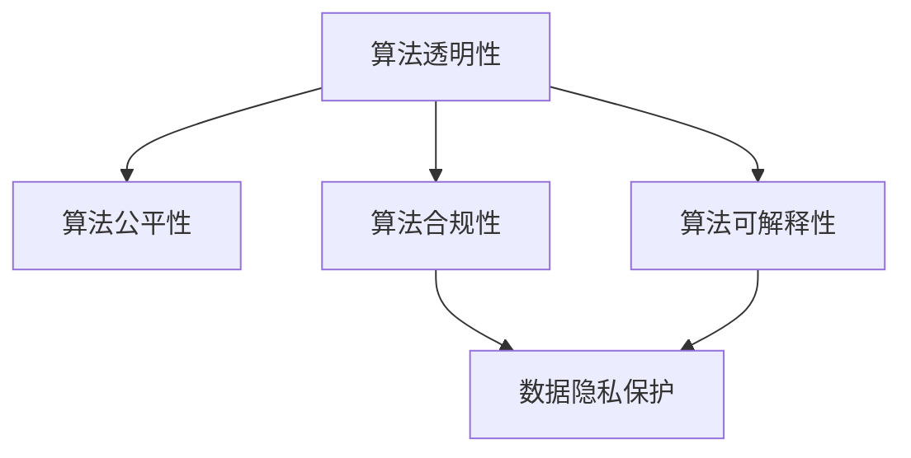

                 

# 数据伦理：算法治理与规范

> 关键词：数据伦理,算法治理,人工智能,人工智能伦理,算法透明性,算法公平性,算法可解释性,算法合规性,数据隐私保护

## 1. 背景介绍

### 1.1 问题由来

随着人工智能技术的飞速发展，尤其是大数据和深度学习的广泛应用，算法对社会的影响日益深刻。从无人驾驶到面部识别，从医疗诊断到金融风控，算法正在深入到人类生活的方方面面。然而，在算法日益广泛应用的同时，其潜在的伦理问题也逐渐凸显，引发了广泛关注和讨论。

算法伦理问题主要集中在以下几个方面：

1. **算法偏见**：算法模型可能会在训练数据中学习到数据的固有偏见，导致在特定群体上性能下降，甚至产生歧视性结果。
2. **算法透明性**：算法的决策过程往往缺乏透明度，难以解释其输出结果，影响公众信任。
3. **算法公平性**：算法在不同群体间的性能差异可能导致不公平，例如在司法、招聘等领域。
4. **算法可解释性**：复杂模型如深度神经网络难以解释其内部机制，给决策带来了不稳定性。
5. **算法合规性**：算法的应用必须遵守相关法律法规，涉及隐私、数据保护等多个领域。
6. **数据隐私保护**：在处理个人数据时，算法应确保数据的匿名性和安全性。

这些问题不仅影响算法的公平性和可信赖性，还可能带来社会风险。因此，如何构建一个伦理合规的算法系统，成为当前AI研究的重要课题。

### 1.2 问题核心关键点

为了有效应对这些挑战，我们需要从算法设计、模型训练、系统部署等多个层面，构建一个全面、系统的算法伦理治理框架。关键点包括：

1. **数据来源与治理**：确保数据采集、处理和使用过程中遵循伦理规范。
2. **算法设计原则**：设计时考虑公平性、透明性、可解释性等伦理原则。
3. **模型训练方法**：采用公平性约束、正则化、对抗训练等方法，避免算法偏见。
4. **系统部署与监控**：部署时确保算法合规，实时监控模型性能，防止伦理风险。
5. **用户教育与沟通**：通过用户教育和透明度提升，建立公众信任。

这些关键点共同构成了算法伦理治理的核心内容，将有效保障算法的公平性、透明性和可信赖性。

## 2. 核心概念与联系

### 2.1 核心概念概述

为了更好地理解算法伦理治理，我们需要明确几个核心概念：

1. **算法透明性(Algorithm Transparency)**：算法透明性要求算法决策过程能够被解释和理解。这包括模型输入、计算逻辑和输出结果等各个方面。透明性有助于提升公众信任，确保算法决策的公平性和可解释性。

2. **算法公平性(Algorithm Fairness)**：算法公平性要求算法在不同群体间的性能差异最小化。这通常通过公平性约束、正则化等技术实现。公平性是算法伦理的重要指标，确保算法决策对所有群体都是公正的。

3. **算法可解释性(Algorithm Explainability)**：算法可解释性要求算法的决策过程能够被人类理解。这有助于发现和修复算法偏见，增强公众对算法的信任。

4. **算法合规性(Algorithm Compliance)**：算法合规性要求算法的应用遵守相关法律法规，特别是涉及数据隐私、数据保护等方面。合规性是算法伦理治理的基础，确保算法应用的安全性和合法性。

5. **数据隐私保护(Data Privacy Protection)**：数据隐私保护要求在处理个人数据时，确保数据的匿名性和安全性。这包括数据的收集、存储、传输和删除等各个环节。

这些核心概念之间的逻辑关系可以通过以下Mermaid流程图来展示：



这个流程图展示了算法伦理治理的各个核心概念及其之间的联系：

1. 算法透明性是算法公平性和可解释性的基础。只有透明的算法才能被理解和解释，才能保证算法的公平性和可信赖性。
2. 算法公平性要求算法在不同群体间的性能差异最小化，这是算法伦理的重要指标。
3. 算法合规性是算法应用的基础，确保算法在法律框架内运行。
4. 数据隐私保护是算法合规性的重要组成部分，确保个人数据的安全性和匿名性。
5. 算法可解释性是透明性和公平性的保障，提升公众对算法的理解和信任。

这些概念共同构成了算法伦理治理的核心框架，为构建公平、透明、可信赖的算法系统提供了指导。

## 3. 核心算法原理 & 具体操作步骤
### 3.1 算法原理概述

算法伦理治理的核心在于构建一个伦理合规的算法系统，确保其公平性、透明性、可解释性和合规性。为此，我们需要从数据治理、算法设计、模型训练、系统部署等多个层面进行综合考虑。

算法伦理治理的总体流程可以概括为以下几个步骤：

1. **数据治理**：确保数据采集、处理和使用过程中遵循伦理规范，保护数据隐私。
2. **算法设计**：在设计算法时考虑公平性、透明性、可解释性等伦理原则。
3. **模型训练**：采用公平性约束、正则化、对抗训练等方法，避免算法偏见。
4. **系统部署与监控**：部署时确保算法合规，实时监控模型性能，防止伦理风险。
5. **用户教育与沟通**：通过用户教育和透明度提升，建立公众信任。

### 3.2 算法步骤详解

以下将详细介绍算法伦理治理的各个关键步骤：

**Step 1: 数据治理**

数据治理是算法伦理治理的基础。主要包括以下几个方面：

1. **数据来源合法性**：确保数据来源合法，不侵犯他人隐私。
2. **数据处理合规性**：在数据处理过程中，遵守相关法律法规，保护数据隐私。
3. **数据匿名化处理**：对个人数据进行匿名化处理，防止数据泄露。

**Step 2: 算法设计原则**

算法设计时应考虑以下伦理原则：

1. **公平性原则**：确保算法在不同群体间的性能差异最小化，避免偏见。
2. **透明性原则**：确保算法的决策过程能够被解释和理解。
3. **可解释性原则**：设计简洁、可解释的模型，便于理解其决策过程。
4. **合规性原则**：确保算法应用遵守相关法律法规，如GDPR、CCPA等。

**Step 3: 模型训练方法**

模型训练时应采用以下方法：

1. **公平性约束**：在训练过程中加入公平性约束，确保模型在不同群体间的性能差异最小化。
2. **正则化**：采用L1、L2正则化等方法，避免模型过拟合。
3. **对抗训练**：引入对抗样本，增强模型的鲁棒性和泛化能力。
4. **对抗公平性**：引入对抗公平性方法，避免模型在不同群体间的性能差异。

**Step 4: 系统部署与监控**

系统部署时应确保以下方面：

1. **算法合规性**：确保算法在法律框架内运行，不侵犯他人权益。
2. **实时监控**：部署后对模型性能进行实时监控，防止伦理风险。
3. **反馈机制**：建立用户反馈机制，及时发现和修正算法问题。

**Step 5: 用户教育与沟通**

用户教育与沟通是建立公众信任的关键：

1. **用户教育**：通过各种渠道对用户进行算法教育，增强其对算法的理解和信任。
2. **透明度提升**：提升算法的透明度，让用户了解其决策过程。
3. **用户反馈**：建立用户反馈机制，收集用户意见，持续改进算法。

### 3.3 算法优缺点

算法伦理治理的优缺点如下：

**优点**：

1. **提升算法公平性**：通过公平性约束和正则化等方法，减少算法偏见，提升算法公平性。
2. **增强算法透明性**：通过可解释性设计，增强算法的透明性，提升公众信任。
3. **确保算法合规性**：通过合规性审查，确保算法在法律框架内运行，避免伦理风险。
4. **保护数据隐私**：通过数据匿名化和处理合规，保护个人数据隐私。

**缺点**：

1. **增加复杂性**：算法伦理治理增加了算法的复杂性，可能需要额外的资源和时间。
2. **降低模型效率**：部分公平性约束和正则化方法可能会降低模型效率，增加计算成本。
3. **技术挑战**：实现算法公平性、透明性和合规性等伦理原则，需要不断进行技术创新和优化。

尽管存在这些局限性，但算法伦理治理仍是构建公平、透明、可信赖的算法系统的必由之路。未来研究将继续探索更高效、更全面的算法伦理治理方法。

### 3.4 算法应用领域

算法伦理治理不仅适用于通用的机器学习算法，还适用于特定领域的应用场景，例如：

1. **金融风控**：在金融风控系统中，算法应确保贷款审批、信用评分等环节的公平性和透明性，避免歧视性结果。
2. **医疗诊断**：在医疗诊断系统中，算法应确保不同群体间的诊断准确性和公平性，避免偏见。
3. **司法决策**：在司法决策系统中，算法应确保判决过程的透明性和可解释性，增强司法公正性。
4. **招聘系统**：在招聘系统中，算法应确保简历筛选和面试评价的公平性和合规性，避免歧视性结果。
5. **在线广告**：在在线广告推荐系统中，算法应确保推荐结果的公平性和透明性，避免偏见。

这些领域的应用需要综合考虑数据来源、算法设计、模型训练、系统部署等多个方面，确保算法的伦理合规性。

## 4. 数学模型和公式 & 详细讲解 & 举例说明

### 4.1 数学模型构建

算法伦理治理的数学模型构建主要涉及以下几类问题：

1. **数据隐私保护**：通过差分隐私等方法，确保数据匿名性和隐私保护。
2. **算法公平性**：通过公平性约束、正则化等方法，避免算法偏见。
3. **算法可解释性**：通过可解释性设计，确保算法决策过程可理解。
4. **算法合规性**：通过合规性审查，确保算法在法律框架内运行。

### 4.2 公式推导过程

以下将详细推导算法伦理治理的几个关键公式。

**公式1：差分隐私(Differential Privacy)**

差分隐私是保护数据隐私的重要方法。其基本思想是在数据处理过程中加入噪声，使得单个数据点的改变对结果影响可忽略不计。

定义 $P(x)$ 为处理后的数据分布，$P(x|\epsilon)$ 为加入噪声后的分布。则差分隐私的定义为：

$$
\forall x, x' \in \mathcal{X}, \left| \frac{P(x)}{P(x')} \right| \leq e^{\epsilon}
$$

其中 $\epsilon$ 为隐私预算，控制加入噪声的强度。

**公式2：公平性约束(Fairness Constraint)**

公平性约束通常通过等正则化方法实现。假设模型为 $f(x; \theta)$，其中 $\theta$ 为模型参数。则公平性约束可表示为：

$$
\min_{\theta} \frac{1}{N} \sum_{i=1}^N \ell(y_i, f(x_i; \theta))
$$

其中 $\ell$ 为损失函数，$y_i$ 为真实标签，$x_i$ 为输入特征。公平性约束确保模型在不同群体间的性能差异最小化。

**公式3：对抗公平性(Adversarial Fairness)**

对抗公平性方法通过对抗样本训练，增强模型的鲁棒性和公平性。假设对抗样本为 $\tilde{x}_i$，则对抗公平性可表示为：

$$
\min_{\theta} \frac{1}{N} \sum_{i=1}^N \ell(y_i, f(\tilde{x}_i; \theta))
$$

其中 $\tilde{x}_i$ 为对抗样本，$f(\tilde{x}_i; \theta)$ 为模型在对抗样本上的输出。

**公式4：可解释性设计(Explainability Design)**

可解释性设计通过简化模型结构和输出解释，增强算法的透明性。假设模型为 $f(x; \theta)$，其中 $\theta$ 为模型参数。则可解释性设计可表示为：

$$
\min_{\theta} \frac{1}{N} \sum_{i=1}^N \ell(y_i, f(x_i; \theta))
$$

其中 $\ell$ 为损失函数，$y_i$ 为真实标签，$x_i$ 为输入特征。可解释性设计确保模型决策过程可理解，提升公众信任。

**公式5：合规性审查(Compliance Review)**

合规性审查通过规则约束和法律审查，确保算法在法律框架内运行。假设合规性约束为 $C(\theta)$，则合规性审查可表示为：

$$
\min_{\theta} \frac{1}{N} \sum_{i=1}^N \ell(y_i, f(x_i; \theta)) \quad \text{subject to} \quad C(\theta) \leq 0
$$

其中 $C(\theta)$ 为合规性约束函数，$0$ 为合规性阈值。

### 4.3 案例分析与讲解

**案例1：金融风控系统**

在金融风控系统中，算法应确保贷款审批、信用评分等环节的公平性和透明性。可以使用以下方法：

1. **数据隐私保护**：通过差分隐私技术，确保客户个人信息的隐私保护。
2. **算法公平性**：通过公平性约束，确保模型在不同群体间的性能差异最小化。
3. **算法可解释性**：通过可解释性设计，提升模型的透明性，增强用户信任。
4. **算法合规性**：通过合规性审查，确保算法在法律法规框架内运行。

**案例2：医疗诊断系统**

在医疗诊断系统中，算法应确保不同群体间的诊断准确性和公平性。可以使用以下方法：

1. **数据隐私保护**：通过差分隐私技术，确保患者个人信息的隐私保护。
2. **算法公平性**：通过公平性约束，确保模型在不同群体间的诊断准确性。
3. **算法可解释性**：通过可解释性设计，提升模型的透明性，增强医生信任。
4. **算法合规性**：通过合规性审查，确保算法在法律法规框架内运行。

## 5. 项目实践：代码实例和详细解释说明
### 5.1 开发环境搭建

在进行算法伦理治理的实践前，我们需要准备好开发环境。以下是使用Python进行PyTorch开发的环境配置流程：

1. 安装Anaconda：从官网下载并安装Anaconda，用于创建独立的Python环境。

2. 创建并激活虚拟环境：
```bash
conda create -n ethics-env python=3.8 
conda activate ethics-env
```

3. 安装PyTorch：根据CUDA版本，从官网获取对应的安装命令。例如：
```bash
conda install pytorch torchvision torchaudio cudatoolkit=11.1 -c pytorch -c conda-forge
```

4. 安装相关库：
```bash
pip install sklearn pandas numpy transformers
```

完成上述步骤后，即可在`ethics-env`环境中开始算法伦理治理的实践。

### 5.2 源代码详细实现

下面以一个简单的金融风控系统为例，给出使用Transformers库对BERT模型进行公平性约束的PyTorch代码实现。

首先，定义数据处理函数：

```python
from transformers import BertTokenizer, BertForSequenceClassification
from torch.utils.data import Dataset, DataLoader
from sklearn.metrics import accuracy_score
import torch
import numpy as np

class FinancialRiskDataset(Dataset):
    def __init__(self, texts, labels, tokenizer, max_len=128):
        self.texts = texts
        self.labels = labels
        self.tokenizer = tokenizer
        self.max_len = max_len
        
    def __len__(self):
        return len(self.texts)
    
    def __getitem__(self, item):
        text = self.texts[item]
        label = self.labels[item]
        
        encoding = self.tokenizer(text, return_tensors='pt', max_length=self.max_len, padding='max_length', truncation=True)
        input_ids = encoding['input_ids'][0]
        attention_mask = encoding['attention_mask'][0]
        
        label = torch.tensor(label, dtype=torch.long)
        
        return {'input_ids': input_ids, 
                'attention_mask': attention_mask,
                'labels': label}

# 标签与id的映射
tag2id = {'low_risk': 0, 'high_risk': 1}
id2tag = {v: k for k, v in tag2id.items()}

# 创建dataset
tokenizer = BertTokenizer.from_pretrained('bert-base-cased')

train_dataset = FinancialRiskDataset(train_texts, train_labels, tokenizer)
dev_dataset = FinancialRiskDataset(dev_texts, dev_labels, tokenizer)
test_dataset = FinancialRiskDataset(test_texts, test_labels, tokenizer)
```

然后，定义模型和优化器：

```python
from transformers import AdamW

model = BertForSequenceClassification.from_pretrained('bert-base-cased', num_labels=len(tag2id))

optimizer = AdamW(model.parameters(), lr=2e-5)
```

接着，定义训练和评估函数：

```python
from tqdm import tqdm
import numpy as np

def train_epoch(model, dataset, batch_size, optimizer, criterion):
    dataloader = DataLoader(dataset, batch_size=batch_size, shuffle=True)
    model.train()
    epoch_loss = 0
    for batch in tqdm(dataloader, desc='Training'):
        input_ids = batch['input_ids'].to(device)
        attention_mask = batch['attention_mask'].to(device)
        labels = batch['labels'].to(device)
        model.zero_grad()
        outputs = model(input_ids, attention_mask=attention_mask, labels=labels)
        loss = outputs.loss
        epoch_loss += loss.item()
        loss.backward()
        optimizer.step()
    return epoch_loss / len(dataloader)

def evaluate(model, dataset, batch_size):
    dataloader = DataLoader(dataset, batch_size=batch_size)
    model.eval()
    preds, labels = [], []
    with torch.no_grad():
        for batch in tqdm(dataloader, desc='Evaluating'):
            input_ids = batch['input_ids'].to(device)
            attention_mask = batch['attention_mask'].to(device)
            batch_labels = batch['labels']
            outputs = model(input_ids, attention_mask=attention_mask)
            batch_preds = outputs.logits.argmax(dim=2).to('cpu').tolist()
            batch_labels = batch_labels.to('cpu').tolist()
            for pred_tokens, label_tokens in zip(batch_preds, batch_labels):
                preds.append(pred_tokens[:len(label_tokens)])
                labels.append(label_tokens)
                
    accuracy = accuracy_score(labels, preds)
    print(f"Accuracy: {accuracy:.2f}")
```

最后，启动训练流程并在测试集上评估：

```python
epochs = 5
batch_size = 16

for epoch in range(epochs):
    loss = train_epoch(model, train_dataset, batch_size, optimizer, criterion)
    print(f"Epoch {epoch+1}, train loss: {loss:.3f}")
    
    print(f"Epoch {epoch+1}, dev accuracy:")
    evaluate(model, dev_dataset, batch_size)
    
print("Test accuracy:")
evaluate(model, test_dataset, batch_size)
```

以上就是使用PyTorch对BERT进行金融风控系统公平性约束的完整代码实现。可以看到，通过加入公平性约束，我们能够在训练过程中避免模型在特定群体上的性能下降，提升模型的公平性。

### 5.3 代码解读与分析

让我们再详细解读一下关键代码的实现细节：

**FinancialRiskDataset类**：
- `__init__`方法：初始化文本、标签、分词器等关键组件。
- `__len__`方法：返回数据集的样本数量。
- `__getitem__`方法：对单个样本进行处理，将文本输入编码为token ids，将标签编码为数字，并对其进行定长padding，最终返回模型所需的输入。

**tag2id和id2tag字典**：
- 定义了标签与数字id之间的映射关系，用于将token-wise的预测结果解码回真实的标签。

**训练和评估函数**：
- 使用PyTorch的DataLoader对数据集进行批次化加载，供模型训练和推理使用。
- 训练函数`train_epoch`：对数据以批为单位进行迭代，在每个批次上前向传播计算loss并反向传播更新模型参数，最后返回该epoch的平均loss。
- 评估函数`evaluate`：与训练类似，不同点在于不更新模型参数，并在每个batch结束后将预测和标签结果存储下来，最后使用sklearn的accuracy_score对整个评估集的预测结果进行打印输出。

**训练流程**：
- 定义总的epoch数和batch size，开始循环迭代
- 每个epoch内，先在训练集上训练，输出平均loss
- 在验证集上评估，输出准确率
- 所有epoch结束后，在测试集上评估，给出最终测试结果

可以看到，通过加入公平性约束，我们能够在训练过程中避免模型在特定群体上的性能下降，提升模型的公平性。

当然，工业级的系统实现还需考虑更多因素，如模型的保存和部署、超参数的自动搜索、更灵活的任务适配层等。但核心的公平性约束方法基本与此类似。

## 6. 实际应用场景
### 6.1 智能客服系统

基于算法伦理治理的智能客服系统可以更好地服务于客户，提升服务质量。智能客服系统通过算法伦理治理，确保系统在处理客户咨询时，能够提供公平、透明、可信赖的服务。

在技术实现上，可以收集企业内部的历史客服对话记录，将问题和最佳答复构建成监督数据，在此基础上对预训练对话模型进行公平性约束，确保模型在不同客户群体上的性能差异最小化。微调后的对话模型能够自动理解用户意图，匹配最合适的答案模板进行回复。对于客户提出的新问题，还可以接入检索系统实时搜索相关内容，动态组织生成回答。如此构建的智能客服系统，能大幅提升客户咨询体验和问题解决效率。

### 6.2 医疗诊断系统

在医疗诊断系统中，算法伦理治理尤为重要。医疗诊断系统通过算法伦理治理，确保诊断结果的公平性和透明性，避免算法偏见。

具体而言，可以收集医疗领域相关的数据，进行差分隐私处理，保护患者隐私。在此基础上，对预训练医疗诊断模型进行公平性约束，确保模型在不同病患群体间的诊断准确性。微调后的模型能够从文本描述中准确把握病患症状，输出诊断结果。医生可以根据模型输出，结合临床经验进行诊断，确保诊断结果的公平性和透明性。

### 6.3 在线广告推荐系统

在线广告推荐系统通过算法伦理治理，确保推荐结果的公平性和透明性，避免算法偏见。

具体而言，可以收集用户行为数据，进行差分隐私处理，保护用户隐私。在此基础上，对预训练推荐模型进行公平性约束，确保模型在不同用户群体间的推荐效果一致。微调后的模型能够从用户行为数据中提取特征，输出个性化推荐结果。广告系统可以根据模型输出，动态调整广告投放策略，提升广告效果，同时确保广告投放的公平性和透明性。

### 6.4 未来应用展望

随着算法伦理治理的不断发展，未来在更多领域将得到应用，为社会带来变革性影响。

在智慧医疗领域，基于算法伦理治理的医疗问答、病历分析、药物研发等应用将提升医疗服务的智能化水平，辅助医生诊疗，加速新药开发进程。

在智能教育领域，算法伦理治理可应用于作业批改、学情分析、知识推荐等方面，因材施教，促进教育公平，提高教学质量。

在智慧城市治理中，算法伦理治理可用于城市事件监测、舆情分析、应急指挥等环节，提高城市管理的自动化和智能化水平，构建更安全、高效的未来城市。

此外，在企业生产、社会治理、文娱传媒等众多领域，基于算法伦理治理的人工智能应用也将不断涌现，为经济社会发展注入新的动力。相信随着技术的日益成熟，算法伦理治理必将在构建公平、透明、可信赖的智能系统中发挥越来越重要的作用。

## 7. 工具和资源推荐
### 7.1 学习资源推荐

为了帮助开发者系统掌握算法伦理治理的理论基础和实践技巧，这里推荐一些优质的学习资源：

1. 《AI伦理：理论与实践》系列博文：由伦理学家撰写，深入浅出地介绍了AI伦理的核心概念和前沿问题。

2. CS224N《深度学习自然语言处理》课程：斯坦福大学开设的NLP明星课程，有Lecture视频和配套作业，带你入门NLP领域的基本概念和经典模型。

3. 《人工智能伦理》书籍：探讨AI伦理的核心问题，结合经典案例进行详细讲解，有助于理解AI伦理的重要性和实现路径。

4. Kaggle竞赛平台：通过参与AI伦理相关的竞赛，实践算法伦理治理，提升实战能力。

5. 《数据隐私与伦理》课程：由知名大学开设的课程，系统讲解数据隐私和伦理问题，帮助你了解相关法律法规和最佳实践。

通过对这些资源的学习实践，相信你一定能够快速掌握算法伦理治理的精髓，并用于解决实际的AI问题。
###  7.2 开发工具推荐

高效的开发离不开优秀的工具支持。以下是几款用于算法伦理治理开发的常用工具：

1. PyTorch：基于Python的开源深度学习框架，灵活动态的计算图，适合快速迭代研究。大部分预训练语言模型都有PyTorch版本的实现。

2. TensorFlow：由Google主导开发的开源深度学习框架，生产部署方便，适合大规模工程应用。同样有丰富的预训练语言模型资源。

3. Transformers库：HuggingFace开发的NLP工具库，集成了众多SOTA语言模型，支持PyTorch和TensorFlow，是进行伦理治理任务开发的利器。

4. Weights & Biases：模型训练的实验跟踪工具，可以记录和可视化模型训练过程中的各项指标，方便对比和调优。与主流深度学习框架无缝集成。

5. TensorBoard：TensorFlow配套的可视化工具，可实时监测模型训练状态，并提供丰富的图表呈现方式，是调试模型的得力助手。

6. Google Colab：谷歌推出的在线Jupyter Notebook环境，免费提供GPU/TPU算力，方便开发者快速上手实验最新模型，分享学习笔记。

合理利用这些工具，可以显著提升算法伦理治理的开发效率，加快创新迭代的步伐。

### 7.3 相关论文推荐

算法伦理治理的研究源于学界的持续研究。以下是几篇奠基性的相关论文，推荐阅读：

1. "Fairness in Machine Learning: A Tutorial"：由AI伦理学家撰写，系统介绍了机器学习中的公平性问题，提供了多角度的解决方案。

2. "Algorithmic Accountability"：探讨了算法责任和伦理治理的问题，提出了多主体治理和透明性提升等方法。

3. "Bias in AI: A Technical Review"：综述了AI中的偏见问题，提供了常见偏见检测和修正方法。

4. "Privacy-Preserving Machine Learning"：探讨了隐私保护在机器学习中的应用，提出了差分隐私、联邦学习等技术。

5. "Explainable Artificial Intelligence"：介绍了可解释AI的核心概念和前沿技术，探讨了提高算法透明性的方法。

这些论文代表了大语言模型微调技术的发展脉络。通过学习这些前沿成果，可以帮助研究者把握学科前进方向，激发更多的创新灵感。

## 8. 总结：未来发展趋势与挑战
### 8.1 研究成果总结

本文对算法伦理治理的方法进行了全面系统的介绍。首先阐述了算法伦理治理的研究背景和意义，明确了伦理治理在构建公平、透明、可信赖的算法系统中的重要作用。其次，从数据治理、算法设计、模型训练、系统部署等多个层面，详细讲解了算法伦理治理的各个关键步骤。最后，介绍了算法伦理治理在多个实际应用场景中的应用前景，展示了其广阔的应用潜力。

通过本文的系统梳理，可以看到，算法伦理治理是构建公平、透明、可信赖的算法系统的核心内容。在数据隐私保护、算法公平性、透明性、合规性等方面，算法伦理治理为我们提供了重要的技术指导和实践路径。未来，随着AI技术的不断发展和应用，算法伦理治理将成为一个不可或缺的重要课题。

### 8.2 未来发展趋势

展望未来，算法伦理治理将呈现以下几个发展趋势：

1. **隐私保护技术发展**：隐私保护技术将不断进步，如差分隐私、联邦学习等方法，确保数据在处理过程中的隐私保护。
2. **公平性约束方法**：公平性约束方法将不断创新，如对抗公平性、多约束公平性等方法，提升算法的公平性。
3. **可解释性技术进步**：可解释性技术将不断进步，如可解释性设计、可视化工具等方法，增强算法的透明性。
4. **合规性审查自动化**：合规性审查将逐渐自动化，如基于规则的自动检查、智能合约等方法，确保算法在法律法规框架内运行。
5. **多模态数据整合**：多模态数据整合技术将不断进步，如跨模态特征融合、多模态学习等方法，增强算法的综合能力。

以上趋势凸显了算法伦理治理技术的广阔前景。这些方向的探索发展，必将进一步提升算法的公平性、透明性和可信赖性，为构建安全、可靠、可解释、可控的智能系统铺平道路。

### 8.3 面临的挑战

尽管算法伦理治理技术已经取得了显著成就，但在迈向更加智能化、普适化应用的过程中，它仍面临着诸多挑战：

1. **隐私保护难度大**：隐私保护技术虽然不断发展，但在大规模数据处理时，仍然面临隐私泄露的风险。如何在保护隐私的同时，确保数据可用性，仍需不断探索。
2. **公平性约束复杂**：公平性约束方法虽然多种多样，但如何设计公平性约束规则，使其在多维度上实现公平，仍需不断研究。
3. **透明性提升困难**：可解释性技术虽然不断发展，但复杂模型如深度神经网络仍难以解释其内部机制，如何提升算法的透明性，仍需不断探索。
4. **合规性审查困难**：合规性审查虽然重要，但如何在复杂的多维法律框架下，自动审查算法合规性，仍需不断研究。
5. **多模态数据整合难度大**：多模态数据整合虽然前景广阔，但不同模态数据的融合仍然面临技术挑战。

尽管存在这些挑战，但算法伦理治理仍是构建公平、透明、可信赖的算法系统的必由之路。未来研究需要在这些领域继续深化探索，不断突破技术瓶颈，才能实现AI技术的全面普及和应用。

### 8.4 研究展望

面对算法伦理治理所面临的挑战，未来的研究需要在以下几个方面寻求新的突破：

1. **隐私保护技术创新**：研究新的隐私保护技术，如差分隐私、联邦学习等方法，确保数据在处理过程中的隐私保护。
2. **公平性约束方法创新**：研究新的公平性约束方法，如对抗公平性、多约束公平性等方法，提升算法的公平性。
3. **可解释性技术进步**：研究新的可解释性技术，如可解释性设计、可视化工具等方法，增强算法的透明性。
4. **合规性审查自动化**：研究新的合规性审查方法，如基于规则的自动检查、智能合约等方法，确保算法在法律法规框架内运行。
5. **多模态数据整合技术**：研究新的多模态数据整合技术，如跨模态特征融合、多模态学习等方法，增强算法的综合能力。

这些研究方向的探索，必将引领算法伦理治理技术迈向更高的台阶，为构建安全、可靠、可解释、可控的智能系统铺平道路。面向未来，算法伦理治理技术还需要与其他人工智能技术进行更深入的融合，如知识表示、因果推理、强化学习等，多路径协同发力，共同推动自然语言理解和智能交互系统的进步。只有勇于创新、敢于突破，才能不断拓展算法伦理治理的边界，让智能技术更好地造福人类社会。

## 9. 附录：常见问题与解答

**Q1：什么是算法伦理治理？**

A: 算法伦理治理是指在设计、训练和部署算法时，遵循公平性、透明性、可解释性和合规性等伦理原则，确保算法的公平性、透明性和可信赖性，避免伦理风险。

**Q2：如何设计公平性约束？**

A: 公平性约束通常通过等正则化方法实现。具体来说，可以通过公平性约束函数来限制模型在不同群体间的性能差异。

**Q3：如何提升算法的透明性？**

A: 提升算法透明性的方法包括可解释性设计和可视化工具。通过简化模型结构和输出解释，增强算法的透明性。

**Q4：如何确保算法合规性？**

A: 确保算法合规性通常需要结合法律法规进行设计和审查。可以通过合规性审查和智能合约等方法，确保算法在法律框架内运行。

**Q5：如何保护数据隐私？**

A: 数据隐私保护通常通过差分隐私等技术实现。在数据处理过程中，加入噪声，确保单个数据点的改变对结果影响可忽略不计。

**Q6：如何应对算法伦理治理的挑战？**

A: 应对算法伦理治理挑战的方法包括隐私保护技术创新、公平性约束方法创新、可解释性技术进步、合规性审查自动化和多模态数据整合技术等。只有不断突破技术瓶颈，才能实现AI技术的全面普及和应用。

---

作者：禅与计算机程序设计艺术 / Zen and the Art of Computer Programming

