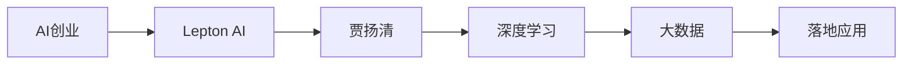

                 

# 新一代AI创业：贾扬清的故事，Lepton AI的前景与挑战

## 1. 背景介绍

### 1.1 问题由来
在当今世界，人工智能（AI）已经成为驱动社会进步、改变经济格局的关键力量。然而，尽管AI技术取得了显著进展，其广泛应用仍面临诸多挑战，特别是在商业化和落地应用方面。为了解决这些问题，越来越多的人工智能创业者在寻找新的创新点，寻找能够将AI技术与实际应用需求结合的解决方案。

### 1.2 问题核心关键点
- 如何降低AI技术商业化的门槛？
- 如何将AI技术成功应用于多个行业和场景？
- 如何通过创新来引领AI技术的发展趋势？
- 创业团队如何构建并维持长期的竞争优势？
- 如何评估AI创业项目的潜在价值和社会影响？

### 1.3 问题研究意义
了解和探索新一代AI创业的成功经验和挑战，对于那些有意投身于AI领域的创业者来说，具有重要的指导意义。本文将重点探讨贾扬清和Lepton AI的故事，分析Lepton AI在前景与挑战中的表现，为有意进入AI领域的创业者提供参考和借鉴。

## 2. 核心概念与联系

### 2.1 核心概念概述

为了深入理解新一代AI创业的发展脉络，首先需要明确几个核心概念：

- **AI创业**：指通过技术创新和商业模式创新，将AI技术应用于实际商业场景，创造经济价值的过程。

- **Lepton AI**：一家以深度学习和大数据为核心技术，致力于AI落地应用的公司，由贾扬清及其团队创立。

- **贾扬清**：深度学习领域的知名专家，微软亚洲研究院前院长，清华大学计算机系教授，中国人工智能学会会长。

- **创业团队**：由具备技术背景和商业智慧的成员组成，致力于将AI技术商业化的专业团队。

这些概念之间的关系可以用以下Mermaid流程图来展示：



这个流程图展示了AI创业的核心过程，从技术到应用，再到创业团队的综合作用。

## 3. 核心算法原理 & 具体操作步骤

### 3.1 算法原理概述

AI创业的核心在于将先进的技术转化为实际应用的商业模式。这一过程通常包括以下步骤：

1. **市场调研**：了解目标市场的实际需求和痛点。
2. **技术开发**：开发具备竞争力的AI技术，形成产品原型。
3. **商业模式设计**：设计可行的商业模式，如订阅、按需服务、广告等。
4. **市场推广**：通过营销策略和渠道，推广产品和服务。
5. **用户反馈和迭代**：收集用户反馈，不断迭代和优化产品。

### 3.2 算法步骤详解

#### 3.2.1 市场调研

Lepton AI在创立之初，进行了一系列市场调研，重点关注了医疗、金融、零售等多个领域的AI应用需求。通过访谈、问卷调查等方式，收集了大量用户和行业专家的反馈，了解了用户的痛点和他们对AI技术的需求。

#### 3.2.2 技术开发

基于市场调研结果，Lepton AI的研发团队聚焦于深度学习和数据分析技术，开发了一系列AI产品，如图像识别、语音识别、自然语言处理等。这些技术构成了Lepton AI的业务基础。

#### 3.2.3 商业模式设计

Lepton AI的商业模式设计遵循SaaS（软件即服务）模式，通过订阅服务和API接口的方式，向客户收取费用。此外，Lepton AI还推出了一系列灵活的定价方案，以满足不同规模客户的需求。

#### 3.2.4 市场推广

Lepton AI通过多渠道营销策略推广其产品和服务，包括线上广告、行业会议、合作伙伴推广等。此外，Lepton AI还建立了强大的技术社区，吸引大量开发者和企业用户，通过社区效应扩大市场影响力。

#### 3.2.5 用户反馈和迭代

Lepton AI通过用户反馈系统，不断收集用户使用过程中的问题和建议，快速迭代产品和服务。这种敏捷的迭代过程，使得Lepton AI能够迅速适应市场变化，持续提升用户体验。

### 3.3 算法优缺点

#### 3.3.1 优点

1. **技术领先**：Lepton AI在深度学习和数据分析领域具备领先技术优势，能够提供高质量的AI产品。
2. **灵活的商业模式**：通过SaaS模式和API接口，能够快速响应市场需求，提供定制化的解决方案。
3. **强大的社区支持**：通过技术社区和开发者平台，吸引大量开发者和企业用户，形成强大的生态系统。
4. **敏捷的迭代过程**：快速收集用户反馈，不断优化产品和服务，保持市场竞争力。

#### 3.3.2 缺点

1. **技术门槛高**：深度学习和大数据技术复杂度高，需要具备高水平的技术团队。
2. **市场推广成本高**：初创公司资源有限，市场推广和品牌建设需要大量投入。
3. **产品需求多样**：不同行业和场景对AI需求各异，需要不断调整产品策略和研发方向。
4. **用户教育成本高**：AI技术的普及和应用需要用户教育，初期市场接受度可能较低。

### 3.4 算法应用领域

Lepton AI的技术和产品已经应用于医疗、金融、零售、制造等多个行业，取得了显著的商业成功和社会效益。例如：

- **医疗行业**：Lepton AI开发了医学影像分析、疾病预测和诊断支持等应用，提升了医疗服务质量和效率。
- **金融行业**：Lepton AI提供了风险管理、信用评估和客户服务自动化解决方案，帮助金融机构降低风险和提升客户体验。
- **零售行业**：Lepton AI利用AI技术优化供应链管理、库存控制和客户推荐系统，提升了零售企业的运营效率和客户满意度。
- **制造行业**：Lepton AI通过智能检测和预测性维护技术，提高了制造业的生产效率和设备可靠性。

## 4. 数学模型和公式 & 详细讲解 & 举例说明

### 4.1 数学模型构建

Lepton AI在AI创业的过程中，应用了多种数学模型，如线性回归、逻辑回归、深度神经网络等。以深度神经网络模型为例，其基本结构可以表示为：

$$
\begin{aligned}
z &= W_h x + b_h \\
a &= \sigma(z) \\
z_{out} &= W_{out}a + b_{out} \\
\hat{y} &= softmax(z_{out})
\end{aligned}
$$

其中，$x$ 表示输入数据，$W_h$ 和 $b_h$ 表示隐藏层参数，$\sigma$ 表示激活函数，$W_{out}$ 和 $b_{out}$ 表示输出层参数，$\hat{y}$ 表示模型预测结果。

### 4.2 公式推导过程

以深度神经网络模型的损失函数为例，常用的损失函数包括交叉熵损失函数和均方误差损失函数。以交叉熵损失函数为例，其推导过程如下：

$$
L = -\frac{1}{N}\sum_{i=1}^N \sum_{j=1}^C y_{i,j} \log(\hat{y}_{i,j})
$$

其中，$N$ 表示样本数量，$C$ 表示类别数，$y_{i,j}$ 表示真实标签，$\hat{y}_{i,j}$ 表示模型预测结果。

### 4.3 案例分析与讲解

以Lepton AI的医学影像分析为例，使用卷积神经网络（CNN）模型进行疾病预测。该模型在大量医学影像数据上进行预训练，并在特定病种的数据集上进行微调。通过不断优化模型参数和损失函数，Lepton AI的医学影像分析系统能够实现高精度的疾病预测和诊断支持。

## 5. 项目实践：代码实例和详细解释说明

### 5.1 开发环境搭建

Lepton AI的开发环境主要包括Python、PyTorch、TensorFlow等深度学习框架，以及Git、Jira等项目管理工具。以下是具体配置步骤：

1. **安装Python**：从Python官网下载最新版本的Python安装包，安装到系统环境。
2. **安装PyTorch**：使用pip安装PyTorch，例如 `pip install torch torchvision torchaudio`。
3. **安装TensorFlow**：使用pip安装TensorFlow，例如 `pip install tensorflow`。
4. **安装Git和Jira**：安装Git命令行工具，并配置Git仓库。安装Jira项目管理工具，并创建项目和任务。

### 5.2 源代码详细实现

以下是使用Python和PyTorch实现深度神经网络模型的示例代码：

```python
import torch
import torch.nn as nn
import torch.optim as optim

class Net(nn.Module):
    def __init__(self):
        super(Net, self).__init__()
        self.fc1 = nn.Linear(784, 256)
        self.fc2 = nn.Linear(256, 10)

    def forward(self, x):
        x = x.view(-1, 784)
        x = nn.functional.relu(self.fc1(x))
        x = self.fc2(x)
        return x

# 加载数据集
train_set = ...
test_set = ...

# 定义模型、损失函数和优化器
model = Net()
criterion = nn.CrossEntropyLoss()
optimizer = optim.Adam(model.parameters(), lr=0.001)

# 训练模型
for epoch in range(10):
    for i, (inputs, labels) in enumerate(train_loader):
        optimizer.zero_grad()
        outputs = model(inputs)
        loss = criterion(outputs, labels)
        loss.backward()
        optimizer.step()

# 评估模型
test_loss = 0
correct = 0
with torch.no_grad():
    for inputs, labels in test_loader:
        outputs = model(inputs)
        test_loss += criterion(outputs, labels).item()
        predicted = torch.argmax(outputs, dim=1)
        correct += (predicted == labels).sum().item()

print('Test Loss: {:.4f}, Accuracy: {}/{} ({:.0f}%)'.format(
    test_loss / len(test_loader),
    correct, 
    len(test_loader),
    100. * correct / len(test_loader)))
```

### 5.3 代码解读与分析

这段代码实现了一个简单的深度神经网络模型，用于手写数字识别。以下是关键代码的解读：

- **定义模型**：定义了一个包含两个全连接层的神经网络，其中第一层包含256个神经元，第二层包含10个神经元（对应10个数字类别）。
- **加载数据集**：使用PyTorch的数据集模块加载训练集和测试集。
- **定义模型、损失函数和优化器**：定义了模型、交叉熵损失函数和Adam优化器。
- **训练模型**：在每个epoch内，对训练集进行前向传播和反向传播，更新模型参数。
- **评估模型**：在测试集上计算模型损失和准确率，输出评估结果。

## 6. 实际应用场景

### 6.1 医疗行业

Lepton AI在医疗行业的应用场景主要包括医学影像分析和疾病预测。以医学影像分析为例，Lepton AI的模型能够自动检测和识别影像中的病变区域，提供准确的诊断支持。此外，Lepton AI的疾病预测模型基于患者的历史数据，能够提前预测疾病风险，帮助医生进行预防和干预。

### 6.2 金融行业

Lepton AI在金融行业的应用场景主要包括信用评估、风险管理和客户服务自动化。通过深度学习和数据分析技术，Lepton AI能够准确评估客户的信用风险，优化信贷决策。同时，Lepton AI的客户服务自动化系统能够提供智能客服和智能投顾服务，提升客户体验和满意度。

### 6.3 零售行业

Lepton AI在零售行业的应用场景主要包括客户推荐、库存管理和供应链优化。Lepton AI的客户推荐系统能够基于用户行为和历史数据，推荐个性化的商品，提升客户购买意愿。同时，Lepton AI的库存管理系统能够优化库存水平，降低运营成本。

### 6.4 未来应用展望

Lepton AI的未来应用展望主要包括以下几个方面：

1. **多模态AI**：将视觉、语音、文本等多种模态的数据融合，提升AI系统的全面性和鲁棒性。
2. **自适应AI**：通过在线学习和自适应算法，使AI系统能够不断学习和适应用户需求和市场变化。
3. **AI伦理和安全性**：确保AI系统的输出符合伦理规范，保护用户隐私和安全。
4. **AI教育普及**：通过AI教育平台和在线课程，普及AI知识，提升公众对AI技术的理解和应用能力。

## 7. 工具和资源推荐

### 7.1 学习资源推荐

为了帮助AI创业者掌握相关知识和技能，推荐以下学习资源：

1. **机器学习课程**：Coursera、Udacity等平台提供的机器学习和深度学习课程，如Andrew Ng的《Machine Learning》。
2. **数据科学工具**：Python、R、SQL等数据科学工具，以及数据可视化工具如Tableau、Power BI。
3. **开源项目**：GitHub上的深度学习开源项目，如TensorFlow、PyTorch等，可以通过学习和参与项目提升技术能力。

### 7.2 开发工具推荐

以下是几款用于AI创业开发的常用工具：

1. **Git**：版本控制系统，支持多人协作开发。
2. **Jira**：项目管理工具，用于任务分配、进度跟踪和项目协作。
3. **PyTorch**：深度学习框架，支持动态图和静态图，易于调试和优化。
4. **TensorFlow**：深度学习框架，支持分布式计算和自动微分。
5. **Keras**：高层次深度学习框架，易于使用和扩展。

### 7.3 相关论文推荐

以下是几篇具有代表性的相关论文，推荐阅读：

1. **《ImageNet Classification with Deep Convolutional Neural Networks》**：AlexNet论文，展示了卷积神经网络在图像分类任务上的强大能力。
2. **《Deep Residual Learning for Image Recognition》**：ResNet论文，提出了残差连接结构，提升了深度神经网络的训练效率和性能。
3. **《Attention Is All You Need》**：Transformer论文，提出了Transformer结构，实现了自然语言处理的突破。

## 8. 总结：未来发展趋势与挑战

### 8.1 总结

本文系统介绍了Lepton AI和贾扬清在AI创业中的成功经验，分析了Lepton AI在前景与挑战中的表现。通过对其核心概念和操作流程的深入分析，为有意投身AI领域的创业者提供了宝贵的参考和借鉴。

### 8.2 未来发展趋势

Lepton AI和贾扬清的成功经验展示了AI创业的巨大潜力和发展趋势：

1. **技术创新**：AI技术不断进步，新的算法和模型层出不穷，为AI创业提供了更多可能性。
2. **市场应用**：AI技术在各行业的广泛应用，为AI创业带来了巨大的市场需求。
3. **数据驱动**：大数据和数据挖掘技术的发展，为AI创业提供了丰富的数据资源。
4. **跨界融合**：AI技术与其他行业的深度融合，创造了新的商业机会。
5. **商业化加速**：AI技术的商业化加速，为创业公司提供了更广阔的市场空间。

### 8.3 面临的挑战

尽管AI创业具有广阔前景，但仍面临诸多挑战：

1. **技术门槛高**：AI技术复杂度高，需要具备高水平的技术团队和专业技能。
2. **市场竞争激烈**：AI行业竞争激烈，新进入者面临众多对手。
3. **商业模式不成熟**：AI创业需要找到合理的商业模式，实现商业化。
4. **数据安全和隐私**：AI系统需要保护用户数据安全和隐私，避免数据泄露和滥用。
5. **法律法规约束**：AI技术应用需要遵守法律法规，避免侵犯用户权益。

### 8.4 研究展望

未来AI创业的研究方向主要集中在以下几个方面：

1. **技术突破**：继续探索新技术和新算法，提升AI系统的性能和效率。
2. **商业化探索**：研究有效的商业模式和商业策略，实现AI技术的商业化。
3. **跨界融合**：推动AI技术与更多行业和领域的融合，创造新的应用场景和价值。
4. **伦理和安全性**：研究AI系统的伦理规范和安全机制，确保AI技术的健康发展。
5. **教育普及**：通过AI教育平台和在线课程，普及AI知识，提升公众对AI技术的理解和应用能力。

## 9. 附录：常见问题与解答

**Q1：AI创业的核心是什么？**

A: AI创业的核心在于将先进的技术转化为实际应用的商业模式。这个过程需要深度理解市场需求，开发具备竞争力的AI技术，设计可行的商业模式，推广产品和服务，持续优化用户体验。

**Q2：如何评估AI创业项目的潜在价值？**

A: 评估AI创业项目的潜在价值需要考虑多个方面，包括市场需求、技术创新、商业模式、团队背景、市场竞争力等。可以进行市场调研和用户测试，收集数据和反馈，综合评估项目的可行性。

**Q3：AI创业需要哪些关键资源？**

A: AI创业需要具备技术、市场、资金、人才等多方面资源。需要组建具备技术背景和商业智慧的团队，积累相关技术和市场资源，筹集足够的资金支持，打造具有竞争力的产品和服务。

**Q4：AI创业面临的主要挑战是什么？**

A: AI创业面临的主要挑战包括技术门槛高、市场竞争激烈、商业模式不成熟、数据安全和隐私、法律法规约束等。需要通过不断优化技术和商业模式，提升市场竞争力，同时保护用户数据安全和隐私，遵守法律法规。

**Q5：AI创业如何保持持续创新？**

A: AI创业保持持续创新需要持续关注行业动态和技术进展，组建强大的研发团队，进行技术积累和创新，积极参与行业交流和合作，不断优化产品和商业模式，提升市场竞争力。

---

作者：禅与计算机程序设计艺术 / Zen and the Art of Computer Programming

