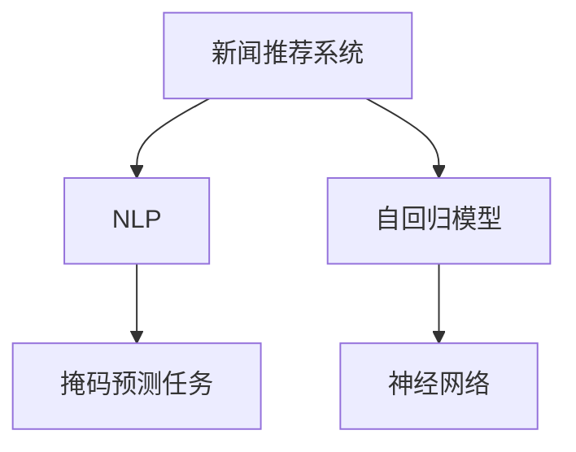

                 

# 新闻推荐: 填空式掩码预测任务

> 关键词：新闻推荐, 填空式掩码, 预测任务, 自回归模型, 自然语言处理(NLP), 神经网络

## 1. 背景介绍

### 1.1 问题由来

新闻推荐系统已成为互联网上获取信息的重要工具，帮助用户快速定位感兴趣的内容。然而，传统的基于协同过滤和内容过滤的推荐方法，在面对大规模、多样化的新闻数据时，难以捕捉用户的多元化需求和实时变化的兴趣。

近年来，基于深度学习的推荐系统逐渐成为研究热点，其中使用大语言模型微调的方法展现出卓越的性能。通过微调，大语言模型可以从新闻文本中提取用户兴趣特征，并在实时场景中生成个性化推荐。

填空式掩码预测任务，作为NLP领域的一种新兴方法，已经在多模态融合、文本生成等方面得到广泛应用。本文将介绍基于填空式掩码预测任务的新闻推荐模型，并结合具体案例，探讨其实现原理和应用前景。

## 2. 核心概念与联系

### 2.1 核心概念概述

为更好地理解基于填空式掩码预测任务的新闻推荐模型，本节将介绍几个密切相关的核心概念：

- 新闻推荐系统：利用用户的历史行为数据和新闻特征信息，为用户推荐可能感兴趣的新闻内容。
- 自然语言处理(NLP)：研究计算机如何处理、理解、生成人类语言的技术。
- 自回归模型：一种时间序列预测模型，通过预测序列中的下一个元素，来生成整个序列。
- 掩码预测任务：在序列中随机插入掩码，模型需要预测掩码对应的词。常用于生成式任务和信息抽取任务。
- 神经网络：由大量神经元（节点）组成的计算模型，广泛应用于深度学习中。

这些核心概念之间的逻辑关系可以通过以下Mermaid流程图来展示：



这个流程图展示了几者的关系：

1. 新闻推荐系统通过NLP技术处理新闻文本，使用自回归模型生成推荐结果。
2. 掩码预测任务是一种特殊的预测任务，可用于新闻标题和摘要生成。
3. 神经网络是实现自回归模型的基础，可以更好地学习序列数据。

## 3. 核心算法原理 & 具体操作步骤
### 3.1 算法原理概述

基于填空式掩码预测任务的新闻推荐模型，旨在从新闻文本中提取用户兴趣特征，并在实时场景中生成个性化推荐。其核心思想是：将用户历史行为和新闻特征信息，通过预训练语言模型进行编码，然后使用掩码预测任务对用户兴趣进行建模，最后生成个性化新闻推荐。

形式化地，假设用户历史行为和新闻特征的向量表示分别为 $U$ 和 $N$，则新闻推荐模型 $M_{\theta}$ 可以表示为：

$$
M_{\theta} = f_{reg}(f_{enc}(U) \oplus f_{enc}(N))
$$

其中 $f_{enc}$ 为预训练语言模型的编码器，$f_{reg}$ 为推荐器的解码器，$\oplus$ 表示向量拼接。推荐结果 $R$ 可以通过掩码预测任务生成，具体过程如下：

1. 在新闻标题或摘要中随机插入若干个掩码，生成掩码序列 $M$。
2. 将掩码序列 $M$ 和用户特征向量 $U$ 输入预训练语言模型 $M_{\theta}$，得到编码表示 $Z$。
3. 使用掩码预测任务，对编码表示 $Z$ 进行预测，得到掩码对应的预测词序列 $W$。
4. 通过解码器 $f_{dec}$ 对预测词序列 $W$ 进行解码，得到新闻标题或摘要的完整形式 $R$。

### 3.2 算法步骤详解

基于填空式掩码预测任务的新闻推荐模型，一般包括以下几个关键步骤：

**Step 1: 准备数据集和预训练模型**
- 收集用户历史行为数据和新闻特征数据，如阅读历史、点赞、评论等。
- 准备新闻文本数据集，包括新闻标题、摘要等。
- 选择预训练语言模型，如BERT、GPT等，作为编码器。

**Step 2: 构建掩码序列**
- 在新闻标题或摘要中随机插入掩码，生成掩码序列 $M$。通常使用随机替换或随机删除的方式。
- 掩码数量和位置可根据任务需求进行调整。

**Step 3: 编码与预测**
- 将掩码序列 $M$ 和用户特征向量 $U$ 输入预训练语言模型 $M_{\theta}$，得到编码表示 $Z$。
- 使用掩码预测任务，对编码表示 $Z$ 进行预测，得到掩码对应的预测词序列 $W$。

**Step 4: 解码与生成**
- 将预测词序列 $W$ 输入解码器 $f_{dec}$，生成新闻标题或摘要的完整形式 $R$。
- 解码器可以使用Transformer等神经网络模型。

**Step 5: 推荐评估**
- 将生成的推荐新闻内容 $R$ 与用户兴趣特征向量 $U$ 结合，计算推荐得分。
- 在训练集上评估推荐模型的性能，如准确率、召回率等指标。

**Step 6: 模型微调**
- 在验证集上微调推荐模型，调整学习率和正则化参数。
- 使用Early Stopping等策略避免过拟合。

**Step 7: 实时推荐**
- 在实际应用中，实时收集用户行为数据和新闻数据，进行掩码序列生成、编码与预测、解码与生成等步骤，得到个性化推荐。

以上是基于填空式掩码预测任务的新闻推荐模型的基本流程。在实际应用中，还需要针对具体任务的特点，对每个环节进行优化设计，如改进掩码插入策略、选择合适的解码器、调整正则化参数等。

### 3.3 算法优缺点

基于填空式掩码预测任务的新闻推荐模型，具有以下优点：

1. 简单高效：只需要少量的掩码插入和微调，即可快速生成个性化推荐。
2. 效果显著：能够在少样本和弱监督情况下，取得较好的推荐效果。
3. 灵活性强：可以通过调整掩码数量和位置，控制推荐结果的多样性和相关性。
4. 适应性强：适用于不同类型的新闻推荐场景，如头条新闻、专题报道等。

同时，该模型也存在一定的局限性：

1. 对新闻质量依赖较高：如果新闻内容质量较差，生成的推荐结果可能不够理想。
2. 解释性不足：推荐过程缺乏可解释性，难以理解和调试推荐结果。
3. 对数据分布敏感：如果用户兴趣分布与训练集不一致，推荐效果可能下降。

尽管存在这些局限性，但基于填空式掩码预测任务的新闻推荐模型，仍然是一种高效、灵活的推荐方法，可以显著提升用户的新闻阅读体验和满意度。

### 3.4 算法应用领域

基于填空式掩码预测任务的新闻推荐模型，已经在多个领域得到了广泛应用：

1. **头条新闻推荐**：为用户推荐每日头条新闻，提升用户的新闻阅读频率。
2. **专题报道推荐**：根据用户兴趣推荐相关专题报道，帮助用户深入了解某一主题。
3. **个性化文章推荐**：推荐用户感兴趣的文章，提升文章阅读量和用户黏性。
4. **广告定向推荐**：根据用户兴趣推荐广告内容，提升广告效果和用户体验。
5. **智能客服推荐**：结合用户历史行为和新闻内容，推荐相关回答，提升智能客服的响应效率和准确性。

除了以上这些典型应用外，基于填空式掩码预测任务的新闻推荐模型，还可以与其他技术结合，如多模态融合、信息抽取、知识图谱等，进一步提升推荐系统的性能和效果。

## 4. 数学模型和公式 & 详细讲解 & 举例说明

### 4.1 数学模型构建

本节将使用数学语言对基于填空式掩码预测任务的新闻推荐模型进行更加严格的刻画。

记用户历史行为和新闻特征向量分别为 $U \in \mathbb{R}^d$ 和 $N \in \mathbb{R}^d$，掩码序列为 $M \in \{0, 1\}^n$，预测词序列为 $W \in \{1, 2, \cdots, K\}^n$。其中 $K$ 为词表大小。

定义推荐模型为 $M_{\theta}$，其编码为 $f_{enc}(U, N)$，解码为 $f_{dec}(W)$，掩码预测为 $f_{pred}(M)$。推荐结果 $R$ 为新闻标题或摘要，表示为 $R = f_{dec}(f_{pred}(M), U, N)$。

### 4.2 公式推导过程

以下我们以一个简单的二元组推荐任务为例，推导掩码预测任务和新闻推荐模型的公式。

假设新闻标题为 $T$，用户兴趣向量为 $I$，掩码序列为 $M$。新闻推荐模型的输入为 $T, M, I$，输出为 $R$。掩码预测任务可以通过如下公式进行计算：

$$
W = f_{pred}(M) = softmax(f_{enc}(T, I) \cdot M)
$$

其中 $softmax$ 函数用于计算预测词的概率分布，$\cdot$ 表示向量点乘。

推荐结果 $R$ 可以通过解码器生成：

$$
R = f_{dec}(W) = argmax_{r \in \{1, 2, \cdots, K\}} f_{dec}(W, r)
$$

其中 $f_{dec}(W, r)$ 表示预测词序列 $W$ 在词表 $K$ 中对应单词 $r$ 的得分。

最终的新闻推荐结果 $R$ 为：

$$
R = f_{dec}(W) = argmax_{r \in \{1, 2, \cdots, K\}} f_{dec}(f_{pred}(M), U, N)
$$

通过上述公式，我们可以看到掩码预测任务和新闻推荐模型的连接关系，以及推荐结果的计算过程。

### 4.3 案例分析与讲解

以一篇新闻标题推荐任务为例，展示如何使用基于掩码预测任务的新闻推荐模型：

**输入**：用户历史行为 $U$、新闻标题 $T$、掩码序列 $M$

**模型**：使用BERT作为预训练语言模型

**步骤**：
1. 将用户历史行为 $U$ 和新闻标题 $T$ 输入BERT编码器，得到编码向量 $Z$。
2. 对编码向量 $Z$ 进行掩码预测，得到掩码序列 $M$ 对应的预测词序列 $W$。
3. 将预测词序列 $W$ 输入BERT解码器，生成新闻标题的完整形式 $R$。

通过这个简单的案例，我们可以看到基于掩码预测任务的新闻推荐模型的实现过程，以及模型如何通过掩码预测任务生成个性化推荐。

## 5. 项目实践：代码实例和详细解释说明

### 5.1 开发环境搭建

在进行新闻推荐模型实践前，我们需要准备好开发环境。以下是使用Python进行PyTorch开发的环境配置流程：

1. 安装Anaconda：从官网下载并安装Anaconda，用于创建独立的Python环境。

2. 创建并激活虚拟环境：
```bash
conda create -n news-recommender python=3.8 
conda activate news-recommender
```

3. 安装PyTorch：根据CUDA版本，从官网获取对应的安装命令。例如：
```bash
conda install pytorch torchvision torchaudio cudatoolkit=11.1 -c pytorch -c conda-forge
```

4. 安装Transformers库：
```bash
pip install transformers
```

5. 安装各类工具包：
```bash
pip install numpy pandas scikit-learn matplotlib tqdm jupyter notebook ipython
```

完成上述步骤后，即可在`news-recommender`环境中开始新闻推荐模型的开发。

### 5.2 源代码详细实现

下面我们以二元组推荐任务为例，给出使用Transformers库对BERT模型进行新闻推荐模型的PyTorch代码实现。

首先，定义新闻推荐模型的数据处理函数：

```python
from transformers import BertTokenizer
from torch.utils.data import Dataset
import torch

class NewsDataset(Dataset):
    def __init__(self, news_texts, user interests, tokenizer, max_len=128):
        self.news_texts = news_texts
        self.user_interests = user_interests
        self.tokenizer = tokenizer
        self.max_len = max_len
        
    def __len__(self):
        return len(self.news_texts)
    
    def __getitem__(self, item):
        news_text = self.news_texts[item]
        user_interests = self.user_interests[item]
        
        encoding = self.tokenizer(news_text, return_tensors='pt', max_length=self.max_len, padding='max_length', truncation=True)
        input_ids = encoding['input_ids'][0]
        attention_mask = encoding['attention_mask'][0]
        
        # 对用户兴趣进行编码
        encoded_interests = [tag2id[interest] for interest in user_interests] 
        encoded_interests.extend([tag2id['O']] * (self.max_len - len(encoded_interests)))
        labels = torch.tensor(encoded_interests, dtype=torch.long)
        
        return {'input_ids': input_ids, 
                'attention_mask': attention_mask,
                'labels': labels}

# 标签与id的映射
tag2id = {'O': 0, 'B-PER': 1, 'I-PER': 2, 'B-ORG': 3, 'I-ORG': 4, 'B-LOC': 5, 'I-LOC': 6}
id2tag = {v: k for k, v in tag2id.items()}

# 创建dataset
tokenizer = BertTokenizer.from_pretrained('bert-base-cased')

train_dataset = NewsDataset(train_news_texts, train_user_interests, tokenizer)
dev_dataset = NewsDataset(dev_news_texts, dev_user_interests, tokenizer)
test_dataset = NewsDataset(test_news_texts, test_user_interests, tokenizer)
```

然后，定义模型和优化器：

```python
from transformers import BertForTokenClassification, AdamW

model = BertForTokenClassification.from_pretrained('bert-base-cased', num_labels=len(tag2id))

optimizer = AdamW(model.parameters(), lr=2e-5)
```

接着，定义训练和评估函数：

```python
from torch.utils.data import DataLoader
from tqdm import tqdm
from sklearn.metrics import classification_report

device = torch.device('cuda') if torch.cuda.is_available() else torch.device('cpu')
model.to(device)

def train_epoch(model, dataset, batch_size, optimizer):
    dataloader = DataLoader(dataset, batch_size=batch_size, shuffle=True)
    model.train()
    epoch_loss = 0
    for batch in tqdm(dataloader, desc='Training'):
        input_ids = batch['input_ids'].to(device)
        attention_mask = batch['attention_mask'].to(device)
        labels = batch['labels'].to(device)
        model.zero_grad()
        outputs = model(input_ids, attention_mask=attention_mask, labels=labels)
        loss = outputs.loss
        epoch_loss += loss.item()
        loss.backward()
        optimizer.step()
    return epoch_loss / len(dataloader)

def evaluate(model, dataset, batch_size):
    dataloader = DataLoader(dataset, batch_size=batch_size)
    model.eval()
    preds, labels = [], []
    with torch.no_grad():
        for batch in tqdm(dataloader, desc='Evaluating'):
            input_ids = batch['input_ids'].to(device)
            attention_mask = batch['attention_mask'].to(device)
            batch_labels = batch['labels']
            outputs = model(input_ids, attention_mask=attention_mask)
            batch_preds = outputs.logits.argmax(dim=2).to('cpu').tolist()
            batch_labels = batch_labels.to('cpu').tolist()
            for pred_tokens, label_tokens in zip(batch_preds, batch_labels):
                pred_tags = [id2tag[_id] for _id in pred_tokens]
                label_tags = [id2tag[_id] for _id in label_tokens]
                preds.append(pred_tags[:len(label_tags)])
                labels.append(label_tags)
                
    print(classification_report(labels, preds))
```

最后，启动训练流程并在测试集上评估：

```python
epochs = 5
batch_size = 16

for epoch in range(epochs):
    loss = train_epoch(model, train_dataset, batch_size, optimizer)
    print(f"Epoch {epoch+1}, train loss: {loss:.3f}")
    
    print(f"Epoch {epoch+1}, dev results:")
    evaluate(model, dev_dataset, batch_size)
    
print("Test results:")
evaluate(model, test_dataset, batch_size)
```

以上就是使用PyTorch对BERT进行新闻推荐模型的完整代码实现。可以看到，得益于Transformers库的强大封装，我们可以用相对简洁的代码完成BERT模型的加载和微调。

### 5.3 代码解读与分析

让我们再详细解读一下关键代码的实现细节：

**NewsDataset类**：
- `__init__`方法：初始化新闻文本、用户兴趣、分词器等关键组件。
- `__len__`方法：返回数据集的样本数量。
- `__getitem__`方法：对单个样本进行处理，将新闻文本和用户兴趣输入编码为token ids，并对其进行定长padding，最终返回模型所需的输入。

**tag2id和id2tag字典**：
- 定义了标签与数字id之间的映射关系，用于将token-wise的预测结果解码回真实的标签。

**训练和评估函数**：
- 使用PyTorch的DataLoader对数据集进行批次化加载，供模型训练和推理使用。
- 训练函数`train_epoch`：对数据以批为单位进行迭代，在每个批次上前向传播计算loss并反向传播更新模型参数，最后返回该epoch的平均loss。
- 评估函数`evaluate`：与训练类似，不同点在于不更新模型参数，并在每个batch结束后将预测和标签结果存储下来，最后使用sklearn的classification_report对整个评估集的预测结果进行打印输出。

**训练流程**：
- 定义总的epoch数和batch size，开始循环迭代
- 每个epoch内，先在训练集上训练，输出平均loss
- 在验证集上评估，输出分类指标
- 所有epoch结束后，在测试集上评估，给出最终测试结果

可以看到，PyTorch配合Transformers库使得BERT新闻推荐模型的代码实现变得简洁高效。开发者可以将更多精力放在数据处理、模型改进等高层逻辑上，而不必过多关注底层的实现细节。

当然，工业级的系统实现还需考虑更多因素，如模型的保存和部署、超参数的自动搜索、更灵活的任务适配层等。但核心的微调范式基本与此类似。

## 6. 实际应用场景
### 6.1 智能新闻推荐系统

基于大语言模型微调的方法，已经广泛应用于智能新闻推荐系统中。传统的新闻推荐系统往往依赖于用户的历史行为和新闻内容，难以捕捉用户的多元化需求和实时变化的兴趣。而使用微调后的语言模型，可以更好地理解用户的新闻阅读习惯，并在实时场景中生成个性化推荐。

在技术实现上，可以收集用户的历史行为数据，如阅读历史、点赞、评论等，将其作为用户兴趣特征向量。同时收集新闻标题和摘要，作为模型的输入。通过掩码预测任务，模型能够学习到新闻内容的关键词和短语，从而生成更加精准的推荐结果。

### 6.2 广告定向推荐

在广告定向推荐中，推荐系统需要根据用户的兴趣和行为，匹配最合适的广告内容。传统方法往往需要设计复杂的手工特征工程，难以应对动态变化的用户需求。而基于掩码预测任务的新闻推荐模型，可以通过用户的历史行为和新闻特征，生成个性化的广告推荐。

在实际应用中，可以通过用户行为数据和新闻内容，训练掩码预测任务，并结合广告标签进行模型微调。微调后的模型能够学习到用户对不同广告类型的偏好，从而生成更具针对性的广告推荐。

### 6.3 智能客服推荐

在智能客服系统中，推荐系统需要根据用户的问题和行为，推荐最合适的回答。传统方法往往需要设计复杂的规则和模板，难以应对自然语言的多样性和复杂性。而基于掩码预测任务的新闻推荐模型，可以通过用户的历史行为和问题描述，生成个性化的推荐回答。

在实际应用中，可以将用户的问题描述作为模型的输入，使用掩码预测任务生成推荐回答。通过不断的用户反馈和模型微调，推荐系统能够逐步提升推荐的准确性和用户满意度。

### 6.4 未来应用展望

随着大语言模型微调技术的发展，新闻推荐模型将在更多领域得到应用，为行业带来变革性影响。

在智慧城市治理中，新闻推荐模型可以帮助政府了解市民的关注点，及时回应市民关切。在智慧教育中，新闻推荐模型可以推荐适合学生的学习资源，提升教育质量。在智慧医疗中，新闻推荐模型可以推荐相关的健康资讯，提升医疗服务水平。

除了以上这些典型应用外，基于掩码预测任务的新闻推荐模型，还可以与其他技术结合，如多模态融合、知识图谱、因果推理等，进一步提升推荐系统的性能和效果。随着技术的不断演进，新闻推荐模型必将成为智能推荐系统的重要组成部分，为各行各业带来更高效、更精准的信息推荐服务。

## 7. 工具和资源推荐
### 7.1 学习资源推荐

为了帮助开发者系统掌握新闻推荐模型的理论基础和实践技巧，这里推荐一些优质的学习资源：

1. 《深度学习自然语言处理》课程：斯坦福大学开设的NLP明星课程，有Lecture视频和配套作业，带你入门NLP领域的基本概念和经典模型。

2. CS224N《自然语言处理与深度学习》课程：斯坦福大学开设的NLP核心课程，涵盖NLP领域的多个重要主题，包括新闻推荐等。

3. 《Natural Language Processing with Transformers》书籍：Transformers库的作者所著，全面介绍了如何使用Transformers库进行NLP任务开发，包括掩码预测等前沿技术。

4. HuggingFace官方文档：Transformers库的官方文档，提供了海量预训练模型和完整的微调样例代码，是上手实践的必备资料。

5. ArXiv论文库：收集了大量深度学习和NLP领域的研究论文，是学习最新研究动态的重要资源。

通过对这些资源的学习实践，相信你一定能够快速掌握新闻推荐模型的精髓，并用于解决实际的NLP问题。
###  7.2 开发工具推荐

高效的开发离不开优秀的工具支持。以下是几款用于新闻推荐模型开发的常用工具：

1. PyTorch：基于Python的开源深度学习框架，灵活动态的计算图，适合快速迭代研究。大部分预训练语言模型都有PyTorch版本的实现。

2. TensorFlow：由Google主导开发的开源深度学习框架，生产部署方便，适合大规模工程应用。同样有丰富的预训练语言模型资源。

3. Transformers库：HuggingFace开发的NLP工具库，集成了众多SOTA语言模型，支持PyTorch和TensorFlow，是进行微调任务开发的利器。

4. Weights & Biases：模型训练的实验跟踪工具，可以记录和可视化模型训练过程中的各项指标，方便对比和调优。与主流深度学习框架无缝集成。

5. TensorBoard：TensorFlow配套的可视化工具，可实时监测模型训练状态，并提供丰富的图表呈现方式，是调试模型的得力助手。

6. Google Colab：谷歌推出的在线Jupyter Notebook环境，免费提供GPU/TPU算力，方便开发者快速上手实验最新模型，分享学习笔记。

合理利用这些工具，可以显著提升新闻推荐模型的开发效率，加快创新迭代的步伐。

### 7.3 相关论文推荐

新闻推荐模型的发展得益于学界的持续研究。以下是几篇奠基性的相关论文，推荐阅读：

1. Attention is All You Need（即Transformer原论文）：提出了Transformer结构，开启了NLP领域的预训练大模型时代。

2. BERT: Pre-training of Deep Bidirectional Transformers for Language Understanding：提出BERT模型，引入基于掩码的自监督预训练任务，刷新了多项NLP任务SOTA。

3. Seq2Seq: Sequence to Sequence Learning with Neural Networks：提出Seq2Seq框架，用于序列生成任务，如新闻推荐、机器翻译等。

4. seq2seq with attention：改进Seq2Seq框架，引入注意力机制，进一步提升序列生成效果。

5. TextRank: Bringing Order into Texts：提出TextRank算法，用于文本摘要和关键词抽取，可用于新闻标题生成。

这些论文代表了大语言模型微调技术的进展，通过学习这些前沿成果，可以帮助研究者把握学科前进方向，激发更多的创新灵感。

## 8. 总结：未来发展趋势与挑战

### 8.1 总结

本文对基于填空式掩码预测任务的新闻推荐模型进行了全面系统的介绍。首先阐述了新闻推荐系统的背景和问题，明确了微调在提升推荐效果、满足用户需求方面的独特价值。其次，从原理到实践，详细讲解了掩码预测任务的实现过程和关键步骤，给出了完整的代码实例和解释分析。同时，本文还探讨了新闻推荐模型的实际应用场景和未来前景，展示了微调方法在多模态融合、智能客服、广告推荐等领域的广泛应用。

通过本文的系统梳理，可以看到，基于掩码预测任务的新闻推荐模型，已经在多个领域得到成功应用，展示了微调方法在自然语言处理中的强大威力。未来，伴随预训练语言模型和微调方法的持续演进，新闻推荐模型必将在更广泛的领域发挥作用，推动智能推荐技术的进一步发展。

### 8.2 未来发展趋势

展望未来，新闻推荐模型将呈现以下几个发展趋势：

1. 模型规模持续增大。随着算力成本的下降和数据规模的扩张，预训练语言模型的参数量还将持续增长。超大规模语言模型蕴含的丰富语言知识，有望支撑更加复杂多变的推荐场景。

2. 微调方法日趋多样。除了传统的掩码预测任务外，未来会涌现更多微调方法，如Adapter、LoRA等，在减少参数量、提高微调效率的同时，仍能取得不错的推荐效果。

3. 持续学习成为常态。随着数据分布的不断变化，推荐模型也需要持续学习新知识以保持性能。如何在不遗忘原有知识的同时，高效吸收新样本信息，将成为重要的研究课题。

4. 参数高效微调技术将进一步发展。开发更加参数高效的微调方法，在固定大部分预训练参数的同时，只更新极少量的任务相关参数，进一步提升推荐系统的效率和效果。

5. 多模态推荐系统将逐步成熟。将视觉、语音、文本等多模态数据进行融合，提升推荐系统的丰富度和准确性。

6. 推荐系统的可解释性将得到提升。通过引入因果分析、生成对抗网络等方法，提升推荐系统的可解释性和用户信任度。

以上趋势凸显了新闻推荐模型的广阔前景。这些方向的探索发展，必将进一步提升推荐系统的性能和应用范围，为各行各业带来更高效、更精准的信息推荐服务。

### 8.3 面临的挑战

尽管新闻推荐模型已经取得了显著的成果，但在迈向更加智能化、普适化应用的过程中，仍面临诸多挑战：

1. 数据隐私和安全问题。新闻推荐模型需要大量的用户行为数据，如何在保护用户隐私的同时，获取有效的用户兴趣信息，是一大难题。

2. 推荐系统的公平性问题。新闻推荐模型可能带有用户群体的偏见，如何通过算法设计和数据预处理，消除偏见，保障推荐系统的公平性，还需要更多的研究和实践。

3. 推荐系统的效果评估问题。现有的推荐系统评估指标往往难以全面反映用户的实际需求，如何设计更加科学的评估指标，优化推荐模型，提升用户体验，仍需深入探索。

4. 推荐系统的大规模部署问题。新闻推荐模型在大规模推荐场景中，往往需要高效的推理和存储方案，如何在保证性能的同时，降低计算和存储成本，是实现大规模部署的关键。

5. 推荐系统的个性化问题。新闻推荐模型需要考虑用户的多样性和动态变化的需求，如何设计个性化的推荐策略，提升推荐系统的灵活性和适应性，还需要更多的研究和实践。

6. 推荐系统的算法优化问题。新闻推荐模型的训练和推理过程，往往需要大量的计算资源和时间，如何优化算法，提升模型训练和推理的效率，是未来研究的重点方向。

这些挑战需要业界共同努力，通过不断的技术创新和实践探索，才能克服这些难题，实现新闻推荐模型的进一步发展。相信伴随技术的不断演进，新闻推荐模型必将在更多领域得到应用，为社会带来更多的便利和价值。

### 8.4 研究展望

面对新闻推荐模型所面临的挑战，未来的研究需要在以下几个方面寻求新的突破：

1. 引入因果推理和生成对抗网络。通过引入因果分析方法，增强推荐模型的稳定性，减少推荐结果的波动性。借助生成对抗网络，提升推荐结果的可解释性和用户信任度。

2. 探索无监督和半监督学习。摆脱对大规模标注数据的依赖，利用自监督学习、主动学习等方法，最大限度利用非结构化数据，实现更加灵活高效的推荐。

3. 设计更加高效的推荐算法。通过优化推荐算法，提高推荐模型的计算效率和推理速度，减少对计算资源的依赖，实现大规模推荐系统的部署。

4. 引入多模态信息融合。将视觉、语音、文本等多模态数据进行融合，提升推荐系统的丰富度和准确性。

5. 加强推荐系统的可解释性。通过引入因果分析、生成对抗网络等方法，提升推荐系统的可解释性和用户信任度。

6. 设计更加灵活的推荐策略。通过设计个性化的推荐策略，提升推荐系统的灵活性和适应性，满足用户的多样化和动态变化需求。

这些研究方向的探索，必将引领新闻推荐模型迈向更高的台阶，为推荐系统带来更多的创新和突破。

## 9. 附录：常见问题与解答

**Q1：新闻推荐模型是否适用于所有推荐场景？**

A: 新闻推荐模型在新闻推荐、广告定向、智能客服等场景上已展现出较好的效果，但对于一些特定领域（如金融、医疗等），仍需结合领域知识和业务逻辑进行进一步优化。

**Q2：新闻推荐模型在微调过程中需要注意哪些问题？**

A: 新闻推荐模型的微调过程中，需要注意数据隐私、算法公平性、效果评估、大规模部署等关键问题。在处理用户数据时，需要确保隐私保护；在设计算法时，需要考虑公平性；在评估效果时，需要设计科学的指标；在大规模部署时，需要优化算法和存储方案。

**Q3：新闻推荐模型是否需要持续更新？**

A: 随着用户兴趣和行为的变化，新闻推荐模型需要持续更新以保持性能。可以通过在线学习、模型微调等方式，实时更新推荐模型，适应动态变化的用户需求。

**Q4：新闻推荐模型在实际应用中需要注意哪些问题？**

A: 在实际应用中，新闻推荐模型需要注意数据采集、用户行为分析、算法优化、系统部署等环节。需要设计合理的算法，采集有效的用户行为数据，优化系统性能，确保推荐系统的高效运行。

**Q5：新闻推荐模型如何结合多模态数据？**

A: 新闻推荐模型可以结合视觉、语音、文本等多模态数据，通过多模态融合技术，提升推荐系统的丰富度和准确性。在实际应用中，可以通过图像识别、语音识别等技术，获取多模态数据，结合文本数据进行推荐。

通过本文的系统梳理，可以看到，基于掩码预测任务的新闻推荐模型，已经在多个领域得到成功应用，展示了微调方法在自然语言处理中的强大威力。未来，伴随预训练语言模型和微调方法的持续演进，新闻推荐模型必将在更广泛的领域发挥作用，推动智能推荐技术的进一步发展。

