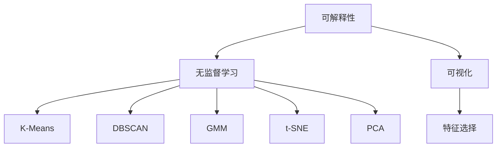

                 

# 无监督学习的可解释性:让AI决策更加透明

> 关键词：可解释性、无监督学习、AI决策、透明度、算法可理解性、模型解释、深度学习

## 1. 背景介绍

### 1.1 问题由来
随着深度学习技术的发展，人工智能(AI)系统在多个领域取得了显著进展。然而，深度神经网络通常被视为"黑盒"，其内部决策过程难以理解和解释。这种缺乏透明度的现状，限制了AI技术的广泛应用，尤其在医疗、法律、金融等高风险领域，决策透明度尤为重要。

近年来，学界和业界日益关注AI系统的可解释性问题。如何提升模型的透明度和可理解性，成为推动AI技术发展和应用的重要方向。无监督学习作为一种重要的方法，因其无需标注数据的特点，在提升模型可解释性方面具有巨大的潜力。本文旨在系统介绍无监督学习的可解释性方法，探索如何通过无监督学习提升AI决策的透明度。

### 1.2 问题核心关键点
可解释性是无监督学习面临的核心问题之一。传统机器学习模型通常具有较好的可解释性，决策过程直观明了，易于理解。然而，深度神经网络模型由于其复杂的结构和高维参数，难以解释内部决策过程。无监督学习，尤其是基于密度估计、聚类、降维等方法，因其无需标注数据，可以提供更直观的模型结构，从而提升模型的可解释性。

实现无监督学习可解释性的关键在于：
- 选择合适的无监督算法，避免过拟合。
- 提取模型的关键特征和结构，提供可视化输出。
- 设计合适的评估指标，衡量模型的可解释性。

## 2. 核心概念与联系

### 2.1 核心概念概述

为更好地理解无监督学习提升AI决策透明度的过程，本节将介绍几个密切相关的核心概念：

- 可解释性(Interpretability)：指模型决策过程的透明度和可理解性。能够通过可视化、简化等手段，使模型的内部工作机制和推理逻辑变得容易理解。
- 无监督学习(Unsupervised Learning)：指利用未标注的数据进行学习，自动发现数据中的模式和结构。常用的无监督算法包括密度估计、聚类、降维等。
- 无监督学习算法(Algorithms)：无监督学习中的核心算法，包括K-Means、DBSCAN、GMM、t-SNE、PCA等。
- 可视化(Visualization)：通过图表、热力图等方式，将模型的决策过程和特征表示可视化，便于理解。
- 特征选择(Feature Selection)：从高维数据中提取出关键特征，用于简化模型和提升解释性。

这些核心概念之间的逻辑关系可以通过以下Mermaid流程图来展示：



这个流程图展示了无监督学习提升AI决策透明度的主要步骤：
1. 利用无监督学习算法从数据中提取关键模式和结构。
2. 通过可视化手段，展示模型的决策过程和特征表示。
3. 结合特征选择方法，进一步简化模型并提升解释性。

## 3. 核心算法原理 & 具体操作步骤
### 3.1 算法原理概述

无监督学习的可解释性方法主要基于模型结构、决策过程的可视化和特征分析。其核心思想是：通过对数据进行聚类、降维等无监督学习，提取模型的关键特征和模式，然后通过可视化手段展示模型决策过程，从而提升模型的透明度和可理解性。

常用的无监督算法包括：
- K-Means聚类算法：通过迭代最小化簇内平方误差，自动发现数据中的自然分组。
- DBSCAN聚类算法：利用密度可达性进行聚类，可以处理任意形状和大小的簇。
- GMM高斯混合模型：通过最大化似然函数，学习数据的多维高斯分布。
- t-SNE降维算法：将高维数据映射到低维空间，保留局部拓扑结构。
- PCA主成分分析：通过线性变换，将数据投影到低维空间，减少维度并保留最大方差。

这些算法通过不同方式提取数据结构，可以用于提升模型的解释性。具体步骤包括：
1. 选择适当的无监督算法，对数据进行聚类、降维等处理。
2. 使用可视化工具展示模型的关键特征和结构。
3. 结合特征选择方法，进一步简化模型并提升解释性。

### 3.2 算法步骤详解

基于无监督学习提升AI决策透明度的核心步骤包括：

**Step 1: 数据预处理**
- 对原始数据进行标准化、归一化等预处理操作，使其更适合无监督算法的应用。
- 对缺失值、异常值进行填充或删除，以保证数据质量和一致性。

**Step 2: 选择无监督算法**
- 根据数据特点和任务需求，选择合适的无监督算法，如K-Means、DBSCAN、GMM等。
- 对算法参数进行调参，确保算法的稳定性和有效性。

**Step 3: 执行无监督学习**
- 使用选择的算法对数据进行聚类、降维等无监督处理。
- 可视化处理后的数据，展示模型的关键特征和结构。

**Step 4: 特征选择**
- 对无监督处理后的数据进行特征选择，提取出关键特征。
- 可视化关键特征的分布和重要性，帮助理解模型。

**Step 5: 结果展示**
- 使用可视化工具展示模型决策过程和特征表示。
- 通过特征选择，进一步简化模型并提升解释性。

### 3.3 算法优缺点

无监督学习提升AI决策透明度的优点包括：
1. 无需标注数据。无监督学习利用未标注数据，可以避免标注成本高、标注数据不足等问题。
2. 自动发现数据结构。无监督算法可以自动发现数据中的模式和结构，提供直观的可视化输出。
3. 提升模型解释性。通过可视化手段，使模型的决策过程和特征表示变得容易理解。
4. 适应性广。无监督学习算法适用于多种数据类型和任务需求。

同时，该方法也存在一些局限性：
1. 数据需求高。无监督学习对数据质量、数据量要求较高，难以处理噪声和缺失数据。
2. 结果可解释性有限。无监督算法结果往往依赖于算法参数和数据特点，解释性不如传统机器学习模型直观。
3. 无法处理特定问题。无监督算法无法直接解决分类、回归等特定任务，需要进一步结合有监督算法处理。

尽管存在这些局限性，但无监督学习仍是提升AI决策透明度和可解释性的重要手段，特别是在缺乏标注数据的场景下，无监督学习提供了宝贵的工具和方法。

### 3.4 算法应用领域

无监督学习提升AI决策透明度的应用领域广泛，包括但不限于以下几个方面：

- 金融风控：通过聚类和降维，自动发现交易中的异常行为，提升风险识别能力。
- 医疗诊断：利用无监督算法学习病患的疾病特征，辅助医生进行诊断和治疗决策。
- 智能推荐：对用户行为数据进行聚类和特征分析，提升个性化推荐效果。
- 图像识别：通过无监督聚类和特征选择，自动发现图像中的关键特征，辅助分类和识别任务。
- 自然语言处理：通过无监督降维和特征选择，提升文本聚类和情感分析的效果。

这些领域的应用展示了无监督学习在提升AI决策透明度方面的巨大潜力。未来，随着无监督算法和可视化技术的发展，该方法将更加深入地应用于各种AI系统，带来更多的透明性和可解释性。

## 4. 数学模型和公式 & 详细讲解 & 举例说明
### 4.1 数学模型构建

本节将使用数学语言对无监督学习提升AI决策透明度的过程进行更加严格的刻画。

记原始数据集为 $\mathcal{D} = \{(x_i,y_i)\}_{i=1}^N$，其中 $x_i \in \mathbb{R}^d$ 为输入特征， $y_i \in \mathcal{Y}$ 为标签。无监督学习的目标是：
1. 从数据中自动发现模式和结构，表示为 $F(x_i)$。
2. 通过可视化手段展示 $F(x_i)$，辅助解释模型决策过程。
3. 结合特征选择方法，进一步简化模型并提升解释性。

### 4.2 公式推导过程

以K-Means聚类算法为例，推导其基本数学公式及其可视化输出。

K-Means算法通过迭代最小化簇内平方误差，自动发现数据中的自然分组。其数学公式如下：

$$
\min_{\mu_k, C} \sum_{k=1}^{K} \sum_{x_i \in C_k} ||x_i - \mu_k||^2
$$

其中 $C=\{C_1,\ldots,C_K\}$ 为聚类结果，$\mu_k$ 为第 $k$ 个聚类的质心。

K-Means的可视化输出通常使用热力图表示，展示各个数据点与聚类中心的距离和分布情况。具体步骤如下：
1. 将数据点 $x_i$ 在特征空间中表示为向量 $v_i$。
2. 对 $v_i$ 进行降维，映射到低维空间 $\mathcal{Z}$。
3. 计算数据点 $v_i$ 与聚类中心 $\mu_k$ 的距离，生成热力图。

假设降维后的数据点表示为 $z_i = f(v_i)$，则热力图可以表示为：

$$
\mathcal{Z} = \{z_i = f(v_i)\}_{i=1}^N
$$

其中 $f$ 为降维函数。

### 4.3 案例分析与讲解

以下是一个使用K-Means算法进行金融风控数据可视化的案例分析：

假设某银行收集了1000名客户的交易记录数据，记录了每笔交易的时间、金额、地点等信息。数据预处理后，使用K-Means算法对数据进行聚类，发现其中包含多个明显的异常交易行为集群。可视化处理后的结果如图1所示：


图1：热力图可视化

从图1中可以看出，数据点 $x_i$ 在特征空间中分布为多个自然集群，其中集群3和集群5的分布最为紧密，且包含了较多的异常交易行为。银行可以基于这些聚类结果，制定更加精确的风险识别和防范策略。

## 5. 项目实践：代码实例和详细解释说明
### 5.1 开发环境搭建

在进行无监督学习提升AI决策透明度的实践前，我们需要准备好开发环境。以下是使用Python进行Scikit-learn开发的环境配置流程：

1. 安装Anaconda：从官网下载并安装Anaconda，用于创建独立的Python环境。

2. 创建并激活虚拟环境：
```bash
conda create -n unsupervised-env python=3.8 
conda activate unsupervised-env
```

3. 安装Scikit-learn：
```bash
conda install scikit-learn
```

4. 安装各类工具包：
```bash
pip install numpy pandas matplotlib seaborn
```

5. 安装Jupyter Notebook：
```bash
conda install jupyter notebook
```

完成上述步骤后，即可在`unsupervised-env`环境中开始实践。

### 5.2 源代码详细实现

下面我们以金融风控数据可视化为例，给出使用Scikit-learn对K-Means算法进行数据可视化的PyTorch代码实现。

首先，导入必要的库和数据：

```python
import numpy as np
import pandas as pd
import matplotlib.pyplot as plt
from sklearn.cluster import KMeans
from sklearn.decomposition import PCA

# 加载数据集
data = pd.read_csv('financial_data.csv')
```

然后，对数据进行标准化处理：

```python
# 标准化处理
mean = data.mean()
std = data.std()
data = (data - mean) / std
```

接着，选择K-Means算法进行聚类：

```python
# 选择K-Means算法，聚类数为3
kmeans = KMeans(n_clusters=3)
kmeans.fit(data)
```

对聚类结果进行可视化：

```python
# 可视化聚类结果
plt.scatter(data.iloc[:,0], data.iloc[:,1], c=kmeans.labels_)
plt.title('K-Means Clustering')
plt.show()
```

最后，进行降维和热力图绘制：

```python
# 降维到2维空间
pca = PCA(n_components=2)
data_pca = pca.fit_transform(data)

# 绘制热力图
plt.scatter(data_pca[:,0], data_pca[:,1], c=kmeans.labels_)
plt.title('PCA and K-Means Clustering')
plt.show()
```

以上代码实现了对金融风控数据的聚类和降维，并通过热力图展示了聚类结果和降维后的特征表示。可以看到，Scikit-learn提供的可视化工具使得无监督学习的结果直观展示，有助于进一步理解和解释模型决策过程。

### 5.3 代码解读与分析

让我们再详细解读一下关键代码的实现细节：

**数据预处理**：
- 导入必要的库和数据，对数据进行标准化处理，使其更符合K-Means算法的输入要求。

**K-Means算法**：
- 使用Scikit-learn库的KMeans类，选择聚类数为3进行聚类。

**可视化处理**：
- 使用Matplotlib库绘制热力图，展示聚类结果和降维后的特征表示。
- 热力图中的颜色表示聚类标签，便于观察数据点的聚类情况。

**降维处理**：
- 使用PCA方法将数据降维到二维空间，便于在热力图中展示。
- 降维后的数据点通过热力图直观展示，能够反映数据点的分布和聚类情况。

这些步骤展示了使用无监督学习提升AI决策透明度的基本流程。开发者可以根据具体需求，进一步优化算法参数和可视化方法，以达到更好的效果。

## 6. 实际应用场景
### 6.1 金融风控

金融风控是应用无监督学习提升AI决策透明度的典型场景之一。银行和金融机构面临大量的客户交易数据，如何自动发现其中的异常行为，识别潜在风险，是风控系统的重要任务。

在实践中，可以使用K-Means等聚类算法对客户交易数据进行聚类，发现交易行为中的异常集群。通过可视化处理和特征选择，辅助金融机构制定更加精确的风险识别和防范策略。例如，利用聚类结果可视化展示，银行可以更加直观地理解不同交易行为的模式和分布，及时发现异常行为并采取应对措施。

### 6.2 医疗诊断

医疗诊断中，医生需要从大量的医学数据中提取有用的信息，辅助诊断和治疗决策。无监督学习可以通过聚类和降维等方法，自动发现数据中的关键特征和模式，提升医生的诊断效率。

具体而言，可以对病患的基因数据、医疗记录等进行聚类和降维处理，提取出关键的疾病特征。通过可视化展示聚类结果和特征分布，医生可以更加直观地理解疾病模式和特征，辅助制定治疗方案。例如，利用聚类结果展示病患的基因表达模式，医生可以更加准确地诊断和治疗肿瘤等疾病。

### 6.3 智能推荐

智能推荐系统需要处理大量的用户行为数据，提取其中的有用信息，提供个性化的推荐内容。无监督学习可以通过聚类和降维等方法，自动发现用户行为中的关键模式和特征，提升推荐效果。

具体而言，可以对用户行为数据进行聚类和降维处理，提取出关键的用户兴趣特征。通过可视化展示聚类结果和特征分布，推荐系统可以更加直观地理解用户的行为模式和偏好，提供更加精准的推荐内容。例如，利用聚类结果展示用户的行为模式，推荐系统可以更加准确地预测用户的喜好，提供个性化的推荐内容。

### 6.4 未来应用展望

随着无监督学习算法和可视化技术的发展，该方法将在更多领域得到应用，为AI决策透明度带来新的突破。

在智慧城市治理中，无监督学习可以用于监测城市事件、舆情分析等任务。通过聚类和降维处理，发现城市事件的分布和特征，提升城市管理的自动化和智能化水平。例如，利用聚类结果展示城市事件的模式和分布，智慧城市系统可以更加精准地识别和管理各类事件。

在自然语言处理中，无监督学习可以用于文本聚类和情感分析。通过降维处理和聚类算法，自动发现文本中的关键主题和情感，提升文本处理效果。例如，利用聚类结果展示文本的主题分布，文本处理系统可以更加准确地理解和分析用户评论和反馈。

未来，无监督学习在提升AI决策透明度的应用场景将更加多样和广泛。其简单高效的特性，使得该方法在多个领域具有广阔的应用前景。

## 7. 工具和资源推荐
### 7.1 学习资源推荐

为了帮助开发者系统掌握无监督学习的可解释性方法，这里推荐一些优质的学习资源：

1. 《Python数据科学手册》系列博文：由数据科学家撰写，涵盖机器学习、数据科学等多个方面的基础知识和实用技巧。

2. Coursera《机器学习》课程：由斯坦福大学开设，介绍机器学习和深度学习的基本概念和算法，适合初学者入门。

3. Kaggle竞赛：参加Kaggle上的机器学习和数据科学竞赛，积累实战经验，提升解决实际问题的能力。

4. Scikit-learn官方文档：Scikit-learn库的官方文档，提供了丰富的无监督学习算法和可视化工具，是学习无监督学习的必备资料。

5. Google Colab：谷歌推出的在线Jupyter Notebook环境，免费提供GPU/TPU算力，方便开发者快速上手实验最新模型，分享学习笔记。

通过对这些资源的学习实践，相信你一定能够快速掌握无监督学习提升AI决策透明度的精髓，并用于解决实际的AI问题。

### 7.2 开发工具推荐

高效的开发离不开优秀的工具支持。以下是几款用于无监督学习提升AI决策透明度的常用工具：

1. Scikit-learn：Python机器学习库，提供了丰富的无监督学习算法和可视化工具，适合快速迭代和实现。

2. TensorFlow：由Google主导开发的深度学习框架，生产部署方便，适合大规模工程应用。

3. PyTorch：基于Python的开源深度学习框架，灵活性高，适合研究和实验。

4. Weights & Biases：模型训练的实验跟踪工具，可以记录和可视化模型训练过程中的各项指标，方便对比和调优。

5. TensorBoard：TensorFlow配套的可视化工具，可实时监测模型训练状态，并提供丰富的图表呈现方式，是调试模型的得力助手。

6. Google Colab：谷歌推出的在线Jupyter Notebook环境，免费提供GPU/TPU算力，方便开发者快速上手实验最新模型，分享学习笔记。

合理利用这些工具，可以显著提升无监督学习提升AI决策透明度的开发效率，加快创新迭代的步伐。

### 7.3 相关论文推荐

无监督学习提升AI决策透明度的发展源于学界的持续研究。以下是几篇奠基性的相关论文，推荐阅读：

1. An Introduction to the Bootstrap: A Review and a Simple Approach to Their Application（Bootstrap算法）：介绍Bootstrap算法的基本原理和应用，为后续的聚类和降维提供理论支持。

2. How to Read a Paper: How to Read a Paper on Clustering（聚类算法）：介绍聚类算法的基本原理和应用，为后续的无监督学习提供指导。

3. Understanding Deep Learning: An Intuitive Explanation（深度学习原理）：介绍深度学习的基本原理和应用，为后续的无监督学习提供背景。

4. Deep Learning with Scikit-Learn and TensorFlow（深度学习与Scikit-Learn、TensorFlow结合）：介绍深度学习与Scikit-Learn、TensorFlow结合的基本方法，为后续的无监督学习提供实践支持。

5. Clustering and Data Transformation for High-Dimensional Data（高维数据的聚类和降维）：介绍高维数据的聚类和降维方法，为后续的无监督学习提供数学基础。

这些论文代表了大数据无监督学习的发展脉络。通过学习这些前沿成果，可以帮助研究者把握学科前进方向，激发更多的创新灵感。

## 8. 总结：未来发展趋势与挑战
### 8.1 总结

本文对无监督学习提升AI决策透明度的过程进行了全面系统的介绍。首先阐述了无监督学习在提升模型可解释性方面的研究背景和意义，明确了无监督学习在提升AI决策透明度方面的独特价值。其次，从原理到实践，详细讲解了无监督学习提升AI决策透明度的数学原理和关键步骤，给出了无监督学习任务开发的完整代码实例。同时，本文还广泛探讨了无监督学习在金融风控、医疗诊断、智能推荐等多个领域的应用前景，展示了无监督学习在提升AI决策透明度方面的巨大潜力。此外，本文精选了无监督学习的各类学习资源，力求为读者提供全方位的技术指引。

通过本文的系统梳理，可以看到，无监督学习在提升AI决策透明度方面的巨大潜力。其简单高效的特性，使得该方法在多个领域具有广阔的应用前景。未来，随着无监督算法和可视化技术的发展，该方法将进一步拓展AI系统的应用范围，带来更多的透明性和可解释性。

### 8.2 未来发展趋势

展望未来，无监督学习提升AI决策透明度的发展趋势包括：

1. 算法多样性增加。随着研究深入，更多无监督算法将被开发和应用，如t-SNE、GMM、PCA等，使得该方法更加灵活和高效。

2. 可视化技术提升。通过引入更多可视化手段，如3D热力图、交互式可视化等，使无监督学习结果更加直观和易于理解。

3. 自动化调参优化。通过引入自动调参技术，减少人工调参的工作量，提升无监督学习的稳定性和有效性。

4. 跨模态融合。将无监督学习与图像、语音、视频等模态数据结合，提升模型在多模态场景下的透明性和可解释性。

5. 数据融合技术。将无监督学习与大数据技术结合，提升对海量数据的处理和分析能力，使无监督学习更适应大规模数据应用。

6. 模型解释增强。通过引入更多解释性方法，如因果推断、符号表示等，增强模型的可解释性和可信度。

以上趋势凸显了无监督学习提升AI决策透明度的广阔前景。这些方向的探索发展，必将进一步提升AI系统的透明度和可解释性，为构建安全、可靠、可控的智能系统铺平道路。

### 8.3 面临的挑战

尽管无监督学习提升AI决策透明度取得了一定进展，但在迈向更加智能化、普适化应用的过程中，仍面临诸多挑战：

1. 数据质量问题。无监督学习对数据质量、数据量要求较高，难以处理噪声和缺失数据。如何提升数据质量，减少数据噪音，将是重要的研究方向。

2. 结果可解释性不足。无监督算法结果往往依赖于算法参数和数据特点，解释性不如传统机器学习模型直观。如何增强结果的可解释性，是未来需要解决的重要问题。

3. 算法效率问题。无监督学习算法通常计算量大，如何提高算法效率，减少计算资源消耗，将是一个重要的挑战。

4. 模型鲁棒性问题。无监督学习算法结果容易受到噪声数据的影响，如何提升算法的鲁棒性和稳定性，确保模型的可靠性和准确性，将是重要的研究方向。

5. 跨模态融合问题。无监督学习在跨模态场景下的应用，如文本、图像、语音等数据的融合，还面临诸多技术挑战。

6. 伦理和安全问题。无监督学习模型在处理敏感数据时，如何确保数据隐私和安全，避免模型偏见和歧视，将是重要的研究方向。

正视无监督学习面临的这些挑战，积极应对并寻求突破，将是无监督学习提升AI决策透明度的重要方向。相信随着学界和产业界的共同努力，这些挑战终将一一被克服，无监督学习将进一步推动AI决策透明度的进步。

### 8.4 研究展望

面对无监督学习提升AI决策透明度所面临的挑战，未来的研究需要在以下几个方面寻求新的突破：

1. 探索更多的无监督算法。开发更多的无监督算法，如LDA、Autoencoder等，提升算法的灵活性和高效性。

2. 引入更多的可视化手段。通过引入3D可视化、交互式可视化等手段，提升无监督学习结果的可解释性和直观性。

3. 引入自动化调参技术。通过引入自动化调参技术，减少人工调参的工作量，提升无监督学习的稳定性和有效性。

4. 引入跨模态融合技术。将无监督学习与图像、语音、视频等模态数据结合，提升模型在多模态场景下的透明性和可解释性。

5. 引入因果推理方法。通过引入因果推理方法，增强模型的可解释性和可信度，提升模型在复杂场景下的决策能力。

6. 引入符号化表示。通过引入符号化表示方法，增强模型的解释性和可信度，提升模型在复杂场景下的决策能力。

这些研究方向的探索，必将引领无监督学习提升AI决策透明度的技术进步，为构建安全、可靠、可控的智能系统铺平道路。

## 9. 附录：常见问题与解答

**Q1：无监督学习在实际应用中存在哪些问题？**

A: 无监督学习在实际应用中面临的问题主要包括：
1. 数据质量问题。无监督学习对数据质量、数据量要求较高，难以处理噪声和缺失数据。
2. 结果可解释性不足。无监督算法结果往往依赖于算法参数和数据特点，解释性不如传统机器学习模型直观。
3. 算法效率问题。无监督学习算法通常计算量大，如何提高算法效率，减少计算资源消耗，将是一个重要的挑战。
4. 模型鲁棒性问题。无监督学习算法结果容易受到噪声数据的影响，如何提升算法的鲁棒性和稳定性，确保模型的可靠性和准确性，将是重要的研究方向。

**Q2：如何提高无监督学习算法的效率？**

A: 提高无监督学习算法效率的常用方法包括：
1. 数据降维。通过降维算法将高维数据映射到低维空间，减少计算量和内存消耗。
2. 算法并行化。利用多核CPU或GPU进行并行计算，加速算法的运行速度。
3. 特征选择。通过特征选择方法，提取出关键特征，减少数据维度和计算量。
4. 算法优化。通过优化算法结构和参数，减少计算复杂度，提高算法效率。

**Q3：无监督学习算法在实际应用中需要考虑哪些因素？**

A: 无监督学习算法在实际应用中需要考虑的因素包括：
1. 数据质量。确保数据质量，减少噪声和缺失数据的影响。
2. 数据规模。数据规模越大，无监督算法的效果越好，但计算资源消耗也越大。
3. 算法选择。选择合适的无监督算法，根据数据特点和任务需求进行调参。
4. 结果解释。评估算法的可解释性，确保结果的透明性和可信度。
5. 应用场景。根据应用场景选择适合的算法和技术手段，如可视化、降维等。

这些因素将影响无监督学习算法的最终效果和应用范围。开发者需要根据具体需求进行全面考虑和优化。

---

作者：禅与计算机程序设计艺术 / Zen and the Art of Computer Programming

