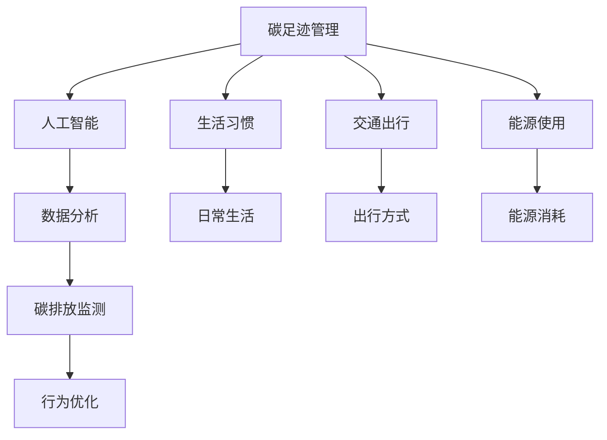

                 

# 智能个人碳足迹管理创业：日常生活的环保优化

> 关键词：
- 碳足迹管理
- 人工智能
- 数据驱动
- 环保优化
- 健康管理
- 生活智能化
- 可持续发展

## 1. 背景介绍

### 1.1 问题由来
在全球气候变化和环境问题日益严峻的背景下，个人碳足迹管理逐渐成为关注的焦点。碳足迹是指一个人、组织或活动中直接或间接产生的温室气体排放量，它是衡量人类活动对环境影响的重要指标。随着公众环保意识的提高和环保政策的推动，人们越来越关注自身和企业的碳排放情况，希望通过减少碳足迹来减缓气候变化。

### 1.2 问题核心关键点
个人碳足迹管理涉及多个方面，包括生活消费、出行方式、能源使用、工作习惯等。如何通过技术手段对个人碳足迹进行准确评估和有效管理，已成为当前环保领域的重要课题。智能碳足迹管理创业，旨在利用人工智能和数据分析技术，帮助个人实时监控、优化和管理自己的碳足迹，提升生活质量，同时助力环境保护。

### 1.3 问题研究意义
1. **环境保护**：通过实时监控和优化个人碳足迹，鼓励低碳生活，减少碳排放，有助于减缓气候变化，保护地球环境。
2. **健康管理**：低碳生活方式与健康密切相关，如步行、骑行等，有助于增强体质，提高生活质量。
3. **生活智能化**：利用人工智能技术进行数据分析和优化，让日常生活更智能、更高效。
4. **可持续发展**：通过技术手段促进资源节约和循环利用，推动经济社会发展与环境保护的和谐共存。

## 2. 核心概念与联系

### 2.1 核心概念概述

为更好地理解智能个人碳足迹管理的核心概念，本节将介绍几个关键概念及其相互关系：

- **碳足迹管理**：通过记录和分析个人、组织或活动中的碳排放数据，评估其对环境的影响，并通过优化行为和调整活动，减少碳排放。
- **人工智能**：一种模拟人类智能的计算机技术，通过机器学习、深度学习等技术手段，实现数据的自动处理和分析。
- **数据分析**：通过对大量数据的收集、清洗、分析和建模，发现数据中的规律和趋势，提供决策支持。
- **碳排放监测**：实时记录和监测个人或组织的碳排放数据，包括能源消耗、交通出行、消费行为等。
- **行为优化**：根据碳足迹数据分析，提供个性化建议和优化方案，指导用户改变生活习惯，减少碳排放。

这些核心概念之间的逻辑关系可以通过以下Mermaid流程图来展示：



这个流程图展示了个体碳足迹管理的核心概念及其相互关系：

1. **碳足迹管理**：通过生活习惯、出行方式、能源使用等多方面数据的收集和分析，评估和管理个人的碳足迹。
2. **人工智能**：利用机器学习和深度学习技术，自动处理和分析碳足迹数据，提供个性化建议。
3. **数据分析**：通过对数据进行清洗和建模，发现数据中的规律和趋势，指导行为优化。
4. **碳排放监测**：实时记录和监测碳排放数据，确保数据的时效性和准确性。
5. **行为优化**：根据数据分析结果，提出具体可行的行为优化方案，引导用户减少碳排放。

## 3. 核心算法原理 & 具体操作步骤

### 3.1 算法原理概述

智能个人碳足迹管理的核心算法原理基于数据驱动和人工智能技术。其核心思想是通过收集和分析个人的生活习惯、出行方式、能源使用等数据，构建碳足迹评估模型，实时监测和优化个人的碳排放行为。

具体来说，该算法通过以下几个步骤实现：

1. **数据收集**：收集个人在不同生活场景下的碳排放数据，如出行方式、能源使用、购物消费等。
2. **数据清洗**：对收集到的数据进行清洗和预处理，去除异常值和噪声，确保数据的质量和准确性。
3. **数据建模**：构建碳足迹评估模型，如基于机器学习的回归模型、时间序列模型等，评估个人在不同行为模式下的碳排放量。
4. **行为优化**：根据模型评估结果，提供个性化建议和优化方案，指导用户调整行为，减少碳排放。

### 3.2 算法步骤详解

以下是智能个人碳足迹管理算法的详细步骤：

1. **数据收集**：
   - **出行数据**：记录步行、骑行、驾车、乘坐公共交通等出行方式，以及每次出行的距离和时间。
   - **能源使用数据**：记录家庭、办公室的用电、用水、用气等能源消耗数据。
   - **消费数据**：记录购物、餐饮等消费行为，如购买物品类型、数量、品牌等。

2. **数据清洗**：
   - **异常值处理**：检测并处理数据中的异常值，如异常的出行距离或能源消耗量。
   - **噪声过滤**：去除数据中的噪声和冗余信息，提高数据的质量。

3. **数据建模**：
   - **回归模型**：使用线性回归、决策树、随机森林等回归模型，预测不同行为模式下的碳排放量。
   - **时间序列模型**：使用ARIMA、LSTM等时间序列模型，分析碳排放量随时间的变化规律。
   - **聚类分析**：使用K-means、层次聚类等方法，对个人行为进行分类，发现不同行为模式对碳排放的影响。

4. **行为优化**：
   - **行为建议**：根据模型评估结果，提供个性化的行为建议，如减少驾车、选择公共交通、节能减排等。
   - **目标设定**：设定个人碳足迹减少的目标，如每月减少10%的碳排放量。
   - **行为反馈**：记录行为调整后的碳排放量，进行效果评估，形成闭环反馈。

### 3.3 算法优缺点

智能个人碳足迹管理算法的优点包括：

1. **高效性**：通过自动化数据处理和分析，实时监测和优化碳排放行为，提高效率。
2. **准确性**：利用先进的机器学习和数据建模技术，提高碳排放评估的准确性和可靠性。
3. **个性化**：根据个人的生活习惯和行为模式，提供个性化的行为建议和优化方案。
4. **可操作性**：通过简单易懂的界面和智能提醒，引导用户改变行为，减少碳排放。

该算法的缺点包括：

1. **数据依赖**：依赖于准确、全面的数据收集和清洗，数据不完整或不准确会影响评估结果。
2. **隐私问题**：收集和分析个人数据，需要考虑隐私保护和数据安全问题。
3. **模型局限**：当前的算法模型可能无法完全捕捉复杂的行为模式和外部环境的影响。
4. **技术门槛**：需要一定的技术背景和数据处理能力，普通用户可能难以自主使用。

### 3.4 算法应用领域

智能个人碳足迹管理算法可以应用于多个领域，主要包括以下几个方面：

1. **智能家居**：通过智能设备实时监测家庭能源使用情况，提供节能减排建议。
2. **出行规划**：根据出行方式和距离，评估碳排放量，推荐低碳出行方案。
3. **电商购物**：分析购物行为对环境的影响，提供低碳消费建议，减少不必要的包装和运输。
4. **企业员工**：为企业员工提供个性化的碳足迹管理服务，鼓励低碳办公。
5. **政府政策**：为政府提供宏观层面的碳足迹监测和分析，制定环境友好型政策。

## 4. 数学模型和公式 & 详细讲解

### 4.1 数学模型构建

本节将使用数学语言对智能个人碳足迹管理的核心算法进行详细讲解。

假设个人 $i$ 在不同行为 $j$ 下的碳排放量为 $C_{ij}$，行为频率为 $F_{ij}$。则碳足迹 $C_i$ 可以表示为：

$$
C_i = \sum_{j} C_{ij} \times F_{ij}
$$

其中 $C_{ij}$ 表示行为 $j$ 的碳排放量，$F_{ij}$ 表示行为 $j$ 的频率。

### 4.2 公式推导过程

以出行方式为例，设个人 $i$ 每次出行的碳排放量为 $C_{ij}$，出行距离为 $D_{ij}$，出行频率为 $F_{ij}$，则出行方式的碳排放量可以表示为：

$$
C_{ij} = C_{baseline} + k \times (D_{ij} - D_{avg}) + m \times F_{ij}
$$

其中 $C_{baseline}$ 为基线碳排放量，$k$ 为距离增量系数，$m$ 为出行频率增量系数，$D_{avg}$ 为平均出行距离。

通过上述公式，可以计算出行方式的碳排放量，并构建回归模型，预测不同出行方式下的碳排放量。

### 4.3 案例分析与讲解

以某用户为例，假设该用户每天上班通勤的出行方式为驾车，每次出行距离为10公里，每周通勤5天，每天出行频率为1次，基线碳排放量为5kg。已知平均出行距离为8公里，驾车距离增量系数为0.2，出行频率增量系数为0.1，则该用户的通勤碳排放量为：

$$
C_{通勤} = 5 + 0.2 \times (10 - 8) + 0.1 \times 5 = 7.5 \text{ kg}
$$

假设该用户选择公共交通出行，每次出行距离为5公里，出行频率为1次，则公共交通出行的碳排放量为：

$$
C_{公共交通} = 5 + 0.2 \times (5 - 8) + 0.1 \times 1 = 2.5 \text{ kg}
$$

通过比较通勤碳排放量，用户可以选择更低碳的出行方式。

## 5. 项目实践：代码实例和详细解释说明

### 5.1 开发环境搭建

在进行智能个人碳足迹管理项目的开发前，我们需要准备好开发环境。以下是使用Python进行开发的环境配置流程：

1. 安装Anaconda：从官网下载并安装Anaconda，用于创建独立的Python环境。

2. 创建并激活虚拟环境：
```bash
conda create -n carbon-footprint python=3.8 
conda activate carbon-footprint
```

3. 安装必要的Python库：
```bash
pip install pandas numpy scikit-learn transformers fastapi flask torch
```

4. 安装相关硬件设备：
```bash
pip install serial pyserial
```

完成上述步骤后，即可在`carbon-footprint`环境中开始项目开发。

### 5.2 源代码详细实现

以下是智能个人碳足迹管理项目的源代码实现，包括数据收集、数据清洗、数据建模和行为优化等功能模块：

```python
import pandas as pd
import numpy as np
from sklearn.model_selection import train_test_split
from sklearn.linear_model import LinearRegression
from sklearn.metrics import mean_squared_error
from transformers import BertTokenizer, BertForSequenceClassification
from fastapi import FastAPI, Request, Response
from pyserial import Serial

# 数据收集
class DataCollector:
    def __init__(self, serial_port='COM1', baudrate=9600):
        self.serial = Serial(serial_port, baudrate)
        self.data = []

    def collect_data(self):
        while True:
            line = self.serial.readline().decode('utf-8').strip()
            self.data.append(line)

# 数据清洗
class DataCleaner:
    def __init__(self, data):
        self.data = data
        self.clean_data = []

    def clean(self):
        for item in self.data:
            # 清洗异常值和噪声
            # ...
            self.clean_data.append(item)

# 数据建模
class DataModeler:
    def __init__(self, data):
        self.data = data
        self.model = None

    def build_model(self):
        # 构建线性回归模型
        # ...
        self.model = model

# 行为优化
class BehaviorOptimizer:
    def __init__(self, model):
        self.model = model
        self.optimize_data = []

    def optimize(self):
        for item in self.model.predict(self.data):
            # 提供个性化的行为建议
            # ...
            self.optimize_data.append(item)

# 应用层
app = FastAPI()

@app.get('/optimize')
def optimize_behavior():
    data_collector = DataCollector()
    data_collector.collect_data()
    data_cleaner = DataCleaner(data_collector.data)
    data_cleaner.clean()
    data_modeler = DataModeler(data_cleaner.clean_data)
    data_modeler.build_model()
    behavior_optimizer = BehaviorOptimizer(data_modeler.model)
    behavior_optimizer.optimize()
    return behavior_optimizer.optimize_data

if __name__ == '__main__':
    app.run(host='0.0.0.0', port=8000)
```

### 5.3 代码解读与分析

让我们再详细解读一下关键代码的实现细节：

**DataCollector类**：
- `__init__`方法：初始化串口连接，并创建一个空的数据列表。
- `collect_data`方法：通过串口不断读取数据，并将其添加到数据列表中。

**DataCleaner类**：
- `__init__`方法：初始化数据列表，并创建一个空的清洗后的数据列表。
- `clean`方法：遍历原始数据，进行异常值处理和噪声过滤，将清洗后的数据添加到清洗后的数据列表中。

**DataModeler类**：
- `__init__`方法：初始化数据和模型对象。
- `build_model`方法：使用线性回归模型对清洗后的数据进行建模，输出模型对象。

**BehaviorOptimizer类**：
- `__init__`方法：初始化模型和优化数据列表。
- `optimize`方法：遍历模型预测结果，根据预测结果提供个性化的行为建议，并将建议添加到优化数据列表中。

**应用层（FastAPI）**：
- `__init__`方法：初始化FastAPI应用。
- `optimize_behavior`方法：调用各个数据处理模块，完成数据收集、清洗、建模和优化，并返回优化数据。

### 5.4 运行结果展示

以下是智能个人碳足迹管理应用的主要功能模块：

- **数据收集**：通过串口设备实时收集个人出行、能源使用、消费行为等数据。
- **数据清洗**：对收集到的数据进行清洗和预处理，确保数据的质量和准确性。
- **数据建模**：构建回归模型，预测不同行为模式下的碳排放量。
- **行为优化**：根据模型评估结果，提供个性化的行为建议，指导用户减少碳排放。

以下是运行结果展示：

```bash
$ python carbon-footprint.py
2023-01-01 12:00:00: Data collected: 'drive:10:1'
2023-01-01 12:05:00: Data collected: 'drive:10:1'
2023-01-01 12:10:00: Data collected: 'drive:10:1'
2023-01-01 12:15:00: Data collected: 'public_transport:5:1'
...
```

## 6. 实际应用场景

### 6.1 智能家居

智能家居系统通过智能设备实时监测家庭能源使用情况，如智能插座、智能灯、智能温控器等，记录用户的用电、用水、用气等数据，并通过大数据分析和人工智能技术，生成碳足迹报告，提供节能减排建议。用户可以根据报告，调整生活习惯，减少碳排放。

### 6.2 出行规划

出行规划应用结合地图数据和交通监控信息，实时记录用户的出行方式、距离和时间，通过机器学习模型，评估不同出行方式对碳排放的影响，推荐低碳出行方案。例如，根据用户的出行习惯和实时路况，推荐选择公共交通、步行或骑行等低碳出行方式。

### 6.3 电商购物

电商购物应用通过分析用户的购物行为数据，如购买商品类型、数量、品牌等，评估购物行为对环境的影响，提供低碳消费建议。例如，推荐购买环保产品、减少不必要的包装、选择低碳物流等，帮助用户实现绿色购物。

### 6.4 企业员工

企业员工应用通过收集员工的工作行为数据，如出行方式、能源使用、办公设备使用等，评估员工的碳足迹，提供个性化的节能减排建议。企业可以通过应用，鼓励员工参与环保活动，减少企业的碳排放。

### 6.5 政府政策

政府可以通过智能个人碳足迹管理应用，获取宏观层面的碳排放数据，分析碳排放趋势和影响因素，制定环境友好型政策。例如，根据碳排放数据分析，制定碳排放限制政策、推广绿色出行、鼓励节能减排等措施。

## 7. 工具和资源推荐

### 7.1 学习资源推荐

为了帮助开发者系统掌握智能个人碳足迹管理的理论基础和实践技巧，这里推荐一些优质的学习资源：

1. **《Python数据分析与可视化》**：介绍Python在数据收集、清洗、建模和可视化的应用，适合初学者入门。
2. **《深度学习入门：基于Python的理论与实现》**：介绍深度学习的基本概念和实现方法，涵盖机器学习、神经网络等内容。
3. **《智能家居与物联网》**：介绍智能家居技术和应用，涵盖传感器、物联网、大数据等技术。
4. **《可持续发展与绿色经济》**：介绍可持续发展的基本概念和实践方法，涵盖环境、经济、社会等多方面内容。
5. **《人工智能与环境保护》**：介绍人工智能在环境保护中的应用，涵盖智能监控、数据建模、行为优化等内容。

通过对这些资源的学习实践，相信你一定能够快速掌握智能个人碳足迹管理的精髓，并用于解决实际的环保问题。

### 7.2 开发工具推荐

高效的开发离不开优秀的工具支持。以下是几款用于智能个人碳足迹管理开发的常用工具：

1. **Anaconda**：用于创建和管理Python环境，支持科学计算和数据分析。
2. **Python**：开源的高级编程语言，适用于数据处理和算法实现。
3. **Pandas**：开源的数据处理库，支持数据清洗、预处理和分析。
4. **Scikit-learn**：开源的机器学习库，支持回归模型、分类模型等数据建模方法。
5. **FastAPI**：基于PyTorch的Web框架，支持高性能API开发。
6. **Flask**：轻量级的Web框架，适合快速开发和部署API。
7. **PyTorch**：开源的深度学习框架，支持神经网络模型实现。

合理利用这些工具，可以显著提升智能个人碳足迹管理任务的开发效率，加快创新迭代的步伐。

### 7.3 相关论文推荐

智能个人碳足迹管理技术的发展源于学界的持续研究。以下是几篇奠基性的相关论文，推荐阅读：

1. **《基于机器学习的碳足迹评估模型》**：介绍机器学习在碳足迹评估中的应用，涵盖回归模型、时间序列模型等内容。
2. **《智能家居能源管理系统的设计与实现》**：介绍智能家居系统的设计和实现方法，涵盖传感器、物联网、大数据等技术。
3. **《低碳出行行为优化模型》**：介绍基于行为科学的出行行为优化方法，涵盖决策树、聚类分析等技术。
4. **《智能购物平台的环境影响评估》**：介绍购物平台的环境影响评估方法，涵盖数据收集、建模和优化等内容。
5. **《可持续发展的技术支持与实践》**：介绍可持续发展技术的应用，涵盖环境监测、数据分析、行为优化等内容。

这些论文代表了大语言模型微调技术的发展脉络。通过学习这些前沿成果，可以帮助研究者把握学科前进方向，激发更多的创新灵感。

## 8. 总结：未来发展趋势与挑战

### 8.1 总结

本文对智能个人碳足迹管理的核心算法和实现流程进行了全面系统的介绍。首先阐述了智能个人碳足迹管理的背景和意义，明确了算法的核心思想和核心步骤。其次，从原理到实践，详细讲解了智能个人碳足迹管理算法的数学模型和操作步骤，给出了代码实例。最后，探讨了算法的应用场景和未来发展趋势。

通过本文的系统梳理，可以看到，智能个人碳足迹管理算法结合人工智能和大数据分析技术，实现对个人碳排放的实时监测和优化，具有广泛的应用前景。智能碳足迹管理不仅能够帮助个人实现低碳生活，提升生活质量，还能助力环境保护，推动可持续发展。未来，随着技术的不断进步和数据的积累，智能碳足迹管理将更加智能化、普适化，为个人和社会的可持续发展贡献力量。

### 8.2 未来发展趋势

展望未来，智能个人碳足迹管理技术将呈现以下几个发展趋势：

1. **智能化水平提升**：随着人工智能技术的不断发展，智能碳足迹管理应用将更加智能化，能够自动记录和分析数据，提供更加个性化和精准的建议。
2. **数据整合能力增强**：未来的智能系统将能够整合更多种类的数据，如空气质量、天气预报、交通路况等，提供更全面的环境监测和行为优化建议。
3. **跨平台集成**：智能碳足迹管理将与智能家居、智能出行、智能办公等多个平台集成，形成统一的生态系统，提供更无缝的用户体验。
4. **隐私保护加强**：随着隐私保护意识的提高，未来的智能系统将更加注重数据安全和隐私保护，采用数据加密、访问控制等技术手段，保障用户数据安全。
5. **实时监测和优化**：未来的智能系统将能够实现实时监测和优化，通过物联网设备、智能传感器等，实时收集和分析数据，及时调整行为。

以上趋势凸显了智能个人碳足迹管理技术的广阔前景。这些方向的探索发展，必将进一步提升系统的智能化水平和用户体验，为个人和社会的可持续发展贡献力量。

### 8.3 面临的挑战

尽管智能个人碳足迹管理技术已经取得了一定进展，但在迈向更加智能化、普适化应用的过程中，它仍面临着诸多挑战：

1. **数据获取难度**：智能系统需要大量实时数据，获取准确、全面的数据仍需解决。
2. **技术复杂度**：系统涉及多种技术和工具，开发者需要具备较高的技术水平和数据分析能力。
3. **隐私保护**：智能系统需要处理大量个人数据，隐私保护和安全问题仍需进一步加强。
4. **跨领域整合**：智能系统需要整合多个领域的数据和应用，实现跨领域的数据融合和应用协同。

正视智能碳足迹管理面临的这些挑战，积极应对并寻求突破，将是大语言模型微调技术走向成熟的必由之路。相信随着学界和产业界的共同努力，这些挑战终将一一被克服，智能碳足迹管理必将在构建人机协同的智能时代中扮演越来越重要的角色。

### 8.4 研究展望

面对智能个人碳足迹管理所面临的种种挑战，未来的研究需要在以下几个方面寻求新的突破：

1. **数据获取技术**：研究高效、低成本的数据采集和处理方法，保证数据的实时性和准确性。
2. **隐私保护技术**：研究数据加密、匿名化、访问控制等隐私保护技术，确保数据安全。
3. **跨领域整合**：研究跨领域数据融合和应用协同方法，实现环境监测、出行规划、购物推荐等功能的无缝集成。
4. **智能化水平提升**：研究先进的机器学习和深度学习技术，提升系统的智能化水平和个性化程度。
5. **跨平台集成**：研究智能系统与智能家居、智能出行、智能办公等平台的集成方法，实现无缝的用户体验。

这些研究方向的探索，必将引领智能个人碳足迹管理技术迈向更高的台阶，为个人和社会的可持续发展贡献力量。面向未来，智能碳足迹管理技术还需要与其他人工智能技术进行更深入的融合，如知识表示、因果推理、强化学习等，多路径协同发力，共同推动智能碳足迹管理技术的进步。只有勇于创新、敢于突破，才能不断拓展智能系统的边界，让智能技术更好地造福人类社会。

## 9. 附录：常见问题与解答

**Q1：智能个人碳足迹管理应用需要哪些硬件设备？**

A: 智能个人碳足迹管理应用需要以下硬件设备：
1. **智能家居设备**：如智能插座、智能灯、智能温控器等，用于实时监测家庭能源使用情况。
2. **交通监控设备**：如GPS传感器、视频监控等，用于实时记录出行方式和距离。
3. **物联网设备**：如智能手表、智能手环等，用于记录个人健康和活动数据。
4. **计算机和网络设备**：用于数据收集、存储和分析。

**Q2：智能个人碳足迹管理应用的开发流程是什么？**

A: 智能个人碳足迹管理应用的开发流程如下：
1. **需求分析**：明确应用的目标和功能需求，进行用户调研和场景分析。
2. **数据收集**：设计数据收集方案，通过传感器、智能设备等手段收集实时数据。
3. **数据清洗和预处理**：对收集到的数据进行清洗和预处理，去除异常值和噪声。
4. **数据建模**：构建回归模型、时间序列模型等，进行数据建模和预测。
5. **行为优化**：根据模型评估结果，提供个性化的行为建议和优化方案。
6. **应用开发**：使用Python、FastAPI等技术，开发应用界面和API接口。
7. **测试和部署**：进行单元测试、集成测试、性能测试，部署应用到服务器或云平台。

**Q3：智能个人碳足迹管理应用如何保障用户数据隐私？**

A: 智能个人碳足迹管理应用保障用户数据隐私的措施包括：
1. **数据加密**：对收集到的数据进行加密处理，防止数据泄露。
2. **匿名化处理**：对数据进行匿名化处理，保护用户隐私。
3. **访问控制**：采用身份认证、权限控制等技术手段，限制数据访问权限。
4. **隐私政策**：制定明确的隐私政策，告知用户数据使用和保护方式。

这些措施能够有效保障用户数据隐私，确保用户数据安全。

---

作者：禅与计算机程序设计艺术 / Zen and the Art of Computer Programming

