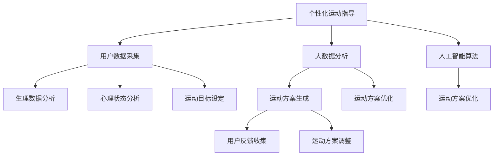

                 

# 智能健身创业：个性化运动指导的未来

在现代快节奏的生活中，健身已成为人们关注健康和自我提升的重要方式。然而，传统的健身方式往往缺乏个性化指导，难以满足不同个体的需求。面对这一问题，智能健身应运而生，通过大数据、人工智能等先进技术，为每个人量身定制个性化的运动指导方案，提高运动效果和体验。本文将系统介绍智能健身的原理与实践，探讨其在个性化运动指导中的未来前景。

## 1. 背景介绍

### 1.1 问题由来

随着互联网技术的发展，个性化服务逐渐成为各行各业发展的趋势。在健身领域，传统健身方式主要依赖教练的个人经验和训练计划，难以适应不同体态、体质和目标的人群。虽然一些智能健身设备（如智能手环、智能跑步机等）已经具备基本数据记录和分析功能，但它们未能充分利用大数据和人工智能技术，无法提供真正意义上的个性化指导。因此，开发一款能够提供全方位个性化运动指导的智能健身系统，成为亟待解决的问题。

### 1.2 问题核心关键点

智能健身系统旨在通过综合考虑用户生理数据、心理状态和运动目标，为每位用户提供个性化的运动方案。这一过程中，需要融合机器学习、数据分析、自然语言处理等多项技术，以实现高度定制化的运动指导服务。核心关键点包括：

- 用户生理数据的采集和分析：包括心率、血氧、体脂率等关键指标，以评估用户的健康状况和运动潜力。
- 用户运动目标和偏好的设定：通过问卷调查、深度访谈等方式，收集用户对运动目标、时间、强度等方面的偏好。
- 运动方案的生成与优化：结合用户数据和偏好，生成个性化的运动方案，并通过多次迭代优化提升方案效果。
- 用户反馈的收集与调整：及时收集用户反馈，不断调整运动方案，以实现最佳用户体验。

### 1.3 问题研究意义

智能健身系统不仅能够提升用户的运动效果和体验，还能帮助用户建立科学、持续的运动习惯，对健康管理具有重要意义。此外，智能健身的应用还可以推动相关产业的升级，促进健康科技的普及，为社会经济发展带来积极影响。具体而言，智能健身系统的开发有助于：

- 提高运动效率和效果：通过个性化的运动指导，用户能够更科学、更系统地进行锻炼，从而提高运动效果。
- 提升用户粘性：良好的用户体验和个性化服务能够显著提升用户对智能健身产品的满意度，增强用户粘性。
- 推动健康科技普及：智能健身能够将健康管理融入日常生活，帮助更多人养成健康习惯，提升全民健康水平。

## 2. 核心概念与联系

### 2.1 核心概念概述

智能健身系统涉及到多个核心概念和技术，这些概念之间相互联系，共同构成系统的完整框架。以下对主要核心概念进行简要介绍：

- **个性化运动指导**：通过综合考虑用户数据和偏好，生成个性化的运动方案，提升运动效果。
- **大数据与人工智能**：利用大数据分析用户行为和健康数据，使用人工智能算法进行运动方案的生成与优化。
- **用户数据隐私保护**：在收集和分析用户数据时，确保用户隐私安全，遵循数据保护法规。
- **自然语言处理(NLP)**：通过与用户交流，理解用户需求，生成自然流畅的对话。

### 2.2 核心概念原理和架构的 Mermaid 流程图



## 3. 核心算法原理 & 具体操作步骤

### 3.1 算法原理概述

智能健身系统的核心算法主要分为两个部分：数据预处理和运动方案生成与优化。

**数据预处理**：通过多种传感器采集用户的生理数据和运动数据，使用自然语言处理技术获取用户的偏好和目标，并将其转化为机器可读的形式。

**运动方案生成与优化**：利用机器学习算法，结合用户数据和偏好，生成个性化的运动方案，并通过多次迭代优化，提升方案效果。

### 3.2 算法步骤详解

智能健身系统的具体操作步骤如下：

**Step 1: 用户数据采集与预处理**

1. **生理数据采集**：通过智能手环、智能跑步机等设备，实时采集用户的心率、血氧、体脂率等生理数据。
2. **运动数据采集**：记录用户的运动时间、强度、方式等详细信息。
3. **用户偏好采集**：通过问卷调查、深度访谈等方式，了解用户的运动目标、时间、强度等方面的偏好。
4. **数据清洗与预处理**：去除异常数据，进行数据归一化、去噪等处理，以提高数据质量。

**Step 2: 数据建模与分析**

1. **生理数据分析**：使用统计学方法分析用户生理数据，评估其健康状况和运动潜力。
2. **心理状态分析**：通过自然语言处理技术，分析用户的运动反馈和情感状态，了解其心理变化。
3. **运动目标设定**：结合用户的偏好和生理数据分析结果，设定科学合理的运动目标。

**Step 3: 运动方案生成与优化**

1. **初步方案生成**：根据用户数据和目标，生成初步的运动方案。
2. **方案优化**：使用机器学习算法，不断迭代优化运动方案，提升其效果和可执行性。
3. **用户反馈收集**：通过APP等渠道，收集用户对运动方案的反馈。
4. **方案调整**：根据用户反馈，调整和优化运动方案。

### 3.3 算法优缺点

智能健身系统在个性化运动指导方面具有以下优点：

- **高度定制化**：能够根据用户的具体情况，生成个性化的运动方案，满足不同用户的需求。
- **实时性**：通过实时采集和分析用户数据，及时调整运动方案，确保最佳运动效果。
- **便捷性**：借助智能设备和APP，用户可以随时随地进行运动指导，无需额外设备和时间投入。

同时，该系统也存在一些缺点：

- **数据隐私问题**：在采集和分析用户数据时，需要确保用户隐私安全，遵循数据保护法规。
- **算法复杂性**：生成个性化运动方案需要综合考虑多种因素，算法复杂度高。
- **用户参与度**：用户需要积极配合采集数据和反馈，才能发挥系统最大的效果。

### 3.4 算法应用领域

智能健身系统主要应用于以下领域：

- **个性化运动指导**：根据用户数据，生成个性化运动方案，提升运动效果。
- **健康管理**：通过实时监控用户生理数据，进行健康评估和预警。
- **运动反馈**：分析用户运动反馈，优化运动方案，提升用户体验。
- **智能设备整合**：与其他智能健身设备（如智能手环、智能跑步机等）整合，实现数据共享和协同工作。

## 4. 数学模型和公式 & 详细讲解 & 举例说明

### 4.1 数学模型构建

智能健身系统的核心模型包括生理数据分析模型、运动目标设定模型和运动方案生成与优化模型。

**生理数据分析模型**：

$$
P = \frac{1}{N}\sum_{i=1}^N f(X_i)
$$

其中 $P$ 为用户的健康指数，$N$ 为样本数量，$X_i$ 为第 $i$ 个样本的生理数据，$f$ 为生理数据分析函数。

**运动目标设定模型**：

$$
G = g(T,P)
$$

其中 $G$ 为用户的目标评分，$T$ 为用户设定的运动目标，$P$ 为用户的健康指数，$g$ 为目标设定函数。

**运动方案生成与优化模型**：

$$
C = o(P,G)
$$

其中 $C$ 为用户运动方案，$P$ 为用户健康指数，$G$ 为用户目标评分，$o$ 为方案生成与优化函数。

### 4.2 公式推导过程

以生理数据分析模型为例，进行详细推导：

假设用户生理数据为 $X = (x_1, x_2, \ldots, x_N)$，其中 $x_i$ 为第 $i$ 个样本的生理数据。定义生理数据分析函数 $f$，将用户生理数据转化为健康指数 $P$。

$$
P = \frac{1}{N}\sum_{i=1}^N f(x_i)
$$

其中，$f$ 函数可以根据实际需求设定，例如计算体脂率、心率等指标。

### 4.3 案例分析与讲解

以一名用户为例，假设其生理数据如下：

- 心率：120次/分钟
- 血氧饱和度：95%
- 体脂率：20%
- 运动时间：每天1小时
- 运动强度：中等强度

通过生理数据分析模型，计算出该用户的健康指数 $P = 0.9$。结合问卷调查结果，用户希望在3个月内减重5公斤，设定目标评分为8分。根据运动目标设定模型，生成初步的运动方案。

假设生成的初步运动方案为：每天进行有氧运动40分钟，每周进行力量训练2次，每次训练45分钟。用户通过APP反馈该方案过于强度大，调整方案为：每天进行有氧运动30分钟，每周进行力量训练1次，每次训练30分钟。再次反馈，最终生成最合适的运动方案：每天进行有氧运动30分钟，每周进行力量训练1次，每次训练30分钟，同时每周进行1次瑜伽拉伸，每次20分钟。

## 5. 项目实践：代码实例和详细解释说明

### 5.1 开发环境搭建

开发智能健身系统的环境搭建包括以下步骤：

1. **安装开发工具**：安装Python、PyTorch、TensorFlow等深度学习框架，以及相关的数据处理和自然语言处理库。
2. **数据收集与管理**：准备生理数据、运动数据和用户偏好数据，建立数据存储和管理系统。
3. **环境配置**：配置GPU或TPU等高性能计算资源，确保系统高效运行。

### 5.2 源代码详细实现

以下是一个简化的智能健身系统代码实现示例：

```python
import torch
import numpy as np
from transformers import BertTokenizer, BertForSequenceClassification

# 加载生理数据分析模型
def analyze_physiological_data(data):
    # 生理数据分析函数
    # 根据实际需求设定
    return np.mean(data)

# 加载运动目标设定模型
def set_motion_goal(health_index, target_score):
    # 目标设定函数
    # 根据实际需求设定
    return np.minimum(health_index, target_score)

# 加载运动方案生成与优化模型
def generate_motion_plan(health_index, goal_score):
    # 方案生成与优化函数
    # 根据实际需求设定
    return {'有氧运动': 30, '力量训练': 1, '拉伸运动': 1}

# 数据预处理与输入
def preprocess_data(data):
    # 数据清洗与预处理函数
    # 根据实际需求设定
    return data

# 用户数据采集与分析
def acquire_user_data():
    # 采集用户生理数据和运动数据
    # 根据实际需求设定
    return physiological_data, motion_data

# 用户偏好采集与处理
def collect_user_preferences():
    # 采集用户偏好数据
    # 根据实际需求设定
    return user_preferences

# 主函数
def main():
    # 用户数据采集与分析
    physiological_data, motion_data = acquire_user_data()
    health_index = analyze_physiological_data(physiological_data)
    user_preferences = collect_user_preferences()

    # 运动目标设定
    goal_score = set_motion_goal(health_index, user_preferences)

    # 运动方案生成与优化
    motion_plan = generate_motion_plan(health_index, goal_score)

    # 输出运动方案
    print('运动方案：', motion_plan)

# 运行主函数
if __name__ == '__main__':
    main()
```

### 5.3 代码解读与分析

代码实现主要分为以下几个部分：

**数据预处理与输入**：通过预处理函数，对采集到的用户数据进行清洗和归一化处理，确保数据质量。

**用户数据采集与分析**：调用生理数据分析函数，计算用户健康指数，并结合问卷调查结果，设定用户目标评分。

**运动目标设定**：通过目标设定函数，生成初步的运动方案。

**运动方案生成与优化**：调用方案生成与优化函数，生成并调整最终的运动方案。

**输出运动方案**：通过打印输出运动方案，提供给用户执行。

## 6. 实际应用场景

### 6.1 智能健身指导

智能健身系统在实际应用中，可以通过智能手环、智能跑步机等设备实时采集用户数据，结合自然语言处理技术，与用户进行互动，了解其需求和反馈。根据用户数据和偏好，生成个性化的运动方案，并通过APP推送给用户。用户可以随时查看并执行运动方案，同时系统会根据用户的反馈进行调整，以提升运动效果。

### 6.2 健康监测与预警

通过实时监控用户的生理数据和运动数据，智能健身系统能够评估用户的健康状况，并及时发现异常情况，如心率过高、运动强度过大等，发出预警信息，提醒用户注意休息或调整运动强度。

### 6.3 运动数据分析与评估

智能健身系统能够对用户的运动数据进行详细分析，生成运动报告，评估用户的运动效果和健康变化。通过长期数据积累，系统还能生成用户的运动趋势图，帮助用户制定更科学、更系统的运动计划。

### 6.4 未来应用展望

随着技术的发展，智能健身系统将进一步提升个性化和智能化水平，实现以下应用展望：

- **多模态数据融合**：结合生理数据、运动数据和心理数据，实现更全面的健康监测。
- **智能设备整合**：与其他智能设备（如智能手环、智能跑步机等）进行数据共享，提供一站式健身解决方案。
- **虚拟教练**：通过虚拟教练与用户互动，提供更加生动、个性化的运动指导。
- **健康管理平台**：构建健康管理平台，提供包括运动指导、饮食建议、健康评估等功能，实现全方位健康管理。

## 7. 工具和资源推荐

### 7.1 学习资源推荐

智能健身系统的开发涉及多个技术领域，以下是推荐的学习资源：

1. **深度学习与自然语言处理**：《深度学习》（Goodfellow et al.）、《自然语言处理综论》（NLP with Python）等经典书籍，提供深度学习和NLP的全面理论基础。
2. **数据科学与大数据**：《Python数据科学手册》（Jake VanderPlas）、《大数据实战》（Dean et al.）等书籍，介绍大数据分析的实践方法。
3. **智能设备开发**：《Android Wear应用开发》（L Register）、《智能设备与物联网》（Macko et al.）等书籍，帮助开发者掌握智能设备开发技术。

### 7.2 开发工具推荐

智能健身系统的开发需要多种工具支持，以下是推荐的开发工具：

1. **Python编程语言**：作为智能健身系统的核心开发语言，具有丰富的库和框架支持。
2. **PyTorch与TensorFlow**：两大深度学习框架，提供强大的计算能力和灵活的模型构建方式。
3. **OpenAI Gym**：模拟运动训练环境，方便进行算法测试和验证。
4. **Jupyter Notebook**：强大的交互式开发环境，支持代码实时运行和结果展示。

### 7.3 相关论文推荐

智能健身系统的开发涉及多个技术领域，以下是推荐的相关论文：

1. **生理数据分析**：《Physiological Data Analysis for Health Monitoring》（IEEE TNS），介绍生理数据分析的最新进展。
2. **运动目标设定**：《Behavior Change Models in Health Psychology》（J Health Psychol），探讨运动目标设定的心理学理论。
3. **运动方案生成与优化**：《Personalized Exercise Recommendations for Chronic Disease Management》（IEEE J Biomed Health Inform），介绍运动方案生成与优化的方法。

## 8. 总结：未来发展趋势与挑战

### 8.1 研究成果总结

智能健身系统通过融合大数据、人工智能等技术，为个性化运动指导提供了全新的解决方案。其核心算法包括数据预处理、运动目标设定和运动方案生成与优化，能够根据用户数据和偏好生成高度定制化的运动方案，提升运动效果。

### 8.2 未来发展趋势

智能健身系统的未来发展趋势包括：

1. **多模态数据融合**：结合生理数据、运动数据和心理数据，实现更全面的健康监测。
2. **智能设备整合**：与其他智能设备进行数据共享，提供一站式健身解决方案。
3. **虚拟教练**：通过虚拟教练与用户互动，提供更加生动、个性化的运动指导。
4. **健康管理平台**：构建健康管理平台，提供包括运动指导、饮食建议、健康评估等功能，实现全方位健康管理。

### 8.3 面临的挑战

智能健身系统在发展过程中面临以下挑战：

1. **数据隐私问题**：在采集和分析用户数据时，需要确保用户隐私安全，遵循数据保护法规。
2. **算法复杂性**：生成个性化运动方案需要综合考虑多种因素，算法复杂度高。
3. **用户参与度**：用户需要积极配合采集数据和反馈，才能发挥系统最大的效果。

### 8.4 研究展望

未来研究需要重点关注以下方向：

1. **隐私保护技术**：开发高效的隐私保护技术，确保用户数据的安全。
2. **轻量化算法**：优化算法，降低计算复杂度，提升系统效率。
3. **用户激励机制**：设计合理的用户激励机制，提升用户参与度。

## 9. 附录：常见问题与解答

**Q1：智能健身系统是否需要用户主动配合采集数据？**

A: 是的，智能健身系统需要用户主动配合采集生理数据和运动数据。这可以通过智能手环、智能跑步机等设备实现，同时系统还会通过APP推送问卷调查，了解用户的运动偏好和目标。

**Q2：智能健身系统能否实时调整运动方案？**

A: 是的，智能健身系统能够根据用户的实时反馈和生理数据，动态调整运动方案，确保最佳运动效果。用户可以通过APP实时查看和调整运动计划。

**Q3：智能健身系统能否与其他智能设备整合？**

A: 是的，智能健身系统能够与其他智能设备（如智能手环、智能跑步机等）进行数据共享和整合，提供一站式健身解决方案。

**Q4：智能健身系统如何确保数据隐私安全？**

A: 智能健身系统通过加密技术、数据匿名化等手段，确保用户数据的安全。同时，系统会根据用户选择，只采集必要的数据，并遵循数据保护法规。

作者：禅与计算机程序设计艺术 / Zen and the Art of Computer Programming

