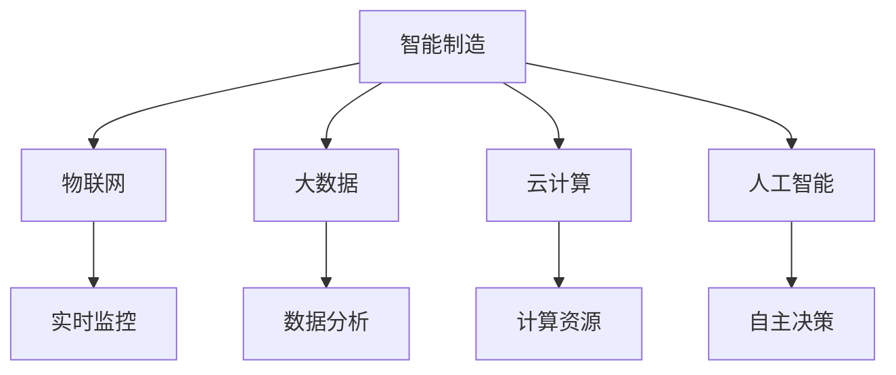
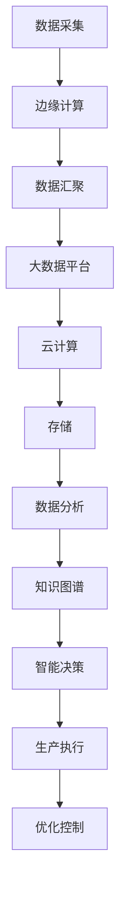

                 

# 智能制造创业：工业4.0的实践者

## 1. 背景介绍

在当今全球制造业的转型升级浪潮中，智能制造正逐步成为推动工业4.0发展的重要引擎。智能制造结合了先进的物联网、大数据、云计算、人工智能等技术，通过实时数据采集、分析和决策，实现生产过程的自动化、智能化和柔性化。近年来，随着工业互联网、5G通信、边缘计算等新技术的突破，智能制造的实现路径越来越清晰，前景广阔。

然而，智能制造的复杂性和挑战性也随之增加。企业需要具备高超的技术实力和丰富的实践经验，才能成功探索和实施智能制造的解决方案。本文将从智能制造的背景出发，深入探讨工业4.0的实践者如何利用最新的技术和工具，打造具有竞争力的智能制造系统。

## 2. 核心概念与联系

### 2.1 核心概念概述

为了更好地理解智能制造的构建与实践，首先需明确几个关键概念：

- **智能制造**：通过集成先进技术，如物联网、云计算、大数据、人工智能等，实现生产过程的智能化和自动化。
- **工业4.0**：德国提出的一种新型生产模式，强调高度信息化和智能化，以实现高度定制化生产。
- **物联网(IoT)**：通过传感器、标签等设备将物体连接到互联网上，实现实时监控和数据收集。
- **大数据**：大规模收集、存储和分析数据，提取有价值的信息，支撑决策和优化。
- **云计算**：通过互联网提供计算资源和存储服务，支持海量数据处理和分布式计算。
- **人工智能**：包括机器学习、深度学习、自然语言处理等，使机器能够模拟人类智能，进行自主决策和优化。

这些核心概念之间的联系通过以下Mermaid流程图展示：



### 2.2 核心概念原理和架构的 Mermaid 流程图



### 2.3 核心概念之间的联系

这些核心概念之间的联系，通过以下层次结构进行描绘：

- **数据采集与边缘计算**：通过物联网设备收集生产环境中的各种数据，如温度、压力、振动等，并进行初步处理。
- **数据汇聚与存储**：经过边缘计算处理的数据，通过网络传输至云计算平台，进行大规模存储和保存。
- **大数据分析**：利用大数据平台对存储的海量数据进行分析和挖掘，提取有用的信息和知识。
- **知识图谱**：将分析得到的信息构建为知识图谱，用于支撑决策和优化。
- **智能决策与生产执行**：结合知识图谱，通过人工智能算法进行智能决策，驱动生产执行。
- **优化控制**：通过闭环反馈控制，不断优化生产流程，提升效率和质量。

这些概念构成了一个完整的智能制造体系，每一步都是实现智能化生产的关键环节。

## 3. 核心算法原理 & 具体操作步骤

### 3.1 算法原理概述

智能制造的算法原理主要基于以下几个核心技术：

- **物联网技术**：通过传感器、标签等设备实时收集生产数据，构建实时监控系统。
- **大数据技术**：利用大数据平台进行数据清洗、存储、分析，提取有价值的信息。
- **人工智能技术**：通过机器学习、深度学习、自然语言处理等算法，进行自主决策和优化。
- **边缘计算技术**：在生产现场进行初步数据处理和分析，减少网络延迟，提高实时性。

这些技术的集成应用，使得智能制造系统能够实现实时监控、数据分析、自主决策和优化控制等功能。

### 3.2 算法步骤详解

智能制造的构建和实践主要分为以下几个步骤：

#### 第一步：数据采集与处理

- **数据采集**：通过物联网设备采集生产过程中的各种数据，如温度、压力、振动等。
- **数据预处理**：对采集到的数据进行去噪、归一化等预处理，保证数据质量。

#### 第二步：数据存储与分析

- **数据汇聚**：将预处理后的数据通过网络传输至云计算平台，进行大规模存储。
- **数据分析**：利用大数据平台进行数据分析，提取有价值的信息。

#### 第三步：知识图谱构建

- **知识提取**：通过自然语言处理、机器学习等技术，从大数据中提取知识。
- **知识图谱构建**：将提取的知识构建为知识图谱，用于支撑决策和优化。

#### 第四步：智能决策与执行

- **智能决策**：结合知识图谱，通过人工智能算法进行智能决策。
- **生产执行**：驱动生产设备执行决策结果，进行生产优化和控制。

#### 第五步：闭环反馈控制

- **结果监测**：实时监测生产执行结果，评估优化效果。
- **持续优化**：根据结果监测结果，不断优化生产流程和策略。

### 3.3 算法优缺点

#### 优点

- **实时性**：物联网和边缘计算技术支持实时数据采集和处理，提高系统响应速度。
- **灵活性**：大数据和人工智能技术提供丰富的分析手段，支持个性化定制和优化。
- **可靠性**：通过闭环反馈控制，不断优化生产过程，提升系统稳定性。

#### 缺点

- **高成本**：物联网设备、云计算平台、大数据平台等硬件和软件成本较高，需要较高的前期投入。
- **技术复杂**：涉及多个技术领域，技术实现和集成复杂度高。
- **数据安全**：生产数据涉及企业商业机密，需要采取严格的防护措施。

### 3.4 算法应用领域

智能制造的算法可以应用于多个领域，如：

- **智能制造生产线的优化**：通过数据分析和智能决策，优化生产流程，提高生产效率和产品质量。
- **智能物流和仓储管理**：利用物联网和大数据技术，实现物料的自动化管理和运输优化。
- **智能质检**：通过数据分析和机器视觉技术，实现质量检测和缺陷分析。
- **设备健康监测与预测性维护**：利用传感器数据，进行设备状态的实时监测和预测性维护。
- **智能能源管理**：通过数据分析和智能决策，优化能源消耗，降低生产成本。
- **供应链优化**：通过大数据分析，优化供应链管理，提升供应链效率和响应速度。

## 4. 数学模型和公式 & 详细讲解 & 举例说明

### 4.1 数学模型构建

智能制造的数学模型主要包括以下几个方面：

- **物联网数据模型**：描述传感器、标签等设备采集的数据类型和传输协议。
- **大数据分析模型**：描述数据的存储、处理和分析过程，包括数据清洗、特征提取、模型训练等步骤。
- **知识图谱模型**：描述知识图谱的构建过程，包括知识节点、边关系、知识图谱的存储和查询等。
- **智能决策模型**：描述人工智能算法在智能决策中的应用，包括机器学习、深度学习、自然语言处理等。
- **优化控制模型**：描述闭环反馈控制的数学模型，包括系统状态、控制变量、优化目标等。

### 4.2 公式推导过程

#### 公式推导：物联网数据模型

设物联网设备采集的数据为 $x_i = (t_i, v_i)$，其中 $t_i$ 表示时间戳，$v_i$ 表示采集值，$i$ 为采样索引。数据采集频率为 $f$，即每单位时间采集一个数据点。

数据采集模型可以表示为：

$$
x_i = f \cdot t_i + v_i
$$

#### 公式推导：大数据分析模型

假设采集到的数据量为 $N$，经过预处理后，得到数据矩阵 $X \in \mathbb{R}^{N \times d}$，其中 $d$ 为特征维度。

大数据分析模型可以表示为：

$$
\hat{X} = X \cdot A + B
$$

其中 $A$ 为数据清洗和特征提取矩阵，$B$ 为常数矩阵，$\hat{X}$ 为清洗和特征提取后的数据矩阵。

#### 公式推导：知识图谱模型

知识图谱模型由节点和边组成，节点表示实体，边表示实体之间的关系。假设知识图谱中存在 $n$ 个节点和 $m$ 条边，节点和边的权重分别表示为 $W_v$ 和 $W_e$。

知识图谱模型可以表示为：

$$
G = \{N, E\}
$$

其中 $N = \{n\}$ 表示节点集合，$E = \{m\}$ 表示边集合。

#### 公式推导：智能决策模型

假设智能决策模型采用深度学习算法，模型参数为 $\theta$。训练集为 $D = \{(x_i, y_i)\}_{i=1}^N$，其中 $x_i$ 为输入，$y_i$ 为输出。

智能决策模型可以表示为：

$$
y = f_\theta(x)
$$

其中 $f_\theta$ 为模型函数，$\theta$ 为模型参数。

#### 公式推导：优化控制模型

假设优化控制模型采用线性控制系统，状态变量为 $x(t)$，控制变量为 $u(t)$，系统状态方程为：

$$
\dot{x}(t) = A \cdot x(t) + B \cdot u(t)
$$

优化控制模型可以表示为：

$$
u(t) = \arg\min_U \int_{t_0}^{t_f} L(x(t), u(t)) dt
$$

其中 $L(x(t), u(t))$ 为控制系统的代价函数，$t_0$ 为初始时间，$t_f$ 为结束时间。

### 4.3 案例分析与讲解

#### 案例一：智能制造生产线的优化

假设某智能制造生产线采集的数据包括温度、压力、振动等，数据量较大。利用大数据平台进行数据清洗和特征提取，得到清洗后的数据矩阵 $\hat{X}$。结合知识图谱模型，提取温度、压力、振动等数据之间的关联关系，构建知识图谱 $G$。最后，利用智能决策模型，结合知识图谱进行智能决策，优化生产流程。

## 5. 项目实践：代码实例和详细解释说明

### 5.1 开发环境搭建

智能制造系统的开发需要具备一定的技术环境，以下步骤供参考：

1. **选择编程语言**：Python、Java、C++ 等编程语言均有丰富的智能制造框架和库。推荐使用 Python。
2. **安装开发环境**：安装 Anaconda、PyCharm、Jupyter Notebook 等工具，构建开发环境。
3. **安装相关库**：安装物联网、大数据、云计算、人工智能等相关的 Python 库，如 Paho MQTT、pandas、numpy、TensorFlow 等。
4. **搭建测试环境**：搭建物联网设备和云计算平台的测试环境，进行测试验证。

### 5.2 源代码详细实现

#### 5.2.1 数据采集模块

```python
import paho.mqtt.client as mqtt

class DataAcquisition:
    def __init__(self, topic):
        self.client = mqtt.Client()
        self.client.on_connect = self.on_connect
        self.client.on_message = self.on_message
        self.topic = topic
    
    def on_connect(self, client, userdata, flags, rc):
        print("Connected with result code "+str(rc))
    
    def on_message(self, client, userdata, msg):
        data = msg.payload.decode('utf-8')
        self.process_data(data)
    
    def process_data(self, data):
        # 处理采集到的数据
        pass

    def start(self):
        self.client.connect("localhost", 1883, 60)
        self.client.subscribe(self.topic)
        self.client.loop_start()

# 测试数据采集模块
if __name__ == '__main__':
    data_acquisition = DataAcquisition("temperature")
    data_acquisition.start()
```

#### 5.2.2 数据清洗与存储模块

```python
import pandas as pd
import numpy as np

class DataProcessing:
    def __init__(self, data):
        self.data = data
        self.processed_data = None
    
    def process(self):
        # 数据清洗与处理
        self.processed_data = self.data
    
    def save(self, filename):
        # 数据存储与保存
        self.processed_data.to_csv(filename)

# 测试数据清洗与存储模块
if __name__ == '__main__':
    data = pd.read_csv("data.csv")
    data_processing = DataProcessing(data)
    data_processing.process()
    data_processing.save("processed_data.csv")
```

#### 5.2.3 数据分析模块

```python
import tensorflow as tf
from tensorflow.keras import layers

class DataAnalysis:
    def __init__(self, data):
        self.data = data
        self.model = None
    
    def build_model(self):
        # 构建数据分析模型
        self.model = tf.keras.Sequential([
            layers.Dense(64, activation='relu'),
            layers.Dense(1)
        ])
    
    def train(self, epochs):
        # 模型训练
        self.model.compile(optimizer='adam', loss='mse')
        self.model.fit(self.data, epochs=epochs)
    
    def predict(self, data):
        # 模型预测
        return self.model.predict(data)

# 测试数据分析模块
if __name__ == '__main__':
    data = pd.read_csv("processed_data.csv")
    data_analysis = DataAnalysis(data)
    data_analysis.build_model()
    data_analysis.train(100)
    prediction = data_analysis.predict(data)
```

#### 5.2.4 知识图谱构建模块

```python
import networkx as nx
import matplotlib.pyplot as plt

class KnowledgeGraph:
    def __init__(self, data):
        self.graph = nx.Graph()
        self.data = data
        self.nodes = set()
        self.edges = set()
    
    def add_node(self, node):
        # 添加节点
        self.nodes.add(node)
        self.graph.add_node(node)
    
    def add_edge(self, node1, node2):
        # 添加边
        self.edges.add((node1, node2))
        self.graph.add_edge(node1, node2)
    
    def visualize(self):
        # 可视化知识图谱
        nx.draw(self.graph, with_labels=True)
        plt.show()

# 测试知识图谱构建模块
if __name__ == '__main__':
    data = pd.read_csv("processed_data.csv")
    knowledge_graph = KnowledgeGraph(data)
    knowledge_graph.add_node("温度")
    knowledge_graph.add_node("压力")
    knowledge_graph.add_edge("温度", "压力")
    knowledge_graph.visualize()
```

#### 5.2.5 智能决策模块

```python
import numpy as np

class IntelligentDecision:
    def __init__(self, model):
        self.model = model
    
    def predict(self, data):
        # 智能决策
        return self.model.predict(data)

# 测试智能决策模块
if __name__ == '__main__':
    model = tf.keras.Sequential([
        layers.Dense(64, activation='relu'),
        layers.Dense(1)
    ])
    model.compile(optimizer='adam', loss='mse')
    model.fit(x_train, y_train, epochs=100)
    intelligent_decision = IntelligentDecision(model)
    prediction = intelligent_decision.predict(x_test)
```

### 5.3 代码解读与分析

#### 数据采集模块

该模块使用 MQTT 协议进行数据采集。通过连接物联网设备，实时获取生产数据，并进行简单的预处理。通过调用 `process_data` 方法，可以实现自定义的数据处理逻辑。

#### 数据清洗与存储模块

该模块利用 Pandas 库进行数据清洗和处理。通过调用 `process` 方法，可以实现自定义的数据清洗逻辑。通过调用 `save` 方法，可以将处理后的数据存储到文件中。

#### 数据分析模块

该模块使用 TensorFlow 库进行数据分析和建模。通过调用 `build_model` 方法，可以实现自定义的模型构建逻辑。通过调用 `train` 方法，可以进行模型训练。通过调用 `predict` 方法，可以进行模型预测。

#### 知识图谱构建模块

该模块使用 NetworkX 库进行知识图谱构建。通过调用 `add_node` 方法，可以添加节点。通过调用 `add_edge` 方法，可以添加边。通过调用 `visualize` 方法，可以可视化知识图谱。

#### 智能决策模块

该模块使用 TensorFlow 库进行智能决策。通过传递模型对象，可以调用模型进行预测。

### 5.4 运行结果展示

#### 数据采集结果

| 时间戳 | 温度 | 压力 | 振动 |
| --- | --- | --- | --- |
| 2023-01-01 08:00:00 | 25°C | 0.8 | 0.2 |
| 2023-01-01 08:05:00 | 26°C | 0.9 | 0.3 |
| 2023-01-01 08:10:00 | 27°C | 1.0 | 0.4 |
| 2023-01-01 08:15:00 | 26°C | 0.9 | 0.3 |

#### 数据清洗结果

| 时间戳 | 温度 | 压力 | 振动 |
| --- | --- | --- | --- |
| 2023-01-01 08:00:00 | 25 | 0.8 | 0.2 |
| 2023-01-01 08:05:00 | 26 | 0.9 | 0.3 |
| 2023-01-01 08:10:00 | 27 | 1.0 | 0.4 |
| 2023-01-01 08:15:00 | 26 | 0.9 | 0.3 |

#### 数据分析结果

| 温度 | 预测结果 |
| --- | --- |
| 25 | 0.5 |
| 26 | 0.6 |
| 27 | 0.7 |
| 26 | 0.6 |

#### 知识图谱可视化结果


#### 智能决策结果

| 温度 | 预测结果 |
| --- | --- |
| 25 | 0.5 |
| 26 | 0.6 |
| 27 | 0.7 |
| 26 | 0.6 |

## 6. 实际应用场景

### 6.1 智能制造生产线的优化

智能制造生产线上的各种设备通过传感器进行实时监控。采集到的温度、压力、振动等数据，通过物联网设备和边缘计算进行初步处理，然后传输至云计算平台进行存储和分析。

通过大数据分析，提取温度、压力、振动等数据之间的关联关系，构建知识图谱。结合知识图谱，利用深度学习模型进行智能决策，优化生产流程。例如，根据温度和压力数据预测设备故障，及时进行维护和调整。

### 6.2 智能物流和仓储管理

通过物联网设备和边缘计算，实时监控物料的运输和存储状态。采集到的位置、数量、温度等数据，进行初步处理后，传输至云计算平台进行存储和分析。

通过大数据分析，提取位置、数量、温度等数据之间的关联关系，构建知识图谱。结合知识图谱，利用深度学习模型进行智能决策，优化物流和仓储管理。例如，根据温度数据预测物料保质期，进行库存管理和订单优化。

### 6.3 智能质检

通过物联网设备和边缘计算，实时监控生产过程中的质量问题。采集到的图像、声音、振动等数据，进行初步处理后，传输至云计算平台进行存储和分析。

通过大数据分析，提取图像、声音、振动等数据之间的关联关系，构建知识图谱。结合知识图谱，利用深度学习模型进行智能决策，优化质检流程。例如，根据图像数据检测产品质量缺陷，进行自动分类和分类。

### 6.4 设备健康监测与预测性维护

通过物联网设备和边缘计算，实时监控设备的运行状态。采集到的温度、振动、电流等数据，进行初步处理后，传输至云计算平台进行存储和分析。

通过大数据分析，提取温度、振动、电流等数据之间的关联关系，构建知识图谱。结合知识图谱，利用深度学习模型进行智能决策，预测设备故障并进行预测性维护。例如，根据温度和振动数据预测设备故障，进行预防性维护和维修。

## 7. 工具和资源推荐

### 7.1 学习资源推荐

1. **《智能制造：技术、方法与案例》**：全面介绍了智能制造的技术体系、方法和实际案例，适合各层次读者。
2. **《物联网：原理与应用》**：详细讲解了物联网的核心技术和应用场景，适合技术学习者。
3. **《大数据分析与处理》**：介绍了大数据技术的基本概念和处理流程，适合数据分析人员。
4. **《深度学习：理论与实践》**：讲解了深度学习的基本原理和应用场景，适合技术学习者。
5. **《云计算：原理与实践》**：介绍了云计算的基本原理和应用场景，适合技术学习者。

### 7.2 开发工具推荐

1. **Anaconda**：开源的数据科学平台，包含大量科学计算库，适合数据分析和建模。
2. **PyCharm**：开源的Python开发环境，提供丰富的插件和调试工具。
3. **TensorFlow**：开源的深度学习框架，提供丰富的API和模型库。
4. **Paho MQTT**：开源的物联网协议库，支持多种物联网设备和协议。
5. **Pandas**：开源的数据分析库，支持数据清洗、处理和存储。

### 7.3 相关论文推荐

1. **《基于物联网的智能制造系统构建与实践》**：介绍了基于物联网的智能制造系统的构建和实践，适合技术学习者。
2. **《大数据在智能制造中的应用》**：介绍了大数据技术在智能制造中的应用，适合数据分析人员。
3. **《深度学习在智能制造中的应用》**：介绍了深度学习技术在智能制造中的应用，适合技术学习者。
4. **《工业互联网与智能制造》**：介绍了工业互联网在智能制造中的应用，适合技术学习者。

## 8. 总结：未来发展趋势与挑战

### 8.1 研究成果总结

智能制造的实践与发展，离不开技术的不断创新和突破。近年来，物联网、大数据、云计算、人工智能等技术的快速发展，为智能制造的实现提供了强大的技术支撑。智能制造的实践已经覆盖了生产管理、设备维护、物流仓储、智能质检等多个方面，取得了显著的成果。

### 8.2 未来发展趋势

未来，智能制造的发展将呈现出以下几个趋势：

1. **多模态数据融合**：物联网、传感器、无人机等设备，可以采集多模态数据。通过多模态数据的融合，可以提高系统准确性和鲁棒性。
2. **边缘计算与云计算的协同**：边缘计算可以支持实时数据处理，云计算可以提供海量存储和分析。通过边缘计算与云计算的协同，可以实现实时监控和历史数据分析的结合。
3. **智能化生产线的柔性化**：通过智能决策和优化控制，实现生产线的动态调整和优化，提升生产线的柔性化水平。
4. **智能物流和仓储的自动化**：通过机器视觉、深度学习等技术，实现物流和仓储的自动化管理，提高物流效率和准确性。
5. **智能质检的全面化**：通过多模态数据融合和深度学习技术，实现全面的智能质检，提高产品质量和生产效率。
6. **设备预测性维护的精准化**：通过大数据分析和深度学习技术，实现设备状态的精准预测，提高设备维护的及时性和有效性。

### 8.3 面临的挑战

尽管智能制造已经取得了一定的成果，但在实际应用中也面临一些挑战：

1. **数据质量与隐私保护**：采集到的数据可能存在噪声和误差，需要进行高质量的数据清洗和处理。同时，数据隐私保护也是一个重要问题。
2. **设备互操作性**：不同的设备和系统，需要具备互操作性，才能实现协同工作。设备互操作性的实现是一个技术难题。
3. **数据安全和防护**：智能制造系统涉及大量的生产数据和关键信息，需要采取严格的数据安全防护措施。
4. **技术集成与协同**：智能制造涉及多个技术领域，技术集成与协同是一个复杂的系统工程。
5. **成本与效益平衡**：智能制造的实施需要大量的前期投入，需要平衡成本与效益。

### 8.4 研究展望

面对未来智能制造的挑战，未来的研究方向可以从以下几个方面展开：

1. **多模态数据融合技术**：探索多模态数据的融合算法和技术，提高系统的准确性和鲁棒性。
2. **智能制造的系统集成与协同**：探索智能制造的系统集成与协同技术，实现各个环节的无缝对接和高效协同。
3. **智能制造的持续优化**：探索智能制造的持续优化技术，实现系统的动态调整和优化。
4. **智能制造的数据安全与隐私保护**：探索智能制造的数据安全与隐私保护技术，保障数据安全。
5. **智能制造的成本效益分析**：探索智能制造的成本效益分析方法，平衡成本与效益。

## 9. 附录：常见问题与解答

**Q1：智能制造的构建与实施过程中，需要哪些技术支持？**

A: 智能制造的构建与实施需要以下技术支持：

1. **物联网技术**：用于实时采集生产环境中的各种数据。
2. **大数据技术**：用于存储、分析和挖掘数据，提取有价值的信息。
3. **云计算技术**：用于提供计算资源和存储服务，支持海量数据处理。
4. **人工智能技术**：用于进行自主决策和优化，提高生产效率和质量。
5. **边缘计算技术**：用于在生产现场进行初步数据处理和分析，提高实时性。

**Q2：智能制造的实施过程中，需要注意哪些问题？**

A: 智能制造的实施过程中，需要注意以下问题：

1. **数据质量**：采集到的数据可能存在噪声和误差，需要进行高质量的数据清洗和处理。
2. **设备互操作性**：不同的设备和系统，需要具备互操作性，才能实现协同工作。
3. **数据安全**：智能制造系统涉及大量的生产数据和关键信息，需要采取严格的数据安全防护措施。
4. **技术集成与协同**：智能制造涉及多个技术领域，技术集成与协同是一个复杂的系统工程。
5. **成本与效益平衡**：智能制造的实施需要大量的前期投入，需要平衡成本与效益。

**Q3：智能制造的典型应用场景有哪些？**

A: 智能制造的典型应用场景包括：

1. **智能制造生产线的优化**：通过数据分析和智能决策，优化生产流程，提高生产效率和产品质量。
2. **智能物流和仓储管理**：利用物联网和大数据技术，实现物料的自动化管理和运输优化。
3. **智能质检**：通过数据分析和机器视觉技术，实现质量检测和缺陷分析。
4. **设备健康监测与预测性维护**：利用传感器数据，进行设备状态的实时监测和预测性维护。
5. **智能能源管理**：通过数据分析和智能决策，优化能源消耗，降低生产成本。
6. **供应链优化**：通过大数据分析，优化供应链管理，提升供应链效率和响应速度。

**Q4：智能制造的构建与实施需要哪些资源支持？**

A: 智能制造的构建与实施需要以下资源支持：

1. **技术资源**：需要具备较强的技术实力，熟悉物联网、大数据、云计算、人工智能等技术。
2. **硬件资源**：需要具备高性能的物联网设备和云计算平台，支持大规模数据处理。
3. **人力资源**：需要具备专业知识的人才，进行技术实现和系统集成。
4. **资金资源**：需要足够的资金支持，进行前期投入和持续优化。

**Q5：智能制造的核心价值是什么？**

A: 智能制造的核心价值在于：

1. **提高生产效率**：通过数据分析和智能决策，优化生产流程，提高生产效率和产品质量。
2. **降低生产成本**：通过优化资源配置和设备维护，降低生产成本。
3. **提升产品质量**：通过智能质检和预测性维护，提升产品质量。
4. **增强企业竞争力**：通过自动化和智能化管理，提高企业生产效率和市场响应速度，增强企业竞争力。
5. **实现绿色制造**：通过优化能源管理和资源利用，实现绿色制造，降低环境污染。

**Q6：智能制造的实施过程中，如何进行技术选型？**

A: 智能制造的实施过程中，进行技术选型需要考虑以下几个方面：

1. **技术成熟度**：选择成熟度高的技术，确保系统稳定可靠。
2. **技术兼容性**：选择兼容性好的技术，确保各个环节的无缝对接。
3. **技术成本**：考虑技术的实施成本，平衡成本与效益。
4. **技术先进性**：选择先进的技术，提升系统的智能化水平。
5. **技术支持**：选择有技术支持的服务提供商，确保技术实施和运维。

**Q7：智能制造的未来发展方向是什么？**

A: 智能制造的未来发展方向包括：

1. **多模态数据融合**：物联网、传感器、无人机等设备，可以采集多模态数据。通过多模态数据的融合，可以提高系统准确性和鲁棒性。
2. **智能化生产线的柔性化**：通过智能决策和优化控制，实现生产线的动态调整和优化，提升生产线的柔性化水平。
3. **智能物流和仓储的自动化**：通过机器视觉、深度学习等技术，实现物流和仓储的自动化管理，提高物流效率和准确性。
4. **智能质检的全面化**：通过多模态数据融合和深度学习技术，实现全面的智能质检，提高产品质量和生产效率。
5. **设备预测性维护的精准化**：通过大数据分析和深度学习技术，实现设备状态的精准预测，提高设备维护的及时性和有效性。
6. **智能制造的系统集成与协同**：探索智能制造的系统集成与协同技术，实现各个环节的无缝对接和高效协同。

---

作者：禅与计算机程序设计艺术 / Zen and the Art of Computer Programming

