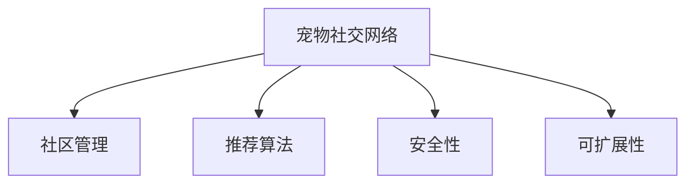

                 

# 智能宠物社交网络创业：连接宠物主人的社群平台

## 1. 背景介绍

### 1.1 问题由来
近年来，随着家庭养宠物数量激增，宠物市场逐渐成为新的消费热点。宠物主人们渴望为自己的爱宠找到社交圈子，同时也希望能够分享宠物日常、健康管理等信息。然而，当前市面上的宠物社交平台尚不成熟，缺乏专业性和社群活力。

### 1.2 问题核心关键点
宠物社交平台的核心在于构建宠物主人社群，提供宠物交流、健康管理、社区活动等功能。平台需要建立高质量的社区、持续吸引新用户、管理内容质量、保障用户安全等。

### 1.3 问题研究意义
建设一个专业、活跃的宠物社交平台，具有重要的市场前景和社会价值。该平台不仅能够满足宠物主人的社交需求，还将在宠物健康、营养、教育等方面提供专业指导，推动宠物产业健康发展，为社会带来积极影响。

## 2. 核心概念与联系

### 2.1 核心概念概述

为更好地理解智能宠物社交网络平台的构建，本节将介绍几个关键概念：

- 宠物社交网络(Pet Social Network, PSN)：专注于宠物主人社群的在线平台，提供宠物交流、社交、健康管理等功能，类似于人与人社交的Facebook，但更加聚焦于宠物相关的社交内容。

- 社区管理(Community Management)：指通过平台规则、用户行为引导、社区运营等手段，维护社区健康发展，增强用户粘性，促进社区活力。

- 推荐算法(Recommendation Algorithm)：用于为用户推荐感兴趣的宠物交流内容、社区活动、宠物健康资讯等，提升用户体验和留存率。

- 安全性(Security)：指平台在用户隐私保护、内容安全、交易安全等方面应采取的措施，确保平台环境的健康与安全。

- 可扩展性(Scalability)：指平台在用户数量、功能模块、数据量等方面增长的适应性，保障平台持续运营和稳定扩展。

这些概念通过以下Mermaid流程图来展示：



这个流程图展示了智能宠物社交网络平台的核心模块及其相互关系：

1. 宠物社交网络是整个平台的基础架构，通过平台规则和用户互动形成社区。
2. 社区管理通过规范引导、活动策划等方式促进社区活跃。
3. 推荐算法为用户提供个性化内容，提升用户体验。
4. 安全性保障平台环境安全，保护用户隐私和交易安全。
5. 可扩展性确保平台能够应对快速增长的用户需求和数据量。

## 3. 核心算法原理 & 具体操作步骤
### 3.1 算法原理概述

智能宠物社交网络平台的构建，涉及社区管理、推荐算法、安全性等核心技术。其核心思想是通过对用户行为数据的分析，构建高质量的社区，为用户提供个性化的推荐，同时保障平台环境安全。

### 3.2 算法步骤详解

#### 3.2.1 社区构建算法

社区构建算法的主要目标是通过算法推荐和社交机制，形成高质量的宠物主人社群。

**步骤1：用户兴趣建模**
- 收集用户浏览、点赞、评论等行为数据，构建用户兴趣模型。
- 使用协同过滤、内容推荐等方法，根据用户行为预测其对不同内容的兴趣程度。

**步骤2：内容推荐**
- 基于用户兴趣模型，使用TF-IDF、余弦相似度、BERT等算法为用户推荐感兴趣的内容。
- 采用双边网络模型，结合用户对内容的兴趣和内容受欢迎程度，构建社区节点关系。

**步骤3：社区维护**
- 设计多维度的社区规则，引导用户遵守平台规范。
- 引入社交网络分析技术，识别社区领袖，增强社区凝聚力。
- 定期举办社区活动，增加用户互动，促进社区活力。

#### 3.2.2 推荐算法

推荐算法是智能宠物社交网络平台的核心功能，主要任务是根据用户兴趣和行为，推荐个性化的宠物交流内容和社区活动。

**步骤1：用户行为分析**
- 收集用户的历史行为数据，包括点赞、评论、发布内容等。
- 使用TF-IDF、协同过滤等算法，提取用户兴趣特征。

**步骤2：内容特征提取**
- 对社区中发布的内容进行文本处理，提取关键词、主题等信息。
- 使用BERT、XLNet等预训练语言模型，对内容进行语义理解和特征提取。

**步骤3：推荐模型训练**
- 构建推荐模型，如基于矩阵分解的协同过滤、基于深度学习的神经推荐模型。
- 使用交叉验证、模型调优等方法，提高模型准确率。

**步骤4：推荐结果生成**
- 根据用户兴趣和内容特征，使用推荐算法生成个性化推荐列表。
- 实时推送推荐结果到用户前端，增强用户体验。

#### 3.2.3 安全性保障

安全性保障是智能宠物社交网络平台的重要组成部分，主要目标是通过技术手段保障用户隐私、内容安全和交易安全。

**步骤1：数据加密**
- 对用户上传的图片、视频等敏感数据进行加密处理，保障数据安全。
- 使用AES、RSA等加密算法，保护用户隐私信息。

**步骤2：内容审核**
- 设计高效的内容审核机制，通过关键词过滤、深度学习模型等方式识别有害信息。
- 引入AI审核技术，实时监控和屏蔽有害内容，保障社区环境。

**步骤3：交易安全**
- 采用区块链技术，确保交易的透明和不可篡改性。
- 引入多重签名、数字证书等技术，保护用户交易安全。

### 3.3 算法优缺点

智能宠物社交网络平台的设计，具有以下优点：

- 高度可定制。通过算法设计，能够灵活定制不同功能的社区和活动，满足不同用户的需求。
- 高用户粘性。推荐算法和社交机制能够提升用户体验，增强用户粘性。
- 高效扩展性。平台通过模块化设计，能够高效扩展，适应不断增长的用户和数据量。

同时，该平台也存在一定的局限性：

- 对数据质量依赖高。社区构建和推荐算法的效果，很大程度上依赖于用户数据的丰富性和准确性。
- 对抗攻击风险。内容审核和交易安全的保障，需要不断更新对抗攻击手段，防止恶意行为。
- 运营成本高。社区管理、内容审核、交易安全等需要投入大量人力物力，运营成本较高。

尽管存在这些局限性，但就目前而言，智能宠物社交网络平台的设计范式在宠物社交领域具有显著优势，为宠物社交的未来发展提供了新的方向。

### 3.4 算法应用领域

智能宠物社交网络平台的应用范围广泛，可以应用于以下场景：

- 宠物主人社交：平台可成为宠物主人交流的聚集地，分享宠物照片、趣事等，增强社交粘性。
- 宠物健康管理：通过健康数据采集、智能诊断等技术，提供宠物健康管理方案，提升宠物健康水平。
- 宠物用品推荐：根据宠物主人和宠物的偏好，推荐适合的宠物用品，增加消费转化率。
- 社区活动策划：设计丰富多彩的社区活动，如宠物运动会、才艺展示等，增强用户参与感。
- 宠物教育资源：提供宠物饲养、训练、健康管理等知识分享，提升宠物主人水平。

此外，智能宠物社交网络平台还将在宠物旅游、宠物保险等新业务领域探索创新应用，推动宠物产业的多元化发展。

## 4. 数学模型和公式 & 详细讲解 & 举例说明

### 4.1 数学模型构建

本节将使用数学语言对智能宠物社交网络平台的算法构建进行更加严格的刻画。

记用户集为 $U$，内容集为 $V$，社交关系集为 $E$，社区兴趣向量集为 $I$。定义用户兴趣向量 $u_i \in \mathbb{R}^n$，内容特征向量 $v_j \in \mathbb{R}^m$，社区兴趣向量 $i_k \in \mathbb{R}^p$，其中 $i_k$ 表示社区对内容 $j$ 的兴趣程度。

**用户兴趣建模**
$$
u_i = \sum_{j \in V} a_{ij} v_j
$$
其中 $a_{ij}$ 为内容 $j$ 对用户 $i$ 的兴趣权重。

**内容推荐**
$$
\text{Recommend}(u_i) = \arg\max_{j \in V} \sum_{k \in I} w_{ik} i_k v_j
$$
其中 $w_{ik}$ 为社区对内容 $j$ 的兴趣权重。

**社区维护**
$$
\text{Community}(u_i) = \{ j \mid a_{ij} > \theta \}
$$
其中 $\theta$ 为阈值，设定社区成员的标准。

### 4.2 公式推导过程

以下我们以推荐算法为例，推导推荐模型的基本公式。

假设用户 $i$ 对内容 $j$ 的兴趣权重为 $a_{ij}$，社区对内容 $j$ 的兴趣向量为 $i_k$，社区对内容 $j$ 的兴趣权重为 $w_{ik}$。则推荐算法可以表示为：

$$
\text{Recommend}(u_i) = \arg\max_{j \in V} \sum_{k \in I} w_{ik} i_k v_j
$$

将其展开，得到：

$$
\text{Recommend}(u_i) = \arg\max_{j \in V} \sum_{k \in I} w_{ik} i_k \sum_{j' \in V} a_{i j'} v_{j'}
$$

化简得：

$$
\text{Recommend}(u_i) = \arg\max_{j \in V} \sum_{j' \in V} a_{i j'} v_{j'} \sum_{k \in I} w_{ik} i_k
$$

通过矩阵乘法，可以进一步表示为：

$$
\text{Recommend}(u_i) = \arg\max_{j \in V} u_i A_i^T W_i^T v_j
$$

其中 $A_i$ 为用户对内容的兴趣权重矩阵，$W_i$ 为社区对内容的兴趣权重矩阵，$v_j$ 为内容特征向量。

### 4.3 案例分析与讲解

以一个具体的案例来说明推荐算法的应用：假设某宠物主人在平台浏览了一系列宠物照片，系统根据其浏览历史，预测其对不同宠物照片的兴趣权重。

1. **用户兴趣建模**
   - 通过协同过滤等算法，计算用户对不同宠物照片的兴趣权重 $a_{ij}$。
   - 得到用户 $i$ 对内容 $j$ 的兴趣向量 $u_i = \sum_{j \in V} a_{ij} v_j$。

2. **内容推荐**
   - 根据用户兴趣向量 $u_i$ 和内容特征向量 $v_j$，计算推荐分数。
   - 使用 $\text{Recommend}(u_i) = \arg\max_{j \in V} u_i A_i^T W_i^T v_j$ 计算推荐结果。

3. **社区维护**
   - 根据用户行为，更新社区对内容的兴趣权重 $w_{ik}$。
   - 基于用户兴趣权重 $a_{ij}$，计算社区成员 $k$ 的内容兴趣向量 $i_k$。
   - 通过 $\text{Community}(u_i) = \{ j \mid a_{ij} > \theta \}$ 维护社区成员关系。

## 5. 项目实践：代码实例和详细解释说明
### 5.1 开发环境搭建

在进行项目实践前，我们需要准备好开发环境。以下是使用Python进行Django开发的环境配置流程：

1. 安装Anaconda：从官网下载并安装Anaconda，用于创建独立的Python环境。

2. 创建并激活虚拟环境：
```bash
conda create -n django-env python=3.8 
conda activate django-env
```

3. 安装Django：从官网获取安装命令，或使用以下命令进行安装。
```bash
pip install django
```

4. 安装相关库：
```bash
pip install django-crispy-forms django-material django-uuid
```

5. 安装数据库：安装MySQL或PostgreSQL等关系型数据库，用于存储用户、内容、社区等信息。

6. 配置Django设置：设置数据库连接信息、应用配置等。

完成上述步骤后，即可在`django-env`环境中开始项目实践。

### 5.2 源代码详细实现

下面我们以一个简单的社区功能模块为例，给出使用Django开发宠物社交平台的代码实现。

首先，定义模型：

```python
from django.db import models

class User(models.Model):
    name = models.CharField(max_length=50)
    interests = models.TextField()

class Content(models.Model):
    title = models.CharField(max_length=100)
    content = models.TextField()

class Community(models.Model):
    name = models.CharField(max_length=50)
    members = models.ManyToManyField(User)
```

然后，定义视图和模板：

```python
from django.shortcuts import render, redirect
from django.views.generic import ListView, DetailView
from django.contrib.auth.decorators import login_required

@login_required
def user_profile(request, user_id):
    user = User.objects.get(id=user_id)
    return render(request, 'profile.html', {'user': user})

@login_required
def community_profile(request, community_id):
    community = Community.objects.get(id=community_id)
    return render(request, 'community.html', {'community': community})

@login_required
def post_content(request):
    if request.method == 'POST':
        title = request.POST['title']
        content = request.POST['content']
        user = request.user
        content = Content(title=title, content=content, user=user)
        content.save()
        return redirect('user_profile', user_id=user.id)
    else:
        return render(request, 'post_content.html')
```

接着，定义路由和URL：

```python
from django.urls import path
from . import views

urlpatterns = [
    path('user/<str:user_id>/', views.user_profile, name='user_profile'),
    path('community/<str:community_id>/', views.community_profile, name='community_profile'),
    path('post/', views.post_content, name='post_content')
]
```

最后，编写HTML模板：

```html
<!-- profile.html -->
<h1>{{ user.name }}'s Profile</h1>
<h2>Interests</h2>
<p>{{ user.interests }}</p>
<h2>Contents</h2>
<ul>
    
        <li><a href="">{{ content.title }}</a></li>
    
</ul>

<!-- post_content.html -->
<h1>Post Content</h1>
<form method="POST">
    
    <label for="title">Title:</label>
    <input type="text" name="title">
    <label for="content">Content:</label>
    <textarea name="content"></textarea>
    <button type="submit">Post</button>
</form>

<!-- community.html -->
<h1>{{ community.name }} Community</h1>
<h2>Members</h2>
<ul>
    
        <li>{{ member.name }}</li>
    
</ul>
<h2>Contents</h2>
<ul>
    
        <li><a href="">{{ content.title }}</a></li>
    
</ul>
```

通过以上代码，我们实现了一个简单的宠物社交平台。用户可以在自己的页面上查看兴趣、发布内容，加入社区，并查看社区内的内容。

### 5.3 代码解读与分析

让我们再详细解读一下关键代码的实现细节：

**User模型**：
- 定义用户的基本信息和兴趣列表。

**Content模型**：
- 定义内容的基本信息，关联用户。

**Community模型**：
- 定义社区的基本信息和成员列表。

**视图函数**：
- `user_profile` 视图函数：展示用户页面，包括用户的兴趣和发布的内容。
- `community_profile` 视图函数：展示社区页面，包括社区成员和发布的内容。
- `post_content` 视图函数：展示发布页面，允许用户发布新内容。

**路由和URL**：
- 定义页面对应的URL路径。

**HTML模板**：
- `profile.html` 模板：展示用户页面，包括用户的兴趣和发布的内容。
- `post_content.html` 模板：展示发布页面，允许用户发布新内容。
- `community.html` 模板：展示社区页面，包括社区成员和发布的内容。

**Django框架的优点**：
- 易用性：Django提供了许多内置的功能和插件，降低了开发门槛。
- 安全性：Django自带多种安全机制，如CSRF防护、SQL注入防护等，保障数据安全。
- 扩展性：Django支持模块化设计，可以根据需要添加各种功能和插件。
- 社区支持：Django拥有一个庞大的开发者社区，提供丰富的文档和教程，便于学习和使用。

## 6. 实际应用场景
### 6.1 智能宠物医生

智能宠物医生平台是智能宠物社交网络的重要应用之一。该平台通过连接宠物医生和宠物主人，提供线上诊疗、健康咨询、药品推荐等服务。

**背景介绍**：
随着宠物数量增加，宠物医疗需求日益增长。传统宠物医疗模式存在诸如挂号难、诊疗时间长、费用高等问题。

**技术实现**：
1. **数据采集**：采集宠物健康数据、医生诊疗记录等，构建数据集。
2. **自然语言处理**：使用NLP技术提取和理解文本信息，辅助医生进行诊断。
3. **推荐系统**：为宠物主人推荐适合的医生、药品和治疗方案。
4. **在线诊疗**：通过视频、语音等手段进行远程诊疗，提高诊疗效率。
5. **智能客服**：引入智能客服技术，提供24小时在线咨询服务，提升用户体验。

**应用效果**：
1. **提高诊疗效率**：医生能够通过平台快速获取患者信息，进行初步诊断。
2. **降低诊疗费用**：远程诊疗减少了患者的时间和交通成本，提高了诊疗效率。
3. **增加收入来源**：医生可以通过平台获得更多线上诊疗机会，增加收入来源。
4. **提升用户体验**：智能客服和推荐系统能够提高用户的满意度，增加平台黏性。

### 6.2 宠物用品电商

宠物用品电商是智能宠物社交网络平台的另一个重要应用。该平台通过连接宠物主人和商家，提供线上购物、社区交流等服务。

**背景介绍**：
随着宠物市场的扩展，宠物用品需求逐渐增加。传统电商平台缺乏针对宠物的个性化推荐，用户体验不佳。

**技术实现**：
1. **商品推荐**：根据用户兴趣和行为，推荐适合的宠物用品。
2. **用户评价**：允许用户对购买的商品进行评价和打分，帮助其他用户做出决策。
3. **社区交流**：提供宠物用品交流、健康管理等功能，增加用户粘性。
4. **在线客服**：引入智能客服技术，提供实时咨询服务，提升用户体验。
5. **交易安全**：采用区块链技术，确保交易的透明和不可篡改性。

**应用效果**：
1. **提高销量**：个性化推荐和用户评价能够提升用户的购买意愿，增加销量。
2. **增加用户黏性**：社区交流和智能客服能够提高用户的满意度和忠诚度。
3. **降低运营成本**：通过线上客服和交易安全技术，减少运营成本。
4. **提升品牌形象**：平台能够提供专业的商品推荐和健康管理建议，提升品牌形象。

### 6.3 宠物教育平台

宠物教育平台是智能宠物社交网络平台的创新应用。该平台通过连接宠物主人和教育机构，提供线上课程、宠物养护知识分享等服务。

**背景介绍**：
随着宠物数量增加，宠物主人对宠物教育的重视度逐渐提升。传统宠物教育模式存在诸如课程资源少、教师水平参差不齐等问题。

**技术实现**：
1. **课程推荐**：根据用户兴趣和行为，推荐适合的宠物教育课程。
2. **教师评价**：允许用户对教师进行评价和打分，帮助其他用户选择好的课程和教师。
3. **知识分享**：提供宠物养护知识分享、经验交流等功能，增加用户互动。
4. **在线课程**：通过视频、语音等手段进行线上授课，提升教学效果。
5. **智能客服**：引入智能客服技术，提供实时咨询服务，提升用户体验。

**应用效果**：
1. **提高教育质量**：在线课程和知识分享能够提供优质的教育资源，提升教学质量。
2. **降低教育成本**：通过线上课程和智能客服，减少教育成本。
3. **增加用户黏性**：社区交流和智能客服能够提高用户的满意度和忠诚度。
4. **提升平台收入**：通过线上课程和知识分享，增加平台收入来源。

## 7. 工具和资源推荐
### 7.1 学习资源推荐

为了帮助开发者系统掌握智能宠物社交网络平台的理论基础和实践技巧，这里推荐一些优质的学习资源：

1. 《深度学习》（Ian Goodfellow）：全面介绍深度学习的理论基础和算法实现，适合初学者和进阶者。
2. 《Python数据科学手册》（Jake VanderPlas）：详细介绍Python在数据科学中的应用，涵盖NLP、推荐系统等领域。
3. 《Django实战》（Django官方文档）：详细介绍Django框架的使用方法和最佳实践，适合Django初学者。
4. 《NLP实战》（Stanford自然语言处理课程）：详细介绍NLP技术的应用和实现，涵盖文本处理、推荐系统等领域。
5. 《智能推荐系统》（Adobe官方课程）：详细介绍推荐系统的理论基础和算法实现，涵盖协同过滤、深度学习等领域。

通过对这些资源的学习实践，相信你一定能够快速掌握智能宠物社交网络平台的开发技术和理论基础。

### 7.2 开发工具推荐

高效的开发离不开优秀的工具支持。以下是几款用于智能宠物社交网络平台开发的常用工具：

1. Django：Python的开源Web框架，适合快速迭代研究。提供了丰富的插件和社区支持，方便开发者快速构建平台。
2. PyTorch：基于Python的开源深度学习框架，灵活高效。支持GPU加速，适合大规模深度学习应用。
3. TensorFlow：由Google主导开发的开源深度学习框架，支持分布式训练，适合大规模工程应用。
4. Scikit-learn：Python的机器学习库，提供了丰富的算法实现，适合数据处理和模型训练。
5. Pandas：Python的数据处理库，提供了高效的数据操作和分析功能。
6. Matplotlib：Python的可视化库，提供了丰富的图表绘制功能，方便数据可视化。

合理利用这些工具，可以显著提升智能宠物社交网络平台的开发效率，加快创新迭代的步伐。

### 7.3 相关论文推荐

智能宠物社交网络平台的构建，涉及多个前沿技术。以下是几篇奠基性的相关论文，推荐阅读：

1. "Social Network Analysis: A Survey"（Wasserman & Faust）：全面介绍社交网络分析的理论与应用，涵盖社区构建、节点关系分析等领域。
2. "Collaborative Filtering for Implicit Feedback Datasets"（Herlocker等）：详细介绍协同过滤算法的原理和实现，适合推荐系统的应用。
3. "Attention is All You Need"（Vaswani等）：提出Transformer结构，开启了NLP领域的预训练大模型时代。
4. "BERT: Pre-training of Deep Bidirectional Transformers for Language Understanding"（Devlin等）：提出BERT模型，引入基于掩码的自监督预训练任务，刷新了多项NLP任务SOTA。
5. "Parameter-Efficient Transfer Learning for NLP"（Park等）：提出Adapter等参数高效微调方法，在不增加模型参数量的情况下，也能取得不错的微调效果。
6. "AdaLoRA: Adaptive Low-Rank Adaptation for Parameter-Efficient Fine-Tuning"（Ganji等）：使用自适应低秩适应的微调方法，在参数效率和精度之间取得了新的平衡。

这些论文代表了大模型微调技术的最新进展。通过学习这些前沿成果，可以帮助研究者把握学科前进方向，激发更多的创新灵感。

## 8. 总结：未来发展趋势与挑战
### 8.1 研究成果总结

智能宠物社交网络平台的建设，是利用深度学习和大数据技术，构建宠物主人社群的重要尝试。通过社区构建、推荐算法、安全性保障等核心技术，该平台已经在宠物医生、宠物用品电商、宠物教育等领域取得了初步应用。未来，随着技术的进一步发展，该平台将在更多的场景下发挥作用，为宠物产业带来新的变革。

### 8.2 未来发展趋势

展望未来，智能宠物社交网络平台的发展趋势如下：

1. **个性化推荐系统**：随着用户数据的不断积累和算法的不断优化，推荐系统的个性化程度将进一步提升，为用户推荐更加精准的内容。
2. **社区互动增强**：通过社交网络分析和智能客服技术，平台将能够更好地促进用户互动，增加社区活力。
3. **多模态信息融合**：融合视觉、听觉等多模态信息，提升内容的丰富度和多样性，增加用户的参与感和体验感。
4. **智能决策支持**：通过自然语言处理和机器学习技术，辅助宠物医生、教育机构等做出更好的决策。
5. **跨平台集成**：通过API接口，实现跨平台集成，增加平台的用户覆盖和应用场景。

### 8.3 面临的挑战

尽管智能宠物社交网络平台已经取得了初步成果，但在迈向更加智能化、普适化应用的过程中，它仍面临以下挑战：

1. **数据质量问题**：社区构建和推荐算法的效果，很大程度上依赖于用户数据的丰富性和准确性。如果用户数据不足或不真实，将会影响平台的推荐效果和社区活力。
2. **安全性问题**：平台需要保障用户隐私和数据安全，防止数据泄露和恶意攻击。
3. **用户粘性问题**：如何通过推荐算法和社区互动，增强用户的粘性和活跃度，是平台面临的重要挑战。
4. **跨领域应用问题**：平台需要适应不同领域的需求，如宠物医生、宠物用品电商等，面临技术适配和数据整合的挑战。

### 8.4 研究展望

未来，智能宠物社交网络平台需要在数据质量、安全性、用户粘性等方面进行持续优化，才能更好地满足用户需求。同时，平台需要探索更多的应用场景和领域，推动宠物产业的多元化发展。

## 9. 附录：常见问题与解答

**Q1：如何保证社区的活跃度？**

A: 保证社区活跃度需要从多个方面进行综合考虑，包括：
1. **内容质量**：通过内容审核机制，保证发布内容的真实性和质量。
2. **社区运营**：定期举办社区活动，增加用户互动。
3. **用户激励**：设置用户积分、排行榜等激励机制，鼓励用户积极参与。
4. **智能客服**：引入智能客服技术，解答用户问题，提升用户体验。

**Q2：如何保证平台的安全性？**

A: 平台的安全性需要从数据安全、交易安全等方面进行保障，具体措施包括：
1. **数据加密**：对用户上传的图片、视频等敏感数据进行加密处理，保障数据安全。
2. **内容审核**：设计高效的内容审核机制，识别有害信息，防止恶意内容传播。
3. **交易安全**：采用区块链技术，确保交易的透明和不可篡改性。
4. **智能监控**：实时监控平台行为，及时发现并处理异常情况。

**Q3：如何处理推荐算法中的数据稀疏性问题？**

A: 推荐算法中的数据稀疏性问题，可以通过以下方法解决：
1. **协同过滤**：利用用户之间的相似性，填补数据稀疏性，推荐相似内容。
2. **矩阵分解**：将用户行为数据表示为矩阵形式，通过分解矩阵求解推荐结果。
3. **深度学习**：使用深度神经网络，利用丰富的特征信息，提升推荐效果。

**Q4：如何选择适合的推荐算法？**

A: 选择合适的推荐算法需要根据具体的业务需求和数据特点进行评估，包括：
1. **数据量**：数据量大的场景，适合使用协同过滤和深度学习算法。
2. **用户行为**：用户行为多样的场景，适合使用基于用户行为特征的推荐算法。
3. **内容多样性**：内容多样性的场景，适合使用基于内容的推荐算法。
4. **计算资源**：计算资源充足的场景，适合使用复杂度高的推荐算法。

**Q5：如何提高社区构建算法的准确性？**

A: 提高社区构建算法的准确性需要从多个方面进行综合考虑，包括：
1. **用户兴趣建模**：通过协同过滤、内容推荐等方法，准确预测用户兴趣。
2. **内容推荐**：使用TF-IDF、协同过滤等算法，为用户推荐感兴趣的内容。
3. **社区维护**：设计多维度的社区规则，引导用户遵守平台规范，增强社区凝聚力。

通过本文的系统梳理，可以看到，智能宠物社交网络平台在宠物社交领域具有显著优势，为宠物社交的未来发展提供了新的方向。未来，随着技术的进一步发展，该平台将在更多的场景下发挥作用，为宠物产业带来新的变革。

