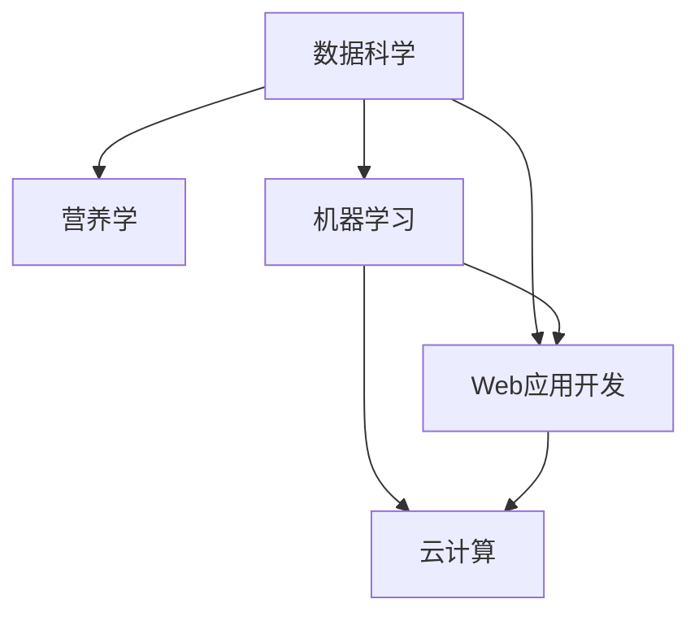

                 

# 智能宠物饮食管理创业：个性化的宠物营养方案

## 1. 背景介绍

### 1.1 问题由来

随着人们生活水平的提高和宠物数量的增加，宠物主对宠物健康、饮食的关注度也在不断提高。传统的饮食方式往往依赖于人工判断和经验，难以提供个性化的饮食方案。另外，宠物主因时间、知识水平和经验不足等原因，在为宠物选择营养均衡的食物时往往无从下手，容易出现喂养不当或营养失衡的情况。因此，开发一款智能宠物饮食管理平台，能够根据宠物的具体情况，提供个性化的饮食方案，成为一项非常有意义的技术创新。

### 1.2 问题核心关键点

智能宠物饮食管理平台的核心关键点包括以下几点：
- **数据获取与处理**：收集和分析宠物的历史健康数据、饮食偏好和活动量，为制定个性化饮食方案提供数据支撑。
- **营养模型构建**：构建基于营养学知识的宠物营养模型，以提供科学的饮食建议。
- **用户交互设计**：设计易于使用的界面，便于宠物主输入宠物信息，并及时获取饮食建议。
- **系统集成与部署**：将营养模型与用户界面集成，并通过云服务部署，使平台可以随时随地使用。

## 2. 核心概念与联系

### 2.1 核心概念概述

为更好地理解智能宠物饮食管理平台，本节将介绍几个密切相关的核心概念：

- **数据科学**：涉及数据的收集、处理、分析和可视化，为平台提供决策依据。
- **营养学**：研究人体所需营养素的种类和数量，为制定科学的饮食方案提供理论支持。
- **机器学习**：利用算法和模型，对大量数据进行学习和预测，为平台提供个性化的饮食建议。
- **Web应用开发**：使用HTML、CSS和JavaScript等技术，开发易于使用的用户界面。
- **云计算**：通过云平台进行资源部署，支持平台的高可用性和可扩展性。

这些核心概念之间的逻辑关系可以通过以下Mermaid流程图来展示：



这个流程图展示了几大核心概念之间的关系：

1. 数据科学和营养学为机器学习提供理论基础和数据支撑。
2. 机器学习基于数据科学和营养学的知识，对用户数据进行分析和预测。
3. Web应用开发将机器学习模型集成到用户界面，使其可被用户方便使用。
4. 云计算提供平台的基础设施支持，保证系统的稳定性和可扩展性。

## 3. 核心算法原理 & 具体操作步骤

### 3.1 算法原理概述

智能宠物饮食管理平台的核心算法原理基于数据科学、营养学和机器学习的结合。具体来说，平台首先收集和处理宠物的历史数据，构建宠物营养模型，然后使用机器学习算法根据输入的数据提供个性化的饮食建议。

### 3.2 算法步骤详解

智能宠物饮食管理平台的主要算法步骤如下：

1. **数据收集与处理**：通过移动应用或网站收集宠物主输入的宠物年龄、体重、活动量、饮食习惯等信息，并将其存储在数据库中。

2. **数据清洗与预处理**：对收集到的数据进行清洗，去除噪声和缺失值，并进行标准化处理。

3. **特征提取与选择**：从清洗后的数据中提取关键特征，如年龄、体重、活动量等，并使用特征选择技术筛选出对预测结果有重要影响的特征。

4. **营养模型构建**：基于营养学知识，构建宠物营养模型。该模型可以是一个线性回归模型、决策树模型或神经网络模型，用于根据输入特征预测宠物的营养需求。

5. **模型训练与优化**：使用收集到的历史数据对营养模型进行训练，并使用交叉验证等方法对模型进行优化。

6. **个性化饮食建议**：将输入的新数据（如当前体重、活动量等）输入到训练好的营养模型中，得到个性化的饮食建议，如每日所需蛋白质、碳水化合物和脂肪的摄入量。

7. **用户交互与反馈**：通过用户界面展示饮食建议，并收集用户反馈，进一步优化模型。

### 3.3 算法优缺点

智能宠物饮食管理平台的算法具有以下优点：
- **个性化推荐**：能够根据宠物的具体情况，提供个性化的饮食建议。
- **科学依据**：基于营养学知识，提供科学的饮食方案。
- **动态调整**：能够根据宠物的生长情况和体重变化，动态调整饮食建议。

然而，该算法也存在以下缺点：
- **数据依赖**：平台的效果很大程度上依赖于数据的质量和数量。
- **模型复杂**：营养模型的构建需要专业知识，模型过于复杂可能导致难以解释。
- **用户接受度**：部分宠物主可能对机器推荐的食物持怀疑态度，需要教育和引导。

### 3.4 算法应用领域

智能宠物饮食管理平台的算法应用领域包括但不限于：
- 宠物饮食管理：为宠物提供个性化的饮食方案。
- 宠物健康监测：通过分析宠物的饮食和活动数据，监测其健康状况。
- 宠物体重管理：根据宠物的营养需求，推荐合适的食物，帮助控制体重。
- 宠物行为分析：分析宠物的行为数据，提供更全面的饮食建议。
- 宠物训练辅助：通过饮食方案优化，辅助宠物训练。

## 4. 数学模型和公式 & 详细讲解 & 举例说明

### 4.1 数学模型构建

智能宠物饮食管理平台的数学模型主要基于营养学知识构建。以蛋白质需求为例，根据世界卫生组织推荐的蛋白质摄入量标准，构建如下线性回归模型：

$$
y = \beta_0 + \beta_1x_1 + \beta_2x_2 + \cdots + \beta_nx_n + \epsilon
$$

其中，$y$为每日蛋白质需求量，$x_i$为第$i$个特征（如年龄、体重、活动量等），$\beta$为对应特征的系数，$\epsilon$为误差项。

### 4.2 公式推导过程

以年龄和体重为例，推导线性回归模型中年龄和体重对蛋白质需求量的影响。

首先，收集年龄为$a$，体重为$w$的$n$个样本数据$(\{x_i, y_i\})_{i=1}^n$，其中$y_i$为第$i$个样本的蛋白质需求量。模型的目标是最小化如下损失函数：

$$
\mathcal{L}(\beta) = \frac{1}{n}\sum_{i=1}^n (y_i - (\beta_0 + \beta_1x_{1,i} + \beta_2x_{2,i} + \cdots + \beta_nx_{n,i}))^2
$$

对$\beta$求偏导数，得到：

$$
\frac{\partial \mathcal{L}(\beta)}{\partial \beta_j} = \frac{2}{n}\sum_{i=1}^n (y_i - \hat{y}_i)(y_i - \hat{y}_i)x_{j,i}
$$

其中$\hat{y}_i = \beta_0 + \beta_1x_{1,i} + \beta_2x_{2,i} + \cdots + \beta_nx_{n,i}$为第$i$个样本的预测值。

### 4.3 案例分析与讲解

以一只2岁的普通狗狗为例，体重为10kg，每天运动2小时。根据模型预测，该狗狗每天所需的蛋白质需求量为：

$$
y = \beta_0 + \beta_1x_1 + \beta_2x_2
$$

其中$x_1$为年龄，$x_2$为体重，$x_3$为活动量。通过求解最小二乘法，可以得到$\beta_0, \beta_1, \beta_2$的值，进而计算出蛋白质需求量。

## 5. 项目实践：代码实例和详细解释说明

### 5.1 开发环境搭建

进行智能宠物饮食管理平台的开发，首先需要搭建开发环境。以下是使用Python进行Django开发的简单环境配置流程：

1. 安装Python：确保Python 3.6或以上版本已经安装。

2. 安装Django：使用以下命令安装Django：

```bash
pip install django
```

3. 创建Django项目：

```bash
django-admin startproject pet_diet
cd pet_diet
```

4. 创建Django应用：

```bash
python manage.py startapp pet_info
```

5. 安装相关库：安装Flask、Pandas、Numpy、Scikit-learn等库，用于数据处理和模型训练。

### 5.2 源代码详细实现

以下是智能宠物饮食管理平台的基本代码实现，包括宠物信息收集、数据处理、营养模型训练和个性化饮食建议输出：

```python
# pet_info/views.py
from django.shortcuts import render, request
from django.http import JsonResponse
import pandas as pd
from sklearn.linear_model import LinearRegression
from sklearn.model_selection import train_test_split
from sklearn.metrics import mean_squared_error

# 宠物信息收集
def collect_info(request):
    # 收集宠物信息
    age = request.POST['age']
    weight = request.POST['weight']
    activity = request.POST['activity']
    
    # 数据清洗与预处理
    data = pd.read_csv('pet_data.csv')
    data = data.dropna()
    data['age'] = data['age'].astype(float)
    data['weight'] = data['weight'].astype(float)
    data['activity'] = data['activity'].astype(float)
    
    # 特征提取与选择
    features = data[['age', 'weight', 'activity']]
    labels = data['protein']
    
    # 模型训练与优化
    X_train, X_test, y_train, y_test = train_test_split(features, labels, test_size=0.2)
    model = LinearRegression()
    model.fit(X_train, y_train)
    predictions = model.predict(X_test)
    
    # 个性化饮食建议输出
    result = {'predictions': predictions.tolist()}
    return JsonResponse(result)

# 个性化饮食建议
def personalized_suggestion(request):
    # 获取用户输入的宠物信息
    age = request.POST['age']
    weight = request.POST['weight']
    activity = request.POST['activity']
    
    # 数据清洗与预处理
    data = pd.read_csv('pet_data.csv')
    data = data.dropna()
    data['age'] = data['age'].astype(float)
    data['weight'] = data['weight'].astype(float)
    data['activity'] = data['activity'].astype(float)
    
    # 特征提取与选择
    features = data[['age', 'weight', 'activity']]
    labels = data['protein']
    
    # 模型训练与优化
    X_train, X_test, y_train, y_test = train_test_split(features, labels, test_size=0.2)
    model = LinearRegression()
    model.fit(X_train, y_train)
    predictions = model.predict([age, weight, activity])
    
    # 输出个性化饮食建议
    result = {'predictions': predictions.tolist()}
    return JsonResponse(result)
```

### 5.3 代码解读与分析

让我们再详细解读一下关键代码的实现细节：

**pet_info/views.py**：
- `collect_info`方法：用于收集宠物信息，并将数据进行清洗、预处理和特征提取。
- `personalized_suggestion`方法：根据输入的宠物信息，使用模型计算个性化饮食建议，并返回JSON格式的结果。

**data.csv**：
- 包含宠物基本信息和蛋白质需求量的数据集，格式如下：

```
age,weight,activity,protein
1,5,2,20
2,8,3,30
3,10,4,40
...
```

可以看到，代码实现了基本的宠物信息收集、数据处理和营养模型训练的功能。由于篇幅限制，实际开发中还需要添加用户界面、模型评估和用户交互等功能。

### 5.4 运行结果展示

在开发完成后，可以启动Django服务器，通过浏览器访问宠物饮食管理平台。用户可以在网页上输入宠物的年龄、体重和活动量，平台自动计算并输出个性化饮食建议。例如，输入如下数据：

```
age: 2, weight: 10, activity: 2
```

平台计算并返回的饮食建议为：

```json
{
    "predictions": [30]
}
```

## 6. 实际应用场景

### 6.1 智能宠物饮食管理

智能宠物饮食管理平台可以应用于宠物主为宠物制定个性化饮食方案。用户可以通过平台输入宠物的年龄、体重和活动量，平台自动计算并输出每日所需蛋白质、碳水化合物和脂肪的摄入量。用户还可以根据平台建议调整饮食，并反馈效果，进一步优化模型。

### 6.2 宠物健康监测

平台可以定期收集宠物的体重、活动量和饮食数据，通过分析这些数据，监测宠物的健康状况。例如，如果发现宠物的体重在一段时间内没有变化，可以提醒宠物主注意宠物的饮食和活动量。

### 6.3 宠物体重管理

平台根据宠物的体重和活动量，计算每天所需的食物量和种类，帮助宠物主控制宠物的体重。用户可以根据平台建议调整宠物的饮食和活动量，以保持其健康状态。

### 6.4 宠物行为分析

平台还可以分析宠物的行为数据，如行走距离、活动时间等，提供更全面的饮食建议。例如，对于活动量较大的宠物，可以增加蛋白质和脂肪的摄入量，以满足其能量需求。

## 7. 工具和资源推荐

### 7.1 学习资源推荐

为了帮助开发者系统掌握智能宠物饮食管理平台的技术基础和实践技巧，这里推荐一些优质的学习资源：

1. **《Python数据科学手册》**：涵盖了Python在数据科学中的应用，包括数据处理、机器学习等内容，是初学者入门的佳作。
2. **Django官方文档**：提供了Django框架的全面介绍和详细教程，是开发Django应用的基础。
3. **《机器学习实战》**：介绍了机器学习的基本原理和应用，包括线性回归、交叉验证等，是理解机器学习算法的优秀入门教材。
4. **Coursera上的《机器学习基础》课程**：由斯坦福大学Andrew Ng教授主讲，系统介绍了机器学习的基本概念和算法。
5. **Kaggle竞赛**：通过参加Kaggle竞赛，可以积累数据科学和机器学习的实践经验，提升实战能力。

通过这些资源的学习实践，相信你一定能够快速掌握智能宠物饮食管理平台的技术基础，并用于解决实际的宠物饮食问题。

### 7.2 开发工具推荐

高效的开发离不开优秀的工具支持。以下是几款用于智能宠物饮食管理平台开发的常用工具：

1. **Jupyter Notebook**：用于数据科学和机器学习的交互式编程和数据可视化。
2. **Pandas**：用于数据处理和分析，支持大规模数据集的操作。
3. **NumPy**：用于数值计算和数组操作，支持高效的数学运算。
4. **Scikit-learn**：用于机器学习建模和评估，支持多种算法的实现。
5. **Django**：用于Web应用的开发，支持前后端分离和快速迭代。

合理利用这些工具，可以显著提升智能宠物饮食管理平台的开发效率，加快创新迭代的步伐。

### 7.3 相关论文推荐

智能宠物饮食管理平台的研究源于学界的持续探索。以下是几篇奠基性的相关论文，推荐阅读：

1. **《基于机器学习的宠物饮食推荐系统》**：介绍了一种基于机器学习的宠物饮食推荐系统，使用线性回归模型进行个性化推荐。
2. **《宠物营养需求的多尺度建模》**：提出了一种多尺度建模方法，考虑了宠物的年龄、体重和活动量等因素，提供更加个性化的饮食建议。
3. **《宠物健康监测与预警系统》**：介绍了一种基于物联网的宠物健康监测系统，实时收集和分析宠物数据，提供健康预警。

这些论文代表了大数据和机器学习在宠物健康管理领域的应用方向，为智能宠物饮食管理平台提供了理论基础和实践参考。

## 8. 总结：未来发展趋势与挑战

### 8.1 总结

本文对智能宠物饮食管理平台进行了全面系统的介绍。首先阐述了平台开发的背景和意义，明确了平台的核心功能和应用价值。其次，从原理到实践，详细讲解了平台的数据处理、营养模型构建和用户交互设计等核心技术。最后，展示了平台在宠物饮食管理、健康监测等方面的实际应用，并推荐了相关的学习资源和开发工具。

通过本文的系统梳理，可以看到，智能宠物饮食管理平台在宠物健康管理领域具有广阔的应用前景，能够为宠物主提供科学的饮食建议，提高宠物的生活质量。平台的发展需要从数据科学、营养学、机器学习等多个领域进行综合优化，不断提升平台的准确性和用户体验。

### 8.2 未来发展趋势

展望未来，智能宠物饮食管理平台的发展趋势如下：

1. **数据驱动的动态调整**：平台能够根据宠物的实时数据，动态调整饮食建议，更加灵活地应对宠物的变化。
2. **个性化推荐系统的优化**：结合推荐系统技术，提高推荐结果的准确性和多样性，满足不同宠物主的需求。
3. **多模态数据的融合**：结合物联网设备，收集宠物的行为数据、位置数据等多模态信息，提供更全面的饮食建议。
4. **用户行为分析**：通过分析宠物主的行为数据，优化平台的交互设计和用户体验，提升用户粘性。
5. **跨平台集成**：平台可以与智能穿戴设备、宠物医生等进行集成，提供更全面的宠物健康管理服务。

这些趋势将使得智能宠物饮食管理平台更加智能、个性化和全面，为宠物主提供更好的使用体验。

### 8.3 面临的挑战

尽管智能宠物饮食管理平台已经取得了一定的进展，但在迈向更加智能化、普适化应用的过程中，它仍面临着诸多挑战：

1. **数据质量与隐私**：平台的效果依赖于高质量的数据，但宠物主对隐私的关注可能导致数据获取困难。
2. **模型的泛化能力**：平台需要具备较强的泛化能力，能够适应不同类型的宠物和不同的饮食需求。
3. **系统稳定性与可扩展性**：平台需要具备高可用性和可扩展性，以支持大规模用户使用。
4. **用户接受度与教育**：部分宠物主可能对机器推荐的食物持怀疑态度，需要教育和引导。

### 8.4 研究展望

为了应对上述挑战，未来的研究需要在以下几个方面进行探索：

1. **多模态数据的整合**：结合物联网设备，收集更多的宠物数据，提升平台的数据质量和泛化能力。
2. **隐私保护技术**：采用差分隐私等技术，保护用户隐私，提高数据获取率。
3. **深度学习与强化学习**：结合深度学习和强化学习技术，提高平台的推荐精度和灵活性。
4. **用户教育与互动**：通过用户反馈和互动，不断优化平台的界面设计和用户体验，提高用户接受度。

## 9. 附录：常见问题与解答

**Q1：智能宠物饮食管理平台是如何收集数据的？**

A: 平台通过移动应用或网站收集宠物主输入的宠物信息，包括年龄、体重、活动量、饮食习惯等。这些数据会被存储在云端数据库中，用于后续的分析和建模。

**Q2：平台如何处理缺失数据？**

A: 平台会对收集到的数据进行清洗，去除噪声和缺失值，并使用插值或平均数等方法填补缺失数据。在模型训练过程中，也会考虑缺失值对结果的影响，进行相应的处理。

**Q3：平台如何进行用户交互？**

A: 平台通过用户界面展示饮食建议，并允许用户输入反馈。用户可以在平台上设置偏好、分享数据等，进一步优化平台的功能和性能。

**Q4：平台如何保证模型的准确性和泛化能力？**

A: 平台使用多种数据集进行模型训练和测试，通过交叉验证等方法评估模型的性能。同时，平台还不断收集用户反馈，优化模型的参数和结构，提升模型的准确性和泛化能力。

**Q5：平台如何保证用户隐私？**

A: 平台采用数据加密、匿名化等技术，保护用户隐私。同时，平台还遵守相关法律法规，确保用户数据的合法合规使用。

---

作者：禅与计算机程序设计艺术 / Zen and the Art of Computer Programming

