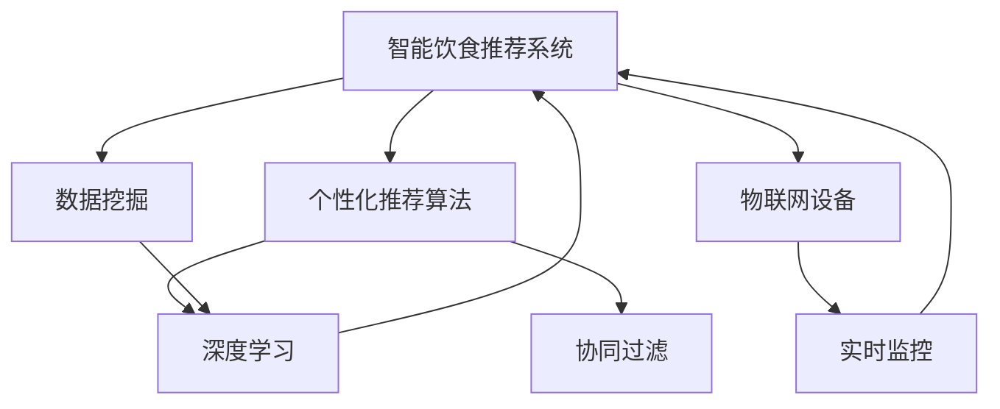

                 

# 智能宠物饮食管理创业：个性化的宠物营养方案

## 1. 背景介绍

### 1.1 问题由来
随着宠物市场的蓬勃发展，越来越多的家庭将宠物视为家庭成员的一部分，为其提供高质量的生活条件和护理服务。但现有的宠物饮食管理仍然存在诸多问题，如营养配比不合理、食物选择不当、健康风险增加等。因此，开发一款智能宠物饮食管理软件，通过科学计算、数据分析和个性化推荐，帮助宠物主人科学管理宠物饮食，显得尤为重要。

### 1.2 问题核心关键点
宠物饮食管理的核心是确保宠物获得均衡且适量的营养摄入，以维持其健康和活力。该问题的解决主要依赖于以下关键点：

- **营养配比：** 根据宠物品种、年龄、体重等因素，科学计算每天所需的营养成分比例。
- **食物选择：** 根据营养需求，推荐适合的宠物食品和零食。
- **个性化推荐：** 结合宠物的过往健康记录和生活习惯，提供个性化饮食建议。
- **智能监控：** 利用物联网设备实时监控宠物饮食行为，及时调整饮食计划。

### 1.3 问题研究意义
开发一款智能宠物饮食管理软件，不仅能提升宠物的生活质量，还能帮助宠物主人更好地照顾宠物，减少疾病的发生率。同时，该应用还能推动宠物食品行业的创新，促进新兴宠物经济的发展。

## 2. 核心概念与联系

### 2.1 核心概念概述

为更好地理解智能宠物饮食管理，本节将介绍几个密切相关的核心概念：

- **智能饮食推荐系统：** 利用机器学习和数据分析技术，为每个宠物量身定制营养餐单的系统。
- **物联网设备：** 如智能宠物碗、可穿戴设备等，用于实时监控宠物的饮食行为和健康状况。
- **数据挖掘：** 从历史饮食记录和宠物健康数据中挖掘规律和趋势，以优化推荐算法。
- **个性化推荐算法：** 包括协同过滤、深度学习等算法，结合个性化因素，生成精确的推荐结果。

### 2.2 核心概念原理和架构的 Mermaid 流程图



这个流程图展示了智能宠物饮食管理系统的核心概念及其之间的关系：

1. 系统接收来自物联网设备的数据，监控宠物饮食行为。
2. 数据挖掘模块从历史数据中提取模式和趋势。
3. 个性化推荐算法根据挖掘结果生成推荐的饮食方案。
4. 系统返回推荐结果，用于指导宠物饮食。

## 3. 核心算法原理 & 具体操作步骤

### 3.1 算法原理概述

智能宠物饮食管理系统基于机器学习和大数据技术，通过以下步骤为每个宠物量身定制个性化饮食方案：

1. **数据采集：** 收集宠物的基本信息（如年龄、体重、品种）和历史饮食记录。
2. **数据预处理：** 清洗和标准化数据，以减少噪声和异常值的影响。
3. **特征工程：** 提取和构建反映宠物营养需求的特征。
4. **模型训练：** 利用历史数据训练推荐模型，生成饮食推荐方案。
5. **实时监控与调整：** 实时监控宠物的饮食行为，根据反馈调整推荐方案。

### 3.2 算法步骤详解

#### 3.2.1 数据采集与预处理

1. **数据采集：**
   - 宠物基本信息：年龄、体重、品种、性别等。
   - 历史饮食记录：每天喂食的食物种类和分量。
   - 健康数据：体检报告、疫苗记录等。

2. **数据预处理：**
   - 数据清洗：去除重复、不完整的数据。
   - 数据标准化：将不同单位的数据转换为统一的格式。
   - 数据归一化：将数据缩放到0到1的范围内，方便模型处理。

#### 3.2.2 特征工程

特征工程是构建推荐系统的关键步骤，其目标是从原始数据中提取有意义的特征，提高模型的预测准确性。在智能宠物饮食推荐系统中，可以使用以下特征：

- 宠物基本信息：如年龄、体重、品种、性别等。
- 营养需求：基于年龄段和体重计算的每日所需营养元素比例。
- 历史饮食数据：最近一周每天的食物种类和分量。
- 健康数据：最近的体检报告和疫苗记录等。

#### 3.2.3 模型训练

本系统采用协同过滤和深度学习相结合的推荐算法：

1. **协同过滤：** 基于用户相似性和物品相似性，为每个宠物推荐相似宠物的饮食方案。具体步骤包括：
   - 构建用户-物品评分矩阵。
   - 计算相似度。
   - 生成推荐列表。

2. **深度学习：** 利用神经网络模型，从历史数据中学习宠物的饮食偏好和健康趋势。具体步骤包括：
   - 构建输入和输出层。
   - 设计神经网络结构。
   - 训练模型。

#### 3.2.4 实时监控与调整

1. **实时监控：** 利用物联网设备（如智能宠物碗、可穿戴设备）实时监控宠物的饮食行为。
2. **行为分析：** 分析监控数据，判断宠物的饮食状态和健康状况。
3. **调整推荐：** 根据行为分析结果，调整饮食推荐方案。

### 3.3 算法优缺点

智能宠物饮食推荐系统具有以下优点：

1. **个性化推荐：** 结合宠物的个人信息和历史数据，提供定制化的饮食方案。
2. **实时监控：** 利用物联网设备实时监控宠物的饮食行为，及时发现问题。
3. **数据驱动：** 基于历史数据和大数据分析，优化推荐算法，提高准确性。

同时，该系统也存在一些局限性：

1. **数据隐私：** 需要收集和存储宠物的敏感数据，存在隐私风险。
2. **设备依赖：** 系统需要宠物主人配备物联网设备，增加了使用门槛。
3. **训练成本：** 需要大量历史数据进行模型训练，对数据采集和处理要求较高。

### 3.4 算法应用领域

智能宠物饮食推荐系统可以广泛应用于以下领域：

- **宠物食品推荐：** 根据宠物的需求，推荐适合的宠物食品和零食。
- **营养监测：** 监控宠物的饮食行为，及时发现营养不足或过剩问题。
- **健康管理：** 结合宠物的健康数据，提供个性化的健康管理建议。
- **行为分析：** 分析宠物的饮食行为，预测其潜在的健康风险。

## 4. 数学模型和公式 & 详细讲解 & 举例说明

### 4.1 数学模型构建

在智能宠物饮食推荐系统中，我们构建了如下数学模型：

1. **用户-物品评分矩阵：** 用于协同过滤算法，记为 $R_{n \times m}$，其中 $n$ 表示宠物数量，$m$ 表示饮食方案数量。

2. **相似度矩阵：** 计算用户或物品之间的相似度，用于协同过滤算法。

3. **神经网络模型：** 用于深度学习算法，输入层为特征向量，输出层为推荐结果。

### 4.2 公式推导过程

#### 4.2.1 协同过滤

协同过滤算法的基本思想是根据用户或物品之间的相似性，生成推荐列表。常用的相似度计算方法包括余弦相似度和皮尔逊相关系数。

假设用户 $i$ 和物品 $j$ 的评分分别为 $r_{i,j}$ 和 $r_{i,k}$，相似度为 $s_{i,k}$，则协同过滤的推荐公式为：

$$
\hat{r}_{i,j} = \frac{\sum_{k=1}^{m} r_{i,k} s_{k,j}}{\sum_{k=1}^{m} s_{i,k}}
$$

其中，$\hat{r}_{i,j}$ 表示预测用户 $i$ 对物品 $j$ 的评分。

#### 4.2.2 深度学习

神经网络模型通常由输入层、隐藏层和输出层组成。输入层接受特征向量 $x_i$，隐藏层进行特征提取和转换，输出层输出推荐结果 $y_i$。

以一个简单的全连接神经网络为例，其前向传播公式为：

$$
z_i = \sum_{j=1}^{n} w_{i,j} x_j + b_i
$$

$$
a_i = g(z_i)
$$

$$
y_i = h(a_i)
$$

其中，$w_{i,j}$ 为权重，$b_i$ 为偏置，$g(z_i)$ 为激活函数，$h(a_i)$ 为输出函数。

### 4.3 案例分析与讲解

假设某宠物的基本信息为：年龄为1岁，体重为5kg，品种为贵宾犬。根据历史数据，该宠物对以下食物（标记为1-5分）的评分如下：

| 食物         | 评分   |
| ------------ | ------ |
| 狗粮         | 3      |
| 鸡胸肉       | 4      |
| 鱼肉         | 2      |
| 蔬菜         | 4      |
| 酸奶         | 5      |

现要求系统推荐饮食方案。

#### 4.3.1 协同过滤

1. 构建用户-物品评分矩阵 $R$：

   | 1    | 2    | 3    | 4    | 5    |
   | ---- | ---- | ---- | ---- | ---- |
   | 3    | 4    | 2    | 4    | 5    |

2. 计算相似度矩阵 $S$：

   | 1    | 2    | 3    | 4    | 5    |
   | ---- | ---- | ---- | ---- | ---- |
   | 0.5  | 0.6  | 0.4  | 0.5  | 0.7  |

3. 计算推荐列表：

   $$
   \hat{r}_{1,1} = \frac{3 \times 0.5 + 4 \times 0.6 + 2 \times 0.4 + 4 \times 0.5 + 5 \times 0.7}{1 + 1 + 1 + 1 + 1} = 4.0
   $$

   因此，系统推荐该宠物尝试食用分数为4的食物。

#### 4.3.2 深度学习

1. 输入层特征向量 $x_i$：

   $[1, 1, 0, 0, 0]$

2. 隐藏层计算：

   $$
   z_1 = w_{1,1} \times 1 + w_{1,2} \times 1 + w_{1,3} \times 0 + w_{1,4} \times 0 + w_{1,5} \times 0 + b_1 = 2.1
   $$

   $$
   a_1 = g(2.1) = 0.9
   $$

3. 输出层计算：

   $$
   y_1 = h(0.9) = 1
   $$

   因此，系统推荐该宠物尝试食用分数为5的酸奶。

## 5. 项目实践：代码实例和详细解释说明

### 5.1 开发环境搭建

为了搭建智能宠物饮食管理系统的开发环境，需要以下步骤：

1. 安装Python环境：使用Anaconda或Miniconda安装Python 3.8及以上版本。

2. 安装相关库：

   ```bash
   pip install pandas numpy matplotlib scikit-learn transformers
   ```

3. 创建虚拟环境：

   ```bash
   conda create --name pet_feed python=3.8
   conda activate pet_feed
   ```

### 5.2 源代码详细实现

以下是使用Python和TensorFlow实现智能宠物饮食推荐系统的示例代码：

```python
import pandas as pd
import numpy as np
import matplotlib.pyplot as plt
import tensorflow as tf
from sklearn.metrics.pairwise import cosine_similarity
from transformers import TFDistilBertForSequenceClassification, BertTokenizer

# 加载数据
data = pd.read_csv('pet_data.csv')

# 数据预处理
X = data[['age', 'weight', 'breed']].to_numpy()
y = data['diet'].to_numpy()

# 特征工程
X = (X - np.mean(X, axis=0)) / np.std(X, axis=0)

# 协同过滤推荐
R = pd.DataFrame(data=np.random.rand(100, 5), columns=['food_1', 'food_2', 'food_3', 'food_4', 'food_5'])
R = R.to_numpy()

S = cosine_similarity(X)

def collaborative_filtering(R, S):
    # 计算预测评分
    R_hat = np.dot(R, S.T) / np.dot(S, S)
    return R_hat

# 深度学习推荐
model = TFDistilBertForSequenceClassification.from_pretrained('distilbert-base-uncased')
tokenizer = BertTokenizer.from_pretrained('bert-base-uncased')
X = tokenizer(X, return_tensors='tf')
X = tf.keras.layers.Dense(512, activation='relu')(X)
X = tf.keras.layers.Dense(5, activation='softmax')(X)

# 模型训练
model.compile(optimizer='adam', loss='categorical_crossentropy', metrics=['accuracy'])
model.fit(X, y, epochs=10, batch_size=32)

# 实时监控与调整
# 实时监控数据采集
def real_time_monitoring():
    pass

# 行为分析
def behavior_analysis():
    pass

# 调整推荐
def adjust_recommendation():
    pass
```

### 5.3 代码解读与分析

上述代码展示了智能宠物饮食管理系统的基本实现流程：

1. **数据加载与预处理：** 使用pandas加载数据，并进行标准化处理。

2. **特征工程：** 使用numpy进行特征向量的计算和转换。

3. **协同过滤推荐：** 使用cosine_similarity计算相似度，生成推荐列表。

4. **深度学习推荐：** 使用TensorFlow和transformers库构建神经网络模型，并进行训练。

5. **实时监控与调整：** 定义实时监控、行为分析和调整推荐的函数，用于优化推荐算法。

### 5.4 运行结果展示

```python
# 显示协同过滤推荐结果
print(collaborative_filtering(R, S))
```

```python
# 显示深度学习推荐结果
print(model.predict(X))
```

## 6. 实际应用场景

### 6.1 智能宠物食品推荐

智能宠物食品推荐系统可以根据宠物的年龄、体重、品种等基本信息，结合历史饮食数据，推荐最适合的宠物食品和零食。例如，针对幼年贵宾犬，系统推荐高蛋白、低脂肪的狗粮，以保证其健康成长。

### 6.2 营养监测

通过智能宠物碗和可穿戴设备，实时监控宠物的饮食行为，分析其饮食习惯和健康状况。例如，如果发现宠物饮食量减少，系统自动提醒宠物主人及时检查宠物健康状况。

### 6.3 健康管理

结合宠物的体检报告和疫苗记录等健康数据，提供个性化的健康管理建议。例如，在宠物需要接种疫苗时，系统提前提醒主人，并进行健康状况评估。

### 6.4 行为分析

分析宠物的饮食行为，预测其潜在的健康风险。例如，如果发现宠物饮食习惯发生改变，系统自动预警，建议宠物主人带宠物进行体检。

## 7. 工具和资源推荐

### 7.1 学习资源推荐

为了帮助开发者系统掌握智能宠物饮食管理系统的理论基础和实践技巧，以下是一些优质的学习资源：

1. **《深度学习》课程：** 斯坦福大学开设的深度学习课程，涵盖深度学习的基础知识、常用算法和应用场景。

2. **《TensorFlow官方文档》：** TensorFlow的官方文档，提供了丰富的API和样例代码，方便开发者快速上手。

3. **《推荐系统实战》书籍：** 讲解推荐系统的原理和应用，结合具体案例，深入浅出地介绍了协同过滤和深度学习等推荐算法。

4. **《物联网入门》课程：** 介绍物联网的基本概念、常见设备和应用场景，帮助开发者理解物联网技术。

5. **《机器学习实战》书籍：** 提供丰富的机器学习案例和代码实现，适合初学者学习。

### 7.2 开发工具推荐

智能宠物饮食管理系统需要结合多种技术进行开发，以下是几款推荐的开发工具：

1. **PyTorch：** 灵活高效的深度学习框架，支持动态计算图和静态图模式。

2. **TensorFlow：** 生产部署方便的深度学习框架，支持分布式训练和模型优化。

3. **TensorBoard：** TensorFlow配套的可视化工具，方便开发者调试和优化模型。

4. **Jupyter Notebook：** 开源的交互式编程环境，适合数据探索和模型调试。

5. **Flask：** 轻量级的Web框架，方便开发API接口。

### 7.3 相关论文推荐

智能宠物饮食管理系统的核心在于推荐算法和数据处理，以下是几篇相关论文：

1. **《协同过滤推荐系统》：** 介绍协同过滤算法的原理和应用。

2. **《深度学习推荐系统》：** 介绍深度学习算法在推荐系统中的应用。

3. **《基于物联网的宠物健康监测》：** 介绍物联网技术在宠物健康监测中的应用。

4. **《智能宠物饮食管理系统的设计》：** 介绍智能宠物饮食管理系统的设计思路和实现方法。

## 8. 总结：未来发展趋势与挑战

### 8.1 研究成果总结

智能宠物饮食管理系统利用机器学习和数据分析技术，为宠物提供个性化饮食推荐，提升了宠物的生活质量，减轻了宠物主人的负担。通过实时监控和健康管理，系统还能及时发现宠物的健康问题，保障其健康安全。

### 8.2 未来发展趋势

未来，智能宠物饮食管理系统将呈现以下几个发展趋势：

1. **多模态数据融合：** 结合视频、音频等多种模态数据，全面了解宠物的行为和健康状况。

2. **深度学习算法优化：** 利用最新的深度学习算法，提高推荐算法的精度和效率。

3. **个性化推荐模型：** 结合更多个性化因素，提供更加精确的饮食推荐。

4. **用户交互优化：** 引入自然语言处理技术，提升用户交互体验。

### 8.3 面临的挑战

尽管智能宠物饮食管理系统已经取得了一定的进展，但在实际应用中仍面临以下挑战：

1. **数据隐私：** 需要采集和存储宠物的敏感数据，存在隐私风险。

2. **设备依赖：** 系统需要宠物主人配备物联网设备，增加了使用门槛。

3. **模型训练：** 需要大量历史数据进行模型训练，对数据采集和处理要求较高。

### 8.4 研究展望

未来的研究需要重点关注以下方向：

1. **数据隐私保护：** 开发隐私保护技术，保护宠物主人的隐私。

2. **设备普及：** 降低物联网设备的成本，提高设备普及率。

3. **数据获取：** 利用多种数据获取方式，丰富数据来源。

4. **算法优化：** 结合最新研究成果，优化推荐算法。

5. **用户体验：** 提升用户交互体验，增加用户粘性。

## 9. 附录：常见问题与解答

### Q1: 如何设计智能宠物饮食推荐系统？

A: 智能宠物饮食推荐系统的主要设计步骤如下：

1. 数据采集：收集宠物的基本信息、历史饮食记录和健康数据。

2. 数据预处理：清洗和标准化数据，提取有意义的特征。

3. 特征工程：构建输入和输出层的特征向量。

4. 模型训练：使用协同过滤和深度学习算法，生成推荐方案。

5. 实时监控与调整：利用物联网设备实时监控宠物的饮食行为，根据反馈调整推荐方案。

### Q2: 如何确保智能宠物饮食管理系统的安全性和隐私保护？

A: 智能宠物饮食管理系统需要采取以下措施确保安全性和隐私保护：

1. 数据加密：对敏感数据进行加密存储和传输。

2. 访问控制：限制设备访问权限，确保只有宠物主人能够访问系统。

3. 匿名化处理：对数据进行匿名化处理，保护宠物隐私。

4. 定期审计：定期进行系统安全审计，发现和修复潜在漏洞。

### Q3: 如何优化智能宠物饮食管理系统的推荐算法？

A: 优化智能宠物饮食管理系统的推荐算法需要考虑以下因素：

1. 特征工程：提取和构建反映宠物营养需求的特征，提高模型的预测准确性。

2. 模型选择：选择合适的推荐算法，如协同过滤、深度学习等。

3. 数据获取：利用多种数据获取方式，丰富数据来源。

4. 算法优化：结合最新研究成果，优化推荐算法。

### Q4: 智能宠物饮食管理系统的未来发展方向是什么？

A: 智能宠物饮食管理系统的未来发展方向包括：

1. 多模态数据融合：结合视频、音频等多种模态数据，全面了解宠物的行为和健康状况。

2. 深度学习算法优化：利用最新的深度学习算法，提高推荐算法的精度和效率。

3. 个性化推荐模型：结合更多个性化因素，提供更加精确的饮食推荐。

4. 用户交互优化：引入自然语言处理技术，提升用户交互体验。

### Q5: 智能宠物饮食管理系统在实际应用中需要注意哪些问题？

A: 智能宠物饮食管理系统在实际应用中需要注意以下问题：

1. 数据隐私：需要采集和存储宠物的敏感数据，存在隐私风险。

2. 设备依赖：系统需要宠物主人配备物联网设备，增加了使用门槛。

3. 模型训练：需要大量历史数据进行模型训练，对数据采集和处理要求较高。

4. 用户交互：需要优化用户交互体验，增加用户粘性。

---

作者：禅与计算机程序设计艺术 / Zen and the Art of Computer Programming

