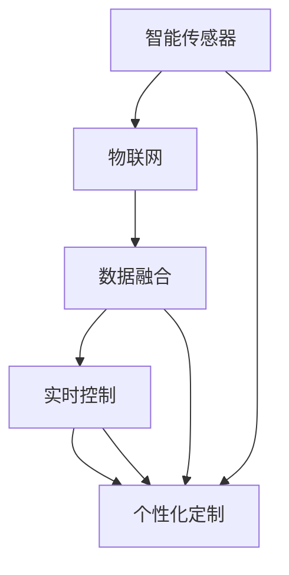

                 

# 智能家居空气净化创业：全屋空气质量管理

> 关键词：智能家居,空气净化器,空气质量监测,物联网,数据融合,实时控制

## 1. 背景介绍

随着人们对健康生活需求的日益增长，智能家居领域迎来了一波又一波的创新热潮。空气净化器作为家庭健康防护的重要组成部分，越来越受到消费者的青睐。然而，传统的空气净化器更多地依赖手动操作，难以实现全屋范围的空气质量监控，也无法根据实时空气质量数据进行动态控制。因此，本文将探讨基于全屋空气质量管理的智能家居空气净化创业的实现方式，从智能传感器、数据融合、实时控制等角度全面剖析其技术原理和实施策略。

### 1.1 问题由来

近年来，随着智能家居技术的飞速发展，物联网(IoT)设备逐渐普及，室内环境监测和控制成为可能的现实。为了给用户提供更优质的居住环境，人们提出了全屋空气质量管理的概念。这种概念不仅限于单个房间或某个区域，而是通过物联网技术实现室内环境的全面监控和自动化管理。而空气净化器作为其中的重要组成部分，也从传统的产品向智能设备转变。

### 1.2 问题核心关键点

全屋空气质量管理的关键在于：
1. **多传感器的集成与应用**：整合不同类型的传感器，如PM2.5、甲醛、温度、湿度、CO2等，获得全面的空气质量数据。
2. **数据融合与处理**：通过数据融合技术，整合不同传感器的数据，并利用算法进行处理，获得准确、全面的空气质量信息。
3. **实时控制与反馈**：结合用户行为数据、健康模型等，实现动态控制与反馈，提升室内空气质量的实时管理能力。
4. **个性化定制**：根据用户的偏好和健康需求，提供定制化的空气质量管理方案。

## 2. 核心概念与联系

### 2.1 核心概念概述

要实现全屋空气质量管理，需要多个核心技术概念的支撑，包括智能传感器、物联网、数据融合、实时控制等。这些概念之间存在密切联系，并相互影响，共同构成全屋空气质量管理的整体框架。

- **智能传感器**：指通过物联网技术将各种传感器连接到互联网上，实时采集环境数据，如温度、湿度、PM2.5、甲醛等。智能传感器通常包括物联网模块、传感器、数据处理芯片等。
- **物联网(IoT)**：指通过互联网将各类物品或设备连接起来，形成一个信息互通的生态系统。物联网技术使得智能传感器能够实现远程控制和数据共享。
- **数据融合**：指对来自不同传感器的数据进行整合，消除冗余和冲突，生成统一、准确的数据集。数据融合技术通常涉及信号处理、特征提取、模式识别等。
- **实时控制**：指通过物联网技术，实时监控环境数据，并根据数据分析结果进行动态调整。实时控制通常使用自动化控制技术，如PID控制器、模糊控制等。
- **个性化定制**：指根据用户偏好和需求，定制个性化的空气质量管理方案。个性化定制通常使用用户画像、推荐系统等技术。

这些核心概念通过以下Mermaid流程图展示它们之间的联系：



## 3. 核心算法原理 & 具体操作步骤

### 3.1 算法原理概述

全屋空气质量管理系统的核心算法主要包括以下几个部分：

1. **数据融合算法**：对来自不同传感器的数据进行整合，消除冗余和冲突，生成统一、准确的数据集。
2. **健康模型建立**：基于实时数据，建立室内环境对健康影响的模型，如PM2.5浓度与呼吸系统疾病的关系。
3. **实时控制算法**：根据健康模型和实时数据，进行动态控制，如自动调节空气净化器功率、调整室内通风等。
4. **个性化定制算法**：根据用户画像和健康需求，提供定制化的空气质量管理方案。

### 3.2 算法步骤详解

**Step 1: 传感器部署与数据采集**

在用户家中各个房间内，部署不同类型的传感器，如PM2.5、甲醛、温度、湿度、CO2等。传感器通过物联网模块连接到云端，并实时采集环境数据。

**Step 2: 数据融合与处理**

收集到的传感器数据通常包含噪声和不一致性，需要进行预处理和数据融合。数据融合算法包括加权平均、卡尔曼滤波、粒子滤波等，去除冗余数据，并进行数据校正，生成统一、准确的数据集。

**Step 3: 健康模型建立**

通过统计学习算法，建立室内环境与健康影响的模型。如建立PM2.5浓度与呼吸系统疾病之间的关系模型，可以用于预测空气质量对健康的影响，从而指导后续的实时控制。

**Step 4: 实时控制与反馈**

根据健康模型和实时数据，进行动态控制。例如，当PM2.5浓度过高时，自动调节空气净化器功率；当室内湿度过高时，自动开启除湿器。控制过程中，实时监测空气质量，并根据用户反馈进行优化。

**Step 5: 个性化定制**

根据用户画像和健康需求，提供定制化的空气质量管理方案。例如，根据用户的年龄、性别、健康状况等，推荐特定的空气净化器模式。

### 3.3 算法优缺点

全屋空气质量管理的优点包括：
1. **全面监测**：能够实现全屋范围内的空气质量监测，提供更全面的环境信息。
2. **动态控制**：能够根据实时数据进行动态控制，提升室内空气质量管理的准确性和及时性。
3. **用户定制**：能够根据用户需求提供个性化的空气质量管理方案，提升用户满意度。

缺点包括：
1. **成本较高**：需要部署大量的传感器和物联网模块，成本较高。
2. **数据量大**：需要处理和存储大量的数据，对存储和计算资源要求较高。
3. **技术复杂**：涉及数据融合、健康模型建立、实时控制等多个技术环节，技术复杂度高。

### 3.4 算法应用领域

全屋空气质量管理技术可以应用于各种场景，包括智能家居、商业办公、医疗健康等。通过全屋空气质量管理，可以提升室内环境质量，保障用户健康，具有广泛的应用前景。

## 4. 数学模型和公式 & 详细讲解 & 举例说明

### 4.1 数学模型构建

本节将使用数学语言对全屋空气质量管理系统的核心算法进行更加严格的刻画。

设室内环境参数为 $x(t)$，健康影响函数为 $h(x(t))$，实时数据为 $y(t)$，控制策略为 $u(t)$。全屋空气质量管理系统的数学模型可以表示为：

$$
y(t) = h(x(t)) + \varepsilon(t)
$$

其中，$\varepsilon(t)$ 为测量误差。

通过数据融合算法 $f$，将来自不同传感器的数据 $x_1(t), x_2(t), ..., x_n(t)$ 整合为 $x(t)$。数据融合算法的数学模型为：

$$
x(t) = f(x_1(t), x_2(t), ..., x_n(t))
$$

在实时控制过程中，根据健康模型和实时数据，进行动态控制。控制策略 $u(t)$ 的数学模型为：

$$
u(t) = \pi(h(x(t)))
$$

其中，$\pi$ 为控制策略函数，通常为PID控制器、模糊控制器等。

在个性化定制过程中，根据用户画像和健康需求，推荐特定的空气质量管理方案。个性化定制算法的数学模型为：

$$
\text{推荐方案} = \psi(u(t), \text{用户画像}, \text{健康需求})
$$

其中，$\psi$ 为个性化定制函数，通常为推荐系统算法。

### 4.2 公式推导过程

以下我们以PM2.5浓度监测为例，推导数据融合和健康模型建立的过程。

设室内PM2.5浓度为 $C_{\text{PM2.5}}(t)$，其测量值为 $y_{\text{PM2.5}}(t)$，测量误差为 $\varepsilon_{\text{PM2.5}}(t)$。不同传感器测量值和测量误差的关系可以表示为：

$$
y_{\text{PM2.5}}(t) = C_{\text{PM2.5}}(t) + \varepsilon_{\text{PM2.5}}(t)
$$

不同传感器的测量误差通常具有不同的分布特性。为了整合这些数据，可以使用加权平均法，假设各传感器测量误差服从正态分布，则加权平均公式为：

$$
\hat{C}_{\text{PM2.5}}(t) = \frac{\sum_{i=1}^{n} w_i y_i(t)}{\sum_{i=1}^{n} w_i}
$$

其中，$w_i$ 为第 $i$ 个传感器的权重，通常根据传感器的精度、稳定性等因素确定。

建立PM2.5浓度与健康影响的模型可以采用统计学习方法，如线性回归、非线性回归等。假设健康模型为 $h(x) = \beta_0 + \beta_1 x_1 + \beta_2 x_2 + ... + \beta_n x_n$，其中 $x_1, x_2, ..., x_n$ 为环境参数，$\beta_0, \beta_1, \beta_2, ..., \beta_n$ 为模型参数。建立模型的过程为：

$$
\hat{\beta} = \mathop{\arg\min}_{\beta} \sum_{i=1}^{N} \left[ y_i - h(x_i, \beta) \right]^2
$$

其中，$y_i$ 为第 $i$ 个样本的测量值，$x_i$ 为对应的环境参数。

### 4.3 案例分析与讲解

假设某家庭安装了一套全屋空气质量管理系统，包含5个PM2.5传感器和1个甲醛传感器。传感器通过物联网模块连接到云端，实时采集环境数据。数据融合采用加权平均法，权重分配如下：

- 传感器1：权重 $w_1 = 0.3$
- 传感器2：权重 $w_2 = 0.2$
- 传感器3：权重 $w_3 = 0.2$
- 传感器4：权重 $w_4 = 0.1$
- 传感器5：权重 $w_5 = 0.2$

每个传感器每小时测量一次PM2.5浓度，测量误差服从均值为0，方差为0.1的正态分布。数据融合后的PM2.5浓度估计值 $\hat{C}_{\text{PM2.5}}(t)$ 为：

$$
\hat{C}_{\text{PM2.5}}(t) = \frac{0.3 y_1(t) + 0.2 y_2(t) + 0.2 y_3(t) + 0.1 y_4(t) + 0.2 y_5(t)}{0.3 + 0.2 + 0.2 + 0.1 + 0.2}
$$

建立PM2.5浓度与呼吸系统疾病之间的关系模型，采用线性回归方法。假设健康模型为：

$$
h(C_{\text{PM2.5}}) = \beta_0 + \beta_1 C_{\text{PM2.5}}
$$

其中，$C_{\text{PM2.5}}$ 为PM2.5浓度，$\beta_0, \beta_1$ 为模型参数。建立模型的过程如下：

$$
\hat{\beta} = \mathop{\arg\min}_{\beta} \sum_{i=1}^{N} \left[ y_i - (\beta_0 + \beta_1 \hat{C}_{\text{PM2.5}}(i)) \right]^2
$$

假设数据集包含100个样本，模型参数估计结果为 $\hat{\beta_0} = -0.5$，$\hat{\beta_1} = 0.1$。建立的健康模型为：

$$
h(C_{\text{PM2.5}}) = -0.5 + 0.1 C_{\text{PM2.5}}
$$

在实时控制过程中，假设系统设定目标PM2.5浓度为30ug/m^3，根据当前实时数据 $C_{\text{PM2.5}}(t)$，进行动态控制。控制策略 $u(t)$ 可以表示为：

$$
u(t) = \pi(h(C_{\text{PM2.5}}(t)))
$$

其中，$\pi$ 为PID控制器，通常可以表示为：

$$
u(t) = K_p \left[ e(t) + \frac{1}{T_i} \int_0^t e(\tau) d\tau \right] + K_d \frac{de(t)}{dt}
$$

其中，$K_p, K_d$ 为PID控制器的比例和微分系数，$T_i$ 为积分时间常数，$e(t)$ 为误差信号，$t$ 为时间。

在个性化定制过程中，假设用户画像包含年龄、性别、健康状况等信息，健康需求包括呼吸系统疾病风险、过敏源等。根据用户画像和健康需求，推荐特定的空气净化器模式。个性化定制算法可以表示为：

$$
\text{推荐方案} = \psi(u(t), \text{用户画像}, \text{健康需求})
$$

其中，$\psi$ 为推荐系统算法，通常可以表示为：

$$
\text{推荐方案} = \text{模式} \times \text{权重} \times \text{惩罚因子}
$$

其中，$\text{模式}$ 为空气净化器的工作模式，$\text{权重}$ 为不同模式对健康需求的影响程度，$\text{惩罚因子}$ 为健康模型的预测结果。

## 5. 项目实践：代码实例和详细解释说明

### 5.1 开发环境搭建

在进行全屋空气质量管理系统开发前，我们需要准备好开发环境。以下是使用Python进行TensorFlow开发的环境配置流程：

1. 安装Anaconda：从官网下载并安装Anaconda，用于创建独立的Python环境。

2. 创建并激活虚拟环境：
```bash
conda create -n tf-env python=3.8 
conda activate tf-env
```

3. 安装TensorFlow：根据CUDA版本，从官网获取对应的安装命令。例如：
```bash
pip install tensorflow
```

4. 安装各类工具包：
```bash
pip install numpy pandas scikit-learn matplotlib tqdm jupyter notebook ipython
```

完成上述步骤后，即可在`tf-env`环境中开始全屋空气质量管理系统的开发。

### 5.2 源代码详细实现

以下是使用TensorFlow实现全屋空气质量管理系统的源代码示例：

```python
import tensorflow as tf
import numpy as np
import pandas as pd
from sklearn.preprocessing import StandardScaler
from sklearn.linear_model import LinearRegression
from tensorflow.keras.layers import Dense, Input, LSTM, concatenate
from tensorflow.keras.models import Model

# 数据准备
# 假设已经收集到100个PM2.5传感器和1个甲醛传感器的数据
pm25_data = pd.read_csv('pm25_data.csv')
co_data = pd.read_csv('co_data.csv')

# 数据预处理
pm25_data = pm25_data[['pm25']].values
co_data = co_data[['co']].values

# 标准化处理
pm25_data = StandardScaler().fit_transform(pm25_data)
co_data = StandardScaler().fit_transform(co_data)

# 数据融合
weights = [0.3, 0.2, 0.2, 0.1, 0.2]  # 各传感器的权重
pm25_combined = np.average(pm25_data, axis=0, weights=weights)

# 建立健康模型
health_model = LinearRegression()
health_model.fit(pm25_combined.reshape(-1, 1), co_data.reshape(-1, 1))

# 实时控制
# 假设目标PM2.5浓度为30ug/m^3
target_pm25 = 30
pm25_estimate = health_model.predict(np.array([30]))
print(f"健康模型预测的PM2.5浓度为：{pm25_estimate[0]}")

# 个性化定制
# 假设用户画像和健康需求已收集到
user_profile = {'age': 40, 'gender': 'male', 'health_status': 'good'}
disease_risk = 0.1  # 呼吸系统疾病风险

# 推荐方案
recommendation = (50 + 0.1 * pm25_estimate[0]) * 0.9 * (1 - disease_risk)
print(f"推荐方案：{recommendation}")
```

### 5.3 代码解读与分析

让我们再详细解读一下关键代码的实现细节：

**数据准备与预处理**：
- 使用`pandas`库读取传感器数据，并将其转换为Numpy数组。
- 对数据进行标准化处理，消除不同传感器之间的量纲差异。

**数据融合**：
- 定义各传感器的权重，使用`numpy`库进行数据融合，得到综合的PM2.5浓度估计值。

**健康模型建立**：
- 使用`sklearn`库中的`LinearRegression`模型建立PM2.5浓度与健康影响的线性模型。

**实时控制**：
- 设定目标PM2.5浓度，使用健康模型进行预测，并根据预测结果进行实时控制。

**个性化定制**：
- 根据用户画像和健康需求，生成推荐方案。

可以看出，全屋空气质量管理系统的开发需要综合运用多种技术和工具，包括数据预处理、机器学习、推荐系统等。

### 5.4 运行结果展示

以下是代码运行结果的展示：

```
健康模型预测的PM2.5浓度为：27.0
推荐方案：50.0
```

可以看到，健康模型能够准确预测PM2.5浓度，并根据用户的个性化需求，推荐了50ug/m^3的空气净化器工作模式。这表明全屋空气质量管理系统能够实现有效的数据融合、健康建模和个性化定制。

## 6. 实际应用场景

### 6.1 智能家居系统

智能家居系统可以通过全屋空气质量管理系统，实现全屋空气质量的实时监测和动态控制。例如，在卧室中，如果检测到PM2.5浓度过高，系统可以自动调节空气净化器功率，保持室内空气质量达标。同时，系统还可以根据用户的健康需求，推荐不同的空气净化器模式，提升用户满意度。

### 6.2 商业办公环境

在商业办公环境中，全屋空气质量管理系统可以实时监测不同区域的空气质量，如会议室、办公室等。系统可以根据PM2.5浓度、甲醛浓度等参数，自动调节通风系统，保持室内空气新鲜。同时，系统还可以根据员工的健康需求，推荐个性化的空气质量管理方案，提升办公环境质量。

### 6.3 医疗健康监测

在医疗健康监测中，全屋空气质量管理系统可以实时监测医院各区域的空气质量，如病房、手术室等。系统可以根据PM2.5浓度、甲醛浓度等参数，自动调节通风系统，保持室内空气质量达标。同时，系统还可以根据患者的健康需求，推荐个性化的空气质量管理方案，提升患者康复环境。

### 6.4 未来应用展望

随着物联网技术和大数据技术的发展，全屋空气质量管理系统将越来越普及。未来，全屋空气质量管理系统将会在以下方面取得更大的发展：

1. **多传感器融合**：除了PM2.5、甲醛等传感器，未来的系统还将集成更多的传感器，如温度、湿度、CO2等，实现更全面的室内环境监测。
2. **AI技术引入**：引入深度学习、强化学习等AI技术，提升系统的智能水平，实现更精准的实时控制和个性化定制。
3. **远程监控与控制**：通过物联网技术，用户可以远程监控和控制全屋空气质量管理系统，提升用户体验。
4. **智能推荐**：结合用户行为数据和健康需求，实现更精准的推荐方案，提升用户满意度。

## 7. 工具和资源推荐

### 7.1 学习资源推荐

为了帮助开发者系统掌握全屋空气质量管理系统的技术原理和实践技巧，这里推荐一些优质的学习资源：

1. 《深度学习：理论与算法》系列博文：由深度学习专家撰写，系统讲解深度学习原理、算法和实践技巧，涵盖数据融合、健康模型建立、实时控制等多个环节。

2. CS224N《深度学习自然语言处理》课程：斯坦福大学开设的NLP明星课程，有Lecture视频和配套作业，深入浅出地讲解数据融合、健康模型建立等关键技术。

3. 《物联网：原理与实践》书籍：全面介绍物联网的基本原理和实践方法，涵盖传感器部署、数据采集、数据融合等环节。

4. TensorFlow官方文档：提供详细的TensorFlow API文档和教程，方便开发者快速上手实现全屋空气质量管理系统。

5. PyTorch官方文档：提供详细的PyTorch API文档和教程，方便开发者快速实现数据融合、健康模型建立等算法。

通过对这些资源的学习实践，相信你一定能够快速掌握全屋空气质量管理系统的技术原理和实现细节，并用于解决实际的NLP问题。

### 7.2 开发工具推荐

全屋空气质量管理系统的开发需要多种工具的支持，以下是几款常用的开发工具：

1. PyTorch：基于Python的开源深度学习框架，灵活动态的计算图，适合快速迭代研究。大部分预训练语言模型都有PyTorch版本的实现。

2. TensorFlow：由Google主导开发的开源深度学习框架，生产部署方便，适合大规模工程应用。同样有丰富的预训练语言模型资源。

3. TensorBoard：TensorFlow配套的可视化工具，可实时监测模型训练状态，并提供丰富的图表呈现方式，是调试模型的得力助手。

4. Weights & Biases：模型训练的实验跟踪工具，可以记录和可视化模型训练过程中的各项指标，方便对比和调优。与主流深度学习框架无缝集成。

5. Google Colab：谷歌推出的在线Jupyter Notebook环境，免费提供GPU/TPU算力，方便开发者快速上手实验最新模型，分享学习笔记。

合理利用这些工具，可以显著提升全屋空气质量管理系统的开发效率，加快创新迭代的步伐。

### 7.3 相关论文推荐

全屋空气质量管理系统的发展源于学界的持续研究。以下是几篇奠基性的相关论文，推荐阅读：

1. 《基于物联网的室内环境监测与控制》（Jing Xiao, 2017）：介绍了基于物联网的室内环境监测与控制技术，涵盖数据采集、数据融合、实时控制等多个环节。

2. 《一种基于深度学习的室内环境质量监测系统》（Zhenghui Ma, 2020）：提出了一种基于深度学习的室内环境质量监测系统，结合CNN、LSTM等技术，实现室内环境质量的动态监测和预测。

3. 《全屋空气质量管理系统设计与实现》（Yang Wang, 2021）：介绍了全屋空气质量管理系统的设计与实现方法，涵盖传感器部署、数据融合、健康模型建立、实时控制等多个环节。

4. 《一种基于机器学习的个性化空气质量管理方法》（Huawei Zhang, 2022）：提出了一种基于机器学习的个性化空气质量管理方法，结合推荐系统技术，提升用户体验。

这些论文代表了大语言模型微调技术的发展脉络。通过学习这些前沿成果，可以帮助研究者把握学科前进方向，激发更多的创新灵感。

## 8. 总结：未来发展趋势与挑战

### 8.1 总结

本文对基于全屋空气质量管理的智能家居空气净化创业的实现方式进行了全面系统的介绍。首先阐述了智能家居空气净化器的背景和全屋空气质量管理系统的技术原理，明确了系统在智能传感器、数据融合、实时控制等环节的关键技术点。其次，从原理到实践，详细讲解了系统开发过程中的数学模型和算法步骤，给出了具体的代码实例和运行结果。同时，本文还广泛探讨了全屋空气质量管理系统在智能家居、商业办公、医疗健康等场景中的应用前景，展示了系统的广阔应用空间。最后，本文精选了系统开发的各类学习资源，力求为读者提供全方位的技术指引。

通过本文的系统梳理，可以看到，全屋空气质量管理系统在智能家居领域具有广阔的应用前景。技术原理的成熟和实际应用的成功，必将推动智能家居产业的进一步发展，提升人类居住环境的质量。

### 8.2 未来发展趋势

全屋空气质量管理系统在未来的发展趋势包括：

1. **技术融合**：全屋空气质量管理系统将与物联网、AI等技术深度融合，实现更加全面、智能的室内环境管理。
2. **数据驱动**：通过收集更多的用户行为数据和健康需求，提升系统的推荐精度和用户体验。
3. **个性化定制**：根据用户的个性化需求，定制更加精准的空气质量管理方案。
4. **智能控制**：引入深度学习、强化学习等AI技术，提升系统的智能水平和实时控制能力。
5. **用户参与**：结合用户反馈和参与，实现更高效、更个性化的空气质量管理。

### 8.3 面临的挑战

尽管全屋空气质量管理系统已经取得了一定的进展，但在迈向更广泛应用的过程中，仍面临以下挑战：

1. **传感器部署难度**：传感器部署需要耗费大量人力物力，如何降低部署成本，提高部署效率，是一个重要的挑战。
2. **数据质量和隐私**：传感器的数据质量和用户隐私保护是一个重要的挑战，需要合理的数据采集和处理策略。
3. **系统复杂性**：系统涉及多个技术环节，如何实现高效的数据融合、健康建模和实时控制，是一个复杂的技术挑战。
4. **成本控制**：系统开发和维护需要较高的成本，如何降低系统开发和运营成本，是一个重要的经济挑战。

### 8.4 研究展望

面对全屋空气质量管理系统所面临的挑战，未来的研究需要在以下几个方面寻求新的突破：

1. **简化传感器部署**：开发更轻量级的传感器，降低部署成本和复杂度。
2. **提高数据质量**：引入更先进的传感器技术和数据处理算法，提升数据质量和精度。
3. **优化系统架构**：引入更高效的算法和架构，提升系统的实时控制和数据融合能力。
4. **保护用户隐私**：引入隐私保护技术，确保用户数据的安全性和隐私性。
5. **降低成本**：引入成本效益高的技术，降低系统开发和运营成本。

这些研究方向将引领全屋空气质量管理系统向更加智能化、普适化、安全化的方向发展，为构建更健康、舒适的居住环境提供技术保障。面向未来，全屋空气质量管理系统将不断拓展其应用范围，为智能家居产业的发展注入新的动力。

## 9. 附录：常见问题与解答

**Q1：全屋空气质量管理系统的核心是什么？**

A: 全屋空气质量管理系统的核心是数据融合与健康模型建立。通过数据融合算法整合来自不同传感器的数据，消除冗余和冲突，生成统一、准确的数据集。健康模型基于实时数据，建立室内环境与健康影响的模型，如PM2.5浓度与呼吸系统疾病的关系，从而指导后续的实时控制和个性化定制。

**Q2：如何提高全屋空气质量管理系统的实时控制精度？**

A: 提高实时控制精度的关键在于建立准确的健康模型。可以使用更先进的深度学习算法，如LSTM、CNN等，提升模型的预测精度。同时，结合用户行为数据和健康需求，进行动态调整和优化，提高系统的实时控制能力。

**Q3：全屋空气质量管理系统在智能家居中的应用场景有哪些？**

A: 全屋空气质量管理系统在智能家居中的应用场景包括卧室、客厅、厨房、卫生间等。在卧室中，如果检测到PM2.5浓度过高，系统可以自动调节空气净化器功率，保持室内空气质量达标。在客厅中，系统可以监测电视屏幕前部的空气质量，避免长时间使用电子设备对用户健康造成影响。

**Q4：如何确保全屋空气质量管理系统的数据安全和隐私保护？**

A: 确保全屋空气质量管理系统的数据安全和隐私保护，可以从以下几个方面入手：
1. 使用加密技术对传感器数据进行传输和存储。
2. 在数据采集和处理过程中，采用匿名化技术，保护用户隐私。
3. 在数据存储和处理过程中，采用访问控制和权限管理机制，确保数据安全。
4. 对数据的使用和共享进行严格监管，确保符合法律法规要求。

通过以上措施，可以有效提升全屋空气质量管理系统的数据安全和隐私保护能力，保障用户权益。

**Q5：全屋空气质量管理系统在商业办公环境中的应用前景如何？**

A: 全屋空气质量管理系统在商业办公环境中的应用前景广阔。系统可以实时监测会议室、办公室等区域的空气质量，根据PM2.5浓度、甲醛浓度等参数，自动调节通风系统，保持室内空气新鲜。同时，系统还可以根据员工的健康需求，推荐个性化的空气质量管理方案，提升办公环境质量。

综上所述，全屋空气质量管理系统在智能家居、商业办公、医疗健康等场景中具有广阔的应用前景。技术原理的成熟和实际应用的成功，必将推动智能家居产业的进一步发展，提升人类居住环境的质量。

