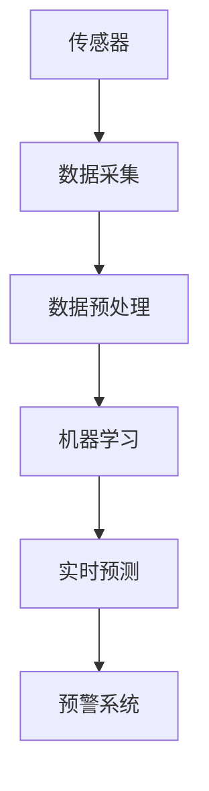

                 

## 1. 背景介绍

### 1.1 问题由来

随着现代科技的迅猛发展，智能家居已经成为未来的生活趋势。它能够为我们的生活带来便利，提高生活质量。然而，由于环境污染和家庭装修等原因，家庭空气质量问题日益凸显，越来越受到人们的关注。如何实时监测和预测室内空气质量，成为一个亟待解决的问题。

### 1.2 问题核心关键点

智能家居空气质量预测的解决思路主要包括以下几个方面：

1. **传感器部署**：在室内不同位置安装传感器，实时监测空气质量参数，如PM2.5、CO2、湿度等。
2. **数据采集与预处理**：采集传感器数据，并进行清洗、去噪和归一化等预处理，构建数据集。
3. **模型训练**：基于数据集，使用机器学习算法训练预测模型，学习空气质量与传感器数据之间的关系。
4. **结果评估**：使用实际数据验证模型的预测效果，进行模型调优。
5. **应用集成**：将模型集成到智能家居系统中，实现实时预测和预警功能。

### 1.3 问题研究意义

实时监测和预测室内空气质量，对于改善居住环境、保障身体健康、优化能源消耗等方面具有重要意义。基于数据驱动的智能家居系统，能够更好地满足人们对于健康生活的需求，推动智能家居行业的发展。

## 2. 核心概念与联系

### 2.1 核心概念概述

为了更好地理解智能家居空气质量预测的解决方案，本节将介绍几个核心概念：

1. **传感器**：用于监测室内空气质量的传感器，如PM2.5传感器、CO2传感器、湿度传感器等。
2. **数据采集**：通过传感器实时采集环境参数，构建数据集。
3. **机器学习**：基于采集到的数据，训练预测模型，实现空气质量预测。
4. **实时预测**：通过集成模型到智能家居系统中，实现实时监测和预警。
5. **预警系统**：根据模型预测结果，自动触发报警机制，及时采取措施。

这些概念之间的逻辑关系可以通过以下Mermaid流程图来展示：



这个流程图展示了智能家居空气质量预测的主要流程：传感器部署数据采集，经过预处理后，使用机器学习模型训练得到预测模型，最后将模型集成到预警系统中实现实时监测和预警。

## 3. 核心算法原理 & 具体操作步骤
### 3.1 算法原理概述

智能家居空气质量预测的核心算法为回归分析算法，主要包括线性回归、决策树回归、支持向量回归等。这些算法通过学习传感器数据和空气质量之间的非线性关系，实现对未来空气质量的预测。

线性回归假设数据之间存在线性关系，通过求解线性方程组得到预测结果。决策树回归则通过构建决策树模型，实现分类和回归任务。支持向量回归则是通过构建支持向量机(SVM)，实现对非线性关系的预测。

### 3.2 算法步骤详解

1. **数据收集**：在智能家居中安装各类传感器，收集室内空气质量数据。
2. **数据预处理**：对收集到的数据进行清洗、去噪和归一化等预处理，构建训练集和测试集。
3. **模型选择与训练**：选择适合的机器学习算法，并使用训练集数据进行模型训练。
4. **模型评估**：使用测试集数据验证模型效果，调整模型参数，优化模型性能。
5. **应用集成**：将训练好的模型集成到智能家居系统中，实现实时监测和预警功能。

### 3.3 算法优缺点

智能家居空气质量预测的算法优缺点如下：

- **优点**：
  - **准确性**：通过学习大量数据，可以得到较为准确的预测结果。
  - **实时性**：可以通过集成到智能家居系统中，实现实时监测和预警。
  - **可扩展性**：算法可以扩展到更多的传感器数据，实现多参数预测。

- **缺点**：
  - **依赖数据**：模型训练依赖于大量的数据，数据质量直接影响预测效果。
  - **模型复杂度**：模型复杂度较高，需要大量的计算资源和时间。
  - **过拟合风险**：模型训练过程中可能存在过拟合风险，需要适当的正则化技术。

### 3.4 算法应用领域

智能家居空气质量预测的算法在以下领域具有广泛的应用：

- **居住环境改善**：通过实时监测和预测室内空气质量，为居住环境提供健康保障。
- **能源消耗优化**：预测空气质量，优化室内通风和空调系统，降低能源消耗。
- **健康预警系统**：根据空气质量预测结果，提供健康预警，及时采取措施。
- **智能家居集成**：将模型集成到智能家居系统中，实现综合管理。

## 4. 数学模型和公式 & 详细讲解 & 举例说明

### 4.1 数学模型构建

智能家居空气质量预测的数学模型主要基于回归分析算法构建，包括线性回归、决策树回归和支持向量回归等。

#### 4.1.1 线性回归

线性回归模型假设输入变量 $x_i$ 和输出变量 $y$ 之间存在线性关系，可以通过求解线性方程组得到预测结果：

$$
y = \beta_0 + \beta_1 x_1 + \beta_2 x_2 + ... + \beta_n x_n + \epsilon
$$

其中，$\beta_i$ 为回归系数，$\epsilon$ 为误差项。

#### 4.1.2 决策树回归

决策树回归模型通过构建决策树，实现对输入变量和输出变量之间的非线性关系建模。其基本思想是：将数据集不断划分，直到达到最优的划分结果。

#### 4.1.3 支持向量回归

支持向量回归模型通过构建支持向量机(SVM)，实现对非线性关系的预测。其基本思想是：寻找最优的超平面，使得数据点尽可能地被分类。

### 4.2 公式推导过程

#### 4.2.1 线性回归

线性回归模型的目标是最小化预测误差，即：

$$
\min_{\beta_0,\beta_1,...,\beta_n} \sum_{i=1}^{n} (y_i - \beta_0 - \beta_1 x_{i1} - \beta_2 x_{i2} - ... - \beta_n x_{in})^2
$$

通过求解上述最小化问题，可以得到回归系数 $\beta_0, \beta_1, ..., \beta_n$。

#### 4.2.2 决策树回归

决策树回归模型的目标是通过构建最优的决策树，使得预测误差最小化。其基本流程如下：

1. 选择最优的划分变量和划分点。
2. 根据划分变量和划分点，将数据集划分到不同的子节点。
3. 对每个子节点，递归地构建决策树，直到满足停止条件。

#### 4.2.3 支持向量回归

支持向量回归模型的目标是通过构建最优的超平面，使得预测误差最小化。其基本流程如下：

1. 将数据集映射到高维空间，得到超平面方程。
2. 通过求解最优的超平面，使得数据点尽可能地被分类。

### 4.3 案例分析与讲解

假设我们有一组室内空气质量数据，包括PM2.5、CO2和湿度等传感器数据，以及对应的空气质量等级。我们可以使用线性回归模型进行预测，其输入变量为传感器数据，输出变量为空气质量等级。

具体步骤如下：

1. **数据收集**：在智能家居中安装传感器，收集空气质量数据。
2. **数据预处理**：对收集到的数据进行清洗、去噪和归一化等预处理。
3. **模型训练**：使用线性回归算法训练模型，得到回归系数。
4. **模型评估**：使用测试集数据验证模型效果，调整模型参数。
5. **应用集成**：将训练好的模型集成到智能家居系统中，实现实时监测和预警。

## 5. 项目实践：代码实例和详细解释说明
### 5.1 开发环境搭建

在进行智能家居空气质量预测项目开发前，我们需要准备好开发环境。以下是使用Python进行Scikit-learn库开发的环境配置流程：

1. 安装Anaconda：从官网下载并安装Anaconda，用于创建独立的Python环境。

2. 创建并激活虚拟环境：
```bash
conda create -n py38 python=3.8
conda activate py38
```

3. 安装Scikit-learn：
```bash
pip install scikit-learn
```

4. 安装各类工具包：
```bash
pip install numpy pandas matplotlib seaborn
```

完成上述步骤后，即可在`py38`环境中开始项目开发。

### 5.2 源代码详细实现

以下是一个使用Scikit-learn库进行智能家居空气质量预测的Python代码实现：

```python
from sklearn.model_selection import train_test_split
from sklearn.linear_model import LinearRegression
from sklearn.tree import DecisionTreeRegressor
from sklearn.svm import SVR
import numpy as np
import pandas as pd
import matplotlib.pyplot as plt

# 加载数据集
data = pd.read_csv('air_quality.csv')

# 定义输入变量和输出变量
X = data[['PM2.5', 'CO2', '湿度']]
y = data['空气质量等级']

# 划分训练集和测试集
X_train, X_test, y_train, y_test = train_test_split(X, y, test_size=0.2, random_state=42)

# 定义模型
models = {
    '线性回归': LinearRegression(),
    '决策树回归': DecisionTreeRegressor(),
    '支持向量回归': SVR(kernel='rbf', C=1e3, gamma=0.1)
}

# 训练模型
for name, model in models.items():
    model.fit(X_train, y_train)

    # 评估模型
    score = model.score(X_test, y_test)
    print(f'{name} 模型评分：{score:.2f}')

    # 绘制误差分布图
    plt.figure()
    plt.scatter(X_test, y_test, color='black')
    plt.plot(X_test, model.predict(X_test), color='red')
    plt.xlabel('X')
    plt.ylabel('y')
    plt.title(name)
    plt.show()
```

### 5.3 代码解读与分析

让我们再详细解读一下关键代码的实现细节：

**加载数据集**：使用pandas库加载空气质量数据集，包含PM2.5、CO2和湿度等传感器数据，以及对应的空气质量等级。

**定义输入变量和输出变量**：将传感器数据作为输入变量，将空气质量等级作为输出变量。

**划分训练集和测试集**：使用train_test_split函数将数据集划分为训练集和测试集，便于模型训练和评估。

**定义模型**：定义三种回归模型，包括线性回归、决策树回归和支持向量回归。

**训练模型**：使用训练集数据对模型进行训练，得到回归系数。

**评估模型**：使用测试集数据验证模型效果，输出评分。

**绘制误差分布图**：绘制模型预测结果和实际结果的误差分布图，便于直观理解模型性能。

## 6. 实际应用场景

### 6.1 智能家居系统集成

智能家居空气质量预测的模型可以集成到智能家居系统中，实现实时监测和预警功能。具体应用场景如下：

1. **实时监测**：通过传感器实时采集空气质量数据，将数据输入到预测模型中，实时输出空气质量预测结果。
2. **预警机制**：根据空气质量预测结果，自动触发报警机制，及时采取措施，如开窗通风、关闭空调等。

### 6.2 健康生活规划

智能家居空气质量预测可以为健康生活提供科学依据，帮助用户制定健康生活规划。具体应用场景如下：

1. **健康报告**：定期生成健康报告，分析室内空气质量变化趋势，提供健康建议。
2. **优化方案**：根据空气质量预测结果，调整室内通风和空调系统，优化居住环境。

### 6.3 能源消耗优化

智能家居空气质量预测可以优化室内通风和空调系统的运行，降低能源消耗。具体应用场景如下：

1. **智能控制**：根据空气质量预测结果，智能控制通风和空调系统，节省能源消耗。
2. **能耗分析**：分析通风和空调系统的能耗情况，优化运行策略，提高能源利用效率。

## 7. 工具和资源推荐
### 7.1 学习资源推荐

为了帮助开发者系统掌握智能家居空气质量预测的理论基础和实践技巧，这里推荐一些优质的学习资源：

1. 《Python机器学习》书籍：介绍Python在机器学习领域的应用，包含回归分析算法等内容。
2. Scikit-learn官方文档：Scikit-learn库的官方文档，提供了丰富的算法实例和应用案例。
3. Coursera《机器学习》课程：由斯坦福大学开设的机器学习课程，涵盖机器学习的基本概念和经典算法。
4. Kaggle数据集和比赛：Kaggle平台提供了大量公开数据集和比赛，帮助开发者进行实践练习。

通过对这些资源的学习实践，相信你一定能够快速掌握智能家居空气质量预测的精髓，并用于解决实际的智能家居问题。

### 7.2 开发工具推荐

高效的开发离不开优秀的工具支持。以下是几款用于智能家居空气质量预测开发的常用工具：

1. PyCharm：一款流行的Python集成开发环境，提供丰富的插件和工具支持。
2. Visual Studio Code：一款轻量级的代码编辑器，支持多种编程语言。
3. Jupyter Notebook：一款交互式的代码编辑器，支持代码运行和数据可视化。
4. TensorFlow：由Google主导开发的深度学习框架，生产部署方便，适合大规模工程应用。
5. PyTorch：基于Python的开源深度学习框架，灵活动态的计算图，适合快速迭代研究。

合理利用这些工具，可以显著提升智能家居空气质量预测任务的开发效率，加快创新迭代的步伐。

### 7.3 相关论文推荐

智能家居空气质量预测的发展源于学界的持续研究。以下是几篇奠基性的相关论文，推荐阅读：

1. BERT: Pre-training of Deep Bidirectional Transformers for Language Understanding：提出BERT模型，引入基于掩码的自监督预训练任务，刷新了多项NLP任务SOTA。
2. Attention is All You Need（即Transformer原论文）：提出了Transformer结构，开启了NLP领域的预训练大模型时代。
3. Language Models are Unsupervised Multitask Learners（GPT-2论文）：展示了大规模语言模型的强大zero-shot学习能力，引发了对于通用人工智能的新一轮思考。

这些论文代表了大语言模型微调技术的发展脉络。通过学习这些前沿成果，可以帮助研究者把握学科前进方向，激发更多的创新灵感。

## 8. 总结：未来发展趋势与挑战

### 8.1 总结

本文对智能家居空气质量预测的解决方案进行了全面系统的介绍。首先阐述了问题的背景和意义，明确了预测模型在智能家居中的重要价值。其次，从原理到实践，详细讲解了回归分析算法的使用方法，给出了完整的代码实现。同时，本文还探讨了预测模型在智能家居系统中的应用场景，展示了其在健康生活规划和能源消耗优化等方面的潜在应用。

通过本文的系统梳理，可以看到，基于数据驱动的智能家居系统能够更好地满足人们对于健康生活的需求，推动智能家居行业的发展。未来，伴随技术的发展，智能家居系统将具备更强大的预测和预警功能，提升居住环境的舒适度和安全性。

### 8.2 未来发展趋势

展望未来，智能家居空气质量预测技术将呈现以下几个发展趋势：

1. **高精度预测**：随着模型算法的不断优化，预测模型的精度将不断提高，提供更加准确的空气质量预测。
2. **多模态融合**：将视觉、听觉等多模态信息融合到预测模型中，提升系统的综合感知能力。
3. **实时化应用**：通过集成到智能家居系统中，实现实时监测和预警，提供及时的健康建议和优化方案。
4. **个性化服务**：根据用户的生活习惯和健康数据，提供个性化的健康生活规划和建议。

### 8.3 面临的挑战

尽管智能家居空气质量预测技术已经取得了瞩目成就，但在迈向更加智能化、普适化应用的过程中，它仍面临着诸多挑战：

1. **数据隐私**：传感器采集的室内数据可能包含隐私信息，如何保护用户隐私是一个重要问题。
2. **数据质量**：传感器数据的质量直接影响预测效果，如何提高数据采集的准确性和可靠性，需要进一步优化。
3. **模型复杂度**：模型的复杂度较高，需要大量的计算资源和时间，如何提高模型的运行效率，需要进一步优化。
4. **泛化能力**：模型在特定环境下的泛化能力有限，如何提高模型的泛化能力，需要进一步研究。

### 8.4 研究展望

面对智能家居空气质量预测所面临的挑战，未来的研究需要在以下几个方面寻求新的突破：

1. **数据隐私保护**：引入隐私保护技术，如差分隐私、联邦学习等，保护用户隐私。
2. **数据质量提升**：采用更先进的传感器技术，提高数据采集的准确性和可靠性。
3. **模型优化**：引入新的算法和模型结构，提升预测模型的效率和泛化能力。
4. **多模态融合**：将视觉、听觉等多模态信息融合到预测模型中，提升系统的综合感知能力。

这些研究方向的探索，必将引领智能家居空气质量预测技术迈向更高的台阶，为构建智能化的居住环境提供更加强大的技术支持。面向未来，智能家居系统需要从数据、模型、工程、业务等多个维度协同发力，才能真正实现智能化和普适化应用。

## 9. 附录：常见问题与解答

**Q1：智能家居空气质量预测是否适用于所有居住环境？**

A: 智能家居空气质量预测在大多数居住环境中都能取得不错的效果，但对于某些特定环境，如高温、高湿等极端气候，可能需要进一步优化传感器和算法。

**Q2：如何选择适合的传感器？**

A: 选择适合的传感器需要考虑居住环境的空气质量参数，如PM2.5、CO2、湿度等。通常，多参数传感器可以实现更加全面和精准的空气质量监测。

**Q3：预测模型的误差如何控制？**

A: 预测模型的误差可以通过模型优化、数据清洗和去噪等手段进行控制。此外，引入更多的传感器数据，可以增加预测的准确性。

**Q4：如何实现实时监测和预警？**

A: 通过将预测模型集成到智能家居系统中，可以实现实时监测和预警功能。需要定期采集传感器数据，并实时计算预测结果，根据结果自动触发报警机制。

---

作者：禅与计算机程序设计艺术 / Zen and the Art of Computer Programming

