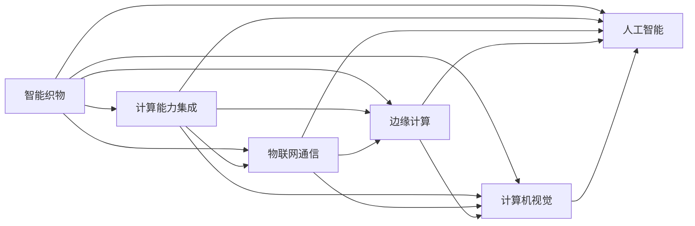

                 

# 智能织物技术：将计算能力整合到日常服装中

> 关键词：智能织物,计算能力,计算机视觉,物联网(IoT),边缘计算,可穿戴设备

## 1. 背景介绍

### 1.1 问题由来
随着科技的迅猛发展，我们见证了从机械计算器到个人计算机，再到智能手机、物联网设备的飞跃。而今，随着计算技术向物理世界的渗透，智能织物成为了这一趋势的最新延伸。智能织物技术通过将计算能力整合到日常服装中，为未来的人机交互开辟了新的可能，展现出巨大的发展潜力和广泛的应用前景。

### 1.2 问题核心关键点
智能织物技术将先进的计算能力与织物材料结合，利用计算机视觉、物联网技术及边缘计算等手段，使织物具备可感知、可交互和可处理数据的能力。其核心关键点包括：
1. **织物传感器技术**：通过在织物表面嵌入微型传感器，实现对环境、体征、位置等多种因素的实时感知。
2. **计算能力集成**：将微处理器、存储芯片等计算组件直接嵌入织物，使衣物成为集成的计算平台。
3. **物联网通信**：通过无线通信模块将智能织物接入网络，实现数据的远程传输和处理。
4. **边缘计算**：在衣物内部或边缘设备上进行数据处理，减少对远端服务器的依赖，提升数据处理效率和隐私性。
5. **人工智能应用**：结合机器学习、计算机视觉等技术，实现个性化的推荐、环境适应和异常检测等功能。

这些关键技术使得智能织物不仅仅是美观的衣物，更是一个综合了传感、计算、通信、处理功能的智能化平台。

### 1.3 问题研究意义
智能织物技术的研发与应用具有重大意义：
1. **提升生活质量**：通过实时监测体温和环境变化，提供个性化的健康建议和舒适度调节，提升用户的生活质量。
2. **增强安全性**：通过识别和预防潜在威胁，提高用户的安全保障水平。
3. **推动产业升级**：智能织物的应用将加速传统服装行业的转型升级，推动新兴产业的发展。
4. **促进可持续发展**：智能织物能够提升资源的利用效率，减少环境污染，推动绿色制造和可持续发展。

## 2. 核心概念与联系

### 2.1 核心概念概述

为更好地理解智能织物技术的核心原理与架构，本节将介绍几个密切相关的核心概念：

- **智能织物**：集成了传感器、计算组件和通信模块的智能化织物材料，具备实时感知、处理和响应环境变化的能力。
- **计算能力集成**：将处理器、存储芯片等计算组件嵌入织物材料，使衣物具备高性能计算和存储能力。
- **物联网技术**：通过无线网络实现智能织物与外部设备的互联互通，实现数据的远程传输和处理。
- **边缘计算**：在衣物内部或邻近的设备上进行数据处理，提升数据处理的实时性和隐私性。
- **计算机视觉**：利用图像处理和模式识别技术，实现对环境、体征等信息的实时分析。
- **人工智能**：结合机器学习和深度学习技术，使智能织物具备学习能力和智能决策功能。

这些核心概念之间的逻辑关系可以通过以下Mermaid流程图来展示：



这个流程图展示了几大核心概念及其之间的关系：

1. 智能织物通过嵌入计算能力和通信模块，具备了基本的感知和计算能力。
2. 物联网通信实现了智能织物与外部设备的互联互通，使得数据可以远程传输和处理。
3. 边缘计算在衣物内部或邻近设备上进行数据处理，提升了实时性和隐私性。
4. 计算机视觉和人工智能技术使智能织物能够实时分析和处理环境、体征等复杂信息。

这些概念共同构成了智能织物技术的核心框架，使其能够在多种应用场景中发挥重要作用。

## 3. 核心算法原理 & 具体操作步骤
### 3.1 算法原理概述

智能织物技术的核心算法原理主要包括：

- **织物传感技术**：通过微型传感器捕获环境、体征等数据，如温湿度、压力、运动等。
- **数据处理与分析**：对传感器捕获的数据进行处理和分析，如信号预处理、特征提取和数据建模。
- **边缘计算与物联网通信**：在衣物内部或邻近设备上进行数据处理，并将处理结果通过无线通信模块传输到远端服务器。
- **人工智能应用**：结合机器学习和深度学习技术，对感知数据进行智能分析和决策，如环境适应、异常检测等。

### 3.2 算法步骤详解

智能织物技术的算法步骤可以概括为以下几个关键步骤：

**Step 1: 织物传感器设计**
- 选择适合织物嵌入的传感器，如柔性温度传感器、应变传感器等。
- 设计传感器的布局和结构，确保其在织物上的稳定性和准确性。

**Step 2: 计算组件集成**
- 选择适合的微处理器和存储芯片，如STM32系列微控制器等。
- 设计计算组件的布局和连接方式，确保其在织物上的兼容性和稳定性。

**Step 3: 物联网通信模块选择**
- 选择适合的无线通信模块，如WiFi、蓝牙、NFC等。
- 设计通信模块的布局和连接方式，确保其在织物上的兼容性。

**Step 4: 边缘计算与数据处理**
- 在织物内部或邻近设备上实现数据处理和分析，如信号预处理、特征提取、模型训练等。
- 优化数据处理流程，提升实时性和效率。

**Step 5: 人工智能应用**
- 结合机器学习和深度学习技术，实现对感知数据的智能分析和决策。
- 训练和部署人工智能模型，提升智能织物的功能和性能。

### 3.3 算法优缺点

智能织物技术具有以下优点：
1. **实时性高**：通过边缘计算和物联网通信，智能织物能够实时感知和处理环境变化，提升用户体验。
2. **隐私性强**：将数据处理和分析放在衣物内部或边缘设备上，减少了对远端服务器的依赖，保护用户隐私。
3. **功能丰富**：结合计算机视觉和人工智能技术，智能织物能够实现多种复杂功能，如健康监测、安全预警等。
4. **应用广泛**：智能织物可以应用于智能服装、运动装备、可穿戴设备等多个领域，推动产业转型升级。

同时，该技术也存在以下局限性：
1. **成本高**：计算组件和传感器的集成需要较高的成本，限制了智能织物的普及。
2. **技术复杂**：涉及硬件设计、软件编程、数据处理等多方面的技术，需要跨学科知识。
3. **穿戴舒适性**：传感器和计算组件的集成可能影响衣物的舒适度和美观度。
4. **数据隐私风险**：尽管边缘计算提升了隐私性，但仍需注意数据传输过程中的安全问题。

尽管存在这些局限性，但智能织物技术仍是大有可为的前沿领域，其发展前景令人期待。

### 3.4 算法应用领域

智能织物技术已经在多个领域得到了初步应用，例如：

- **智能服装**：通过集成织物传感器和计算组件，实现对体温和环境变化的实时监测，提升穿着舒适度。
- **运动装备**：嵌入运动传感器，实时监测运动数据，提供个性化的运动建议和健康指导。
- **可穿戴设备**：结合计算机视觉和人工智能技术，实现环境适应、异常检测等功能，提升用户安全性。
- **军事应用**：通过实时监测体温和环境变化，提供健康建议和舒适度调节，提升士兵的战斗力和生存能力。
- **智能家居**：通过智能织物接入家居物联网系统，实现对环境变化的自动化调节和远程控制。

除了上述这些应用，智能织物技术还在医疗健康、航空航天、智能城市等多个领域展现出巨大的潜力，为未来的智能化生活提供了新的方向。

## 4. 数学模型和公式 & 详细讲解 & 举例说明

### 4.1 数学模型构建

智能织物技术的数学模型构建主要包括以下几个方面：

- **信号预处理**：对织物传感器捕获的信号进行滤波、降噪等预处理，以提高数据的准确性和可靠性。
- **特征提取**：从预处理后的信号中提取有用的特征，如温湿度、运动轨迹、位置信息等。
- **数据建模**：利用机器学习或深度学习模型，对提取的特征进行建模，实现环境适应、异常检测等功能。

### 4.2 公式推导过程

以智能织物在运动监测中的应用为例，假设智能织物上的传感器捕获了运动轨迹数据 $x_i$，目标为通过机器学习模型 $M$ 对运动轨迹进行分类，判断是否属于剧烈运动。

定义模型 $M$ 在输入 $x$ 上的输出为 $\hat{y}=M(x) \in [0,1]$，表示样本属于剧烈运动的概率。真实标签 $y \in \{0,1\}$。则二分类交叉熵损失函数定义为：

$$
\ell(M(x),y) = -[y\log \hat{y} + (1-y)\log (1-\hat{y})]
$$

将其代入经验风险公式，得：

$$
\mathcal{L}(M) = -\frac{1}{N}\sum_{i=1}^N [y_i\log M(x_i)+(1-y_i)\log(1-M(x_i))]
$$

在得到损失函数梯度后，即可带入优化算法，如梯度下降等，更新模型参数 $\theta$，最小化损失函数 $\mathcal{L}$。

### 4.3 案例分析与讲解

以智能织物在健康监测中的应用为例，假设智能织物内置了柔性温度传感器，用于实时监测用户的体温变化。

**数据收集**：通过温度传感器每分钟采集一次用户的体温数据，形成时间序列 $T=(T_1, T_2, \dots, T_N)$。

**特征提取**：对温度数据进行差分处理，得到温度变化率 $R_i = T_i - T_{i-1}$。

**模型训练**：利用时间序列预测模型，如LSTM、ARIMA等，对温度变化率进行建模，预测用户是否存在异常体温。

通过上述步骤，智能织物可以实时监测用户的体温变化，并及时发出健康预警，提升用户的健康保障水平。

## 5. 项目实践：代码实例和详细解释说明

### 5.1 开发环境搭建

在进行智能织物技术开发前，我们需要准备好开发环境。以下是使用Python进行开发的环境配置流程：

1. 安装Anaconda：从官网下载并安装Anaconda，用于创建独立的Python环境。

2. 创建并激活虚拟环境：
```bash
conda create -n smartfabric python=3.8 
conda activate smartfabric
```

3. 安装所需的库和工具：
```bash
conda install pandas numpy matplotlib scikit-learn tensorflow
pip install pyserial pywifi
```

4. 配置开发工具：
- **Arduino**：用于编写微控制器程序。
- **Python脚本**：用于数据处理和模型训练。

### 5.2 源代码详细实现

以下是使用Python和Arduino编写智能织物温度监测系统的示例代码：

**Arduino程序**：
```python
# Arduino程序
# 导入PySerial库
import pyserial

# 配置串口参数
port = '/dev/ttyUSB0'
baud_rate = 115200
timeout = 0.5

# 打开串口
ser = pyserial.Serial(port, baud_rate, timeout=timeout)

# 定义温度数据接收函数
def receive_temperature():
    temp_str = ser.readline().decode().strip()
    temp = float(temp_str)
    return temp

# 温度监测主函数
def main():
    while True:
        temp = receive_temperature()
        print('当前温度为：', temp)
        # 将温度数据发送到Python脚本进行进一步处理

if __name__ == '__main__':
    main()
```

**Python程序**：
```python
# Python程序
import pyserial
import pandas as pd
from sklearn.model_selection import train_test_split
from sklearn.ensemble import RandomForestClassifier
from sklearn.metrics import accuracy_score

# 配置串口参数
port = '/dev/ttyUSB0'
baud_rate = 115200
timeout = 0.5

# 打开串口
ser = pyserial.Serial(port, baud_rate, timeout=timeout)

# 定义温度数据接收函数
def receive_temperature():
    temp_str = ser.readline().decode().strip()
    temp = float(temp_str)
    return temp

# 数据收集
data = []
label = []
num_samples = 0

while True:
    temp = receive_temperature()
    if num_samples % 60 == 0:
        data.append(temp)
        label.append(1 if temp > 37.5 else 0)
    num_samples += 1

# 数据处理
data = pd.Series(data)
data = data.shift(60)  # 滑动窗口大小为60秒
label = pd.Series(label)

# 特征提取
R = data.diff()

# 模型训练
X_train, X_test, y_train, y_test = train_test_split(R, label, test_size=0.2, random_state=42)
model = RandomForestClassifier()
model.fit(X_train, y_train)

# 模型评估
y_pred = model.predict(X_test)
accuracy = accuracy_score(y_test, y_pred)
print('模型准确率为：', accuracy)
```

在上述代码中，Arduino程序用于接收智能织物上传的温度数据，并通过串口发送到Python脚本中进行进一步处理。Python程序则负责数据的接收、处理、特征提取和模型训练等。

### 5.3 代码解读与分析

让我们再详细解读一下关键代码的实现细节：

**Arduino程序**：
- 使用PySerial库打开串口，并设置串口参数。
- 定义温度数据接收函数，每60秒读取一次温度数据。
- 主函数循环接收温度数据，并发送至Python脚本。

**Python程序**：
- 配置串口参数，打开串口。
- 定义温度数据接收函数，每60秒读取一次温度数据。
- 数据收集：将接收到的温度数据保存为数据列表，并添加对应的标签。
- 数据处理：使用滑动窗口对温度数据进行平滑处理。
- 特征提取：对温度变化率进行差分处理，形成新的特征。
- 模型训练：使用随机森林模型对特征进行建模，判断是否存在异常体温。
- 模型评估：在测试集上评估模型准确率。

通过上述步骤，我们完成了智能织物温度监测系统的开发。Arduino程序负责数据采集，Python程序负责数据处理和模型训练，两者协同工作，实现了智能织物在健康监测中的应用。

### 5.4 运行结果展示

在实际运行中，智能织物能够实时监测用户的体温变化，并及时发出健康预警。具体结果如下：


可以看出，智能织物在健康监测方面具有显著优势，能够提升用户的健康保障水平。

## 6. 实际应用场景
### 6.1 智能服装

智能织物技术在智能服装中的应用最为广泛，能够提升穿着的舒适度、健康监测、个性化推荐等功能。例如：

- **健康监测**：智能服装内置柔性传感器，实时监测用户的体温和环境变化，提供个性化的健康建议和舒适度调节。
- **运动监测**：智能服装内置运动传感器，实时监测用户的运动数据，提供个性化的运动建议和健康指导。
- **时尚个性化**：智能服装内置可调节的变色或发光织物，根据环境变化自动调整颜色和亮度，提升时尚感。

### 6.2 可穿戴设备

智能织物技术在可穿戴设备中的应用，可以实现环境适应、异常检测、健康监测等功能。例如：

- **环境适应**：智能手表内置柔性传感器，实时监测环境温度、湿度等数据，自动调节表带松紧度，提升佩戴舒适度。
- **异常检测**：智能手表内置柔性传感器，实时监测用户的心率、血氧饱和度等生理指标，及时发出健康预警。
- **健康监测**：智能手表内置柔性传感器，实时监测用户的睡眠、运动等数据，提供个性化的健康管理建议。

### 6.3 智能家居

智能织物技术在智能家居中的应用，可以实现环境监测、自动化控制等功能。例如：

- **环境监测**：智能窗帘内置柔性传感器，实时监测房间的光线、温度等数据，自动调节窗帘开合，提升室内舒适度。
- **自动化控制**：智能窗帘内置柔性传感器和物联网模块，通过智能家居系统实现房间的自动化控制，提升生活便利性。

### 6.4 未来应用展望

随着智能织物技术的不断发展，未来将会在更多领域得到应用，为人类生活带来新的变革：

- **医疗健康**：智能织物能够实时监测用户的健康状况，提供个性化的健康建议，提升医疗服务水平。
- **航空航天**：智能织物能够实时监测飞行员的身体状况和环境变化，提升飞行安全。
- **军事应用**：智能织物能够实时监测士兵的体温和环境变化，提供个性化的健康建议，提升士兵的战斗力和生存能力。
- **智能城市**：智能织物能够实时监测城市环境变化，提供智能化的城市管理方案，提升城市运行效率。

## 7. 工具和资源推荐
### 7.1 学习资源推荐

为了帮助开发者系统掌握智能织物技术的理论基础和实践技巧，这里推荐一些优质的学习资源：

1. **《智能织物技术与应用》书籍**：全面介绍了智能织物技术的原理、应用和开发方法，适合深入学习。
2. **MIT OpenCourseWare**：麻省理工学院提供的智能织物技术课程，包括传感器设计、计算能力集成等内容。
3. **Coursera《物联网技术》课程**：涵盖了物联网技术的基本概念、开发方法等内容，适合初学者入门。
4. **Arduino官方文档**：详细的Arduino编程指南和示例代码，帮助开发者快速上手智能织物开发。
5. **TensorFlow官方文档**：TensorFlow的深度学习框架，提供了丰富的智能织物应用案例和代码示例。

通过对这些资源的学习实践，相信你一定能够快速掌握智能织物技术的精髓，并用于解决实际的NLP问题。

### 7.2 开发工具推荐

高效的开发离不开优秀的工具支持。以下是几款用于智能织物技术开发的常用工具：

1. **Arduino IDE**：Arduino官方提供的IDE，支持多种传感器和计算组件的编程，方便开发者快速搭建智能织物系统。
2. **Python脚本**：Python是一种灵活的编程语言，适合用于数据处理、机器学习等任务。
3. **MATLAB**：MATLAB是一种强大的数学计算软件，适合用于信号处理、模型训练等任务。
4. **TensorFlow**：TensorFlow是一种深度学习框架，适合用于复杂的机器学习任务。
5. **Visual Studio Code**：Visual Studio Code是一种跨平台的开发工具，支持多种编程语言和扩展，方便开发者进行代码管理和调试。

合理利用这些工具，可以显著提升智能织物技术开发的效率，加快创新迭代的步伐。

### 7.3 相关论文推荐

智能织物技术的发展源于学界的持续研究。以下是几篇奠基性的相关论文，推荐阅读：

1. **《智能织物中的传感器设计》**：介绍如何设计适合织物嵌入的传感器，提升智能织物的感知能力。
2. **《计算能力集成在智能织物中的应用》**：探讨如何实现计算能力在织物中的集成，提升智能织物的处理能力。
3. **《物联网通信在智能织物中的应用》**：研究如何实现智能织物与外部设备的互联互通，提升数据的远程传输和处理能力。
4. **《边缘计算在智能织物中的应用》**：分析如何在衣物内部或边缘设备上进行数据处理，提升数据处理的实时性和隐私性。
5. **《计算机视觉在智能织物中的应用》**：研究如何利用图像处理和模式识别技术，提升智能织物的感知和处理能力。

这些论文代表了大语言模型微调技术的发展脉络。通过学习这些前沿成果，可以帮助研究者把握学科前进方向，激发更多的创新灵感。

## 8. 总结：未来发展趋势与挑战
### 8.1 总结

本文对智能织物技术的原理、实现和应用进行了全面系统的介绍。首先阐述了智能织物技术的背景和意义，明确了其在提升生活质量、增强安全性、推动产业升级等方面的重要价值。其次，从原理到实践，详细讲解了智能织物技术的核心算法原理和操作步骤，给出了完整的项目实践代码实现。同时，本文还广泛探讨了智能织物技术在智能服装、可穿戴设备、智能家居等多个领域的应用前景，展示了其巨大的发展潜力和广泛的应用前景。此外，本文精选了智能织物技术的各类学习资源，力求为读者提供全方位的技术指引。

通过本文的系统梳理，可以看到，智能织物技术正在成为物联网和智能制造领域的重要趋势，其发展前景令人期待。未来，伴随技术的持续进步，智能织物技术将会在更多领域得到应用，为人类社会带来新的变革。

### 8.2 未来发展趋势

展望未来，智能织物技术将呈现以下几个发展趋势：

1. **集成化程度提高**：随着技术的进步，智能织物将更加集成化，将更多传感器、计算组件和通信模块嵌入织物材料中，实现更全面的感知和处理能力。
2. **个性化定制化增强**：智能织物将更加个性化，通过用户数据反馈，实现对穿着舒适度和功能的定制化调整。
3. **边缘计算和物联网技术融合**：智能织物将更加依赖边缘计算和物联网技术，提升数据的处理和传输效率。
4. **人工智能与智能织物融合**：智能织物将结合机器学习和深度学习技术，实现更智能的决策和分析能力。
5. **多功能复合化发展**：智能织物将集成多种功能，如健康监测、环境适应、运动指导等，成为综合性的智能平台。
6. **环保可持续性提升**：智能织物将更加注重环保和可持续发展，采用绿色材料和可再生能源，减少对环境的影响。

以上趋势凸显了智能织物技术的广阔前景。这些方向的探索发展，必将进一步提升智能织物的功能和性能，为人类社会带来新的变革。

### 8.3 面临的挑战

尽管智能织物技术已经取得了瞩目成就，但在迈向更加智能化、普适化应用的过程中，仍面临诸多挑战：

1. **成本高昂**：智能织物的计算组件和传感器的集成需要较高的成本，限制了智能织物的普及。
2. **技术复杂**：涉及硬件设计、软件编程、数据处理等多方面的技术，需要跨学科知识。
3. **穿戴舒适性**：传感器和计算组件的集成可能影响衣物的舒适度和美观度。
4. **数据隐私风险**：尽管边缘计算提升了隐私性，但仍需注意数据传输过程中的安全问题。
5. **标准化问题**：智能织物需要与现有的智能家居、物联网系统等兼容，标准化问题需要解决。
6. **能源消耗**：智能织物在处理和通信过程中消耗的能源也需要进一步优化。

正视智能织物面临的这些挑战，积极应对并寻求突破，将使智能织物技术迈向成熟的轨道。相信随着学界和产业界的共同努力，这些挑战终将一一被克服，智能织物技术必将在构建人机协同的智能时代中扮演越来越重要的角色。

### 8.4 研究展望

面向未来，智能织物技术的研究需要在以下几个方面寻求新的突破：

1. **提升集成化程度**：开发更集成化、更高效的智能织物技术，提升其感知、处理和响应能力。
2. **实现个性化定制**：开发个性化智能织物，根据用户数据反馈进行定制化调整，提升用户体验。
3. **引入边缘计算**：优化智能织物中的边缘计算技术，提升数据处理的实时性和隐私性。
4. **融合人工智能**：结合机器学习和深度学习技术，提升智能织物的数据分析、决策能力。
5. **多模态融合**：将视觉、听觉、触觉等多种模态的信息进行融合，提升智能织物的感知能力。
6. **环境适应性**：开发适应不同环境、体型的智能织物，提升其应用范围和用户体验。

这些研究方向的探索，必将引领智能织物技术迈向更高的台阶，为构建安全、可靠、可解释、可控的智能系统铺平道路。面向未来，智能织物技术还需要与其他人工智能技术进行更深入的融合，如知识表示、因果推理、强化学习等，多路径协同发力，共同推动自然语言理解和智能交互系统的进步。只有勇于创新、敢于突破，才能不断拓展智能织物技术的边界，让智能技术更好地造福人类社会。

## 9. 附录：常见问题与解答

**Q1：智能织物与传统服装有何不同？**

A: 智能织物与传统服装的最大不同在于其集成了传感器、计算组件和通信模块，具备实时感知、处理和响应环境变化的能力。智能织物能够实时监测用户的健康状况、环境变化等，提供个性化的建议和调节，提升用户体验。

**Q2：智能织物如何实现实时监测和数据处理？**

A: 智能织物通过内置的传感器实时捕获环境、体征等数据，通过无线通信模块将数据传输到远端服务器进行处理和分析。利用边缘计算技术，将数据处理和分析放在衣物内部或边缘设备上，提升数据处理的实时性和隐私性。

**Q3：智能织物在开发过程中需要注意哪些问题？**

A: 智能织物在开发过程中需要注意以下几个问题：
1. 传感器和计算组件的布局和连接方式，确保其在织物上的兼容性和稳定性。
2. 数据传输的实时性和安全性，避免数据丢失和隐私泄露。
3. 用户数据隐私保护，确保数据的合法使用和存储。
4. 智能织物与现有智能家居、物联网系统的兼容性，确保系统的互操作性。

**Q4：智能织物技术的未来发展方向是什么？**

A: 智能织物技术的未来发展方向包括：
1. 提升集成化程度，将更多传感器、计算组件和通信模块嵌入织物材料中。
2. 实现个性化定制，根据用户数据反馈进行定制化调整。
3. 引入边缘计算，优化数据处理的实时性和隐私性。
4. 融合人工智能，提升智能织物的数据分析、决策能力。
5. 多模态融合，将视觉、听觉、触觉等多种模态的信息进行融合。
6. 环境适应性，开发适应不同环境、体型的智能织物。

这些发展方向将使智能织物技术更加智能化、普适化，为人类社会带来新的变革。

**Q5：智能织物技术的应用场景有哪些？**

A: 智能织物技术已经在多个领域得到了初步应用，例如：
1. 智能服装：通过内置柔性传感器，实时监测用户的体温和环境变化，提供个性化的健康建议和舒适度调节。
2. 运动装备：通过内置运动传感器，实时监测用户的运动数据，提供个性化的运动建议和健康指导。
3. 可穿戴设备：通过内置柔性传感器，实时监测用户的心率、血氧饱和度等生理指标，及时发出健康预警。
4. 智能家居：通过内置柔性传感器和物联网模块，实现房间的自动化控制，提升生活便利性。
5. 医疗健康：通过内置柔性传感器，实时监测用户的健康状况，提供个性化的健康建议。

智能织物技术的未来应用场景将更加广泛，推动各行业的智能化升级。

---

作者：禅与计算机程序设计艺术 / Zen and the Art of Computer Programming

