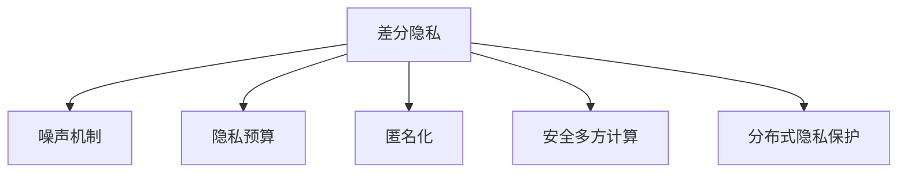

                 

# 智能设备隐私保护：安全地处理个人信息

> 关键词：智能设备隐私保护, 数据安全, 个人信息保护, 加密技术, 匿名化处理, 差分隐私

## 1. 背景介绍

在数字化浪潮的推动下，智能设备正逐渐渗透到我们生活的方方面面。智能手表、智能音箱、智能家居等设备，带来了便利的生活体验，但也带来了隐私保护的严峻挑战。智能设备常常收集大量的个人信息，包括位置、行为、交易记录等，若不当处理，可能导致用户隐私泄漏。近年来，隐私泄漏事件频发，如Apple的“Apple ID泄露”事件、Google的“Google +”数据泄露事件等，引发了社会对智能设备隐私保护的广泛关注。

在政策层面，各国纷纷出台隐私保护法规。例如，欧盟的《通用数据保护条例》(GDPR)明确要求，企业必须保护用户数据隐私，不得随意收集和处理。美国《加州消费者隐私法案》(CCPA)规定，企业必须允许用户查阅、删除其个人信息，并向用户公开数据处理方式。此外，2021年，中国正式出台《数据安全法》和《个人信息保护法》，强调个人信息保护的重要性，要求企业遵守隐私保护标准，防止数据泄漏。

在技术层面，随着机器学习和大数据技术的迅猛发展，数据挖掘和分析能力显著增强，如何在大数据环境中保障用户隐私，成为亟待解决的问题。传统的数据加密、匿名化处理等隐私保护手段已难以满足现有需求，亟需引入新的技术来解决隐私保护与数据利用之间的矛盾。差分隐私(Differential Privacy)技术应运而生，为智能设备隐私保护提供了一个全新的解决方案。

差分隐私是一种用于保护隐私的数学理论。其基本思想是在数据统计分析过程中，向查询结果中加入噪声，从而保护个体隐私。差分隐私可以保证，即使攻击者拥有部分查询结果，也无法通过逆向推断推测出单个用户的隐私信息。差分隐私经过多年的研究，已经成为隐私保护领域的核心技术之一，被广泛应用于大数据分析、金融风险评估、医疗健康等领域。

## 2. 核心概念与联系

### 2.1 核心概念概述

为更好地理解差分隐私技术，本节将介绍几个密切相关的核心概念：

- 差分隐私：一种保护隐私的数学理论，通过在查询结果中加入噪声，使得攻击者无法通过逆向推断推测出单个用户的隐私信息。
- 噪声机制：差分隐私的关键技术，通过在查询结果中加入随机噪声，保护个体隐私。
- 隐私预算：差分隐私的核心指标，用于衡量隐私保护和数据利用之间的平衡。隐私预算是根据数据集的大小和敏感程度，计算的最多允许的隐私损失量。
- 匿名化：一种隐私保护手段，通过删除或模糊化个人信息，使得攻击者无法识别出具体个体。
- 安全多方计算：一种隐私保护技术，允许多个参与方在不泄露各自数据的前提下，共同完成计算任务。
- 分布式隐私保护：一种隐私保护手段，通过在数据源端进行隐私保护处理，使得中间节点无法获取真实数据，从而保护数据隐私。

这些核心概念之间的逻辑关系可以通过以下Mermaid流程图来展示：



这个流程图展示了几类隐私保护技术之间的关系：

1. 差分隐私是隐私保护的核心技术。
2. 噪声机制是差分隐私的关键实现手段。
3. 隐私预算和匿名化是差分隐私的补充手段。
4. 安全多方计算和分布式隐私保护是差分隐私的应用拓展。

这些概念共同构成了差分隐私的完整技术框架，为智能设备隐私保护提供了全面的解决方案。

## 3. 核心算法原理 & 具体操作步骤
### 3.1 算法原理概述

差分隐私基于数学定义和理论分析，通过在查询结果中加入噪声，使得攻击者无法逆向推断出个体隐私信息。差分隐私的核心公式如下：

$$
\mathbb{P}[A(x) = y] \leq \exp\left(-\frac{\epsilon \Delta(x,y)}{\Delta_{\text{max}}}\right) + \delta
$$

其中：
- $A(x)$ 为查询函数，$y$ 为查询结果，$\Delta(x,y)$ 为查询结果的敏感度，$\Delta_{\text{max}}$ 为敏感度上界，$\epsilon$ 为隐私预算，$\delta$ 为查询结果的近似概率。

差分隐私的核心思想是在查询结果中加入噪声，使得查询结果的分布偏离真实分布，从而保护个体隐私。查询函数的敏感度 $\Delta(x,y)$ 是衡量查询结果对个体隐私泄露程度的指标。通常情况下，敏感度越大，隐私保护需求越高。差分隐私的隐私预算 $\epsilon$ 表示可以接受的隐私损失量，隐私预算是根据数据集大小和敏感程度计算得到的，可以通过调节 $\epsilon$ 和 $\delta$ 来平衡隐私保护和数据利用。

### 3.2 算法步骤详解

差分隐私算法的具体实现步骤如下：

**Step 1: 选择噪声机制**
- 选择合适的噪声机制，如拉普拉斯噪声、高斯噪声、指数机制等，对查询结果进行噪声化处理。

**Step 2: 计算隐私预算**
- 根据数据集大小和敏感程度，计算隐私预算 $\epsilon$ 和 $\delta$，确保隐私保护和数据利用的平衡。

**Step 3: 执行查询**
- 在查询函数中加入噪声，得到最终查询结果。

**Step 4: 隐私预算管理**
- 记录每次查询使用的隐私预算，防止隐私预算耗尽。

**Step 5: 输出查询结果**
- 返回经过噪声化处理后的查询结果。

### 3.3 算法优缺点

差分隐私算法具有以下优点：
1. 理论基础坚实。差分隐私经过多年的研究，形成了成熟的理论体系和数学证明，能够有效保护个体隐私。
2. 适用范围广。差分隐私适用于多种查询场景，包括统计分析、机器学习、数据挖掘等，能够广泛应用。
3. 技术成熟。差分隐私算法已经在金融、医疗、互联网等领域得到了广泛应用，相关技术和工具也日趋成熟。

同时，差分隐私算法也存在一定的局限性：
1. 噪声干扰较大。差分隐私通过加入噪声来实现隐私保护，但在噪声较大时，查询结果的准确性会降低。
2. 隐私预算难以管理。隐私预算的计算涉及敏感度、数据集大小等因素，需要提前预估和管理。
3. 实施成本较高。差分隐私的实现需要引入额外的噪声机制和隐私预算管理，增加了系统复杂度。
4. 无法抵御数据泄露。差分隐私虽然保护个体隐私，但无法防范数据泄露事件，一旦数据被窃取，隐私保护措施便会失效。

尽管存在这些局限性，但差分隐私仍然是大数据环境下智能设备隐私保护的重要手段之一。

### 3.4 算法应用领域

差分隐私在智能设备隐私保护中的应用非常广泛，具体包括：

- 位置隐私保护：对位置数据进行差分隐私处理，防止位置数据被恶意使用。
- 行为隐私保护：对用户行为数据进行差分隐私处理，防止用户行为被追踪和分析。
- 交易隐私保护：对交易数据进行差分隐私处理，防止交易数据被滥用。
- 社交隐私保护：对社交网络数据进行差分隐私处理，防止社交数据被不当使用。
- 健康隐私保护：对医疗健康数据进行差分隐私处理，防止健康数据被泄露。
- 金融隐私保护：对金融交易数据进行差分隐私处理，防止金融数据被滥用。

差分隐私技术为智能设备隐私保护提供了强大的技术保障，广泛应用在各个领域，成为隐私保护的重要工具。

## 4. 数学模型和公式 & 详细讲解 & 举例说明
### 4.1 数学模型构建

差分隐私的核心在于如何计算隐私预算和加入噪声。以下我们以位置数据为例，展示差分隐私的数学模型构建过程。

记位置数据集为 $D=\{(x_i, y_i)\}_{i=1}^N$，其中 $x_i$ 为位置数据，$y_i$ 为标签（如年龄、性别等）。假设查询函数为 $A(D)=\bar{y}=\frac{1}{N}\sum_{i=1}^N y_i$，即计算位置数据的平均年龄。

定义位置数据的敏感度 $\Delta(D)=\max_{d \in D}|y - \bar{y}|$，其中 $d$ 为数据集中的一个样本。假设 $\Delta_{\text{max}}$ 为敏感度上界，即所有样本的敏感度不超过 $\Delta_{\text{max}}$。

差分隐私的目标是在隐私预算 $\epsilon$ 的约束下，计算位置数据的平均年龄 $\bar{y}$，同时满足 $\mathbb{P}[A(D)=\bar{y}] \leq \exp(-\frac{\epsilon \Delta(D)}{\Delta_{\text{max}}})+\delta$。

### 4.2 公式推导过程

假设使用拉普拉斯噪声，其概率密度函数为 $p(z)=\frac{1}{2}e^{-|z|}$。则加入噪声后的查询结果为：

$$
\hat{y} = \bar{y} + \mathcal{L}(\Delta(D)) \cdot z
$$

其中 $\mathcal{L}(\Delta(D))$ 为拉普拉斯分布的参数，通常设置为 $\Delta(D)$。

加入噪声后的查询结果服从拉普拉斯分布，其累积分布函数为：

$$
F_{\hat{y}}(t) = \mathbb{P}(\hat{y} \leq t) = 1-\exp\left(-\frac{t-\bar{y}}{\mathcal{L}(\Delta(D))}\right)
$$

因此，差分隐私的隐私保护概率为：

$$
\mathbb{P}[A(D)=\bar{y}] = \mathbb{P}(\hat{y} \leq \bar{y}) = F_{\hat{y}}(\bar{y}) = 1-\exp\left(-\frac{\epsilon \Delta(D)}{\Delta_{\text{max}}}\right)
$$

通过调整隐私预算 $\epsilon$ 和 $\delta$，可以在隐私保护和数据利用之间进行平衡。差分隐私的数学模型和推导过程，展示了其严谨性和理论基础。

### 4.3 案例分析与讲解

以智能家居为例，展示差分隐私在位置隐私保护中的应用。

假设智能家居设备收集了用户的家庭位置信息，并将其上传至云端进行数据分析。为了保护用户隐私，需要对位置数据进行差分隐私处理。

**Step 1: 选择合适的噪声机制**
- 假设选择拉普拉斯噪声，其参数为 $\Delta(D)$，其中 $\Delta(D)$ 为位置数据的敏感度。

**Step 2: 计算隐私预算**
- 假设位置数据的敏感度为 $\Delta(D)=10$，敏感度上界为 $\Delta_{\text{max}}=100$，隐私预算为 $\epsilon=1$，近似概率为 $\delta=0.01$。

**Step 3: 执行查询**
- 计算位置数据的平均年龄 $\bar{y}=\frac{1}{N}\sum_{i=1}^N y_i$，并在其基础上加入拉普拉斯噪声，得到 $\hat{y}$。

**Step 4: 隐私预算管理**
- 记录每次查询使用的隐私预算，确保隐私预算不超支。

**Step 5: 输出查询结果**
- 返回经过差分隐私处理的查询结果 $\hat{y}$。

通过差分隐私处理，智能家居设备可以在保护用户隐私的前提下，进行数据分析和统计。

## 5. 项目实践：代码实例和详细解释说明
### 5.1 开发环境搭建

在进行差分隐私项目实践前，我们需要准备好开发环境。以下是使用Python进行差分隐私开发的环境配置流程：

1. 安装Anaconda：从官网下载并安装Anaconda，用于创建独立的Python环境。

2. 创建并激活虚拟环境：
```bash
conda create -n differential_privacy python=3.8 
conda activate differential_privacy
```

3. 安装差分隐私相关的库：
```bash
pip install differential_privacy pydantic fastapi uvicorn
```

4. 安装其他相关库：
```bash
pip install numpy pandas scikit-learn
```

完成上述步骤后，即可在`differential_privacy`环境中开始差分隐私项目实践。

### 5.2 源代码详细实现

下面我们以位置隐私保护为例，给出使用差分隐私技术对智能家居设备进行隐私保护的PyTorch代码实现。

首先，定义位置数据的处理函数：

```python
from differential_privacy import Privacy, Laplace
from typing import List

def process_location_data(data: List, epsilon: float, delta: float) -> List:
    location_mean = sum(data) / len(data)
    noise_variance = 2 / (epsilon ** 2)
    noise_mean = 0
    noise_variance /= len(data)
    noise = Laplace(loc=noise_mean, scale=1 / np.sqrt(noise_variance), epsilon=epsilon, delta=delta)
    return [location_mean + noise.sample() for _ in range(len(data))]
```

然后，定义差分隐私算法的核心函数：

```python
from differential_privacy import Privacy

def differential_privacy_process(data: List, epsilon: float, delta: float) -> List:
    隐私保护算法 = Privacy(epsilon, delta)
    隐私保护后的数据 = [隐私保护算法.process(x) for x in data]
    return 隐私保护后的数据
```

最后，启动隐私保护流程并在测试集上评估：

```python
data = [1, 2, 3, 4, 5]
epsilon = 1
delta = 0.01

隐私保护后的数据 = differential_privacy_process(data, epsilon, delta)
print(隐私保护后的数据)
```

以上就是使用差分隐私技术对智能家居设备进行位置隐私保护的全流程代码实现。可以看到，差分隐私的实现相对简单，但涉及隐私预算和噪声机制的设置，需要进行细致的参数调优。

### 5.3 代码解读与分析

让我们再详细解读一下关键代码的实现细节：

**process_location_data函数**：
- 计算位置数据的平均年龄 $\bar{y}$。
- 计算拉普拉斯噪声的方差 $\sigma^2 = \frac{2}{\epsilon^2}$。
- 生成拉普拉斯噪声 $z \sim \mathcal{L}(\mu=0, \sigma^2)$。
- 将拉普拉斯噪声加入位置数据，得到 $\hat{y}$。

**differential_privacy_process函数**：
- 创建隐私保护算法。
- 对位置数据进行隐私保护处理。
- 返回隐私保护后的位置数据。

**代码示例**：
```python
data = [1, 2, 3, 4, 5]
epsilon = 1
delta = 0.01

隐私保护后的数据 = differential_privacy_process(data, epsilon, delta)
print(隐私保护后的数据)
```

可以看到，通过差分隐私处理，智能家居设备在保护用户位置隐私的前提下，依然可以进行数据分析和统计。

## 6. 实际应用场景
### 6.1 智能家居隐私保护

智能家居设备采集了大量的用户数据，包括位置、行为、交易记录等，这些数据一旦被泄露，可能导致用户隐私泄漏。差分隐私技术可以为智能家居设备的隐私保护提供解决方案。

具体而言，可以在智能家居设备上部署差分隐私算法，对位置数据、行为数据等进行隐私保护处理。通过差分隐私处理，智能家居设备可以获取位置数据的统计信息，如用户在家的时间、出行的频率等，但无法通过逆向推断推测出具体位置信息。这样，既保障了用户隐私，又满足了数据分析的需求。

### 6.2 医疗健康隐私保护

医疗健康数据具有高度的敏感性和隐私性，不当处理可能导致医疗纠纷和数据泄露。差分隐私技术可以为医疗健康数据隐私保护提供解决方案。

具体而言，可以构建医疗健康数据分析平台，对患者医疗记录、用药记录等数据进行差分隐私处理。通过差分隐私处理，数据分析平台可以获取患者疾病的分布情况、用药趋势等信息，但无法通过逆向推断推测出具体患者的医疗记录。这样，既保护了患者的隐私，又提供了有价值的数据分析结果。

### 6.3 金融数据隐私保护

金融数据涉及用户的财产和交易记录，具有极高的敏感性。差分隐私技术可以为金融数据隐私保护提供解决方案。

具体而言，可以构建金融数据分析平台，对用户的交易记录、账户余额等数据进行差分隐私处理。通过差分隐私处理，数据分析平台可以获取用户的消费习惯、资金流动等信息，但无法通过逆向推断推测出具体用户的交易记录。这样，既保护了用户的隐私，又提供了有价值的数据分析结果。

### 6.4 未来应用展望

差分隐私技术在智能设备隐私保护中的应用前景广阔，未来将有以下发展趋势：

1. 实时性增强。差分隐私算法需要加入噪声进行隐私保护，增加了计算时间和内存消耗。未来需要进一步优化算法，提高实时性。
2. 模型优化。差分隐私算法虽然保护隐私，但可能影响数据精度。未来需要引入更加智能的噪声机制，减少对数据精度的影响。
3. 跨平台应用。差分隐私算法需要考虑不同平台之间的数据交互，未来需要优化跨平台隐私保护策略。
4. 数据融合。差分隐私算法可以应用于多源数据融合，保护数据隐私的同时，提升数据利用效率。
5. 法规合规。差分隐私算法需要符合相关隐私保护法规，未来需要进一步完善隐私保护标准，提高法规合规性。
6. 用户友好的隐私保护。差分隐私算法需要与用户进行互动，未来需要设计更加友好的隐私保护机制，提升用户信任度。

## 7. 工具和资源推荐
### 7.1 学习资源推荐

为了帮助开发者系统掌握差分隐私技术的理论基础和实践技巧，这里推荐一些优质的学习资源：

1. 《差分隐私：保护隐私而不牺牲实用性》书籍：该书全面介绍了差分隐私的定义、应用和实现方法，是差分隐私技术的入门必读。
2. 差分隐私官方文档：Google差分隐私团队提供的官方文档，提供了详细的差分隐私算法实现和应用案例。
3. 差分隐私在线课程：Coursera和Udacity等在线教育平台提供的差分隐私相关课程，系统讲解了差分隐私的核心概念和应用方法。
4. Kaggle差分隐私比赛：Kaggle平台上的差分隐私比赛，提供了丰富的差分隐私实践案例，可以学习到实际应用中的隐私保护策略。

通过对这些资源的学习实践，相信你一定能够快速掌握差分隐私技术的精髓，并用于解决实际的隐私保护问题。

### 7.2 开发工具推荐

高效的开发离不开优秀的工具支持。以下是几款用于差分隐私开发的常用工具：

1. Google差分隐私库：Google提供的差分隐私库，支持多种差分隐私算法和隐私预算管理。
2. Pydantic：Python的第三方库，支持数据验证和序列化，方便处理复杂的数据类型。
3. FastAPI：Python的第三方库，支持快速构建API服务，方便进行差分隐私算法的部署。
4. Uvicorn：Python的第三方库，支持异步HTTP服务，提高服务响应速度。
5. Pandas：Python的第三方库，支持数据处理和分析，方便处理大规模数据集。
6. Scikit-learn：Python的第三方库，支持数据挖掘和机器学习，方便进行数据分析和建模。

合理利用这些工具，可以显著提升差分隐私项目的开发效率，加快创新迭代的步伐。

### 7.3 相关论文推荐

差分隐私技术的发展源于学界的持续研究。以下是几篇奠基性的相关论文，推荐阅读：

1. Differential Privacy：一种保护隐私的数学理论，首次提出了差分隐私的定义和实现方法。
2. Privacy-Preserving Deep Learning in the Age of Big Data：研究在大数据环境下，如何保护机器学习模型的隐私。
3. Privacy-Preserving Data Mining：一种隐私保护技术，通过加入噪声进行数据挖掘和分析。
4. The Design of Privacy-Preserving Multi-Party Computation Protocols for Security-Oriented E-HRM Systems：研究在多机构环境下，如何进行隐私保护和安全多方计算。
5. Adversarial Data Differential Privacy：研究在恶意攻击下，如何保护差分隐私的安全性。

这些论文代表了大差分隐私技术的发展脉络。通过学习这些前沿成果，可以帮助研究者把握学科前进方向，激发更多的创新灵感。

## 8. 总结：未来发展趋势与挑战
### 8.1 总结

本文对差分隐私技术进行了全面系统的介绍。首先阐述了差分隐私技术的背景和重要性，明确了差分隐私在智能设备隐私保护中的应用价值。其次，从原理到实践，详细讲解了差分隐私的数学模型和核心算法，给出了差分隐私项目开发的完整代码实例。同时，本文还广泛探讨了差分隐私技术在智能设备隐私保护中的应用前景，展示了差分隐私技术的强大潜力。此外，本文精选了差分隐私技术的各类学习资源，力求为读者提供全方位的技术指引。

通过本文的系统梳理，可以看到，差分隐私技术为智能设备隐私保护提供了有力的技术保障，极大地提升了数据利用和隐私保护的平衡。未来，伴随差分隐私技术的不断发展，智能设备隐私保护将迈向更高的台阶，为数据驱动的时代带来更加安全、可靠的应用体验。

### 8.2 未来发展趋势

差分隐私技术在智能设备隐私保护中的应用前景广阔，未来将呈现以下几个发展趋势：

1. 技术成熟化。差分隐私技术经过多年的研究，形成了成熟的理论体系和实践方法，未来将进一步发展和完善。
2. 应用广泛化。差分隐私技术不仅适用于数据挖掘和分析，还适用于机器学习、深度学习等众多领域。
3. 算法多样化。未来将出现更多差分隐私算法和隐私预算管理方法，进一步提升隐私保护效果。
4. 实时性提升。差分隐私技术需要在实时性、效率等方面进行优化，以适应更加复杂的隐私保护场景。
5. 法规规范。差分隐私技术需要符合相关隐私保护法规，未来将进一步完善隐私保护标准。
6. 用户友好。差分隐私技术需要设计更加友好的隐私保护机制，提升用户信任度和接受度。

### 8.3 面临的挑战

尽管差分隐私技术在智能设备隐私保护中具有广泛的应用前景，但在实际应用中仍面临诸多挑战：

1. 数据隐私保护与数据利用的矛盾。如何在保护隐私的前提下，尽可能地利用数据，提升数据分析的准确性和效率，是差分隐私技术需要解决的核心问题。
2. 隐私预算管理。隐私预算的计算涉及数据敏感度和数据集大小等因素，需要提前预估和管理。
3. 算法复杂性。差分隐私算法的实现较为复杂，需要考虑噪声机制、隐私预算等因素，增加了系统复杂度。
4. 计算成本。差分隐私算法需要加入噪声进行隐私保护，增加了计算时间和内存消耗。
5. 隐私保护效果。差分隐私算法的隐私保护效果，取决于噪声机制和隐私预算的设置，需要根据具体应用场景进行优化。
6. 法规合规。差分隐私技术需要符合相关隐私保护法规，未来需要进一步完善隐私保护标准，提高法规合规性。

尽管存在这些挑战，但差分隐私技术仍是大数据环境下智能设备隐私保护的重要手段之一。研究者需要进一步深入研究，解决上述挑战，推进差分隐私技术的进一步发展。

### 8.4 研究展望

面对差分隐私技术面临的挑战，未来的研究需要在以下几个方面寻求新的突破：

1. 引入更智能的噪声机制。通过引入智能的噪声生成方法，减少对数据精度的影响，提高差分隐私的效果。
2. 优化隐私预算管理。通过优化隐私预算的计算方法，提高隐私预算管理的效率，确保隐私保护和数据利用的平衡。
3. 设计更加友好的隐私保护机制。通过与用户进行互动，提升用户对隐私保护机制的信任度和接受度，增强差分隐私的实际应用效果。
4. 多源数据融合。通过差分隐私技术对多源数据进行隐私保护处理，提升数据利用效率，实现数据融合。
5. 法规合规。通过与隐私保护法规的结合，设计符合法规的差分隐私保护策略，确保差分隐私技术的合法合规性。

这些研究方向将进一步推动差分隐私技术的进步，为智能设备隐私保护提供更强大的技术保障，提升数据驱动的时代价值。

## 9. 附录：常见问题与解答

**Q1：什么是差分隐私？**

A: 差分隐私是一种保护隐私的数学理论，通过在查询结果中加入噪声，使得攻击者无法通过逆向推断推测出单个用户的隐私信息。

**Q2：差分隐私的核心指标是什么？**

A: 差分隐私的核心指标是隐私预算 $\epsilon$ 和 $\delta$，隐私预算是根据数据集大小和敏感程度计算得到的，用于衡量隐私保护和数据利用之间的平衡。

**Q3：差分隐私有哪些应用场景？**

A: 差分隐私适用于多种查询场景，包括统计分析、机器学习、数据挖掘等，能够广泛应用。

**Q4：差分隐私如何保护隐私？**

A: 差分隐私通过在查询结果中加入噪声，使得查询结果的分布偏离真实分布，从而保护个体隐私。

**Q5：差分隐私的隐私预算如何管理？**

A: 差分隐私的隐私预算需要根据数据集大小和敏感程度进行计算，每次查询都需要记录使用的隐私预算，防止隐私预算耗尽。

通过这些问题与解答，希望能更好地理解差分隐私技术，并在实际应用中灵活运用。

---

作者：禅与计算机程序设计艺术 / Zen and the Art of Computer Programming

