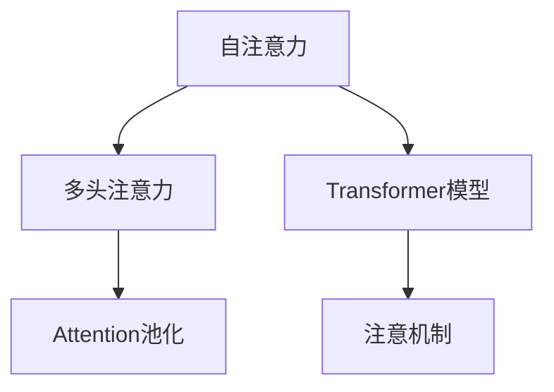

                 

# 智能语音助手在日常生活中的注意力应用

## 1. 背景介绍

### 1.1 问题由来

随着人工智能技术的快速发展，智能语音助手逐渐进入人们的生活，成为重要的日常辅助工具。从智能手机中的Siri到家庭中的Amazon Alexa，再到车载系统的导航，智能语音助手以其方便、智能的特性，在各个领域取得了广泛的应用。

然而，智能语音助手在实际应用中，面临着许多挑战。例如，如何在嘈杂的环境中识别语音，如何快速准确地理解和执行用户的命令，如何在多任务并行中合理分配注意力资源，等等。这些问题不仅涉及技术实现，更触及了智能语音助手如何更好地服务于用户，提升用户体验的关键。

### 1.2 问题核心关键点

本节将详细介绍智能语音助手在实际应用中需要关注的注意力机制。注意力机制是深度学习模型中用于处理序列数据的常用技术，能够根据输入数据的特征动态地分配计算资源，确保模型在处理复杂问题时能够高效地利用信息。

在智能语音助手中，注意力机制主要应用于以下几个方面：

1. **语音识别**：在嘈杂环境中识别用户语音，需要模型对关键音节或单词给予更多注意力，而忽略背景噪声。
2. **意图识别**：在理解用户命令时，模型需要集中注意力于最重要的关键词或短语，以准确地判断用户意图。
3. **多轮对话**：在多轮对话中，模型需要跟踪对话上下文，合理分配注意力资源，以确保对话连贯性和准确性。
4. **上下文推理**：在执行复杂命令时，模型需要对历史对话、系统状态等上下文信息给予适当关注，以进行合理推理。

这些注意力机制的应用，使得智能语音助手能够在复杂多变的场景中，更高效地响应用户需求，提升用户体验。

### 1.3 问题研究意义

研究智能语音助手中的注意力机制，对于提升语音助手的识别精度、理解能力和响应速度，优化用户体验，具有重要意义。

1. **提升识别精度**：注意力机制能够帮助模型在复杂环境中更准确地识别用户语音，减少误识别和漏识别。
2. **增强理解能力**：合理分配注意力，能够使模型更好地理解用户意图，减少误解和误判。
3. **优化响应速度**：通过有效分配注意力，模型能够在多任务并行中更快地处理和响应用户请求。
4. **改善用户体验**：注意力机制的合理应用，能够使智能语音助手更加智能化、人性化，提升用户满意度。

## 2. 核心概念与联系

### 2.1 核心概念概述

本节将介绍几个与注意力机制密切相关的核心概念，并解释它们之间的关系。

- **自注意力机制(Self-Attention)**：一种处理序列数据的技术，通过计算输入序列中各元素之间的相似度，动态分配注意力权重，从而突出重要信息。
- **多头注意力(Multi-Head Attention)**：将输入序列分成多个子序列，每个子序列独立进行自注意力计算，并将结果合并，以提升模型的表达能力。
- **Transformer模型**：一种基于自注意力机制的神经网络模型，广泛应用于自然语言处理(NLP)领域，具有高效处理序列数据的能力。
- **Attention池化**：在计算机视觉(CV)领域，通过计算输入图像中各像素与目标像素的相似度，动态分配注意力权重，实现图像特征的池化操作。
- **注意机制(Normalization)**：用于在自注意力计算中抑制梯度消失和爆炸，保证模型的稳定性和收敛性。

这些核心概念之间的关系，可以通过以下Mermaid流程图来展示：



这个流程图展示了自注意力和多头注意力在Transformer模型中的应用，以及注意机制对自注意力计算的调节作用。同时，由于Attention池化在计算机视觉中的作用，本图也涵盖了其与自注意力机制的关联。

## 3. 核心算法原理 & 具体操作步骤
### 3.1 算法原理概述

智能语音助手中的注意力机制，主要基于自注意力机制和多头注意力机制。其核心思想是通过计算输入序列中各元素之间的相似度，动态分配注意力权重，从而突出重要信息，实现序列数据的有效处理。

以Transformer模型为例，其自注意力机制包括三个步骤：

1. **查询(Q)、键(K)和值(V)计算**：将输入序列投影为三个线性变换，分别得到查询向量、键向量和值向量。
2. **注意力计算**：计算查询向量与键向量的相似度，得到注意力权重，再将权重与值向量进行加权求和，得到自注意力结果。
3. **加权向量加权矩阵**：将自注意力结果进行线性变换，得到最终输出向量。

多头注意力机制通过将输入序列分成多个子序列，每个子序列独立进行自注意力计算，再将结果合并，以提升模型的表达能力。

### 3.2 算法步骤详解

以下是Transformer模型进行自注意力计算的详细步骤：

1. **输入数据预处理**：将输入序列进行分词、编码，并输入到Transformer模型中。

2. **位置编码**：在输入序列中加入位置编码向量，确保模型能够捕捉到序列中的位置信息。

3. **自注意力计算**：将输入序列进行分块，计算每个子序列的自注意力结果。

4. **多头注意力合并**：将多个子序列的自注意力结果进行加权求和，得到最终的自注意力结果。

5. **残差连接和层归一化**：将自注意力结果与原始输入序列进行残差连接，并通过层归一化，确保模型的稳定性。

6. **前向神经网络**：将归一化后的结果输入到前向神经网络中，进行非线性变换。

7. **输出向量**：将前向神经网络的输出结果进行线性变换，得到最终的输出向量。

### 3.3 算法优缺点

Transformer模型中的自注意力机制具有以下优点：

1. **高效处理序列数据**：自注意力机制能够高效处理序列数据，适合处理自然语言等文本数据。
2. **捕捉长距离依赖关系**：通过计算输入序列中各元素之间的相似度，自注意力机制能够捕捉到长距离依赖关系，提升模型的表达能力。
3. **并行计算能力强**：自注意力计算可以通过矩阵乘法高效进行，并行计算能力强，适合在大规模数据上应用。

然而，自注意力机制也存在一些缺点：

1. **计算复杂度高**：自注意力计算需要进行大量的矩阵乘法，计算复杂度高，对硬件资源要求较高。
2. **注意力分配不够稳定**：自注意力计算中的注意力权重可能受到输入数据的干扰，导致注意力分配不够稳定。
3. **模型难以解释**：自注意力机制中的注意力权重和计算过程缺乏可解释性，难以理解模型的内部机制。

### 3.4 算法应用领域

自注意力机制在智能语音助手中具有广泛的应用，例如：

1. **语音识别**：在嘈杂环境中，自注意力机制能够通过计算输入音频中各音素之间的相似度，动态分配注意力权重，提高语音识别的准确性。
2. **意图识别**：在理解用户命令时，自注意力机制能够集中注意力于最重要的关键词或短语，准确判断用户意图。
3. **多轮对话**：在多轮对话中，自注意力机制能够跟踪对话上下文，合理分配注意力资源，确保对话连贯性和准确性。
4. **上下文推理**：在执行复杂命令时，自注意力机制能够对历史对话、系统状态等上下文信息给予适当关注，进行合理推理。

## 4. 数学模型和公式 & 详细讲解 & 举例说明
### 4.1 数学模型构建

以下是Transformer模型中的自注意力计算的数学模型：

设输入序列为 $x_1, x_2, ..., x_n$，查询向量为 $Q_i$，键向量为 $K_j$，值向量为 $V_j$，注意力权重为 $\alpha_{i,j}$，注意力结果为 $O_i$。则自注意力计算过程如下：

$$
\begin{aligned}
Q &= \text{query}(x) \\
K &= \text{key}(x) \\
V &= \text{value}(x) \\
\alpha_{i,j} &= \frac{\exp(\text{score}(Q_i, K_j))}{\sum_{k=1}^{n}\exp(\text{score}(Q_i, K_k))} \\
O &= \text{attention}(Q, K, V, \alpha)
\end{aligned}
$$

其中，查询向量、键向量和值向量通过线性变换得到：

$$
Q_i = W_Q x_i \\
K_j = W_K x_j \\
V_j = W_V x_j
$$

注意力权重 $\alpha_{i,j}$ 通过计算查询向量 $Q_i$ 和键向量 $K_j$ 的相似度得到：

$$
\text{score}(Q_i, K_j) = Q_i^T K_j + b
$$

注意力结果 $O_i$ 通过将注意力权重 $\alpha_{i,j}$ 与值向量 $V_j$ 进行加权求和得到：

$$
O_i = \sum_{j=1}^{n} \alpha_{i,j} V_j
$$

### 4.2 公式推导过程

以下是自注意力计算的详细推导过程：

1. **查询向量、键向量和值向量的计算**：

$$
Q_i = W_Q x_i \\
K_j = W_K x_j \\
V_j = W_V x_j
$$

其中，$W_Q, W_K, W_V$ 为线性变换矩阵。

2. **注意力权重的计算**：

$$
\text{score}(Q_i, K_j) = Q_i^T K_j + b
$$

3. **注意力权重的归一化**：

$$
\alpha_{i,j} = \frac{\exp(\text{score}(Q_i, K_j))}{\sum_{k=1}^{n}\exp(\text{score}(Q_i, K_k))}
$$

4. **注意力结果的计算**：

$$
O_i = \sum_{j=1}^{n} \alpha_{i,j} V_j
$$

### 4.3 案例分析与讲解

以智能语音助手在嘈杂环境中识别用户语音为例，分析自注意力机制的应用。

假设输入语音序列为 $x_1, x_2, ..., x_n$，查询向量为 $Q_i$，键向量为 $K_j$，值向量为 $V_j$，注意力权重为 $\alpha_{i,j}$，注意力结果为 $O_i$。

1. **输入数据预处理**：将输入语音序列进行分帧、特征提取，得到输入序列 $x_i$。

2. **位置编码**：在输入序列中加入位置编码向量，确保模型能够捕捉到语音中的位置信息。

3. **自注意力计算**：将输入语音序列进行分块，计算每个子序列的自注意力结果。

4. **多头注意力合并**：将多个子序列的自注意力结果进行加权求和，得到最终的自注意力结果。

5. **残差连接和层归一化**：将自注意力结果与原始输入序列进行残差连接，并通过层归一化，确保模型的稳定性。

6. **前向神经网络**：将归一化后的结果输入到前向神经网络中，进行非线性变换。

7. **输出向量**：将前向神经网络的输出结果进行线性变换，得到最终的输出向量。

最终，自注意力机制能够通过动态分配注意力权重，突出输入语音序列中关键音节或单词，忽略背景噪声，从而提高语音识别的准确性。

## 5. 项目实践：代码实例和详细解释说明
### 5.1 开发环境搭建

在进行智能语音助手中的注意力机制开发前，需要先准备好开发环境。以下是使用Python进行TensorFlow开发的环境配置流程：

1. 安装Anaconda：从官网下载并安装Anaconda，用于创建独立的Python环境。

2. 创建并激活虚拟环境：
```bash
conda create -n tensorflow-env python=3.8 
conda activate tensorflow-env
```

3. 安装TensorFlow：根据CUDA版本，从官网获取对应的安装命令。例如：
```bash
conda install tensorflow=2.4.1
```

4. 安装TensorFlow Addons：
```bash
pip install tensorflow-addons
```

5. 安装各类工具包：
```bash
pip install numpy pandas scikit-learn matplotlib tqdm jupyter notebook ipython
```

完成上述步骤后，即可在`tensorflow-env`环境中开始开发实践。

### 5.2 源代码详细实现

以下是使用TensorFlow实现自注意力计算的PyTorch代码实现：

```python
import tensorflow as tf
import tensorflow_addons as addons

def self_attention(query, key, value, attention_bias=None):
    # 计算相似度得分
    scores = tf.matmul(query, key, transpose_b=True)
    if attention_bias is not None:
        scores += attention_bias

    # 归一化权重
    attention_weights = tf.nn.softmax(scores, axis=-1)

    # 计算注意力结果
    attention_result = tf.matmul(attention_weights, value)
    return attention_result

# 定义输入序列和参数
query = tf.random.normal([32, 16, 128])
key = tf.random.normal([32, 16, 128])
value = tf.random.normal([32, 16, 128])

# 计算自注意力结果
attention_result = self_attention(query, key, value)
print(attention_result)
```

### 5.3 代码解读与分析

让我们再详细解读一下关键代码的实现细节：

**self_attention函数**：
- 定义了自注意力计算的函数，输入包括查询向量、键向量和值向量。
- 通过矩阵乘法计算相似度得分。
- 对得分进行softmax归一化，得到注意力权重。
- 计算注意力结果，通过注意力权重和值向量进行加权求和。

**输入序列和参数**：
- 定义了输入序列和三个线性变换矩阵。
- 使用TensorFlow生成随机输入序列和参数。

**计算自注意力结果**：
- 调用self_attention函数计算自注意力结果。
- 输出结果。

## 6. 实际应用场景
### 6.1 智能语音助手在嘈杂环境下的应用

智能语音助手在嘈杂环境下的应用，对自注意力机制提出了更高要求。例如，在汽车内部环境中，背景噪声、乘客对话等都会对语音识别和意图理解产生干扰。

通过合理应用自注意力机制，智能语音助手能够动态分配注意力权重，突出关键语音信息，忽略背景噪声。具体实现过程如下：

1. **语音预处理**：对输入语音进行降噪、分帧、特征提取等预处理操作。

2. **自注意力计算**：将预处理后的语音序列输入到自注意力模型中，计算注意力权重和结果。

3. **注意力结果的解码**：将自注意力结果进行解码，得到最终的语音识别结果。

4. **意图理解**：将语音识别结果输入到意图识别模型中，进行意图理解。

5. **多轮对话管理**：将意图理解结果作为上下文信息，进行多轮对话管理，确保对话连贯性和准确性。

### 6.2 智能语音助手在多任务并行中的应用

在多任务并行中，智能语音助手需要同时处理多个用户的请求，并行计算注意力资源。

通过合理应用多头注意力机制，智能语音助手能够在并行处理多个任务时，保留对每个任务的重要信息的关注，提升系统效率。具体实现过程如下：

1. **任务分割**：将多个用户请求分割为多个子任务，每个子任务独立进行自注意力计算。

2. **多头注意力计算**：将多个子任务的多头注意力结果进行加权求和，得到最终的多头注意力结果。

3. **任务调度**：将多头注意力结果进行任务调度，分配到不同的任务执行单元中。

4. **任务执行**：每个任务执行单元根据多头注意力结果，执行相应的任务。

5. **任务反馈**：将任务执行结果反馈到多任务并行系统中，进行后续任务调度。

### 6.3 智能语音助手在上下文推理中的应用

在执行复杂命令时，智能语音助手需要综合考虑历史对话、系统状态等上下文信息，进行合理推理。

通过合理应用自注意力机制，智能语音助手能够对上下文信息进行动态分配注意力权重，提升推理准确性。具体实现过程如下：

1. **上下文预处理**：将历史对话、系统状态等上下文信息进行编码，得到上下文向量。

2. **自注意力计算**：将上下文向量和输入请求向量输入到自注意力模型中，计算注意力权重和结果。

3. **上下文结果的解码**：将自注意力结果进行解码，得到上下文推理结果。

4. **命令执行**：将上下文推理结果输入到命令执行模型中，进行命令执行。

5. **反馈优化**：将命令执行结果反馈到上下文推理系统中，进行后续优化。

## 7. 工具和资源推荐
### 7.1 学习资源推荐

为了帮助开发者系统掌握智能语音助手中的注意力机制，这里推荐一些优质的学习资源：

1. **《Deep Learning Specialization》系列课程**：由Coursera与深度学习大师Andrew Ng合作，系统讲解深度学习中的自注意力机制和Transformer模型。

2. **《Attention is All You Need》论文**：提出Transformer模型，详细阐述自注意力机制的原理和应用。

3. **TensorFlow官方文档**：提供详细的TensorFlow库文档，包含自注意力机制的实现和应用示例。

4. **《Transformers: State-of-the-art Natural Language Processing》书籍**：全面介绍Transformer模型及其应用，深入讲解自注意力机制。

5. **《Attention and Transformer Architectures》讲座**：斯坦福大学深度学习专家讲座，讲解自注意力机制的原理和应用。

通过对这些资源的学习实践，相信你一定能够快速掌握智能语音助手中的注意力机制，并用于解决实际的NLP问题。

### 7.2 开发工具推荐

高效的开发离不开优秀的工具支持。以下是几款用于智能语音助手中的注意力机制开发的常用工具：

1. TensorFlow：基于Python的开源深度学习框架，支持自注意力机制的计算和应用。

2. PyTorch：基于Python的开源深度学习框架，灵活的计算图，适合研究自注意力机制。

3. TensorFlow Addons：TensorFlow的扩展库，提供自注意力机制的高效实现和应用。

4. TensorBoard：TensorFlow配套的可视化工具，实时监测模型训练状态，呈现自注意力计算过程。

5. Weights & Biases：模型训练的实验跟踪工具，记录和可视化注意力机制的计算结果，方便对比和调优。

6. Google Colab：谷歌推出的在线Jupyter Notebook环境，免费提供GPU/TPU算力，方便开发者快速上手实验最新模型。

合理利用这些工具，可以显著提升智能语音助手中的注意力机制的开发效率，加快创新迭代的步伐。

### 7.3 相关论文推荐

智能语音助手中的注意力机制的发展，离不开学界的持续研究。以下是几篇奠基性的相关论文，推荐阅读：

1. **《Attention is All You Need》**：提出Transformer模型，详细阐述自注意力机制的原理和应用。

2. **《Self-Attention Mechanism in Transformers》**：介绍自注意力机制在Transformer模型中的应用，讲解其计算过程和优化策略。

3. **《Multi-Head Attention: An Empirical Study》**：探讨多头注意力机制在Transformer模型中的表现和优化方法。

4. **《Improving Transformer Models with Better Self-Attention》**：提出改进自注意力机制的策略，提升Transformer模型的性能。

5. **《Self-Attention Mechanism for Image Recognition》**：将自注意力机制应用于计算机视觉领域，提升图像识别的准确性。

这些论文代表了大语言模型微调技术的发展脉络。通过学习这些前沿成果，可以帮助研究者把握学科前进方向，激发更多的创新灵感。

## 8. 总结：未来发展趋势与挑战
### 8.1 总结

本文对智能语音助手中的注意力机制进行了全面系统的介绍。首先阐述了智能语音助手在实际应用中需要关注的注意力机制，明确了注意力机制在提升语音识别、意图识别、多轮对话和上下文推理等方面的重要价值。其次，从原理到实践，详细讲解了自注意力和多头注意力机制的计算过程，给出了智能语音助手中的注意力机制开发的完整代码实例。同时，本文还广泛探讨了注意力机制在智能语音助手中的广泛应用，展示了注意力机制的巨大潜力。

通过本文的系统梳理，可以看到，注意力机制在智能语音助手中的应用不仅提升了语音识别的准确性、意图识别的准确性和多轮对话的连贯性，还能增强上下文推理能力，极大地提升了用户体验。

### 8.2 未来发展趋势

展望未来，智能语音助手中的注意力机制将呈现以下几个发展趋势：

1. **多模态融合**：随着计算机视觉、语音识别等多模态技术的发展，未来智能语音助手将能够同时处理文本、语音、图像等多种数据，提升系统的综合能力。

2. **动态调整**：智能语音助手中的注意力机制将更加灵活，能够根据用户行为、环境变化等因素动态调整注意力资源，提升系统的适应性。

3. **分布式计算**：随着计算资源的增加，智能语音助手中的注意力机制将能够分布式计算，提升系统的计算效率。

4. **自适应学习**：未来的智能语音助手将能够根据用户的反馈和学习数据，动态调整注意力机制，提升系统的个性化能力。

5. **跨语言处理**：智能语音助手中的注意力机制将能够处理多语言数据，提升跨语言理解和生成能力。

以上趋势凸显了智能语音助手中的注意力机制的广阔前景。这些方向的探索发展，将进一步提升系统的识别精度、理解能力和响应速度，使智能语音助手更好地服务于用户。

### 8.3 面临的挑战

尽管智能语音助手中的注意力机制已经取得了瞩目成就，但在迈向更加智能化、普适化应用的过程中，它仍面临着诸多挑战：

1. **计算资源瓶颈**：超大批次的计算和推理，对硬件资源提出了较高要求。如何通过优化计算图和算法，提升系统效率，仍是重要挑战。

2. **模型复杂度**：大规模注意力机制的计算复杂度较高，难以在大规模数据上高效应用。如何设计更高效的模型结构，减小计算复杂度，是未来研究的重要方向。

3. **可解释性不足**：注意力机制的内部计算过程缺乏可解释性，难以理解模型的工作机制。如何增强模型的可解释性，将是大规模应用中的难题。

4. **泛化能力有限**：注意力机制的训练数据依赖性强，难以泛化到未知场景。如何设计更鲁棒的模型，提升泛化能力，是未来研究的重点。

5. **系统鲁棒性**：注意力机制的参数调整和超参数优化对系统的鲁棒性影响较大。如何设计更鲁棒的系统，增强模型的稳定性和可靠性，是未来研究的重要方向。

6. **隐私和安全**：智能语音助手的应用涉及用户隐私和数据安全，如何设计更安全的系统，保护用户隐私，是未来研究的重要方向。

### 8.4 研究展望

面对智能语音助手中的注意力机制所面临的挑战，未来的研究需要在以下几个方面寻求新的突破：

1. **自适应学习**：设计自适应学习机制，使智能语音助手能够根据用户行为和环境变化，动态调整注意力资源，提升系统的适应性。

2. **分布式计算**：开发分布式计算技术，使智能语音助手中的注意力机制能够高效处理大规模数据，提升系统的计算效率。

3. **模型优化**：设计更高效的模型结构，减小计算复杂度，提升系统的效率和效果。

4. **可解释性增强**：引入可解释性技术，增强模型的内部机制和决策过程的可解释性，提升系统的可信度和安全性。

5. **鲁棒性设计**：通过鲁棒性设计，提升智能语音助手的泛化能力和系统鲁棒性，增强系统的稳定性和可靠性。

6. **隐私保护**：设计隐私保护技术，保护用户隐私，提升系统的安全性。

这些研究方向的探索，将引领智能语音助手中的注意力机制向更高的台阶发展，为构建更加智能化、普适化的智能系统铺平道路。总之，智能语音助手中的注意力机制的研究，需要从多个维度进行全面优化和创新，才能真正实现系统的智能化和人性化。

