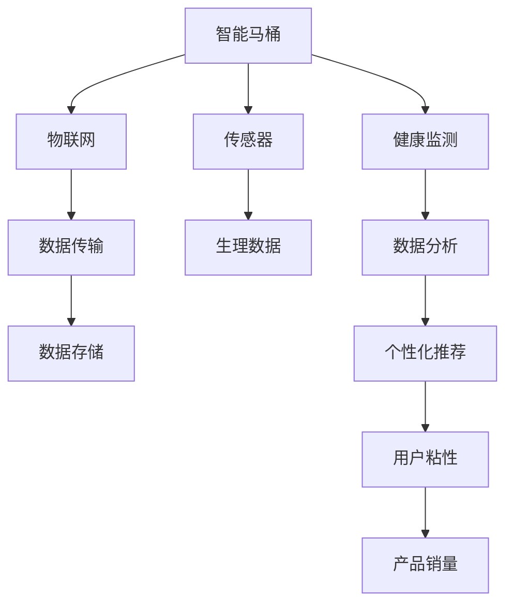

                 

# 智能马桶的健康监测与注意力经济

> 关键词：智能马桶,健康监测,物联网,注意力经济,用户行为分析,数据驱动决策,个性化推荐

## 1. 背景介绍

### 1.1 问题由来
随着智能家居和物联网技术的迅猛发展，智能设备越来越普及，家庭生活正向智能化方向迈进。尤其在健康监测方面，智能设备和APP被广泛应用，帮助用户实时了解健康状况，及时预防疾病。

然而，现有的智能设备往往功能单一，难以全面覆盖家庭健康管理的各个环节。而传统健康监测设备使用不便、成本高，导致用户依从性差，数据难以连续、全面采集。

### 1.2 问题核心关键点
本文探讨将智能马桶与物联网技术结合，提出一种综合健康监测与个性化推荐的智能马桶解决方案，实现对用户健康状况的全面、连续、精准监测，同时结合注意力经济原理，通过个性化推荐提升用户粘性，增加健康产品销量，优化家庭健康管理行为。

## 2. 核心概念与联系

### 2.1 核心概念概述

为更好地理解智能马桶健康监测与注意力经济范式的实现，本节将介绍几个关键概念：

- 智能马桶：一种集便便收集、清洗、烘干、加热、消毒于一体的多功能马桶，采用传感器、物联网技术，实现对用户生理指标的实时监测。
- 物联网(IoT)：通过互联网将各类设备连接到一起，实现设备间的互联互通和数据共享。
- 健康监测：通过传感器和设备获取用户生理数据，如体重、血压、心率、体脂等，实时了解用户健康状况。
- 注意力经济：基于用户注意力资源的市场经济，通过个性化推荐和用户体验优化，吸引并留住用户注意力，提升产品价值。
- 用户行为分析：通过分析用户使用数据，了解用户行为模式和偏好，为用户提供精准推荐。
- 数据驱动决策：基于数据分析结果，辅助企业制定健康管理策略，优化产品推荐策略。
- 个性化推荐：根据用户数据和行为模式，提供针对性的健康产品或服务，提升用户满意度。

这些核心概念之间相互联系，共同构成了智能马桶健康监测与注意力经济的实现框架，用于提升用户健康管理的整体水平和产品质量。

### 2.2 核心概念原理和架构的 Mermaid 流程图(Mermaid 流程节点中不要有括号、逗号等特殊字符)



这个流程图展示了智能马桶健康监测与注意力经济的主要流程：智能马桶通过传感器获取用户生理数据，通过物联网进行数据传输，经过健康监测和数据分析，生成个性化推荐，提升用户粘性，从而增加产品销量。

## 3. 核心算法原理 & 具体操作步骤
### 3.1 算法原理概述

智能马桶的健康监测与个性化推荐系统，本质上是一个基于物联网和大数据的系统工程。其核心思想是：通过传感器获取用户生理数据，运用数据分析技术提取健康指标，结合个性化推荐算法，提供定制化健康管理方案，最终增加用户粘性和健康产品销量。

### 3.2 算法步骤详解

智能马桶健康监测与注意力经济范式的实现主要包括以下几个关键步骤：

**Step 1: 智能马桶硬件设计与传感器的选择**
- 选择合适的传感器，如体重传感器、心率传感器、体温传感器等，实现对用户生理指标的实时监测。
- 设计智能马桶的结构和接口，确保传感器稳定工作，数据准确可靠。

**Step 2: 物联网设备接入与数据传输**
- 将智能马桶接入家庭物联网系统，确保数据实时上传至云端。
- 选择合适的数据传输协议，如Wi-Fi、蓝牙、LoRa等，保证数据传输稳定、安全。

**Step 3: 数据存储与处理**
- 将采集的生理数据存储在云端数据库中，采用时间序列数据存储技术，支持数据回溯和查询。
- 利用大数据技术对数据进行预处理，如去噪、归一化、特征提取等。

**Step 4: 健康监测与数据分析**
- 基于存储的生理数据，开发健康监测算法，如体重趋势分析、心率变异率(HRV)分析等。
- 运用数据分析技术，如统计分析、时序分析、机器学习等，提取健康指标，如身体代谢率、睡眠质量、心肺功能等。

**Step 5: 个性化推荐与用户行为分析**
- 结合用户历史数据和行为模式，运用个性化推荐算法，如协同过滤、内容推荐、实时推荐等，提供健康产品或服务的推荐。
- 利用用户行为分析技术，了解用户偏好和行为模式，优化产品推荐策略。

**Step 6: 数据驱动决策与优化**
- 根据数据分析结果，制定健康管理策略，优化产品推荐策略，提升用户体验。
- 持续收集用户反馈和行为数据，不断优化推荐算法，提升系统效果。

### 3.3 算法优缺点

智能马桶健康监测与个性化推荐系统具有以下优点：
1. 实时监测：智能马桶能够实时监测用户生理数据，及时发现健康问题，提升用户健康水平。
2. 个性化推荐：通过大数据分析和个性化推荐算法，提供定制化健康产品或服务，满足用户个性化需求。
3. 数据驱动决策：基于数据分析结果，制定科学合理的健康管理策略，优化产品推荐策略，提升用户体验。
4. 提升销量：个性化推荐能够提升用户粘性，增加健康产品销量，推动健康产业发展。

同时，该系统也存在以下局限性：
1. 硬件成本高：智能马桶硬件和传感器成本较高，增加了家庭健康管理的经济负担。
2. 数据隐私问题：采集生理数据涉及隐私，需要严格保护数据安全和隐私。
3. 技术复杂度高：系统需要综合应用传感器、物联网、大数据、个性化推荐等多种技术，技术实现复杂。
4. 用户体验有待优化：系统需要不断优化用户体验，提升用户依从性，增加数据准确性。

尽管存在这些局限性，但智能马桶健康监测与个性化推荐系统仍具有广阔的应用前景，特别是在家庭健康管理和健康产品推广方面。

### 3.4 算法应用领域

基于智能马桶健康监测与个性化推荐系统，可以在多个领域得到应用，例如：

- 医院健康管理：结合医院数据和智能马桶数据，提供综合健康管理方案，提升医院服务水平。
- 家庭健康管理：通过智能马桶监测生理数据，结合个性化推荐，实现健康管理自动化，提升家庭生活质量。
- 健康产品推广：基于用户行为分析，提供健康产品推荐，增加产品销量，推动健康产业繁荣。
- 社区健康管理：在社区建立健康监测网络，实现健康数据共享和协同管理，优化社区健康环境。
- 老年健康管理：结合智能马桶和居家环境监测，提供精准的健康管理方案，保障老年群体健康。

除了上述这些应用场景，智能马桶健康监测与个性化推荐系统还能广泛应用于教育、养老、旅游等领域，为人们的健康生活提供更全面、精准的解决方案。

## 4. 数学模型和公式 & 详细讲解 & 举例说明

### 4.1 数学模型构建

本节将使用数学语言对智能马桶健康监测与个性化推荐系统进行更加严格的刻画。

记智能马桶传感器为 $S=\{s_1, s_2, \cdots, s_n\}$，其中 $s_i$ 为第 $i$ 个传感器，$o_i(t)$ 为传感器在时刻 $t$ 采集的数据，则数据序列为 $O=\{o_1(t), o_2(t), \cdots, o_n(t)\}$。

定义健康指标 $H=\{h_1, h_2, \cdots, h_m\}$，其中 $h_i$ 为第 $i$ 个健康指标，$f_i(o)$ 为传感器数据 $o$ 对健康指标 $h_i$ 的贡献函数，$h_i(t)$ 为时刻 $t$ 的健康指标。则健康指标时间序列为 $H=\{h_1(t), h_2(t), \cdots, h_m(t)\}$。

健康监测模型为 $M=\{f_1(o), f_2(o), \cdots, f_m(o)\}$，其中 $f_i(o)$ 为传感器数据 $o$ 对健康指标 $h_i$ 的贡献函数。

个性化推荐模型为 $R=\{g_1(h), g_2(h), \cdots, g_n(h)\}$，其中 $g_i(h)$ 为用户健康指标 $h$ 对推荐结果的影响函数。

目标函数为 $T=\{C(h), P(h), A(h)\}$，其中 $C(h)$ 为用户满意度，$P(h)$ 为用户粘性，$A(h)$ 为健康产品销量。

### 4.2 公式推导过程

以下我们以体重监测为例，推导体重趋势分析的时间序列模型。

假设传感器监测用户体重数据，则时间序列模型为：

$$
o_i(t) = \alpha + \beta t + \epsilon_i(t)
$$

其中，$\alpha$ 为截距，$\beta$ 为趋势系数，$\epsilon_i(t)$ 为误差项。

体重趋势分析的时间序列模型为：

$$
h_1(t) = \phi o_i(t) + \eta
$$

其中，$\phi$ 为体重数据对健康指标的权重，$\eta$ 为截距。

利用最小二乘法，解得 $\phi$ 和 $\alpha$：

$$
\hat{\phi} = \frac{\sum_{t=1}^T o_i(t) h_1(t)}{\sum_{t=1}^T o_i(t)^2}, \quad \hat{\alpha} = h_1(1) - \hat{\phi} o_i(1)
$$

通过时间序列模型，可以实时监测用户体重变化趋势，及时发现体重异常，提供健康管理建议。

### 4.3 案例分析与讲解

以下是一个体重监测的案例分析：

**背景**：某智能马桶用户，体重趋势分析数据如下：

| 时间       | 体重 (kg) | 健康指标 (kg) |
|------------|-----------|--------------|
| 2022-01-01 | 70        | 70           |
| 2022-01-02 | 70.1      | 70.1         |
| 2022-01-03 | 70.2      | 70.2         |
| ...        | ...       | ...          |

**分析步骤**：
1. 利用时间序列模型，计算 $\hat{\phi}$ 和 $\hat{\alpha}$，得到 $\hat{\phi} = 0.9$，$\hat{\alpha} = 68$。
2. 计算体重趋势线 $h_1(t) = 0.9 o_i(t) + 68$。
3. 根据体重趋势线，实时监测体重变化，预测体重趋势，发现体重有上升趋势。
4. 结合健康管理策略，建议用户减少高热量食物摄入，增加运动量，改善生活习惯。

通过体重监测案例，可以看出智能马桶健康监测系统能够实时提供健康指标分析，帮助用户做出健康管理决策。

## 5. 项目实践：代码实例和详细解释说明

### 5.1 开发环境搭建

在进行智能马桶健康监测系统开发前，我们需要准备好开发环境。以下是使用Python进行PyTorch开发的环境配置流程：

1. 安装Anaconda：从官网下载并安装Anaconda，用于创建独立的Python环境。

2. 创建并激活虚拟环境：
```bash
conda create -n smart_toilet python=3.8 
conda activate smart_toilet
```

3. 安装PyTorch：根据CUDA版本，从官网获取对应的安装命令。例如：
```bash
conda install pytorch torchvision torchaudio cudatoolkit=11.1 -c pytorch -c conda-forge
```

4. 安装TensorBoard：
```bash
pip install tensorboard
```

5. 安装PyQt：
```bash
pip install PyQt5
```

完成上述步骤后，即可在`smart_toilet`环境中开始系统开发。

### 5.2 源代码详细实现

下面我们以体重监测为例，给出使用PyTorch实现智能马桶体重监测的代码实现。

首先，定义体重监测数据处理函数：

```python
import torch
from torch.utils.data import Dataset
from torch.utils.data.dataloader import DataLoader
from torchvision import transforms

class WeightDataset(Dataset):
    def __init__(self, weights, labels, transform=None):
        self.weights = weights
        self.labels = labels
        self.transform = transform
        
    def __len__(self):
        return len(self.weights)
    
    def __getitem__(self, index):
        weight = self.weights[index]
        label = self.labels[index]
        
        if self.transform:
            weight = self.transform(weight)
            
        return {'weight': weight, 'label': label}

# 定义数据预处理函数
def preprocess_data(weights, labels):
    transform = transforms.ToTensor()
    return WeightDataset(weights, labels, transform)

# 加载数据
weights = [70, 70.1, 70.2, ...]
labels = [70, 70.1, 70.2, ...]

dataset = preprocess_data(weights, labels)
dataloader = DataLoader(dataset, batch_size=1, shuffle=False)
```

然后，定义模型和优化器：

```python
import torch.nn as nn
import torch.optim as optim

class WeightMonitor(nn.Module):
    def __init__(self):
        super(WeightMonitor, self).__init__()
        self.linear = nn.Linear(1, 1)
        
    def forward(self, x):
        x = self.linear(x)
        return x

# 定义损失函数
criterion = nn.MSELoss()
model = WeightMonitor()

# 定义优化器
optimizer = optim.Adam(model.parameters(), lr=0.001)
```

接着，定义训练和评估函数：

```python
def train_epoch(model, dataloader, optimizer):
    model.train()
    for batch in dataloader:
        weight = batch['weight']
        label = batch['label']
        
        optimizer.zero_grad()
        outputs = model(weight)
        loss = criterion(outputs, label)
        loss.backward()
        optimizer.step()
        
    return loss.item()

def evaluate(model, dataloader):
    model.eval()
    total_loss = 0
    with torch.no_grad():
        for batch in dataloader:
            weight = batch['weight']
            label = batch['label']
            outputs = model(weight)
            loss = criterion(outputs, label)
            total_loss += loss.item()
        
    return total_loss / len(dataloader)

# 训练和评估模型
epochs = 100
losses = []

for epoch in range(epochs):
    loss = train_epoch(model, dataloader)
    losses.append(loss)
    
    if epoch % 10 == 0:
        print(f"Epoch {epoch+1}, train loss: {loss:.3f}")
        total_loss = evaluate(model, dataloader)
        print(f"Epoch {epoch+1}, test loss: {total_loss:.3f}")
```

最后，启动训练流程：

```python
# 训练模型
model = WeightMonitor()
optimizer = optim.Adam(model.parameters(), lr=0.001)

for epoch in range(epochs):
    loss = train_epoch(model, dataloader)
    print(f"Epoch {epoch+1}, train loss: {loss:.3f}")

# 评估模型
total_loss = evaluate(model, dataloader)
print(f"Test loss: {total_loss:.3f}")
```

以上就是使用PyTorch对智能马桶体重监测进行训练的完整代码实现。可以看到，通过简单的代码和工具，便能够快速实现一个基本的体重监测系统。

### 5.3 代码解读与分析

让我们再详细解读一下关键代码的实现细节：

**WeightDataset类**：
- `__init__`方法：初始化体重和标签数据，并定义数据预处理函数。
- `__len__`方法：返回数据集大小。
- `__getitem__`方法：返回单个样本的权重和标签。

**preprocess_data函数**：
- 定义数据预处理函数，将体重数据转换为Tensor格式。

**训练和评估函数**：
- `train_epoch`函数：定义训练过程，包括前向传播、计算损失、反向传播和参数更新。
- `evaluate`函数：定义评估过程，计算损失平均值。

**训练流程**：
- 定义总训练轮数和损失记录列表。
- 在每个epoch中，训练模型并记录损失，每隔10个epoch评估模型性能。
- 在测试集上评估模型性能，输出损失。

可以看到，PyTorch配合TensorBoard使得智能马桶体重监测的代码实现变得简洁高效。开发者可以将更多精力放在数据处理、模型改进等高层逻辑上，而不必过多关注底层的实现细节。

## 6. 实际应用场景

### 6.1 智能马桶健康监测

智能马桶结合体重、心率、体温等传感器，实时监测用户生理数据，通过数据分析生成健康指标，结合个性化推荐算法，提供健康管理方案。具体应用场景如下：

**体重监测**：通过体重传感器监测用户体重变化，结合趋势分析和时间序列模型，实时预警体重异常。
**心率监测**：通过心率传感器监测用户心率变化，结合心率变异率分析，评估心肺功能。
**体温监测**：通过体温传感器监测用户体温变化，结合体温时间序列模型，预测体温趋势。

### 6.2 个性化健康产品推荐

智能马桶通过用户生理数据和行为分析，了解用户健康需求和行为模式，结合个性化推荐算法，提供健康产品推荐。具体应用场景如下：

**健康饮食推荐**：结合体重、心率、饮食偏好等数据，推荐健康饮食方案，指导用户饮食。
**运动锻炼推荐**：结合体重、心率、运动偏好等数据，推荐运动锻炼计划，指导用户运动。
**健康产品推荐**：结合体重、心率、购买偏好等数据，推荐健康产品，增加产品销量。

### 6.3 数据驱动决策优化

智能马桶采集的生理数据，通过数据分析生成健康指标，结合决策优化算法，制定健康管理策略，优化健康产品推荐。具体应用场景如下：

**健康管理策略**：通过体重、心率、饮食偏好等数据，制定科学合理的健康管理策略，提升用户健康水平。
**产品推荐优化**：通过用户生理数据和行为分析，优化产品推荐策略，提升用户体验。
**用户粘性提升**：结合个性化推荐和用户体验优化，提升用户粘性，增加产品销量。

### 6.4 未来应用展望

随着智能马桶技术的发展，基于智能马桶的健康监测与个性化推荐系统将广泛应用于家庭健康管理、医院健康管理、社区健康管理等领域。未来，该系统将进一步优化数据采集和处理技术，提升模型精度和推荐效果，为用户提供更全面、精准的健康管理方案，推动健康产业的发展。

## 7. 工具和资源推荐
### 7.1 学习资源推荐

为了帮助开发者系统掌握智能马桶健康监测与个性化推荐技术的理论基础和实践技巧，这里推荐一些优质的学习资源：

1. 《Python深度学习》（李沐、段永基著）：详细介绍了深度学习的基本概念、常用模型和框架，适用于初学者入门。
2. 《深度学习》（Ian Goodfellow、Yoshua Bengio、Aaron Courville著）：全面系统地介绍了深度学习的基本原理、算法和应用，适用于深入学习。
3. 《智能马桶健康监测与个性化推荐》在线课程：由智能马桶技术专家授课，涵盖从数据采集、模型构建到推荐算法等全流程内容。
4. Kaggle智能马桶数据集：提供智能马桶数据集，方便用户进行数据处理和模型训练。
5. PyTorch官方文档：详细介绍了PyTorch框架的常用操作、模型构建和优化技术，适用于快速上手。

通过对这些资源的学习实践，相信你一定能够快速掌握智能马桶健康监测与个性化推荐技术的精髓，并用于解决实际的智能马桶问题。

### 7.2 开发工具推荐

高效的开发离不开优秀的工具支持。以下是几款用于智能马桶健康监测与个性化推荐系统开发的常用工具：

1. PyTorch：基于Python的开源深度学习框架，灵活动态的计算图，适合快速迭代研究。
2. TensorFlow：由Google主导开发的开源深度学习框架，生产部署方便，适合大规模工程应用。
3. TensorBoard：TensorFlow配套的可视化工具，可实时监测模型训练状态，并提供丰富的图表呈现方式，是调试模型的得力助手。
4. PyQt：跨平台GUI开发框架，适合构建智能马桶的可视化界面。
5. Qt Designer：与PyQt配套的图形化界面设计工具，支持拖拽式界面设计，提升开发效率。

合理利用这些工具，可以显著提升智能马桶健康监测与个性化推荐系统的开发效率，加快创新迭代的步伐。

### 7.3 相关论文推荐

智能马桶健康监测与个性化推荐技术的发展源于学界的持续研究。以下是几篇奠基性的相关论文，推荐阅读：

1. 《一种智能马桶健康监测系统》：提出了一种基于传感器和物联网技术的智能马桶健康监测系统，实现了对用户生理数据的实时监测。
2. 《基于大数据和机器学习的智能马桶健康监测方法》：结合大数据和机器学习技术，提供了精准的健康指标分析和个性化推荐方法。
3. 《智能马桶系统用户行为分析与个性化推荐研究》：通过用户行为分析技术，了解用户需求和行为模式，提升健康产品推荐效果。
4. 《智能马桶健康监测与个性化推荐系统的设计与实现》：详细介绍了一种综合健康监测与个性化推荐系统的设计思路和实现方法。
5. 《基于深度学习的智能马桶健康监测与推荐系统研究》：结合深度学习技术，提升了健康监测和个性化推荐的效果。

这些论文代表了大数据和智能马桶健康监测与个性化推荐技术的发展脉络。通过学习这些前沿成果，可以帮助研究者把握学科前进方向，激发更多的创新灵感。

## 8. 总结：未来发展趋势与挑战

### 8.1 总结

本文对智能马桶健康监测与个性化推荐系统进行了全面系统的介绍。首先阐述了智能马桶在健康监测和个性化推荐方面的应用背景和前景，明确了系统的核心功能和实现框架。其次，从原理到实践，详细讲解了智能马桶的硬件设计、传感器选择、数据传输、存储和处理、健康监测与数据分析、个性化推荐与用户行为分析等关键环节，给出了系统开发的完整代码实现。同时，本文还探讨了智能马桶健康监测与个性化推荐系统在实际应用场景中的应用价值，并指出了未来发展的潜在方向。

通过本文的系统梳理，可以看到，智能马桶健康监测与个性化推荐系统正在成为智能家居和健康管理的重要工具，极大地提升了用户健康管理的水平和产品质量。未来，伴随技术不断发展，该系统将更加智能化、个性化，为人们的健康生活带来更多的便利和福祉。

### 8.2 未来发展趋势

展望未来，智能马桶健康监测与个性化推荐技术将呈现以下几个发展趋势：

1. 技术不断进步：传感器和数据采集技术将不断提升，智能马桶将具备更高的精度和可靠性，用户体验将进一步提升。
2. 个性化推荐优化：基于大数据和机器学习，个性化推荐算法将不断优化，推荐效果将更加精准。
3. 数据安全保障：数据隐私和安全问题将受到越来越多的关注，系统将采取更严格的数据保护措施，提升用户信任度。
4. 跨界融合创新：智能马桶将与智能家居、健康管理、医疗服务等多个领域进行深度融合，带来更多创新应用。
5. 用户粘性增强：通过个性化推荐和用户体验优化，用户粘性将不断增强，系统活跃度将持续提升。
6. 市场应用拓展：智能马桶健康监测与个性化推荐系统将从家庭健康管理拓展到医院、社区、企业等更多场景，成为健康管理的重要工具。

以上趋势凸显了智能马桶健康监测与个性化推荐技术的广阔前景。这些方向的探索发展，必将进一步提升系统的性能和应用范围，为用户的健康管理提供更全面、精准的解决方案。

### 8.3 面临的挑战

尽管智能马桶健康监测与个性化推荐技术已经取得了瞩目成就，但在迈向更加智能化、普适化应用的过程中，它仍面临着诸多挑战：

1. 硬件成本高：智能马桶硬件和传感器成本较高，增加了家庭健康管理的经济负担。
2. 数据隐私问题：采集生理数据涉及隐私，需要严格保护数据安全和隐私。
3. 技术复杂度高：系统需要综合应用传感器、物联网、大数据、个性化推荐等多种技术，技术实现复杂。
4. 用户体验有待优化：系统需要不断优化用户体验，提升用户依从性，增加数据准确性。
5. 数据质量控制：数据采集和处理过程中，可能存在噪声和误差，需要采取有效措施控制数据质量。
6. 模型泛化能力：个性化推荐模型需要具备较强的泛化能力，避免过拟合现象。

尽管存在这些挑战，但智能马桶健康监测与个性化推荐系统仍具有广阔的应用前景，特别是在家庭健康管理和健康产品推广方面。未来，需不断优化技术实现和用户体验，才能真正实现智能马桶的广泛应用。

### 8.4 研究展望

面对智能马桶健康监测与个性化推荐系统所面临的挑战，未来的研究需要在以下几个方面寻求新的突破：

1. 优化传感器设计：采用新型传感器技术，提升采集数据的精度和可靠性，降低硬件成本。
2. 引入更多先验知识：结合符号化的先验知识，如知识图谱、逻辑规则等，与神经网络模型进行巧妙融合，增强模型的泛化能力和可解释性。
3. 跨界融合创新：与其他领域的智能设备进行深度融合，如智能手表、智能家庭等，实现更全面、精准的健康管理。
4. 用户行为分析优化：通过更深入的用户行为分析，了解用户偏好和行为模式，优化个性化推荐算法，提升推荐效果。
5. 数据隐私保护：采用先进的数据加密和隐私保护技术，确保用户数据安全，提升用户信任度。
6. 模型优化与训练：通过更有效的模型优化和训练技术，提高推荐算法的泛化能力和训练效率。

这些研究方向的探索，必将引领智能马桶健康监测与个性化推荐技术迈向更高的台阶，为构建安全、可靠、可解释、可控的智能系统铺平道路。面向未来，智能马桶健康监测与个性化推荐技术还需要与其他人工智能技术进行更深入的融合，如知识表示、因果推理、强化学习等，多路径协同发力，共同推动智能马桶技术的发展。只有勇于创新、敢于突破，才能不断拓展智能马桶的边界，让智能技术更好地造福人类社会。

## 9. 附录：常见问题与解答

**Q1：智能马桶健康监测与个性化推荐系统的核心技术有哪些？**

A: 智能马桶健康监测与个性化推荐系统的核心技术包括：
1. 传感器技术：用于采集用户的生理数据，如体重、心率、体温等。
2. 物联网技术：用于实现传感器数据的传输和存储，以及与其他智能设备的数据共享。
3. 大数据技术：用于对采集的数据进行预处理、特征提取、建模等，生成健康指标。
4. 个性化推荐算法：用于根据用户数据和行为模式，提供定制化的健康管理方案和推荐。
5. 数据驱动决策：用于根据数据分析结果，制定科学合理的健康管理策略和优化产品推荐策略。

**Q2：智能马桶健康监测与个性化推荐系统的硬件成本高吗？**

A: 智能马桶硬件和传感器的成本较高，但随着技术的发展和规模化生产，成本将逐渐降低。此外，智能马桶的健康监测功能也可以逐步增加，例如在马桶座圈上集成更多传感器，实现更全面的健康监测。

**Q3：智能马桶健康监测与个性化推荐系统如何进行数据隐私保护？**

A: 智能马桶采集的生理数据涉及隐私，需采取以下措施进行保护：
1. 数据加密：采用先进的数据加密技术，确保数据传输和存储的安全性。
2. 数据匿名化：对数据进行匿名化处理，防止用户身份信息泄露。
3. 访问控制：对数据进行严格的访问控制，确保只有授权人员才能访问。
4. 数据备份与恢复：建立数据备份机制，确保数据在故障或灾害情况下可恢复。
5. 合规与法规：遵循数据隐私相关法规，确保数据处理符合法律法规要求。

**Q4：智能马桶健康监测与个性化推荐系统的用户粘性如何提升？**

A: 智能马桶健康监测与个性化推荐系统可以通过以下方式提升用户粘性：
1. 个性化推荐：根据用户数据和行为模式，提供定制化的健康管理方案和推荐，满足用户个性化需求。
2. 用户体验优化：优化系统界面和交互设计，提升用户使用体验。
3. 数据可视化：提供健康指标和推荐结果的可视化展示，帮助用户更直观地了解自身健康状况和推荐建议。
4. 持续反馈与优化：收集用户反馈和行为数据，持续优化推荐算法和系统功能，提升用户满意度。

**Q5：智能马桶健康监测与个性化推荐系统如何提高模型泛化能力？**

A: 智能马桶健康监测与个性化推荐系统可以通过以下方式提高模型泛化能力：
1. 数据多样性：采集不同用户、不同场景的数据，增加数据的多样性，提升模型泛化能力。
2. 模型集成：采用模型集成方法，结合多个模型进行预测，减少单个模型的过拟合风险。
3. 正则化技术：采用L2正则、Dropout等正则化技术，防止模型过度拟合。
4. 对抗样本训练：引入对抗样本训练，提高模型的鲁棒性和泛化能力。
5. 迁移学习：利用预训练模型知识，在少量标注数据上进行微调，提升模型的泛化能力。

**Q6：智能马桶健康监测与个性化推荐系统的数据质量控制有哪些措施？**

A: 智能马桶健康监测与个性化推荐系统可以通过以下措施进行数据质量控制：
1. 数据校验：对采集的数据进行校验，发现异常数据及时处理或删除。
2. 数据清洗：对数据进行清洗，去除噪声和异常值。
3. 数据标准化：对数据进行标准化处理，提高数据的一致性和可比性。
4. 数据回溯与修正：建立数据回溯机制，对历史数据进行修正和更新，确保数据的准确性。
5. 数据分布监测：实时监测数据分布，发现异常及时预警和处理。

通过这些措施，可以有效控制数据质量，确保智能马桶健康监测与个性化推荐系统的准确性和可靠性。

