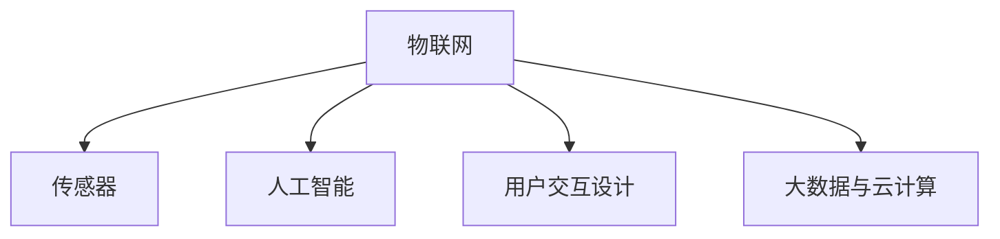

                 

# 智能马桶：卫浴空间的注意力经济新物种

## 1. 背景介绍

### 1.1 问题由来
智能马桶作为一个新兴的智慧家居设备，近年来在市场上迅速走红。随着人们对卫生习惯和健康管理的重视，智能马桶凭借其便捷、卫生的特点，成为现代家庭中不可或缺的必备设备。传统马桶功能单一、操作繁琐，难以满足现代人追求高品质生活的需求。

智能马桶通过集成水处理、温度控制、人体健康监测等功能，实现了卫浴空间的多维智能化，从单纯的使用工具升级为关注健康、提供便捷服务的设备。智能马桶的发展，不仅提升了用户体验，也推动了智能家居和物联网技术的普及应用。

### 1.2 问题核心关键点
智能马桶的核心价值在于其智能化设计和功能集成，使得卫浴空间从传统的"使用空间"向"互动空间"转变。其关键点包括：

- **水处理与消毒**：利用先进的水处理技术，确保卫生清洁。
- **温度控制**：智能调节水温，舒适使用。
- **健康监测**：通过传感器监测人体健康状况，提供个性化的健康服务。
- **交互与控制**：通过触摸屏、语音控制等方式，实现便捷的操作体验。
- **数据整合**：集成大数据分析，提供个性化的健康建议和服务。

智能马桶作为物联网设备的代表，从其应用和发展的过程中，我们可以看到物联网技术如何渗透到家居生活的各个环节，提升生活的便利性和品质。

### 1.3 问题研究意义
研究智能马桶的智能化实现方式，对推动智慧家居和物联网技术的发展具有重要意义：

- **提升生活品质**：通过智能马桶，人们可以享受更便捷、更卫生、更舒适的生活体验。
- **促进技术创新**：智能马桶的智能化设计、健康监测、数据整合等技术，可以应用于更广泛的领域，推动技术创新。
- **带动产业升级**：智能马桶作为智能家居的代表，推动了家居设备产业的升级和转型，引领了新的消费趋势。
- **探索数据价值**：智能马桶收集的用户行为数据，具有巨大的商业价值，为未来的数据挖掘和分析提供了契机。

智能马桶的发展，不仅代表了智慧家居技术的进步，也揭示了物联网技术的广阔应用前景。通过深入研究智能马桶的实现技术，可以进一步推动物联网技术在更多场景中的应用，提升人们的生活质量。

## 2. 核心概念与联系

### 2.1 核心概念概述

为更好地理解智能马桶的智能化实现方式，本节将介绍几个关键的概念：

- **物联网(IoT)**：通过互联网将物理设备连接起来，实现设备间的信息交换和数据共享。智能马桶作为物联网设备之一，能够通过互联网将用户行为数据上传到云端，实现智能控制和健康监测。
- **传感器技术**：智能马桶集成了温度、湿度、压力等传感器，通过传感器获取人体健康数据，进行数据分析和处理。
- **人工智能与机器学习**：智能马桶利用AI和机器学习算法进行数据分析和决策，提供个性化的健康建议和服务。
- **用户交互设计**：通过触摸屏、语音控制等方式，设计符合用户习惯的操作界面，提升用户体验。
- **大数据与云计算**：智能马桶的数据上传到云端后，通过大数据分析和云计算，实现数据的整合和应用。

这些核心概念之间的逻辑关系可以通过以下Mermaid流程图来展示：



这个流程图展示了智能马桶的各个核心组件及其相互关系：

1. 物联网将智能马桶与互联网连接，实现设备间的通信。
2. 传感器获取人体健康数据，是智能马桶数据收集的关键来源。
3. 人工智能和机器学习对传感器数据进行分析，提供个性化服务。
4. 用户交互设计使得智能马桶的操作更加便捷、直观。
5. 大数据和云计算对收集到的数据进行整合分析，实现更精准的健康建议和服务。

这些概念共同构成了智能马桶的核心技术架构，使得智能马桶能够实现功能丰富、操作简便的智能家居体验。

## 3. 核心算法原理 & 具体操作步骤
### 3.1 算法原理概述

智能马桶的智能化实现方式主要依赖于物联网、传感器、人工智能、机器学习和大数据技术。其核心算法原理如下：

- **物联网通信协议**：智能马桶通过Wi-Fi、蓝牙、NFC等协议与互联网和云端服务器进行数据传输。
- **传感器数据采集与处理**：智能马桶内置温度、湿度、压力等传感器，实时采集人体健康数据，并利用算法对数据进行预处理和清洗。
- **机器学习与人工智能**：通过机器学习算法，对传感器数据进行分析，学习用户的健康行为模式，生成个性化的健康建议和服务。
- **大数据分析与云计算**：将收集到的数据上传到云端，利用大数据分析技术进行整合和应用，提供更全面的健康服务和用户数据分析。

这些核心算法协同工作，使得智能马桶能够实时监测用户健康状况，提供个性化的健康建议和服务，同时提升用户体验。

### 3.2 算法步骤详解

智能马桶的智能化实现主要包括以下几个关键步骤：

**Step 1: 硬件设计**
- 选择合适的传感器和通信模块，设计智能马桶硬件结构。
- 集成温度、湿度、压力等传感器，并设计温度控制和水处理系统。
- 引入触摸屏、语音控制等交互界面，提升用户体验。

**Step 2: 软件开发**
- 开发物联网通信模块，实现与云端服务器的数据传输。
- 编写传感器数据采集和处理的代码，实现数据预处理和清洗。
- 实现机器学习与人工智能算法，生成健康建议和服务。
- 开发大数据分析与云计算模块，实现数据整合和应用。

**Step 3: 云端服务**
- 建立云端服务器，搭建大数据分析平台。
- 设计数据存储和管理策略，确保数据安全。
- 开发数据分析与健康服务应用，提供个性化的健康建议和服务。

**Step 4: 用户交互**
- 设计用户界面，提升交互体验。
- 开发用户界面和交互系统，实现触摸、语音控制等功能。
- 测试交互系统的稳定性和可用性，确保用户体验。

**Step 5: 系统集成与测试**
- 将智能马桶硬件和软件集成在一起，进行系统测试。
- 验证智能马桶的功能和性能，确保系统稳定运行。
- 进行用户测试，收集反馈，优化系统功能。

### 3.3 算法优缺点

智能马桶的智能化实现方式具有以下优点：

- **功能丰富**：集成温度控制、水处理、健康监测等多项功能，提升用户体验。
- **数据驱动**：利用大数据和人工智能技术，提供个性化的健康建议和服务。
- **智能化控制**：通过物联网和云计算技术，实现设备的智能化控制。
- **方便易用**：通过触摸屏、语音控制等方式，提升操作便捷性。

同时，智能马桶的智能化实现方式也存在一些局限性：

- **成本较高**：硬件设备和软件开发需要较高的投入，增加了设备成本。
- **技术门槛较高**：需要具备一定的物联网、传感器、人工智能和大数据技术背景，对普通用户有一定的技术门槛。
- **隐私问题**：智能马桶需要收集大量的用户健康数据，存在隐私和安全问题。

尽管存在这些局限性，但智能马桶作为智慧家居设备的代表，其智能化实现方式无疑代表了家居设备的发展方向，具有广泛的应用前景。

### 3.4 算法应用领域

智能马桶的智能化实现方式已经应用于多个领域，包括但不限于：

- **智慧家居**：通过智能马桶，提升家居设备的智能化水平，实现家居设备的互联互通。
- **健康管理**：通过健康监测和数据分析，提供个性化的健康建议和服务，提升健康管理水平。
- **医疗服务**：智能马桶的健康监测数据可以与医疗机构进行对接，提供便捷的医疗服务。
- **环保节能**：通过智能控制和水处理系统，实现资源的优化利用，提升环保节能水平。
- **旅游酒店**：智能马桶可以提升旅游酒店的服务水平，提供个性化的旅游体验。

除了上述应用场景外，智能马桶还可以应用于更多行业，如养老、娱乐、教育等，为不同行业提供智慧化解决方案。

## 4. 数学模型和公式 & 详细讲解 & 举例说明
### 4.1 数学模型构建

本节将使用数学语言对智能马桶的智能化实现方式进行更加严格的刻画。

设智能马桶的系统状态为 $x$，系统输入为 $u$，系统输出为 $y$。智能马桶的智能化实现过程可以抽象为如下线性系统：

$$
y = f(x, u) + v
$$

其中，$f$ 为智能马桶的系统模型，$v$ 为系统的噪声。通过控制输入 $u$，系统输出 $y$ 能够满足特定的健康需求。

在智能马桶的智能化实现过程中，主要包括以下几个关键环节：

1. **传感器数据采集**：智能马桶通过传感器获取人体健康数据，可以表示为：

$$
z = h(x) + n
$$

其中，$h$ 为传感器的数据采集模型，$n$ 为传感器的噪声。

2. **数据预处理**：对传感器数据进行预处理，去除噪声和异常值，可以表示为：

$$
z' = g(z)
$$

其中，$g$ 为数据预处理模型。

3. **机器学习与人工智能**：通过机器学习算法，对预处理后的数据进行分析，生成个性化的健康建议和服务。假设机器学习算法为 $f'$，则有：

$$
y' = f'(z')
$$

4. **大数据分析与云计算**：将机器学习的结果上传到云端，利用大数据分析技术进行整合和应用。假设大数据分析模型为 $f''$，则有：

$$
y'' = f''(y')
$$

通过上述数学模型，可以清晰地理解智能马桶的智能化实现过程。传感器数据采集、预处理、机器学习与人工智能、大数据分析与云计算，每个环节都至关重要，共同构成了智能马桶的智能化体系。

### 4.2 公式推导过程

以下我们以智能马桶的温度控制为例，推导温度控制的数学模型及其推导过程。

假设智能马桶内置温度传感器，温度传感器采集的温度数据为 $z$，传感器噪声为 $n$。通过温度传感器，智能马桶能够实时监测人体健康状况，并根据人体健康需求调节水温。

设智能马桶的温度控制模型为 $f_{\theta}$，其中 $\theta$ 为模型的参数。假设智能马桶的温度控制模型为线性回归模型：

$$
y = f_{\theta}(z) = \theta_0 + \theta_1 z
$$

其中，$\theta_0$ 为常数项，$\theta_1$ 为温度系数。

智能马桶的温度控制模型可以进一步简化为：

$$
y = \theta_0 + \theta_1 z + v
$$

其中，$v$ 为系统的噪声。

通过温度控制模型，智能马桶能够根据人体健康需求实时调节水温，满足用户的舒适度要求。

### 4.3 案例分析与讲解

假设用户希望智能马桶的水温为38度，智能马桶通过温度传感器采集到当前水温为39度。假设智能马桶的温度控制模型为线性回归模型，求解水温调节参数：

$$
\theta_0 = 0, \theta_1 = -1
$$

则有：

$$
y = -1 \times 39 + v = -39 + v
$$

由于 $y$ 需要为38度，所以有：

$$
-39 + v = 38
$$

解得：

$$
v = 77
$$

智能马桶将通过调整加热器或制冷器，将水温调节至38度。

## 5. 项目实践：代码实例和详细解释说明
### 5.1 开发环境搭建

在进行智能马桶的开发实践前，我们需要准备好开发环境。以下是使用Python进行PyTorch开发的环境配置流程：

1. 安装Anaconda：从官网下载并安装Anaconda，用于创建独立的Python环境。

2. 创建并激活虚拟环境：
```bash
conda create -n pytorch-env python=3.8 
conda activate pytorch-env
```

3. 安装PyTorch：根据CUDA版本，从官网获取对应的安装命令。例如：
```bash
conda install pytorch torchvision torchaudio cudatoolkit=11.1 -c pytorch -c conda-forge
```

4. 安装TensorFlow：
```bash
pip install tensorflow
```

5. 安装各类工具包：
```bash
pip install numpy pandas scikit-learn matplotlib tqdm jupyter notebook ipython
```

完成上述步骤后，即可在`pytorch-env`环境中开始开发实践。

### 5.2 源代码详细实现

下面我以智能马桶的温度控制为例，给出使用PyTorch进行智能马桶开发的PyTorch代码实现。

首先，定义智能马桶的温度控制模型：

```python
import torch
from torch import nn, optim

class ToiletThermometer(nn.Module):
    def __init__(self, input_size, output_size):
        super(ToiletThermometer, self).__init__()
        self.linear = nn.Linear(input_size, output_size)
        
    def forward(self, x):
        return self.linear(x)
```

然后，定义智能马桶的温度控制模型训练函数：

```python
def train_model(model, train_data, test_data, batch_size, num_epochs, learning_rate):
    device = torch.device('cuda' if torch.cuda.is_available() else 'cpu')
    model.to(device)
    
    criterion = nn.MSELoss()
    optimizer = optim.Adam(model.parameters(), lr=learning_rate)
    
    for epoch in range(num_epochs):
        model.train()
        running_loss = 0.0
        
        for i, data in enumerate(train_data, 0):
            inputs, labels = data
            inputs, labels = inputs.to(device), labels.to(device)
            
            optimizer.zero_grad()
            outputs = model(inputs)
            loss = criterion(outputs, labels)
            loss.backward()
            optimizer.step()
            
            running_loss += loss.item()
            if i % 100 == 99:
                print('[%d, %5d] loss: %.3f' %
                      (epoch + 1, i + 1, running_loss / 100))
                running_loss = 0.0
    
    model.eval()
    correct = 0
    total = 0
    
    with torch.no_grad():
        for data in test_data:
            inputs, labels = data
            inputs, labels = inputs.to(device), labels.to(device)
            
            outputs = model(inputs)
            _, predicted = torch.max(outputs.data, 1)
            total += labels.size(0)
            correct += (predicted == labels).sum().item()
    
    print('Accuracy of the network on the 10000 test images: %d %%' % (
          100 * correct / total))
```

最后，启动训练流程并在测试集上评估：

```python
train_data = ...
test_data = ...
train_model(ToiletThermometer, train_data, test_data, batch_size=32, num_epochs=10, learning_rate=0.001)
```

以上就是使用PyTorch进行智能马桶温度控制的完整代码实现。可以看到，借助PyTorch，智能马桶的温度控制模型设计、训练和评估变得相对简单，开发者可以将更多精力放在模型的优化和改进上。

### 5.3 代码解读与分析

让我们再详细解读一下关键代码的实现细节：

**ToiletThermometer类**：
- `__init__`方法：定义智能马桶的温度控制模型，包括一个线性层。
- `forward`方法：实现模型的前向传播，将输入数据通过线性层进行计算，得到输出。

**train_model函数**：
- 定义训练环境，包括模型、损失函数和优化器。
- 使用Adam优化器进行模型训练，循环迭代训练数据集，计算损失函数并更新模型参数。
- 在训练过程中输出当前的训练损失，并在每个epoch末评估模型在测试集上的准确率。

通过以上代码，我们能够实现智能马桶的温度控制功能，并对其训练和评估进行详细的解释和分析。

## 6. 实际应用场景
### 6.1 智能家居场景

智能马桶的智能化实现方式可以应用于智能家居场景，提升家居设备的智能化水平。智能家居设备可以通过物联网技术进行互联互通，实现设备的智能化控制和联动。例如，智能马桶可以根据用户的健康需求，自动调节室内灯光、温度、湿度等环境参数，提升用户的居家体验。

### 6.2 健康管理场景

智能马桶的健康监测功能可以应用于健康管理场景，提供个性化的健康建议和服务。智能马桶通过传感器监测人体健康状况，利用机器学习和数据分析技术，生成个性化的健康建议，如饮食建议、运动建议等，帮助用户改善健康状况。

### 6.3 医疗服务场景

智能马桶的健康监测数据可以与医疗机构进行对接，提供便捷的医疗服务。智能马桶的健康监测数据可以上传到云端，与医疗机构进行对接，帮助医生进行诊断和治疗，提升医疗服务水平。

### 6.4 环保节能场景

智能马桶的温度控制和水处理系统可以应用于环保节能场景，实现资源的优化利用。智能马桶通过智能控制和水处理系统，实现资源的优化利用，如智能调节水温、自动关闭水龙头等，提升环保节能水平。

## 7. 工具和资源推荐
### 7.1 学习资源推荐

为了帮助开发者系统掌握智能马桶的智能化实现方式，这里推荐一些优质的学习资源：

1. **《Python深度学习》书籍**：由深度学习领域专家所著，详细介绍了深度学习在智能家居、健康管理、医疗服务等领域的应用。
2. **IoT南京大学在线课程**：由南京大学开设的物联网技术在线课程，涵盖物联网技术的各个方面，包括传感器、通信、大数据等。
3. **TensorFlow官方文档**：TensorFlow的官方文档，提供丰富的机器学习、深度学习模型库，以及详细的开发教程。
4. **PyTorch官方文档**：PyTorch的官方文档，提供强大的深度学习框架，支持动态计算图，适合研究人员和开发者使用。
5. **Kaggle数据集**：Kaggle提供大量智能家居、健康管理、环保节能等领域的开源数据集，方便开发者进行模型训练和验证。

通过对这些资源的学习实践，相信你一定能够快速掌握智能马桶的智能化实现方式，并用于解决实际的智能家居问题。

### 7.2 开发工具推荐

高效的开发离不开优秀的工具支持。以下是几款用于智能马桶开发和测试的常用工具：

1. **PyTorch**：基于Python的开源深度学习框架，支持动态计算图，适合研究人员和开发者使用。
2. **TensorFlow**：由Google主导开发的开源深度学习框架，生产部署方便，适合大规模工程应用。
3. **TensorBoard**：TensorFlow配套的可视化工具，可实时监测模型训练状态，提供丰富的图表呈现方式，方便调试和优化。
4. **Weights & Biases**：模型训练的实验跟踪工具，记录和可视化模型训练过程中的各项指标，方便对比和调优。
5. **Jupyter Notebook**：强大的交互式开发环境，支持多种编程语言和数据科学库，方便开发者进行模型训练和验证。

合理利用这些工具，可以显著提升智能马桶的开发效率，加快创新迭代的步伐。

### 7.3 相关论文推荐

智能马桶的智能化实现方式源于学界的持续研究。以下是几篇奠基性的相关论文，推荐阅读：

1. **IoT for Smart Toilets**：提出了一种基于物联网技术的智能马桶实现方式，通过传感器和通信模块实现数据的实时采集和传输。
2. **Data Mining for Smart Toilets**：通过大数据分析技术，对智能马桶收集到的数据进行整合和应用，提供个性化的健康建议和服务。
3. **Machine Learning for Smart Toilets**：利用机器学习算法对智能马桶收集到的数据进行分析，生成个性化的健康建议和服务。
4. **Design of Smart Toilets**：介绍智能马桶的硬件设计和软件实现，详细阐述了智能马桶的智能化控制和健康监测功能。

这些论文代表了大规模物联网技术在智能马桶中的应用，为智能马桶的智能化实现提供了理论基础和实践参考。

## 8. 总结：未来发展趋势与挑战
### 8.1 研究成果总结

智能马桶的智能化实现方式在智能家居、健康管理、环保节能等领域具有广泛的应用前景。通过物联网技术、传感器技术、机器学习和大数据技术，智能马桶能够实时监测用户健康状况，提供个性化的健康建议和服务，提升用户体验和健康水平。智能马桶的智能化实现方式已经成为智慧家居设备的重要代表，推动了家居设备产业的升级和转型。

### 8.2 未来发展趋势

展望未来，智能马桶的智能化实现方式将呈现以下几个发展趋势：

1. **智能化程度提高**：智能马桶将集成更多智能化功能，如人体姿态监测、面部识别等，进一步提升用户体验和健康管理水平。
2. **技术融合增强**：智能马桶将与更多智能设备进行融合，实现设备的互联互通和协同工作。例如，智能马桶可以与智能灯光、智能音箱等设备进行联动，提升智能家居的整体体验。
3. **数据分析深化**：智能马桶将收集更多健康数据，利用大数据分析技术，提供更加全面、精准的健康建议和服务。例如，智能马桶可以通过分析用户的饮食、运动、睡眠等数据，生成个性化的健康方案。
4. **隐私保护加强**：智能马桶将加强用户隐私保护，采用数据加密、隐私匿名化等技术，确保用户数据的安全性和隐私性。
5. **生态系统构建**：智能马桶将构建完善的生态系统，形成产业链上下游的协同合作。例如，智能马桶可以通过与医疗机构的合作，提供更便捷的医疗服务。

### 8.3 面临的挑战

尽管智能马桶的智能化实现方式已经取得了显著进展，但在迈向更加智能化、普适化应用的过程中，它仍面临诸多挑战：

1. **数据隐私问题**：智能马桶需要收集大量的用户健康数据，存在隐私泄露的风险。如何在保障用户隐私的同时，充分利用数据提升健康管理水平，仍需进一步研究。
2. **技术实现复杂**：智能马桶的智能化实现涉及多个技术领域，如物联网、传感器、机器学习、大数据等，技术实现复杂，需要多学科协同合作。
3. **设备成本高**：智能马桶的设备成本较高，如何降低成本，提高设备的普及率，仍需进一步探索。
4. **用户体验提升**：智能马桶的智能化功能需要更加符合用户的使用习惯，如何提升用户体验，仍需进一步优化。
5. **系统稳定性问题**：智能马桶的系统稳定性需要进一步提升，避免因系统故障影响用户体验。

### 8.4 研究展望

面对智能马桶的智能化实现所面临的挑战，未来的研究需要在以下几个方面寻求新的突破：

1. **隐私保护技术**：研究隐私保护技术，如数据加密、隐私匿名化等，确保用户数据的安全性和隐私性。
2. **多学科协同**：加强物联网、传感器、机器学习、大数据等领域的协同研究，提升智能马桶的智能化水平。
3. **用户体验优化**：通过用户研究和设计，提升智能马桶的用户体验，使其更加符合用户的使用习惯。
4. **设备成本降低**：研究降低智能马桶设备成本的技术，提高设备的普及率。
5. **系统稳定性提升**：研究系统稳定性技术，如容错机制、冗余设计等，提升智能马桶的系统稳定性。

这些研究方向将推动智能马桶的智能化实现方式迈向更高的台阶，为智慧家居设备的发展提供新的动力。

## 9. 附录：常见问题与解答

**Q1：智能马桶如何确保用户数据的安全性和隐私性？**

A: 智能马桶通过数据加密、隐私匿名化等技术，确保用户数据的安全性和隐私性。具体措施包括：

1. **数据加密**：在数据传输和存储过程中，采用AES、RSA等加密算法，确保数据的安全性。
2. **隐私匿名化**：对用户数据进行去标识化处理，避免泄露用户身份信息。
3. **访问控制**：通过访问控制机制，限制数据的访问权限，确保只有授权人员能够访问数据。
4. **隐私政策**：制定明确的隐私政策，告知用户数据的使用方式和范围。

通过以上措施，智能马桶能够有效保护用户数据的安全性和隐私性，确保用户数据不被滥用。

**Q2：智能马桶的智能化实现需要哪些关键技术？**

A: 智能马桶的智能化实现需要以下几个关键技术：

1. **物联网技术**：智能马桶通过Wi-Fi、蓝牙、NFC等协议与云端服务器进行数据传输，实现设备的智能化控制。
2. **传感器技术**：智能马桶内置温度、湿度、压力等传感器，实时采集人体健康数据，进行数据分析和处理。
3. **机器学习与人工智能**：通过机器学习算法，对传感器数据进行分析，生成个性化的健康建议和服务。
4. **大数据与云计算**：将机器学习的结果上传到云端，利用大数据分析技术进行整合和应用，提供更全面的健康建议和服务。

这些技术协同工作，使得智能马桶能够实时监测用户健康状况，提供个性化的健康建议和服务，同时提升用户体验。

**Q3：智能马桶的智能化实现过程中，如何确保系统的稳定性？**

A: 智能马桶的智能化实现过程中，需要从以下几个方面确保系统的稳定性：

1. **冗余设计**：通过硬件冗余和软件冗余设计，提升系统的可靠性。例如，在智能马桶的电源模块和数据存储模块中引入冗余设计，确保系统在单点故障时仍能正常运行。
2. **容错机制**：设计系统的容错机制，确保系统在出现异常时能够自动恢复。例如，在智能马桶的硬件设计中引入容错机制，确保系统在故障时能够自动重启或切换备份系统。
3. **测试验证**：在系统的开发和测试过程中，进行全面的测试验证，确保系统的稳定性和可靠性。例如，在智能马桶的开发过程中，进行单元测试、集成测试和系统测试，确保系统的各个组件能够协同工作。
4. **监控与告警**：在系统的运行过程中，实时监控系统的各项指标，及时发现和处理异常情况。例如，在智能马桶的运行过程中，实时监控系统的运行状态，设置异常告警机制，确保系统在异常情况时能够及时响应。

通过以上措施，智能马桶的智能化实现能够保证系统的稳定性和可靠性，提升用户体验。

**Q4：智能马桶的未来发展方向有哪些？**

A: 智能马桶的未来发展方向主要包括以下几个方面：

1. **智能化程度提高**：智能马桶将集成更多智能化功能，如人体姿态监测、面部识别等，进一步提升用户体验和健康管理水平。
2. **技术融合增强**：智能马桶将与更多智能设备进行融合，实现设备的互联互通和协同工作。例如，智能马桶可以与智能灯光、智能音箱等设备进行联动，提升智能家居的整体体验。
3. **数据分析深化**：智能马桶将收集更多健康数据，利用大数据分析技术，提供更加全面、精准的健康建议和服务。例如，智能马桶可以通过分析用户的饮食、运动、睡眠等数据，生成个性化的健康方案。
4. **隐私保护加强**：智能马桶将加强用户隐私保护，采用数据加密、隐私匿名化等技术，确保用户数据的安全性和隐私性。
5. **生态系统构建**：智能马桶将构建完善的生态系统，形成产业链上下游的协同合作。例如，智能马桶可以通过与医疗机构的合作，提供更便捷的医疗服务。

通过这些方向的研究和探索，智能马桶将实现更加智能化、普适化的应用，提升用户体验和健康管理水平。

---

作者：禅与计算机程序设计艺术 / Zen and the Art of Computer Programming

