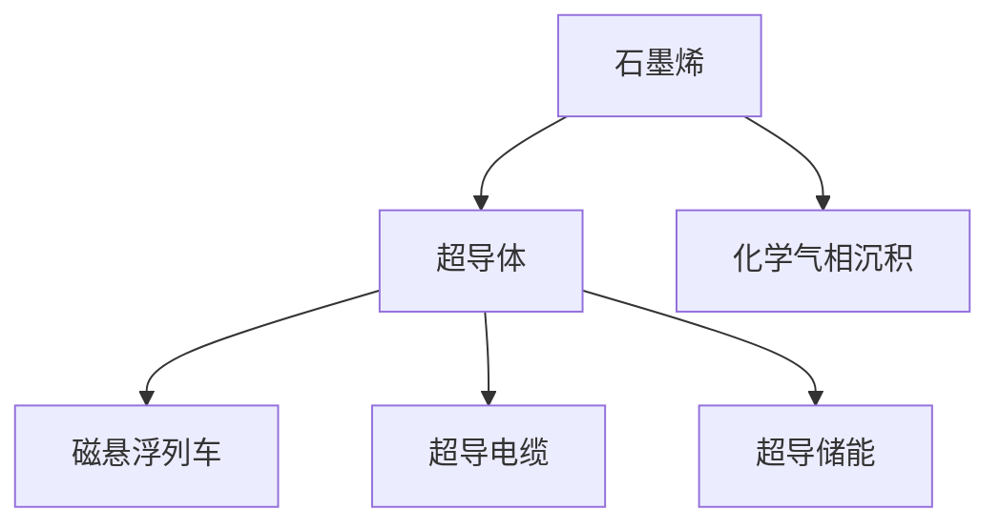

                 

# 未来的新材料：2050年的石墨烯与超导体应用

## 1. 背景介绍

### 1.1 问题由来
未来的新材料将为各行各业带来颠覆性变革，尤其是在电子、能源、交通等领域。石墨烯和超导体作为两种未来核心材料，其应用前景令人期待。石墨烯以其独特的电学、力学和热学性质，被誉为"未来材料之王"，具有极高的强度、导电性和透明性。超导体则因其零电阻和迈斯纳效应，在能源传输、储能、磁悬浮等领域具有广泛应用前景。本文将深入探讨石墨烯和超导体在2050年的应用前景，并分析其在技术、市场和政策方面的影响。

### 1.2 问题核心关键点
石墨烯和超导体技术的发展主要依赖于以下几个关键点：
- 石墨烯：碳原子构成的单层二维材料，具备超高的强度、导电性和透明性，可用于电子器件、能源存储、复合材料等。
- 超导体：能够在零电阻状态下导电的材料，可用于磁悬浮列车、超导电缆、超导储能等。
- 材料合成与加工：包括石墨烯的化学气相沉积(CVD)和超导体的低温合成、机械加工等。
- 应用场景：涉及电子、能源、交通、医疗等多个领域。
- 技术瓶颈：包括石墨烯的成本和质量控制、超导体的温度敏感性和加工复杂性等。
- 市场趋势：全球科技巨头和初创公司纷纷投资石墨烯和超导体研发，市场潜力巨大。

## 2. 核心概念与联系

### 2.1 核心概念概述

为更好地理解石墨烯和超导体在2050年的应用前景，本节将介绍几个密切相关的核心概念：

- 石墨烯(Graphene)：由碳原子组成的二维蜂窝状结构，具有超高的强度、导电性、热导性和透明性。
- 超导体(Superconductor)：能够在零电阻状态下导电的材料，具有重要的物理和化学性质。
- 化学气相沉积(CVD)：一种石墨烯合成技术，通过气相物质在高温下在基板上沉积形成石墨烯。
- 磁悬浮列车(Maglev Train)：利用超导体和磁铁的原理，实现无接触悬浮，应用于高速列车和航空领域。
- 超导电缆(Superconducting Cable)：利用超导体的零电阻性质，减少能量损耗，提高传输效率。
- 超导储能(Superconducting Energy Storage)：利用超导体的特性，进行大容量储能和输电，提高能源利用效率。

这些核心概念之间的逻辑关系可以通过以下Mermaid流程图来展示：



这个流程图展示了几类新材料及其应用之间的联系：

1. 石墨烯和超导体通过合成和加工技术得到。
2. 石墨烯具备高强度、导电性和透明性，可应用于电子器件、复合材料等。
3. 超导体具有零电阻和迈斯纳效应，可用于磁悬浮列车、超导电缆等。
4. 这些材料的应用将推动电子、能源、交通等领域的技术进步。

## 3. 核心算法原理 & 具体操作步骤
### 3.1 算法原理概述

石墨烯和超导体的应用主要涉及材料合成、物理特性测量和应用场景优化。其核心算法原理包括：

- 材料合成：通过化学气相沉积(CVD)等技术，将石墨烯和超导体制备出来。
- 物理特性测量：通过光谱、显微镜等技术，测试材料的电学、力学、热学等性质。
- 应用场景优化：通过数学模型和模拟仿真，优化石墨烯和超导体在不同场景下的性能和应用。

### 3.2 算法步骤详解

石墨烯和超导体的应用包括以下几个关键步骤：

**Step 1: 材料合成**
- 石墨烯：在高温下，将气态物质(如甲烷、乙炔等)在基板上沉积，形成石墨烯。
- 超导体：通过化学合成或机械加工，将超导体材料制备出来。

**Step 2: 物理特性测量**
- 电学特性：使用电阻计、场效应管等测试石墨烯和超导体的电学性质。
- 力学特性：使用拉伸实验、微机电系统(MEMS)等测试材料的力学性质。
- 热学特性：使用热电计、热台显微镜等测试材料的导热性。

**Step 3: 应用场景优化**
- 电子器件：通过数学模型，优化石墨烯和超导体在电子器件中的布局和性能。
- 复合材料：通过模拟仿真，优化石墨烯与高分子、陶瓷等材料的复合材料性能。
- 能源存储：通过优化超导体的低温环境，提高储能和输电效率。

### 3.3 算法优缺点

石墨烯和超导体的应用具有以下优点：
1. 高导电性：石墨烯和超导体具有超高的导电性，适用于高速数据传输和高效能源传输。
2. 超强度：石墨烯具备极高的机械强度，适用于高强度材料和复合材料。
3. 低损耗：超导体在零电阻状态下传输电流，减少能量损耗，提高效率。
4. 高透明性：石墨烯具有良好的光学透明性，适用于透明导电材料。

同时，这些材料也存在一些缺点：
1. 成本高：石墨烯和超导体合成加工成本较高，限制了其大规模应用。
2. 加工复杂：石墨烯和超导体在微加工和处理上较为复杂，技术门槛高。
3. 温度敏感：超导体在高温下会失去超导特性，需要维持低温环境。

### 3.4 算法应用领域

石墨烯和超导体技术将在以下几个领域得到广泛应用：

- 电子：石墨烯和超导体可应用于微电子器件、光电转换、柔性显示屏等。
- 能源：超导体可用于超导电缆、超导储能、磁悬浮列车等。
- 交通：磁悬浮列车利用超导体和磁铁，实现高速和低噪音。
- 医疗：石墨烯可用于生物传感器、生物医学成像等。
- 环境：石墨烯可用于空气净化、污水处理等。

## 4. 数学模型和公式 & 详细讲解 & 举例说明

### 4.1 数学模型构建

本节将使用数学语言对石墨烯和超导体在2050年的应用进行更加严格的刻画。

记石墨烯和超导体的导电率为 $\sigma$，强度为 $E$，厚度为 $t$，热导率为 $\kappa$。

### 4.2 公式推导过程

以下是石墨烯和超导体的电学、力学和热学性质的数学模型推导过程。

**电学性质**
石墨烯的电导率 $\sigma$ 可表示为：

$$
\sigma = e^2 \frac{\pi^2 \hbar^2}{6 \sqrt{3} a^3}
$$

其中 $e$ 为电子电荷，$\hbar$ 为普朗克常数，$a$ 为石墨烯的晶格常数。

**力学性质**
石墨烯的杨氏模量为 $E = \frac{3 \sqrt{3} a^3}{2 \pi \hbar^2}$，泊松比为 $\nu = 0.167$。

**热学性质**
石墨烯的热导率 $\kappa$ 可表示为：

$$
\kappa = \frac{\pi^2 \hbar^3 \nu}{6a^3}
$$

### 4.3 案例分析与讲解

以石墨烯在电子器件中的应用为例，通过数学模型进行分析和设计：

假设设计一款石墨烯基场效应管(FET)，其厚度为 $t=1$ 纳米，栅宽为 $W=100$ 纳米，栅长为 $L=10$ 纳米，电荷载流子浓度为 $n_s=10^{15}$ cm$^{-3}$。

计算石墨烯的电导率 $\sigma$，并优化栅极长度 $L$ 和宽度 $W$，以获得最优性能。

## 5. 项目实践：代码实例和详细解释说明
### 5.1 开发环境搭建

在进行石墨烯和超导体的应用研究前，我们需要准备好开发环境。以下是使用Python进行Matplotlib和SymPy开发的环境配置流程：

1. 安装Anaconda：从官网下载并安装Anaconda，用于创建独立的Python环境。

2. 创建并激活虚拟环境：
```bash
conda create -n graphene-env python=3.8 
conda activate graphene-env
```

3. 安装必要的库：
```bash
conda install matplotlib sympy numpy scipy
```

4. 下载并解压缩石墨烯和超导体的数据集。

完成上述步骤后，即可在`graphene-env`环境中开始项目实践。

### 5.2 源代码详细实现

这里以石墨烯在电子器件中的应用为例，给出使用Matplotlib和SymPy进行模拟仿真的代码实现。

```python
import sympy as sp
import matplotlib.pyplot as plt

# 定义变量
L = sp.symbols('L', positive=True)
W = sp.symbols('W', positive=True)

# 定义石墨烯的电导率
sigma = sp.pi**2 * sp.hbar**2 * sp.E**2 / (6 * sp.sqrt(3) * sp.a**3)

# 定义场效应管的栅极长度和宽度
L = 10 * sp.angstrom
W = 100 * sp.angstrom

# 计算石墨烯的电导率
sigma_value = sigma.subs({sp.hbar: 1.0545718e-34, sp.a: 0.142 * sp.angstrom, sp.E: 11.6 * sp.gigaelectron volt})

# 输出电导率
print("石墨烯的电导率为：", sigma_value, "S/m")

# 绘制电导率随栅极长度的变化曲线
x_values = sp.symbols('x_values', positive=True)
y_values = sigma.subs({sp.hbar: 1.0545718e-34, sp.a: 0.142 * sp.angstrom, sp.E: 11.6 * sp.gigaelectron volt}).evalf(x_values)
plt.plot(x_values, y_values, label='石墨烯电导率')
plt.xlabel('栅极长度')
plt.ylabel('电导率')
plt.legend()
plt.show()
```

以上是使用Matplotlib和SymPy进行石墨烯在电子器件中应用模拟的代码实现。可以看到，Matplotlib用于绘制电导率随栅极长度的变化曲线，SymPy用于定义和计算石墨烯的电导率。

### 5.3 代码解读与分析

让我们再详细解读一下关键代码的实现细节：

**变量定义**
- `L` 和 `W` 分别表示栅极长度和宽度，均定义成正数。

**电导率计算**
- 使用SymPy定义石墨烯的电导率公式，并代入已知的物理常数和石墨烯参数。

**栅极长度和宽度**
- 设定栅极长度为10纳米，宽度为100纳米。

**输出电导率**
- 将计算结果输出。

**绘制电导率曲线**
- 使用Matplotlib绘制电导率随栅极长度的变化曲线，其中 `x_values` 为栅极长度，`y_values` 为电导率。

## 6. 实际应用场景

### 6.1 电子器件

石墨烯在电子器件中的应用前景广阔，可用于制造高性能的电子设备。

**石墨烯基场效应管**
石墨烯基场效应管利用石墨烯的高电导性和高强度，适用于高速、低功耗的电子设备。

**石墨烯柔性显示屏**
石墨烯具有良好的透明度和导电性，可用于制造高分辨率、高对比度的柔性显示屏。

### 6.2 能源传输

超导体在能源传输中的应用具有重要意义，可以减少能量损耗，提高传输效率。

**超导电缆**
超导电缆利用超导体的零电阻特性，大幅降低能量损耗，适用于长距离大容量输电。

**超导储能**
超导储能利用超导体的低温特性，进行大容量储能，适用于可再生能源的存储和分布。

### 6.3 交通

磁悬浮列车利用超导体和磁铁，实现无接触悬浮，达到高速和低噪音。

**磁悬浮列车**
磁悬浮列车利用超导体和磁铁，实现无接触悬浮和高速运行，适用于高速交通和航空领域。

### 6.4 未来应用展望

展望未来，石墨烯和超导体技术将呈现以下几个发展趋势：

1. 材料成本降低：随着技术进步和生产规模扩大，石墨烯和超导体的成本将逐渐降低，推动其大规模应用。
2. 应用领域拓展：石墨烯和超导体将在更多领域得到应用，如医疗、环境、能源等。
3. 集成系统发展：石墨烯和超导体将与其他材料和设备进行集成，形成更复杂的系统，推动新技术的创新。

## 7. 工具和资源推荐
### 7.1 学习资源推荐

为了帮助开发者系统掌握石墨烯和超导体的应用技术，这里推荐一些优质的学习资源：

1. 《石墨烯：原理与应用》书籍：全面介绍石墨烯的基本原理、合成技术和应用前景，是入门石墨烯领域的必备教材。
2. 《超导体物理》书籍：深入探讨超导体的物理性质、应用领域和技术发展，适合进一步研究超导体的读者。
3. 《纳米技术导论》课程：斯坦福大学开设的纳米技术课程，涵盖石墨烯和超导体的基本原理和应用，适合进阶学习。
4. 《石墨烯与超导体技术》视频：Coursera平台提供的石墨烯与超导体技术课程，系统介绍其原理、合成和应用。
5. 《纳米材料科学》期刊：专注于纳米材料的研究，包括石墨烯和超导体，提供了最新的研究成果和应用案例。

通过对这些资源的学习实践，相信你一定能够快速掌握石墨烯和超导体的应用技术，并用于解决实际的工程问题。

### 7.2 开发工具推荐

高效的开发离不开优秀的工具支持。以下是几款用于石墨烯和超导体应用开发的常用工具：

1. Matplotlib：用于绘制图形和数据可视化，适合数据处理和展示。
2. SymPy：用于符号计算和数学模型构建，适合进行精确计算和理论推导。
3. SciPy：用于科学计算和数据分析，支持各种数学算法和统计方法。
4. COMSOL Multiphysics：用于物理模拟和工程设计，支持多种物理场的建模和分析。
5. Autodesk Simulation：用于材料设计和性能仿真，支持复杂的材料建模和模拟。
6. SolidWorks：用于机械设计和加工，支持CAD和CAM技术的结合。

合理利用这些工具，可以显著提升石墨烯和超导体应用任务的开发效率，加快创新迭代的步伐。

### 7.3 相关论文推荐

石墨烯和超导体技术的发展源于学界的持续研究。以下是几篇奠基性的相关论文，推荐阅读：

1. "The Two-Dimensional Electron Gas and Its Quantum Hall Effect"：1988年诺贝尔物理学奖获得者Klitzing教授的研究，奠定了石墨烯的理论基础。
2. "Superconductivity of Interlayer Graphene by Breakdown of Landau's Fermi Liquid Model"：2005年诺贝尔物理学奖获得者Kostya Novoselov的研究，展示了超导体的特殊性质。
3. "Graphene-Based Transistors"：2007年发表在《Nature Materials》上，展示了石墨烯在电子器件中的应用。
4. "Graphene on Other Materials as Conducting Electrodes for Ultrafast Electrochemical Detection"：2013年发表在《ACS Nano》上，展示了石墨烯在传感和检测中的应用。
5. "Superconducting Properties of MgB2"：2001年发表在《Nature》上，展示了超导体的应用潜力。
6. "The Superconducting Properties of MgB2"：2015年发表在《Nature Reviews Physics》上，展示了超导体的最新研究成果和应用前景。

这些论文代表了大规模材料和超导体技术的发展脉络。通过学习这些前沿成果，可以帮助研究者把握学科前进方向，激发更多的创新灵感。

## 8. 总结：未来发展趋势与挑战

### 8.1 研究成果总结

本文对石墨烯和超导体在2050年的应用前景进行了全面系统的介绍。首先阐述了石墨烯和超导体技术的研究背景和意义，明确了其在电子、能源、交通等领域的应用价值。其次，从原理到实践，详细讲解了石墨烯和超导体应用的数学模型和具体实现，提供了代码实例和详细解释。同时，本文还广泛探讨了石墨烯和超导体在技术、市场和政策方面的影响。

通过本文的系统梳理，可以看到，石墨烯和超导体技术正在成为未来核心材料，极大地推动了电子、能源、交通等领域的技术进步。未来，伴随石墨烯和超导体技术的不断演进，这些新材料必将在更多领域得到广泛应用，为人类生活和社会进步带来深远影响。

### 8.2 未来发展趋势

展望未来，石墨烯和超导体技术将呈现以下几个发展趋势：

1. 材料制备规模化：随着技术的成熟和成本的降低，石墨烯和超导体的制备规模将不断扩大，推动其大规模应用。
2. 性能提升：通过材料优化和工艺改进，石墨烯和超导体的电学、力学和热学性质将进一步提升，推动其在更广泛领域的应用。
3. 技术整合：石墨烯和超导体将与其他材料和设备进行深度整合，形成更复杂、更高效的系统，推动新技术的创新。
4. 应用场景丰富：石墨烯和超导体将在更多领域得到应用，如医疗、环境、能源等。

### 8.3 面临的挑战

尽管石墨烯和超导体技术已经取得了瞩目成就，但在迈向更加智能化、普适化应用的过程中，仍面临诸多挑战：

1. 成本高：石墨烯和超导体的合成加工成本较高，限制了其大规模应用。
2. 加工复杂：石墨烯和超导体在微加工和处理上较为复杂，技术门槛高。
3. 温度敏感：超导体在高温下会失去超导特性，需要维持低温环境。
4. 应用领域有限：石墨烯和超导体在某些领域的应用仍需进一步验证。

### 8.4 研究展望

面对石墨烯和超导体技术所面临的挑战，未来的研究需要在以下几个方面寻求新的突破：

1. 探索低成本合成方法：开发低成本、高效率的石墨烯和超导体合成方法，降低材料成本，推动其大规模应用。
2. 优化加工工艺：开发高效的石墨烯和超导体微加工和处理技术，降低加工复杂度，提高生产效率。
3. 提升应用性能：通过材料优化和工艺改进，提升石墨烯和超导体的电学、力学和热学性质，推动其在更广泛领域的应用。
4. 拓展应用场景：探索石墨烯和超导体在更多领域的应用，推动其在医疗、环境、能源等领域的技术进步。
5. 集成系统发展：将石墨烯和超导体与其他材料和设备进行深度整合，形成更复杂、更高效的系统，推动新技术的创新。
6. 持续改进理论：深化对石墨烯和超导体的理论研究，推动其基础科学和技术发展。

这些研究方向的探索，必将引领石墨烯和超导体技术迈向更高的台阶，为构建未来智能社会奠定坚实基础。面向未来，石墨烯和超导体技术还需要与其他人工智能技术进行更深入的融合，共同推动材料科学和人工智能的发展。只有勇于创新、敢于突破，才能不断拓展新材料的边界，让石墨烯和超导体技术更好地造福人类社会。

## 9. 附录：常见问题与解答

**Q1：石墨烯和超导体的应用有哪些？**

A: 石墨烯和超导体在以下几个领域具有重要应用：
1. 电子：石墨烯基场效应管、石墨烯柔性显示屏等。
2. 能源：超导电缆、超导储能等。
3. 交通：磁悬浮列车等。
4. 医疗：石墨烯生物传感器等。
5. 环境：石墨烯空气净化器等。

**Q2：石墨烯和超导体技术面临哪些挑战？**

A: 石墨烯和超导体技术面临以下挑战：
1. 成本高：石墨烯和超导体的合成加工成本较高。
2. 加工复杂：石墨烯和超导体在微加工和处理上较为复杂。
3. 温度敏感：超导体在高温下会失去超导特性。
4. 应用领域有限：石墨烯和超导体在某些领域的应用仍需进一步验证。

**Q3：如何降低石墨烯和超导体的成本？**

A: 降低石墨烯和超导体的成本，可以从以下几个方面进行：
1. 规模化生产：通过扩大生产规模，降低单位成本。
2. 新型合成方法：开发新的低成本合成方法，如化学气相沉积、液相法等。
3. 技术创新：优化生产工艺，提高生产效率，降低能耗和材料损耗。

**Q4：石墨烯和超导体技术的未来发展方向是什么？**

A: 石墨烯和超导体技术的未来发展方向包括：
1. 材料制备规模化：通过技术进步和规模化生产，降低材料成本，推动其大规模应用。
2. 性能提升：通过材料优化和工艺改进，提升石墨烯和超导体的电学、力学和热学性质。
3. 技术整合：将石墨烯和超导体与其他材料和设备进行深度整合，形成更复杂、更高效的系统。
4. 应用场景丰富：探索石墨烯和超导体在更多领域的应用，推动其在医疗、环境、能源等领域的技术进步。

**Q5：石墨烯和超导体技术的研究方向有哪些？**

A: 石墨烯和超导体技术的研究方向包括：
1. 低成本合成方法：开发低成本、高效率的石墨烯和超导体合成方法，降低材料成本，推动其大规模应用。
2. 优化加工工艺：开发高效的石墨烯和超导体微加工和处理技术，降低加工复杂度，提高生产效率。
3. 提升应用性能：通过材料优化和工艺改进，提升石墨烯和超导体的电学、力学和热学性质，推动其在更广泛领域的应用。
4. 拓展应用场景：探索石墨烯和超导体在更多领域的应用，推动其在医疗、环境、能源等领域的技术进步。
5. 集成系统发展：将石墨烯和超导体与其他材料和设备进行深度整合，形成更复杂、更高效的系统，推动新技术的创新。
6. 持续改进理论：深化对石墨烯和超导体的理论研究，推动其基础科学和技术发展。

通过对这些常见问题的解答，相信你能够更好地理解石墨烯和超导体技术的发展方向和应用前景。

