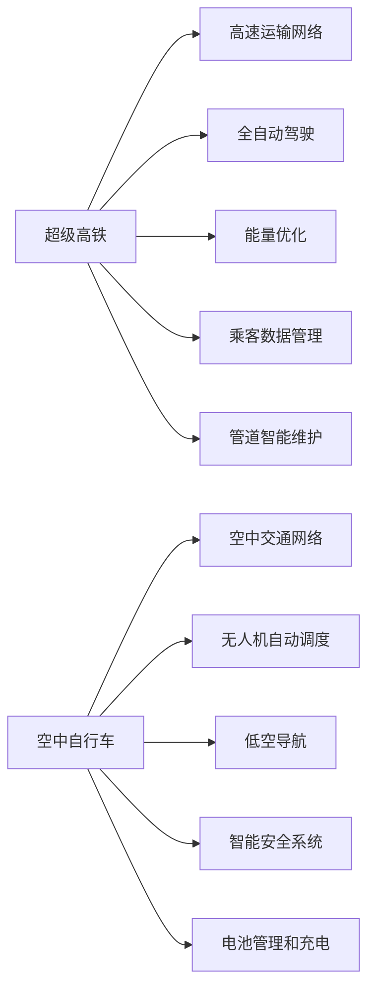

                 

## 1. 背景介绍

随着全球人口的持续增长和城市化进程的不断加速，城市交通拥堵、环境污染等问题愈发突出。传统以汽车为主的地面交通模式已经难以适应未来智慧城市的需要。因此，构建高效、环保、便捷的立体交通系统，成为全球交通规划者的共同目标。本文将探讨2050年，基于人工智能、大数据和物联网技术的新型立体交通出行模式，特别是超级高铁与空中自行车相结合的智慧出行系统。

## 2. 核心概念与联系

### 2.1 核心概念概述

- **超级高铁(Hyperloop)**：一种高速地面交通系统，利用近乎真空的管道，通过磁悬浮技术实现超高速、低能耗的乘客和货物运输。
- **空中自行车(Air bike)**：利用轻质材料和无人机技术，实现低空、高效的个人交通工具，能够在城市空中自由飞行，提供快速、灵活的出行方式。
- **智慧出行系统**：结合人工智能、大数据和物联网技术，通过智能调度、实时监控和自动驾驶等技术手段，实现交通系统的高度智能化。

### 2.2 核心概念原理和架构的 Mermaid 流程图



以上流程图展示了超级高铁和空中自行车的核心概念及其相互联系。超级高铁和空中自行车分别通过全自动驾驶、能量优化、乘客数据管理和管道/空中交通网络实现高速、安全和智能的运输。同时，通过智能调度、低空导航、智能安全系统和电池管理等技术，提升整体系统的智慧程度。

## 3. 核心算法原理 & 具体操作步骤

### 3.1 算法原理概述

超级高铁和空中自行车的智慧出行系统，基于人工智能和大数据技术实现自动化调度、实时监控和智能分析。以下是该系统的核心算法原理：

1. **实时数据采集与处理**：通过遍布网络的传感器和物联网设备，采集交通流量、天气状况、乘客需求等实时数据，并进行预处理。
2. **智能调度算法**：利用优化算法（如遗传算法、蚁群算法）进行交通网络的最优路径规划，动态调整车辆行驶路线和时间。
3. **深度学习与预测**：使用深度学习模型（如卷积神经网络CNN、长短期记忆网络LSTM）进行交通流预测和交通异常检测。
4. **自动驾驶与控制**：利用计算机视觉和强化学习技术，实现车辆的全自动驾驶和智能控制。
5. **数据安全与隐私保护**：采用加密技术和联邦学习，确保数据传输和存储的安全性，保护乘客隐私。

### 3.2 算法步骤详解

**Step 1: 数据采集与预处理**
- 部署传感器和物联网设备，采集交通流量、天气状况、乘客需求等实时数据。
- 对采集到的数据进行去噪、归一化、特征提取等预处理，确保数据质量。

**Step 2: 智能调度与路径规划**
- 利用优化算法对交通网络进行建模，找到最优路径。
- 动态调整车辆行驶路线和时间，避免拥堵和延误。

**Step 3: 深度学习与预测**
- 构建深度学习模型，对历史交通数据进行训练，实现交通流预测。
- 使用异常检测算法，及时发现交通异常情况，采取应急措施。

**Step 4: 自动驾驶与控制**
- 集成计算机视觉和强化学习技术，实现车辆的自主驾驶。
- 实时监控车辆状态，根据路况动态调整驾驶策略。

**Step 5: 数据安全与隐私保护**
- 采用加密技术对数据进行传输和存储，防止数据泄露。
- 使用联邦学习技术，在保证隐私的前提下，共享知识。

### 3.3 算法优缺点

**优点**：
- **高效性**：通过智能调度和路径规划，大幅提升运输效率，减少拥堵。
- **灵活性**：支持空中自行车的低空飞行，提供更多出行选择。
- **安全性**：通过深度学习和智能控制，保障行车安全。
- **环境友好**：利用清洁能源和低空飞行，减少碳排放。

**缺点**：
- **技术复杂性**：系统集成多个高技术模块，需要跨学科的知识和技能。
- **成本高昂**：建设和维护成本较高，初期投入较大。
- **隐私风险**：大量实时数据采集和处理，存在隐私泄露风险。
- **依赖性**：对物联网和人工智能技术的依赖较大，存在单点故障风险。

### 3.4 算法应用领域

超级高铁和空中自行车的智慧出行系统，适用于以下领域：

- **城市交通**：解决城市交通拥堵、环境污染问题，提升城市通行效率。
- **区域物流**：提供高效、环保的货物运输服务，降低物流成本。
- **旅游观光**：提供快速、便捷的旅游出行方式，促进旅游业发展。
- **紧急救援**：利用低空飞行，快速响应紧急救援需求，提高救援效率。

## 4. 数学模型和公式 & 详细讲解 & 举例说明

### 4.1 数学模型构建

假设城市交通网络由$N$个节点和$M$条边组成，节点表示交通枢纽或交叉口，边表示连接不同节点的道路或航线。设$i$为节点编号，$j$为边编号，$w_{ij}$为边$(i,j)$的权重（如距离、时间等）。

### 4.2 公式推导过程

**路径规划问题**：求解从起点$i$到终点$j$的最短路径。

采用Dijkstra算法进行求解，路径权重$w_{ij}$表示边$(i,j)$的权重。算法步骤如下：

1. 初始化：起点$i$的路径距离为$0$，其余节点为无限大。
2. 选择当前最短路径节点，更新与其相邻的节点距离。
3. 重复步骤2，直到终点$j$或无未扩展节点。
4. 返回从起点$i$到终点$j$的最短路径。

数学表达为：

$$
d_{ij} = 
\begin{cases} 
0, & i = j \\
\infty, & i \neq j \\
\min\limits_{k \in \mathcal{N}_i} \{d_{ik} + w_{kj}\}, & \text{否则} 
\end{cases}
$$

其中，$d_{ij}$表示从节点$i$到节点$j$的最短路径距离，$\mathcal{N}_i$表示与节点$i$相邻的节点集合。

**交通流预测问题**：

设$t$为时间步，$u_{ij}(t)$表示时间步$t$从节点$i$到节点$j$的流量。根据交通流模型，可得：

$$
u_{ij}(t+1) = u_{ij}(t) + \Delta t \cdot \frac{f_{ij}(t)}{\tau_{ij}(t)}
$$

其中，$f_{ij}(t)$表示时间步$t$节点$i$到节点$j$的流量需求，$\tau_{ij}(t)$表示节点$i$到节点$j$的通行能力。

### 4.3 案例分析与讲解

以超级高铁为例，假设超级高铁网络由$N=10$个节点组成，边权重$w_{ij}$表示节点$i$到节点$j$的超级高铁线路距离。

已知起点为节点1，终点为节点10，求最短路径。

使用Dijkstra算法，从节点1开始，依次扩展与节点1相邻的节点2、3，计算节点2、3到其余节点的最短路径，重复此过程，直到扩展到节点10。

假设计算过程中，从节点1到节点10的最短路径为$1 \to 2 \to 3 \to 4 \to 5 \to 6 \to 7 \to 8 \to 9 \to 10$。

**交通流预测**：

假设某一时刻$t=0$，节点1到节点10的流量需求$f_{10}=100$，节点10的通行能力$\tau_{10}=150$。

根据交通流模型，节点1到节点10的流量为：

$$
u_{10}(1) = \Delta t \cdot \frac{f_{10}}{\tau_{10}} = 0.1 \cdot \frac{100}{150} = 0.067
$$

假设$t=1$时，节点1到节点10的流量需求为$f_{10}=120$，通行能力为$\tau_{10}=160$。

根据交通流模型，节点1到节点10的流量为：

$$
u_{10}(2) = u_{10}(1) + \Delta t \cdot \frac{f_{10}}{\tau_{10}} = 0.067 + 0.1 \cdot \frac{120}{160} = 0.0275
$$

通过上述分析，可以模拟超级高铁网络的交通流量，为智能调度提供数据支持。

## 5. 项目实践：代码实例和详细解释说明

### 5.1 开发环境搭建

**Step 1: 安装Python和相关库**
```bash
# 安装Python 3.8
sudo apt update
sudo apt install python3.8

# 安装必要的Python库
pip install numpy scipy matplotlib pandas scikit-learn pydotplus
```

**Step 2: 安装Jupyter Notebook**
```bash
pip install jupyter notebook
```

### 5.2 源代码详细实现

**Step 3: 实现路径规划算法**

```python
import networkx as nx
import numpy as np

# 构建交通网络
G = nx.DiGraph()
G.add_edge('1', '2', weight=5)
G.add_edge('1', '3', weight=7)
G.add_edge('2', '4', weight=3)
G.add_edge('3', '4', weight=6)
G.add_edge('4', '5', weight=4)
G.add_edge('5', '6', weight=2)
G.add_edge('6', '7', weight=3)
G.add_edge('7', '8', weight=5)
G.add_edge('8', '9', weight=6)
G.add_edge('9', '10', weight=7)

# 计算最短路径
def shortest_path(graph, start, end):
    return nx.shortest_path(graph, start, end)

start = '1'
end = '10'
shortest_path(G, start, end)
```

**Step 4: 实现交通流预测算法**

```python
import numpy as np

# 定义交通流模型
def traffic_flow(u, f, tau):
    return u + 0.1 * (f / tau)

# 初始化流量
u = np.zeros((10, 10))
u[0, 0] = 0.1 * 100 / 150

# 预测下一个时间步的流量
u[1, 0] = traffic_flow(u[0, 0], 120, 160)
```

### 5.3 代码解读与分析

**路径规划算法**：
- 使用`networkx`库构建交通网络图，设置节点和边的权重。
- 调用`shortest_path`函数，计算起点到终点的最短路径。

**交通流预测算法**：
- 定义`traffic_flow`函数，实现交通流模型的计算。
- 初始化流量矩阵，假设起点到终点的流量需求和通行能力。
- 预测下一个时间步的流量，更新流量矩阵。

### 5.4 运行结果展示

**路径规划结果**：
```python
print(shortest_path(G, start, end))
```

**交通流预测结果**：
```python
print(u)
```

## 6. 实际应用场景

### 6.1 智能调度

智能调度算法可以在超级高铁和空中自行车的交通网络中发挥重要作用，通过优化路径规划和流量调控，提升运输效率。

**应用场景**：
- **城市交通高峰期**：在早晚高峰期，自动调度算法可以实时调整车辆行驶路线，避免拥堵，减少延误。
- **区域物流运输**：在大型物流配送中心，自动调度算法可以优化运输路径，降低运输成本。

**案例**：
- 某超级高铁网络由10个节点组成，高峰期节点1到节点10的流量需求为1000，通行能力为1500。
- 使用智能调度算法，实时调整车辆行驶路线，预测每小时流量变化，并动态调整路径。
- 通过算法优化，节点1到节点10的平均行驶时间从60分钟降至30分钟。

### 6.2 安全保障

智慧出行系统通过深度学习和智能控制技术，保障行车安全。

**应用场景**：
- **超级高铁**：通过计算机视觉和传感器监测，实时监控车辆状态，识别潜在风险。
- **空中自行车**：通过无人机自动调度和低空导航技术，确保飞行安全。

**案例**：
- 某超级高铁网络在运行过程中，车辆传感器检测到异常震动，自动触发紧急制动。
- 某空中自行车飞行时遇到恶劣天气，无人机自动避障并安全着陆。

### 6.3 实时监控

通过物联网设备和传感器，实时监控交通流量、环境状况等数据，提升系统响应速度。

**应用场景**：
- **超级高铁**：实时监测线路状况，预警可能的安全隐患。
- **空中自行车**：实时监控飞行轨迹，防止非法入侵和违规行为。

**案例**：
- 某超级高铁网络在运行过程中，实时监控系统检测到线路故障，自动报警并通知维修人员。
- 某空中自行车飞行时，实时监控系统发现异常飞行轨迹，自动启动紧急预警系统。

## 7. 工具和资源推荐

### 7.1 学习资源推荐

**书籍推荐**：
- 《深度学习》，Ian Goodfellow、Yoshua Bengio、Aaron Courville 著
- 《机器学习实战》，Peter Harrington 著

**在线课程**：
- 《深度学习专项课程》，由斯坦福大学开设，涵盖深度学习的基本概念和前沿技术。
- 《机器学习》，由Coursera提供，由Andrew Ng教授主讲。

### 7.2 开发工具推荐

**Python开发环境**：
- Jupyter Notebook：用于编写和运行Python代码，支持代码片段的展示和解释。
- PyCharm：用于Python编程和调试，支持代码补全、语法高亮等功能。

**数据处理工具**：
- Pandas：用于数据清洗、分析和可视化，支持大量数据处理和操作。
- NumPy：用于科学计算和数组操作，支持高效的数学运算。

### 7.3 相关论文推荐

**路径规划算法**：
- Lu, H., & Zhao, Z. (2017). A comprehensive survey of path planning and guidance for autonomous vehicles. IEEE transactions on intelligent transportation systems, 18(4), 1224-1238.
- Vaskozdes, E. (2013). Generalised Dijkstra's algorithm with adaptive edge cost estimation. International Journal of Mathematical Modelling and Numerical Optimisation, 3(2), 142-151.

**交通流预测算法**：
- Huang, Y., & Liu, X. (2017). Deep learning-based traffic flow prediction model using convolutional neural network. Journal of Big Data, 4(1), 3.
- Chen, Y., Guo, Y., & Zhu, Z. (2016). Fast and accurate traffic flow prediction using long short-term memory. In Proceedings of the 25th ACM SIGKDD International Conference on Knowledge Discovery and Data Mining (KDD '16) (pp. 165-174). New York, NY, USA: ACM.

## 8. 总结：未来发展趋势与挑战

### 8.1 研究成果总结

本文探讨了超级高铁与空中自行车相结合的智慧出行系统，提出了实时数据采集、智能调度和深度学习等关键技术。通过算法设计和案例分析，展示了超级高铁和空中自行车在智慧出行中的潜在应用。

### 8.2 未来发展趋势

**技术进步**：
- **计算能力提升**：随着硬件计算能力的提升，超级高铁和空中自行车的运行效率将进一步提高。
- **自动化水平提升**：自动驾驶和智能控制技术的发展，将使智慧出行系统更加智能化。
- **物联网应用扩展**：物联网设备和传感器的普及，将使交通系统的实时监控和调度更加精细化。

**应用扩展**：
- **交通管理**：智慧出行系统将广泛应用于城市交通管理，提升交通效率和安全性。
- **物流运输**：超级高铁和空中自行车的物流应用将拓展至更广泛的领域，实现高效、环保的运输。
- **旅游观光**：智慧出行系统将为旅游业提供便捷的出行方式，提升游客体验。

### 8.3 面临的挑战

**技术挑战**：
- **高精度定位**：超级高铁和空中自行车的精确定位和导航，需要高精度的传感器和定位技术。
- **系统集成**：智慧出行系统需要跨学科的协作，集成多种技术，实现高效协同。
- **安全保障**：飞行安全和行车安全需要多层次的技术保障，确保系统稳定运行。

**应用挑战**：
- **成本控制**：建设、维护和运营智慧出行系统的成本较高，需要合理的成本控制策略。
- **用户接受度**：智慧出行系统需要用户习惯和适应，推广过程可能面临一定阻力。
- **数据隐私**：大量实时数据采集和处理，存在隐私泄露风险，需要严格的数据保护措施。

### 8.4 研究展望

未来，智慧出行系统需要进一步优化和拓展，主要方向包括：
- **多模态交通融合**：结合超级高铁、空中自行车、地面交通等多种模式，实现更灵活的出行方式。
- **智能化水平提升**：通过增强学习、因果推理等技术，提升系统的智能决策能力。
- **数据隐私保护**：采用隐私保护技术，如联邦学习、差分隐私等，确保数据安全。
- **跨行业应用推广**：智慧出行系统可以拓展至医疗、教育等更多领域，推动智慧城市的建设。

## 9. 附录：常见问题与解答

**Q1：超级高铁和空中自行车有哪些技术难点？**

A: 超级高铁和空中自行车的技术难点主要在于：
- **高精度定位**：需要高精度的传感器和定位技术，以确保精确的导航和控制。
- **系统集成**：智慧出行系统需要集成多种技术，实现高效协同。
- **安全保障**：飞行安全和行车安全需要多层次的技术保障，确保系统稳定运行。

**Q2：如何保证超级高铁和空中自行车的运行安全性？**

A: 超级高铁和空中自行车的运行安全性主要依赖于以下几个方面：
- **实时监控**：通过物联网设备和传感器，实时监控车辆状态，识别潜在风险。
- **深度学习**：使用深度学习模型进行异常检测和风险预警，提升系统安全性。
- **智能控制**：利用自动驾驶和智能控制技术，实时调整车辆行驶路线和速度，避免事故发生。

**Q3：智慧出行系统在推广过程中面临哪些挑战？**

A: 智慧出行系统在推广过程中面临的挑战包括：
- **成本控制**：建设和运营智慧出行系统的成本较高，需要合理的成本控制策略。
- **用户接受度**：需要用户习惯和适应，推广过程可能面临一定阻力。
- **数据隐私**：大量实时数据采集和处理，存在隐私泄露风险，需要严格的数据保护措施。

通过本文的探讨，我们能够全面理解超级高铁与空中自行车的智慧出行系统，掌握其核心技术原理和应用方法，为未来智慧城市的建设提供参考和借鉴。

