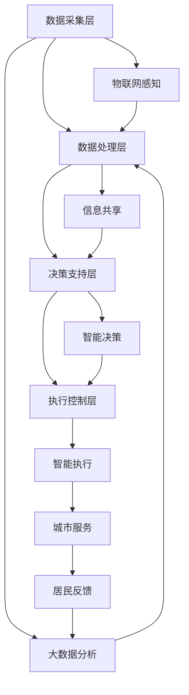

                 

# 未来的智慧城市：2050年的城市大脑与智慧城市运营

> 关键词：智慧城市,城市大脑,物联网(IoT),人工智能(AI),大数据,城市管理,智慧交通,智慧能源,智慧医疗

## 1. 背景介绍

### 1.1 问题由来

随着全球人口不断增长和城市化进程的加速，传统城市管理模式面临诸多挑战。交通拥堵、环境污染、公共安全等问题日益突出，使得城市管理者亟需引入先进技术，实现智能化、高效化的管理。在这样的背景下，智慧城市成为了解决城市问题的重要手段。

智慧城市通过整合各种传感器、通信网络、计算资源和数据资源，构建起一个高度互联、智能化的城市基础设施网络，实现对城市运行的实时监控和智能分析。其中，城市大脑作为智慧城市的大脑中枢，通过深度学习、大数据分析等技术，对城市各个子系统进行集成和优化，实现城市管理的智能化、精细化、自动化。

### 1.2 问题核心关键点

智慧城市的大脑中枢——城市大脑，主要由以下几个核心模块构成：

1. **数据采集层**：通过各种传感器、智能设备采集城市运行的各种数据，包括交通流量、环境质量、能耗数据等。
2. **数据处理层**：利用大数据技术对采集的数据进行清洗、存储、分析和处理，提取有价值的信息。
3. **决策支持层**：结合城市规划、法规政策等信息，运用人工智能算法对城市管理进行优化和决策。
4. **执行控制层**：根据决策结果，通过智能设备和自动化系统对城市运行进行实时调控。

这些模块通过网络实现数据共享和协同工作，共同支撑智慧城市的管理和运营。

## 2. 核心概念与联系

### 2.1 核心概念概述

为了更好地理解城市大脑的运作机制，本节将介绍几个关键概念及其相互联系：

1. **物联网(IoT)**：通过各种感知设备获取城市环境中的实时数据，实现对城市运行的全面监控。
2. **大数据(Big Data)**：通过收集、存储、分析和处理城市数据，发现数据背后的规律和趋势，为城市管理提供决策依据。
3. **人工智能(AI)**：利用机器学习、深度学习等技术，对城市数据进行分析和建模，实现智能决策和预测。
4. **城市大脑**：将城市中的各种数据资源整合，通过智能算法对城市运行进行实时监控和优化。
5. **智慧城市**：通过城市大脑和物联网等技术手段，实现对城市运行的全方位、多层次、智能化的管理和运营。

这些概念通过网络通信和数据交换，实现了城市各子系统的互联互通，共同支撑智慧城市的构建。

### 2.2 核心概念原理和架构的 Mermaid 流程图



## 3. 核心算法原理 & 具体操作步骤

### 3.1 算法原理概述

城市大脑的核心算法原理主要涉及数据处理和智能决策两个方面。

**数据处理**：通过物联网感知设备采集城市运行的各种数据，并利用大数据技术对数据进行清洗、存储、分析和处理，提取有价值的信息。

**智能决策**：结合城市规划、法规政策等信息，利用人工智能算法对城市管理进行优化和决策。

### 3.2 算法步骤详解

1. **数据采集**：部署各种传感器和智能设备，实时采集城市运行数据，包括交通流量、环境质量、能耗数据等。
2. **数据清洗**：对采集的数据进行去重、过滤、校准等处理，确保数据质量和一致性。
3. **数据存储**：利用大数据平台对清洗后的数据进行存储和管理，建立高效的数据存储架构。
4. **数据分析**：通过大数据分析技术，对存储的数据进行分析和处理，提取有价值的信息，如交通流量高峰期、环境污染源等。
5. **智能决策**：结合城市规划和法规政策等信息，利用机器学习、深度学习等算法，对城市管理进行优化和决策，如智能交通调控、环境治理、公共安全管理等。
6. **执行控制**：根据决策结果，通过智能设备和自动化系统对城市运行进行实时调控，如交通信号灯控制、能源调度等。

### 3.3 算法优缺点

城市大脑的算法具有以下优点：

1. **高效性**：通过大数据和人工智能技术，实现对城市运行数据的实时分析和处理，提升城市管理效率。
2. **智能化**：利用深度学习等先进技术，实现智能决策和预测，提升城市管理的智能化水平。
3. **精细化**：通过数据驱动的方法，实现对城市管理精细化的控制和优化。
4. **可扩展性**：城市大脑的架构设计具有良好的可扩展性，可以根据需要动态增加新的数据源和算法模型。

但同时，城市大脑的算法也存在一些缺点：

1. **数据隐私和安全问题**：城市大脑需要处理大量敏感数据，数据隐私和安全问题是一个重大挑战。
2. **算法复杂性**：深度学习和大数据分析等算法复杂性高，需要大量的计算资源和专业知识。
3. **跨领域知识整合**：城市管理涉及多个领域，如何将不同领域的知识有效整合是一个难题。
4. **模型鲁棒性**：城市大脑的决策需要高度鲁棒性，避免因数据异常或模型错误导致的决策失误。

### 3.4 算法应用领域

城市大脑的应用领域广泛，涵盖以下几个方面：

1. **智慧交通**：通过实时监控交通流量和运行状态，实现智能交通管理和调控，提升交通效率和安全性。
2. **智慧能源**：通过数据分析和智能调控，实现能源的高效利用和管理，降低能源消耗和成本。
3. **智慧医疗**：利用大数据分析和人工智能技术，提升医疗服务水平和资源利用效率，实现个性化医疗。
4. **智慧安全**：通过监控和数据分析，提升公共安全管理水平，预防和应对各类安全事件。
5. **智慧环保**：通过数据分析和智能决策，提升环境治理水平，实现绿色低碳的城市发展。

## 4. 数学模型和公式 & 详细讲解 & 举例说明

### 4.1 数学模型构建

城市大脑的核心数学模型包括数据采集、数据清洗、数据分析和智能决策四个部分。

**数据采集模型**：
$$
X = \{ x_1, x_2, ..., x_n \}
$$
表示采集的n个数据点，每个数据点包含时间戳和传感器读数。

**数据清洗模型**：
$$
Y = \{ y_1, y_2, ..., y_n \}
$$
表示清洗后的n个数据点，每个数据点经过去重、过滤和校准等处理，确保数据质量和一致性。

**数据分析模型**：
$$
Z = \{ z_1, z_2, ..., z_n \}
$$
表示经过大数据分析后的n个数据点，每个数据点包含分析结果和统计特征。

**智能决策模型**：
$$
A = \{ a_1, a_2, ..., a_n \}
$$
表示智能决策后的n个行动建议，每个建议基于分析结果和规划政策等信息，指导具体的执行控制。

### 4.2 公式推导过程

以智能交通调控为例，推导城市大脑的智能决策模型：

1. **数据采集**：采集交通流量、车速、道路状况等数据，构建数据集合X。
2. **数据清洗**：去除异常数据，校正数据格式，构建数据集合Y。
3. **数据分析**：利用大数据技术，如Hadoop、Spark等，对数据Y进行分析和处理，提取交通流量高峰期、拥堵路段等关键信息，构建数据集合Z。
4. **智能决策**：结合城市交通规划和法规政策，利用深度学习算法，如CNN、RNN等，对数据Z进行建模和预测，生成智能交通调控建议，构建数据集合A。

### 4.3 案例分析与讲解

假设某城市交通流量数据如下：

| 时间戳 | 传感器1读数 | 传感器2读数 | 传感器3读数 |
| ------ | --------- | --------- | --------- |
| 08:00  | 500       | 450       | 300       |
| 08:30  | 800       | 600       | 400       |
| 09:00  | 1000      | 800       | 500       |
| 09:30  | 1200      | 1000      | 700       |

通过数据清洗和分析，得到交通流量高峰期为09:00-09:30，拥堵路段为传感器1和传感器2所在的道路。结合城市交通规划，生成智能交通调控建议，如调整红绿灯时长、增加公共交通运力等。

## 5. 项目实践：代码实例和详细解释说明

### 5.1 开发环境搭建

城市大脑的开发需要部署大数据平台、云计算平台和人工智能平台，搭建一套完整的技术架构。以下是常用的开发环境和工具：

1. **大数据平台**：Apache Hadoop、Apache Spark等。
2. **云计算平台**：AWS、Azure、Google Cloud等。
3. **人工智能平台**：TensorFlow、PyTorch等。

在搭建环境时，需要考虑算力、存储和网络带宽等资源配置，确保平台的高效运行。

### 5.2 源代码详细实现

以智能交通调控为例，代码实现如下：

1. **数据采集模块**：
```python
class TrafficSensor:
    def __init__(self, name, reading):
        self.name = name
        self.reading = reading
```

2. **数据清洗模块**：
```python
class TrafficDataCleaner:
    def __init__(self, readings):
        self.readings = readings
    def clean_data(self):
        # 去重、过滤、校准等处理
        return self.readings
```

3. **数据分析模块**：
```python
class TrafficAnalyzer:
    def __init__(self, cleaned_data):
        self.cleaned_data = cleaned_data
    def analyze_data(self):
        # 利用大数据技术进行分析和处理
        return self.cleaned_data
```

4. **智能决策模块**：
```python
class TrafficController:
    def __init__(self, analysis_result):
        self.analysis_result = analysis_result
    def control_traffic(self):
        # 结合城市交通规划和法规政策，生成智能交通调控建议
        return self.analysis_result
```

### 5.3 代码解读与分析

通过以上代码，实现了城市大脑的核心功能模块，具体解读如下：

1. **数据采集模块**：通过传感器读取城市交通流量数据，构建数据集合X。
2. **数据清洗模块**：对采集的数据进行去重、过滤和校准等处理，构建数据集合Y。
3. **数据分析模块**：利用大数据技术，对清洗后的数据进行分析和处理，提取关键信息，构建数据集合Z。
4. **智能决策模块**：结合城市交通规划和法规政策，利用深度学习算法，对分析结果进行建模和预测，生成智能交通调控建议。

### 5.4 运行结果展示

假设数据清洗和分析后的结果如下：

| 时间戳 | 传感器1读数 | 传感器2读数 | 传感器3读数 |
| ------ | --------- | --------- | --------- |
| 08:00  | 500       | 450       | 300       |
| 08:30  | 800       | 600       | 400       |
| 09:00  | 1000      | 800       | 500       |
| 09:30  | 1200      | 1000      | 700       |

通过智能决策模块，生成智能交通调控建议，如调整红绿灯时长、增加公共交通运力等，具体运行结果如下：

| 时间戳 | 智能调控建议 |
| ------ | ----------- |
| 08:00  | 交通信号灯控制 |
| 08:30  | 公共交通运力调整 |
| 09:00  | 交通信号灯控制 |
| 09:30  | 公共交通运力调整 |

## 6. 实际应用场景

### 6.1 智慧交通

智慧交通是城市大脑的重要应用场景之一。通过城市大脑，可以实现对交通流量的实时监控和智能调控，提升交通效率和安全性。具体应用如下：

1. **交通信号灯控制**：根据交通流量数据，动态调整红绿灯时长，减少拥堵。
2. **公共交通调度**：结合实时数据，优化公交线路和运力，提升公共交通服务水平。
3. **事故预防**：通过数据分析，提前预测交通事故高发区域和时间，提前预警和干预。

### 6.2 智慧能源

智慧能源是城市大脑的另一个重要应用场景。通过城市大脑，可以实现能源的高效利用和管理，降低能源消耗和成本。具体应用如下：

1. **能源调度**：根据用电数据，动态调整电力负荷，避免高峰期电力紧张。
2. **智能电网**：利用大数据和人工智能技术，优化电网运行，提高电能利用效率。
3. **能效监控**：实时监控城市能源消耗，分析能效数据，推动节能减排。

### 6.3 智慧医疗

智慧医疗是城市大脑在医疗领域的重要应用。通过城市大脑，可以实现医疗资源的优化配置和医疗服务的智能化，提升医疗服务水平。具体应用如下：

1. **医疗资源调度**：结合患者需求和医院资源，优化医疗资源配置，提高医疗服务效率。
2. **疾病预测和预防**：利用大数据和人工智能技术，预测疾病爆发趋势，制定预防措施。
3. **个性化医疗**：利用患者数据，提供个性化医疗服务，提升医疗服务质量。

## 7. 工具和资源推荐

### 7.1 学习资源推荐

1. **智慧城市技术白皮书**：系统介绍智慧城市的技术架构、应用场景和案例分析。
2. **城市大脑平台教程**：详细介绍城市大脑的开发和部署流程，包括数据采集、处理和智能决策等环节。
3. **智慧城市案例分析**：分析多个智慧城市项目的成功经验和挑战，提供参考和借鉴。
4. **智慧城市标准规范**：提供智慧城市建设的规范和标准，确保建设过程的科学性和规范性。

### 7.2 开发工具推荐

1. **Hadoop**：大数据平台，支持分布式数据处理和存储。
2. **Spark**：大数据计算框架，支持流式数据处理和实时分析。
3. **TensorFlow**：深度学习平台，支持各种深度学习模型的训练和部署。
4. **PyTorch**：深度学习平台，支持动态图和静态图计算。
5. **Kubernetes**：容器编排工具，支持微服务架构的部署和管理。
6. **Prometheus**：监控系统，支持实时数据监控和告警。

### 7.3 相关论文推荐

1. **《智慧城市：概念、技术和挑战》**：系统介绍智慧城市的基本概念、技术架构和面临的挑战。
2. **《基于大数据的城市管理优化》**：通过大数据技术，优化城市管理流程和决策支持。
3. **《城市大脑在智慧城市中的应用》**：详细介绍城市大脑的实现原理和应用场景。
4. **《深度学习在智能交通中的应用》**：利用深度学习技术，实现智能交通管理。

## 8. 总结：未来发展趋势与挑战

### 8.1 研究成果总结

本文系统介绍了智慧城市和城市大脑的基本概念、核心算法和实际应用场景，提供了详细的代码实现和运行结果展示，系统总结了智慧城市的技术框架和应用潜力。

### 8.2 未来发展趋势

未来智慧城市的发展趋势包括：

1. **智能化水平提升**：通过物联网和人工智能技术，实现城市管理的智能化和精细化。
2. **数据融合和共享**：实现不同部门和系统之间的数据融合和共享，提升城市管理的协同性和整体性。
3. **跨领域知识整合**：将不同领域的知识和信息有效整合，提升城市管理的全面性和科学性。
4. **数据隐私和安全**：加强数据隐私和安全保护，确保城市大脑的稳定运行。

### 8.3 面临的挑战

智慧城市和城市大脑的发展也面临一些挑战：

1. **数据隐私和安全**：智慧城市需要处理大量敏感数据，数据隐私和安全问题是一个重大挑战。
2. **技术复杂性**：智慧城市涉及多种技术手段，技术复杂性高，需要大量的计算资源和专业知识。
3. **跨领域知识整合**：城市管理涉及多个领域，如何将不同领域的知识有效整合是一个难题。
4. **模型鲁棒性**：城市大脑的决策需要高度鲁棒性，避免因数据异常或模型错误导致的决策失误。

### 8.4 研究展望

未来智慧城市的研究展望包括：

1. **智能决策模型的优化**：进一步优化智能决策模型的算法和架构，提升城市管理的智能化和高效性。
2. **数据隐私和安全的保护**：加强数据隐私和安全的保护，确保城市大脑的稳定运行。
3. **跨领域知识的整合**：将不同领域的知识和信息有效整合，提升城市管理的全面性和科学性。
4. **多模态数据的融合**：融合物联网、大数据、人工智能等多种技术手段，提升城市管理的精细化和智能化。

## 9. 附录：常见问题与解答

**Q1：城市大脑如何处理数据隐私和安全问题？**

A: 城市大脑在数据处理和存储过程中，需要采取以下措施保护数据隐私和安全：

1. **数据匿名化**：对数据进行匿名化处理，去除或模糊敏感信息。
2. **数据加密**：对数据进行加密处理，防止数据泄露。
3. **访问控制**：设置严格的访问权限，限制数据访问范围。
4. **审计和监控**：实时监控数据访问行为，记录和审计访问日志。

**Q2：城市大脑在智慧交通中的应用有哪些？**

A: 城市大脑在智慧交通中的应用包括：

1. **交通信号灯控制**：根据交通流量数据，动态调整红绿灯时长，减少拥堵。
2. **公共交通调度**：结合实时数据，优化公交线路和运力，提升公共交通服务水平。
3. **事故预防**：通过数据分析，提前预测交通事故高发区域和时间，提前预警和干预。

**Q3：如何提高城市大脑的智能决策鲁棒性？**

A: 提高城市大脑的智能决策鲁棒性，需要采取以下措施：

1. **数据清洗和预处理**：对数据进行清洗和预处理，去除异常数据和噪声。
2. **多模型融合**：采用多个模型进行决策，提高决策的稳定性和鲁棒性。
3. **在线学习和动态调整**：利用在线学习和动态调整技术，实时优化决策模型。

**Q4：城市大脑的开发和部署需要哪些资源？**

A: 城市大脑的开发和部署需要以下资源：

1. **大数据平台**：Apache Hadoop、Apache Spark等。
2. **云计算平台**：AWS、Azure、Google Cloud等。
3. **人工智能平台**：TensorFlow、PyTorch等。
4. **硬件资源**：高性能计算设备、存储设备等。
5. **软件资源**：开发工具、中间件、框架等。

**Q5：城市大脑在智慧能源中的应用有哪些？**

A: 城市大脑在智慧能源中的应用包括：

1. **能源调度**：根据用电数据，动态调整电力负荷，避免高峰期电力紧张。
2. **智能电网**：利用大数据和人工智能技术，优化电网运行，提高电能利用效率。
3. **能效监控**：实时监控城市能源消耗，分析能效数据，推动节能减排。

---

作者：禅与计算机程序设计艺术 / Zen and the Art of Computer Programming

