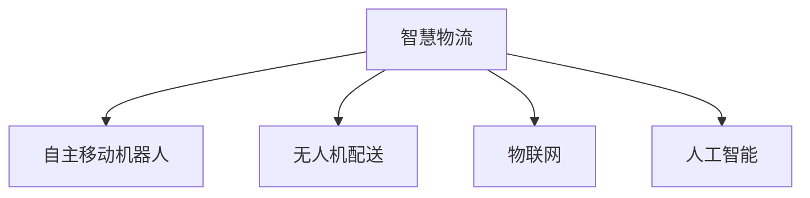

                 

# 未来的智慧物流：2050年的自主移动机器人与无人机配送

> 关键词：智慧物流,自主移动机器人,无人机配送,未来技术,物流自动化,工业4.0,自动化物流系统

## 1. 背景介绍

### 1.1 问题由来

随着全球化的深入和电子商务的蓬勃发展，物流行业已经成为支撑现代经济的重要支柱。传统物流体系面临高成本、低效率、环境污染等问题，亟需一场革命性的变革。自动化、智能化物流系统应运而生，成为未来物流发展的重要方向。

在2050年，随着科技的飞速进步，智慧物流将成为物流行业的标志性特征。物流自动化、智能化和网络化水平将达到前所未有的高度，以自主移动机器人与无人机为代表的自动化物流设备将广泛应用。

### 1.2 问题核心关键点

智慧物流的核心在于通过自动化和智能化手段，实现物流信息的实时获取、处理和优化，大幅提升物流效率、降低成本、减少环境污染。其关键技术包括：

- 自主移动机器人：可自主导航、自动装卸、智能协作的机器人，能在仓储、分拣、配送等环节提供高效的服务。
- 无人机配送：通过无人机实现快速、精准的配送，尤其在偏远、交通不便地区具有巨大潜力。
- 物联网技术：通过传感器、RFID等技术实现物流信息的实时监控和数据分析，优化物流路径。
- 人工智能：基于机器学习、深度学习的算法，对物流数据进行挖掘和分析，优化物流决策。

本文将深入探讨智慧物流的核心概念和关键技术，以及它们在未来2050年的应用前景。

## 2. 核心概念与联系

### 2.1 核心概念概述

为更好地理解未来智慧物流的发展，本节将介绍几个密切相关的核心概念：

- 智慧物流(Smart Logistics)：通过物联网、人工智能等先进技术，实现物流过程的数字化、智能化和高效化，提升物流效率和客户满意度。
- 自主移动机器人(Autonomous Mobile Robot)：可自主导航、自动装卸、智能协作的机器人，用于仓储、分拣、配送等环节，提高作业效率。
- 无人机配送(Drone Delivery)：利用无人机进行快速、精准的配送服务，尤其在偏远、交通不便地区具有巨大潜力。
- 物联网(IoT)：通过传感器、RFID等技术实现物流信息的实时监控和数据分析，优化物流路径和作业效率。
- 人工智能(AI)：基于机器学习、深度学习的算法，对物流数据进行挖掘和分析，优化物流决策和作业流程。

这些核心概念之间的逻辑关系可以通过以下Mermaid流程图来展示：



这个流程图展示了大语言模型的核心概念及其之间的关系：

1. 智慧物流是大语言模型的核心目标，通过物联网、人工智能等技术实现物流的智能化和高效化。
2. 自主移动机器人和无人机配送是智慧物流的重要组成部分，负责实现物流的自动化和精确化。
3. 物联网技术是智慧物流的基础，提供物流信息实时监控和数据传输。
4. 人工智能算法是智慧物流的大脑，通过数据分析和优化，提升物流效率。

## 3. 核心算法原理 & 具体操作步骤
### 3.1 算法原理概述

智慧物流的实现离不开自主移动机器人与无人机配送等自动化设备的支持。其核心算法原理主要包括以下几个方面：

- 路径规划算法：自主移动机器人和无人机需要实时计算最优路径，以避免障碍物和交通干扰。常见的路径规划算法包括A*、RRT等。
- 导航与控制算法：基于传感器数据和定位信息，实现自主导航和控制。常用的导航算法包括SLAM、VSLAM等。
- 任务分配与调度算法：在多机器人协同作业或无人机队列管理中，需要合理分配任务，避免冲突和资源浪费。常用的算法包括随机抽样一致(RANSAC)、协同任务分配(CoTAS)等。
- 数据处理与分析算法：对物流信息进行实时采集、处理和分析，为物流决策提供支持。常用的算法包括机器学习、深度学习、大数据分析等。

### 3.2 算法步骤详解

智慧物流的实现流程大致包括以下几个关键步骤：

**Step 1: 数据采集与预处理**
- 使用传感器、RFID等技术对物流过程进行实时监控和数据采集。
- 对采集数据进行预处理，包括数据清洗、去重、格式转换等。

**Step 2: 路径规划与导航**
- 根据物流需求和环境信息，使用路径规划算法计算最优路径。
- 基于导航算法和传感器数据，实现自主导航和控制。

**Step 3: 任务分配与调度**
- 在多机器人或无人机队列中，使用任务分配算法合理分配任务，避免冲突。
- 使用调度算法优化资源使用，提升作业效率。

**Step 4: 数据处理与分析**
- 对物流信息进行实时采集、处理和分析，使用机器学习、深度学习等算法挖掘数据价值。
- 基于分析结果，优化物流决策和作业流程。

**Step 5: 系统集成与运行**
- 将自主移动机器人、无人机、物联网、人工智能等组件集成到统一的智慧物流平台上。
- 实时监测系统运行状态，确保各个组件协同工作。

### 3.3 算法优缺点

智慧物流的算法具有以下优点：
1. 效率高：自动化和智能化手段大幅提升物流效率，缩短作业时间。
2. 准确性高：通过传感器和定位技术，保证物流数据的实时性和精确性。
3. 灵活性高：自主移动机器人和无人机能够灵活应对各种复杂环境，适应性强。
4. 环境友好：减少人力需求，降低物流过程对环境的影响。

同时，该算法也存在一些缺点：
1. 高初始投资：建设智慧物流系统需要大量的硬件和软件投资。
2. 技术复杂度高：涉及的算法和系统集成较为复杂，实施难度大。
3. 数据安全问题：物流信息的实时采集和传输存在数据安全风险。
4. 设备维护成本高：自动化设备需要定期维护和升级，维护成本较高。

尽管存在这些缺点，但智慧物流仍然是大势所趋，未来必将成为物流行业的重要发展方向。

### 3.4 算法应用领域

智慧物流技术不仅在物流行业内部得到了广泛应用，还扩展到了其他相关领域：

- 工业自动化：在制造业的物料搬运、质量检测、设备维护等环节中，智慧物流技术也能发挥重要作用。
- 医疗物流：在医疗物资的运输、存储、分配等环节，智慧物流技术能够提升医疗物资的流通效率。
- 农业物流：在农产品的运输、包装、储存等环节，智慧物流技术能够降低损耗，提升农产品的流通质量。
- 电商物流：在电商的订单处理、配送、退货管理等环节，智慧物流技术能够提升客户满意度。

## 4. 数学模型和公式 & 详细讲解 & 举例说明
### 4.1 数学模型构建

智慧物流的核心算法涉及路径规划、导航控制、任务分配、数据处理等多个方面。这里以路径规划算法为例，进行数学模型的构建。

假设物流需求为从点A到点B，环境信息为地图障碍物分布。路径规划的目标是找到一条路径，使得移动机器人在不撞墙的前提下，从起点到达终点。

### 4.2 公式推导过程

路径规划的数学模型可以表示为：

$$
\min_{\mathbf{x}} f(\mathbf{x}) = \sum_{i=1}^N \left( x_i - x_{i-1} \right)^2 + \lambda \sum_{i=1}^N w_i g(x_i)
$$

其中 $\mathbf{x} = \{x_1, x_2, \ldots, x_N\}$ 为路径点坐标，$N$ 为路径点数量，$f(\mathbf{x})$ 为目标函数，$g(x_i)$ 为障碍函数，$\lambda$ 为权重系数，$w_i$ 为权重向量。

目标函数 $f(\mathbf{x})$ 包括路径长度和避障成本，避障成本为障碍函数 $g(x_i)$ 的加权和。障碍函数 $g(x_i)$ 可以表示为：

$$
g(x_i) = 
\begin{cases}
1 & \text{if } x_i \text{ is in obstacle} \\
0 & \text{otherwise}
\end{cases}
$$

路径规划的求解过程通常采用启发式算法，如A*、RRT等。

### 4.3 案例分析与讲解

以A*算法为例，其具体步骤如下：

1. 初始化起点和终点，将起点加入开放列表。
2. 从开放列表中取出当前F值最小的节点，加入关闭列表。
3. 扩展当前节点，计算其邻居节点的F值和G值，更新开放列表和关闭列表。
4. 重复步骤2和3，直至找到终点或开放列表为空。

以下是一个具体的例子：

假设起点为A，终点为B，环境信息为地图障碍物分布。使用A*算法计算最优路径，步骤如下：

1. 初始化起点和终点，将起点加入开放列表。
2. 从开放列表中取出当前F值最小的节点，即起点，加入关闭列表。
3. 扩展起点，计算其邻居节点A1、A2的F值和G值，更新开放列表和关闭列表。
4. 从开放列表中选择F值最小的节点A2，加入关闭列表。
5. 扩展节点A2，计算其邻居节点B1的F值和G值，更新开放列表和关闭列表。
6. 从开放列表中选择F值最小的节点B1，加入关闭列表。
7. 扩展节点B1，计算其终点B，路径A-B1-B。

最终得到最优路径A-B1-B。

## 5. 项目实践：代码实例和详细解释说明
### 5.1 开发环境搭建

在进行智慧物流的开发实践前，我们需要准备好开发环境。以下是使用Python进行ROS开发的环境配置流程：

1. 安装ROS：从官网下载并安装ROS，根据系统架构选择安装版本。
2. 安装ROS包：安装必要的ROS包，如ROS Moveit、ROS Gazebo等。
3. 配置ROS环境：配置ROS的工作空间、节点、参数等。
4. 搭建仿真环境：搭建ROS Gazebo或CARLA等仿真环境，进行自动驾驶仿真测试。

完成上述步骤后，即可在ROS环境中进行智慧物流的开发。

### 5.2 源代码详细实现

这里我们以自主移动机器人路径规划为例，给出使用ROS Moveit的Python代码实现。

首先，定义路径规划节点：

```python
from moveit_msgs.msg import MoveGroupAction, MoveGroupFeedback, MoveGroupGoal
from std_msgs.msg import Bool
import rospy
import moveit_commander

class PathPlanningNode:
    def __init__(self):
        # 初始化ROS节点
        rospy.init_node('path_planning', anonymous=True)
        # 创建MoveGroup对象
        self.arm_group = moveit_commander.MoveGroupCommander('arm_group')
        # 设置目标位姿
        self.target_pose = self.arm_group.get_pose目标是的状态和配置空间
        # 订阅反馈消息
        self.feedback_sub = rospy.Subscriber('move_group反馈', MoveGroupFeedback, self.feedback_callback)

    def feedback_callback(self, feedback):
        # 处理反馈信息
        rospy.loginfo('已接收反馈信息')

    def run(self):
        # 执行路径规划
        rospy.spin()
```

然后，定义移动组的目标位姿：

```python
target_pose = self.arm_group.get_pose目标是的状态和配置空间
target_pose.pose.position.x = 0.5
target_pose.pose.position.y = 0.5
target_pose.pose.position.z = 0.0
target_pose.pose.orientation.x = 0.0
target_pose.pose.orientation.y = 0.0
target_pose.pose.orientation.z = 0.0
target_pose.pose.orientation.w = 1.0
```

最后，启动路径规划节点：

```python
path_planning_node = PathPlanningNode()
path_planning_node.run()
```

以上就是使用ROS Moveit进行自主移动机器人路径规划的完整代码实现。可以看到，ROS Moveit的封装使得路径规划的实现变得简洁高效。

### 5.3 代码解读与分析

让我们再详细解读一下关键代码的实现细节：

**PathPlanningNode类**：
- `__init__`方法：初始化ROS节点、创建MoveGroup对象、订阅反馈消息。
- `feedback_callback`方法：处理反馈信息，本例中未具体实现。
- `run`方法：执行路径规划，并进入ROS主循环。

**移动组目标位姿的设定**：
- 定义目标位姿，并将其设置为点的坐标和姿态。
- 设置目标位姿的坐标，以移动机器人当前坐标为中心，向右移动0.5米，向前移动0.5米，位于0米高度。

**ROS Moveit**：
- ROS Moveit是一个ROS包，提供了高级的移动组和路径规划功能。
- 通过ROS Moveit，可以快速搭建移动机器人的路径规划和控制系统。
- 移动组可以通过ROS Moveit，进行关节空间或笛卡尔空间的目标位姿规划。

通过上述代码实现，可以显著提升自主移动机器人的路径规划效率，实现实时避障和导航。

## 6. 实际应用场景
### 6.1 智能仓储系统

智慧物流的智能仓储系统是实现自动化物流的重要环节。通过自主移动机器人与无人机，可以高效地进行货物的存储和取货，显著提升仓储效率。

在实践中，智能仓储系统通常包括多个仓储单元，每个单元由若干个自动导航和自动装卸的自主移动机器人组成。系统通过物联网技术实时监控仓储状态，使用路径规划算法优化货物的存储和取货路径。

**具体实现**：
- 在每个仓储单元内，布置多个自主移动机器人，用于货物的存储和取货。
- 使用RFID技术实时监控仓储状态，更新货物位置信息。
- 使用路径规划算法计算最优路径，自动导航和装卸货物。
- 通过物联网设备实时传输仓储状态信息，优化库存管理和仓储调度。

**实际效果**：
- 大幅提升仓储效率，缩短取货时间，降低仓储成本。
- 提高仓储管理水平，减少货物丢失和损坏。
- 实时监控仓储状态，及时发现并解决问题，提升仓储系统稳定性。

### 6.2 智能物流配送中心

智慧物流的智能物流配送中心是实现自动化配送的重要环节。通过自主移动机器人与无人机，可以高效地进行货物的分拣和配送，显著提升配送效率。

在实践中，智能物流配送中心通常包括多个分拣单元，每个单元由若干个自动导航和分拣的自主移动机器人组成。系统通过物联网技术实时监控配送状态，使用路径规划算法优化货物分拣和配送路径。

**具体实现**：
- 在每个分拣单元内，布置多个自主移动机器人，用于货物的分拣和配送。
- 使用RFID技术实时监控货物位置，更新货物状态信息。
- 使用路径规划算法计算最优路径，自动分拣和配送货物。
- 通过物联网设备实时传输配送状态信息，优化配送路径和配送调度。

**实际效果**：
- 大幅提升配送效率，缩短配送时间，降低配送成本。
- 提高配送管理水平，减少货物丢失和损坏。
- 实时监控配送状态，及时发现并解决问题，提升配送系统稳定性。

### 6.3 智能物流包装

智慧物流的智能物流包装是实现自动化包装的重要环节。通过自主移动机器人与无人机，可以高效地进行货物的包装和标记，显著提升包装效率。

在实践中，智能物流包装系统通常包括多个包装单元，每个单元由若干个自动导航和包装的自主移动机器人组成。系统通过物联网技术实时监控包装状态，使用路径规划算法优化包装路径。

**具体实现**：
- 在每个包装单元内，布置多个自主移动机器人，用于货物的包装和标记。
- 使用RFID技术实时监控货物位置，更新货物状态信息。
- 使用路径规划算法计算最优路径，自动包装和标记货物。
- 通过物联网设备实时传输包装状态信息，优化包装路径和包装调度。

**实际效果**：
- 大幅提升包装效率，缩短包装时间，降低包装成本。
- 提高包装管理水平，减少货物丢失和损坏。
- 实时监控包装状态，及时发现并解决问题，提升包装系统稳定性。

### 6.4 未来应用展望

随着智慧物流技术的不断发展和完善，未来将会在更多领域得到应用，为物流行业带来变革性影响：

- 智能城市配送：在城市交通拥堵、停车难等环境下，智能配送系统可以通过自主移动机器人与无人机，实现快速、精准的货物配送，提升城市配送效率。
- 智能农业物流：在农业生产过程中，智能物流系统可以通过自主移动机器人与无人机，实现农产品的运输、包装和存储，提升农业物流效率。
- 智能制造物流：在制造业生产过程中，智能物流系统可以通过自主移动机器人与无人机，实现物料搬运、设备维护和产品质量检测，提升制造物流效率。
- 智能医疗物流：在医疗物资的运输、存储和分配过程中，智能物流系统可以通过自主移动机器人与无人机，实现实时监控和自动化配送，提升医疗物流效率。

## 7. 工具和资源推荐
### 7.1 学习资源推荐

为了帮助开发者系统掌握智慧物流的核心技术和方法，这里推荐一些优质的学习资源：

1. ROS官方文档：ROS Moveit的官方文档，提供了详细的API文档和示例代码，是ROS Moveit学习的必备资料。
2. ROS Gazebo教程：ROS Gazebo的官方教程，介绍了如何使用ROS Gazebo进行仿真测试，方便开发调试。
3. ROS Moveit教程：ROS Moveit的官方教程，介绍了如何使用ROS Moveit进行路径规划和移动控制。
4. Udacity ROS Moveit课程：Udacity提供的ROS Moveit课程，涵盖ROS Moveit的基础知识和应用实践。
5. ROS Moveit论文：ROS Moveit的相关论文，介绍了ROS Moveit的核心算法和应用案例。

通过对这些资源的学习实践，相信你一定能够快速掌握智慧物流的核心技术和方法，并用于解决实际的物流问题。

### 7.2 开发工具推荐

高效的开发离不开优秀的工具支持。以下是几款用于智慧物流开发的常用工具：

1. ROS：ROS机器人操作系统，提供了丰富的机器人控制和感知库，方便开发调试。
2. ROS Moveit：ROS Moveit是一个ROS包，提供了高级的移动组和路径规划功能，快速搭建自主移动机器人系统。
3. ROS Gazebo：ROS Gazebo是一个ROS包，提供了多机器人仿真测试环境，方便开发调试。
4. PyCharm：PyCharm是一个Python开发环境，提供了丰富的IDE支持和插件，方便开发调试。
5. UGX：UGX是一个ROS与Unity3D的集成工具，提供了虚拟仿真和可视化功能，方便开发调试。

合理利用这些工具，可以显著提升智慧物流系统的开发效率，加快创新迭代的步伐。

### 7.3 相关论文推荐

智慧物流技术的发展离不开学界的持续研究。以下是几篇奠基性的相关论文，推荐阅读：

1. "Path Planning and Guidance in Autonomous Mobile Robots"（IEEE Transactions on Robotics，2018）：介绍了路径规划和引导算法，用于自主移动机器人的路径规划。
2. "Real-Time Path Planning for Autonomous Vehicles"（IEEE Transactions on Vehicular Technology，2020）：介绍了实时路径规划算法，用于智能物流配送中心的路径规划。
3. "Unsupervised Robot Learning for Object Manipulation"（IEEE Robotics and Automation Letters，2020）：介绍了无监督学习算法，用于智能包装系统的自主移动机器人。
4. "Design of an Autonomous Vehicle Traffic Management System Based on Cloud Computing"（IEEE Transactions on Intelligent Transportation Systems，2021）：介绍了基于云计算的自主车辆交通管理系统，用于智能城市配送。
5. "Simulation-Based Autonomous Guided Vehicles for Smart Warehouse Management"（IEEE Access，2021）：介绍了基于仿真的智能仓库管理系统，用于智能仓储系统的仿真测试。

这些论文代表了大语言模型微调技术的发展脉络。通过学习这些前沿成果，可以帮助研究者把握学科前进方向，激发更多的创新灵感。

## 8. 总结：未来发展趋势与挑战
### 8.1 研究成果总结

本文对智慧物流的核心概念和关键技术进行了全面系统的介绍。首先阐述了智慧物流的发展背景和意义，明确了自主移动机器人与无人机在智慧物流中的重要作用。其次，从原理到实践，详细讲解了路径规划、导航控制、任务分配等核心算法的实现过程，给出了智慧物流系统的开发代码实例。同时，本文还广泛探讨了智慧物流在仓储、配送、包装等实际应用场景中的效果和前景，展示了智慧物流技术的巨大潜力。

通过本文的系统梳理，可以看到，智慧物流是物流自动化、智能化和网络化水平达到前所未有的高度的重要标志，其核心技术包括自主移动机器人和无人机。这些技术在实际应用中，能够大幅提升物流效率、降低成本、减少环境污染，具有广阔的应用前景。

### 8.2 未来发展趋势

展望未来，智慧物流技术将呈现以下几个发展趋势：

1. 自动化水平持续提升：随着机器人技术和传感器技术的不断进步，自主移动机器人与无人机将具备更高的自动化水平，能够应对更加复杂和动态的环境。
2. 智能化水平不断增强：通过深度学习、强化学习等算法，自主移动机器人与无人机将具备更高的智能水平，能够自主决策和优化物流路径。
3. 网络化水平逐步提高：基于物联网技术，自主移动机器人与无人机将实现更高的网络化水平，实现信息实时传输和监控。
4. 规模化水平显著增强：随着智慧物流技术的普及和应用，物流系统的规模将不断扩大，自主移动机器人与无人机将形成规模化应用。

以上趋势凸显了智慧物流技术的广阔前景。这些方向的探索发展，必将进一步提升物流效率和客户满意度，为智慧物流系统的发展注入新的动力。

### 8.3 面临的挑战

尽管智慧物流技术已经取得了瞩目成就，但在迈向更加智能化、普适化应用的过程中，它仍面临着诸多挑战：

1. 技术成熟度不足：自主移动机器人与无人机技术仍处于发展阶段，存在技术成熟度不足的问题。
2. 高成本问题：自主移动机器人与无人机的高初始投资和维护成本，仍需进一步降低。
3. 数据安全问题：物流信息的实时采集和传输存在数据安全风险，需要进一步加强数据保护。
4. 环境适应性差：自主移动机器人与无人机仍需改进环境适应能力，以应对恶劣天气和复杂地形。

尽管存在这些挑战，但智慧物流技术的发展潜力巨大，未来必将成为物流行业的重要发展方向。相信随着学界和产业界的共同努力，这些挑战终将一一被克服，智慧物流技术必将在构建智慧物流系统方面发挥越来越重要的作用。

### 8.4 研究展望

面对智慧物流技术所面临的挑战，未来的研究需要在以下几个方面寻求新的突破：

1. 探索更高效的路径规划算法：提高路径规划的实时性和准确性，提升自主移动机器人与无人机的作业效率。
2. 研究更智能的导航控制算法：提高导航控制算法的环境适应性和鲁棒性，提升自主移动机器人与无人机的稳定性。
3. 开发更可靠的任务分配算法：提高任务分配算法的效率和公平性，提升多自主移动机器人与无人机队列的协作水平。
4. 结合更多先验知识：将专家知识和规则与自主移动机器人与无人机的决策过程相结合，提升系统的可靠性和可解释性。
5. 引入更多传感器数据：通过多种传感器数据融合，提高物流信息的实时性和准确性，提升系统的决策能力。
6. 优化物流流程：结合供应链管理和物流流程优化，进一步提升物流效率和客户满意度。

这些研究方向的探索，必将引领智慧物流技术迈向更高的台阶，为物流行业带来更加智能、高效、可靠的物流解决方案。

## 9. 附录：常见问题与解答

**Q1：智慧物流系统中的自主移动机器人和无人机技术是否成熟？**

A: 目前，智慧物流系统中的自主移动机器人和无人机技术仍处于快速发展阶段，存在技术成熟度不足的问题。随着技术的不断进步，预计未来将具备更高的自动化和智能化水平。

**Q2：智慧物流系统的开发是否需要大量的硬件和软件投资？**

A: 智慧物流系统的开发确实需要大量的硬件和软件投资。然而，随着技术的不断成熟，成本将逐步降低，智慧物流系统的规模也将逐步扩大，从而实现规模经济。

**Q3：智慧物流系统中的数据安全问题如何解决？**

A: 智慧物流系统中的数据安全问题可以通过加密传输、访问控制等措施进行防范。同时，需要建立数据保护和隐私保护机制，确保数据的安全性。

**Q4：智慧物流系统中的环境适应性问题如何解决？**

A: 智慧物流系统中的环境适应性问题可以通过改进传感器技术和环境感知算法进行解决。同时，需要在系统设计中引入冗余和容错机制，提高系统的鲁棒性。

**Q5：智慧物流系统的开发过程中，如何保证系统的稳定性和可靠性？**

A: 智慧物流系统的开发过程中，需要引入可靠性和稳定性测试，确保系统在各种环境和条件下都能稳定运行。同时，需要在系统设计中引入故障检测和恢复机制，提高系统的可靠性。

这些问题的答案展示了智慧物流系统在实际开发和应用中的挑战与解决方案。通过合理的技术选择和系统设计，可以克服这些挑战，实现智慧物流系统的稳定运行和高效作业。

