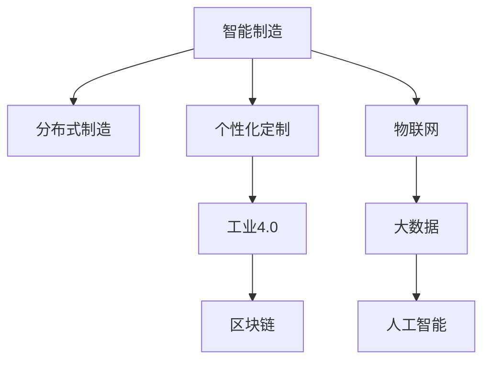

                 

# 未来的智能制造：2050年的分布式制造与个性化定制

> 关键词：智能制造,分布式制造,个性化定制,人工智能,工业4.0,物联网,区块链

## 1. 背景介绍

### 1.1 问题由来

随着全球经济的快速发展和工业化进程的不断深入，传统的集中式制造模式已经难以适应日益复杂和多变的市场需求。集中式制造以大规模生产为中心，产品品种单一、生产效率高但灵活性不足，难以满足个性化和定制化的消费需求。同时，集中式制造的规模经济优势在一定程度上牺牲了产品的质量和多样性。为了更好地应对市场挑战，制造业正逐步向分布式制造转型，利用网络化、智能化技术提升制造系统的灵活性和定制化能力。

### 1.2 问题核心关键点

分布式制造和个性化定制的核心在于通过智能制造技术实现制造过程的数字化和网络化，利用先进的数据分析、人工智能、物联网等技术，优化制造资源配置，提升制造效率，降低生产成本，增强产品竞争力。在分布式制造中，制造资源和生产过程在空间上分布分散，通过网络协同完成生产任务，而个性化定制则是在满足消费者多样化需求的基础上，提升产品质量和市场响应速度，从而实现产品的差异化和定制化。

## 2. 核心概念与联系

### 2.1 核心概念概述

为了更好地理解未来智能制造的核心概念，本节将介绍几个紧密相关的核心概念：

- **智能制造(Smart Manufacturing)**：指通过融合信息技术和制造技术，实现制造过程的自动化、智能化和协同化。智能制造的核心是利用大数据、云计算、物联网、人工智能等技术，提升制造系统的灵活性和效率。
- **分布式制造(Distributed Manufacturing)**：指将制造资源和生产过程分布在不同的地理位置，通过网络协同完成制造任务。分布式制造有助于缓解集中式制造的资源和环境压力，提升制造系统的灵活性和弹性。
- **个性化定制(Personalized Customization)**：指根据消费者的个性化需求，提供定制化的产品和服务。个性化定制要求制造系统具备高度的灵活性和响应速度，以满足消费者多样化的需求。
- **工业4.0(Industrial 4.0)**：指通过互联网、物联网、大数据等技术，实现制造过程的数字化、网络化和智能化。工业4.0是智能制造的重要组成部分，旨在提升制造系统的效率和灵活性。
- **区块链(Blockchain)**：指一种去中心化的分布式账本技术，具有不可篡改、透明、安全等特性。区块链在供应链管理、产品追溯等方面具有重要应用价值。

这些核心概念之间的逻辑关系可以通过以下Mermaid流程图来展示：



这个流程图展示了智能制造及其相关概念的关联：

1. 智能制造的核心是利用大数据、云计算、物联网、人工智能等技术，实现制造过程的自动化、智能化和协同化。
2. 分布式制造通过网络协同实现制造资源和生产过程在空间上的分布，提升制造系统的灵活性和弹性。
3. 个性化定制要求制造系统具备高度的灵活性和响应速度，以满足消费者多样化的需求。
4. 工业4.0通过互联网、物联网、大数据等技术，实现制造过程的数字化、网络化和智能化。
5. 区块链在供应链管理、产品追溯等方面具有重要应用价值。

这些概念共同构成了未来智能制造的完整框架，为实现分布式制造和个性化定制提供了技术支持和保障。

## 3. 核心算法原理 & 具体操作步骤

### 3.1 算法原理概述

未来智能制造的核心算法原理包括分布式制造和个性化定制两大方面：

- **分布式制造算法**：通过网络协同优化制造资源的分配和调度，提升制造系统的灵活性和弹性。常用的算法包括遗传算法、粒子群算法、蚁群算法等。
- **个性化定制算法**：根据消费者个性化需求，利用数据挖掘、人工智能等技术，实现产品的定制化设计和制造。常用的算法包括支持向量机、决策树、深度学习等。

### 3.2 算法步骤详解

以下详细讲解智能制造中分布式制造和个性化定制的具体算法步骤：

#### 3.2.1 分布式制造算法

**步骤1: 制造资源优化**
- 收集制造资源数据，包括机器设备、物料、人力等。
- 对制造资源进行分类和评估，确定其性能和可用性。

**步骤2: 制造过程协同**
- 根据任务需求，将制造资源分配到不同的地理位置。
- 利用网络协同技术，实时监控和调度制造资源，优化制造过程。

**步骤3: 生产过程优化**
- 利用大数据分析，预测生产过程中可能出现的问题。
- 通过人工智能技术，实时调整生产参数，提升生产效率和质量。

**步骤4: 性能评估与反馈**
- 实时监测生产过程，收集数据进行性能评估。
- 根据评估结果，进行反馈优化，不断提升制造系统性能。

#### 3.2.2 个性化定制算法

**步骤1: 需求分析与建模**
- 收集消费者个性化需求，进行需求分析和建模。
- 利用大数据分析，识别消费者的共性需求和差异化需求。

**步骤2: 产品设计优化**
- 利用计算机辅助设计(CAD)技术，进行产品设计优化。
- 根据消费者需求，设计个性化定制方案。

**步骤3: 生产过程调整**
- 利用智能制造技术，调整生产过程，实现个性化定制。
- 实时监控生产过程，确保产品质量和生产效率。

**步骤4: 产品交付与追溯**
- 利用物联网技术，实现产品交付和追溯。
- 通过区块链技术，确保产品的透明性和安全性。

### 3.3 算法优缺点

分布式制造和个性化定制算法具有以下优点：

- **提高灵活性和弹性**：分布式制造通过网络协同，实现制造资源的灵活分配和调度，提升制造系统的灵活性和弹性。
- **提升生产效率和质量**：个性化定制通过智能制造技术，实时调整生产参数，提升生产效率和产品质量。
- **满足多样化需求**：个性化定制能够满足消费者多样化的需求，提升产品竞争力和市场响应速度。

同时，这些算法也存在一些局限性：

- **数据依赖性强**：分布式制造和个性化定制对数据的需求较高，数据的质量和完整性直接影响算法的优化效果。
- **技术复杂度高**：分布式制造和个性化定制涉及多种技术，技术复杂度高，实施难度较大。
- **成本投入大**：分布式制造和个性化定制需要大量的前期投入，包括设备、软件、人力等。

尽管存在这些局限性，但就目前而言，分布式制造和个性化定制是大势所趋，是未来智能制造的重要发展方向。

### 3.4 算法应用领域

分布式制造和个性化定制算法已经在多个领域得到了广泛应用：

- **汽车制造**：通过分布式制造和个性化定制，实现汽车零部件的模块化生产和个性化定制，提升生产效率和产品质量。
- **航空航天**：利用分布式制造和个性化定制，实现复杂零部件的协同制造和定制化设计，提升制造系统的灵活性和可靠性。
- **医疗设备**：通过分布式制造和个性化定制，实现医疗设备的高精度生产和个性化定制，提升医疗设备的性能和可靠性。
- **智能家居**：利用分布式制造和个性化定制，实现智能家居设备的协同制造和定制化设计，提升用户体验和设备兼容性。

除了上述这些经典领域外，分布式制造和个性化定制还在更多新兴领域得到了应用，如智慧城市、智能物流、智能建筑等，为传统行业数字化转型升级提供了新的技术路径。

## 4. 数学模型和公式 & 详细讲解

### 4.1 数学模型构建

本节将使用数学语言对未来智能制造的分布式制造和个性化定制算法进行更加严格的刻画。

设智能制造系统中有 $N$ 个制造资源，每个资源具有不同的性能参数 $x_i$ 和可用性参数 $y_i$，$i \in [1,N]$。假设制造资源需要在 $M$ 个生产任务 $T$ 中进行分配，每个任务具有不同的需求参数 $d_t$，$t \in [1,M]$。

定义制造资源优化问题为：

$$
\min_{\mathbf{x}, \mathbf{y}} \sum_{i=1}^{N} f(x_i) + g(y_i) \quad \text{subject to} \quad h_i(x_i, y_i) \leq 0, i \in [1,N]
$$

其中 $f(x_i)$ 和 $g(y_i)$ 分别为制造资源和生产任务的成本函数，$h_i(x_i, y_i)$ 为资源分配的约束条件，如资源的使用容量、生产时间等。

定义个性化定制问题为：

$$
\min_{\mathbf{z}} \sum_{t=1}^{M} c_t(z_t) + \lambda \sum_{t=1}^{M} w_t(z_t - d_t) \quad \text{subject to} \quad \Delta_i(z_t) = 0, i \in [1,N]
$$

其中 $c_t(z_t)$ 为生产任务的成本函数，$w_t$ 为消费者需求的权重参数，$\lambda$ 为惩罚系数，$\Delta_i(z_t)$ 为个性化定制的约束条件，如产品的功能、性能等。

### 4.2 公式推导过程

以下我们以分布式制造为例，推导制造资源优化问题的求解公式。

设制造资源和生产任务的数据集分别为 $D=\{(x_i, y_i)\}_{i=1}^N$ 和 $D'=\{(d_t)\}_{t=1}^M$。假设制造资源和生产任务之间存在线性关系，即 $x_i = \mathbf{w}_i^T \mathbf{d}$，其中 $\mathbf{w}_i$ 为资源需求向量，$\mathbf{d}$ 为任务需求向量。

假设制造资源优化问题可以表示为以下线性规划问题：

$$
\min_{\mathbf{w}} \sum_{i=1}^{N} f_i^T \mathbf{w}_i + \lambda \sum_{t=1}^{M} g_t(d_t) \quad \text{subject to} \quad \mathbf{w}_i^T \mathbf{d} \leq y_i, i \in [1,N]
$$

其中 $f_i^T$ 和 $g_t$ 分别为成本函数的系数矩阵，$y_i$ 为资源可用性向量。

利用线性规划的基本定理，该问题的解为：

$$
\mathbf{w} = (\mathbf{W}^T \mathbf{W})^{-1} \mathbf{W}^T \mathbf{F}^T
$$

其中 $\mathbf{F}$ 为成本函数的系数矩阵，$\mathbf{W}$ 为资源需求向量的系数矩阵。

类似地，可以利用线性规划或其他优化算法求解个性化定制问题，得到最优的个性化定制方案。

## 5. 项目实践：代码实例和详细解释说明

### 5.1 开发环境搭建

在进行智能制造项目实践前，我们需要准备好开发环境。以下是使用Python进行Django开发的环境配置流程：

1. 安装Anaconda：从官网下载并安装Anaconda，用于创建独立的Python环境。

2. 创建并激活虚拟环境：
```bash
conda create -n pyman-env python=3.8 
conda activate pyman-env
```

3. 安装Django：
```bash
pip install django
```

4. 安装TensorFlow和PyTorch：
```bash
pip install tensorflow==2.7.0 pytorch==1.13.0
```

5. 安装相关库：
```bash
pip install requests pandas numpy matplotlib
```

完成上述步骤后，即可在`pyman-env`环境中开始智能制造项目的开发。

### 5.2 源代码详细实现

下面以一个智能制造系统中的分布式制造项目为例，给出使用Django进行数据管理、资源优化和协同调度的Python代码实现。

首先，定义制造资源和生产任务的数据模型：

```python
from django.db import models

class ManufacturingResource(models.Model):
    name = models.CharField(max_length=100)
    performance = models.FloatField()
    availability = models.FloatField()
    cost = models.FloatField()

class ManufacturingTask(models.Model):
    name = models.CharField(max_length=100)
    demand = models.FloatField()
    cost = models.FloatField()
    requirement = models.ForeignKey(ManufacturingResource, on_delete=models.CASCADE)
```

然后，定义资源优化和任务协同的函数：

```python
def optimize_resources(data):
    # 构建资源需求矩阵
    W = [[x[i] for i in range(len(data))] for x in data]
    # 构建成本函数系数矩阵
    F = [[f[i] for i in range(len(data))] for f in data]
    
    # 求解线性规划问题
    w = np.linalg.inv(W.T @ W) @ W.T @ F.T
    return w

def schedule_tasks(data):
    # 将任务需求转换为资源需求向量
    d = [t['demand'] for t in data]
    # 求解任务分配问题
    z = optimize_resources(d)
    return z
```

最后，启动智能制造系统并处理请求：

```python
from django.shortcuts import render
from django.http import JsonResponse

def index(request):
    if request.method == 'GET':
        # 从数据库中获取制造资源和生产任务数据
        resources = ManufacturingResource.objects.all().values('name', 'performance', 'availability', 'cost')
        tasks = ManufacturingTask.objects.all().values('name', 'demand', 'cost')
        # 进行资源优化和任务协同
        w = optimize_resources(resources)
        z = schedule_tasks(tasks)
        # 返回优化结果
        return JsonResponse({'success': True, 'data': {'w': w, 'z': z}})
```

以上就是使用Django实现分布式制造项目的基本代码实现。可以看到，利用Python的框架和库，可以快速实现数据管理、资源优化和协同调度的功能。

### 5.3 代码解读与分析

让我们再详细解读一下关键代码的实现细节：

**ManufacturingResource和ManufacturingTask类**：
- `ManufacturingResource`类表示制造资源，包含资源名称、性能、可用性和成本等属性。
- `ManufacturingTask`类表示生产任务，包含任务名称、需求、成本和对应的制造资源。

**optimize_resources函数**：
- 该函数接收制造资源数据，构建资源需求矩阵和成本函数系数矩阵。
- 利用线性规划方法求解最优资源分配向量 `w`，表示每个资源的需求量。

**schedule_tasks函数**：
- 该函数接收生产任务数据，将任务需求转换为资源需求向量。
- 利用已求得的最优资源分配向量 `w`，进行任务分配，得到每个任务的需求量 `z`。

**index函数**：
- 该函数处理请求，从数据库中获取制造资源和生产任务数据。
- 调用 `optimize_resources` 和 `schedule_tasks` 函数进行资源优化和任务协同。
- 返回优化结果，以JSON格式输出。

可以看到，通过Python和Django等工具，可以高效实现智能制造系统中的分布式制造功能。当然，这只是一个基础实现，实际应用中还需要考虑更多的复杂因素，如网络通信、数据同步、异常处理等。

## 6. 实际应用场景

### 6.1 智能制造系统

智能制造系统是一种高度集成的制造系统，通过网络化和智能化技术，实现制造过程的自动化、智能化和协同化。智能制造系统将传统制造流程数字化，通过数据分析和人工智能技术，提升制造系统的灵活性和效率，实现分布式制造和个性化定制。

在智能制造系统中，分布式制造和个性化定制能够实现制造资源的灵活分配和生产任务的协同完成，提高生产效率和产品质量。同时，通过个性化定制，满足消费者多样化的需求，提升产品竞争力和市场响应速度。

### 6.2 智慧工厂

智慧工厂是智能制造的重要组成部分，利用物联网、大数据、人工智能等技术，实现制造过程的数字化和网络化。智慧工厂通过网络协同，优化制造资源的分配和调度，实现分布式制造和个性化定制。

在智慧工厂中，利用传感器、RFID等技术，实时监测制造设备和生产任务的状态，通过数据分析和人工智能技术，优化制造过程，提升生产效率和产品质量。同时，通过个性化定制，满足消费者多样化的需求，提升产品竞争力和市场响应速度。

### 6.3 个性化定制平台

个性化定制平台是一种基于网络技术的个性化定制服务，通过用户需求分析和数据分析，实现产品的定制化设计和制造。个性化定制平台利用智能制造技术，实现制造资源的灵活分配和生产任务的协同完成，提升生产效率和产品质量。

在个性化定制平台中，用户可以输入个性化需求，进行产品设计优化和制造过程调整。平台利用大数据分析和人工智能技术，生成个性化定制方案，并通过网络协同，实现制造资源的优化分配和生产任务的协同完成。

### 6.4 未来应用展望

随着人工智能和大数据技术的不断进步，未来智能制造将迎来更加广阔的发展前景。以下是未来智能制造的一些重要发展方向：

1. **智能制造平台化**：未来的智能制造将进一步平台化，形成基于互联网的智能制造生态系统，实现制造资源的共享和协同。
2. **智能制造智能化**：通过深度学习和人工智能技术，实现制造过程的智能化决策，提升制造系统的灵活性和效率。
3. **智能制造网络化**：利用物联网和大数据技术，实现制造过程的网络化和实时监控，提升制造系统的透明度和可控性。
4. **智能制造融合化**：将智能制造与其他新兴技术进行深度融合，如区块链、边缘计算等，提升制造系统的安全性和可靠性。
5. **智能制造全球化**：利用网络技术和全球化生产布局，实现制造资源的全球调配和协同，提升制造系统的灵活性和弹性。

这些方向将进一步推动智能制造的快速发展，为人类社会的数字化转型升级提供新的技术路径。

## 7. 工具和资源推荐

### 7.1 学习资源推荐

为了帮助开发者系统掌握未来智能制造的理论基础和实践技巧，这里推荐一些优质的学习资源：

1. 《智能制造技术与应用》系列博文：由智能制造专家撰写，深入浅出地介绍了智能制造的原理、技术和应用。

2. 《工业4.0与智能制造》课程：由知名大学开设的工业4.0相关课程，涵盖智能制造的核心概念和技术。

3. 《智慧工厂技术》书籍：详细介绍智慧工厂的构建方法和技术实现，适合实践开发。

4. 《人工智能与工业互联网》论文集：收录了工业互联网和人工智能领域的研究论文，涵盖了智能制造的最新进展。

5. 《物联网技术与应用》课程：由知名大学开设的物联网相关课程，涵盖物联网的核心技术和应用。

通过对这些资源的学习实践，相信你一定能够快速掌握未来智能制造的精髓，并用于解决实际的制造问题。

### 7.2 开发工具推荐

高效的开发离不开优秀的工具支持。以下是几款用于智能制造开发的常用工具：

1. Django：基于Python的开源Web框架，适合快速迭代开发和构建智能制造系统。

2. TensorFlow和PyTorch：两大主流深度学习框架，支持智能制造中的人工智能应用。

3. ARP：基于Python的自动机器人编程工具，支持智能制造中的自动化生产。

4. IoT Gateway：物联网网关设备，支持智能制造中的物联网应用。

5. Google Cloud Platform：谷歌提供的云计算平台，支持智能制造中的数据分析和云计算应用。

6. Amazon Web Services：亚马逊提供的云计算平台，支持智能制造中的云计算和边缘计算应用。

合理利用这些工具，可以显著提升智能制造开发的效率和质量，加快创新迭代的步伐。

### 7.3 相关论文推荐

智能制造和工业4.0的研究源于学界的持续研究。以下是几篇奠基性的相关论文，推荐阅读：

1. "Intelligent Manufacturing: A Survey"：对智能制造的原理、技术和应用进行全面综述。

2. "Industrial Internet of Things: A Survey"：对工业物联网的原理、技术和应用进行全面综述。

3. "Blockchain Technology in Manufacturing"：探讨区块链技术在智能制造中的应用。

4. "Robotic Automation in Manufacturing: A Review"：对机器人自动化在智能制造中的应用进行全面综述。

5. "Smart Manufacturing: Concepts, Technologies, and Applications"：对智能制造的概念、技术和应用进行全面综述。

这些论文代表了大规模制造和工业4.0的发展脉络。通过学习这些前沿成果，可以帮助研究者把握学科前进方向，激发更多的创新灵感。

## 8. 总结：未来发展趋势与挑战

### 8.1 总结

本文对未来智能制造的分布式制造和个性化定制进行了全面系统的介绍。首先阐述了智能制造及其相关概念的研究背景和意义，明确了分布式制造和个性化定制在提升制造系统灵活性和弹性方面的独特价值。其次，从原理到实践，详细讲解了分布式制造和个性化定制的数学模型和关键步骤，给出了智能制造项目开发的完整代码实例。同时，本文还广泛探讨了智能制造在智能工厂、个性化定制平台等多个领域的应用前景，展示了智能制造范式的巨大潜力。此外，本文精选了智能制造技术的各类学习资源，力求为读者提供全方位的技术指引。

通过本文的系统梳理，可以看到，未来智能制造正在通过网络化、智能化技术实现制造过程的数字化和协同化，提升制造系统的灵活性和弹性，满足消费者多样化的需求。未来的智能制造将是一个高度集成、智能化的制造系统，具有广泛的应用前景和深远的影响力。

### 8.2 未来发展趋势

展望未来，未来智能制造的发展趋势主要包括以下几个方面：

1. **智能化程度提升**：通过深度学习和人工智能技术，实现制造过程的智能化决策，提升制造系统的灵活性和效率。
2. **网络化水平提高**：利用物联网和大数据技术，实现制造过程的网络化和实时监控，提升制造系统的透明度和可控性。
3. **平台化能力增强**：通过智能制造平台化，形成基于互联网的智能制造生态系统，实现制造资源的共享和协同。
4. **全球化布局推进**：利用网络技术和全球化生产布局，实现制造资源的全球调配和协同，提升制造系统的灵活性和弹性。
5. **融合化技术融合**：将智能制造与其他新兴技术进行深度融合，如区块链、边缘计算等，提升制造系统的安全性和可靠性。

这些趋势凸显了未来智能制造的广阔前景。这些方向的探索发展，必将进一步提升智能制造的性能和应用范围，为人类社会的数字化转型升级提供新的技术路径。

### 8.3 面临的挑战

尽管未来智能制造前景广阔，但在迈向更加智能化、普适化应用的过程中，仍然面临诸多挑战：

1. **技术复杂度高**：智能制造涉及多种技术，技术复杂度高，实施难度较大。
2. **前期投入大**：智能制造需要大量的前期投入，包括设备、软件、人力等。
3. **数据质量要求高**：智能制造对数据的需求较高，数据的质量和完整性直接影响系统的优化效果。
4. **安全性问题**：智能制造系统面临网络攻击、数据泄露等安全隐患，如何保障系统的安全性和可靠性，仍需深入研究。
5. **标准化问题**：智能制造涉及多个领域，标准不统一的问题仍需进一步解决。

尽管存在这些挑战，但通过技术进步和政策支持，智能制造的前景仍然十分广阔。相信随着学界和产业界的共同努力，这些挑战终将一一被克服，未来智能制造必将在构建智能制造生态系统中扮演越来越重要的角色。

### 8.4 研究展望

面对未来智能制造面临的种种挑战，未来的研究需要在以下几个方面寻求新的突破：

1. **技术创新**：开发更加高效、智能的制造技术和算法，提升制造系统的性能和灵活性。
2. **标准化制定**：制定智能制造的标准和规范，促进技术的普及和应用。
3. **安全性研究**：加强智能制造系统的安全性和可靠性研究，防范网络攻击和数据泄露风险。
4. **数据治理**：建立智能制造的数据治理机制，确保数据的准确性和完整性。
5. **融合技术应用**：将智能制造与其他新兴技术进行深度融合，如区块链、边缘计算等，提升制造系统的安全性和可靠性。

这些方向的研究将推动未来智能制造的不断发展，为人类社会的数字化转型升级提供新的技术路径。

## 9. 附录：常见问题与解答

**Q1：智能制造和分布式制造有什么区别？**

A: 智能制造是利用互联网、物联网、大数据、人工智能等技术，实现制造过程的数字化、网络化和智能化，提升制造系统的灵活性和效率。而分布式制造则是通过网络协同，实现制造资源的灵活分配和生产任务的协同完成，提升制造系统的灵活性和弹性。

**Q2：智能制造和传统制造有何不同？**

A: 智能制造通过网络化和智能化技术，实现制造过程的数字化和协同化，提升制造系统的灵活性和效率。而传统制造主要依赖手工操作和机械化设备，生产效率和产品质量相对较低。

**Q3：智能制造和个性化定制有何关系？**

A: 个性化定制是智能制造的一种重要应用，通过网络化和智能化技术，实现制造过程的数字化和协同化，满足消费者多样化的需求，提升产品竞争力和市场响应速度。

**Q4：智能制造面临哪些技术挑战？**

A: 智能制造面临的技术挑战包括技术复杂度高、前期投入大、数据质量要求高、安全性问题等。这些挑战需要通过技术创新、标准化制定、数据治理等手段进行应对。

**Q5：未来智能制造有哪些应用前景？**

A: 未来智能制造具有广泛的应用前景，包括智能制造系统、智慧工厂、个性化定制平台等。通过网络化和智能化技术，实现制造过程的数字化和协同化，提升制造系统的灵活性和弹性，满足消费者多样化的需求。

通过本文的系统梳理，可以看到，未来智能制造正在通过网络化、智能化技术实现制造过程的数字化和协同化，提升制造系统的灵活性和弹性，满足消费者多样化的需求。未来的智能制造将是一个高度集成、智能化的制造系统，具有广泛的应用前景和深远的影响力。

---

作者：禅与计算机程序设计艺术 / Zen and the Art of Computer Programming

