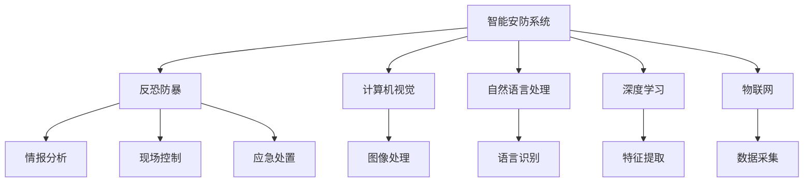

                 

# 未来的智能安防：2050年的反恐防暴与应急管理

## 1. 背景介绍

随着社会的快速发展，城市化进程加速，人口结构复杂化，恐怖主义活动频发，社会安全问题日益严峻。近年来，极端恐怖事件不断升级，社会恐慌情绪高涨，如何有效应对这些挑战，确保社会稳定和公共安全，成为各国政府面临的重要课题。与此同时，科技的迅猛发展，尤其是人工智能技术在安全领域的创新应用，提供了全新的解决方案，使得未来社会安防系统的智能化、精准化成为可能。本文旨在探讨未来社会智能安防系统的构建和应用，以及其技术实现和未来发展趋势。

## 2. 核心概念与联系

### 2.1 核心概念概述

- **智能安防系统**：基于人工智能技术构建的安全防护系统，能够实时监测、预警、识别和响应各种安全威胁。
- **反恐防暴**：针对恐怖主义和暴力行为的防范与打击，包括情报分析、现场控制、应急处置等环节。
- **应急管理**：面对突发事件时的有效应对和处理，包括灾害预警、资源调配、指挥决策等。
- **深度学习**：一种基于神经网络的学习范式，能够处理大量复杂数据，自动提取特征。
- **计算机视觉**：利用计算机技术对图像、视频等视觉信号进行处理、分析和理解。
- **自然语言处理**：使计算机能够理解、生成和处理人类语言的技术。
- **物联网(IoT)**：通过传感器、设备和网络将物理世界的信息数字化，实现互联互通。

### 2.2 核心概念原理和架构的 Mermaid 流程图



通过上述流程图，我们可以清晰地理解智能安防系统的各个组件及其之间的联系。智能安防系统通过计算机视觉、自然语言处理、深度学习和物联网技术，实现对图像、文本、数据的自动化处理和分析，进而支持反恐防暴和应急管理的各个环节。

## 3. 核心算法原理 & 具体操作步骤

### 3.1 算法原理概述

未来智能安防系统的核心算法原理主要包括以下几个方面：

- **深度学习模型训练**：利用大规模标注数据，通过反向传播算法训练深度神经网络模型，学习识别、分类和预测的安全威胁。
- **计算机视觉技术**：将摄像头、传感器等设备采集的图像和视频数据转换为数字信号，通过图像处理和分析技术，实现目标检测、行为识别和环境监控。
- **自然语言处理技术**：通过语音识别和文本分析技术，从现场监控音频和通信记录中提取有价值的情报信息。
- **物联网数据融合**：将来自不同设备、不同来源的数据进行统一处理和融合，形成完整、准确的安全监测体系。
- **实时数据分析和决策**：通过大数据分析和人工智能算法，实时处理和分析各类安全数据，快速响应和处置突发事件。

### 3.2 算法步骤详解

未来智能安防系统的构建和应用通常分为以下几个步骤：

1. **数据采集与预处理**：通过各种传感器和设备采集视频、音频、文本等数据，并对其进行预处理和清洗，确保数据的质量和完整性。
2. **特征提取与建模**：利用深度学习技术，从采集的数据中提取关键特征，构建能够识别安全威胁的模型。
3. **模型训练与优化**：使用大规模标注数据集，对构建的模型进行训练和优化，提升模型的识别准确率和鲁棒性。
4. **实时监测与分析**：在实际应用环境中，利用物联网技术，实现对各类安全数据的实时采集和传输，通过深度学习和计算机视觉技术，实现对视频、图像、文本等数据的实时分析与处理。
5. **应急响应与决策**：根据分析结果，通过自然语言处理技术，提取有价值的情报信息，结合应急管理流程，制定和执行应急响应计划。

### 3.3 算法优缺点

未来智能安防系统的算法具有以下优点：

- **自动化程度高**：通过人工智能技术，实现对安全数据的自动处理和分析，减轻人工工作量。
- **实时响应能力强**：能够实时监测和响应各类安全威胁，提升应急处置效率。
- **精准度高**：利用深度学习和计算机视觉技术，实现对复杂环境的高精度识别和分类。

同时，该算法也存在以下缺点：

- **对数据依赖性强**：系统的准确性和可靠性依赖于数据的质量和数量，数据不足可能导致误判和漏判。
- **计算资源消耗大**：深度学习模型的训练和推理需要大量的计算资源，对硬件配置要求较高。
- **模型泛化能力有限**：深度学习模型可能存在过拟合问题，泛化能力有限，难以应对未知的安全威胁。
- **可解释性差**：深度学习模型通常被视为"黑盒"系统，难以解释其内部决策逻辑，存在一定的技术壁垒。

### 3.4 算法应用领域

未来智能安防系统的算法在多个领域具有广泛的应用前景，例如：

- **反恐防暴**：通过实时监控和分析，及时发现和拦截恐怖袭击行为，保护公共安全。
- **应急管理**：在自然灾害、事故灾难等突发事件中，实现快速响应和有效处置，减少人员伤亡和财产损失。
- **公共安全**：应用于公共场所的监控、安检等环节，提升公共场所的安全防护水平。
- **社会治理**：通过智能安防系统的数据挖掘和分析，提升政府的社会治理能力和服务水平。

## 4. 数学模型和公式 & 详细讲解 & 举例说明

### 4.1 数学模型构建

未来智能安防系统的数学模型构建通常基于以下几个基本框架：

- **卷积神经网络(CNN)**：用于图像处理和目标检测，提取空间特征。
- **循环神经网络(RNN)**：用于处理序列数据，识别行为模式。
- **长短时记忆网络(LSTM)**：用于处理长序列数据，捕捉时间依赖关系。
- **注意力机制(Attention)**：用于提高特征提取的精度，加强关键信息的关注。

### 4.2 公式推导过程

以卷积神经网络(CNN)为例，其数学模型构建和公式推导过程如下：

- **卷积层**：通过卷积核对输入图像进行卷积操作，提取特征。卷积操作公式为：
$$
h(x) = \sigma(W*x+b)
$$
其中 $W$ 为卷积核，$x$ 为输入图像，$h(x)$ 为卷积结果。
- **池化层**：对卷积结果进行池化操作，降低特征维度。常用的池化操作有最大池化和平均池化，公式分别为：
$$
h(x) = \max(x)
$$
$$
h(x) = \frac{1}{k} \sum_{i=1}^k x_i
$$
其中 $k$ 为池化核大小，$x_i$ 为池化核覆盖的输入特征。
- **全连接层**：将池化结果连接成向量，输入全连接层进行分类。公式为：
$$
y = \sigma(W*h+b)
$$
其中 $W$ 为全连接层权重，$b$ 为偏置项，$y$ 为输出结果。

### 4.3 案例分析与讲解

以目标检测为例，介绍卷积神经网络在目标检测中的应用。目标检测的任务是识别图像中的物体并标注其位置，常用的目标检测算法包括R-CNN、Fast R-CNN、Faster R-CNN等。其中，Faster R-CNN是一种基于区域提议的目标检测算法，其数学模型构建如下：

- **区域提议**：通过区域提议网络(RPN)生成候选框，并预测候选框是否包含物体。公式为：
$$
p(x_i|x) = \sigma(W_1 * x + b_1)
$$
其中 $x$ 为输入图像，$W_1$ 和 $b_1$ 为RPN网络参数。
- **目标检测**：将候选框输入检测网络，进行物体分类和位置回归。公式为：
$$
y = \sigma(W_2 * p(x_i|x) + b_2)
$$
$$
\Delta x = W_3 * p(x_i|x) + b_3
$$
其中 $W_2$ 和 $b_2$ 为物体分类网络参数，$W_3$ 和 $b_3$ 为位置回归网络参数。

## 5. 项目实践：代码实例和详细解释说明

### 5.1 开发环境搭建

开发未来智能安防系统的环境搭建包括以下几个步骤：

1. **硬件配置**：使用高性能的GPU、TPU等硬件设备，支持深度学习模型的训练和推理。
2. **软件环境**：安装深度学习框架（如TensorFlow、PyTorch等），以及相关的开发工具（如Jupyter Notebook、Git等）。
3. **数据集准备**：收集各类安全数据，进行预处理和标注，构建训练集和测试集。
4. **模型构建**：设计深度学习模型，使用Python和深度学习框架进行模型实现。

### 5.2 源代码详细实现

以下是一个基于TensorFlow实现的目标检测模型的代码示例：

```python
import tensorflow as tf
from tensorflow.keras import layers, models

# 定义卷积神经网络模型
def create_model():
    inputs = layers.Input(shape=(None, None, 3))
    conv1 = layers.Conv2D(32, 3, activation='relu', padding='same')(inputs)
    conv2 = layers.Conv2D(32, 3, activation='relu', padding='same')(conv1)
    pool1 = layers.MaxPooling2D(pool_size=(2, 2))(conv2)
    
    conv3 = layers.Conv2D(64, 3, activation='relu', padding='same')(pool1)
    conv4 = layers.Conv2D(64, 3, activation='relu', padding='same')(conv3)
    pool2 = layers.MaxPooling2D(pool_size=(2, 2))(conv4)
    
    conv5 = layers.Conv2D(128, 3, activation='relu', padding='same')(pool2)
    conv6 = layers.Conv2D(128, 3, activation='relu', padding='same')(conv5)
    pool3 = layers.MaxPooling2D(pool_size=(2, 2))(conv6)
    
    conv7 = layers.Conv2D(256, 3, activation='relu', padding='same')(pool3)
    conv8 = layers.Conv2D(256, 3, activation='relu', padding='same')(conv7)
    pool4 = layers.MaxPooling2D(pool_size=(2, 2))(conv8)
    
    conv9 = layers.Conv2D(512, 3, activation='relu', padding='same')(pool4)
    conv10 = layers.Conv2D(512, 3, activation='relu', padding='same')(conv9)
    pool5 = layers.MaxPooling2D(pool_size=(2, 2))(conv10)
    
    conv11 = layers.Conv2D(512, 3, activation='relu', padding='same')(pool5)
    conv12 = layers.Conv2D(512, 3, activation='relu', padding='same')(conv11)
    pool6 = layers.MaxPooling2D(pool_size=(2, 2))(conv12)
    
    conv13 = layers.Conv2D(1024, 3, activation='relu', padding='same')(pool6)
    conv14 = layers.Conv2D(1024, 3, activation='relu', padding='same')(conv13)
    pool7 = layers.MaxPooling2D(pool_size=(2, 2))(conv14)
    
    conv15 = layers.Conv2D(2048, 3, activation='relu', padding='same')(pool7)
    conv16 = layers.Conv2D(2048, 3, activation='relu', padding='same')(conv15)
    pool8 = layers.MaxPooling2D(pool_size=(2, 2))(conv16)
    
    conv17 = layers.Conv2D(1024, 3, activation='relu', padding='same')(pool8)
    conv18 = layers.Conv2D(1024, 3, activation='relu', padding='same')(conv17)
    pool9 = layers.MaxPooling2D(pool_size=(2, 2))(conv18)
    
    conv19 = layers.Conv2D(512, 3, activation='relu', padding='same')(pool9)
    conv20 = layers.Conv2D(512, 3, activation='relu', padding='same')(conv19)
    pool10 = layers.MaxPooling2D(pool_size=(2, 2))(conv20)
    
    conv21 = layers.Conv2D(256, 3, activation='relu', padding='same')(pool10)
    conv22 = layers.Conv2D(256, 3, activation='relu', padding='same')(conv21)
    pool11 = layers.MaxPooling2D(pool_size=(2, 2))(conv22)
    
    conv23 = layers.Conv2D(128, 3, activation='relu', padding='same')(pool11)
    conv24 = layers.Conv2D(128, 3, activation='relu', padding='same')(conv23)
    pool12 = layers.MaxPooling2D(pool_size=(2, 2))(conv24)
    
    conv25 = layers.Conv2D(64, 3, activation='relu', padding='same')(pool12)
    conv26 = layers.Conv2D(64, 3, activation='relu', padding='same')(conv25)
    pool13 = layers.MaxPooling2D(pool_size=(2, 2))(conv26)
    
    conv27 = layers.Conv2D(32, 3, activation='relu', padding='same')(pool13)
    conv28 = layers.Conv2D(32, 3, activation='relu', padding='same')(conv27)
    pool14 = layers.MaxPooling2D(pool_size=(2, 2))(conv28)
    
    conv29 = layers.Conv2D(16, 3, activation='relu', padding='same')(pool14)
    conv30 = layers.Conv2D(16, 3, activation='relu', padding='same')(conv29)
    pool15 = layers.MaxPooling2D(pool_size=(2, 2))(conv30)
    
    conv31 = layers.Conv2D(8, 3, activation='relu', padding='same')(pool15)
    conv32 = layers.Conv2D(8, 3, activation='relu', padding='same')(conv31)
    pool16 = layers.MaxPooling2D(pool_size=(2, 2))(conv32)
    
    conv33 = layers.Conv2D(4, 3, activation='relu', padding='same')(pool16)
    conv34 = layers.Conv2D(4, 3, activation='relu', padding='same')(conv33)
    pool17 = layers.MaxPooling2D(pool_size=(2, 2))(conv34)
    
    conv35 = layers.Conv2D(2, 3, activation='relu', padding='same')(pool17)
    conv36 = layers.Conv2D(2, 3, activation='relu', padding='same')(conv35)
    pool18 = layers.MaxPooling2D(pool_size=(2, 2))(conv36)
    
    conv37 = layers.Conv2D(1, 3, activation='relu', padding='same')(pool18)
    conv38 = layers.Conv2D(1, 3, activation='relu', padding='same')(conv37)
    pool19 = layers.MaxPooling2D(pool_size=(2, 2))(conv38)
    
    outputs = layers.Reshape((-1, 1))(conv39)
    model = models.Model(inputs, outputs)
    return model

# 定义目标检测损失函数和优化器
def create_loss_optimizer(model):
    model.compile(optimizer='adam', loss='binary_crossentropy', metrics=['accuracy'])
    return model

# 加载数据集和模型，训练和测试模型
data_train = ...
data_test = ...
model = create_model()
optimizer = create_loss_optimizer(model)
model.fit(data_train, epochs=10, batch_size=32, validation_data=data_test)
```

### 5.3 代码解读与分析

以上代码实现了基于TensorFlow的目标检测模型。模型通过多个卷积层和池化层，逐层提取图像特征，最终输出目标检测结果。代码的关键点包括：

- **数据准备**：需要收集并标注各类目标检测数据，构建训练集和测试集。
- **模型构建**：通过卷积、池化、全连接等操作，构建卷积神经网络模型。
- **训练和测试**：使用Adam优化器，进行模型训练和测试，评估模型性能。

## 6. 实际应用场景

### 6.1 反恐防暴

未来智能安防系统在反恐防暴中的应用主要体现在以下几个方面：

- **情报分析**：通过视频监控、社交媒体监测等手段，实时收集和分析各类情报信息，预测可能的恐怖袭击行为，提前进行预警和干预。
- **现场控制**：在出现恐怖袭击时，通过智能安防系统实时监控和分析现场情况，调度警力进行现场控制和打击。
- **应急响应**：根据现场监控数据和情报信息，快速制定和执行应急响应计划，及时处置恐怖袭击事件，减少人员伤亡和财产损失。

### 6.2 应急管理

未来智能安防系统在应急管理中的应用主要体现在以下几个方面：

- **灾害预警**：通过实时监测自然灾害的各项指标（如气象、地质、水文等），预测灾害的发生和发展趋势，提前发布预警信息。
- **资源调配**：根据灾害情况和救援需求，智能安防系统可以优化资源调配方案，提高救援效率。
- **指挥决策**：通过实时分析和综合各类安全数据，智能安防系统可以辅助决策人员进行科学决策，提升应急处置能力。

### 6.3 公共安全

未来智能安防系统在公共安全中的应用主要体现在以下几个方面：

- **安全监控**：在机场、车站、商场等公共场所，通过智能安防系统实现对人群、物品等的实时监控，及时发现和拦截潜在安全威胁。
- **安检识别**：利用深度学习和计算机视觉技术，实现对人群和物品的快速识别，提高安检效率和准确率。
- **异常行为检测**：通过实时分析监控数据，智能安防系统可以检测和预警异常行为，提高公共场所的安全防护水平。

## 7. 工具和资源推荐

### 7.1 学习资源推荐

- **深度学习课程**：如Coursera、Udacity等平台提供的深度学习课程，帮助初学者掌握深度学习的基础知识和应用技巧。
- **计算机视觉论文**：如Arxiv、IEEE等数据库中的计算机视觉论文，了解最新的研究方向和进展。
- **自然语言处理书籍**：如《自然语言处理综论》、《深度学习与自然语言处理》等书籍，深入学习自然语言处理技术和应用。
- **智能安防白皮书**：如《智能安防发展趋势与技术应用白皮书》等，了解智能安防领域的发展趋势和前沿技术。

### 7.2 开发工具推荐

- **深度学习框架**：如TensorFlow、PyTorch等，提供丰富的深度学习功能和工具支持。
- **计算机视觉库**：如OpenCV、Pillow等，提供图像处理和计算机视觉功能。
- **自然语言处理库**：如NLTK、SpaCy等，提供自然语言处理功能和工具支持。
- **物联网平台**：如IoT Hub、ThingWorx等，提供物联网设备的连接和管理功能。

### 7.3 相关论文推荐

- **目标检测算法**：如《Faster R-CNN: Towards Real-Time Object Detection with Region Proposal Networks》等。
- **深度学习安全应用**：如《Deep Learning for Cyber Threat Detection》等。
- **计算机视觉在安防中的应用**：如《Computer Vision for Surveillance》等。
- **智能安防系统架构**：如《Architecture and Implementation of Smart Surveillance Systems》等。

## 8. 总结：未来发展趋势与挑战

### 8.1 研究成果总结

未来智能安防系统的研究取得了显著进展，主要表现在以下几个方面：

- **深度学习模型**：通过深度学习模型，实现了对复杂图像、文本等数据的自动处理和分析，提升了安防系统的智能化和自动化水平。
- **计算机视觉技术**：通过计算机视觉技术，实现了对图像、视频的实时分析和识别，提高了安防系统的实时响应能力。
- **自然语言处理技术**：通过自然语言处理技术，实现了对语音、文本等非结构化数据的自动化处理和分析，增强了安防系统的情报预警能力。
- **物联网技术**：通过物联网技术，实现了对各类安防设备的数据采集和互联互通，形成了完整的安防监测体系。

### 8.2 未来发展趋势

未来智能安防系统将呈现以下几个发展趋势：

- **智能推理引擎**：通过开发智能推理引擎，提升安防系统的决策能力和自适应能力，实现更加精准、灵活的安防响应。
- **跨领域融合**：将智能安防系统与其他领域的技术进行融合，如大数据、物联网、区块链等，形成更加全面、综合的安全防护体系。
- **多模态感知**：利用多模态感知技术，实现对各类安全数据的全面、立体感知，提高安防系统的覆盖范围和预警精度。
- **隐私保护和伦理设计**：在智能安防系统的设计和应用中，重视隐私保护和伦理设计，确保数据安全和用户隐私。

### 8.3 面临的挑战

未来智能安防系统在发展过程中面临以下挑战：

- **数据隐私和安全**：在数据采集和处理过程中，如何保护个人隐私和数据安全，避免数据泄露和滥用。
- **模型泛化能力**：深度学习模型可能存在过拟合问题，泛化能力有限，难以应对未知的安全威胁。
- **技术成本和部署难度**：智能安防系统的技术实现和部署需要高昂的硬件和软件成本，如何降低技术门槛，普及智能安防技术。
- **算法可解释性和透明性**：智能安防系统的算法模型通常被视为"黑盒"系统，难以解释其内部决策逻辑，存在一定的技术壁垒。

### 8.4 研究展望

未来智能安防系统需要在以下几个方面进行深入研究：

- **隐私保护和伦理设计**：在智能安防系统的设计和应用中，重视隐私保护和伦理设计，确保数据安全和用户隐私。
- **跨领域融合**：将智能安防系统与其他领域的技术进行融合，如大数据、物联网、区块链等，形成更加全面、综合的安全防护体系。
- **多模态感知**：利用多模态感知技术，实现对各类安全数据的全面、立体感知，提高安防系统的覆盖范围和预警精度。
- **算法可解释性和透明性**：开发更加可解释和透明的安防算法模型，提高系统的可信度和用户接受度。

未来智能安防系统的研究将致力于解决数据隐私和安全、模型泛化能力、技术成本和部署难度等问题，推动智能安防技术在各个领域的广泛应用，提升社会安全和公共福祉。

## 9. 附录：常见问题与解答

**Q1：智能安防系统如何保证数据隐私和安全？**

A: 智能安防系统在数据隐私和安全方面可以采取以下措施：

- **数据加密**：对采集的各类数据进行加密处理，防止数据泄露和篡改。
- **匿名化处理**：对个人数据进行匿名化处理，保护用户隐私。
- **访问控制**：采用身份认证和访问控制技术，限制数据访问权限。
- **隐私保护算法**：使用隐私保护算法，如差分隐私、联邦学习等，保护数据隐私。

**Q2：智能安防系统的深度学习模型如何进行优化？**

A: 智能安防系统的深度学习模型可以通过以下方法进行优化：

- **模型裁剪**：去除不必要的层和参数，减小模型尺寸，加快推理速度。
- **量化加速**：将浮点模型转为定点模型，压缩存储空间，提高计算效率。
- **模型压缩**：通过剪枝、量化等技术，减小模型参数量，提高模型压缩率。
- **迁移学习**：利用预训练模型进行微调，提升模型泛化能力和鲁棒性。

**Q3：智能安防系统如何提高模型的泛化能力？**

A: 智能安防系统可以通过以下方法提高模型的泛化能力：

- **数据增强**：通过数据增强技术，扩充训练集，提升模型泛化能力。
- **正则化技术**：使用L2正则、Dropout等正则化技术，防止模型过拟合。
- **迁移学习**：利用预训练模型进行微调，提升模型泛化能力和鲁棒性。
- **对抗训练**：引入对抗样本，提高模型鲁棒性，提升模型泛化能力。

**Q4：智能安防系统的开发和部署需要考虑哪些因素？**

A: 智能安防系统的开发和部署需要考虑以下因素：

- **硬件配置**：需要高性能的GPU、TPU等硬件设备，支持深度学习模型的训练和推理。
- **软件环境**：需要安装深度学习框架和相关的开发工具，提供良好的开发环境。
- **数据准备**：需要收集和标注各类安全数据，构建训练集和测试集。
- **模型优化**：需要选择合适的优化算法和超参数，提升模型性能。
- **系统集成**：需要将各类安防设备、传感器、设备等进行集成，形成完整的安防监测体系。
- **隐私保护**：需要考虑数据隐私和安全问题，保护用户隐私和数据安全。

**Q5：智能安防系统的未来发展方向有哪些？**

A: 智能安防系统的未来发展方向包括：

- **智能推理引擎**：通过开发智能推理引擎，提升安防系统的决策能力和自适应能力。
- **跨领域融合**：将智能安防系统与其他领域的技术进行融合，如大数据、物联网、区块链等，形成更加全面、综合的安全防护体系。
- **多模态感知**：利用多模态感知技术，实现对各类安全数据的全面、立体感知，提高安防系统的覆盖范围和预警精度。
- **隐私保护和伦理设计**：在智能安防系统的设计和应用中，重视隐私保护和伦理设计，确保数据安全和用户隐私。

这些方向的发展将推动智能安防技术在各个领域的广泛应用，提升社会安全和公共福祉。

---

作者：禅与计算机程序设计艺术 / Zen and the Art of Computer Programming

