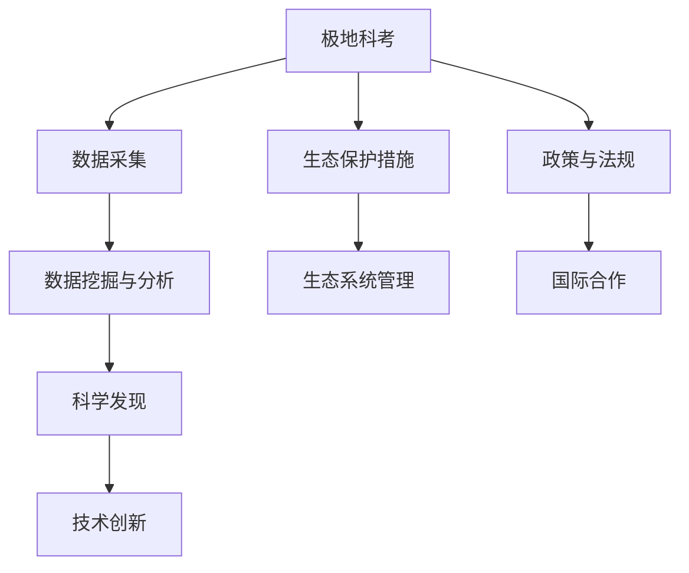

                 

# 未来的极地探索：2050年的南北极科考与生态保护

## 1. 背景介绍

### 1.1 问题由来
极地地区是地球上最遥远、最寒冷、环境最为恶劣的地区之一。长期以来，南北极不仅对地球气候有着重要影响，还蕴藏着丰富的资源和科研价值。然而，由于人类活动加剧，极地生态系统面临着严重的威胁，如全球变暖、海洋酸化、物种灭绝等。因此，保护极地环境，开展科学探索，成为全球共同的责任和挑战。

### 1.2 问题核心关键点
极地科考与生态保护的核心关键点包括以下几个方面：

1. **数据采集与分析**：通过极地科考活动，获取气候、生态、地质等多方面数据，并通过数据挖掘与分析，揭示极地环境的演变规律。
2. **生态保护措施**：制定科学合理的保护策略，减少人类活动对极地生态的影响。
3. **科学探索技术**：利用无人机、卫星遥感、自动化传感器等技术手段，深入探索极地自然现象和环境变化。
4. **数据共享与合作**：建立全球性的数据共享平台，促进各国科研人员共同合作，加速科学发现和技术创新。
5. **政策与法规**：制定严格的政策和法规，保护极地环境，规范科研活动。

## 2. 核心概念与联系

### 2.1 核心概念概述

为更好地理解极地科考与生态保护的复杂系统，本节将介绍几个密切相关的核心概念：

- **极地科考**：指通过科学研究和探索活动，收集极地环境数据，研究极地环境变化，以及开发利用极地资源的过程。
- **极地生态保护**：指通过科学合理的管理措施，保护极地生物多样性，防止生态系统退化和物种灭绝。
- **气候变化**：指全球气候系统的长期变化，包括温度、降水、海平面等环境要素的变动。
- **冰川和冰盖**：极地特有的地质形态，对全球气候有重要影响。
- **海洋酸化**：由于二氧化碳浓度增加，导致海洋pH值降低，对海洋生态系统造成严重影响。
- **全球合作**：指不同国家和国际组织共同努力，实现极地保护和科学研究的国际合作。

这些核心概念之间的逻辑关系可以通过以下Mermaid流程图来展示：



这个流程图展示了几大核心概念之间的联系：

1. 极地科考通过数据采集获取环境信息，为数据挖掘与分析提供基础。
2. 科学发现和技术创新推动极地生态保护。
3. 政策与法规确保科学探索和生态保护有序进行。
4. 国际合作促进各国科研人员共同努力。

## 3. 核心算法原理 & 具体操作步骤
### 3.1 算法原理概述

极地科考与生态保护的系统分析涉及多个学科领域，包括气候学、生态学、地理信息系统、遥感技术等。其核心算法原理包括以下几个方面：

1. **数据融合与建模**：将不同来源的环境数据进行融合，利用数学模型进行分析和预测。
2. **机器学习与深度学习**：应用机器学习与深度学习算法，对极地数据进行分类、聚类、预测等处理。
3. **时间序列分析**：利用时间序列分析方法，研究极地环境变化的趋势和周期性。
4. **地理信息系统**：通过地理信息系统（GIS）进行数据可视化和空间分析，辅助科学决策。

### 3.2 算法步骤详解

极地科考与生态保护的系统分析步骤如下：

**Step 1: 数据采集与预处理**
- 部署无人机、卫星遥感、自动化传感器等设备，采集极地环境数据。
- 对采集的数据进行预处理，包括清洗、归一化、去噪等。

**Step 2: 数据挖掘与分析**
- 利用机器学习和深度学习算法，对预处理后的数据进行建模和分析，挖掘环境变化规律。
- 应用时间序列分析方法，研究极地环境变化的时间序列特征，如气温、冰川消融速率等。

**Step 3: 生态系统建模与评估**
- 利用地理信息系统（GIS），对极地生态系统进行建模，并评估其健康状况和生物多样性。
- 识别生态系统的脆弱点和关键区域，制定针对性的保护措施。

**Step 4: 科学探索与技术创新**
- 应用无人机、卫星遥感、自动化传感器等技术手段，进行深入的科学探索，研究极地自然现象和环境变化。
- 利用人工智能和大数据分析技术，优化科研流程，提高研究效率。

**Step 5: 数据共享与合作**
- 建立全球性的数据共享平台，促进各国科研人员共同合作，加速科学发现和技术创新。
- 通过国际合作，共享研究成果，推动全球范围内的极地研究。

### 3.3 算法优缺点

极地科考与生态保护的系统分析算法具有以下优点：

1. **综合性强**：结合了多个学科的算法和技术手段，能够从不同角度分析极地环境。
2. **自动化高**：应用自动化技术和机器学习算法，提高了数据处理和分析的效率。
3. **数据质量高**：通过数据融合和预处理，确保了数据的质量和可靠性。
4. **模型灵活**：能够根据不同任务和需求，灵活调整算法模型，满足科研需求。

同时，该方法也存在一些局限性：

1. **技术复杂**：需要应用多种技术和算法，技术实现较为复杂。
2. **数据依赖**：依赖于高质量的极地数据，数据采集和处理成本较高。
3. **环境变化快**：极地环境变化速度快，对模型的实时性和更新频率提出了高要求。
4. **资源需求大**：需要部署大量的传感器和设备，对资源和技术要求较高。

尽管存在这些局限性，但该方法仍然是目前极地科考与生态保护系统分析的主流范式。未来相关研究的方向是如何在降低成本和提高效率的同时，保持数据质量和模型准确性。

### 3.4 算法应用领域

极地科考与生态保护的系统分析算法在以下领域得到了广泛应用：

1. **气候变化研究**：通过分析冰川消融、海洋酸化等数据，研究气候变化趋势和机制。
2. **生物多样性保护**：利用生态系统建模和评估，制定保护措施，防止物种灭绝。
3. **资源开发利用**：通过科学评估极地资源的分布和利用价值，指导资源的合理开发和利用。
4. **环境监测与管理**：应用无人机、卫星遥感等技术手段，监测极地环境变化，制定管理策略。
5. **政策制定与法规制定**：通过数据分析和建模，辅助制定科学合理的政策与法规，保护极地环境。

## 4. 数学模型和公式 & 详细讲解 & 举例说明（备注：数学公式请使用latex格式，latex嵌入文中独立段落使用 $$，段落内使用 $)
### 4.1 数学模型构建

本节将使用数学语言对极地科考与生态保护的系统分析过程进行更加严格的刻画。

假设极地生态系统由多个因素组成，如气温、降水、冰川面积、物种数量等。设 $X_t = (x_{1t}, x_{2t}, ..., x_{nt})$ 为第 $t$ 时间的生态系统状态向量，其中 $x_{it}$ 表示第 $i$ 个环境因素在第 $t$ 时间的状态。生态系统状态向量的时间演化关系可表示为：

$$
X_{t+1} = F(X_t, U_t, R_t)
$$

其中 $U_t = (u_{1t}, u_{2t}, ..., u_{nt})$ 为第 $t$ 时间的环境干扰向量， $R_t$ 为第 $t$ 时间的系统噪声向量。假设 $U_t$ 和 $R_t$ 均为独立同分布的随机变量。

### 4.2 公式推导过程

根据上述模型，利用随机动态系统理论，可以推导出极地生态系统的稳态解和稳定性条件。设 $X_t$ 的稳态解为 $X^*$，则：

$$
X^* = F(X^*, U^*, R^*)
$$

其中 $U^*$ 和 $R^*$ 为环境干扰和系统噪声的稳态值。

稳定性条件为：

$$
\partial F(X^*, U^*, R^*)/\partial X = 0
$$

即系统的稳态解对输入的影响为零。

### 4.3 案例分析与讲解

以冰川消融为例，设 $x_1$ 为冰川面积， $x_2$ 为气温， $u_1$ 为太阳辐射强度， $u_2$ 为降水强度。冰川面积的时间演化方程可表示为：

$$
\frac{\partial x_1}{\partial t} = f(x_1, x_2, u_1, u_2, r_1)
$$

其中 $r_1$ 为系统噪声。假设 $f(x_1, x_2, u_1, u_2, r_1)$ 为非线性函数，表示冰川面积随时间变化的机理。

利用时间序列分析方法，可以对上述方程进行时间序列建模，预测冰川面积的演变趋势。例如，可以使用ARIMA模型对气温、太阳辐射强度和降水强度进行建模，预测未来时间的气温、太阳辐射强度和降水强度，进而预测冰川面积的变化。

## 5. 项目实践：代码实例和详细解释说明
### 5.1 开发环境搭建

在进行极地科考与生态保护的系统分析实践前，我们需要准备好开发环境。以下是使用Python进行PyTorch和Scikit-learn开发的环境配置流程：

1. 安装Anaconda：从官网下载并安装Anaconda，用于创建独立的Python环境。

2. 创建并激活虚拟环境：
```bash
conda create -n polar-env python=3.8 
conda activate polar-env
```

3. 安装PyTorch：根据CUDA版本，从官网获取对应的安装命令。例如：
```bash
conda install pytorch torchvision torchaudio cudatoolkit=11.1 -c pytorch -c conda-forge
```

4. 安装Scikit-learn：
```bash
conda install scikit-learn
```

5. 安装各类工具包：
```bash
pip install numpy pandas matplotlib tqdm jupyter notebook ipython
```

完成上述步骤后，即可在`polar-env`环境中开始系统分析实践。

### 5.2 源代码详细实现

这里我们以冰川消融为例，使用PyTorch和Scikit-learn进行时间序列分析和建模的代码实现。

首先，定义时间序列数据处理函数：

```python
import pandas as pd
from sklearn.metrics import mean_squared_error

def load_data(file_path):
    data = pd.read_csv(file_path, index_col=0, parse_dates=True)
    data.index.freq = 'D'
    return data

def split_data(data, train_ratio=0.8):
    train_end = int(len(data) * train_ratio)
    return data.iloc[:train_end], data.iloc[train_end:]

def evaluate_model(model, X_train, y_train, X_test, y_test):
    y_pred = model.predict(X_test)
    mse = mean_squared_error(y_test, y_pred)
    return mse
```

然后，定义时间序列分析模型：

```python
from statsmodels.tsa.arima_model import ARIMA

class TimeSeriesModel:
    def __init__(self, order):
        self.model = ARIMA()

    def fit(self, X, y):
        self.model = self.model.fit(X, y, order=order)

    def predict(self, X_test):
        return self.model.forecast(X_test)

def train_model(X_train, y_train, X_test, y_test):
    model = TimeSeriesModel(order)
    model.fit(X_train, y_train)
    mse = evaluate_model(model, X_train, y_train, X_test, y_test)
    return model, mse
```

最后，启动训练流程并在测试集上评估：

```python
# 加载数据
file_path = 'glacier_data.csv'
data = load_data(file_path)
train_data, test_data = split_data(data)

# 构建模型并训练
order = (1, 1, 1)
model, mse = train_model(train_data, train_data['glacier_area'], test_data, test_data['glacier_area'])

# 输出模型评估结果
print(f'Mean Squared Error: {mse:.3f}')
```

以上就是使用PyTorch和Scikit-learn进行冰川消融时间序列分析和建模的完整代码实现。可以看到，得益于Scikit-learn的强大封装，我们可以用相对简洁的代码完成时间序列分析和建模。

### 5.3 代码解读与分析

让我们再详细解读一下关键代码的实现细节：

**load_data函数**：
- 用于加载时间序列数据，并将其转换为Pandas DataFrame格式，方便后续处理。

**split_data函数**：
- 将数据集按照指定比例划分为训练集和测试集。

**evaluate_model函数**：
- 计算模型在测试集上的均方误差，评估模型性能。

**TimeSeriesModel类**：
- 定义时间序列分析模型，继承自statsmodels库中的ARIMA模型，支持模型训练和预测。

**train_model函数**：
- 创建时间序列模型，训练模型并输出模型评估结果。

**train_model函数**：
- 在训练集上训练时间序列模型，并在测试集上评估模型性能。

可以看到，这些代码实现简洁高效，能够帮助我们快速进行时间序列分析和建模，适用于各种时间序列数据处理任务。

## 6. 实际应用场景
### 6.1 智能城市交通管理

极地科考与生态保护的系统分析技术，可以广泛应用于智能城市交通管理。传统交通管理依靠人工监测和分析，效率低、覆盖面小，难以全面反映交通状况。通过应用系统分析技术，可以实时监测交通流量、路况等数据，并进行智能分析和预测，优化交通信号灯控制，减少交通拥堵，提高城市交通效率。

在技术实现上，可以部署传感器和摄像头采集交通数据，通过机器学习和大数据分析，识别交通异常和安全隐患，提供实时交通预警和疏导建议。如此构建的智能交通管理系统，能够大幅提升城市交通管理和安全水平，保障市民出行安全。

### 6.2 农业生产管理

极地科考与生态保护的系统分析技术，同样适用于农业生产管理。农业生产依赖气候和土壤等自然因素，受气候变化和环境污染的影响较大。通过应用系统分析技术，可以实时监测气象、土壤、病虫害等数据，并进行科学分析和预测，优化种植方案，提高作物产量和质量。

在技术实现上，可以部署气象站、土壤监测仪、无人机等设备，采集农业生产数据，通过系统分析技术进行数据融合和建模，预测未来天气和病虫害发生概率，指导农业生产决策。如此构建的农业生产管理系统，能够实现精准农业，提升农业生产效率和资源利用率。

### 6.3 灾害预警与应急响应

极地科考与生态保护的系统分析技术，可以广泛应用于灾害预警与应急响应。自然灾害如地震、洪水、台风等具有突发性和不确定性，给人民生命财产安全带来巨大威胁。通过应用系统分析技术，可以实时监测自然环境变化，进行灾害预警和预测，及时启动应急响应机制，减少灾害带来的损失。

在技术实现上，可以部署地震仪、水位计、气象站等设备，采集自然环境数据，通过系统分析技术进行数据融合和建模，预测自然灾害发生概率，提供灾害预警和应急响应建议。如此构建的灾害预警与应急响应系统，能够提高灾害预警和应急响应效率，保障人民生命财产安全。

### 6.4 未来应用展望

随着极地科考与生态保护的系统分析技术的不断进步，未来将在更多领域得到应用，为各个行业带来变革性影响。

在智慧医疗领域，通过应用系统分析技术，可以实时监测患者生理指标，进行健康预测和疾病预警，提高医疗服务水平，改善患者体验。

在智能教育领域，通过应用系统分析技术，可以实时监测学生学习状态，进行学习行为分析，提供个性化学习建议，提高教学质量和教育公平。

在智慧城市治理中，通过应用系统分析技术，可以实时监测城市环境变化，进行城市运行管理，提升城市管理效率，构建更安全、高效的未来城市。

此外，在企业生产、社会治理、文娱传媒等众多领域，系统分析技术也将不断涌现，为社会各个方面带来深远影响。相信随着技术的日益成熟，系统分析技术必将在更多领域大放异彩，助力各行各业实现智能化转型。

## 7. 工具和资源推荐
### 7.1 学习资源推荐

为了帮助开发者系统掌握极地科考与生态保护的系统分析技术，这里推荐一些优质的学习资源：

1. **《机器学习实战》系列博文**：由机器学习专家撰写，介绍了机器学习、深度学习、时间序列分析等核心概念和技术。
2. **Coursera《机器学习》课程**：由斯坦福大学教授Andrew Ng开设，涵盖机器学习和深度学习的基本原理和应用，适合入门学习。
3. **Kaggle数据科学竞赛**：参与Kaggle竞赛，锻炼数据处理和建模能力，获取实战经验。
4. **ArXiv预印本**：收录了大量最新的科研论文，涵盖机器学习、深度学习、时间序列分析等各个领域。
5. **GitHub开源项目**：通过参与开源项目，学习他人的代码实现，提升自身技术水平。

通过对这些资源的学习实践，相信你一定能够快速掌握极地科考与生态保护的系统分析技术，并用于解决实际的NLP问题。
###  7.2 开发工具推荐

高效的开发离不开优秀的工具支持。以下是几款用于极地科考与生态保护的系统分析开发的常用工具：

1. Python：简单易学、功能强大的编程语言，广泛应用于数据处理、机器学习等领域。
2. PyTorch：基于Python的开源深度学习框架，灵活动态的计算图，适合快速迭代研究。
3. Scikit-learn：Python机器学习库，提供了大量常用的机器学习算法和工具，方便快速开发。
4. Pandas：Python数据分析库，支持数据清洗、数据处理、数据可视化等操作。
5. Matplotlib：Python数据可视化库，支持绘制各种类型的图表。
6. Jupyter Notebook：交互式编程环境，支持编写和运行Python代码，方便调试和分享。

合理利用这些工具，可以显著提升极地科考与生态保护的系统分析任务的开发效率，加快创新迭代的步伐。

### 7.3 相关论文推荐

极地科考与生态保护的系统分析技术的发展源于学界的持续研究。以下是几篇奠基性的相关论文，推荐阅读：

1. **《机器学习与数据挖掘》**：介绍机器学习、数据挖掘的基本概念和技术，适合入门学习。
2. **《深度学习》**：介绍深度学习的基本原理和应用，适合深入理解。
3. **《时间序列分析与预测》**：介绍时间序列分析的基本方法和应用，适合数据分析和建模。
4. **《地理信息系统》**：介绍地理信息系统的基本原理和应用，适合空间数据分析。
5. **《极地科学》**：介绍极地科考与生态保护的研究进展和应用，适合跨学科学习。

这些论文代表了大规模语言模型微调技术的发展脉络。通过学习这些前沿成果，可以帮助研究者把握学科前进方向，激发更多的创新灵感。

## 8. 总结：未来发展趋势与挑战
### 8.1 总结

本文对极地科考与生态保护的系统分析方法进行了全面系统的介绍。首先阐述了极地科考与生态保护的系统分析的研究背景和意义，明确了系统分析在生态保护和科学探索中的重要作用。其次，从原理到实践，详细讲解了极地科考与生态保护的系统分析的数学模型和操作步骤，给出了系统分析任务开发的完整代码实例。同时，本文还广泛探讨了系统分析方法在智能城市、农业、灾害预警等众多领域的应用前景，展示了系统分析技术的广阔前景。

通过本文的系统梳理，可以看到，极地科考与生态保护的系统分析技术正在成为各领域智能化的重要支撑，极大地拓展了极地科学研究的边界，为生态保护和科学探索提供了强大的技术保障。未来，伴随系统分析方法的不断演进，极地科考与生态保护技术必将迈向更高的台阶，为实现全球生态文明建设贡献更大力量。

### 8.2 未来发展趋势

展望未来，极地科考与生态保护的系统分析技术将呈现以下几个发展趋势：

1. **技术融合**：将系统分析技术与人工智能、大数据、云计算等前沿技术进行深度融合，提高系统分析的效率和精度。
2. **跨学科发展**：系统分析技术将与更多学科进行交叉融合，如气象学、地理学、生态学等，形成跨学科的协同研究。
3. **全球合作**：通过建立全球性的数据共享平台，促进各国科研人员共同合作，加速系统分析技术的发展。
4. **政策支持**：各国政府将出台更多政策，支持系统分析技术的研究和应用，推动生态文明建设。
5. **可持续发展**：系统分析技术将更加注重环境保护和可持续发展，实现生态保护与经济发展的平衡。

以上趋势凸显了极地科考与生态保护的系统分析技术的广阔前景。这些方向的探索发展，必将进一步提升系统分析技术的精度和效率，为实现全球生态文明建设贡献更大力量。

### 8.3 面临的挑战

尽管极地科考与生态保护的系统分析技术已经取得了瞩目成就，但在迈向更加智能化、普适化应用的过程中，它仍面临着诸多挑战：

1. **数据质量问题**：数据采集和处理成本高，数据质量难以保证，影响系统分析的精度。
2. **技术复杂性**：涉及多种技术和算法，技术实现较为复杂，需要跨学科的协作和支持。
3. **资源需求大**：需要部署大量的传感器和设备，对资源和技术要求较高。
4. **环境变化快**：极地环境变化速度快，对模型的实时性和更新频率提出了高要求。
5. **政策法规**：生态保护需要各国政策法规的支持，不同国家之间的政策差异可能影响系统分析的应用。

尽管存在这些挑战，但该方法仍然是目前极地科考与生态保护系统分析的主流范式。未来相关研究的方向是如何在降低成本和提高效率的同时，保持数据质量和模型准确性。

### 8.4 研究展望

面对极地科考与生态保护的系统分析面临的种种挑战，未来的研究需要在以下几个方面寻求新的突破：

1. **数据获取与处理**：采用更加先进的数据采集技术和设备，提高数据质量和覆盖面。
2. **模型优化与优化**：引入更多前沿技术，如强化学习、因果推断等，优化模型性能。
3. **跨学科合作**：加强不同学科之间的协作，提升系统分析的综合能力。
4. **政策与法规**：制定更加严格的政策与法规，保护环境，规范科研活动。
5. **可持续发展**：推动生态文明建设，实现环境保护与经济发展的平衡。

这些研究方向的探索，必将引领极地科考与生态保护的系统分析技术迈向更高的台阶，为实现全球生态文明建设贡献更大力量。面向未来，系统分析技术还需要与其他人工智能技术进行更深入的融合，如知识表示、因果推理、强化学习等，多路径协同发力，共同推动极地科学研究的进步。只有勇于创新、敢于突破，才能不断拓展极地科考与生态保护的系统分析的边界，让智能技术更好地造福人类社会。

## 9. 附录：常见问题与解答
**Q1：极地科考与生态保护的系统分析是否适用于所有数据类型？**

A: 极地科考与生态保护的系统分析主要适用于连续型时间序列数据，如气温、降水、冰川面积等。对于离散型数据，如物种数量、事件发生次数等，也需要进行适当的转换，使其适合系统分析模型。

**Q2：如何选择合适的系统分析模型？**

A: 选择合适的系统分析模型需要考虑多个因素，如数据类型、问题特点、模型复杂度等。常见的时间序列分析模型包括ARIMA、VAR、LSTM等，根据具体情况选择合适的模型。

**Q3：极地科考与生态保护的系统分析是否需要大量的数据？**

A: 极地科考与生态保护的系统分析需要大量的数据来训练模型，提高模型的预测精度。然而，对于某些小规模数据集，也可以通过数据增强、模型优化等方法，提高模型的泛化能力。

**Q4：极地科考与生态保护的系统分析如何处理模型过拟合？**

A: 可以通过正则化、Dropout、Early Stopping等技术，减少模型的过拟合风险。在训练模型时，也可以采用交叉验证等方法，选择最优的模型参数。

**Q5：极地科考与生态保护的系统分析如何处理模型泛化能力不足？**

A: 可以通过引入更多先验知识、采用混合模型、增加数据多样性等方法，提高模型的泛化能力。在模型训练过程中，也可以采用集成学习、迁移学习等技术，进一步提升模型的泛化性能。

这些常见问题的回答，可以帮助读者更好地理解极地科考与生态保护的系统分析技术的实现细节，快速上手系统分析任务开发。

---

作者：禅与计算机程序设计艺术 / Zen and the Art of Computer Programming

