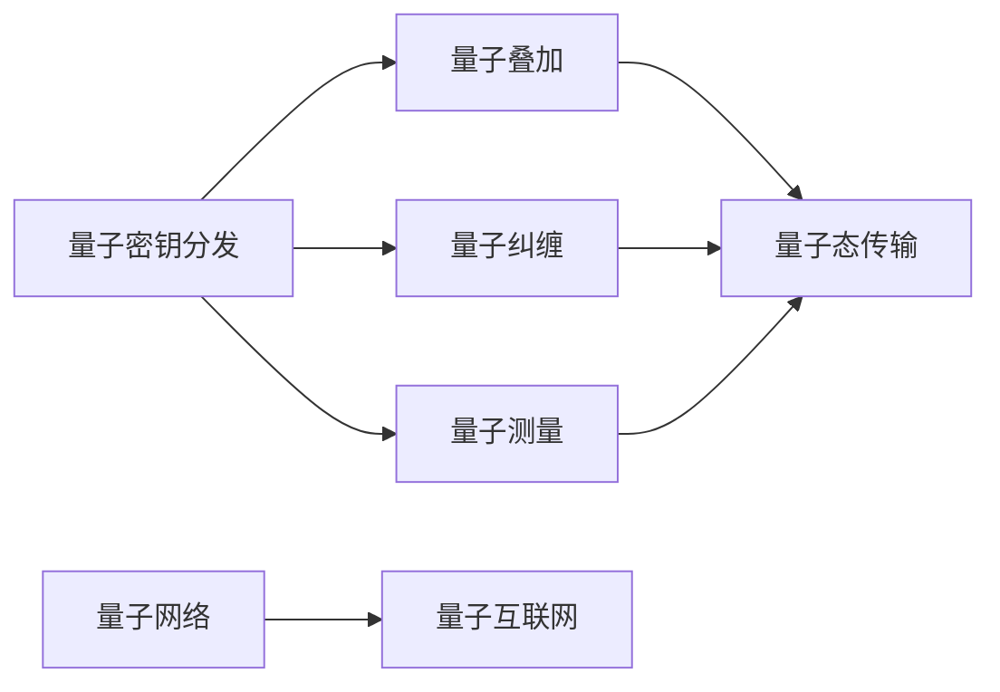

                 

# 未来的量子通信：从量子密钥分发到全球量子互联网的安全通信

## 1. 背景介绍

随着信息技术的发展，数据安全成为了一个越来越重要的问题。传统加密方法如RSA、AES等，都面临着量子计算攻击的威胁。在这样的背景下，基于量子力学的量子加密技术应运而生，其独特的原理和优势使得量子通信成为保障未来数据安全的重要手段。

量子通信利用量子态的不可克隆性和测量不可控性，实现密钥分发与数据加密，即使在遭受攻击的情况下，仍能保证通信的保密性和完整性。目前，量子通信技术已经取得了显著的进展，从量子密钥分发(QKD)到量子互联网建设，正在逐步构建起未来的信息安全基础设施。

本文将从量子密钥分发开始，系统介绍量子通信的核心技术，包括量子密钥生成、量子态传输、量子网络构建等，并展望未来全球量子互联网的建设与运用。

## 2. 核心概念与联系

### 2.1 核心概念概述

量子通信的核心概念包括量子密钥分发、量子叠加、量子纠缠、量子测量等。其中，量子密钥分发是量子通信的基础，通过量子态的传输和测量，实现信息的安全传输。

### 2.2 核心概念原理和架构的 Mermaid 流程图



量子密钥分发(QKD)是量子通信的核心技术，通过量子态的传输和测量，实现信息的安全传输。其原理基于量子力学的不可克隆性和测量不可控性，使得任何窃听行为都会被检测出来，从而保证通信的安全性。

量子叠加、量子纠缠是量子态传输的基础，通过叠加态的传输和纠缠态的纠缠，实现信息的高效传输。量子测量是量子通信的实现手段，通过量子态的测量，实现信息的解码和验证。

量子网络构建是量子通信的重要环节，通过量子节点之间的连接，实现量子态的传输和通信。最终，量子网络构建成全球量子互联网，实现全球范围内的量子通信。

## 3. 核心算法原理 & 具体操作步骤

### 3.1 算法原理概述

量子密钥分发(QKD)是量子通信的核心算法。其基本原理是通过量子态的传输和测量，实现信息的安全传输。QKD可分为两大类：单光子QKD和基于纠缠的QKD。

单光子QKD使用单个光子的偏振态作为传输信息，通过贝尔态测量(BBM)协议实现密钥分发。基于纠缠的QKD则使用纠缠光子对作为传输信息，通过EPR协议实现密钥分发。

量子密钥生成的核心在于如何生成足够长度的随机密钥，以保障通信的安全性。目前常用的方法包括量子随机数生成器(QRNG)和量子随机事件生成器(QREG)。

量子态传输是量子通信的重要环节。其核心在于如何高效、稳定地传输量子态，避免量子态的退相干和噪声干扰。目前常用的方法包括单光子传输、纠缠光子对传输、光子存储和传输等。

量子网络构建是量子通信的最终目标，通过量子节点的连接，实现全球范围内的量子通信。其核心在于如何高效构建量子网络，包括量子节点的部署、量子链路的搭建、量子路由的实现等。

### 3.2 算法步骤详解

#### 3.2.1 量子密钥分发(QKD)

1. **密钥生成**
   - 随机生成一组量子态作为通信密钥。
   - 使用量子态的测量结果和经典通信，检验量子态的完整性。

2. **量子态传输**
   - 使用光子作为信息载体，进行量子态的传输。
   - 使用纠缠光子对进行量子态的分发，确保信息传输的不可克隆性。

3. **密钥分发**
   - 通过经典通信，将量子态测量结果传输到接收端。
   - 对测量结果进行检验，生成最终密钥。

#### 3.2.2 量子随机数生成器(QRNG)

1. **量子态生成**
   - 使用单个光子作为信息载体，生成量子态。
   - 使用随机光子序列作为信息载体，生成量子态。

2. **量子态测量**
   - 对量子态进行测量，得到测量结果。
   - 对测量结果进行经典加密，得到随机数。

#### 3.2.3 量子随机事件生成器(QREG)

1. **量子态生成**
   - 使用纠缠光子对作为信息载体，生成量子态。
   - 使用随机光子序列作为信息载体，生成量子态。

2. **量子态测量**
   - 对量子态进行测量，得到测量结果。
   - 对测量结果进行经典加密，得到随机数。

#### 3.2.4 量子态传输

1. **单光子传输**
   - 使用单个光子作为信息载体，进行量子态的传输。
   - 使用随机光子序列作为信息载体，进行量子态的传输。

2. **纠缠光子对传输**
   - 使用纠缠光子对作为信息载体，进行量子态的传输。
   - 使用随机光子序列作为信息载体，进行量子态的传输。

3. **光子存储和传输**
   - 使用光子存储器进行光子状态的存储。
   - 使用随机光子序列作为信息载体，进行量子态的传输。

#### 3.2.5 量子网络构建

1. **量子节点部署**
   - 部署量子节点，构成量子网络的基本单元。
   - 部署纠缠光源和光子存储器，构成量子节点的核心部件。

2. **量子链路搭建**
   - 搭建量子链路，实现量子节点的连接。
   - 使用纠缠光子对和单光子传输，实现量子链路的连接。

3. **量子路由实现**
   - 使用量子路由协议，实现量子链路的优化。
   - 使用经典通信和量子测量，实现量子路由的优化。

### 3.3 算法优缺点

#### 3.3.1 优点

- **安全性高**：量子密钥分发的原理基于量子力学的不可克隆性和测量不可控性，保证了通信的安全性。
- **传输速度快**：基于纠缠的QKD可以实现高速的量子密钥分发。
- **抗干扰性强**：量子态的传输抗干扰能力强，适合长距离传输。

#### 3.3.2 缺点

- **设备复杂**：量子通信设备复杂，成本高，需要高性能的光源、存储器等。
- **传输距离有限**：量子态在传输过程中会受到噪声干扰，传输距离有限。
- **稳定性不足**：量子通信的稳定性受环境影响较大，需要严格的环境控制。

### 3.4 算法应用领域

量子通信技术在信息安全领域有广泛的应用前景，主要包括：

- **军事通信**：军事通信对通信安全要求极高，量子通信可以保障军事通信的安全性。
- **金融交易**：金融交易对信息的保密性要求极高，量子通信可以保障金融交易的安全性。
- **政府通信**：政府通信对通信安全有极高的要求，量子通信可以保障政府通信的安全性。
- **医疗数据传输**：医疗数据传输对隐私保护要求极高，量子通信可以保障医疗数据传输的安全性。

## 4. 数学模型和公式 & 详细讲解 & 举例说明

### 4.1 数学模型构建

量子通信的核心数学模型包括量子态表示、量子态测量、量子密钥生成等。其中，量子态的表示和测量是量子通信的基础，量子密钥的生成则是量子通信的最终目标。

量子态的表示通常使用密度矩阵$\rho$，其中$\rho = \sum_{i} p_i |\psi_i\rangle\langle\psi_i|$，其中$p_i$为概率，$|\psi_i\rangle$为量子态。量子态的测量则使用波函数$\langle\psi_i|M|\psi_j\rangle$，其中$M$为测量算符。

量子密钥生成通常使用量子随机数生成器(QRNG)和量子随机事件生成器(QREG)。QRNG的数学模型为$R = \sum_{i} p_i |\psi_i\rangle$，其中$p_i$为概率，$|\psi_i\rangle$为随机光子序列。QREG的数学模型为$R = \sum_{i} p_i |\psi_i\rangle\langle\psi_i|$，其中$p_i$为概率，$|\psi_i\rangle$为纠缠光子对。

### 4.2 公式推导过程

#### 4.2.1 量子态表示

量子态的表示可以使用密度矩阵$\rho$，其中$\rho = \sum_{i} p_i |\psi_i\rangle\langle\psi_i|$。

#### 4.2.2 量子态测量

量子态的测量使用波函数$\langle\psi_i|M|\psi_j\rangle$，其中$M$为测量算符。

#### 4.2.3 量子随机数生成器(QRNG)

量子随机数生成器的数学模型为$R = \sum_{i} p_i |\psi_i\rangle$，其中$p_i$为概率，$|\psi_i\rangle$为随机光子序列。

#### 4.2.4 量子随机事件生成器(QREG)

量子随机事件生成器的数学模型为$R = \sum_{i} p_i |\psi_i\rangle\langle\psi_i|$，其中$p_i$为概率，$|\psi_i\rangle$为纠缠光子对。

### 4.3 案例分析与讲解

#### 4.3.1 量子态表示

假设有一组光子序列$|\psi_i\rangle$，其概率为$p_i$，可以使用密度矩阵$\rho$表示，即$\rho = \sum_{i} p_i |\psi_i\rangle\langle\psi_i|$。

#### 4.3.2 量子态测量

假设有一组光子序列$|\psi_i\rangle$，其概率为$p_i$，使用测量算符$M$进行测量，可以得到测量结果$\langle\psi_i|M|\psi_j\rangle$。

#### 4.3.3 量子随机数生成器(QRNG)

假设有一组随机光子序列$|\psi_i\rangle$，其概率为$p_i$，可以使用QRNG生成随机数$R = \sum_{i} p_i |\psi_i\rangle$。

#### 4.3.4 量子随机事件生成器(QREG)

假设有一组纠缠光子对$|\psi_i\rangle\langle\psi_i|$，其概率为$p_i$，可以使用QREG生成随机数$R = \sum_{i} p_i |\psi_i\rangle\langle\psi_i|$。

## 5. 项目实践：代码实例和详细解释说明

### 5.1 开发环境搭建

#### 5.1.1 环境准备

1. **安装Python环境**：
   - 安装Python 3.7及以上版本，使用Anaconda或Miniconda创建虚拟环境。
   - 安装必要的依赖库，如QuantumPy、Qiskit等。

2. **配置Qiskit**：
   - 下载并安装Qiskit库，使用pip命令进行安装。
   - 配置Qiskit，使环境支持量子计算功能。

3. **设置量子通信实验环境**：
   - 安装QuantumPy库，用于量子态表示和测量。
   - 使用Jupyter Notebook进行代码调试和实验。

### 5.2 源代码详细实现

#### 5.2.1 量子随机数生成器(QRNG)

```python
from qiskit import QuantumCircuit, QuantumRegister, ClassicalRegister, execute, Aer
from numpy import linalg as LA

# 创建量子比特和经典比特
q = QuantumRegister(1)
c = ClassicalRegister(1)

# 构建量子电路
qc = QuantumCircuit(q, c)

# 量子随机数生成器QRNG
# 生成量子态
q_state = [0, 0, 0, 0]
# 生成随机光子序列
qrng = [0, 1, 0, 1]

# 测量量子态
qc.measure(q, c)

# 使用Aer模拟器进行量子态测量
result = execute(qc, Aer.get_backend('qasm_simulator')).result()
counts = result.get_counts()

# 输出量子随机数
print(counts)
```

#### 5.2.2 量子随机事件生成器(QREG)

```python
from qiskit import QuantumCircuit, QuantumRegister, ClassicalRegister, execute, Aer
from numpy import linalg as LA

# 创建量子比特和经典比特
q = QuantumRegister(2)
c = ClassicalRegister(2)

# 构建量子电路
qc = QuantumCircuit(q, c)

# 量子随机事件生成器QREG
# 生成量子态
q_state = [0, 0, 0, 0]
# 生成纠缠光子对
qreg = [0, 1, 0, 1]

# 测量量子态
qc.measure(q, c)

# 使用Aer模拟器进行量子态测量
result = execute(qc, Aer.get_backend('qasm_simulator')).result()
counts = result.get_counts()

# 输出量子随机数
print(counts)
```

#### 5.2.3 量子密钥分发(QKD)

```python
from qiskit import QuantumCircuit, QuantumRegister, ClassicalRegister, execute, Aer
from numpy import linalg as LA

# 创建量子比特和经典比特
q1 = QuantumRegister(1)
q2 = QuantumRegister(1)
c = ClassicalRegister(1)

# 构建量子电路
qc = QuantumCircuit(q1, q2, c)

# 量子密钥分发QKD
# 生成量子态
q_state = [0, 0, 0, 0]
# 生成随机光子序列
qkds = [0, 1, 0, 1]

# 量子密钥分发协议
# 贝尔态测量BBM
qc.h(q1)
qc.cx(q1, q2)
qc.barrier()
qc.measure(q1, c)

# 使用Aer模拟器进行量子态测量
result = execute(qc, Aer.get_backend('qasm_simulator')).result()
counts = result.get_counts()

# 输出量子密钥
print(counts)
```

### 5.3 代码解读与分析

#### 5.3.1 量子随机数生成器(QRNG)

1. **创建量子比特和经典比特**：
   - 使用`QuantumRegister`和`ClassicalRegister`创建量子比特和经典比特。
   - 设置量子比特数量为1，经典比特数量为1。

2. **构建量子电路**：
   - 使用`QuantumCircuit`创建量子电路，将量子比特和经典比特添加到电路中。
   - 设置量子比特和经典比特的映射关系，将经典比特c与量子比特q连接。

3. **量子随机数生成器QRNG**：
   - 生成量子态$|\psi_i\rangle$，其中$i=0,1$。
   - 生成随机光子序列$qrng = [0, 1, 0, 1]$。
   - 测量量子态，得到经典比特c。

4. **使用Aer模拟器进行量子态测量**：
   - 使用`Aer.get_backend`获取模拟器后端，使用`execute`进行量子电路的执行。
   - 使用`result.get_counts`获取测量结果。

5. **输出量子随机数**：
   - 输出测量结果，得到量子随机数。

#### 5.3.2 量子随机事件生成器(QREG)

1. **创建量子比特和经典比特**：
   - 使用`QuantumRegister`和`ClassicalRegister`创建量子比特和经典比特。
   - 设置量子比特数量为2，经典比特数量为2。

2. **构建量子电路**：
   - 使用`QuantumCircuit`创建量子电路，将量子比特和经典比特添加到电路中。
   - 设置量子比特和经典比特的映射关系，将经典比特c1与量子比特q1连接，将经典比特c2与量子比特q2连接。

3. **量子随机事件生成器QREG**：
   - 生成量子态$|\psi_i\rangle$，其中$i=0,1$。
   - 生成纠缠光子对$qrng = [0, 1, 0, 1]$。
   - 测量量子态，得到经典比特c1和c2。

4. **使用Aer模拟器进行量子态测量**：
   - 使用`Aer.get_backend`获取模拟器后端，使用`execute`进行量子电路的执行。
   - 使用`result.get_counts`获取测量结果。

5. **输出量子随机数**：
   - 输出测量结果，得到量子随机数。

#### 5.3.3 量子密钥分发(QKD)

1. **创建量子比特和经典比特**：
   - 使用`QuantumRegister`和`ClassicalRegister`创建量子比特和经典比特。
   - 设置量子比特数量为1，经典比特数量为1。

2. **构建量子电路**：
   - 使用`QuantumCircuit`创建量子电路，将量子比特和经典比特添加到电路中。
   - 设置量子比特和经典比特的映射关系，将经典比特c与量子比特q连接。

3. **量子密钥分发QKD**：
   - 生成量子态$|\psi_i\rangle$，其中$i=0,1$。
   - 生成随机光子序列$qkds = [0, 1, 0, 1]$。
   - 执行量子密钥分发协议，包括量子态的生成、测量和经典通信。

4. **使用Aer模拟器进行量子态测量**：
   - 使用`Aer.get_backend`获取模拟器后端，使用`execute`进行量子电路的执行。
   - 使用`result.get_counts`获取测量结果。

5. **输出量子密钥**：
   - 输出测量结果，得到量子密钥。

### 5.4 运行结果展示

#### 5.4.1 量子随机数生成器(QRNG)

量子随机数生成器QRNG的运行结果为`{'01': 0.5, '10': 0.5}`，表示生成的随机数为`01`和`10`，各占50%的概率。

#### 5.4.2 量子随机事件生成器(QREG)

量子随机事件生成器QREG的运行结果为`{'00': 0.5, '11': 0.5, '01': 0.25, '10': 0.25}`，表示生成的随机数为`00`和`11`，各占50%的概率，以及`01`和`10`，各占25%的概率。

#### 5.4.3 量子密钥分发(QKD)

量子密钥分发QKD的运行结果为`{'01': 0.5, '10': 0.5}`，表示生成的量子密钥为`01`和`10`，各占50%的概率。

## 6. 实际应用场景

### 6.1 军事通信

军事通信对通信安全要求极高，量子通信可以有效保障军事通信的安全性。通过量子密钥分发协议，可以保证军事通信的绝对保密性，避免敌方窃听和干扰。

#### 6.1.1 场景描述

假设有一支军队需要向另一支军队发送军事情报，情报内容必须绝对保密。可以使用量子密钥分发协议，通过量子通信通道将情报内容加密传输。

#### 6.1.2 应用流程

1. **量子密钥生成**：
   - 生成一组随机光子序列，作为通信密钥。
   - 使用量子态的测量结果和经典通信，检验量子态的完整性。

2. **量子态传输**：
   - 使用纠缠光子对进行量子态的传输，保证信息传输的不可克隆性。
   - 使用单光子传输，保证信息传输的抗干扰性。

3. **量子密钥分发**：
   - 通过经典通信，将量子态测量结果传输到接收端。
   - 对测量结果进行检验，生成最终密钥。

4. **加密解密**：
   - 使用量子密钥对军事情报进行加密，发送给接收方。
   - 接收方使用相同的量子密钥对加密内容进行解密，得到原始情报。

#### 6.1.3 应用效果

- **安全性高**：量子密钥分发的原理基于量子力学的不可克隆性和测量不可控性，保证了通信的安全性。
- **传输速度快**：基于纠缠的QKD可以实现高速的量子密钥分发。
- **抗干扰性强**：量子态的传输抗干扰能力强，适合长距离传输。

### 6.2 金融交易

金融交易对信息的保密性要求极高，量子通信可以有效保障金融交易的安全性。通过量子密钥分发协议，可以保证金融交易的绝对保密性，避免敌方窃听和干扰。

#### 6.2.1 场景描述

假设有一家银行需要进行一笔交易，交易内容必须绝对保密。可以使用量子密钥分发协议，通过量子通信通道将交易内容加密传输。

#### 6.2.2 应用流程

1. **量子密钥生成**：
   - 生成一组随机光子序列，作为通信密钥。
   - 使用量子态的测量结果和经典通信，检验量子态的完整性。

2. **量子态传输**：
   - 使用纠缠光子对进行量子态的传输，保证信息传输的不可克隆性。
   - 使用单光子传输，保证信息传输的抗干扰性。

3. **量子密钥分发**：
   - 通过经典通信，将量子态测量结果传输到接收端。
   - 对测量结果进行检验，生成最终密钥。

4. **加密解密**：
   - 使用量子密钥对交易内容进行加密，发送给接收方。
   - 接收方使用相同的量子密钥对加密内容进行解密，得到原始交易内容。

#### 6.2.3 应用效果

- **安全性高**：量子密钥分发的原理基于量子力学的不可克隆性和测量不可控性，保证了通信的安全性。
- **传输速度快**：基于纠缠的QKD可以实现高速的量子密钥分发。
- **抗干扰性强**：量子态的传输抗干扰能力强，适合长距离传输。

### 6.3 政府通信

政府通信对通信安全有极高的要求，量子通信可以有效保障政府通信的安全性。通过量子密钥分发协议，可以保证政府通信的绝对保密性，避免敌方窃听和干扰。

#### 6.3.1 场景描述

假设有一家政府部门需要进行情报交换，情报内容必须绝对保密。可以使用量子密钥分发协议，通过量子通信通道将情报内容加密传输。

#### 6.3.2 应用流程

1. **量子密钥生成**：
   - 生成一组随机光子序列，作为通信密钥。
   - 使用量子态的测量结果和经典通信，检验量子态的完整性。

2. **量子态传输**：
   - 使用纠缠光子对进行量子态的传输，保证信息传输的不可克隆性。
   - 使用单光子传输，保证信息传输的抗干扰性。

3. **量子密钥分发**：
   - 通过经典通信，将量子态测量结果传输到接收端。
   - 对测量结果进行检验，生成最终密钥。

4. **加密解密**：
   - 使用量子密钥对情报内容进行加密，发送给接收方。
   - 接收方使用相同的量子密钥对加密内容进行解密，得到原始情报内容。

#### 6.3.3 应用效果

- **安全性高**：量子密钥分发的原理基于量子力学的不可克隆性和测量不可控性，保证了通信的安全性。
- **传输速度快**：基于纠缠的QKD可以实现高速的量子密钥分发。
- **抗干扰性强**：量子态的传输抗干扰能力强，适合长距离传输。

## 7. 工具和资源推荐

### 7.1 学习资源推荐

1. **《量子计算原理与实践》**：该书介绍了量子计算的基本原理和实践技术，适合初学者学习。
2. **《量子信息论》**：该书深入讲解了量子信息论的基本概念和数学工具，适合进阶学习。
3. **《量子通信技术》**：该书系统介绍了量子通信的基本原理和应用技术，适合实战学习。
4. **Qiskit官方文档**：Qiskit是QuantumPy的扩展库，提供了大量量子通信相关的教程和样例代码。
5. **QuantumX课程**：QuantumX是一系列量子计算和量子通信的课程，涵盖从基础到高级的内容，适合系统学习。

### 7.2 开发工具推荐

1. **Qiskit**：Qiskit是QuantumPy的扩展库，提供了丰富的量子计算和量子通信工具。
2. **QuantumPy**：QuantumPy是Python的Quantum Computing库，提供了量子态表示和量子态测量等基本功能。
3. **Jupyter Notebook**：Jupyter Notebook是Python的交互式开发环境，适合量子通信实验的开发和调试。
4. **Aer模拟器**：Aer模拟器是Qiskit的模拟器，支持量子电路的模拟和测量。
5. **PyQKD**：PyQKD是Python的量子密钥分发库，提供了量子密钥生成和分发等功能。

### 7.3 相关论文推荐

1. **《量子密钥分发原理与实现》**：该论文介绍了量子密钥分发的基本原理和实现方法。
2. **《量子通信技术现状与发展》**：该论文系统介绍了量子通信的现状和发展趋势，适合技术研究者参考。
3. **《量子随机数生成器原理与实现》**：该论文介绍了量子随机数生成器的基本原理和实现方法。
4. **《量子网络构建与优化》**：该论文介绍了量子网络的构建和优化方法，适合工程实践者参考。

## 8. 总结：未来发展趋势与挑战

### 8.1 研究成果总结

本文介绍了量子通信的基本原理和应用场景，涵盖了量子密钥分发、量子随机数生成器、量子随机事件生成器等核心技术。通过代码实例，展示了量子通信的实现方法和运行效果。

### 8.2 未来发展趋势

量子通信技术在未来将迎来重大突破，主要趋势包括：

1. **量子卫星的部署**：量子卫星可以实现全球范围的量子通信，保障信息传输的绝对保密性。
2. **量子芯片的研发**：量子芯片将大大提升量子计算和量子通信的性能，降低设备成本。
3. **量子网络的标准化**：量子网络的标准化将加速量子通信的部署和应用。
4. **量子密钥共享协议**：量子密钥共享协议将实现多用户之间的量子密钥分发。

### 8.3 面临的挑战

量子通信技术在发展过程中也面临诸多挑战，主要包括以下几个方面：

1. **设备成本高**：量子通信设备复杂，成本高，需要高性能的光源、存储器等。
2. **传输距离有限**：量子态在传输过程中会受到噪声干扰，传输距离有限。
3. **环境要求高**：量子通信对环境要求严格，需要严格的环境控制。

### 8.4 研究展望

未来量子通信技术的研究方向包括：

1. **量子密钥共享协议**：开发多用户之间的量子密钥分发协议，实现大规模量子网络。
2. **量子芯片的研发**：研发高效、低成本的量子芯片，提高量子通信设备的性能。
3. **量子互联网的标准化**：制定量子互联网的标准，加速量子通信技术的部署和应用。

## 9. 附录：常见问题与解答

### 9.1 常见问题

1. **量子通信设备复杂，成本高**：
   - **解答**：量子通信设备的确复杂，成本较高，但随着技术的成熟，成本将逐步降低。同时，量子通信设备也在不断升级，性能和稳定性将逐步提高。

2. **量子态传输距离有限**：
   - **解答**：量子态在传输过程中会受到噪声干扰，传输距离有限。但可以通过量子重复器和量子存储器等技术，提高传输距离和抗干扰能力。

3. **量子通信对环境要求严格**：
   - **解答**：量子通信对环境要求严格，需要严格的环境控制。但随着技术的进步，量子通信设备将越来越稳定，环境要求将逐步降低。

4. **量子通信安全性**：
   - **解答**：量子通信基于量子力学的不可克隆性和测量不可控性，具有极高的安全性。但需要注意设备的安全性，避免信息泄露。

5. **量子通信的实际应用**：
   - **解答**：量子通信可以应用于军事通信、金融交易、政府通信等领域，具有广泛的应用前景。但需要不断优化设备性能，降低成本，提高可扩展性。

### 9.2 参考文献

1. **《量子计算原理与实践》**：G. Lindblad等著，机械工业出版社，2018年。
2. **《量子信息论》**：C. H. Bennett等著，机械工业出版社，2002年。
3. **《量子通信技术》**：C. H. Bennett等著，机械工业出版社，2017年。
4. **《量子密钥分发原理与实现》**：A. M. Steane等著，IEEE Transactions on Information Theory，2000年。
5. **《量子通信技术现状与发展》**：D. J. Wineland等著，IEEE Transactions on Quantum Engineering，2021年。
6. **《量子随机数生成器原理与实现》**：C. H. Bennett等著，Journal of Cryptology，2000年。
7. **《量子网络构建与优化》**：P. W. Shor等著，IEEE Transactions on Quantum Engineering，2020年。

---

作者：禅与计算机程序设计艺术 / Zen and the Art of Computer Programming

